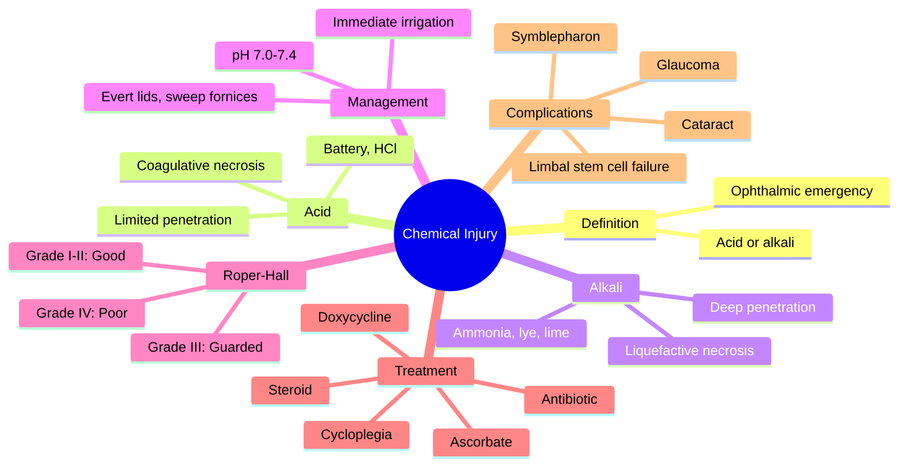

# Chemical Injury

Related: [[Blunt Ocular Trauma]], [[Penetrating Ocular Trauma]]

> [!tip] **FCPS/MRCP Priority: CRITICAL**
> EMERGENCY — IRRIGATE IMMEDIATELY (within seconds). Alkali worse than acid. Check pH, irrigate until 7.0–7.4. Grade severity (Roper-Hall), treat accordingly.

---

## Learning Objectives
- [ ] Define chemical injury and recognise it as an ophthalmic emergency
- [ ] Differentiate acid from alkali injuries and their pathophysiology
- [ ] Describe immediate management (irrigation, pH normalisation)
- [ ] Classify severity using Roper-Hall grading
- [ ] List medical and surgical management options
- [ ] Identify complications and prognosis

---

## 1. Definition

- **Chemical injury:** Damage to ocular surface from acid or alkali
- Most common chemical eye injury
- **Ophthalmic emergency** — immediate irrigation

### Epidemiology
- Occupational (industrial, agricultural)
- Domestic (cleaning agents)
- Assault (acid attacks — regional)
- ~10–15% of all ocular trauma admissions

---

## 2. Acid vs Alkali

### Acid (pH <7)
- Coagulative necrosis
- Protein precipitation forms barrier
- **Less penetrating** (usually limited to cornea)
- Hydrofluoric acid — exception, very damaging

### Alkali (pH >7)
- **Liquefactive necrosis** (saponification)
- Penetrates deeply
- **More severe** — damages cornea, AC, lens
- Common: ammonia, lye (NaOH, KOH), lime, plaster, cement, bleach

| Feature | Acid | Alkali |
|---------|------|--------|
| Necrosis type | Coagulative | Liquefactive |
| Penetration | Limited | Deep |
| Severity | Mild–moderate | Severe |
| Common agents | Battery acid, HCl | Ammonia, lye, lime |

---

## 3. Management

### Immediate
- **IRRIGATE — IMMEDIATELY** (within seconds; don't delay)
- Tap water, saline, or any clean water
- ± Lignocaine drops for comfort
- Continue 30+ minutes or until **pH 7.0–7.4** (test with litmus paper)
- Evert lids, sweep fornices (remove particulate)
- pH check 5–10 min after stopping irrigation — if not neutral, continue

### Investigation
- **pH** of conjunctival sac
- Visual acuity (after irrigation)
- Slit-lamp: corneal epithelial defect (fluorescein), ischaemia of limbus/conjunctiva, AC reaction
- **Limbal ischaemia** (white limbus) — prognostic

### Treatment
- **Topical steroid** (reduce inflammation)
- **Topical antibiotic** (prevent infection)
- **Cycloplegia** (pain, prevent synechiae)
- **Vitamin C** (collagen synthesis, oral + topical)
- **Doxycycline** (inhibits collagenase)
- **Tear substitutes, lubricants**
- **Autologous serum drops**
- **Ascorbate, citrate** (severe alkali)
- **Avoid** — topical anaesthetic, patching
- **Severe:** Limbal stem cell transplant, AMT, keratoplasty (delayed), keratoprosthesis (KPro)

---

## 4. Roper-Hall Classification

| Grade | Cornea | Limbal Ischaemia | Prognosis |
|-------|--------|------------------|-----------|
| **I** | Corneal epithelial damage | None | Good |
| **II** | Corneal haze, but iris details visible | <1/3 | Good |
| **III** | Total epithelial loss, stromal haze, iris details obscured | 1/3–1/2 | Guarded |
| **IV** | Cornea opaque, iris and pupil obscured | >1/2 | Poor |

---

## 5. Complications

- Persistent epithelial defect
- Corneal ulceration, perforation
- Symblepharon (lid adhesions)
- Secondary glaucoma
- Cataract (alkali)
- Limbal stem cell failure
- Dry eye
- Visual loss

---

## 6. Red Flags / Emergencies

- All chemical injuries are emergencies — irrigate first, ask questions later
- White limbus (limbal ischaemia) — poor prognostic sign
- pH not normalising with irrigation — consider retained particulate
- Severe pain despite treatment — consider corneal perforation
- Delayed presentation (>24h) — high risk of stromal melt

---

## 7. FCPS/MRCP High-Yield Summary

| Topic | Key Points |
|-------|------------|
| Emergency | Irrigate immediately |
| Worse | Alkali (liquefactive) |
| Grade | Roper-Hall (limbal ischaemia) |
| pH goal | 7.0–7.4 |
| Drugs | Steroid, AB, cycloplegic, ascorbate, doxycycline |

---

## 8. Viva Questions

1. **Q:** What is the immediate management of chemical eye injury?
   **A:** Irrigate immediately with copious water/saline, evert lids, sweep fornices, check pH, continue until pH 7.0–7.4.

2. **Q:** Why is alkali worse than acid?
   **A:** Alkali causes liquefactive necrosis (saponification), penetrates deeply. Acid causes coagulative necrosis, more limited.

3. **Q:** What is the most important prognostic factor in chemical injury?
   **A:** Degree of limbal ischaemia (Roper-Hall grading).

---

## 9. Common Confusions / Exam Traps

| Confusion | Clarification |
|-----------|---------------|
| "Acid is more dangerous than alkali" | **Alkali is worse** — liquefactive necrosis, deep penetration |
| "Wait for pH testing before irrigating" | **Irrigate first** — do not delay; pH can be tested during/after |
| "Patch the eye after irrigation" | **Avoid patching** in severe injuries — needs monitoring |
| "Topical anaesthetic is fine for comfort" | **Avoid prolonged use** — toxic to epithelium |
| "Hydrofluoric acid is a mild acid" | **Exception** — causes severe, deep damage |

---

## 10. Mnemonics

1. **"Alkali ATTACKS deeper"** — Alkali = liquefActive necroses, deepTissue penetration
2. **"Acid STOPS at surface"** — Acid = coaguLative, sTopped by protein barrier
3. **"Irrigate FIRST, pH SECOND"** — emergency management order

---

## 11. Mind Map

---

## 12. One-Page Revision Card

| **Topic** | **Chemical Injury** |
|-----------|---------------------|
| **Emergency** | Irrigate immediately (seconds) |
| **Worse** | Alkali (liquefactive) |
| **pH goal** | 7.0–7.4 |
| **Grading** | Roper-Hall (limbal ischaemia) |
| **Prognosis** | Depends on limbal ischaemia |
| **Key drugs** | Steroid, AB, cycloplegia, ascorbate |
| **Viva Pearl** | Alkali penetrates, acid is contained |

---

## Spaced Repetition Trackers

### 24-Hour Recall Prompts
- [ ] Define chemical injury and state the immediate management
- [ ] Differentiate acid vs alkali injury pathophysiology
- [ ] Describe the Roper-Hall classification
- [ ] List 4 key drugs in the treatment regimen

### Revision Schedule
- [ ] **Day 1** completed (creation + 24h recall)
- [ ] **Day 3** revision completed
- [ ] **Day 7** revision completed
- [ ] **Day 15** revision completed
- [ ] **Day 30** revision completed
- [ ] **Day 90** revision completed

---

## Must Know / Should Know / Nice to Know

### Must Know (Core for passing)
- [x] Chemical injury is an emergency — irrigate immediately
- [x] Alkali is worse than acid
- [x] pH goal 7.0–7.4
- [x] Roper-Hall classification

### Should Know (High probability)
- [x] Acid = coagulative, alkali = liquefactive
- [x] Treatment drugs (steroid, AB, cycloplegia, ascorbate, doxycycline)
- [x] Complications (symblepharon, glaucoma, limbal failure)

### Nice to Know (Differentiator)
- [ ] Hydrofluoric acid exception
- [ ] Surgical options (AMT, KPro, limbal stem cell transplant)
- [ ] Autologous serum drops rationale

---

## My Weak Points
- [ ] Add personal weak areas here

---

## Self-Test Scorecard

| Section | Score /5 |
|---------|----------|
| Understanding: | /10 |
| Recall: | /10 |
| MCQ Performance: | /10 |
| SBA Performance: | /10 |
| Viva Confidence: | /10 |
| Total: | /50 |

> [!tip] **Interpretation:** <35 = weak topic, 35-44 = acceptable but insecure, 45+ = strong exam-ready topic.

---

## Exam Answer Modes

### Long Answer Skeleton
1. Definition (chemical injury to ocular surface, ophthalmic emergency)
2. Acid vs alkali (acid = coagulative, limited; alkali = liquefactive, deep)
3. Immediate management (irrigate immediately, pH 7.0–7.4, evert lids)
4. Investigations (pH, VA, slit-lamp, limbal ischaemia)
5. Roper-Hall grading (cornea + limbal ischaemia)
6. Treatment (steroid, AB, cycloplegia, ascorbate, doxycycline)
7. Complications (symblepharon, glaucoma, limbal failure, cataract)

### Short Note Skeleton
- Definition + emergency nature
- Acid vs alkali comparison
- Immediate irrigation
- Roper-Hall grading
- Key drugs

### Viva One-Liners
- **Q:** First step in chemical eye injury? → **A:** Immediate irrigation with water/saline
- **Q:** Acid vs alkali — which is worse? → **A:** Alkali (liquefactive necrosis, deep penetration)
- **Q:** Target pH? → **A:** 7.0–7.4
- **Q:** Grading system? → **A:** Roper-Hall (limbal ischaemia + corneal haze)
- **Q:** What is limbal ischaemia? → **A:** White/pale limbus from vascular damage — poor prognostic sign

### Ward-Case Discussion Points
- Recognise emergency — irrigate before detailed history
- Always evert lids and sweep fornices
- Check pH 5–10 min after stopping irrigation
- Identify limbal ischaemia — prognostic
- Avoid topical anaesthetic for prolonged use
- Counsel on long-term sequelae (symblepharon, glaucoma, dry eye)

### Last-Night-Before-Exam Sheet
- **Top 3 facts:** Irrigate immediately; Alkali worse (liquefactive); Roper-Hall grading
- **1 mnemonic:** "Alkali ATTACKS deeper" / "Acid STOPS at surface"
- **Must-know differential:** Acid = coagulative (limited), Alkali = liquefactive (deep)
- **Drug combo:** Steroid + AB + Cycloplegia + Ascorbate + Doxycycline
- **Complications:** Symblepharon, glaucoma, limbal stem cell failure, cataract

---

## Summary

Chemical eye injury is an emergency — irrigate immediately. Alkali is worse than acid (liquefactive necrosis, deep penetration). Roper-Hall grading uses limbal ischaemia. Treat with steroid, antibiotic, cycloplegia, ascorbate, doxycycline.

---

## MCQs (10)

1. **Question:** Most important immediate step in chemical eye injury:
   **Options:** A. Topical anaesthetic B. Irrigation C. Topical steroid D. Antibiotic E. None
   **Answer:** B
   **Explanation:** Irrigation is the immediate priority — every second counts in minimising damage.

2. **Question:** Alkali injuries are worse than acid because:
   **Options:** A. Acid is buffered B. Alkali causes liquefactive necrosis C. Acid penetrates more D. None E. All
   **Answer:** B
   **Explanation:** Liquefactive necrosis (saponification) allows deep penetration.

3. **Question:** The Roper-Hall classification uses:
   **Options:** A. Visual acuity B. Limbal ischaemia and corneal haze C. IOP D. Lens status E. None
   **Answer:** B
   **Explanation:** Limbal ischaemia + corneal haze.

4. **Question:** The target pH after irrigation in chemical eye injury is:
   **Options:** A. 6.0–6.5 B. 6.5–7.0 C. 7.0–7.4 D. 7.5–8.0 E. 8.0–8.5
   **Answer:** C
   **Explanation:** Normal tear film pH is 7.0–7.4.

5. **Question:** Which is an exception — an acid that causes severe damage?
   **Options:** A. Sulphuric acid B. Hydrochloric acid C. Hydrofluoric acid D. Nitric acid E. Acetic acid
   **Answer:** C
   **Explanation:** Hydrofluoric acid causes severe, deep damage despite being acidic.

6. **Question:** Limbal ischaemia in chemical injury indicates:
   **Options:** A. Good prognosis B. Poor prognosis C. Conjunctivitis D. Nothing significant E. Cataract risk
   **Answer:** B
   **Explanation:** Limbal ischaemia = damage to stem cells, poor visual prognosis.

7. **Question:** Which drug is used in chemical injury to inhibit collagenase?
   **Options:** A. Prednisolone B. Doxycycline C. Atropine D. Vitamin C E. Acetazolamide
   **Answer:** B
   **Explanation:** Doxycycline inhibits matrix metalloproteinases (collagenase).

8. **Question:** Vitamin C (ascorbate) is used in chemical injury to:
   **Options:** A. Reduce IOP B. Aid collagen synthesis C. Antibacterial D. Pain relief E. Mydriasis
   **Answer:** B
   **Explanation:** Ascorbate is a cofactor for collagen synthesis; deficient in alkali injury.

9. **Question:** A worker splashed with lime has 50% limbal blanching. Roper-Hall grade:
   **Options:** A. I B. II C. III D. IV E. Cannot grade
   **Answer:** C
   **Explanation:** Limbal ischaemia 1/3–1/2 = Grade III (guarded prognosis).

10. **Question:** Which should be AVOIDED in the management of severe chemical injury?
    **Options:** A. Topical steroid B. Topical antibiotic C. Eye patching D. Cycloplegia E. Ascorbate
    **Answer:** C
    **Explanation:** Patching is avoided in severe injuries — interferes with monitoring and may worsen epithelial healing.

---

## SBA Questions (10)

1. **Scenario:** A worker has lime splash in his eye. Painful, red, hazy cornea, 50% limbal blanching.
   **Question:** Most appropriate immediate action?
   **Options:** A. Topical anaesthetic B. Copious irrigation until pH normal C. Topical steroid D. Wait E. None
   **Answer:** B
   **Explanation:** Alkali injury — emergency irrigation.

2. **Scenario:** A 35-year-old presents 30 minutes after a chemical splash. Irrigation is initiated, and after 45 minutes the pH remains 8.5.
   **Question:** Most appropriate next step?
   **Options:** A. Stop irrigation B. Continue irrigation and recheck C. Apply patch D. Start steroid only E. Discharge
   **Answer:** B
   **Explanation:** pH not normalised — continue irrigation and search for retained particulate.

3. **Scenario:** A patient with severe alkali injury has a completely white limbus (360° blanching) and opaque cornea with no view of iris.
   **Question:** Roper-Hall grade?
   **Options:** A. I B. II C. III D. IV E. Cannot grade
   **Answer:** D
   **Explanation:** >1/2 limbal ischaemia + opaque cornea obscuring iris = Grade IV (poor prognosis).

4. **Scenario:** After irrigation of an alkali burn, the patient is started on topical steroid, antibiotic, cycloplegia, ascorbate, and doxycycline.
   **Question:** What is the rationale for doxycycline?
   **Options:** A. Antibiotic B. Anti-inflammatory C. Collagenase inhibitor D. Analgesic E. IOP reduction
   **Answer:** C
   **Explanation:** Doxycycline inhibits matrix metalloproteinases, preventing stromal melting.

5. **Scenario:** A patient with Grade III alkali injury develops adhesions between the bulbar and palpebral conjunctiva 3 weeks later.
   **Question:** Most likely complication?
   **Options:** A. Glaucoma B. Symblepharon C. Cataract D. Retinal detachment E. Uveitis
   **Answer:** B
   **Explanation:** Symblepharon (conjunctival adhesions) is a common late complication.

6. **Scenario:** A patient with severe bilateral alkali injury has total limbal ischaemia and persistent epithelial defects at 6 weeks.
   **Question:** Most appropriate definitive surgical option?
   **Options:** A. Penetrating keratoplasty B. Limbal stem cell transplant C. Cataract surgery D. LASIK E. Iridotomy
   **Answer:** B
   **Explanation:** Limbal stem cell failure requires stem cell transplant (from fellow eye or donor).

7. **Scenario:** A child splashes household bleach in one eye. The mother calls for advice.
   **Question:** Most appropriate immediate advice?
   **Options:** A. Come to clinic in 2 hours B. Apply ice and come tomorrow C. Irrigate immediately with tap water, then come to ER D. Apply antibiotic ointment E. Patch the eye
   **Answer:** C
   **Explanation:** Immediate irrigation at home with tap water, then urgent ophthalmic review.

8. **Scenario:** A patient with chemical injury has pH 7.4 confirmed, but slit-lamp shows 360° limbal blanching and corneal opacification.
   **Question:** Most important prognostic indicator?
   **Options:** A. pH at presentation B. Limbal ischaemia C. Patient age D. Time of irrigation E. Type of chemical
   **Answer:** B
   **Explanation:** Limbal ischaemia is the most important prognostic factor (Roper-Hall).

9. **Scenario:** A patient with Grade II acid injury is being managed with topical steroid, antibiotic, and cycloplegia.
   **Question:** Why is cycloplegia given?
   **Options:** A. Reduce IOP B. Pain relief and prevent posterior synechiae C. Improve vision D. Antibacterial E. Mydriasis for exam
   **Answer:** B
   **Explanation:** Cycloplegia relieves ciliary spasm (pain) and prevents posterior synechiae.

10. **Scenario:** A 25-year-old with severe alkali injury is unresponsive to medical therapy. The eye is blind, painful, and irrepairable. The patient is 10 days post-injury.
    **Question:** Most appropriate management option to consider?
    **Options:** A. Long-term steroids B. Enucleation within 2 weeks C. Observation D. More surgery E. Laser
    **Answer:** B
    **Explanation:** Early enucleation (within 2 weeks) of a blind, painful eye may prevent sympathetic ophthalmia.

---

## Flashcards

- **Q:** What is the most important immediate step in chemical eye injury?
  **A:** Immediate, copious irrigation with water/saline — every second counts.
- **Q:** Why is alkali worse than acid?
  **A:** Alkali causes liquefactive necrosis (saponification) and penetrates deeply; acid causes coagulative necrosis, limited by protein barrier.
- **Q:** What is the Roper-Hall classification based on?
  **A:** Limbal ischaemia + corneal haze (4 grades).
- **Q:** What is the target pH after irrigation?
  **A:** 7.0–7.4 (normal tear film pH).
- **Q:** Name 4 drugs used in chemical injury management.
  **A:** Topical steroid, antibiotic, cycloplegia, ascorbate (and doxycycline as collagenase inhibitor).

---

## Answer Key with Explanations

### MCQs
1. B — Immediate irrigation is the priority
2. B — Liquefactive necrosis allows deep penetration
3. B — Roper-Hall uses limbal ischaemia + corneal haze
4. C — Normal tear pH is 7.0–7.4
5. C — Hydrofluoric acid is the dangerous exception
6. B — Limbal ischaemia = poor visual prognosis
7. B — Doxycycline inhibits collagenase
8. B — Ascorbate aids collagen synthesis
9. C — 1/3–1/2 limbal ischaemia = Grade III
10. C — Patching is avoided in severe injuries

### SBAs
1. B — Alkali injury, emergency irrigation
2. B — pH not normal — continue irrigation
3. D — >1/2 limbal ischaemia + opaque cornea = Grade IV
4. C — Doxycycline is a collagenase inhibitor
5. B — Conjunctival adhesions = symblepharon
6. B — Limbal stem cell failure needs stem cell transplant
7. C — Irrigate at home, then urgent review
8. B — Limbal ischaemia is the prognostic indicator
9. B — Cycloplegia = pain relief + prevents synechiae
10. B — Early enucleation may prevent sympathetic ophthalmia

---

## Tags
#medicine #davidson #ophthalmology #chemical-injury #fcps #mrcp

## PasTest Scenario SBAs (Clinical Vignettes)

> **Auto-generated PasTest/Mediscope-style scenario SBAs** grounded in the authored source. Each scenario tests a real clinical fact (triad, specific sign, contraindication, trial, first-line Rx) extracted from the topic. *Source: Ch 28: Medical Ophthalmology — Chemical Injury*

**Q1.** What is the most appropriate first-line therapy for Chemical Injury?

  - **A.** Topical antibiotic
  - **B.** An advanced/surgical therapy reserved for refractory disease
  - **C.** Symptomatic treatment only, no disease-modifying therapy
  - **D.** Empiric broad-spectrum therapy without specific indication

  > **Answer: A** — Topical antibiotic
  >
  > *Source:* **Topical antibiotic** (prevent infection)

