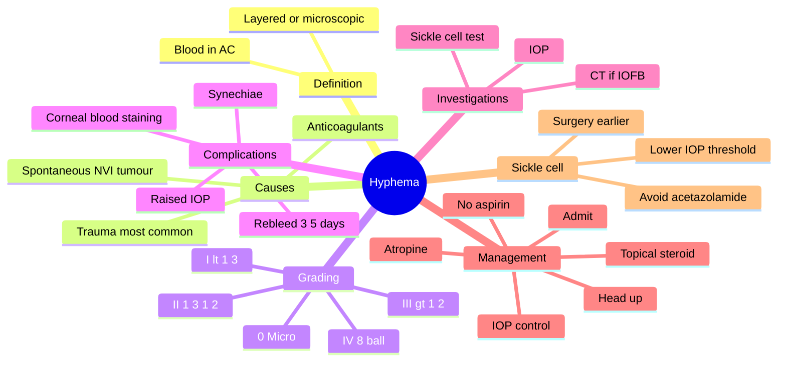

# Hyphema

Related: [[Blunt Ocular Trauma]], [[Sickle Cell Disease]]

> [!tip] **FCPS/MRCP Priority: HIGH**
> Blood in AC. Most resolve. Rebleed 3–5d = bad. Sickle cell patients need special care. Topical steroid, cycloplegia, IOP control. Avoid aspirin.

---

## Learning Objectives
- [ ] Define hyphema and identify common causes
- [ ] Grade hyphema by AC fill
- [ ] Recognise rebleed timing and risk
- [ ] Apply medical management
- [ ] Identify sickle cell implications
- [ ] State indications for surgical evacuation

---

## 1. Definition

- **Hyphema:** Blood in the anterior chamber
- Layered (gravity) or diffuse (microscopic)

---

## 2. Causes

- **Trauma (most common)** — blunt or penetrating
- **Spontaneous:**
  - Neovascularisation (PDR, CRVO)
  - Iris/ciliary body tumour (juvenile xanthogranuloma, melanoma)
  - Uveitis (herpetic)
  - Anticoagulants, coagulopathy
  - Post-surgical

---

## 3. Clinical Features

- Pain, blurred vision
- Red eye
- Layered blood in AC (visible)
- May be microscopic (only on slit-lamp)

---

## 4. Grading

- **Grade 0 (microscopic):** Only cells, no layered clot
- **Grade I:** <1/3 of AC
- **Grade II:** 1/3–1/2
- **Grade III:** 1/2 to nearly total
- **Grade IV (8-ball):** Total, "black ball" (no red reflex)

| Grade | AC Fill | Clinical Note |
|-------|---------|---------------|
| 0 (micro) | Cells only | Slit-lamp only |
| I | <1/3 | Often resolves |
| II | 1/3–1/2 | Monitor closely |
| III | 1/2 to nearly total | High rebleed risk |
| IV (8-ball) | Total | Surgical risk |

---

## 5. Complications

- **Rebleed** (3–5 days, larger, more severe)
- **↑ IOP** (early or late — angle recession)
- **Corneal blood staining** (especially with ↑IOP, prolonged)
- **Synechiae**
- **Amblyopia** (child)

---

## 6. Investigations

- Full ocular exam
- IOP (careful)
- Sickle cell test (especially African descent) — different management
- ± CT (rule out IOFB if penetrating)

---

## 7. Management

- **Admit** (often, especially moderate-large, child)
- **Bed rest, head elevated** (30–45°)
- **Topical steroid** (reduce inflammation, rebleed)
- **Cycloplegia** (atropine — pain, prevent synechiae)
- **Topical β-blocker** (IOP)
- ± **Oral acetazolamide** (IOP)
- **Avoid:** Aspirin, NSAIDs, anticoagulants, antiplatelets
- **Sickle cell:** Lower threshold for IOP control (acetazolamide ↑ sickling, methazolamide safer; avoid hyperosmotics if possible)
- **Surgical evacuation** (AC washout) if:
  - IOP >50 mmHg >5 days, or >35 >7 days
  - Total hyphema >5 days
  - Early corneal blood staining
  - Sickle cell + IOP >30 for >24h

---

## 8. Red Flags / Emergencies

- Rebleed at 3–5 days (larger, more severe)
- Total (8-ball) hyphema
- Sickle cell + raised IOP
- Suspected open globe or IOFB
- Child (amblyopia risk)
- Corneal blood staining

---

## 9. FCPS/MRCP Summary

| Topic | Key Points |
|-------|------------|
| Most common | Trauma |
| Rebleed | 3–5 days, worse |
| Grading | % of AC filled |
| Sickle cell | Lower IOP threshold |
| Avoid | Aspirin, anticoagulants |
| Surgery | ↑IOP, total hyphema, blood staining |

---

## 10. Viva Questions

1. **Q:** Why is sickle cell status important in hyphema?
   **A:** Sickle cell patients get optic nerve damage at lower IOP; acetazolamide ↑ sickling. Lower threshold for surgery.

2. **Q:** When does rebleed typically occur?
   **A:** 3–5 days after initial injury (as the original clot retracts/lyses).

3. **Q:** What is the role of topical atropine in hyphema?
   **A:** Cycloplegia — relieves ciliary spasm (pain) and prevents posterior synechiae.

---

## 11. Common Confusions / Exam Traps

| Confusion | Clarification |
|-----------|---------------|
| "Hyphema always needs surgery" | **Most resolve with medical management**; surgery only for complications |
| "Sickle cell hyphema — same management" | **Lower threshold** — optic nerve damage at lower IOP; avoid acetazolamide |
| "Acetazolamide is always safe" | **In sickle cell, it worsens sickling** (acidosis); use methazolamide |
| "Rebleed occurs immediately" | **3–5 days** after initial injury |
| "Topical anaesthetic helps pain" | **For procedures only** — toxic to epithelium long-term |
| "8-ball hyphema means full clot" | **Means total AC fill with dark blood** — no red reflex |

---

## 12. Mnemonics

1. **"3-5-7"** — Rebleed at 3-5 days, surgery if IOP >50 for 5 days or >35 for 7 days
2. **"SICKLE = lower threshold"** — Sickle cell patients get optic nerve damage at LOWER IOP
3. **"Avoid AAA in AC"** — Aspirin, Anticoagulants, Antiplatelets
4. **"Atropine for AC"** — Atropine (cycloplegia) relieves ciliary pain and prevents synechiae

---

## 13. Mind Map

---

## 14. One-Page Revision Card

| **Topic** | **Hyphema** |
|-----------|-------------|
| **Definition** | Blood in AC |
| **Common cause** | Trauma |
| **Grading** | 0 (micro) – IV (8-ball) |
| **Rebleed** | 3–5 days, worse |
| **Surgery** | IOP >50 >5d, >35 >7d, total >5d |
| **Sickle cell** | Lower threshold; avoid acetazolamide |
| **Avoid** | Aspirin, anticoagulants |
| **Viva Pearl** | 3-5-7 mnemonic |

---

## Spaced Repetition Trackers

### 24-Hour Recall Prompts
- [ ] Define hyphema and state the most common cause
- [ ] Describe the grading system
- [ ] When does rebleed typically occur?
- [ ] Why is sickle cell status important?
- [ ] List 3 indications for surgical evacuation

### Revision Schedule
- [ ] **Day 1** completed (creation + 24h recall)
- [ ] **Day 3** revision completed
- [ ] **Day 7** revision completed
- [ ] **Day 15** revision completed
- [ ] **Day 30** revision completed
- [ ] **Day 90** revision completed

---

## Must Know / Should Know / Nice to Know

### Must Know (Core for passing)
- [x] Hyphema = blood in AC, trauma is most common cause
- [x] Grading (% of AC)
- [x] Rebleed at 3–5 days is most feared
- [x] Topical steroid, cycloplegia, IOP control
- [x] Avoid aspirin/anticoagulants

### Should Know (High probability)
- [x] Sickle cell implications
- [x] Indications for surgery (IOP, total hyphema, blood staining)
- [x] Corneal blood staining
- [x] Amblyopia risk in children

### Nice to Know (Differentiator)
- [ ] Spontaneous causes (NVI, tumour, JXG)
- [ ] Methazolamide vs acetazolamide in sickle cell
- [ ] Posterior synechiae prevention

---

## My Weak Points
- [ ] Add personal weak areas here

---

## Self-Test Scorecard

| Section | Score /5 |
|---------|----------|
| Understanding: | /10 |
| Recall: | /10 |
| MCQ Performance: | /10 |
| SBA Performance: | /10 |
| Viva Confidence: | /10 |
| Total: | /50 |

> [!tip] **Interpretation:** <35 = weak topic, 35-44 = acceptable but insecure, 45+ = strong exam-ready topic.

---

## Exam Answer Modes

### Long Answer Skeleton
1. Definition (blood in AC)
2. Causes (trauma most common; spontaneous — NVI, tumour, anticoagulants)
3. Grading (0 to IV / 8-ball)
4. Clinical features (pain, ↓VA, layered blood)
5. Investigations (IOP, sickle cell test, CT if IOFB)
6. Management (admit, head up, topical steroid, cycloplegia, IOP control, avoid aspirin)
7. Complications (rebleed 3–5 days, ↑IOP, blood staining, synechiae, amblyopia)
8. Surgical indications (IOP thresholds, total hyphema, blood staining, sickle cell)
9. Sickle cell considerations (lower threshold, avoid acetazolamide)

### Short Note Skeleton
- Definition + grading
- Rebleed at 3–5 days
- Medical management
- Sickle cell implications
- Surgical indications

### Viva One-Liners
- **Q:** Most common cause of hyphema? → **A:** Trauma (blunt or penetrating)
- **Q:** When does rebleed occur? → **A:** 3–5 days after initial injury
- **Q:** Sickle cell + hyphema — what's different? → **A:** Lower IOP threshold; avoid acetazolamide (↑sickling)
- **Q:** Indication for surgery? → **A:** IOP >50 >5d, >35 >7d, total hyphema >5d, early blood staining
- **Q:** Why topical atropine? → **A:** Cycloplegia — relieves ciliary pain, prevents posterior synechiae

### Ward-Case Discussion Points
- Grade the hyphema (% AC fill)
- Sickle cell test in African descent patients
- Head elevation (30–45°), bed rest
- Avoid aspirin/NSAIDs
- Monitor for rebleed (3–5 days)
- Discuss indications for surgery
- Child — amblyopia risk

### Last-Night-Before-Exam Sheet
- **Top 3 facts:** Trauma most common; Rebleed 3–5 days; Sickle cell = lower threshold
- **1 mnemonic:** "3-5-7" (rebleed 3-5d, surgery IOP >50 >5d or >35 >7d)
- **Must-know differential:** Spontaneous causes (NVI, JXG, tumour)
- **Drug:** Atropine for cycloplegia, avoid acetazolamide in sickle cell
- **Avoid:** Aspirin, anticoagulants, NSAIDs

---

## Summary

Hyphema is blood in AC, usually from trauma. Most resolve. Rebleed 3–5 days is most feared. Treat with rest, topical steroid, cycloplegia, IOP control, avoid aspirin. Sickle cell requires lower threshold for surgery.

---

## MCQs (10)

1. **Question:** Most feared complication of traumatic hyphema:
   **Options:** A. Infection B. Rebleed C. Glaucoma D. Cataract E. None
   **Answer:** B
   **Explanation:** Rebleed is most feared.

2. **Question:** Rebleed after hyphema typically occurs at:
   **Options:** A. 24 hours B. 3–5 days C. 2 weeks D. 1 month E. None
   **Answer:** B
   **Explanation:** 3–5 days.

3. **Question:** The most common cause of hyphema is:
   **Options:** A. Spontaneous B. Trauma C. Tumour D. Surgery E. Anticoagulants
   **Answer:** B
   **Explanation:** Trauma is the most common cause.

4. **Question:** In a sickle cell patient with hyphema, which IOP-lowering drug should be AVOIDED?
   **Options:** A. Timolol B. Apraclonidine C. Acetazolamide D. Latanoprost E. Brimonidine
   **Answer:** C
   **Explanation:** Acetazolamide causes acidosis and worsens sickling — use methazolamide.

5. **Question:** A patient with sickle cell trait has hyphema and IOP 32 mmHg for 36 hours. Most appropriate next step:
   **Options:** A. Continue observation B. Surgical evacuation (AC washout) C. Topical steroid only D. Pad and discharge E. Stop all treatment
   **Answer:** B
   **Explanation:** Sickle cell — IOP >30 for >24h is surgical indication (lower threshold).

6. **Question:** Cycloplegia (atropine) in hyphema is used for:
   **Options:** A. Reducing IOP B. Pain relief and prevention of posterior synechiae C. Reducing inflammation D. Improving vision E. Antibacterial
   **Answer:** B
   **Explanation:** Cycloplegia relieves ciliary spasm (pain) and prevents posterior synechiae.

7. **Question:** 8-ball hyphema refers to:
   **Options:** A. <1/3 AC fill B. 1/3–1/2 AC fill C. Total hyphema with no red reflex D. Microscopic hyphema E. Rebleed
   **Answer:** C
   **Explanation:** Total hyphema, dark/black, no red reflex.

8. **Question:** A patient with hyphema is given aspirin for pain relief. What is the risk?
   **Options:** A. Corneal staining B. Increased rebleed risk C. Infection D. Cataract E. Uveitis
   **Answer:** B
   **Explanation:** Aspirin inhibits platelet function — increases rebleed risk. Avoid.

9. **Question:** Corneal blood staining in hyphema is most likely with:
   **Options:** A. Small hyphema B. Raised IOP and prolonged hyphema C. Topical steroid D. Cycloplegia E. Bed rest
   **Answer:** B
   **Explanation:** Raised IOP + prolonged hyphema allows haemoglobin to enter corneal stroma.

10. **Question:** A 6-year-old child with hyphema after being hit with a ball. Most important additional concern:
    **Options:** A. Sickle cell B. Amblyopia C. Infection D. Cataract E. Uveitis
    **Answer:** B
    **Explanation:** Children are at risk of amblyopia (deprivation) from media opacity.

---

## SBA Questions (10)

1. **Scenario:** A 20-year-old presents 3 days after blunt trauma with sudden increased pain, decreased vision, and a layered hyphema that has increased compared to initial.
   **Question:** Most likely diagnosis?
   **Options:** A. Initial bleed B. Rebleed C. Endophthalmitis D. Uveitis E. Scleritis
   **Answer:** B
   **Explanation:** Rebleed typically occurs 3–5 days after initial injury — larger and more severe.

2. **Scenario:** A patient with traumatic hyphema has IOP 55 mmHg on day 6.
   **Question:** Most appropriate management?
   **Options:** A. Continue observation B. Surgical AC washout C. Topical steroid only D. Discontinue all treatment E. Add aspirin
   **Answer:** B
   **Explanation:** IOP >50 >5 days = surgical indication for AC washout.

3. **Scenario:** A 25-year-old African descent patient has hyphema and is found to be sickle cell positive. IOP is 28 mmHg.
   **Question:** Best IOP-lowering agent?
   **Options:** A. Acetazolamide B. Methazolamide C. Hyperosmotic agents D. Pilocarpine E. Latanoprost
   **Answer:** B
   **Explanation:** Methazolamide is safer than acetazolamide in sickle cell (less acidosis).

4. **Scenario:** A 7-year-old child is admitted with hyphema. He is otherwise well and sickle cell negative.
   **Question:** Most important additional concern during admission?
   **Options:** A. Endophthalmitis B. Sympathetic ophthalmia C. Amblyopia D. Cataract E. Retinal detachment
   **Answer:** C
   **Explanation:** Children are at risk of amblyopia from media opacity — needs prompt resolution.

5. **Scenario:** A 35-year-old with total hyphema (Grade IV / 8-ball) on day 6, IOP 40 mmHg despite medical therapy.
   **Question:** Most appropriate management?
   **Options:** A. Continue observation B. Topical steroid C. Surgical AC washout D. Cycloplegia only E. Pad and discharge
   **Answer:** C
   **Explanation:** Total hyphema >5 days + raised IOP = surgical indication.

6. **Scenario:** A patient with hyphema is also on warfarin for atrial fibrillation. What is the most appropriate advice regarding warfarin?
   **Options:** A. Continue warfarin B. Continue if INR in range, avoid additional antiplatelets C. Stop warfarin immediately D. Double warfarin dose E. Switch to aspirin
   **Answer:** B
   **Explanation:** Avoid additional antiplatelets; balance bleed risk vs thromboembolic risk.

7. **Scenario:** A patient with hyphema develops corneal blood staining noted on slit-lamp at day 4.
   **Question:** What is the most appropriate next step?
   **Options:** A. Continue observation B. Topical steroid only C. Surgical evacuation D. Cycloplegia only E. Discontinue treatment
   **Answer:** C
   **Explanation:** Early corneal blood staining is a surgical indication.

8. **Scenario:** A 60-year-old on dual antiplatelet therapy presents with spontaneous hyphema. No trauma history.
   **Question:** Most important investigation to consider?
   **Options:** A. Sickle cell test B. Gonioscopy C. Carotid Doppler / NVI assessment D. MRI brain E. US abdomen
   **Answer:** C
   **Explanation:** Spontaneous hyphema — rule out NVI (PDR, CRVO, ocular ischaemic syndrome).

9. **Scenario:** A 4-year-old child has hyphema and the mother is a Jehovah's Witness (no blood products).
   **Question:** Most appropriate management consideration?
   **Options:** A. Refuse treatment B. Use cell-saver / minimise blood loss / informed consent C. Standard treatment regardless D. Discharge E. Transfer
   **Answer:** B
   **Explanation:** Respect autonomy; minimise blood loss; consider cell-saver and alternatives.

10. **Scenario:** A patient with hyphema and IOP 30 mmHg on day 3, sickle cell positive.
    **Question:** What is the most appropriate timing for surgical intervention?
    **Options:** A. After 7 days B. After 14 days C. Within 24h (sooner than non-sickle) D. Only if total hyphema E. Never
    **Answer:** C
    **Explanation:** Sickle cell patients need earlier surgery (IOP >30 >24h).

---

## Flashcards

- **Q:** What is hyphema?
  **A:** Blood in the anterior chamber of the eye.
- **Q:** When does rebleed occur?
  **A:** 3–5 days after initial injury — larger and more severe.
- **Q:** Why is sickle cell important in hyphema?
  **A:** Lower IOP threshold for optic nerve damage; avoid acetazolamide (↑sickling); surgery earlier.
- **Q:** What are the indications for surgical AC washout?
  **A:** IOP >50 mmHg >5d, or >35 >7d, total hyphema >5d, early blood staining, sickle cell + IOP >30 >24h.
- **Q:** Why is aspirin avoided in hyphema?
  **A:** Aspirin inhibits platelet function and increases rebleed risk.

---

## Answer Key with Explanations

### MCQs
1. B — Rebleed is most feared
2. B — 3–5 days
3. B — Trauma is the most common cause
4. C — Acetazolamide worsens sickling
5. B — Sickle cell — surgical threshold is lower
6. B — Cycloplegia = pain + prevents synechiae
7. C — 8-ball = total, no red reflex
8. B — Aspirin increases rebleed risk
9. B — ↑IOP + prolonged hyphema = corneal staining
10. B — Children → amblyopia risk

### SBAs
1. B — Rebleed at 3–5 days
2. B — IOP >50 >5d = surgery
3. B — Methazolamide safer in sickle cell
4. C — Amblyopia in children
5. C — Total hyphema >5d + ↑IOP = surgery
6. B — Balance risks; avoid additional antiplatelets
7. C — Early blood staining = surgery
8. C — Spontaneous → rule out NVI
9. B — Respect autonomy, minimise blood loss
10. C — Sickle cell — earlier surgery

---

## Tags
#medicine #davidson #ophthalmology #hyphema #fcps #mrcp

## PasTest Scenario SBAs (Clinical Vignettes)

> **Auto-generated PasTest/Mediscope-style scenario SBAs** grounded in the authored source content. Each scenario is a clinical vignette with 4 options. **Source: Ch 28: Medical Ophthalmology / Hyphema**

**Q1.** A patient is being evaluated for Hyphema. Based on standard diagnostic approach, what is the most appropriate first-line investigation?

  - **A.** Approach described in standard diagnostic workup
  - **B.** An advanced/invasive test as first-line
  - **C.** Empirical treatment without investigation
  - **D.** Watchful waiting without further testing

  > **Answer: A** — Approach described in standard diagnostic workup

**Q2.** A patient is diagnosed with Hyphema. What is the most appropriate first-line management approach?

  - **A.** Standard guideline-directed first-line therapy
  - **B.** Most aggressive advanced therapy as first-line
  - **C.** No treatment needed in most cases
  - **D.** Investigational/compassionate-use therapy only

  > **Answer: A** — Standard guideline-directed first-line therapy

