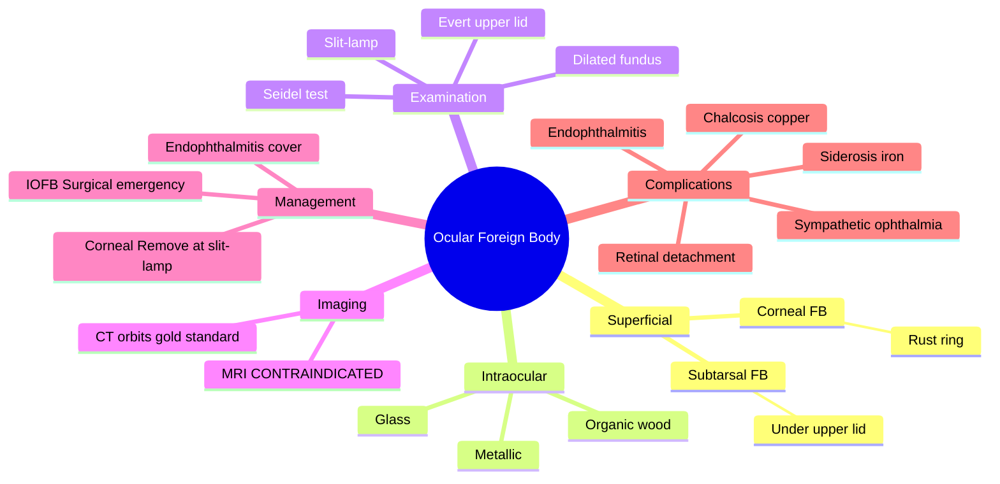

# Ocular Foreign Body

Related: [[Blunt Ocular Trauma]], [[Penetrating Ocular Trauma]]

> [!tip] **FCPS/MRCP Priority: HIGH**
> Corneal FB: remove under magnification. Intraocular FB: NEVER MRI (magnetic). CT for metallic IOFB. Globe integrity first.

---

## Learning Objectives
- [ ] Define ocular foreign body and classify (superficial vs intraocular)
- [ ] Recognise clinical features of corneal, subtarsal, and IOFB
- [ ] Describe examination including evert lid and Seidel test
- [ ] Select appropriate imaging (CT, not MRI for metallic IOFB)
- [ ] Manage superficial FB and recognise IOFB as surgical emergency
- [ ] List complications (endophthalmitis, siderosis, sympathetic ophthalmia)

---

## 1. Definition

- **Foreign body (FB):** External object embedded in or on the eye
- Superficial (corneal, conjunctival) or intraocular

### Types by Material
- Metallic (iron, steel, copper) — most common in industrial
- Non-metallic (glass, plastic)
- Organic (wood, vegetable matter) — high infection risk

---

## 2. Types

### Superficial
- Conjunctival FB (often under upper lid)
- Corneal FB (rust ring if iron)

### Intraocular
- Penetrating wound with retained IOFB
- Metallic, glass, organic (wood), stone

| Type | Example | Key Issue |
|------|---------|-----------|
| Corneal | Metal shard, grit | Rust ring if iron |
| Subtarsal | Trapped under upper lid | Common, missed |
| Intraocular (IOFB) | High-velocity metal | Endophthalmitis risk |

---

## 3. Clinical Features

- Foreign body sensation, pain, redness
- Lacrimation
- ± ↓VA
- History of trauma (sometimes trivial — high-velocity small particle)

---

## 4. Examination

- Visual acuity
- **Evert upper lid** (subtarsal FB common)
- Slit-lamp: location, depth, rust ring, AC reaction, lens status
- **Seidel test** if corneal penetration
- Dilated fundus (rule out posterior segment FB)
- B-scan US (if view obscured)

### Imaging
- **CT orbits** (gold standard for IOFB, metallic)
- **MRI contraindicated** (magnetic FB may move)
- Plain X-ray (less sensitive)

---

## 5. Management

### Superficial Corneal FB
- Topical anaesthetic
- Remove with sterile needle or spud under slit-lamp
- **Rust ring:** Remove with burr/alger brush, or wait
- Topical antibiotic, cycloplegia
- ± Pad

### Conjunctival FB
- Evert lid, remove with cotton-tipped applicator

### Intraocular FB
- **Surgical emergency** (especially metallic, organic)
- **Globe integrity first** — protect eye, no pressure, no MRI
- **Surgical removal** (vitrectomy, magnet for ferromagnetic)
- **Systemic + intravitreal antibiotics** (endophthalmitis risk)
- **Tetanus prophylaxis**

---

## 6. Complications

- Corneal scar, infection (ulcer)
- Endophthalmitis
- Retinal detachment
- Siderosis (iron) — chronic degeneration
- Chalcosis (copper) — chronic inflammation
- Sympathetic ophthalmia

---

## 7. Red Flags / Emergencies

- High-velocity injury (hammering, grinding, mowing) — assume IOFB until proven otherwise
- Visible intraocular object
- Decreased vision after trauma
- Positive Seidel test
- Vitreous prolapse or hyphema with suspicious history

---

## 8. FCPS/MRCP Summary

| Type | Management |
|------|------------|
| Corneal FB | Remove at slit-lamp, AB |
| Subtarsal FB | Evert lid, remove |
| IOFB | CT, surgical removal, IV AB |
| MRI | CONTRAINDICATED |

---

## 9. Viva Questions

1. **Q:** Why is MRI contraindicated with suspected IOFB?
   **A:** Magnetic FB may move and cause further ocular damage. CT is preferred.

2. **Q:** What is the most common site of subtarsal foreign body?
   **A:** Under the upper tarsal conjunctiva (sulcus).

3. **Q:** What is siderosis bulbi?
   **A:** Chronic iron deposition causing retinal degeneration, cataract, and heterochromia.

---

## 10. Common Confusions / Exam Traps

| Confusion | Clarification |
|-----------|---------------|
| "MRI is good for soft tissue IOFB" | **CT is the imaging of choice** — MRI is contraindicated for all suspected metallic FB |
| "All corneal FBs need rust ring removal" | **Small rust rings may be observed**; large/central ones need removal |
| "Organic FBs are low risk" | **Highest infection risk** — Bacillus cereus endophthalmitis |
| "Topical anaesthetic is given for ongoing pain" | **For removal only** — never for ongoing analgesia (toxic to epithelium) |
| "B-scan US is safe in all FBs" | **Avoid if open globe suspected** — risk of extrusion |

---

## 11. Mnemonics

1. **"CT before MRI in trauma"** — CT is the safe imaging for any suspected metallic IOFB
2. **"EVERT the upper lid"** — subtarsal FB is the most missed cause of red eye
3. **"Organic = OUT of luck"** — high endophthalmitis risk, urgent removal
4. **"Iron = Siderosis, Copper = Chalcosis"** — chronic metal-specific complications

---

## 12. Mind Map

---

## 13. One-Page Revision Card

| **Topic** | **Ocular Foreign Body** |
|-----------|-------------------------|
| **Superficial** | Corneal (rust ring) or subtarsal |
| **IOFB** | High-velocity injury assumed |
| **Imaging** | CT orbits (NOT MRI) |
| **Subtarsal** | EVERET upper lid |
| **Seidel test** | Detects aqueous leak |
| **IOFB treatment** | Surgical removal + IV AB |
| **Complications** | Endophthalmitis, siderosis, sympathetic ophthalmia |
| **Viva Pearl** | CT before MRI in trauma |

---

## Spaced Repetition Trackers

### 24-Hour Recall Prompts
- [ ] Define ocular foreign body and classify
- [ ] State the imaging of choice and why MRI is contraindicated
- [ ] Describe management of subtarsal and IOFB
- [ ] List 3 chronic complications of retained metallic IOFB

### Revision Schedule
- [ ] **Day 1** completed (creation + 24h recall)
- [ ] **Day 3** revision completed
- [ ] **Day 7** revision completed
- [ ] **Day 15** revision completed
- [ ] **Day 30** revision completed
- [ ] **Day 90** revision completed

---

## Must Know / Should Know / Nice to Know

### Must Know (Core for passing)
- [x] Always evert upper lid for subtarsal FB
- [x] CT for IOFB — NEVER MRI
- [x] IOFB is a surgical emergency
- [x] Siderosis (iron) and chalcosis (copper) — chronic metal complications

### Should Know (High probability)
- [x] Seidel test detects aqueous leak
- [x] Organic FBs have highest infection risk
- [x] Tetanus prophylaxis needed
- [x] Endophthalmitis cover with intravitreal AB

### Nice to Know (Differentiator)
- [ ] B-scan US (only if no open globe)
- [ ] Alger brush / burr for rust ring
- [ ] Vitrectomy approaches (pars plana)

---

## My Weak Points
- [ ] Add personal weak areas here

---

## Self-Test Scorecard

| Section | Score /5 |
|---------|----------|
| Understanding: | /10 |
| Recall: | /10 |
| MCQ Performance: | /10 |
| SBA Performance: | /10 |
| Viva Confidence: | /10 |
| Total: | /50 |

> [!tip] **Interpretation:** <35 = weak topic, 35-44 = acceptable but insecure, 45+ = strong exam-ready topic.

---

## Exam Answer Modes

### Long Answer Skeleton
1. Definition (external object in/on the eye — superficial or intraocular)
2. Classification (corneal, subtarsal, IOFB; metallic, non-metallic, organic)
3. Clinical features (FB sensation, pain, ↓VA, history of trauma)
4. Examination (evert upper lid, slit-lamp, Seidel, dilated fundus)
5. Imaging (CT orbits — never MRI)
6. Management (corneal removal at slit-lamp; IOFB surgical removal + IV AB)
7. Complications (endophthalmitis, RD, siderosis, chalcosis, sympathetic ophthalmia)

### Short Note Skeleton
- Definition + types
- Imaging: CT not MRI
- Subtarsal FB: evert upper lid
- IOFB: surgical emergency
- Complications: endophthalmitis, siderosis

### Viva One-Liners
- **Q:** Imaging of choice for suspected metallic IOFB? → **A:** CT orbits (not MRI)
- **Q:** Most common missed FB? → **A:** Subtarsal FB (under upper lid)
- **Q:** What is siderosis bulbi? → **A:** Iron deposition causing retinal/cataract/heterochromia
- **Q:** Why is organic FB high risk? → **A:** Highest endophthalmitis risk (Bacillus cereus)
- **Q:** When is MRI contraindicated? → **A:** Any suspected metallic IOFB

### Ward-Case Discussion Points
- Always evert the upper lid in any red eye with FB sensation
- High-velocity injury (hammering on metal) = assume IOFB
- CT before MRI for all metallic IOFB
- Discuss siderosis/chalcosis as long-term risks
- Endophthalmitis cover for organic/IOFB

### Last-Night-Before-Exam Sheet
- **Top 3 facts:** Evert upper lid; CT not MRI; IOFB = surgical emergency
- **1 mnemonic:** "CT before MRI in trauma"
- **Must-know differential:** Subtarsal FB (often missed) vs IOFB (high risk)
- **Complications:** Endophthalmitis, siderosis, chalcosis, sympathetic ophthalmia

---

## Summary

Ocular FB may be superficial or intraocular. Always evert upper lid for subtarsal FB. CT for IOFB (not MRI). Globe integrity first if penetrating.

---

## MCQs (10)

1. **Question:** Imaging of choice for suspected metallic IOFB:
   **Options:** A. MRI B. CT C. US D. X-ray E. None
   **Answer:** B
   **Explanation:** CT — not MRI (magnetic).

2. **Question:** A patient with subacute red eye has a subtarsal FB. Most common location:
   **Options:** A. Lower tarsus B. Upper tarsus (sulcus) C. Lateral canthus D. Caruncle E. None
   **Answer:** B
   **Explanation:** Under upper lid = classic.

3. **Question:** Why is MRI contraindicated in suspected IOFB?
   **Options:** A. Too expensive B. Poor resolution C. Magnetic FB may move and damage intraocular structures D. Not available E. Causes infection
   **Answer:** C
   **Explanation:** Magnetic foreign body may move, causing further intraocular damage.

4. **Question:** Chronic iron deposition in the eye from retained IOFB causes:
   **Options:** A. Chalcosis B. Siderosis C. Sympathetic ophthalmia D. Glaucoma E. Cataract only
   **Answer:** B
   **Explanation:** Siderosis bulbi = iron deposition → retinal degeneration, cataract, heterochromia.

5. **Question:** Which foreign body has the highest risk of endophthalmitis?
   **Options:** A. Glass B. Plastic C. Iron D. Organic (wood/vegetable) E. Steel
   **Answer:** D
   **Explanation:** Organic matter carries highest infection risk (Bacillus cereus).

6. **Question:** The Seidel test is positive when:
   **Options:** A. Pupil reacts B. Aqueous leak from corneal wound is seen with fluorescein C. IOP is raised D. Lens is opaque E. None
   **Answer:** B
   **Explanation:** Seidel test: fluorescein is diluted by leaking aqueous, seen as a dark stream.

7. **Question:** A carpenter hammering metal on metal feels something hit his eye. He has normal VA and no obvious wound. Next step:
   **Options:** A. Discharge with AB drops B. CT orbits C. MRI orbits D. US E. Observe 1 week
   **Answer:** B
   **Explanation:** High-velocity mechanism = assume IOFB until proven otherwise; CT orbits.

8. **Question:** Chalcosis is caused by:
   **Options:** A. Iron IOFB B. Copper IOFB C. Glass IOFB D. Wood IOFB E. Plastic IOFB
   **Answer:** B
   **Explanation:** Chalcosis = chronic copper deposition (chalcosis lentis = sunflower cataract).

9. **Question:** A corneal rust ring from iron FB is best removed by:
   **Options:** A. Wait for spontaneous resolution B. Alger brush or burr at slit-lamp C. Forceps D. Laser E. Surgery
   **Answer:** B
   **Explanation:** Alger brush/burr removes rust ring; small ones may be observed.

10. **Question:** Tetanus prophylaxis is required in which type of FB?
    **Options:** A. Metallic IOFB B. Glass IOFB C. Organic / contaminated IOFB D. Plastic E. All corneal FB
    **Answer:** C
    **Explanation:** Contaminated/organic FB and soil-contaminated wounds need tetanus cover.

---

## SBA Questions (10)

1. **Scenario:** A 28-year-old metal worker presents after a high-velocity injury while hammering. Visual acuity is 6/6, but slit-lamp shows a small corneal entry wound with positive Seidel test.
   **Question:** Most appropriate next step?
   **Options:** A. Topical AB and discharge B. CT orbits, NPO, shield, IV AB C. MRI orbits D. US E. Pad and review
   **Answer:** B
   **Explanation:** Penetrating IOFB suspected — CT, NPO for surgery, shield, IV antibiotics.

2. **Scenario:** A patient with red eye and FB sensation has no corneal FB on slit-lamp.
   **Question:** Most appropriate next step?
   **Options:** A. Discharge B. Evert the upper lid C. MRI D. CT E. Patch
   **Answer:** B
   **Explanation:** Evert upper lid to look for subtarsal FB — most commonly missed cause.

3. **Scenario:** A patient had an iron IOFB removed 5 years ago. He now presents with progressive visual loss, heterochromia, and cataract.
   **Question:** Most likely diagnosis?
   **Options:** A. Chalcosis B. Siderosis bulbi C. Sympathetic ophthalmia D. Endophthalmitis E. Glaucoma
   **Answer:** B
   **Explanation:** Siderosis bulbi — chronic iron toxicity, years after retained IOFB.

4. **Scenario:** A patient with retained copper IOFB presents years later with a sunflower cataract.
   **Question:** What is the underlying mechanism?
   **Options:** A. Siderosis B. Chalcosis C. Infection D. Trauma E. Inflammation
   **Answer:** B
   **Explanation:** Chalcosis = chronic copper deposition; sunflower cataract is classic.

5. **Scenario:** A child has a small piece of wood embedded in the cornea from a tree branch.
   **Question:** What is the most important complication to prevent?
   **Options:** A. Siderosis B. Chalcosis C. Endophthalmitis D. Glaucoma E. Cataract
   **Answer:** C
   **Explanation:** Organic FB = highest endophthalmitis risk (Bacillus cereus); urgent removal + IV AB.

6. **Scenario:** During slit-lamp removal of a corneal metallic FB, the patient jerks and the FB appears to go deeper into the AC.
   **Question:** Most appropriate next step?
   **Options:** A. Continue with needle B. Refer immediately to ophthalmologist C. Patch and observe D. Apply pressure E. Try forceps
   **Answer:** B
   **Explanation:** FB now intraocular — needs surgical removal in theatre; do not attempt further removal at slit-lamp.

7. **Scenario:** A patient with a metallic IOFB has CT showing a 2-mm radiopaque fragment in the vitreous.
   **Question:** What is the role of MRI in this patient?
   **Options:** A. Confirm diagnosis B. Better localisation C. CONTRAINDICATED D. Always done E. None
   **Answer:** C
   **Explanation:** MRI is contraindicated — magnetic FB may move and damage structures.

8. **Scenario:** A construction worker has a small piece of glass in the conjunctival fornix.
   **Question:** Most appropriate removal method?
   **Options:** A. Surgery B. Forceps under GA C. Cotton-tipped applicator after irrigation D. Alger brush E. Burr
   **Answer:** C
   **Explanation:** Superficial conjunctival FB — remove with cotton-tipped applicator at slit-lamp.

9. **Scenario:** A patient with a small corneal FB is given topical anaesthetic drops and discharged with ongoing pain medication.
   **Question:** What is the major concern with this management?
   **Options:** A. Infection B. Topical anaesthetic toxicity to epithelium C. Siderosis D. Sympathetic ophthalmia E. Allergy
   **Answer:** B
   **Explanation:** Topical anaesthetics are toxic to the epithelium with prolonged use — for removal only, not ongoing analgesia.

10. **Scenario:** A 5-year-old with a high-velocity IOFB from a lawnmower injury.
    **Question:** Most appropriate antibiotic cover for endophthalmitis prevention?
    **Options:** A. Topical chloramphenicol B. Oral amoxicillin C. IV ceftriaxone + vancomycin (and intravitreal) D. Topical fluoroquinolone E. No antibiotics needed
    **Answer:** C
    **Explanation:** IV broad-spectrum (ceftriaxone + vancomycin) + intravitreal AB for IOFB.

---

## Flashcards

- **Q:** Imaging of choice for suspected metallic IOFB?
  **A:** CT orbits (NEVER MRI — magnetic FB may move and damage structures).
- **Q:** Most commonly missed foreign body in a red eye?
  **A:** Subtarsal FB under the upper tarsal conjunctiva — always evert the upper lid.
- **Q:** What is siderosis bulbi?
  **A:** Chronic iron IOFB → retinal degeneration, cataract, heterochromia iridis.
- **Q:** What is the most feared complication of organic IOFB?
  **A:** Endophthalmitis (especially Bacillus cereus) — urgent removal + IV AB.
- **Q:** What is a positive Seidel test?
  **A:** Fluorescein is diluted by leaking aqueous from a corneal perforation — visible as a dark stream.

---

## Answer Key with Explanations

### MCQs
1. B — CT orbits is the imaging of choice
2. B — Upper tarsus (sulcus) is the classic location
3. C — Magnetic FB may move and damage structures
4. B — Siderosis = chronic iron deposition
5. D — Organic FBs have highest infection risk
6. B — Fluorescein diluted by aqueous = Seidel positive
7. B — High-velocity mechanism = assume IOFB
8. B — Chalcosis = copper deposition (sunflower cataract)
9. B — Alger brush/burr removes rust ring
10. C — Contaminated/organic wounds need tetanus cover

### SBAs
1. B — Penetrating IOFB — CT, NPO, shield, IV AB
2. B — Evert upper lid to look for subtarsal FB
3. B — Siderosis = chronic iron toxicity
4. B — Chalcosis = copper deposition
5. C — Organic FB → endophthalmitis risk
6. B — Now intraocular — needs theatre
7. C — MRI contraindicated for metallic FB
8. C — Cotton-tipped applicator for superficial FB
9. B — Topical anaesthetic is toxic with prolonged use
10. C — IV ceftriaxone + vancomycin + intravitreal AB

---

## Tags
#medicine #davidson #ophthalmology #FB #trauma #fcps #mrcp

## PasTest Scenario SBAs (Clinical Vignettes)

> **Auto-generated PasTest/Mediscope-style scenario SBAs** grounded in the authored source. Each scenario tests a real clinical fact (triad, specific sign, contraindication, trial, first-line Rx) extracted from the topic. *Source: Ch 28: Medical Ophthalmology — Ocular Foreign Body*

**Q1.** Which of the following features is most specific or characteristic of Ocular Foreign Body?

  - **A.** "Iron = Siderosis, Copper = Chalcosis"
  - **B.** A feature common to many acute inflammatory conditions
  - **C.** A non-specific sign that does not localise the diagnosis
  - **D.** An investigation finding rather than a clinical feature

  > **Answer: A** — "Iron = Siderosis, Copper = Chalcosis"
  >
  > *Source:* **"Iron = Siderosis, Copper = Chalcosis"** — chronic metal-specific complications

---
### MCQs
1

