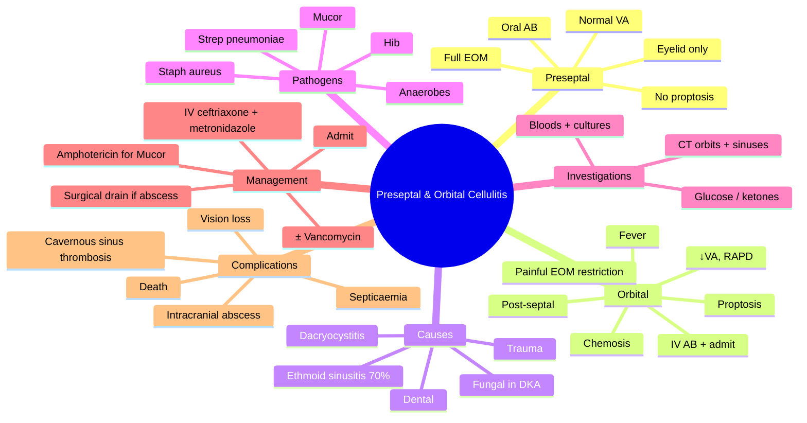

# Preseptal and Orbital Cellulitis

Related: [[Thyroid Eye Disease]], [[Orbital Tumours]], [[Proptosis (Approach)]]

> [!tip] **FCPS/MRCP Priority: CRITICAL**
> Differentiate preseptal (mild, eyelid) from orbital (severe, post-septal, vision-threatening). Most orbital from ethmoid sinus. IV antibiotics, surgical drainage if abscess.

---

## Learning Objectives
- [ ] Define preseptal and orbital cellulitis
- [ ] Identify the anatomical barrier (orbital septum) and its clinical significance
- [ ] List the common causes and pathogens by age group
- [ ] Recognise the clinical features that distinguish preseptal from orbital cellulitis
- [ ] Apply the Chandler classification of orbital infections
- [ ] Order appropriate investigations (CT orbits + sinuses)
- [ ] Initiate empirical IV antibiotics and recognise indications for surgical drainage
- [ ] Identify sight- and life-threatening complications

---

## 1. Definition / Epidemiology / Classification

### Definition
- **Preseptal (periorbital) cellulitis:** Infection of the eyelid **anterior to the orbital septum**
- **Orbital (post-septal) cellulitis:** Infection of the orbital contents **posterior to the orbital septum** — a vision- and potentially life-threatening emergency
- **Orbital septum:** Fibrous sheet extending from the orbital rim to the tarsal plates — the anatomical barrier separating the two conditions

### Epidemiology
- **More common in children** (peak age 7–12 years for orbital cellulitis)
- Orbital cellulitis is far less common than preseptal but far more dangerous
- Most common cause of orbital cellulitis: **ethmoid sinusitis (≈70%)** spreading through the lamina papyracea

### Chandler Classification of Orbital Infection
1. **Preseptal cellulitis**
2. **Orbital cellulitis** (diffuse post-septal inflammation, no abscess)
3. **Subperiosteal abscess** (between periorbita and bone — most common abscess type)
4. **Orbital abscess** (within orbital tissues)
5. **Cavernous sinus thrombosis**

---

## 2. Aetiology / Pathophysiology

### Preseptal Cellulitis — Causes
- Periorbital trauma (abrasion, laceration, insect bite)
- Infected chalazion / stye (hordeolum)
- Spread from adjacent infection (dacryocystitis, impetigo)
- Bacteraemia (Hib in unvaccinated children)

### Orbital Cellulitis — Causes
- **Ethmoid sinusitis (≈70%)** — direct spread through the **lamina papyracea** (paper-thin medial orbital wall)
- Direct extension from:
  - Dacryocystitis
  - Dental infection (especially upper molars)
  - Frontal or maxillary sinusitis
- Orbital trauma / surgery (open globe, orbital fracture)
- Endophthalmitis (rare)
- **Fungal:** **Mucormycosis / Rhizopus** in **diabetic ketoacidosis** or immunocompromised — orbital and life-threatening emergency
- Haematogenous spread (rare)

### Pathophysiology (Orbital)
- Spread of infection from sinus → breach of lamina papyracea → subperiosteal abscess / orbital cellulitis
- Inflammation of orbital fat and EOMs → proptosis, painful eye movements
- ↑ Orbital pressure → optic nerve compression → ischaemia → **vision loss**
- Posterior spread → cavernous sinus, meningitis, intracranial abscess

### Pathogens
- **Children:** *Streptococcus pneumoniae*, *Staphylococcus aureus*, *Haemophilus influenzae* (Hib in unvaccinated), *Strep. pyogenes*, *M. catarrhalis*
- **Adults:** *Staphylococcus aureus* (incl. MRSA), *Streptococcus* spp., anaerobes (dental source)
- **Fungal:** *Mucor / Rhizopus* (DKA, immunocompromised)
- Post-traumatic: Staph, Strep, Bacillus, Pseudomonas

---

## 3. Clinical Features

### Preseptal Cellulitis
- Eyelid swelling, redness, warmth, tenderness
- **Normal vision, no RAPD**
- **No proptosis**
- **Normal eye movements** (no pain on movement)
- No chemosis
- ± Fever

### Orbital Cellulitis — Symptoms
- Severe pain, redness, swelling of eyelid and orbit
- **Proptosis** (axial, often downward displacement)
- **Painful restricted eye movements** (ophthalmoplegia) → diplopia
- ↓ Visual acuity (optic nerve compression — EMERGENCY)
- ± Pain on eye movement
- Systemic: fever, malaise, headache, vomiting
- History of recent sinusitis, dental infection, or trauma

### Orbital Cellulitis — Signs
- **Proptosis** (key — measure with Hertel exophthalmometer)
- **Ophthalmoplegia** (painful restriction, especially in direction of involved muscle)
- **↓ Visual acuity** (a warning sign)
- **RAPD** (afferent pupillary defect — optic nerve compromise — EMERGENCY)
- **Chemosis** (conjunctival oedema)
- Eyelid erythema, oedema (often with a violaceous hue)
- Restricted/diminished corneal sensation (V1 involvement — consider cavernous sinus)
- Fundus: optic disc oedema, venous engorgement
- Fever, tachycardia, signs of systemic sepsis
- Preauricular / submandibular lymphadenopathy

---

## 4. Investigations

### Essential
- **CT orbits + sinuses (with IV contrast)** — **gold standard**
  - Identifies: proptosis, EOM enlargement, subperiosteal/orbital abscess, sinus opacification, bony erosion
  - Differentiates preseptal from orbital cellulitis definitively
- **Bloods:** FBC (leukocytosis), CRP, U&E, blood cultures (×2)
- **Blood glucose ± ketones / HbA1c** (rule out DKA → mucormycosis)
- **Swab** of any wound / sinus aspirate for culture

### Optional / Selected
- **MRI orbits + brain** (with contrast) — if fungal suspected, cavernous sinus thrombosis, or intracranial extension
- **Lumbar puncture** — if meningitis suspected (after CT)
- **Visual fields, OCT RNFL, VEP** — for dysthyroid optic neuropathy differential and monitoring
- **Tox screen** — cocaine-induced sino-nasal disease with orbital involvement

---

## 5. Differential Diagnosis

| Condition | Distinguishing Features |
|-----------|-------------------------|
| **Preseptal cellulitis** | Eyelid only, no proptosis, normal VA, full EOM |
| **Allergic angio-oedema** | Bilateral, painless, itchy, no fever |
| **Insect bite** | Localised, no fever, history of bite |
| **Orbital pseudotumour (idiopathic orbital inflammation)** | Painful proptosis, EOM restriction, response to steroids |
| **Thyroid eye disease** | Bilateral, lid retraction/lag, euthyroid/hyperthyroid, no fever |
| **Cavernous sinus thrombosis** | Bilateral eye signs, V1/V2 sensory loss, CN VI palsy, sepsis |
| **Orbital tumour (lymphoma, rhabdomyosarcoma, mets)** | Insidious onset, mass, ± pain, no fever |
| **Carotid-cavernous fistula** | Pulsatile proptosis, bruit, chemosis, red eye |
| **Mucormycosis** | DKA/immunocompromised, black eschar on palate/nasal turbinate |
| **Periorbital necrotising fasciitis** | Pain out of proportion, dusky skin, systemic toxicity |

---

## 6. Management

### Preseptal Cellulitis
- **Oral co-amoxiclav** (10–14 days)
- ± Topical antibiotic (if obvious wound)
- Review at 24–48 h
- Admit if: <1 year, systemic illness, immunocompromised, suspected orbital involvement, oral AB failure

### Orbital Cellulitis — EMERGENCY

**Admit immediately under ophthalmology + ENT (and paediatrics if child).**

**Medical:**
- **IV antibiotics — empirical, broad spectrum:**
  - **Ceftriaxone (or cefotaxime)** + **Metronidazole** (anaerobes)
  - Add **Vancomycin** (or teicoplanin) if MRSA risk
  - In children: ceftriaxone IV + metronidazole IV
  - In DKA / immunocompromised: add **Liposomal Amphotericin B** (mucormycosis cover)
- IV fluids, analgesia, antipyretics
- **Nasal decongestants** ± saline sinus rinse
- Monitor: VA, pupils, EOM, proptosis, colour vision, fundus, temperature, WCC, CRP

**Surgical:**
- **Urgent surgical drainage** if:
  - Subperiosteal or orbital abscess on CT
  - Vision deteriorating
  - No response to IV antibiotics at 24–48 h
  - Large abscess, frontal sinusitis
- **Functional endoscopic sinus surgery (FESS)** ± external drainage
- **Treat underlying sinus disease** (ENT input)
- **Mucormycosis:** emergency **aggressive surgical debridement** + IV Amphotericin B

### Follow-up
- Daily assessment of vision, pupils, EOM
- Repeat CT if clinical deterioration or no improvement
- Oral antibiotic step-down once improving (2–3 weeks total)
- Monitor for late complications (Cavernous sinus thrombosis, intracranial extension)

---

## 7. Complications

### Orbital Cellulitis
- **Vision loss** (optic neuropathy from compression, ischaemia, exposure keratopathy)
- **Subperiosteal / orbital abscess**
- **Cavernous sinus thrombosis** (chemosis, V1 sensory loss, CN VI palsy, bilateral signs, sepsis)
- **Intracranial extension** — meningitis, cerebral abscess, subdural empyema
- **Septicaemia**
- **Exposed keratopathy** (proptosis → lagophthalmos)
- **Loss of eye** (severe cases)
- **Death** (mucormycosis, intracranial extension)

---

## 8. Red Flags / Emergencies

- **↓ Visual acuity or new RAPD** — optic nerve compromise — surgical emergency
- **Pupillary abnormalities** (CN III palsy with mydriasis)
- **Bilateral orbital signs** → suspect cavernous sinus thrombosis
- **Severe headache, meningism, focal neurology** → intracranial extension
- **DKA + rapidly progressive orbital signs + black eschar** → **mucormycosis** — emergency debridement + Amphotericin B
- **Immunocompromised host with orbital signs**
- **Pulsatile proptosis, orbital bruit** → CCF
- **Pain out of proportion, dusky skin, bullae** → necrotising fasciitis

---

## 9. FCPS/MRCP High-Yield Summary

| Feature | Preseptal | Orbital |
|---------|-----------|---------|
| Vision | Normal | ↓ |
| Proptosis | No | Yes |
| EOM | Normal | Painful restriction |
| RAPD | No | May have |
| Chemosis | No | Yes |
| Fever | ± | Usually present |
| Imaging | Usually not | CT orbits + sinuses (with contrast) |
| Treatment | Oral AB | **IV AB, admit** |
| Surgical | Rare | Drainage if abscess / no response |
| Severity | Mild | **Emergency (vision/life-threatening)** |

| Key Topic | High-Yield |
|-----------|------------|
| Most common cause of orbital cellulitis | Ethmoid sinusitis (70%) — through lamina papyracea |
| Pathogen (children) | Strep pneumoniae, Staph aureus, Hib |
| Pathogen (DKA/immunocompromised) | Mucor / Rhizopus (fungal — emergency) |
| First-line IV AB | Ceftriaxone + metronidazole ± vancomycin |
| Surgical drainage indications | Subperiosteal abscess, ↓VA, no IV AB response |
| Worst complication | Cavernous sinus thrombosis, intracranial abscess, death |

---

## 10. Viva Questions

1. **Q:** How do you differentiate preseptal from orbital cellulitis?
   **A:** Proptosis, ↓VA, painful EOM restriction, RAPD, chemosis, fever = orbital (post-septal). Eyelid swelling only, normal VA, full painless EOM = preseptal.

2. **Q:** What is the most common cause of orbital cellulitis in children?
   **A:** Ethmoid sinusitis, spreading through the lamina papyracea.

3. **Q:** What imaging should be requested in suspected orbital cellulitis?
   **A:** CT orbits + sinuses with IV contrast.

4. **Q:** A diabetic in DKA presents with orbital cellulitis. Which organism is the concern?
   **A:** Mucormycosis (Rhizopus) — emergency debridement + IV Amphotericin B.

5. **Q:** When is surgical drainage indicated in orbital cellulitis?
   **A:** Subperiosteal or orbital abscess on CT, deteriorating vision, no response to IV antibiotics at 24–48 h.

6. **Q:** What is the Chandler classification?
   **A:** A 5-stage classification: 1) Preseptal cellulitis, 2) Orbital cellulitis, 3) Subperiosteal abscess, 4) Orbital abscess, 5) Cavernous sinus thrombosis.

7. **Q:** What is the first-line empirical IV antibiotic regimen for orbital cellulitis?
   **A:** Ceftriaxone + metronidazole ± vancomycin (MRSA cover if risk factors).

---

## 11. Common Confusions / Exam Traps

| Confusion | Clarification |
|-----------|---------------|
| "Orbital cellulitis can be managed with oral antibiotics" | NO — IV antibiotics, admit, monitor vision |
| "Proptosis is a preseptal feature" | NO — proptosis indicates post-septal (orbital) involvement |
| "Mucormycosis is bacterial" | It is **fungal** (Mucor / Rhizopus) — Amphotericin B, not antibacterial |
| "Imaging is not necessary" | CT orbits + sinuses is the gold standard — always in suspected orbital cellulitis |
| "All cases need surgery" | Not all — only abscess, ↓VA, or IV-AB failure |
| "Sinusitis cannot cause orbital cellulitis" | Ethmoid sinusitis is the most common cause (70%) — lamina papyracea |
| "Cavernous sinus thrombosis causes unilateral signs" | It is typically **bilateral** with sepsis, CN VI palsy, V1 sensory loss |

---

## 12. Mnemonics

1. **"PRESEPTAL stays PRESERVED"** — **P**roptosis absent, **R**APD absent, **E**OM full, **S**ight preserved, **E**ye normal, **P**ain absent, **T**enderness local, **A**ntibiotics oral, **L**id only.
2. **"ORBITAL = EMERGENCY"** — **E**ye movement restricted, **M**y (RAPD) present, **E**xamine vision, **R**equires IV, **G**et CT, **E**vacuate abscess, **N**euro exam, **C**avernous sinus risk, **Y**es — admit now.
3. **"Ethmoid → Eye"** — Most common cause of orbital cellulitis is **ethmoid** sinusitis spreading through the **lamina papyracea** to the **eye** (orbit).
4. **"DKA + black eschar = Mucor"** — DKA, immunocompromise, and a black eschar (palate/turbinate) = think **mucormycosis**.

---

## 13. Mind Map

---

## 14. One-Page Revision Card

| **Topic** | **Preseptal vs Orbital Cellulitis** |
|-----------|-------------------------------------|
| **Anatomy** | Preseptal = anterior to septum; Orbital = posterior |
| **Most common cause (orbital)** | Ethmoid sinusitis (70%) via lamina papyracea |
| **Key signs (orbital)** | Proptosis, ↓VA, painful EOM, RAPD, chemosis |
| **Pathogens** | Staph, Strep, Hib; in DKA think Mucor |
| **Investigation** | CT orbits + sinuses with contrast |
| **Preseptal treatment** | Oral co-amoxiclav |
| **Orbital treatment** | IV ceftriaxone + metronidazole ± vancomycin; admit |
| **Surgical drainage** | Abscess on CT, ↓VA, no response at 24–48 h |
| **Worst complication** | Cavernous sinus thrombosis, intracranial abscess |
| **Chandler stages** | 1 preseptal → 2 orbital → 3 subperiosteal abscess → 4 orbital abscess → 5 CST |
| **Viva Pearl** | "If proptosis or ↓VA appears — it's now orbital cellulitis" |

---

## Spaced Repetition Trackers

### 24-Hour Recall Prompts
- [ ] Define preseptal and orbital cellulitis and the role of the orbital septum
- [ ] State the most common cause of orbital cellulitis and the route of spread
- [ ] List 4 clinical features that distinguish orbital from preseptal cellulitis
- [ ] Outline first-line IV antibiotic regimen for orbital cellulitis
- [ ] Identify the indication for surgical drainage
- [ ] Name the fungal emergency associated with DKA

### Revision Schedule
- [ ] **Day 1** completed (creation + 24h recall)
- [ ] **Day 3** revision completed
- [ ] **Day 7** revision completed
- [ ] **Day 15** revision completed
- [ ] **Day 30** revision completed
- [ ] **Day 90** revision completed

---

## Must Know / Should Know / Nice to Know

### Must Know (Core for passing)
- [x] Anatomical distinction (orbital septum)
- [x] Clinical differentiation: proptosis, ↓VA, painful EOM, RAPD
- [x] Most common cause (ethmoid sinusitis via lamina papyracea)
- [x] Imaging: CT orbits + sinuses
- [x] IV antibiotics (ceftriaxone + metronidazole) and admission
- [x] Mucormycosis in DKA

### Should Know (High probability)
- [x] Chandler classification
- [x] Pathogens by age
- [x] Surgical drainage indications
- [x] Cavernous sinus thrombosis features

### Nice to Know (Differentiator)
- [ ] Lamina papyracea anatomy
- [ ] Toxin/drug-related sino-orbital disease (cocaine)
- [ ] Intracranial complications (subdural empyema, cerebritis)

---

## My Weak Points
- [ ] Add personal weak areas here

---

## Self-Test Scorecard

| Section | Score /5 |
|---------|----------|
| Understanding: | /10 |
| Recall: | /10 |
| MCQ Performance: | /10 |
| SBA Performance: | /10 |
| Viva Confidence: | /10 |
| Total: | /50 |

> [!tip] **Interpretation:** <35 = weak topic, 35-44 = acceptable but insecure, 45+ = strong exam-ready topic.

---

## Exam Answer Modes

### Long Answer Skeleton
1. Definitions (preseptal vs orbital, orbital septum)
2. Causes (ethmoid sinusitis 70%, trauma, dental, dacryocystitis; Mucor in DKA)
3. Pathogens (Staph, Strep, Hib, anaerobes, Mucor)
4. Clinical features (orbital: proptosis, ↓VA, painful EOM, RAPD, chemosis, fever)
5. Investigations (CT orbits + sinuses with contrast, bloods, blood cultures, glucose/ketones)
6. Management (admit; IV ceftriaxone + metronidazole ± vancomycin; surgical drainage if abscess, ↓VA, or no response; Amphotericin for Mucor)
7. Complications (vision loss, cavernous sinus thrombosis, intracranial abscess, septicaemia, death)
8. Chandler classification

### Short Note Skeleton
- Definition + key distinguishing clinical features
- Most common cause (ethmoid sinusitis, lamina papyracea)
- Investigations (CT orbits + sinuses)
- First-line IV antibiotics
- Surgical drainage indications

### Viva One-Liners
- **Q:** Preseptal vs orbital? → **A:** Eyelid only, normal VA, no proptosis = preseptal. Proptosis, ↓VA, painful EOM, RAPD = orbital.
- **Q:** Most common cause of orbital cellulitis? → **A:** Ethmoid sinusitis through the lamina papyracea.
- **Q:** Imaging of choice? → **A:** CT orbits + sinuses with IV contrast.
- **Q:** First-line IV antibiotics? → **A:** Ceftriaxone + metronidazole ± vancomycin.
- **Q:** When to drain? → **A:** Subperiosteal/orbital abscess, deteriorating vision, no IV AB response at 24–48 h.
- **Q:** DKA + orbital cellulitis? → **A:** Think **mucormycosis** — emergency debridement + IV Amphotericin B.
- **Q:** Chandler stage 5? → **A:** Cavernous sinus thrombosis.

### Ward-Case Discussion Points
- Examine VA, pupils, EOM, proptosis, fundus
- Exclude orbital involvement (Chandler staging)
- Examine sinuses (tenderness, purulent rhinorrhoea)
- Check blood glucose, ketones, immunocompetence
- CT orbits + sinuses with contrast
- Start empirical IV ceftriaxone + metronidazole
- ENT and ophthalmology joint care
- Discuss indications for surgery with ENT
- Counsel on red-flag symptoms (↓VA, painful EOM, severe headache)
- Monitor: VA, EOM, proptosis, temperature, CRP

### Last-Night-Before-Exam Sheet
- Top 3 facts: orbital = proptosis + ↓VA + painful EOM; ethmoid sinusitis is the most common cause; IV ceftriaxone + metronidazole
- 1 mnemonic: "Ethmoid → Eye" (lamina papyracea)
- Must-know differential: preseptal (no proptosis, normal VA, oral AB)
- Red flag to remember: DKA + black eschar = **mucormycosis** — emergency
- Chandler: 1 preseptal → 2 orbital → 3 subperiosteal abscess → 4 orbital abscess → 5 CST

---

## Summary

**Preseptal cellulitis** is an eyelid infection **anterior to the orbital septum** — mild, with **normal vision, no proptosis, full painless eye movements, and no RAPD**. Treatment: **oral co-amoxiclav** with review at 24–48 h.

**Orbital (post-septal) cellulitis** is a **vision- and life-threatening emergency**. The most common cause is **ethmoid sinusitis** (≈70%) spreading through the **lamina papyracea**. Key features: **proptosis, ↓VA, painful EOM restriction, RAPD, chemosis, fever**. Investigation: **CT orbits + sinuses with IV contrast**. Management: **urgent admission, empirical IV ceftriaxone + metronidazole ± vancomycin**, and **surgical drainage** if there is an abscess, deteriorating vision, or no response at 24–48 h. In DKA or immunocompromised patients, suspect **mucormycosis** — emergency surgical debridement + IV Amphotericin B. Complications include **vision loss, cavernous sinus thrombosis, intracranial abscess, and septicaemia**.

## MCQs (10)

1. **Question:** Orbital cellulitis is most commonly caused by:
   **Options:** A. Trauma B. Ethmoid sinusitis C. Dental infection D. Dacryocystitis E. Endophthalmitis
   **Answer:** B
   **Explanation:** Ethmoid sinusitis accounts for ≈70% of cases — direct spread through the lamina papyracea.

2. **Question:** The route of infection from the ethmoid sinus to the orbit is via:
   **Options:** A. Optic canal B. Superior orbital fissure C. Lamina papyracea D. Inferior orbital fissure E. Zygomatic bone
   **Answer:** C
   **Explanation:** The lamina papyracea is the paper-thin medial orbital wall and is the route of direct spread.

3. **Question:** The single most important clinical feature distinguishing orbital from preseptal cellulitis is:
   **Options:** A. Eyelid swelling B. Proptosis C. Fever D. Tender lymph nodes E. Headache
   **Answer:** B
   **Explanation:** Proptosis indicates post-septal involvement.

4. **Question:** A child with orbital cellulitis on IV antibiotics develops bilateral chemosis, V1 sensory loss, and a CN VI palsy. Most likely diagnosis:
   **Options:** A. Orbital abscess B. Subperiosteal abscess C. Cavernous sinus thrombosis D. Meningitis E. Preseptal cellulitis
   **Answer:** C
   **Explanation:** Bilateral signs + V1 sensory loss + CN VI palsy + sepsis = cavernous sinus thrombosis.

5. **Question:** First-line empirical IV antibiotic regimen for orbital cellulitis in a child is:
   **Options:** A. Benzylpenicillin alone B. Ceftriaxone + metronidazole C. Vancomycin alone D. Oral co-amoxiclav E. Flucloxacillin alone
   **Answer:** B
   **Explanation:** Ceftriaxone (broad gram-positive/negative cover) + metronidazole (anaerobes) is first-line IV.

6. **Question:** The most appropriate imaging in suspected orbital cellulitis is:
   **Options:** A. Plain X-ray of orbits B. CT orbits + sinuses with IV contrast C. MRI brain D. Ultrasound orbit E. No imaging — clinical diagnosis
   **Answer:** B
   **Explanation:** CT with contrast is the gold standard — identifies abscess, sinus disease, orbital involvement.

7. **Question:** A diabetic in DKA presents with orbital cellulitis, periorbital swelling, and a black eschar on the palate. Most likely organism:
   **Options:** A. Staphylococcus aureus B. Streptococcus pneumoniae C. Mucormycosis D. Pseudomonas aeruginosa E. Herpes zoster
   **Answer:** C
   **Explanation:** DKA + black eschar + orbital signs = mucormycosis — emergency.

8. **Question:** In the Chandler classification, stage 3 is:
   **Options:** A. Preseptal cellulitis B. Orbital cellulitis C. Subperiosteal abscess D. Orbital abscess E. Cavernous sinus thrombosis
   **Answer:** C
   **Explanation:** 1 preseptal → 2 orbital → 3 subperiosteal abscess → 4 orbital abscess → 5 CST.

9. **Question:** The first-line antifungal for rhinocerebral mucormycosis is:
   **Options:** A. Fluconazole B. Voriconazole C. Liposomal amphotericin B D. Caspofungin E. Flucytosine
   **Answer:** C
   **Explanation:** Liposomal amphotericin B is the drug of choice; combined with surgical debridement.

10. **Question:** Surgical drainage of an orbital abscess is indicated in all of the following EXCEPT:
    **Options:** A. Subperiosteal abscess on CT B. Deteriorating vision despite IV antibiotics C. Lack of response to IV antibiotics at 24–48 h D. Mild preseptal cellulitis with no abscess E. Large frontal sinus abscess with intracranial extension risk
    **Answer:** D
    **Explanation:** Preseptal cellulitis without abscess does not require surgery.

## SBA Questions (10)

1. **Scenario:** A 7-year-old boy presents with 3 days of fever, painful swollen right eye, proptosis, painful restriction of eye movements in all directions, ↓VA (6/24), and a relative afferent pupillary defect. He had a recent upper respiratory tract infection.
   **Question:** What is the most likely diagnosis and next step?
   **Options:** A. Preseptal cellulitis — oral co-amoxiclav B. Allergic conjunctivitis — antihistamines C. Orbital cellulitis — admit, IV ceftriaxone + metronidazole, urgent CT orbits + sinuses D. Stye — hot compresses E. TED — IV methylpred
   **Answer:** C
   **Explanation:** Proptosis + ↓VA + painful EOM + RAPD = orbital cellulitis. Urgent IV antibiotics and CT.

2. **Scenario:** A 9-year-old with orbital cellulitis on IV ceftriaxone and metronidazole has improving proptosis and EOM, but repeat CT at 48 h shows a 1.5 cm subperiosteal abscess on the medial wall.
   **Question:** What is the next best step?
   **Options:** A. Continue IV antibiotics only — abscess will resolve B. Add topical antibiotic only C. Stop IV antibiotics and switch to oral D. Surgical drainage (ENT — FESS ± external drainage) E. IV steroids
   **Answer:** D
   **Explanation:** A discrete subperiosteal abscess, especially if vision- or pressure-threatening, is an indication for surgical drainage.

3. **Scenario:** A 55-year-old man with poorly controlled diabetes presents with facial pain, periorbital swelling, black nasal eschar, proptosis, and CN VI palsy. He smells ketotic.
   **Question:** What is the most likely diagnosis and immediate management?
   **Options:** A. Bacterial orbital cellulitis — IV ceftriaxone B. Preseptal cellulitis — oral co-amoxiclav C. Mucormycosis — emergency surgical debridement + IV liposomal amphotericin B, DKA correction D. TED — IV methylpred E. CCF — endovascular closure
   **Answer:** C
   **Explanation:** DKA + black eschar + multiple CN palsies + orbital signs = rhinocerebral mucormycosis. Emergency debridement + Amphotericin B.

4. **Scenario:** A 6-year-old with ethmoid sinusitis develops unilateral proptosis, painful EOM, ↓VA, and eyelid erythema. CT shows diffuse orbital fat stranding, no discrete abscess, and opacified ethmoid sinus.
   **Question:** What is the most appropriate management?
   **Options:** A. Oral co-amoxiclav as outpatient B. IV ceftriaxone + metronidazole, ENT input, monitor VA, repeat CT if no improvement C. Topical antibiotic only D. Lumbar puncture E. Reassure and review
   **Answer:** B
   **Explanation:** Diffuse orbital cellulitis (Chandler 2) without abscess — IV antibiotics first; drain if no improvement or abscess develops.

5. **Scenario:** A 30-year-old man with orbital cellulitis on IV antibiotics develops a dilated pupil, ptosis, and "down and out" eye on the affected side, with rapidly worsening proptosis.
   **Question:** What is the most concerning complication?
   **Options:** A. Preseptal extension B. Optic nerve compression / orbital compartment syndrome C. Stye D. Stye conjunctivitis E. Stye allergy
   **Answer:** B
   **Explanation:** CN III palsy + worsening proptosis = optic nerve compromise; emergency surgical decompression needed.

6. **Scenario:** A 4-year-old develops preseptal cellulitis after a minor skin injury. He is afebrile, eating well, and has normal VA, full EOM, and no proptosis.
   **Question:** What is the most appropriate treatment?
   **Options:** A. IV ceftriaxone and admit B. Oral co-amoxiclav, review in 24–48 h, safety-net C. Topical antibiotic only D. Oral antihistamine E. Reassure and observe without antibiotics
   **Answer:** B
   **Explanation:** Preseptal cellulitis, no systemic illness, no orbital signs — outpatient oral co-amoxiclav with safety-net.

7. **Scenario:** A 65-year-old man presents with facial swelling, fever, and orbital signs 5 days after an upper molar dental extraction.
   **Question:** Most appropriate empirical antibiotic regimen?
   **Options:** A. Oral co-amoxiclav B. IV ceftriaxone + metronidazole C. Topical antibiotic D. Oral aciclovir E. IV aciclovir
   **Answer:** B
   **Explanation:** Dental source — cover anaerobes with metronidazole + broad gram-negative/positive cover with ceftriaxone.

8. **Scenario:** A 10-year-old with orbital cellulitis on IV antibiotics for 72 h is clinically improving: VA 6/6, full EOM, proptosis reducing, afebrile, CRP falling.
   **Question:** What is the next step in management?
   **Options:** A. Continue IV antibiotics and switch to oral step-down once stable, total 2–3 weeks B. Discharge immediately without antibiotics C. Surgical drainage D. Topical antibiotic only E. Add IV steroids
   **Answer:** A
   **Explanation:** Clinical improvement allows step-down to oral antibiotics (guided by culture) for a total of 2–3 weeks.

9. **Scenario:** A 45-year-old with orbital cellulitis on IV antibiotics develops bilateral proptosis, chemosis, and a fixed dilated pupil. CT/MRI shows dilated superior ophthalmic veins bilaterally.
   **Question:** What is the most likely diagnosis?
   **Options:** A. Bilateral orbital cellulitis B. Cavernous sinus thrombosis C. TED D. CCF E. Sarcoidosis
   **Answer:** B
   **Explanation:** Bilateral orbital signs + dilated SOV = cavernous sinus thrombosis — start IV AB ± anticoagulation.

10. **Scenario:** A 22-year-old contact lens wearer presents with preseptal cellulitis, a small hypopyon corneal ulcer, and reduced VA.
    **Question:** What additional treatment is required?
    **Options:** A. Topical steroid B. Topical fluoroquinolone (e.g., moxifloxacin) hourly, stop contact lens, ophthalmology review for ulcer C. Reassure and review D. Oral metronidazole only E. Topical antihistamine
    **Answer:** B
    **Explanation:** A hypopyon ulcer requires intensive topical fluoroquinolone, microbiology workup, and ophthalmology review.

## Flashcards

- **Q:** What is the most common cause of orbital cellulitis?
  **A:** **Ethmoid sinusitis** (≈70%) spreading through the **lamina papyracea**.
- **Q:** What is the gold-standard imaging in suspected orbital cellulitis?
  **A:** **CT orbits + sinuses with IV contrast.**
- **Q:** First-line IV antibiotic regimen for orbital cellulitis?
  **A:** **Ceftriaxone + metronidazole ± vancomycin** (anaerobe + MRSA cover).
- **Q:** When is surgical drainage indicated in orbital cellulitis?
  **A:** Subperiosteal/orbital abscess, ↓VA, no IV AB response at 24–48 h.
- **Q:** What is the most concerning organism in DKA + orbital cellulitis?
  **A:** **Mucormycosis** (Rhizopus) — emergency debridement + IV liposomal Amphotericin B.
- **Q:** What are the 5 Chandler stages?
  **A:** 1 preseptal → 2 orbital cellulitis → 3 subperiosteal abscess → 4 orbital abscess → 5 cavernous sinus thrombosis.

## Answer Key with Explanations

### MCQs
1. B — Ethmoid sinusitis is the most common cause (≈70%)
2. C — Lamina papyracea is the route of direct spread
3. B — Proptosis indicates post-septal involvement
4. C — Bilateral signs + V1 + CN VI = cavernous sinus thrombosis
5. B — Ceftriaxone + metronidazole is first-line
6. B — CT orbits + sinuses with contrast is gold standard
7. C — DKA + black eschar = mucormycosis
8. C — Chandler stage 3 = subperiosteal abscess
9. C — Liposomal amphotericin B is the antifungal of choice
10. D — Preseptal cellulitis without abscess does not need surgery

### SBAs
1. C — Proptosis + ↓VA + painful EOM + RAPD = orbital cellulitis; admit, IV AB, CT
2. D — Subperiosteal abscess on CT = surgical drainage
3. C — DKA + black eschar + CN palsy = mucormycosis; emergency debridement + Amphotericin B
4. B — Diffuse orbital cellulitis without abscess = IV AB first; drain if no improvement
5. B — CN III palsy + worsening proptosis = optic nerve compression; emergency decompression
6. B — Preseptal, no systemic signs = oral co-amoxiclav + safety-net
7. B — Dental source = IV ceftriaxone + metronidazole (anaerobes)
8. A — Improving patient = continue IV AB → step-down oral; total 2–3 weeks
9. B — Bilateral signs + dilated SOV = cavernous sinus thrombosis
10. B — Hypopyon ulcer needs intensive topical fluoroquinolone and ophthalmology review

## Tags
#medicine #davidson #ophthalmology #orbital #cellulitis #fcps #mrcp

## PasTest Scenario SBAs (Clinical Vignettes)

> **Auto-generated PasTest/Mediscope-style scenario SBAs** grounded in the authored source. Each scenario tests a real clinical fact (triad, specific sign, contraindication, trial, first-line Rx) extracted from the topic. *Source: Ch 28: Medical Ophthalmology — Orbital Cellulitis*

**Q1.** Which of the following features is most specific or characteristic of Orbital Cellulitis?

  - **A.** Proptosis
  - **B.** A feature common to many acute inflammatory conditions
  - **C.** A non-specific sign that does not localise the diagnosis
  - **D.** An investigation finding rather than a clinical feature

  > **Answer: A** — Proptosis
  >
  > *Source:* miting
- History of recent sinusitis, dental infection, or trauma

### Orbital Cellulitis — Signs
- **Proptosis** (key — measure with Hertel exophthalmometer)
- **Ophthalmoplegia** (painful restrictio

**Q2.** What is the most appropriate first-line therapy for Orbital Cellulitis?

  - **A.** Liposomal Amphotericin B
  - **B.** An advanced/surgical therapy reserved for refractory disease
  - **C.** Symptomatic treatment only, no disease-modifying therapy
  - **D.** Empiric broad-spectrum therapy without specific indication

  > **Answer: A** — Liposomal Amphotericin B
  >
  > *Source:* In DKA / immunocompromised: add **Liposomal Amphotericin B** (mucormycosis cover)

