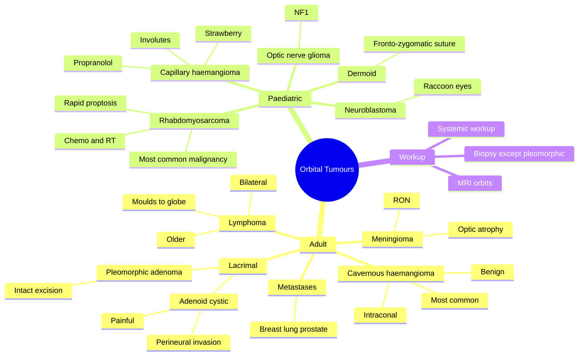

# Orbital Tumours

Related: [[Proptosis (Approach)]], [[Thyroid Eye Disease]], [[Orbital Cellulitis]]

> [!tip] **FCPS/MRCP Priority: MEDIUM**
> Adult: cavernous haemangioma, lymphoma, meningioma, metastases, lacrimal. Paediatric: rhabdomyosarcoma, dermoid. MRI + biopsy.

---

## Learning Objectives
- [ ] List the most common adult and paediatric orbital tumours
- [ ] Distinguish benign from malignant orbital lesions
- [ ] Recognise specific tumour features (e.g., rhabdomyosarcoma emergency, pleomorphic adenoma intact excision)
- [ ] Apply appropriate imaging (MRI vs CT)
- [ ] State the principles of management for each major tumour

---

## 1. Adult Orbital Tumours

| Tumour | Notes |
|--------|-------|
| **Cavernous haemangioma** | Most common benign, well-defined, painless, slow proptosis, intraconal |
| **Lymphoma** | Older, bilateral, moulds to globe, biopsy needed (systemic workup) |
| **Pleomorphic adenoma (lacrimal gland)** | Benign, painless, slowly progressive, requires intact excision (NOT biopsy) |
| **Adenoid cystic carcinoma (lacrimal)** | Malignant, painful, perineural invasion, poor prognosis |
| **Meningioma (sphenoid wing, optic nerve sheath)** | Slow, optic atrophy, optociliary shunt (RON) |
| **Metastases** | Breast, lung, prostate; rapid, painful, often known primary |
| **Melanoma** | From uvea or conjunctiva, secondary orbital extension |
| **Lacrimal sac tumours** | Lacrimal obstruction, mass, bloody epiphora |
| **Fibrous histiocytoma** | Benign, well-defined |
| **Schwannoma / neurofibroma** | Slow-growing, peripheral nerve sheath |

### Key Adult Tumour Pearls
- **Cavernous haemangioma** = most common benign; painless, axial, slow, intraconal; surgical excision (lateral orbitotomy)
- **Lymphoma** = most common malignant in older adults; bilateral, moulds to globe; biopsy + systemic workup
- **Adenoid cystic carcinoma** = PAIN, perineural invasion, poor prognosis; exenteration + RT
- **Pleomorphic adenoma** = intact excision only (biopsy causes recurrence and risk of malignant transformation)

---

## 2. Paediatric Orbital Tumours

| Tumour | Notes |
|--------|-------|
| **Rhabdomyosarcoma** | Most common primary orbital malignancy, rapid proptosis, child <10y, **ONCOLOGIC EMERGENCY** |
| **Dermoid cyst** | Most common benign, painless, smooth, round, at fronto-zygomatic suture |
| **Capillary haemangioma** | Infant, grows then involutes, superficial "strawberry" |
| **Lymphangioma** | Child, slow, multiloculated, may enlarge with URIs |
| **Optic nerve glioma** | NF1 association, painless ↓VA, proptosis, fusiform enlargement |
| **Optic nerve sheath meningioma** | Rare in children |
| **Neuroblastoma metastasis** | Child, rapid proptosis, periorbital ecchymosis ("raccoon eyes") |
| **Retinoblastoma (orbital extension)** | Leukocoria, orbital spread |
| **Ewing sarcoma / leukaemia** | Rapid, systemic features |

### Key Paediatric Tumour Pearls
- **Rhabdomyosarcoma** = embryonal type most common; rapid onset (days–weeks); treat with chemotherapy + radiotherapy (avoid exenteration if possible)
- **Dermoid cyst** = superficial, painless, smooth, at fronto-zygomatic suture; complete excision including cyst wall
- **Optic nerve glioma** = NF1 association, fusiform optic nerve, ↓VA, slow proptosis
- **Neuroblastoma metastases** = "raccoon eyes" periorbital ecchymosis, child <5y, abdominal primary

---

## 3. Clinical Features

- **Proptosis** (axial vs non-axial)
- **Pain** (suggestive of malignancy, inflammation, infection)
- **↓VA** (optic nerve involvement)
- **Diplopia** (EOM restriction)
- **Palpable mass**
- **Fundus:** optic disc oedema, optic atrophy, choroidal folds
- **RAPD** (optic nerve compression)
- **Lid changes** (oedema, erythema, ecchymosis)
- **Sensory loss** (V1, V2 in malignant invasion)

### Red Flags for Malignancy
- Rapid onset (weeks)
- Pain
- ↓VA
- Diplopia
- Non-axial proptosis
- Known primary malignancy
- Perineural invasion signs (V hypoesthesia)

---

## 4. Investigations

- **MRI orbits + brain with contrast** (best for soft tissue)
  - CT better for bony detail, calcification
- **Biopsy** (anterior, image-guided, or surgical) — *except* for pleomorphic adenoma (intact excision)
- **Systemic workup** for lymphoma (CT chest/abdomen/pelvis, bone marrow) and metastases (mammogram, CT chest, PSA)
- **Hormonal** (TFTs, TSI) for TED
- **Tumour markers** where relevant (PSA, β-HCG, AFP for germ cell)

---

## 5. Management

| Tumour | Treatment |
|--------|-----------|
| **Benign, asymptomatic** | Observe |
| **Cavernous haemangioma** | Surgical excision (lateral orbitotomy) |
| **Lymphoma** | Chemo + RT, systemic workup |
| **Rhabdomyosarcoma** | Chemo + RT (avoid exenteration if possible) |
| **Lacrimal gland pleomorphic adenoma** | Intact excision with bone (lateral orbitotomy + rim) — NO biopsy |
| **Adenoid cystic carcinoma** | Exenteration + RT, poor prognosis |
| **Metastases** | Systemic treatment, palliative orbital RT |
| **Dermoid cyst** | Complete surgical excision (with cyst wall) |
| **Optic nerve glioma (NF1)** | Observe / surgery if progressive, ± chemo |
| **Capillary haemangioma** | Propranolol (oral), steroids, observation (often involutes) |
| **Neuroblastoma metastasis** | Systemic chemo + RT |

### Special Note: Lacrimal Gland Tumours
- **Pleomorphic adenoma** = benign, painless, slow-growing, well-defined fossa mass; **intact excision with adjacent bone**; biopsy associated with recurrence and risk of malignant transformation
- **Adenoid cystic carcinoma** = malignant, PAINFUL, ill-defined, perineural invasion, requires exenteration + RT

---

## 6. FCPS/MRCP High-Yield Summary

| Adult | Paediatric |
|-------|-----------|
| Cavernous haemangioma (benign, most common) | Rhabdomyosarcoma (malignant, emergency) |
| Lymphoma (older, malignant) | Dermoid (benign, most common) |
| Lacrimal — pleomorphic adenoma (intact excision) | Capillary haemangioma (involutes) |
| Lacrimal — adenoid cystic (painful, malignant) | Optic nerve glioma (NF1) |
| Meningioma (RON) | Neuroblastoma mets (raccoon eyes) |
| Metastases (breast, lung, prostate) | Lymphangioma (multiloculated) |

---

## 7. Viva Questions

1. **Q:** What is the most common primary orbital malignancy in children?
   **A:** Rhabdomyosarcoma (embryonal type, <10y, rapid proptosis).

2. **Q:** What is the most common benign orbital tumour in adults?
   **A:** Cavernous haemangioma (intraconal, slow, painless axial proptosis).

3. **Q:** How is pleomorphic adenoma of the lacrimal gland managed?
   **A:** Intact excision with adjacent bone (lateral orbitotomy + bone flap); **NO biopsy** (risk of recurrence and malignant transformation).

4. **Q:** What is the most common malignant orbital tumour in older adults?
   **A:** Lymphoma (often MALT, bilateral, moulds to globe).

5. **Q:** What tumour is associated with "raccoon eyes" in children?
   **A:** Neuroblastoma metastasis.

6. **Q:** Why is adenoid cystic carcinoma painful?
   **A:** Due to perineural invasion.

---

## 8. Common Confusions / Exam Traps

| Confusion | Clarification |
|-----------|---------------|
| "Pleomorphic adenoma should be biopsied" | **NO** — biopsy causes recurrence and risk of malignant transformation. Intact excision only |
| "Rhabdomyosarcoma always needs exenteration" | NO — chemo + RT is first-line; exenteration reserved for resistant/recurrent |
| "Dermoid cyst should be drained" | NO — must be excised whole with cyst wall |
| "Capillary haemangioma needs urgent surgery" | Often involutes; propranolol first-line for problematic lesions |
| "Orbital lymphoma is unilateral" | Often **bilateral**; moulds to globe and posterior structures |
| "Cavernous haemangioma is malignant" | **Benign** — most common benign adult orbital tumour |

---

## 9. Mnemonics

1. **"CHILD = Common, Haemangioma Involutes, Lacrimal, Dermoid"** — common benign paediatric tumours
2. **"CHARM" adult malignant** — Carcinoma (metastases), Lymphoma, Adenoid cystic, Rhabdomyosarcoma (rare in adult), Meningioma (rare malignant)
3. **"Paediatric EMS"** — Rhabdomyosarcoma Emergency, MRI + biopsy, Surgery/chemo/RT

---

## 10. Mind Map

---

## 11. One-Page Revision Card

| **Topic** | **Orbital Tumours** |
|-----------|---------------------|
| **Most common adult benign** | Cavernous haemangioma |
| **Most common adult malignant** | Lymphoma |
| **Most common paediatric malignant** | Rhabdomyosarcoma (emergency) |
| **Most common paediatric benign** | Dermoid cyst |
| **Lacrimal benign** | Pleomorphic adenoma (intact excision, no biopsy) |
| **Lacrimal malignant** | Adenoid cystic (painful, perineural) |
| **NF1 association** | Optic nerve glioma |
| **Raccoon eyes** | Neuroblastoma metastasis |
| **Imaging** | MRI orbits + brain |
| **Viva Pearl** | "Don't biopsy pleomorphic adenoma" |

---

## Spaced Repetition Trackers

### 24-Hour Recall Prompts
- [ ] State the most common adult benign and malignant orbital tumours
- [ ] State the most common paediatric malignant orbital tumour
- [ ] Why is pleomorphic adenoma of the lacrimal gland not biopsied?
- [ ] What tumour causes raccoon eyes in children?
- [ ] First-line treatment for rhabdomyosarcoma

### Revision Schedule
- [ ] **Day 1** completed (creation + 24h recall)
- [ ] **Day 3** revision completed
- [ ] **Day 7** revision completed
- [ ] **Day 15** revision completed
- [ ] **Day 30** revision completed
- [ ] **Day 90** revision completed

---

## Must Know / Should Know / Nice to Know

### Must Know (Core for passing)
- [x] Most common adult benign (cavernous haemangioma)
- [x] Most common paediatric malignant (rhabdomyosarcoma)
- [x] Pleomorphic adenoma = intact excision, no biopsy
- [x] Adenoid cystic = painful, perineural
- [x] Imaging: MRI orbits

### Should Know (High probability)
- [x] Lymphoma in older adults
- [x] Dermoid cyst at fronto-zygomatic suture
- [x] Capillary haemangioma + propranolol
- [x] Optic nerve glioma + NF1
- [x] Metastases (breast, lung, prostate)

### Nice to Know (Differentiator)
- [ ] Lymphangioma and URI enlargement
- [ ] Lacrimal sac tumours
- [ ] Ewing sarcoma and other rare tumours
- [ ] Histopathology of rhabdomyosarcoma subtypes

---

## My Weak Points
- [ ] Add personal weak areas here

---

## Self-Test Scorecard

| Section | Score /5 |
|---------|----------|
| Understanding: | /10 |
| Recall: | /10 |
| MCQ Performance: | /10 |
| SBA Performance: | /10 |
| Viva Confidence: | /10 |
| Total: | /50 |

> [!tip] **Interpretation:** <35 = weak topic, 35-44 = acceptable but insecure, 45+ = strong exam-ready topic.

---

## Exam Answer Modes

### Long Answer Skeleton
1. Classification (adult vs paediatric, benign vs malignant)
2. Most common adult benign (cavernous haemangioma)
3. Most common adult malignant (lymphoma)
4. Most common paediatric malignant (rhabdomyosarcoma)
5. Lacrimal tumours — pleomorphic adenoma (intact excision) vs adenoid cystic (painful, perineural)
6. Investigations — MRI orbits + biopsy (except pleomorphic adenoma)
7. Management — depends on type

### Short Note Skeleton
- Most common adult benign (cavernous haemangioma)
- Most common paediatric malignant (rhabdomyosarcoma)
- Lacrimal tumour pearl: pleomorphic adenoma = intact excision

### Viva One-Liners
- **Q:** Most common adult benign orbital tumour? → **A:** Cavernous haemangioma
- **Q:** Most common paediatric malignant? → **A:** Rhabdomyosarcoma
- **Q:** Why no biopsy in pleomorphic adenoma? → **A:** Risk of recurrence + malignant transformation
- **Q:** Why is adenoid cystic painful? → **A:** Perineural invasion
- **Q:** Raccoon eyes in a child? → **A:** Neuroblastoma metastasis

### Ward-Case Discussion Points
- Identify red flags for malignancy (rapid, painful, ↓VA, diplopia)
- Choose MRI as first imaging
- Recognise pleomorphic adenoma — do NOT biopsy
- Recognise rhabdomyosarcoma as oncologic emergency
- Recognise raccoon eyes → search for neuroblastoma
- Coordinate with oncology for malignant disease

### Last-Night-Before-Exam Sheet
- Top 3 facts: cavernous haemangioma (adult), rhabdomyosarcoma (paeds), pleomorphic adenoma (no biopsy)
- 1 mnemonic: "CHILD for benign paeds"
- Must-know: lacrimal gland — intact excision for pleomorphic adenoma

---

## Summary

Orbital tumours vary by age. In **adults**: cavernous haemangioma is the most common benign; lymphoma is the most common malignant. In **children**: rhabdomyosarcoma is the most common primary malignancy (oncologic emergency); dermoid cyst is the most common benign. **Lacrimal gland tumours** are classically tested: pleomorphic adenoma (benign) requires intact excision with bone (NEVER biopsy) and adenoid cystic carcinoma (malignant) is painful due to perineural invasion. **MRI orbits + brain** with contrast is the imaging of choice. **Biopsy** is needed for most lesions except pleomorphic adenoma. **Red flags** for malignancy include rapid onset, pain, ↓VA, diplopia, and known primary. Raccoon eyes in a child = think neuroblastoma.

## MCQs (10)

1. **Question:** The most common primary orbital malignancy in children is:
   **Options:** A. Rhabdomyosarcoma B. Lymphoma C. Optic nerve glioma D. Meningioma E. Dermoid
   **Answer:** A
   **Explanation:** Rhabdomyosarcoma is the most common primary orbital malignancy in children.

2. **Question:** The most common benign orbital tumour in adults is:
   **Options:** A. Lymphoma B. Cavernous haemangioma C. Meningioma D. Metastasis E. Glioma
   **Answer:** B
   **Explanation:** Cavernous haemangioma is the most common benign orbital tumour in adults.

3. **Question:** Pleomorphic adenoma of the lacrimal gland is managed by:
   **Options:** A. Biopsy + observation B. Incisional biopsy + RT C. Intact excision with bone D. Steroids E. Chemotherapy
   **Answer:** C
   **Explanation:** Pleomorphic adenoma requires intact excision with adjacent bone — biopsy causes recurrence and risk of malignant transformation.

4. **Question:** Adenoid cystic carcinoma of the lacrimal gland characteristically presents with:
   **Options:** A. Painless slow proptosis B. Pain, perineural invasion C. Bilateral moulding D. NF1 association E. Strawberry lesion
   **Answer:** B
   **Explanation:** Adenoid cystic carcinoma is painful due to perineural invasion.

5. **Question:** Orbital lymphoma characteristically:
   **Options:** A. Is unilateral only B. Moulds to the globe and is often bilateral C. Causes pain D. Requires exenteration E. Is benign
   **Answer:** B
   **Explanation:** Orbital lymphoma often moulds to globe/posterior structures and may be bilateral.

6. **Question:** "Raccoon eyes" (periorbital ecchymosis) in a child is most suggestive of:
   **Options:** A. Rhabdomyosarcoma B. Neuroblastoma metastasis C. Capillary haemangioma D. Dermoid E. Lymphoma
   **Answer:** B
   **Explanation:** Raccoon eyes in a child = neuroblastoma metastasis (from adrenal/sympathetic chain).

7. **Question:** Capillary haemangioma in infants is best treated with:
   **Options:** A. Urgent surgery B. Propranolol (oral) C. Chemotherapy D. Radiotherapy E. Cryotherapy
   **Answer:** B
   **Explanation:** Propranolol is first-line for problematic capillary haemangiomas; many involute spontaneously.

8. **Question:** Optic nerve glioma is most strongly associated with:
   **Options:** A. NF1 B. Tuberous sclerosis C. Sturge-Weber D. Von Hippel-Lindau E. None
   **Answer:** A
   **Explanation:** Optic nerve glioma is associated with NF1.

9. **Question:** The most common primary source of orbital metastases in adults is:
   **Options:** A. Lung, breast, prostate B. Skin, thyroid, kidney C. Liver, pancreas, colon D. None E. All
   **Answer:** A
   **Explanation:** Breast, lung, and prostate are the most common sources of orbital metastases.

10. **Question:** First-line treatment for orbital rhabdomyosarcoma is:
    **Options:** A. Exenteration B. Chemotherapy + radiotherapy C. Steroids D. Cryotherapy E. Observation
    **Answer:** B
    **Explanation:** Chemo + RT is first-line; exenteration is reserved for resistant/recurrent disease.

## SBA Questions (10)

1. **Scenario:** A 6-year-old presents with 2-week history of rapidly progressive unilateral proptosis. MRI shows an extraconal mass in the superonasal orbit.
   **Question:** Most likely diagnosis?
   **Options:** A. Rhabdomyosarcoma B. Dermoid C. Capillary haemangioma D. Lymphoma E. None
   **Answer:** A
   **Explanation:** Rapid proptosis in a child <10y = rhabdomyosarcoma until proven otherwise.

2. **Scenario:** A 30-year-old has a slow-growing painless lacrimal gland fossa mass. MRI shows a well-defined mass without bony erosion.
   **Question:** Most likely diagnosis and management?
   **Options:** A. Pleomorphic adenoma — biopsy B. Pleomorphic adenoma — intact excision with bone C. Adenoid cystic — exenteration D. Lymphoma — RT E. None
   **Answer:** B
   **Explanation:** Painless, well-defined lacrimal mass = pleomorphic adenoma — intact excision, NO biopsy.

3. **Scenario:** A 50-year-old with bilateral orbital masses that mould to the globe. He has a history of weight loss and night sweats.
   **Question:** Most likely diagnosis?
   **Options:** A. Lymphoma B. Cavernous haemangioma C. Rhabdomyosarcoma D. Meningioma E. None
   **Answer:** A
   **Explanation:** Bilateral moulding to globe + systemic B-symptoms = orbital lymphoma.

4. **Scenario:** A 4-year-old has a smooth, painless, well-circumscribed mass at the fronto-zygomatic suture.
   **Question:** Most likely diagnosis?
   **Options:** A. Dermoid cyst B. Rhabdomyosarcoma C. Capillary haemangioma D. Lymphangioma E. None
   **Answer:** A
   **Explanation:** Smooth, painless, at fronto-zygomatic suture = dermoid cyst.

5. **Scenario:** A 3-year-old has a superficial "strawberry" lesion on the eyelid that has been growing. Vision is normal.
   **Question:** Most appropriate treatment?
   **Options:** A. Urgent surgery B. Oral propranolol C. Radiotherapy D. Chemotherapy E. Exenteration
   **Answer:** B
   **Explanation:** Capillary haemangioma — propranolol first-line.

6. **Scenario:** A 60-year-old woman with known breast cancer presents with rapid painful proptosis and ↓VA.
   **Question:** Most likely diagnosis?
   **Options:** A. Cavernous haemangioma B. Orbital metastasis C. Pleomorphic adenoma D. Lymphoma E. None
   **Answer:** B
   **Explanation:** Rapid painful proptosis + known breast primary = metastasis.

7. **Scenario:** A 35-year-old with NF1 has painless ↓VA and proptosis. MRI shows fusiform enlargement of the optic nerve.
   **Question:** Most likely diagnosis?
   **Options:** A. Optic nerve glioma B. Optic nerve sheath meningioma C. Lymphoma D. Rhabdomyosarcoma E. None
   **Answer:** A
   **Explanation:** Fusiform optic nerve enlargement + NF1 = optic nerve glioma.

8. **Scenario:** A 55-year-old has a painful lacrimal gland mass with V2 numbness and ill-defined margins on MRI. There is bony erosion.
   **Question:** Most likely diagnosis?
   **Options:** A. Pleomorphic adenoma B. Adenoid cystic carcinoma C. Lymphoma D. Dermoid E. None
   **Answer:** B
   **Explanation:** Pain + V2 numbness + bony erosion = adenoid cystic carcinoma (perineural invasion).

9. **Scenario:** A 70-year-old man has bilateral painless orbital masses. Biopsy shows CD20+ lymphoid infiltrate. What is the next step?
   **Options:** A. Exenteration B. Chemo + RT + systemic workup C. Topical steroid D. Observation E. None
   **Answer:** B
   **Explanation:** B-cell lymphoma — systemic workup + chemo + RT.

10. **Scenario:** A 4-year-old with rapid proptosis is diagnosed with rhabdomyosarcoma on biopsy. What is the most appropriate first-line treatment?
    **Options:** A. Exenteration B. Chemotherapy + radiotherapy C. Observation D. Laser E. None
    **Answer:** B
    **Explanation:** Chemo + RT first-line; exenteration is last resort.

## Flashcards

- **Q:** Most common primary orbital malignancy in children?
  **A:** Rhabdomyosarcoma (embryonal type, <10y, rapid proptosis).
- **Q:** Most common benign orbital tumour in adults?
  **A:** Cavernous haemangioma.
- **Q:** Why no biopsy in pleomorphic adenoma of lacrimal gland?
  **A:** Causes recurrence and risk of malignant transformation — intact excision with bone.
- **Q:** What tumour is associated with raccoon eyes in children?
  **A:** Neuroblastoma metastasis.
- **Q:** Treatment of orbital rhabdomyosarcoma?
  **A:** Chemotherapy + radiotherapy (avoid exenteration if possible).

## Answer Key with Explanations

### MCQs
1. A — Rhabdomyosarcoma is most common paediatric malignant
2. B — Cavernous haemangioma is most common adult benign
3. C — Intact excision (no biopsy)
4. B — Adenoid cystic is painful, perineural
5. B — Lymphoma moulds to globe
6. B — Raccoon eyes = neuroblastoma
7. B — Propranolol for capillary haemangioma
8. A — Optic nerve glioma + NF1
9. A — Breast, lung, prostate metastases
10. B — Chemo + RT first-line

### SBAs
1. A — Rapid proptosis in child = rhabdomyosarcoma
2. B — Pleomorphic adenoma = intact excision
3. A — Lymphoma bilateral moulding
4. A — Dermoid at fronto-zygomatic suture
5. B — Propranolol for capillary haemangioma
6. B — Metastasis from breast
7. A — Optic nerve glioma + NF1
8. B — Adenoid cystic = pain + perineural
9. B — Lymphoma = systemic workup + chemo/RT
10. B — Chemo + RT first-line

## Tags
#medicine #davidson #ophthalmology #orbital-tumour #fcps #mrcp
