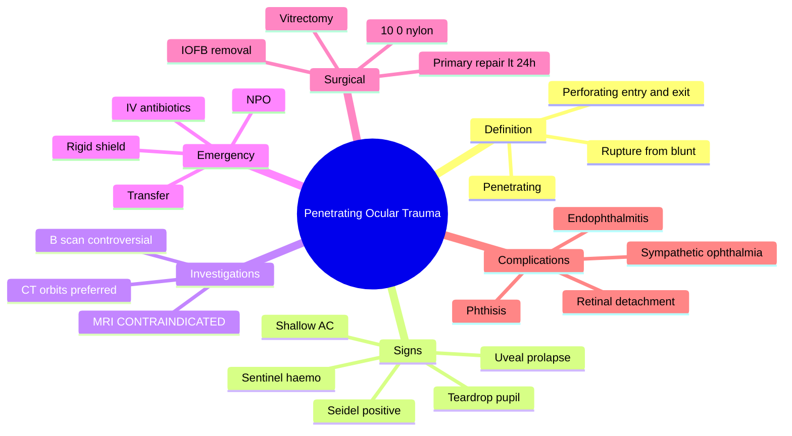

# Penetrating Ocular Trauma and Globe Rupture

Related: [[Endophthalmitis]], [[Sympathetic Ophthalmia]], [[Ocular Foreign Body]]

> [!tip] **FCPS/MRCP Priority: CRITICAL**
> Open globe: shield, no pressure, NPO, IV antibiotics, transfer to vitreoretinal surgeon. MRI CONTRAINDICATED. Sympathetic ophthalmia risk.

---

## Learning Objectives
- [ ] Define penetrating, perforating, and globe rupture
- [ ] Recognise clinical signs of open globe
- [ ] Apply emergency management (shield, NPO, IV AB, transfer)
- [ ] Select appropriate imaging (CT, never MRI)
- [ ] Describe surgical and post-op management
- [ ] Identify complications (endophthalmitis, RD, sympathetic ophthalmia)

---

## 1. Definition

- **Penetrating injury:** Full-thickness wound, single entry, no exit
- **Perforating injury:** Full-thickness with entry AND exit
- **Globe rupture:** Full-thickness wound from blunt force
- **IOFB:** Intraocular foreign body (subset)

### Birmingham Eye Trauma Terminology (BETT)
- Closed globe: contusion, lamellar laceration
- Open globe: rupture, penetrating, perforating, IOFB

---

## 2. Clinical Features

- **Pain, ↓VA**
- History of trauma (often with high-velocity object)
- Visible wound, irregular pupil (teardrop pointing to wound)
- Shallow or flat AC
- Vitreous prolapse, lens opacity, uveal prolapse
- Hyphema, VH
- **Seidel test positive** (aqueous leak)

### Signs of Open Globe
- Teardrop pupil
- 360° subconjunctival haemorrhage (sentinel)
- Dark tissue under conjunctiva (uveal prolapse)
- Shallow AC
- ↓IOP (often, but not always)
- Positive Seidel

| Sign | Mechanism |
|------|-----------|
| Teardrop pupil | Iris pulled toward wound |
| 360° subconj haemorrhage | "Sentinel" sign |
| Dark uvea under conjunctiva | Uveal prolapse |
| Shallow AC | Aqueous leak |
| Positive Seidel | Fluorescein dilution by aqueous |

---

## 3. Investigations

- **Avoid MRI** (magnetic FB may move)
- **CT orbits** (axial + coronal) — assess extent, IOFB
- B-scan US (controversial — only if needed, by ophthalmologist)
- **No MRI, no MRI**

---

## 4. Management — EMERGENCY

### Immediate
- **Rigid eye shield** (NO pressure, NO patching)
- **NPO** (for surgery)
- **Antiemetic** (avoid Valsalva)
- **Tetanus prophylaxis**
- **Avoid topical medications** (especially if contaminated)
- **Systemic antibiotic:** IV ceftriaxone + vancomycin (endophthalmitis coverage)
- **Analgesia**

### Surgical
- **Primary repair** (within 24h, ideally)
- Wound closure (10-0 nylon)
- AC reformation
- IOFB removal
- Lensectomy if needed
- Vitrectomy (combined or staged)
- Intravitreal antibiotics (endophthalmitis risk)

### Post-op
- Topical steroid, antibiotic, cycloplegia
- Monitor for endophthalmitis, RD, sympathetic ophthalmia
- **Enucleation** of blind, painful, irrepairable eye within 2 weeks (controversial — may prevent SO)
- Vaccinations (Tdap)

---

## 5. Complications

- **Endophthalmitis** (5–10%, more if IOFB, delayed)
- **Retinal detachment**
- **Sympathetic ophthalmia** (bilateral)
- Phthisis
- Permanent ↓VA

---

## 6. Red Flags / Emergencies

- ALL suspected open globe = ophthalmic emergency
- High-velocity injury
- Visible wound / prolapsed uvea
- Teardrop pupil
- 360° subconjunctival haemorrhage
- Shallow AC
- Positive Seidel

---

## 7. FCPS/MRCP Summary

| Topic | Key Points |
|-------|------------|
| Recognition | Teardrop pupil, sentinel haemo, Seidel+, shallow AC |
| Imaging | CT (NOT MRI) |
| Emergency | Shield, NPO, IV AB, transfer |
| Surgery | Primary repair <24h |
| Risk | Endophthalmitis, sympathetic ophthalmia |

---

## 8. Viva Questions

1. **Q:** Why is MRI contraindicated in suspected open globe?
   **A:** Magnetic FB may move and damage intraocular structures; CT is preferred.

2. **Q:** What is sympathetic ophthalmia?
   **A:** Bilateral granulomatous panuveitis after penetrating injury to one eye.

3. **Q:** What is the role of early enucleation?
   **A:** For blind, painful, irrepairable eyes within 2 weeks — may prevent sympathetic ophthalmia (controversial).

---

## 9. Common Confusions / Exam Traps

| Confusion | Clarification |
|-----------|---------------|
| "Open globe = patch the eye" | **NO — rigid shield only**, no pressure, no patching |
| "MRI is best for soft tissue FB" | **CT is the imaging of choice** for any suspected metallic FB |
| "Sympathetic ophthalmia affects only the injured eye" | **Bilateral granulomatous panuveitis** — affects both eyes |
| "Topical anaesthetic is fine" | **Avoid** — toxic to epithelium, contaminates wound |
| "B-scan US is always safe" | **Controversial** — risk of extrusion; only by ophthalmologist if needed |
| "Enucleation is always done" | **Controversial** — for blind, painful, irrepairable eyes only; within 2 weeks |

---

## 10. Mnemonics

1. **"SNAKE for open globe"** — Shield, NPO, Antiemetic, Key antibiotics (IV), Examine (do not press)
2. **"CT NOT MRI"** — Computed Tomography is the imaging of choice; MRI is contraindicated
3. **"3 E's"** — Endophthalmitis, RD, (sympathetic o)phthalmia
4. **"Sentinel sign"** — 360° subconjunctival haemorrhage is the classic sign of occult rupture

---

## 11. Mind Map

---

## 12. One-Page Revision Card

| **Topic** | **Penetrating Ocular Trauma** |
|-----------|------------------------------|
| **Definition** | Full-thickness wound |
| **Recognition** | Teardrop pupil, sentinel haemo, Seidel+ |
| **Imaging** | CT (NEVER MRI) |
| **Emergency** | Shield, NPO, IV AB, transfer |
| **Surgery** | Primary repair <24h |
| **AB cover** | IV ceftriaxone + vancomycin |
| **Complications** | Endophthalmitis, RD, sympathetic ophthalmia |
| **Viva Pearl** | Shield not patch; CT not MRI |

---

## Spaced Repetition Trackers

### 24-Hour Recall Prompts
- [ ] Define penetrating, perforating, and globe rupture
- [ ] List 4 signs of open globe
- [ ] State immediate management (shield, NPO, IV AB)
- [ ] Why is MRI contraindicated?
- [ ] List 3 complications

### Revision Schedule
- [ ] **Day 1** completed (creation + 24h recall)
- [ ] **Day 3** revision completed
- [ ] **Day 7** revision completed
- [ ] **Day 15** revision completed
- [ ] **Day 30** revision completed
- [ ] **Day 90** revision completed

---

## Must Know / Should Know / Nice to Know

### Must Know (Core for passing)
- [x] Open globe = emergency
- [x] Shield (no pressure) — NOT patch
- [x] NPO, IV antibiotics, transfer
- [x] CT (NOT MRI)
- [x] Endophthalmitis, RD, sympathetic ophthalmia — major complications

### Should Know (High probability)
- [x] Teardrop pupil, sentinel haemorrhage, positive Seidel
- [x] Primary repair <24h
- [x] IV ceftriaxone + vancomycin
- [x] Tetanus prophylaxis

### Nice to Know (Differentiator)
- [ ] Sympathetic ophthalmia pathogenesis (T-cell mediated)
- [ ] Birmingham Eye Trauma Terminology (BETT)
- [ ] Enucleation controversy within 2 weeks
- [ ] Intravitreal antibiotics

---

## My Weak Points
- [ ] Add personal weak areas here

---

## Self-Test Scorecard

| Section | Score /5 |
|---------|----------|
| Understanding: | /10 |
| Recall: | /10 |
| MCQ Performance: | /10 |
| SBA Performance: | /10 |
| Viva Confidence: | /10 |
| Total: | /50 |

> [!tip] **Interpretation:** <35 = weak topic, 35-44 = acceptable but insecure, 45+ = strong exam-ready topic.

---

## Exam Answer Modes

### Long Answer Skeleton
1. Definition (penetrating, perforating, rupture)
2. Clinical features (pain, ↓VA, history of high-velocity trauma)
3. Signs of open globe (teardrop pupil, sentinel haemorrhage, Seidel+, shallow AC)
4. Investigations (CT orbits — never MRI)
5. Emergency management (rigid shield, NPO, IV AB, transfer)
6. Surgical management (primary repair <24h, vitrectomy, IOFB removal)
7. Post-op care (steroid, AB, cycloplegia, monitor for complications)
8. Complications (endophthalmitis, RD, sympathetic ophthalmia, phthisis)
9. Enucleation (controversial — within 2 weeks for blind painful eye)

### Short Note Skeleton
- Definition + signs of open globe
- Emergency management (shield, NPO, IV AB)
- Imaging: CT not MRI
- Surgical repair <24h
- Complications: endophthalmitis, SO, RD

### Viva One-Liners
- **Q:** First step in open globe? → **A:** Rigid shield (no pressure), NPO, IV AB, urgent transfer
- **Q:** Imaging of choice? → **A:** CT orbits (NEVER MRI)
- **Q:** What is sympathetic ophthalmia? → **A:** Bilateral granulomatous panuveitis after penetrating injury
- **Q:** Sentinel sign? → **A:** 360° subconjunctival haemorrhage
- **Q:** Seidel test positive? → **A:** Aqueous leak from corneal/scleral wound
- **Q:** Antibiotic cover? → **A:** IV ceftriaxone + vancomycin (and intravitreal)

### Ward-Case Discussion Points
- Recognise open globe (teardrop pupil, sentinel haemo)
- Shield (no pressure) — never patch
- NPO for potential surgery
- IV antibiotics — broad spectrum
- Tetanus prophylaxis
- Discuss sympathetic ophthalmia and enucleation
- Monitor for endophthalmitis (pain, ↓VA, hypopyon)

### Last-Night-Before-Exam Sheet
- **Top 3 facts:** Shield not patch; CT not MRI; Primary repair <24h
- **1 mnemonic:** "SNAKE" (Shield, NPO, Antiemetic, Key antibiotics, Examine)
- **Must-know differential:** Penetrating vs blunt trauma
- **3 E's:** Endophthalmitis, RD, (sympathetic o)phthalmia
- **Drug:** IV ceftriaxone + vancomycin

---

## Summary

Penetrating ocular trauma / globe rupture is an emergency. Shield (no pressure), NPO, IV antibiotics, urgent repair. CT (not MRI). Complications: endophthalmitis, sympathetic ophthalmia, RD.

---

## MCQs (10)

1. **Question:** Best imaging for open globe injury:
   **Options:** A. MRI B. CT C. US D. X-ray E. None
   **Answer:** B
   **Explanation:** CT — avoid MRI.

2. **Question:** Sentinel sign of open globe:
   **Options:** A. Hyphema B. 360° subconjunctival haemorrhage C. RAPD D. None E. All
   **Answer:** B
   **Explanation:** 360° subconj haemo.

3. **Question:** Seidel test detects:
   **Options:** A. Infection B. Aqueous leak (perforation) C. Glaucoma D. None E. All
   **Answer:** B
   **Explanation:** Aqueous leak.

4. **Question:** First-aid management of suspected open globe:
   **Options:** A. Pad and bandage B. Rigid shield, no pressure C. Topical anaesthetic D. Irrigation E. MRI
   **Answer:** B
   **Explanation:** Rigid shield — NO pressure, NO patching.

5. **Question:** Sympathetic ophthalmia is:
   **Options:** A. Unilateral uveitis B. Bilateral granulomatous panuveitis after penetrating injury C. Conjunctivitis D. Glaucoma E. Cataract
   **Answer:** B
   **Explanation:** Bilateral granulomatous panuveitis — T-cell mediated.

6. **Question:** A teardrop pupil in trauma indicates:
   **Options:** A. Normal variant B. Open globe (rupture) C. Uveitis D. Glaucoma E. Cataract
   **Answer:** B
   **Explanation:** Teardrop pupil = iris pulled toward the wound (open globe).

7. **Question:** Timing of primary repair in open globe:
   **Options:** A. Within 1h B. Within 6h C. Within 24h D. Within 1 week E. Elective
   **Answer:** C
   **Explanation:** Primary repair within 24h — ideally as soon as possible.

8. **Question:** Why is MRI contraindicated in open globe?
   **Options:** A. Poor resolution B. Magnetic FB may move and damage structures C. Slow D. Expensive E. Causes infection
   **Answer:** B
   **Explanation:** Magnetic FB may move, causing further intraocular damage.

9. **Question:** Endophthalmitis risk in open globe is highest with:
   **Options:** A. Clean wound B. Delayed presentation (>24h) C. Primary repair D. Antibiotic cover E. Topical anaesthetic
   **Answer:** B
   **Explanation:** Delayed presentation increases infection risk; also higher with IOFB (especially organic).

10. **Question:** A patient has an open globe injury with IOFB. Best antibiotic cover to prevent endophthalmitis:
    **Options:** A. Topical chloramphenicol B. IV ceftriaxone + vancomycin (and intravitreal) C. Oral amoxicillin D. Topical fluoroquinolone E. No antibiotics
    **Answer:** B
    **Explanation:** IV broad-spectrum (ceftriaxone + vancomycin) + intravitreal AB for IOFB.

---

## SBA Questions (10)

1. **Scenario:** A worker has metal-on-metal injury, teardrop pupil, 360° subconjunctival haemorrhage, shallow AC.
   **Question:** Most appropriate immediate step?
   **Options:** A. Topical anaesthetic B. Rigid shield, NPO, IV AB, transfer C. Topical AB D. MRI E. None
   **Answer:** B
   **Explanation:** Open globe emergency — shield, NPO, IV AB.

2. **Scenario:** A patient with open globe has a positive Seidel test on slit-lamp examination.
   **Question:** What does this confirm?
   **Options:** A. Infection B. Aqueous leak from corneal/scleral wound C. Raised IOP D. Lens damage E. Retinal detachment
   **Answer:** B
   **Explanation:** Seidel positive = aqueous leak from full-thickness wound.

3. **Scenario:** A patient with open globe undergoes primary repair. 5 days later, he develops severe pain, ↓VA, hypopyon, and vitritis.
   **Question:** Most likely diagnosis?
   **Options:** A. Uveitis B. Endophthalmitis C. Sympathetic ophthalmia D. RD E. Glaucoma
   **Answer:** B
   **Explanation:** Endophthalmitis — classic presentation 3–7 days post-op.

4. **Scenario:** A patient with history of penetrating injury to the right eye 6 weeks ago now presents with bilateral granulomatous panuveitis.
   **Question:** Most likely diagnosis?
   **Options:** A. Bilateral endophthalmitis B. Sympathetic ophthalmia C. Sarcoidosis D. TB E. Syphilis
   **Answer:** B
   **Explanation:** Sympathetic ophthalmia — bilateral granulomatous panuveitis after penetrating injury.

5. **Scenario:** A patient with open globe needs imaging to rule out IOFB.
   **Question:** Most appropriate imaging?
   **Options:** A. MRI B. CT orbits (axial + coronal) C. B-scan US D. X-ray E. None
   **Answer:** B
   **Explanation:** CT is the imaging of choice for IOFB (not MRI, not B-scan initially).

6. **Scenario:** A patient with open globe is in A&E. The casualty officer wants to patch the eye.
   **Question:** What is the most appropriate advice?
   **Options:** A. Patch as usual B. Rigid shield only, no pressure, no patching C. Topical anaesthetic first D. Irrigation first E. MRI
   **Answer:** B
   **Explanation:** Patching causes pressure on open globe — risk of expulsion; use rigid shield.

7. **Scenario:** A patient has a blind, painful right eye from penetrating injury 10 days ago. The decision is made to enucleate.
   **Question:** What is the rationale?
   **Options:** A. Cosmetic B. Pain relief only C. May prevent sympathetic ophthalmia in the fellow eye (controversial) D. Required by law E. None
   **Answer:** C
   **Explanation:** Early enucleation (within 2 weeks) of blind, painful, irrepairable eye may prevent SO.

8. **Scenario:** A child has an open globe from a glass injury. He has not eaten for 4 hours. Tetanus status unknown.
   **Question:** What is the most appropriate immediate management?
   **Options:** A. Oral fluids B. NPO, IV AB, tetanus cover, shield, transfer C. Topical AB D. Topical anaesthetic E. Discharge
   **Answer:** B
   **Explanation:** NPO (for potential GA), IV AB, tetanus cover, shield, urgent transfer.

9. **Scenario:** A patient with open globe and IOFB has the FB removed 36 hours after injury. He then develops endophthalmitis.
   **Question:** What is the most appropriate intravitreal antibiotic combination?
   **Options:** A. Cefazolin + gentamicin (or vancomycin + ceftazidime) B. Amphotericin C. Fluconazole D. Acyclovir E. Steroid alone
   **Answer:** A
   **Explanation:** Vancomycin + ceftazidime (or cefazolin + gentamicin) — broad-spectrum intravitreal cover.

10. **Scenario:** A patient with open globe is being prepared for theatre. The anaesthetist asks about prophylaxis.
    **Question:** What is the most appropriate antibiotic to give pre-op?
    **Options:** A. Topical chloramphenicol B. IV ceftriaxone + vancomycin C. Oral amoxicillin D. Topical fluoroquinolone E. None
    **Answer:** B
    **Explanation:** IV ceftriaxone + vancomycin for endophthalmitis cover.

---

## Flashcards

- **Q:** What are the immediate steps in open globe injury?
  **A:** Rigid shield (no pressure, no patching), NPO, IV antibiotics (ceftriaxone + vancomycin), tetanus cover, urgent transfer to vitreoretinal surgeon.
- **Q:** What is the imaging of choice in open globe?
  **A:** CT orbits (axial + coronal). MRI is contraindicated — magnetic FB may move.
- **Q:** What is sympathetic ophthalmia?
  **A:** Bilateral granulomatous panuveitis after penetrating injury to one eye — T-cell mediated.
- **Q:** What is the sentinel sign of open globe?
  **A:** 360° subconjunctival haemorrhage.
- **Q:** When is primary repair done?
  **A:** Within 24 hours (ideally as soon as possible).

---

## Answer Key with Explanations

### MCQs
1. B — CT is the imaging of choice
2. B — 360° subconjunctival haemorrhage = sentinel sign
3. B — Seidel test detects aqueous leak
4. B — Rigid shield, no pressure
5. B — Bilateral granulomatous panuveitis
6. B — Teardrop pupil = open globe
7. C — Within 24h
8. B — Magnetic FB may move
9. B — Delayed presentation increases infection risk
10. B — IV ceftriaxone + vancomycin

### SBAs
1. B — Shield, NPO, IV AB, transfer
2. B — Aqueous leak from wound
3. B — Endophthalmitis (3–7 days post-op)
4. B — Sympathetic ophthalmia (bilateral)
5. B — CT orbits is the imaging of choice
6. B — Shield only, no pressure
7. C — Early enucleation may prevent SO
8. B — NPO, IV AB, tetanus, shield
9. A — Vancomycin + ceftazidime intravitreal
10. B — IV ceftriaxone + vancomycin

---

## Tags
#medicine #davidson #ophthalmology #open-globe #trauma #fcps #mrcp
