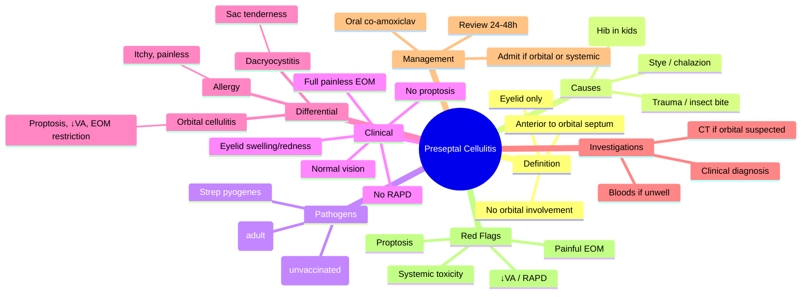

# Preseptal Cellulitis

Related: [[Orbital Cellulitis]]

> [!tip] **FCPS/MRCP Priority: HIGH**
> Eyelid infection ANTERIOR to orbital septum. Mild. Normal vision, no proptosis, no EOM restriction. Oral antibiotics.

---

## Learning Objectives
- [ ] Define preseptal cellulitis and its anatomical location
- [ ] Identify the common causative organisms by age group
- [ ] Differentiate preseptal from orbital (post-septal) cellulitis
- [ ] Recognise clinical features of preseptal cellulitis
- [ ] Apply appropriate empirical antibiotic therapy
- [ ] Identify indications for hospital admission
- [ ] Recognise complications that warrant escalation to orbital cellulitis management

---

## 1. Definition / Epidemiology / Classification

### Definition
- **Preseptal cellulitis:** Infection of the eyelid **anterior to the orbital septum**
- Also called **periorbital cellulitis**
- Limited to eyelid skin and subcutaneous tissues
- Does **not** involve orbital contents

### Epidemiology
- **More common** than orbital cellulitis
- More common in **children** (peak age <10 years)
- Often follows minor periorbital trauma or skin breach
- Generally a mild, non–vision-threatening condition

### Classification
- By source: traumatic, local spread, haematogenous
- By age: childhood (often H. influenzae) vs adult (Staph/Strep)

---

## 2. Aetiology / Pathophysiology

### Causes
- **Periorbital trauma** — abrasion, laceration, insect bite
- **Infected chalazion / external stye (hordeolum)**
- Spread from adjacent structures (sinus, dental — though these more often cause orbital cellulitis)
- **Bacteremia** — H. influenzae in unvaccinated children
- Post-surgical (eyelid, lacrimal)
- Spread from facial cellulitis / impetigo

### Pathophysiology
- Breach of skin barrier → local invasion of soft tissue
- Infection confined anterior to orbital septum (a fibrous barrier extending from the orbital rim to the tarsal plates)
- No involvement of extraocular muscles, optic nerve, or orbital fat

### Pathogens
- **Staphylococcus aureus** (most common overall, and most common in adults)
- **Streptococcus pyogenes**
- **Streptococcus pneumoniae**
- **Haemophilus influenzae type b** (in unvaccinated children — now rare with Hib immunisation)

---

## 3. Clinical Features

### History
- Eyelid swelling, redness, warmth, tenderness
- Often a preceding history of skin breach (insect bite, scratch, stye)
- ± Low-grade fever
- **Vision is normal**
- No pain on eye movement
- No diplopia

### Examination
- Unilateral (usually) or bilateral eyelid erythema, oedema, warmth
- **Visual acuity: NORMAL**
- **Pupils: normal, no RAPD**
- **Eye movements: full, painless**
- **No proptosis**
- No chemosis
- "White eye" — conjunctival injection confined to the eyelid region
- ± Tender preauricular / submandibular lymphadenopathy
- ± Fever (usually low-grade)

### Complications
- Progression to **orbital cellulitis** (failure of orbital septum to contain infection) — a key red flag
- Local abscess formation
- Periorbital necrotising fasciitis (rare, group A Strep)
- Septicaemia (rare in immunocompetent)

---

## 4. Investigations

- **Clinical diagnosis** — usually no investigations needed in mild cases
- **Bloods** (FBC, CRP, blood cultures) if febrile, systemically unwell, or borderline with orbital involvement
- **CT orbits + sinuses** (with contrast) ONLY if:
  - Suspected orbital involvement
  - Proptosis develops
  - Vision deteriorates
  - EOM restriction
  - No response to oral antibiotics in 24–48 h
- Swab of any wound / discharge for culture

---

## 5. Differential Diagnosis

| Condition | Distinguishing Features |
|-----------|-------------------------|
| **Orbital cellulitis** | Proptosis, ↓VA, painful EOM restriction, RAPD, chemosis, fever |
| **Allergic (angio-oedema)** | Usually painless, itchy, bilateral, no fever, no tenderness |
| **Insect bite reaction** | Localised, no fever, history of bite, ± wheal |
| **Chalazion / stye** | Localised nodule, chronic (chalazion) or acute tender (stye) |
| **Blepharitis** | Chronic, bilateral, lid margin scaling/collarettes |
| **Dacryocystitis** | Tender lacrimal sac, ± purulent regurgitation from punctum |
| **Herpes zoster ophthalmicus** | Dermatomal vesicular rash, Hutchinson sign |
| **Periorbital necrotising fasciitis** | Severe pain out of proportion, dusky skin, systemic toxicity |

---

## 6. Management

### Conservative
- Warm compresses
- Analgesia (paracetamol / ibuprofen)
- Reassurance — usually self-limiting with antibiotics

### Medical (Most Cases)
- **Oral antibiotics** (10–14 days)
  - **Co-amoxiclav** (first line, most common choice in UK)
  - OR **Flucloxacillin** (if Staph suspected) + amoxicillin (Hib cover)
  - In children: co-amoxiclav, weight-based dose
- **± Topical antibiotic** (e.g., chloramphenicol) if there is an obvious wound
- **Review in 24–48 h** — ensure improvement
- ± Antipyretics

### Admit / IV Antibiotics If
- Child < 1 year of age
- Systemic illness, high fever
- Suspected orbital (post-septal) involvement
- Immunocompromised patient
- Failure of oral antibiotics
- Bacteraemia suspected
- Unable to tolerate oral medication / poor compliance / social concerns

### Surgical
- **Incision & drainage** if a localised abscess forms (e.g., stye that has suppurated)
- Otherwise not indicated

---

## 7. Complications

- Progression to **orbital cellulitis** (most important — see Red Flags)
- **Periorbital abscess**
- **Periorbital necrotising fasciitis** (rare, group A Strep — emergency)
- Bacteraemia / septicaemia (especially in unvaccinated children with Hib)
- Recurrence
- Scarring / lid deformity (rare)

---

## 8. Red Flags / Emergencies

- **Development of proptosis** → suspect orbital cellulitis — admit, CT, IV AB
- **↓ Visual acuity or new RAPD** → optic nerve compromise — emergency
- **Painful EOM restriction / ophthalmoplegia** → orbital involvement
- **Chemosis, severe conjunctival injection, "red eye" beyond the lid**
- **High fever, systemically unwell, toxic-looking child**
- **Bilateral rapidly progressive swelling** (think allergic + rule out orbital)
- **Failure to improve on oral antibiotics within 24–48 h**
- **Immunocompromised host** (consider fungal — mucormycosis)
- **Suspected necrotising fasciitis** (pain out of proportion, dusky skin, bullae)

---

## 9. FCPS/MRCP High-Yield Summary

| Category | Key Points |
|----------|------------|
| **Definition** | Eyelid infection anterior to orbital septum |
| **Key sign** | Normal vision, NO proptosis, NO EOM restriction |
| **Most common organism (adult)** | Staphylococcus aureus |
| **Paediatric concern** | Hib in unvaccinated children |
| **First-line antibiotic** | Oral co-amoxiclav |
| **Treatment** | Oral antibiotics, review in 24–48 h |
| **Admit if** | Orbital involvement suspected, child <1y, systemic illness, immunocompromised |
| **Key differential** | Orbital cellulitis (post-septal — vision-threatening) |

---

## 10. Viva Questions

1. **Q:** How do you differentiate preseptal from orbital cellulitis?
   **A:** Proptosis, ↓VA, painful EOM restriction, RAPD = orbital (post-septal). Eyelid swelling only, normal vision = preseptal.

2. **Q:** What is the most common causative organism in adults with preseptal cellulitis?
   **A:** Staphylococcus aureus.

3. **Q:** In an unvaccinated child with preseptal cellulitis, which organism is a concern?
   **A:** Haemophilus influenzae type b (Hib).

4. **Q:** A child on oral co-amoxiclav for preseptal cellulitis develops painful eye movements. What is the next step?
   **A:** Urgent CT orbits + sinuses and admit for IV antibiotics — this is now orbital cellulitis until proven otherwise.

5. **Q:** What barrier prevents preseptal cellulitis from spreading into the orbit?
   **A:** The orbital septum — a fibrous sheet from the orbital rim to the tarsal plates.

---

## 11. Common Confusions / Exam Traps

| Confusion | Clarification |
|-----------|---------------|
| "Preseptal cellulitis can be treated with IV antibiotics routinely" | Most cases are managed with oral co-amoxiclav; IV only if complicated / orbital involvement |
| "Hib is still the most common cause" | Hib incidence has fallen with vaccination; Staph and Strep are now most common in most settings |
| "Preseptal cellulitis causes proptosis" | NO — proptosis = orbital (post-septal) cellulitis |
| "Preseptal and orbital cellulitis have the same treatment" | Preseptal = oral AB; orbital = IV AB ± surgical drainage |
| "Preseptal cellulitis causes ↓VA" | No — ↓VA suggests orbital involvement or optic nerve compromise |
| "Angio-oedema is preseptal cellulitis" | Angio-oedema is allergic, painless, itchy, no fever, no tenderness |

---

## 12. Mnemonics

1. **"PRESEPTAL = eyelid only, ORBITAL = eye involved"** — preseptal preserves the eye itself; orbital involves orbital contents.
2. **"P.A.S.S. the orbit"** — **P**reseptal = **A**bsent proptosis, **S**wollen eyelid, **S**ight normal.
3. **"Staph is the STAR of preseptal"** — **ST**aphylococcus **A**ureus **R**ules in adults; Hib in unvaccinated kids.

---

## 13. Mind Map

---

## 14. One-Page Revision Card

| **Topic** | **Preseptal Cellulitis** |
|-----------|--------------------------|
| **Anatomy** | Anterior to orbital septum — eyelid only |
| **Most common organism** | Staph aureus (adult), Hib (unvaccinated kids) |
| **Key clinical features** | Swollen red eyelid, NORMAL vision, NO proptosis, full EOM |
| **Key differential** | Orbital cellulitis (proptosis, ↓VA, painful EOM) |
| **First-line treatment** | Oral co-amoxiclav × 10–14 days |
| **Review** | 24–48 h |
| **Admit if** | Orbital involvement, child <1y, systemic illness, immunocompromised |
| **Viva Pearl** | If proptosis or ↓VA appears — it's now orbital cellulitis |

---

## Spaced Repetition Trackers

### 24-Hour Recall Prompts
- [ ] Define preseptal cellulitis and state the anatomical barrier that limits it
- [ ] List 3 clinical features that differentiate it from orbital cellulitis
- [ ] Name the most common adult pathogen and first-line antibiotic
- [ ] State the admission criteria for a child with preseptal cellulitis

### Revision Schedule
- [ ] **Day 1** completed (creation + 24h recall)
- [ ] **Day 3** revision completed
- [ ] **Day 7** revision completed
- [ ] **Day 15** revision completed
- [ ] **Day 30** revision completed
- [ ] **Day 90** revision completed

---

## Must Know / Should Know / Nice to Know

### Must Know (Core for passing)
- [x] Definition — eyelid infection anterior to orbital septum
- [x] Differentiate from orbital cellulitis (proptosis, ↓VA, painful EOM)
- [x] First-line treatment (oral co-amoxiclav)
- [x] Red flags that mandate escalation (proptosis, ↓VA, painful EOM)

### Should Know (High probability)
- [x] Common organisms (Staph, Strep, Hib)
- [x] Admit criteria
- [x] Investigations (clinical, bloods, CT only if orbital suspected)

### Nice to Know (Differentiator)
- [ ] Orbital septum anatomy
- [ ] Necrotising fasciitis features
- [ ] Hib epidemiology in vaccinated vs unvaccinated populations

---

## My Weak Points
- [ ] Add personal weak areas here

---

## Self-Test Scorecard

| Section | Score /5 |
|---------|----------|
| Understanding: | /10 |
| Recall: | /10 |
| MCQ Performance: | /10 |
| SBA Performance: | /10 |
| Viva Confidence: | /10 |
| Total: | /50 |

> [!tip] **Interpretation:** <35 = weak topic, 35-44 = acceptable but insecure, 45+ = strong exam-ready topic.

---

## Exam Answer Modes

### Long Answer Skeleton
1. Definition (eyelid infection anterior to orbital septum)
2. Causes (trauma, stye, bacteremia — Hib in unvaccinated children)
3. Pathogens (Staph aureus, Strep, Hib)
4. Clinical features (eyelid swelling, normal vision, no proptosis, full EOM)
5. Differential (orbital cellulitis, allergy, dacryocystitis)
6. Investigations (clinical; CT only if orbital suspected)
7. Management (oral co-amoxiclav; admit if orbital involvement, systemic illness, child <1y)
8. Red flags (proptosis, ↓VA, painful EOM → escalate)

### Short Note Skeleton
- Definition + anatomical location (anterior to orbital septum)
- Common organisms (Staph adult, Hib unvaccinated child)
- Key clinical rule: normal vision, no proptosis, full EOM
- First-line: oral co-amoxiclav
- Red flag: development of proptosis or ↓VA = now orbital cellulitis

### Viva One-Liners
- **Q:** What is preseptal cellulitis? → **A:** Eyelid infection anterior to the orbital septum — eyelid swelling only, normal vision, no proptosis
- **Q:** Most common organism in adults? → **A:** Staphylococcus aureus
- **Q:** First-line antibiotic? → **A:** Oral co-amoxiclav
- **Q:** When to admit? → **A:** Suspected orbital involvement, child <1y, systemic illness, immunocompromised
- **Q:** What red flag escalates to orbital cellulitis? → **A:** Proptosis, ↓VA, painful EOM, or RAPD

### Ward-Case Discussion Points
- Examine the eye in detail — VA, pupils (RAPD), EOM, proptosis
- Always rule out orbital cellulitis (Chandler classification context)
- Examine sinuses, teeth, skin
- Reassess at 24–48 h
- Counsel on red-flag symptoms (proptosis, ↓VA, painful eye movements)

### Last-Night-Before-Exam Sheet
- Top 3 facts: eyelid only, normal vision, oral co-amoxiclav
- 1 mnemonic: "PRESEPTAL = eyelid only, ORBITAL = eye involved"
- Must-know differential: orbital cellulitis (proptosis, ↓VA, painful EOM)
- Red flag to remember: proptosis = orbital cellulitis until proven otherwise

---

## Summary

Preseptal (periorbital) cellulitis is infection of the eyelid **anterior to the orbital septum** — a milder, non–vision-threatening condition. Patients have eyelid swelling, redness, and tenderness, but **normal vision, no proptosis, full painless eye movements, and no RAPD**. The most common organism is **Staphylococcus aureus** (adults); **Haemophilus influenzae type b** in unvaccinated children. **First-line treatment is oral co-amoxiclav** with review at 24–48 h. The critical task is to **exclude orbital cellulitis** — development of proptosis, ↓VA, painful EOM restriction, or RAPD mandates urgent CT and IV antibiotics. Admit if the patient is <1 year old, systemically unwell, immunocompromised, or has suspected orbital involvement.

## MCQs (10)

1. **Question:** Preseptal cellulitis is defined as infection:
   **Options:** A. Posterior to the orbital septum B. Anterior to the orbital septum C. Within the extraocular muscles D. Within the lacrimal sac E. Within the cavernous sinus
   **Answer:** B
   **Explanation:** Preseptal = anterior to the orbital septum; orbital = posterior to it.

2. **Question:** The most common causative organism of preseptal cellulitis in adults is:
   **Options:** A. Streptococcus pneumoniae B. Haemophilus influenzae C. Staphylococcus aureus D. Pseudomonas aeruginosa E. Moraxella catarrhalis
   **Answer:** C
   **Explanation:** Staphylococcus aureus is the most common cause in adults.

3. **Question:** A 4-year-old unvaccinated child presents with eyelid swelling and fever. Which organism is most concerning?
   **Options:** A. Staphylococcus aureus B. Streptococcus pyogenes C. Haemophilus influenzae type b D. Pseudomonas E. Adenovirus
   **Answer:** C
   **Explanation:** Hib is a key concern in unvaccinated children; covered by amoxicillin in co-amoxiclav.

4. **Question:** Which feature DEFINITIVELY distinguishes preseptal from orbital cellulitis?
   **Options:** A. Eyelid swelling B. Redness C. Proptosis D. Tenderness E. Low-grade fever
   **Answer:** C
   **Explanation:** Proptosis indicates post-septal (orbital) involvement.

5. **Question:** First-line empirical oral antibiotic for preseptal cellulitis in an adult is:
   **Options:** A. Ciprofloxacin B. Doxycycline C. Co-amoxiclav D. Metronidazole E. Azithromycin
   **Answer:** C
   **Explanation:** Co-amoxiclav covers Staph, Strep, and Hib — first-line empirical choice.

6. **Question:** A child with preseptal cellulitis on oral antibiotics develops painful restricted eye movements. Next step?
   **Options:** A. Continue oral antibiotics B. Add topical antibiotic C. Urgent CT orbits + sinuses, IV antibiotics, admit D. Switch to a different oral antibiotic E. Reassure and review in 1 week
   **Answer:** C
   **Explanation:** Painful EOM restriction = orbital cellulitis until proven otherwise — needs urgent imaging and IV therapy.

7. **Question:** In preseptal cellulitis, the visual acuity is typically:
   **Options:** A. Reduced B. Normal C. Markedly reduced D. Fluctuating E. Untestable
   **Answer:** B
   **Explanation:** Vision is preserved; ↓VA suggests orbital involvement.

8. **Question:** The orbital septum is a fibrous barrier extending from the orbital rim to the:
   **Options:** A. Globe equator B. Optic nerve C. Tarsal plates D. Conjunctival fornix E. Lacrimal gland
   **Answer:** C
   **Explanation:** The septum inserts onto the tarsal plates of the eyelids.

9. **Question:** Which patient with preseptal cellulitis should be ADMITTED?
   **Options:** A. 30-year-old with mild eyelid swelling B. 8-year-old afebrile, normal VA, no proptosis C. 6-month-old with fever D. Healthy 25-year-old on oral AB improving E. None — all can be treated as outpatients
   **Answer:** C
   **Explanation:** Age <1 year, systemic illness, or suspected orbital involvement are admission criteria.

10. **Question:** Chemosis in a patient with preseptal cellulitis is concerning because it suggests:
    **Options:** A. Allergic reaction B. Stye resolution C. Orbital (post-septal) extension D. Normal resolution E. Blepharitis
    **Answer:** C
    **Explanation:** Chemosis and conjunctival injection beyond the eyelid suggest the infection has crossed the septum into the orbit.

## SBA Questions (10)

1. **Scenario:** A 6-year-old boy is brought in with unilateral eyelid swelling, redness and tenderness after an insect bite the previous day. He is afebrile, visual acuity is normal, pupils are equal and reactive, and eye movements are full and painless. There is no proptosis.
   **Question:** What is the most likely diagnosis and appropriate management?
   **Options:** A. Orbital cellulitis — IV ceftriaxone and admit B. Preseptal cellulitis — oral co-amoxiclav and review in 24–48 h C. Allergic reaction — antihistamines only D. Stye — hot compresses only E. Dacryocystitis — IV antibiotics
   **Answer:** B
   **Explanation:** Eyelid swelling only, normal VA, full EOM, no proptosis = preseptal. Treat with oral co-amoxiclav.

2. **Scenario:** A 3-year-old unvaccinated child presents with fever and bilateral eyelid swelling. The child appears systemically unwell. There is no proptosis and eye movements are full, but VA is hard to assess and the child is listless.
   **Question:** What is the most appropriate next step?
   **Options:** A. Discharge with oral co-amoxiclav B. Admit for IV ceftriaxone, blood cultures, and consider Hib cover C. Topical antibiotic only C. Reassure and review in 1 week E. Treat as allergic conjunctivitis
   **Answer:** B
   **Explanation:** Age <1 year (or close), unvaccinated, systemically unwell — admit, IV antibiotics, cover Hib.

3. **Scenario:** A 28-year-old man with preseptal cellulitis on oral co-amoxiclav for 48 hours develops mild proptosis and pain on eye movement. Visual acuity has dropped from 6/6 to 6/12.
   **Question:** What is the most appropriate immediate action?
   **Options:** A. Continue oral co-amoxiclav and review in 1 week B. Stop antibiotics and observe C. Urgent CT orbits + sinuses, IV antibiotics, admit D. Topical steroid only E. Reassure — this is normal progression
   **Answer:** C
   **Explanation:** Proptosis + ↓VA + painful EOM = orbital cellulitis — urgent CT, IV AB, admit.

4. **Scenario:** A 5-year-old with preseptal cellulitis has a temperature of 38.8°C, eyelid swelling, and a tender preauricular lymph node. Visual acuity is normal. He is eating and drinking.
   **Question:** What is the most appropriate management?
   **Options:** A. IV antibiotics and admit B. Oral co-amoxiclav, review in 24–48 h, safety-net C. Topical antibiotic only D. Reassure and observe without antibiotics E. Urgent CT orbits
   **Answer:** B
   **Explanation:** Preseptal cellulitis with low-grade fever, no orbital signs, eating/drinking — manage as outpatient with oral AB and safety-net.

5. **Scenario:** A 35-year-old woman presents with eyelid swelling 3 days after a beauty treatment (eyelash extensions). There is tenderness, erythema, and a small pustule at the lash line. VA is 6/6, EOM full, no proptosis.
   **Question:** What is the most likely diagnosis and treatment?
   **Options:** A. Orbital cellulitis — IV antibiotics B. Preseptal cellulitis from infected stye — oral co-amoxiclav, hot compresses C. Allergic reaction — antihistamines D. Herpes zoster — antivirals E. Dacryocystitis — sac massage
   **Answer:** B
   **Explanation:** External stye with surrounding cellulitis, no orbital signs = preseptal cellulitis — oral AB and warm compresses.

6. **Scenario:** A 45-year-old man with preseptal cellulitis on oral antibiotics for 3 days has not improved. He denies pain, vision is normal, EOM are full, and there is no proptosis. The eyelid is still red, swollen, and tender.
   **Question:** What is the next step?
   **Options:** A. Discharge without antibiotics B. Switch to IV antibiotics and admit C. Continue oral antibiotics, ensure compliance, re-examine in 24 h; consider imaging if not improving D. Surgical exploration of orbit E. Topical steroid
   **Answer:** C
   **Explanation:** Slow response can occur; check compliance, re-examine, consider CT or admission if no improvement at 48–72 h.

7. **Scenario:** A 7-year-old develops preseptal cellulitis after a minor scratch. Immunisations are up to date. The child is afebrile and systemically well.
   **Question:** Which organism is most likely responsible?
   **Options:** A. Haemophilus influenzae type b B. Staphylococcus aureus C. Pseudomonas aeruginosa D. Candida albicans E. None — viral
   **Answer:** B
   **Explanation:** In vaccinated children, Staph aureus and Strep pyogenes are now the most common causes.

8. **Scenario:** An immunocompromised adult with preseptal cellulitis on oral antibiotics develops rapidly progressive eyelid swelling, dusky discolouration, severe pain, and a black eschar on the eyelid skin.
   **Question:** What is the most concerning diagnosis?
   **Options:** A. Orbital cellulitis B. Periorbital necrotising fasciitis C. Stye D. Allergic reaction E. Dacryocystitis
   **Answer:** B
   **Explanation:** Pain out of proportion, dusky skin, systemic toxicity in immunocompromised = necrotising fasciitis — emergency debridement.

9. **Scenario:** A 22-year-old contact lens wearer presents with preseptal cellulitis after sleeping in lenses. There is a small corneal ulcer adjacent to the swollen lid.
   **Question:** What additional treatment is required?
   **Options:** A. Oral antiviral B. Topical steroid C. Warm compresses only D. Stop contact lens wear; treat the corneal ulcer with topical fluoroquinolone; review by ophthalmology E. Systemic antifungal
   **Answer:** D
   **Explanation:** Corneal ulcer requires topical fluoroquinolone, contact lens cessation, and ophthalmology review to prevent progression.

10. **Scenario:** A 9-month-old baby develops unilateral eyelid swelling and fever. The baby is feeding poorly and is lethargic. There is no proptosis.
    **Question:** What is the most appropriate management?
    **Options:** A. Oral co-amoxiclav and review B. Admit for IV antibiotics (ceftriaxone) ± blood cultures, full septic workup C. Topical antibiotic only D. Reassure E. Antihistamine
    **Answer:** B
    **Explanation:** Age <1y with systemic illness = admit, IV AB, septic screen, even if preseptal.

## Flashcards

- **Q:** What is preseptal cellulitis?
  **A:** Infection of the eyelid **anterior to the orbital septum** — eyelid swelling, redness, normal vision, no proptosis, full EOM.
- **Q:** What barrier separates preseptal from orbital cellulitis?
  **A:** The **orbital septum** (fibrous sheet from orbital rim to tarsal plates).
- **Q:** Most common organism in adults with preseptal cellulitis?
  **A:** **Staphylococcus aureus.**
- **Q:** First-line treatment for preseptal cellulitis?
  **A:** **Oral co-amoxiclav** for 10–14 days; review in 24–48 h.
- **Q:** When should a patient with preseptal cellulitis be admitted?
  **A:** Suspected orbital involvement, child **<1 year**, systemic illness, immunocompromised, or failure of oral antibiotics.

## Answer Key with Explanations

### MCQs
1. B — Preseptal = anterior to the orbital septum
2. C — Staph aureus is the most common adult pathogen
3. C — Hib is the key concern in unvaccinated children
4. C — Proptosis = orbital cellulitis (post-septal)
5. C — Co-amoxiclav covers Staph, Strep, and Hib
6. C — Painful EOM = orbital cellulitis → urgent CT, IV AB, admit
7. B — Vision is preserved in preseptal cellulitis
8. C — Septum inserts on tarsal plates
9. C — Age <1 year is an admission criterion
10. C — Chemosis suggests orbital (post-septal) extension

### SBAs
1. B — Eyelid only, no proptosis, normal VA = preseptal; oral co-amoxiclav
2. B — Unvaccinated + systemically unwell → admit, IV ceftriaxone, cover Hib
3. C — Proptosis + ↓VA + painful EOM = orbital cellulitis; urgent CT, IV AB, admit
4. B — Preseptal with low-grade fever, no orbital signs → oral AB with safety-net
5. B — Stye with surrounding cellulitis, no orbital signs = preseptal; oral AB
6. C — Slow response — continue oral AB, ensure compliance, review; escalate if no improvement
7. B — In vaccinated children, Staph aureus is the leading cause
8. B — Pain out of proportion, dusky skin, immunocompromised = necrotising fasciitis
9. D — Corneal ulcer needs topical fluoroquinolone, lens cessation, ophthalmology review
10. B — <1y + systemic illness = admit for IV AB ± septic screen

## Tags
#medicine #davidson #ophthalmology #preseptal #cellulitis #fcps #mrcp
