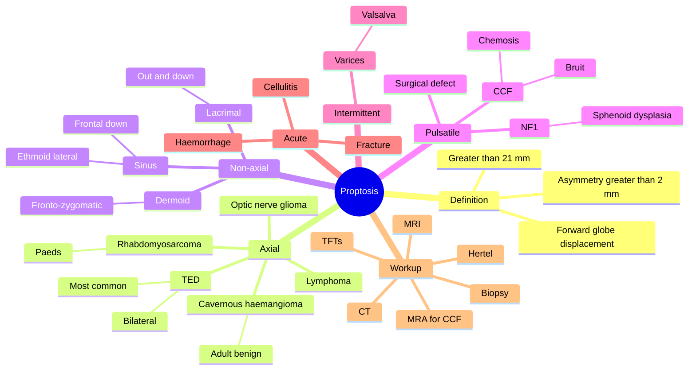

# Proptosis (Approach)

Related: [[Thyroid Eye Disease]], [[Orbital Cellulitis]], [[Orbital Tumours]]

> [!tip] **FCPS/MRCP Priority: HIGH**
> Axial (TED, cavernous haemangioma) vs non-axial (lacrimal, sinus). Pulsatile (CCF, neurofibromatosis). Intermittent (varices). Acute (haemorrhage, cellulitis).

---

## Learning Objectives
- [ ] Define proptosis and differentiate from pseudo-proptosis
- [ ] Classify proptosis by direction (axial vs non-axial) and onset
- [ ] Recognise pulsatile and intermittent proptosis
- [ ] Apply the appropriate workup (Hertel, imaging, TFTs)
- [ ] Identify the most common causes (TED, cavernous haemangioma, CCF)

---

## 1. Definition

- **Proptosis (exophthalmos):** Forward displacement of the globe
  - Hertel exophthalmometry: >21 mm OR asymmetry >2 mm between eyes
- **Pseudo-proptosis:** Apparent forward displacement without true proptosis
  - Enlarged eye (axial myopia, buphthalmos)
  - Lid retraction (TED — Dalrymple sign)
  - Contralateral enophthalmos
  - Facial asymmetry

---

## 2. Classification by Direction

### Axial (straight forward — no horizontal or vertical displacement)
- **Thyroid eye disease (TED)** — most common cause of bilateral AND unilateral proptosis in adults
- Cavernous haemangioma (most common benign adult tumour)
- Optic nerve glioma
- Optic nerve sheath meningioma
- Lymphoma
- Rhabdomyosarcoma (paediatric)
- Other intraconal lesions

### Non-Axial (displacement in a specific direction — localising)
- **Lacrimal gland mass** → down and medially (out and down)
- **Sinus disease** (mucocoele, tumour):
  - Ethmoid → lateral displacement
  - Frontal / maxillary → down
  - Sphenoid → axial (deeper)
- Dermoid cyst (superotemporally at fronto-zygomatic suture)
- Lacrimal sac tumours (inferomedially)

### Pulsatile
- **Carotid-cavernous fistula (CCF)** — audible bruit, chemosis, arterialised conjunctival vessels
  - Direct (Type A) — traumatic, high-flow
  - Indirect (Type B/C/D) — spontaneous, low-flow
- Neurofibromatosis type 1 (sphenoid wing dysplasia)
- Surgical / traumatic defect (bony defect)
- Meningocoele / encephalocoele

### Intermittent
- **Orbital varices** — enlarge with Valsalva, straining, coughing, head-down position
- Lymphangioma (worsens with URIs)

---

## 3. Classification by Onset

| Onset | Causes |
|-------|--------|
| **Acute** | Retrobulbar haemorrhage, orbital cellulitis, fracture, mucormycosis |
| **Subacute** | Inflammation, TED (active phase), idiopathic orbital inflammation (IOI) |
| **Chronic** | Tumour (slow-growing), TED (burnt-out / fibrotic), chronic sinus disease |
| **Intermittent** | Orbital varices |
| **Pulsatile** | CCF, NF1 |

---

## 4. Clinical Features by Cause

### Thyroid Eye Disease (TED)
- Bilateral, often asymmetric, axial proptosis
- Lid retraction (Dalrymple), lid lag (von Graefe)
- Periorbital oedema, chemosis
- EOM restriction (especially IR — ↓ upgaze, diplopia)
- Optic nerve compression (DON) — ↓VA, RAPD, ↓colour vision
- **NB:** Can be **unilateral** in 5–15% of cases
- Signs of dysthyroidism (goitre, tremor, tachycardia)

### Cavernous Haemangioma
- Adult, slow, painless, axial proptosis
- Well-defined, intraconal
- Increased proptosis with Valsalva (sometimes)

### Orbital Cellulitis
- Acute, painful, red, swollen
- Fever, ↓EOM, ↓VA (in severe)
- Source: sinus, skin, dental
- Post-septal = proptosis, ↓VA, painful EOM

### Carotid-Cavernous Fistula
- Pulsatile proptosis, audible bruit (patient/doctor)
- Chemosis, arterialised corkscrew conjunctival vessels
- ↑IOP, ↓VA, ophthalmoplegia
- Direct (trauma) vs indirect (spontaneous, often elderly women)

### Orbital Varices
- Intermittent proptosis with Valsalva
- Usually benign; thrombosis can occur

### Rhabdomyosarcoma
- Child, rapid onset (days–weeks)
- Painless or mildly painful
- Mass with proptosis

### Idiopathic Orbital Inflammation (IOI / "Pseudotumour")
- Subacute, painful, mass-like
- Resolves with steroids
- Diagnosis of exclusion

---

## 5. Workup

### Examination
- **Hertel exophthalmometry** (>21 mm or >2 mm asymmetry = proptosis)
- Visual acuity, RAPD
- EOM (restriction pattern — IR in TED)
- Slit-lamp (chemosis, conjunctival vessels, corneal exposure)
- Fundoscopy (disc oedema, atrophy, choroidal folds)
- Palpation (mass, thrill, pulsation)
- Auscultation (bruit)
- Valsalva manoeuvre (varices)
- Systemic examination (thyroid, lymph nodes, primary malignancy)

### Investigations
- **TFTs, TSI, thyroid antibodies** (TED)
- **CT orbits + brain** (bony detail, emergency setting, sinus disease)
- **MRI orbits + brain with contrast** (soft tissue, better tumour characterisation)
- **MRA / CTA** for CCF
- **Biopsy** of mass
- **Systemic workup** for malignancy (CT chest/abdomen/pelvis, mammogram, PSA)
- **FBC, ESR, CRP, ACE** (inflammation, sarcoidosis)

---

## 6. Management

| Cause | Treatment |
|-------|-----------|
| **TED** | Euthyroidism, smoking cessation, selenium (mild), steroids / IV methylpred, teprotumumab, surgical decompression, orbital radiotherapy, strabismus / lid surgery |
| **Tumour** | Excision, chemo, RT (see [[Orbital Tumours]]) |
| **CCF** | Endovascular closure (coils / embolic agents) |
| **Orbital cellulitis** | IV antibiotics, surgical drainage if subperiosteal/orbital abscess |
| **Varices** | Observe, surgery if symptomatic |
| **IOI (pseudotumour)** | Oral steroids (dramatic response) |
| **Mucocoele** | Surgical drainage + marsupialisation, ENT |
| **Cosmetic / rehabilitative** | Orbital decompression, lid surgery |

---

## 7. FCPS/MRCP High-Yield Summary

| Type | Most Common Cause |
|------|-------------------|
| **Axial bilateral** | Thyroid eye disease |
| **Axial unilateral (adult)** | Cavernous haemangioma |
| **Axial unilateral (child)** | Rhabdomyosarcoma |
| **Non-axial** | Lacrimal gland mass / sinus disease |
| **Pulsatile** | Carotid-cavernous fistula |
| **Intermittent** | Orbital varices |
| **Acute painful** | Orbital cellulitis, retrobulbar haemorrhage |
| **Painless chronic** | Tumour, TED burnt-out |

### Key Rules
- **TED = bilateral, axial**, painless, with lid signs
- **CCF = pulsatile + bruit + chemosis + ↑IOP**
- **Varices = intermittent with Valsalva**
- **Cavernous haemangioma = axial, slow, painless, intraconal**

---

## 8. Viva Questions

1. **Q:** What is the most common cause of bilateral proptosis in adults?
   **A:** Thyroid eye disease (TED).

2. **Q:** What features differentiate TED from other causes of proptosis?
   **A:** Bilateral (often asymmetric), axial, with lid retraction, lid lag, periorbital oedema, and signs of dysthyroidism. May have ↓VA from optic nerve compression (DON).

3. **Q:** What is pulsatile proptosis and what causes it?
   **A:** Proptosis that pulsates with the heart beat. Caused by carotid-cavernous fistula (CCF), sphenoid wing dysplasia (NF1), or surgical/traumatic bony defect.

4. **Q:** What is intermittent proptosis and what is the cause?
   **A:** Proptosis that comes and goes, classically with Valsalva. Caused by orbital varices.

5. **Q:** How is proptosis measured?
   **A:** Hertel exophthalmometry. >21 mm or asymmetry >2 mm = proptosis.

6. **Q:** What is the most important investigation in suspected CCF?
   **A:** MRA / CTA of brain and orbits + catheter angiography (gold standard for treatment planning).

---

## 9. Common Confusions / Exam Traps

| Confusion | Clarification |
|-----------|---------------|
| "TED always bilateral" | Mostly bilateral but 5–15% are unilateral |
| "Pseudo-proptosis = true proptosis" | Pseudo = lid retraction, contralateral enophthalmos, large eye — Hertel is normal |
| "CCF is a venous problem" | CCF is an arteriovenous shunt between carotid and cavernous sinus |
| "All pulsatile proptosis is CCF" | Other causes: NF1 (sphenoid dysplasia), meningocoele, surgical defect |
| "Retrobulbar haemorrhage is bilateral" | Usually unilateral, post-op or trauma — emergency lateral canthotomy |
| "Orbital cellulitis is a minor infection" | Post-septal cellulitis is sight- and life-threatening; IV antibiotics + monitor |

---

## 10. Mnemonics

1. **"TED is Most Proptosis"** — TED = most common cause of proptosis in adults
2. **"CCF = Pulsatile, Chemosis, ↑IOP, Bruit"** — features of CCF
3. **"Axial TICS"** — Axial proptosis causes: TED, Intraconal tumour (cavernous haemangioma), Cavernous haemangioma, Schwannoma/optic nerve
4. **"VAALS"** for direction-based causes: Varices (intermittent), Axial (TED/CH), Axial pulsatile (CCF), Lacrimal (non-axial), Sinus (non-axial)

---

## 11. Mind Map

---

## 12. One-Page Revision Card

| **Topic** | **Proptosis (Approach)** |
|-----------|--------------------------|
| **Definition** | Forward globe displacement; >21 mm or >2 mm asymmetry (Hertel) |
| **Most common cause** | TED (bilateral, axial) |
| **Pulsatile** | CCF, NF1, surgical defect |
| **Intermittent** | Orbital varices (Valsalva) |
| **Acute painful** | Cellulitis, retrobulbar haemorrhage |
| **Adult benign** | Cavernous haemangioma (intraconal) |
| **Paeds malignant** | Rhabdomyosarcoma |
| **Imaging** | CT for sinus/bony, MRI for soft tissue, MRA for CCF |
| **Viva Pearl** | "TED = most common, axial, bilateral" |

---

## Spaced Repetition Trackers

### 24-Hour Recall Prompts
- [ ] Define proptosis and pseudo-proptosis
- [ ] Classify proptosis by direction and onset
- [ ] State the most common cause of bilateral proptosis
- [ ] List the causes of pulsatile proptosis
- [ ] State the cause of intermittent proptosis

### Revision Schedule
- [ ] **Day 1** completed (creation + 24h recall)
- [ ] **Day 3** revision completed
- [ ] **Day 7** revision completed
- [ ] **Day 15** revision completed
- [ ] **Day 30** revision completed
- [ ] **Day 90** revision completed

---

## Must Know / Should Know / Nice to Know

### Must Know (Core for passing)
- [x] Definition of proptosis
- [x] Most common cause (TED)
- [x] Axial vs non-axial
- [x] Pulsatile (CCF) and intermittent (varices)
- [x] Workup: Hertel, TFTs, imaging
- [x] CCF features (bruit, chemosis, ↑IOP)

### Should Know (High probability)
- [x] Pseudo-proptosis causes
- [x] Acute painful causes (cellulitis, haemorrhage)
- [x] Cavernous haemangioma in adults
- [x] Rhabdomyosarcoma in children
- [x] Management principles (treat underlying)

### Nice to Know (Differentiator)
- [ ] IOI (pseudotumour) and steroid response
- [ ] TED specific signs (Dalrymple, von Graefe)
- [ ] Teprotumumab for TED
- [ ] DON (dysthyroid optic neuropathy)

---

## My Weak Points
- [ ] Add personal weak areas here

---

## Self-Test Scorecard

| Section | Score /5 |
|---------|----------|
| Understanding: | /10 |
| Recall: | /10 |
| MCQ Performance: | /10 |
| SBA Performance: | /10 |
| Viva Confidence: | /10 |
| Total: | /50 |

> [!tip] **Interpretation:** <35 = weak topic, 35-44 = acceptable but insecure, 45+ = strong exam-ready topic.

---

## Exam Answer Modes

### Long Answer Skeleton
1. Definition (forward globe displacement, >21 mm or >2 mm asymmetry)
2. Pseudo-proptosis (lid retraction, large eye, contralateral enophthalmos)
3. Classification by direction: axial (TED, cavernous haemangioma, optic nerve lesions, rhabdomyosarcoma), non-axial (lacrimal, sinus, dermoid), pulsatile (CCF, NF1), intermittent (varices)
4. Classification by onset: acute, subacute, chronic, intermittent, pulsatile
5. Workup: Hertel, examination, TFTs, CT/MRI/MRA, biopsy
6. Management: treat underlying (TED, CCF, tumour, cellulitis)

### Short Note Skeleton
- Definition
- Most common cause (TED)
- Direction-based classification
- Imaging choice (CT vs MRI vs MRA)

### Viva One-Liners
- **Q:** Most common cause of bilateral proptosis? → **A:** TED
- **Q:** Pulsatile proptosis? → **A:** CCF, NF1, surgical defect
- **Q:** Intermittent proptosis? → **A:** Orbital varices (Valsalva)
- **Q:** Acute painful proptosis? → **A:** Cellulitis, retrobulbar haemorrhage

### Ward-Case Discussion Points
- Use Hertel exophthalmometry (always compare both eyes)
- Differentiate pseudo-proptosis from true proptosis
- Check for TED signs (lid retraction, lid lag, ↓upgaze)
- Listen for bruit in pulsatile proptosis
- Test Valsalva for varices
- Image with CT (sinus, bony) vs MRI (soft tissue, tumour) vs MRA (CCF)
- Treat underlying cause (euthyroidism in TED, endovascular closure in CCF, IV AB in cellulitis)

### Last-Night-Before-Exam Sheet
- Top 3 facts: TED most common, CCF pulsatile, varices intermittent
- 1 mnemonic: "Axial TICS" for axial proptosis causes
- Must-know: Hertel >21 mm or >2 mm asymmetry

---

## Summary

Proptosis is forward displacement of the globe (>21 mm or >2 mm asymmetry on Hertel). **TED** is the most common cause (bilateral, axial, with lid signs). Classify by **direction** (axial vs non-axial, pulsatile, intermittent) and **onset** (acute, subacute, chronic). **CCF** causes pulsatile proptosis with bruit and chemosis. **Orbital varices** cause intermittent proptosis with Valsalva. **Orbital cellulitis** is an acute painful emergency. Workup: Hertel, examination, TFTs, CT/MRI/MRA, biopsy. Treat the underlying cause.

## MCQs (10)

1. **Question:** The most common cause of bilateral proptosis in adults is:
   **Options:** A. Cavernous haemangioma B. Thyroid eye disease C. Lymphoma D. Rhabdomyosarcoma E. CCF
   **Answer:** B
   **Explanation:** TED is the most common cause of bilateral (and overall) proptosis in adults.

2. **Question:** Pulsatile proptosis is characteristic of:
   **Options:** A. TED B. Carotid-cavernous fistula C. Rhabdomyosarcoma D. Lymphoma E. Dermoid
   **Answer:** B
   **Explanation:** Pulsatile proptosis = CCF (bruit, chemosis, ↑IOP, ophthalmoplegia).

3. **Question:** Intermittent proptosis that worsens with Valsalva is most suggestive of:
   **Options:** A. TED B. CCF C. Orbital varices D. Lymphoma E. Cellulitis
   **Answer:** C
   **Explanation:** Orbital varices enlarge with Valsalva → intermittent proptosis.

4. **Question:** Hertel exophthalmometry is positive for proptosis when:
   **Options:** A. >18 mm B. >21 mm or asymmetry >2 mm C. >25 mm D. >30 mm E. Any reading
   **Answer:** B
   **Explanation:** >21 mm or asymmetry >2 mm = proptosis.

5. **Question:** Pseudo-proptosis can be caused by:
   **Options:** A. TED B. Cavernous haemangioma C. Lid retraction (e.g., contralateral) D. CCF E. None
   **Answer:** C
   **Explanation:** Pseudo-proptosis = lid retraction, contralateral enophthalmos, axial myopia, buphthalmos.

6. **Question:** Non-axial proptosis with inferomedial displacement is most suggestive of:
   **Options:** A. TED B. Lacrimal gland mass C. CCF D. Varices E. None
   **Answer:** B
   **Explanation:** Lacrimal gland mass displaces globe down and medially (out and down).

7. **Question:** Acute, painful, red, swollen orbit with fever is most likely:
   **Options:** A. TED B. Orbital cellulitis C. CCF D. Cavernous haemangioma E. Lymphoma
   **Answer:** B
   **Explanation:** Acute painful red orbit with fever = orbital cellulitis.

8. **Question:** In suspected CCF, the imaging of choice is:
   **Options:** A. Plain X-ray B. CT orbits C. MRI orbits D. MRA / catheter angiography E. B-scan
   **Answer:** D
   **Explanation:** MRA / catheter angiography confirms and treats CCF.

9. **Question:** The most common benign orbital tumour causing axial proptosis in adults is:
   **Options:** A. Lymphoma B. Cavernous haemangioma C. Meningioma D. Metastasis E. None
   **Answer:** B
   **Explanation:** Cavernous haemangioma is the most common benign adult orbital tumour.

10. **Question:** Retrobulbar haemorrhage is an emergency because:
    **Options:** A. It causes pain B. It can cause optic nerve compression and permanent blindness C. It causes diplopia D. It is infectious E. None
    **Answer:** B
    **Explanation:** Retrobulbar haemorrhage → ↑orbital pressure → optic nerve ischaemia → emergency lateral canthotomy.

## SBA Questions (10)

1. **Scenario:** A 45-year-old woman with known Graves' disease presents with bilateral proptosis, lid retraction, and ↓upgaze. Visual acuity is normal.
   **Question:** Most likely diagnosis?
   **Options:** A. TED B. CCF C. Lymphoma D. Orbital cellulitis E. None
   **Answer:** A
   **Explanation:** Bilateral proptosis + lid signs + Graves' = TED.

2. **Scenario:** A 60-year-old man presents with unilateral pulsatile proptosis, chemosis, an audible bruit, and ↑IOP. There is history of trauma.
   **Question:** Most likely diagnosis?
   **Options:** A. TED B. CCF (direct, post-traumatic) C. Cavernous haemangioma D. Lymphoma E. None
   **Answer:** B
   **Explanation:** Pulsatile proptosis + bruit + chemosis + trauma = direct CCF.

3. **Scenario:** A 30-year-old has intermittent proptosis that worsens with straining or coughing. Examination between episodes is normal.
   **Question:** Most likely diagnosis?
   **Options:** A. TED B. Cavernous haemangioma C. Orbital varices D. CCF E. None
   **Answer:** C
   **Explanation:** Valsalva-induced intermittent proptosis = orbital varices.

4. **Scenario:** A 5-year-old presents with rapid unilateral proptosis over 2 weeks. There is a palpable superonasal mass.
   **Question:** Most likely diagnosis?
   **Options:** A. Rhabdomyosarcoma B. Dermoid cyst C. TED D. CCF E. None
   **Answer:** A
   **Explanation:** Rapid proptosis in a child = rhabdomyosarcoma (oncologic emergency).

5. **Scenario:** A 50-year-old with painful swollen orbit, fever, and ↓VA. There is sinusitis on imaging.
   **Question:** Most likely diagnosis and treatment?
   **Options:** A. TED — steroids B. Orbital cellulitis — IV antibiotics ± surgical drainage C. CCF — embolisation D. Cavernous haemangioma — observation E. None
   **Answer:** B
   **Explanation:** Orbital cellulitis (often sinus origin) = IV antibiotics ± drainage.

6. **Scenario:** A 35-year-old with NF1 has pulsatile proptosis. There is no bruit. CT shows sphenoid wing dysplasia.
   **Question:** Most likely cause of proptosis?
   **Options:** A. CCF B. Sphenoid wing dysplasia (NF1) C. TED D. Lymphoma E. None
   **Answer:** B
   **Explanation:** Sphenoid dysplasia in NF1 → pulsatile proptosis without bruit (transmitted CSF pulsation).

7. **Scenario:** A patient with TED develops ↓VA, ↓colour vision, and RAPD. What is the most concerning complication?
   **Options:** A. Lid retraction B. Chemosis C. Dysthyroid optic neuropathy (DON) D. Diplopia E. None
   **Answer:** C
   **Explanation:** ↓VA + ↓colour + RAPD in TED = DON — emergency IV methylprednisolone + decompression.

8. **Scenario:** A 40-year-old with painless non-axial proptosis. CT shows a well-defined mass in the lacrimal gland fossa without bone erosion.
   **Question:** Most appropriate next step?
   **Options:** A. Biopsy B. Incisional biopsy C. Intact excision with bone D. Steroids E. Observation
   **Answer:** C
   **Explanation:** Well-defined lacrimal mass = pleomorphic adenoma — intact excision (NO biopsy).

9. **Scenario:** A patient with CCF has IOP 36 mmHg, chemosis, and a fixed mid-dilated pupil. What is the most appropriate next step?
   **Options:** B. IOP drops and urgent endovascular closure A. Topical steroid C. Observation D. E. None
   **Answer:** B
   **Explanation:** CCF with high IOP — manage IOP + urgent endovascular closure.

10. **Scenario:** A patient has unilateral axial proptosis that is slow-growing over 2 years. Hertel shows 23 mm (other eye 19 mm). Imaging shows a well-defined intraconal mass.
    **Question:** Most likely diagnosis?
    **Options:** A. Cavernous haemangioma B. TED C. CCF D. Lymphoma E. None
    **Answer:** A
    **Explanation:** Slow axial intraconal proptosis = cavernous haemangioma.

## Flashcards

- **Q:** What is the most common cause of bilateral proptosis in adults?
  **A:** Thyroid eye disease (TED).
- **Q:** What causes pulsatile proptosis?
  **A:** Carotid-cavernous fistula, NF1 (sphenoid dysplasia), surgical/traumatic defect.
- **Q:** What causes intermittent proptosis?
  **A:** Orbital varices (worsen with Valsalva).
- **Q:** What is the threshold for proptosis on Hertel exophthalmometry?
  **A:** >21 mm OR asymmetry >2 mm between eyes.
- **Q:** What is the emergency treatment for retrobulbar haemorrhage?
  **A:** Lateral canthotomy and cantholysis to decompress the orbit.

## Answer Key with Explanations

### MCQs
1. B — TED is most common
2. B — Pulsatile proptosis = CCF
3. C — Valsalva-induced = varices
4. B — >21 mm or >2 mm asymmetry
5. C — Pseudo-proptosis from lid retraction
6. B — Lacrimal mass → out and down
7. B — Cellulitis = acute painful red
8. D — MRA / catheter angio for CCF
9. B — Cavernous haemangioma is most common benign
10. B — Optic nerve compression → emergency

### SBAs
1. A — TED with lid signs
2. B — Direct CCF post-trauma
3. C — Valsalva-induced = varices
4. A — Rapid proptosis in child = rhabdomyosarcoma
5. B — Cellulitis = IV AB
6. B — NF1 sphenoid dysplasia
7. C — DON is the concerning complication
8. C — Intact excision (no biopsy)
9. B — IOP + endovascular closure
10. A — Cavernous haemangioma

## Tags
#medicine #davidson #ophthalmology #proptosis #fcps #mrcp
