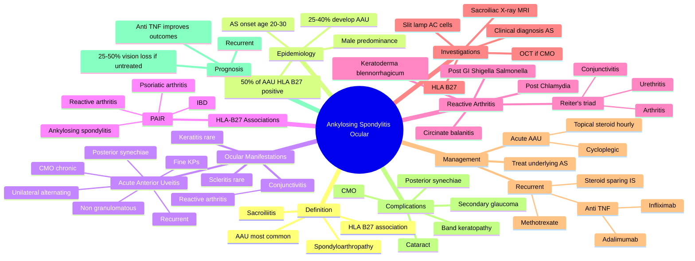

## Learning Objectives

- [ ] List the extra-articular ocular manifestations of ankylosing spondylitis (anterior uveitis is the most common).
- [ ] Describe the clinical features, course, and complications of HLA-B27 associated acute anterior uveitis (unilateral, painful, red eye, photophobia).
- [ ] Outline the management of acute anterior uveitis: topical steroids + cycloplegics; treat the underlying spondyloarthropathy.
- [ ] Recognise the link between uveitis and systemic disease activity in AS, including when to refer back to rheumatology.

---

# Ocular Manifestations of Ankylosing Spondylitis and Reactive Arthritis

Related: [[Anterior Uveitis (Iritis)]], [[HLA-B27]]

> [!tip] **FCPS/MRCP Priority: HIGH**
> Acute anterior uveitis — most common extra-articular manifestation of AS. 50% AAU are HLA-B27+. Recurrent, unilateral, alternating.

---

## 1. Ocular Manifestations

- **Acute anterior uveitis (AAU)** — most common (25–40% of AS, 50% of reactive arthritis)
- Conjunctivitis (more in reactive arthritis)
- Keratitis (rare)
- Scleritis (rare)

### AAU Features
- Acute, unilateral, recurrent
- Pain, photophobia, ↓VA
- Non-granulomatous (fine KPs)
- Often with HLA-B27

---

## 2. HLA-B27 Associated Conditions

- **Ankylosing spondylitis**
- **Reactive arthritis (Reiter's)** — arthritis + urethritis + conjunctivitis
- **Psoriatic arthritis**
- **IBD (UC, Crohn's)**
- Acute anterior uveitis (independent)

---

## 3. Reactive Arthritis (Reiter's) — Classic Triad
- Arthritis
- Urethritis / cervicitis
- Conjunctivitis (± AAU)
- Often post-infectious (Chlamydia, GI)

---

## 4. Management

- AAU: topical steroid + cycloplegia
- Treat systemic disease
- Screen AS for AAU (referral)
- Screen AAU for AS (back pain, stiffness)

---

## 5. FCPS/MRCP Summary

| Feature | Notes |
|---------|-------|
| AAU | Most common, 50% HLA-B27 |
| AS | Recurrent, unilateral, alternating |
| Reactive | Conjunctivitis + urethritis + arthritis |

---

## 6. Viva Questions

1. **Q:** What is the classic triad of reactive arthritis?
   **A:** Arthritis + urethritis + conjunctivitis.

---

## Summary

AS and reactive arthritis commonly cause acute anterior uveitis. 50% are HLA-B27+. Recurrent, unilateral, alternating. Treat with topical steroid + cycloplegia.

## MCQs (10)

**1. Which is the most common extra-articular manifestation of ankylosing spondylitis?**
A. Psoriasis
B. Acute anterior uveitis
C. Aortic regurgitation
D. Restrictive lung disease
E. Renal amyloidosis
**Answer: B** — AAU occurs in 25-40% of AS patients and is the most common extra-articular manifestation.

**2. What percentage of acute anterior uveitis (AAU) is associated with HLA-B27?**
A. ~10%
B. ~25%
C. ~50%
D. ~75%
E. ~90%
**Answer: C** — Approximately 50% of AAU cases are HLA-B27 positive.

**3. The classic triad of reactive arthritis (Reiter's syndrome) includes all EXCEPT:**
A. Arthritis
B. Urethritis
C. Conjunctivitis
D. Oral ulcers
E. Skin lesions
**Answer: D** — Classic triad: arthritis, urethritis, conjunctivitis (can't see, can't pee, can't climb a tree).

**4. AAU in AS is typically:**
A. Bilateral, simultaneous
B. Bilateral, alternating
C. Unilateral, recurrent
D. Always granulomatous
E. Always chronic
**Answer: C** — AS-associated AAU is characteristically unilateral, recurrent, alternating eyes; non-granulomatous.

**5. First-line treatment of an acute attack of AS-associated AAU is:**
A. Systemic steroid only
B. Topical steroid + cycloplegic
C. Intravitreal steroid
D. Topical NSAID
E. Vitrectomy
**Answer: B** — Topical steroid (e.g. prednisolone acetate 1% hourly) + cycloplegic (cyclopentolate or atropine).

**6. A 32-year-old man with known AS presents with painful red eye, photophobia, and decreased vision. Slit-lamp shows fine KPs, AC cells 3+, no posterior synechiae. The most likely diagnosis is:**
A. Scleritis
B. Acute anterior uveitis
C. Acute angle-closure glaucoma
D. Conjunctivitis
E. Episcleritis
**Answer: B** — AS + painful red eye + AC cells = AAU. Non-granulomatous KPs consistent with HLA-B27 AAU.

**7. Which of the following is NOT typically associated with reactive arthritis?**
A. Keratoderma blennorrhagicum
B. Circinate balanitis
C. Oral aphthous ulcers
D. Conjunctivitis
E. Anterior uveitis
**Answer: C** — Oral aphthous ulcers are characteristic of Behçet's disease, not reactive arthritis.

**8. The most sight-threatening ocular complication of AS is:**
A. Posterior synechiae
B. Cataract
C. Cystoid macular oedema
D. Secondary glaucoma
E. Band keratopathy
**Answer: C** — CMO is the most common cause of vision loss in chronic uveitis of any cause.

**9. HLA-B27 is most strongly associated with which ocular condition?**
A. Acute anterior uveitis
B. Anterior ischaemic optic neuropathy
C. Central retinal vein occlusion
D. AMD
E. Diabetic retinopathy
**Answer: A** — HLA-B27 is the strongest genetic association with acute anterior uveitis.

**10. A patient with AS presents with recurrent AAU. The systemic treatment to prevent recurrence and treat underlying AS is:**
A. Long-term oral steroid
B. TNF-alpha inhibitors (e.g. infliximab)
C. Topical steroid only
D. Methotrexate only
E. Cyclophosphamide
**Answer: B** — Anti-TNF agents (infliximab, adalimumab) are highly effective for both AS and associated AAU.

## SBA Questions (10)

**1. A 30-year-old man with AS presents with sudden painful red eye, photophobia, and decreased vision. Slit-lamp shows ciliary flush, fine KPs, AC cells 3+, no hypopyon. The most likely diagnosis is:**
**Answer:** Acute anterior uveitis (AAU) — typical of AS

**2. The most appropriate initial treatment for the patient above is:**
**Answer:** Intensive topical steroid (prednisolone acetate 1% hourly) + cycloplegic (cyclopentolate 1% TDS)

**3. An AS patient with AAU is found to have posterior synechiae on examination. The most appropriate additional treatment is:**
**Answer:** Intensive mydriatic/cycloplegic (atropine 1% BD) to break synechiae and prevent further

**4. A patient with reactive arthritis develops mucopurulent conjunctivitis, bilateral knee arthritis, and urethritis. The most likely diagnosis is:**
**Answer:** Reactive arthritis (Reiter's syndrome) — classic triad

**5. The skin lesion associated with reactive arthritis that affects the palms and soles is:**
**Answer:** Keratoderma blennorrhagicum

**6. An AS patient with chronic recurrent AAU develops decreased vision. OCT shows intraretinal cystic spaces at the fovea. The most likely cause of vision loss is:**
**Answer:** Cystoid macular oedema (CMO)

**7. The most appropriate systemic agent to prevent AS-associated AAU recurrence is:**
**Answer:** TNF-alpha inhibitor (infliximab, adalimumab) — addresses both AS and uveitis

**8. A 25-year-old with known HLA-B27 positivity develops unilateral painful red eye with photophobia. The most appropriate urgent referral is to:**
**Answer:** Ophthalmology (same-day/next-day for AAU)

**9. In AAU associated with AS, the uveitis is characteristically:**
**Answer:** Unilateral, recurrent, alternating, non-granulomatous

**10. Reactive arthritis in a young adult is most commonly preceded by:**
**Answer:** Genitourinary infection (Chlamydia) or gastrointestinal infection (Shigella, Salmonella, Yersinia)

## Flashcards

- **Q:** Most common extra-articular manifestation of ankylosing spondylitis?
  **A:** Acute anterior uveitis (AAU) — recurrent, unilateral, alternating; 25–40% of AS patients; 50% of HLA-B27+ AAU.
- **Q:** What is the classic triad of reactive arthritis (Reiter's)?
  **A:** Arthritis + urethritis + conjunctivitis ("can't see, can't pee, can't climb a tree").
- **Q:** HLA-B27 associated conditions?
  **A:** Ankylosing spondylitis, reactive arthritis, psoriatic arthritis, IBD (UC, Crohn's), acute anterior uveitis (independent).
- **Q:** Treatment of HLA-B27 AAU?
  **A:** Topical steroid + cycloplegia; treat systemic disease; refer for back pain evaluation if AS suspected.

---

## Answer Key with Explanations

### MCQs
1. **B** — AAU occurs in 25-40% of AS patients and is the most common extra-articular manifestation.
2. **C** — Approximately 50% of AAU cases are HLA-B27 positive.
3. **D** — Classic triad: arthritis, urethritis, conjunctivitis (can't see, can't pee, can't climb a tree).
4. **C** — AS-associated AAU is characteristically unilateral, recurrent, alternating eyes; non-granulomatous.
5. **B** — Topical steroid (e.g. prednisolone acetate 1% hourly) + cycloplegic (cyclopentolate or atropine).
6. **B** — AS + painful red eye + AC cells = AAU. Non-granulomatous KPs consistent with HLA-B27 AAU.
7. **C** — Oral aphthous ulcers are characteristic of Behçet's disease, not reactive arthritis.
8. **C** — CMO is the most common cause of vision loss in chronic uveitis of any cause.
9. **A** — HLA-B27 is the strongest genetic association with acute anterior uveitis.
10. **B** — Anti-TNF agents (infliximab, adalimumab) are highly effective for both AS and associated AAU.

### SBAs
1. Acute anterior uveitis (AAU) — typical of AS
2. Intensive topical steroid (prednisolone acetate 1% hourly) + cycloplegic (cyclopentolate 1% TDS)
3. Intensive mydriatic/cycloplegic (atropine 1% BD) to break synechiae and prevent further
4. Reactive arthritis (Reiter's syndrome) — classic triad
5. Keratoderma blennorrhagicum
6. Cystoid macular oedema (CMO)
7. TNF-alpha inhibitor (infliximab, adalimumab) — addresses both AS and uveitis
8. Ophthalmology (same-day/next-day for AAU)
9. Unilateral, recurrent, alternating, non-granulomatous
10. Genitourinary infection (Chlamydia) or gastrointestinal infection (Shigella, Salmonella, Yersinia)

### 24-Hour Recall Prompts
- [ ] Define the classic triad of reactive arthritis.
- [ ] List HLA-B27 associated conditions.
- [ ] Describe the typical features of HLA-B27 AAU.
- [ ] Outline first-line treatment of AAU.
- [ ] Explain the relationship between AS and AAU (50% rule).
- [ ] Distinguish HLA-B27 AAU from granulomatous uveitis.

### Revision Schedule
- [ ] **Day 1** completed (creation + 24h recall)
- [ ] **Day 3** revision completed
- [ ] **Day 7** revision completed
- [ ] **Day 15** revision completed
- [ ] **Day 30** revision completed
- [ ] **Day 90** revision completed

---

## Self-Test Scorecard

| Section | Score /5 |
|---------|----------|
| Understanding: | /10 |
| Recall: | /10 |
| MCQ Performance: | /10 |
| SBA Performance: | /10 |
| Viva Confidence: | /10 |
| Total: | /50 |

> [!tip]
> **Interpretation:** <35 = weak topic, 35-44 = acceptable but insecure, 45+ = strong exam-ready topic.

---

## Exam Answer Modes

### Long Answer Skeleton
1. Definition of seronegative spondyloarthropathies (AS, reactive, psoriatic, IBD)
2. HLA-B27 association and inheritance
3. AAU: definition, clinical features (4 As)
4. Reactive arthritis (Reiter's): triad, post-infective
5. Diagnosis (clinical, HLA-B27, X-ray SI joints)
6. Differential diagnosis (granulomatous uveitis, Behçet, VKH)
7. Management: topical steroid + cycloplegia; treat systemic disease
8. Complications (synechiae, CMO, glaucoma) and prognosis

### Short Note Skeleton
- AAU: unilateral, alternating, recurrent, HLA-B27
- Reactive arthritis triad
- Topical steroid + cycloplegia
- Screen AS for AAU and vice versa

### Viva One-Liners
- **Q:** Most common extra-articular feature of AS? → **A:** Acute anterior uveitis (AAU).
- **Q:** Classic triad of reactive arthritis? → **A:** Arthritis + Urethritis + Conjunctivitis.
- **Q:** HLA-B27 conditions? → **A:** PAIR (Psoriatic, AS, IBD, Reactive).
- **Q:** AAU features? → **A:** Unilateral, alternating, recurrent, non-granulomatous (4 As).
- **Q:** First-line AAU treatment? → **A:** Topical steroid + cycloplegia.
- **Q:** 50% rule? → **A:** 50% of HLA-B27+ AAU patients have/ develop AS; 50% of AS patients get AAU.

### Ward-Case Discussion Points
- Examine both eyes carefully — AAU is unilateral but can alternate
- Ask about back pain, stiffness (AS), GI symptoms (IBD), skin (psoriasis), urethritis/dysentery (reactive)
- Send HLA-B27 if AAU + axial symptoms
- Counsel on recurrence and warning signs (pain, photophobia, ↓VA)
- Refer for X-ray/MRI sacroiliac joints if AS suspected
- Coordinate with rheumatology for systemic disease

### Last-Night-Before-Exam Sheet
- **Top 5 facts:** AAU most common; HLA-B27; unilateral alternating; reactive triad; topical steroid + cycloplegia
- **3 drug doses:** Prednisolone acetate 1% eye drops (1 hourly initially); cyclopentolate 1% TDS; ibuprofen 400 mg TDS PO
- **2 algorithms:** AAU management (steroid + cycloplegia); HLA-B27 screening
- **1 mnemonic:** "Can't see, can't pee, can't climb a tree" + PAIR
- **Must-know differential:** Sarcoidosis (granulomatous), TB, Behçet (hypopyon), VKH (bilateral)

---

## Mnemonics

1. **"AAU = Always Acute, Unilateral"** — AS-associated uveitis is characteristically acute, unilateral, recurrent, alternating; non-granulomatous
2. **"HLA-B27 = PAIR"** — Psoriatic arthritis, Ankylosing spondylitis, IBD, Reactive arthritis → all can cause AAU
3. **"50% rule"** — 50% of AAU patients are HLA-B27+; 25-40% of AS patients develop AAU
4. **"Can't see, can't pee, can't climb a tree"** — Classic triad of reactive arthritis (conjunctivitis, urethritis, arthritis)
5. **"Steroid first, then systemic"** — Topical steroid + cycloplegic first; systemic IS if recurrent or refractory

---

## Mind Map

---

## One-Page Revision Card

| Domain | Key Points |
|---|---|
| Definition | |
| Patient profile | |
| Most common ocular feature | |
| Investigations | |
| First-line management | |
| Severe / refractory management | |
| Most feared complication | |
| Prognosis | |

---

## Spaced Repetition Trackers

| Review Interval | Date | Score (0-5) | Notes |
|-----------------|------|-------------|-------|
| Day 1 | | | |
| Day 3 | | | |
| Day 7 | | | |
| Day 14 | | | |
| Day 30 | | | |
| Day 90 | | | |

## Tags
#medicine #davidson #ophthalmology #AS #HLA-B27 #fcps #mrcp
