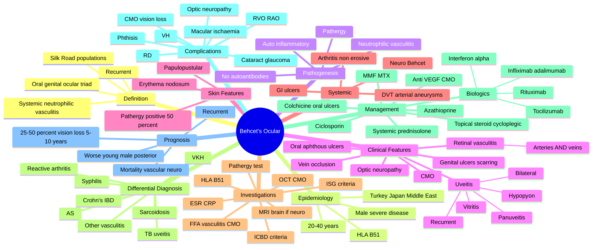

# Behçet's Disease (Ocular Manifestations)

Related: [[Anterior Uveitis (Iritis)]], [[Retinal Vasculitis]], [[Panuveitis]], [[VKH Syndrome]]

> [!danger] **FCPS/MRCP Priority: HIGH — Recurrent hypopyon uveitis + oral/genital ulcers = Behçet's**
> Behçet's disease is a **systemic neutrophilic vasculitis** affecting veins and arteries of all sizes. The classic **triad** is **oral aphthous ulcers, genital ulcers, and uveitis**. Ocular involvement is **panuveitis with retinal vasculitis** in 70%; recurrent hypopyon uveitis is pathognomonic. Most common in the "Silk Road" populations (Turkey, Japan, Middle East). Strongly HLA-B51 associated.

## Learning Objectives

- [ ] Define Behçet's disease as a systemic neutrophilic vasculitis of unknown aetiology.
- [ ] Recognise the classic clinical triad: recurrent oral aphthous ulcers, genital ulcers, uveitis (typically panuveitis with hypopyon).
- [ ] Identify the major and minor criteria of the International Study Group (ISG) and International Criteria for Behçet's Disease (ICBD).
- [ ] List the ocular features: **bilateral recurrent hypopyon uveitis, retinal vasculitis (both arteries and veins), vitritis, macular oedema, retinal vein occlusion, optic neuropathy**.
- [ ] Apply the pathergy test (hyper-reactivity to skin prick with sterile needle) — positive in ~50%.
- [ ] Recognise the association with **HLA-B51**.
- [ ] Manage acute ocular disease with high-dose systemic corticosteroid + early immunosuppression (azathioprine, ciclosporin, interferon-α, anti-TNF).
- [ ] Recognise that **vitritis and retinal vasculitis are the principal sight-threatening features**; anterior uveitis with hypopyon is dramatic but treatable.

---

## 1. Definition

Behçet's disease (BD) is a chronic, relapsing, systemic **neutrophilic vasculitis** affecting arteries and veins of all sizes. It is characterised by recurrent inflammation affecting:
- Mucocutaneous (oral ulcers, genital ulcers, skin lesions)
- Ocular (panuveitis with hypopyon, retinal vasculitis)
- Articular (arthritis)
- Vascular (thrombophlebitis, arterial aneurysms)
- Neurologic (parenchymal or vascular CNS involvement)
- Gastrointestinal (ulceration)

The disease is named after **Hulusi Behçet**, a Turkish dermatologist who described the triad in 1937.

## 2. Epidemiology

- **Geographical distribution:** "Silk Road" — most common in **Turkey, Japan, Korea, Middle East, Mediterranean basin**
- **Prevalence:** highest in Turkey (~80-370/100,000); rare in Northern Europe, Americas
- **Age:** typically 20-40 years
- **Sex:** equal in some series; male predominance for severe disease (especially ocular, vascular, neurologic)
- **Genetics:** strongly associated with **HLA-B51** (relative risk ~6)

## 3. Pathogenesis

- **Unknown aetiology** (likely genetic susceptibility + environmental trigger)
- **Neutrophilic vasculitis** with perivascular infiltration of neutrophils, lymphocytes
- **Hyper-reactivity of neutrophils** (pathergy phenomenon)
- Endothelial dysfunction, thrombosis
- Auto-inflammatory features (recurrent, no autoantibodies)
- Possible trigger: infectious (HSV, Streptococcus), but unproven
- HLA-B51 association: antigen presentation, immune dysregulation

## 4. Clinical Features

### The Classic Triad

1. **Recurrent oral aphthous ulcers** (>3 episodes in 12 months) — **mandatory** in ISG criteria; small, painful, on lips, tongue, buccal mucosa; heal without scarring
2. **Genital ulcers** — similar appearance, deeper, often scar; in males: scrotum, penis; in females: vulva, vagina
3. **Uveitis** — typically **bilateral recurrent panuveitis with hypopyon**; anterior uveitis with hypopyon is dramatic but treatable; retinal vasculitis is the sight-threatening feature

### Other Systemic Features

| System | Manifestation |
|---|---|
| **Skin** | Erythema nodosum-like lesions, papulopustular lesions (acneiform, on trunk/extremities), pathergy reaction (sterile pustule at needle prick site, 24-48 h) |
| **Joints** | Non-erosive, asymmetric oligoarthritis (knees, ankles, wrists) |
| **Vascular** | Superficial/deep vein thrombosis (40%), arterial aneurysms (pulmonary, aortic), thrombophlebitis |
| **Neurologic** | "Neuro-Behçet's" — brainstem meningoencephalitis, hemispheric lesions, dural sinus thrombosis; poor prognosis |
| **GI** | Ulceration (mouth → anus, similar to Crohn's) |

### Ocular Features (70% of patients)

| Feature | Comment |
|---|---|
| **Anterior uveitis with hypopyon** | Recurrent, often dramatic; mobile hypopyon shifts with head position |
| **Vitritis** | "Headlight in the fog" sign; common |
| **Retinal vasculitis** | Both arteries AND veins involved (unusual — most vasculitides affect one or the other) |
| **Retinal vein occlusion (BRVO/CRVO)** | Vasculitis → thrombosis |
| **Cystoid macular oedema** | Most common cause of vision loss |
| **Macular ischaemia** | Capillary non-perfusion |
| **Optic neuropathy** | Ischaemic or inflammatory |
| **Vitreous haemorrhage** | From neovascularisation or vasculitis |
| **Retinal neovascularisation** | Chronic ischaemia |
| **Bilateral involvement** | 80% bilateral (often sequential) |

## 5. Diagnostic Criteria

### International Study Group (ISG) Criteria (1990)
**Required: oral ulcers (≥3 in 12 months)** PLUS 2 of:
- Genital ulcers
- Eye lesions (anterior/posterior uveitis, retinal vasculitis)
- Skin lesions (erythema nodosum, papulopustular, pathergy)
- Positive pathergy test

### International Criteria for Behçet's Disease (ICBD, 2013)
Score ≥4 from:
| Feature | Points |
|---|---|
| Oral ulcers | 2 |
| Genital ulcers | 2 |
| Ocular lesions | 2 |
| Skin lesions | 1 |
| Vascular lesions | 1 |
| Positive pathergy | 1 (optional) |

## 6. Investigations

| Test | Purpose |
|---|---|
| **Clinical** | History and exam for triad |
| **Pathergy test** | Prick forearm with sterile 20G needle; read at 24-48 h for papule/pustule. Positive in ~50%, more common in Turkish/Japanese patients |
| **HLA-B51** | Supportive, not diagnostic |
| **ESR / CRP** | Inflammation |
| **Angiography** (retinal FFA) | Capillary non-perfusion, vasculitis leakage |
| **OCT** | Macular oedema |
| **MRI brain** | If neuro-Behçet suspected |
| **V/Q scan or CTPA** | If pulmonary artery aneurysm suspected |
| **Doppler** (DVT) | If thrombosis suspected |
| **Lumbar puncture** | In neuro-Behçet |

## 7. Differential Diagnosis

| Condition | Distinguishing Features |
|---|---|
| **Sarcoidosis** | Bilateral hilar nodes, ACE, chest X-ray, no oral/genital ulcers |
| **VKH** | Bilateral panuveitis, exudative RD, meningismus, alopecia, vitiligo |
| **Reactive arthritis (Reiter's)** | Urethritis, conjunctivitis, arthritis; usually no retinal vasculitis |
| **Crohn's / Ulcerative colitis** | GI ulcers, not oral/genital typically; sacroiliitis |
| **Syphilis** | Positive serology, no hypopyon |
| **TB uveitis** | Choroidal granuloma, positive QuantiFERON |
| **Ankylosing spondylitis** | AAU, sacroiliitis, no hypopyon, no oral/genital ulcers |
| **Other retinal vasculitis** | Behçet's affects BOTH arteries and veins |

## 8. Management

### Stepwise Ocular Management

**Step 1 — Acute anterior uveitis (with hypopyon):**
- **Intensive topical steroid** (prednisolone acetate 1% hourly) + **cycloplegic** (atropine 1% BD)
- **Sub-Tenon's / periocular triamcinolone** if severe
- **Systemic steroid** (oral prednisolone 0.5-1 mg/kg/day) for vision-threatening disease (retinal vasculitis, CMO)

**Step 2 — Immunosuppression (early, to spare steroids):**
- **Azathioprine 2-2.5 mg/kg/day** — first-line steroid-sparing in ocular BD
- **Ciclosporin 3-5 mg/kg/day** — alternative or add-on; monitor renal function, BP
- **Mycophenolate mofetil** — alternative
- **Methotrexate** — alternative

**Step 3 — Biologics (refractory / severe):**
- **Interferon-α** (2a or 2b) — well-established in BD; effective for refractory ocular disease
- **Anti-TNF:** **infliximab 5 mg/kg** or **adalimumab 40 mg SC** — effective, often first-line in severe/refractory
- **Tocilizumab** (anti-IL-6) — promising in refractory cases
- **Rituximab** (anti-CD20) — in selected refractory cases

**Step 4 — Other measures:**
- **Anti-VEGF** (intravitreal) for CMO, neovascularisation
- **Laser photocoagulation** for ischaemic retina / neovascularisation
- **Low-dose aspirin** for vascular prophylaxis (controversial)
- **Anticoagulation** for thrombosis (controversial; risk of aneurysmal rupture)

### Non-ocular Management
- **Colchicine** for oral/genital ulcers and arthritis
- **Azathioprine** for systemic disease
- **Anti-TNF** for refractory systemic, GI, neuro disease
- **Mucocutaneous:** topical steroids, sucralfate mouthwash, colchicine, thalidomide

### Monitoring
- Visual acuity, OCT, FFA at each visit
- Inflammatory markers (ESR, CRP)
- Monitor immunosuppression (FBC, LFT, renal)

## 9. Complications

| Complication | Mechanism |
|---|---|
| **Cystoid macular oedema** | Most common cause of vision loss |
| **Macular ischaemia** | Capillary non-perfusion |
| **Retinal vein/artery occlusion** | Vasculitis → thrombosis |
| **Vitreous haemorrhage** | Neovascularisation |
| **Optic neuropathy** | Ischaemic / inflammatory |
| **Retinal detachment** | Tractional or exudative |
| **Cataract** | Steroid, inflammation |
| **Secondary glaucoma** | Steroid, synechiae |
| **Permanent vision loss** | Cumulative damage |
| **Phthisis bulbi** | End-stage |

## 10. Prognosis

- **Ocular disease is recurrent** — most patients have multiple flares
- **Vision loss in 25-50%** of ocular BD patients over 5-10 years
- **Male sex, HLA-B51, posterior segment involvement** = worse prognosis
- **Early immunosuppression improves outcome**
- **Mortality increased** in vascular (pulmonary artery aneurysm rupture) and neuro-Behçet's
- Young male with ocular disease at presentation: highest risk of vision loss

## 11. FCPS/MRCP High-Yield Summary

| Topic | Key Point |
|---|---|
| Definition | Systemic neutrophilic vasculitis; recurrent oral + genital ulcers + uveitis |
| Most common populations | "Silk Road" — Turkey, Japan, Middle East |
| Genetics | **HLA-B51** (relative risk ~6) |
| Classic triad | Oral aphthae + genital ulcers + uveitis |
| Pathergy test | Sterile needle prick → papule/pustule at 24-48 h; positive in ~50% |
| Ocular features | Bilateral panuveitis, **hypopyon**, vitritis, **retinal vasculitis (arteries AND veins)**, CMO |
| Most common cause of vision loss | Cystoid macular oedema |
| Diagnostic criteria | ISG (oral ulcers + 2 of 4); ICBD (≥4 points) |
| First-line ocular | Topical + systemic steroid + **azathioprine** for steroid-sparing |
| Refractory severe | Anti-TNF (infliximab, adalimumab), interferon-α |
| Pathergy | Hyper-reactivity of skin to minor trauma |
| Worst prognosis | Young male, posterior segment, neuro-Behçet, pulmonary aneurysm |
| Vascular disease | DVT, arterial aneurysms (esp. pulmonary — can rupture) |

## 12. Viva Questions

| Question | Expected Answer |
|---|---|
| What is the classic triad of Behçet's disease? | Recurrent oral aphthous ulcers, genital ulcers, and uveitis. |
| Which HLA is associated with Behçet's? | HLA-B51 (relative risk ~6). |
| What is the pathergy test? | Sterile needle prick on the forearm; positive if papule/pustule develops at 24-48 h. Positive in ~50%. |
| What are the typical ocular features? | Bilateral panuveitis, hypopyon, vitritis, retinal vasculitis affecting both arteries and veins, CMO. |
| What is the most common cause of vision loss in ocular Behçet's? | Cystoid macular oedema. |
| What is the first-line systemic therapy for ocular Behçet's? | High-dose systemic steroid + azathioprine (or ciclosporin) for steroid-sparing. |
| When are biologics used? | Refractory or severe disease (anti-TNF: infliximab, adalimumab; interferon-α). |
| Which populations are most affected? | "Silk Road" — Turkey, Japan, Middle East, Mediterranean. |
| What is the most common systemic vasculitis manifestation? | Venous thrombosis (superficial and deep). |
| What is the most feared complication? | Pulmonary artery aneurysm rupture; neuro-Behçet's. |

## 13. Common Confusions / Exam Traps

| Confusion | Clarification |
|---|---|
| "Behçet's is an autoimmune disease" | It's a **neutrophilic vasculitis** with auto-inflammatory features; no autoantibodies. |
| "Pathergy is a specific test" | It's supportive, not diagnostic; positive in ~50%, less common in non-endemic populations. |
| "Hypopyon is always present" | Not always — hypopyon occurs in ~30% of ocular BD cases; vitritis and retinal vasculitis are more common. |
| "Behçet's only affects the eye" | No — systemic disease with mucocutaneous, vascular, neurologic, GI involvement. |
| "Treatment is just topical steroid" | Systemic immunosuppression is essential for posterior segment disease. |
| "HLA-B51 is diagnostic" | No — supportive, only ~50-60% of BD patients are HLA-B51+. |
| "Behçet's is bilateral from onset" | Often sequential — second eye involvement within 2-3 years. |

## 14. Mnemonics

1. **"Behçet's = Behcet's Triad: Oral, Genital, Ocular"** (BTO)
2. **"Behçet's = B51"** — HLA-B51 association.
3. **"Pathergy = Positive Prick test"** — sterile needle → papule.
4. **"Silk Road = BD's Highway"** — Turkey, Japan, Middle East, Mediterranean.
5. **"BD affects BOTH arteries AND veins"** — unusual; most vasculitides affect one.
6. **"Hypopyon uveitis + Oral ulcers = Behçet's"** — classic combination.

## 15. Mind Map

## 16. One-Page Revision Card

| Domain | Key Points |
|---|---|
| Definition | Systemic neutrophilic vasculitis; classic triad of oral ulcers, genital ulcers, uveitis |
| Epidemiology | "Silk Road" — Turkey, Japan, Middle East, Mediterranean |
| Genetics | HLA-B51 (RR ~6) |
| Pathogenesis | Neutrophilic vasculitis, pathergy, auto-inflammatory |
| Ocular features | Bilateral recurrent panuveitis with hypopyon, vitritis, retinal vasculitis (arteries AND veins), CMO |
| Most common cause of vision loss | Cystoid macular oedema |
| Skin features | Erythema nodosum, papulopustular, pathergy |
| Diagnostic criteria | ISG (oral ulcers + 2 of 4); ICBD (≥4 points) |
| Pathergy test | Sterile needle prick → papule at 24-48 h; positive in ~50% |
| First-line ocular | Topical + systemic steroid + azathioprine for steroid-sparing |
| Refractory severe | Anti-TNF (infliximab, adalimumab), interferon-α |
| Systemic disease | Colchicine, azathioprine, anti-TNF |
| Vascular | DVT, arterial aneurysms (pulmonary — can rupture) |
| Worst prognosis | Young male, posterior segment, neuro-Behçet, pulmonary aneurysm |
| Recurrence | Common — most patients have multiple flares |

## 17. Spaced Repetition Trackers

| Review Interval | Date | Score (0-5) | Notes |
|---|---|---|---|
| Day 1 | | | |
| Day 3 | | | |
| Day 7 | | | |
| Day 14 | | | |
| Day 30 | | | |
| Day 90 | | | |

## 18. Self-Test Scorecard

| Section | Score /5 | Last Attempt |
|---|---|---|
| Definition / Triad | | |
| Epidemiology / HLA-B51 | | |
| Pathogenesis / Pathergy | | |
| Ocular features (hypopyon, vasculitis) | | |
| Systemic features (DVT, neuro) | | |
| Diagnostic criteria (ISG, ICBD) | | |
| Management (steroid + IS + biologics) | | |
| Complications (CMO, vision loss) | | |
| Mnemonics | | |
| MCQ Performance | | |
| SBA Performance | | |
| Viva Confidence | | |
| **Total** | **/60** | |

> **Interpretation:** <42 = weak, 42-53 = acceptable, 53+ = strong.

## 19. Exam Answer Modes

### Long Answer Skeleton
1. Definition (systemic neutrophilic vasculitis) + classic triad
2. Epidemiology (Silk Road, HLA-B51, age, sex)
3. Pathogenesis (neutrophilic, pathergy, auto-inflammatory)
4. Ocular features (bilateral, recurrent, hypopyon, panuveitis, vitritis, retinal vasculitis both A&V, CMO)
5. Systemic features (oral/genital ulcers, skin, joints, vascular, neuro, GI)
6. Diagnostic criteria (ISG, ICBD); pathergy test
7. Investigations (FFA vasculitis, OCT CMO, MRI brain if neuro)
8. Differential diagnosis (sarcoidosis, VKH, reactive arthritis, IBD, syphilis, TB)
9. Management (topical + systemic steroid, azathioprine, anti-TNF, interferon-α)
10. Complications (CMO, vision loss, vascular, mortality)

### Short Note Skeleton
- Definition, classic triad, HLA-B51, ocular features (hypopyon, retinal vasculitis), diagnostic criteria, management, complications.

### Viva One-Liners
- "What is the classic triad?"
- "Which HLA is associated?"
- "What is the pathergy test?"
- "Most common cause of vision loss?"
- "First-line treatment?"
- "Most feared complication?"

### Ward-Case Discussion Points
- Always ask about oral/genital ulcers in any patient with uveitis
- Examine skin for erythema nodosum, papulopustular lesions
- Slit-lamp for hypopyon, AC cells
- Dilated fundus exam for retinal vasculitis
- FFA + OCT to assess vasculitis, CMO
- Early immunosuppression to spare steroid
- Coordinate with rheumatology / vasculitis team
- Screen for DVT, neurologic symptoms
- HLA-B51 typing supportive

### Last-Night-Before-Exam Sheet
- **Top 5 facts:** Classic triad (oral + genital + uveitis); HLA-B51; hypopyon + retinal vasculitis A&V; CMO = most common vision loss; first-line = steroid + azathioprine
- **3 drug doses:** Prednisolone 0.5-1 mg/kg/day; Azathioprine 2-2.5 mg/kg/day; Infliximab 5 mg/kg IV
- **2 algorithms:** ISG/ICBD diagnostic criteria; Stepwise ocular management (steroid → IS → anti-TNF)
- **1 mnemonic:** "Behçet's = B51" + "BD affects BOTH arteries AND veins"

## 20. Summary

Behçet's disease is a chronic, relapsing, systemic **neutrophilic vasculitis** of unknown aetiology, most common in "Silk Road" populations (Turkey, Japan, Middle East) and strongly associated with **HLA-B51**. The classic clinical triad is **recurrent oral aphthous ulcers, genital ulcers, and uveitis**. Ocular involvement (70% of patients) is characterised by **bilateral recurrent panuveitis with hypopyon**, vitritis, and **retinal vasculitis affecting both arteries and veins** (a distinguishing feature). Cystoid macular oedema is the most common cause of vision loss. The **pathergy test** (sterile needle prick → papule at 24-48 h) is supportive, positive in ~50%. Diagnosis uses the International Study Group (ISG) or International Criteria for Behçet's Disease (ICBD). First-line ocular management is intensive topical + systemic corticosteroid with early **azathioprine** (or ciclosporin) for steroid-sparing; refractory or severe disease is treated with **anti-TNF agents (infliximab, adalimumab) or interferon-α**. Systemic disease may involve joints, skin, GI tract, and most seriously **vascular thrombosis and arterial aneurysms** (especially pulmonary — life-threatening) and **neuro-Behçet**. Recurrence is common; ~25-50% of ocular patients have significant vision loss over 5-10 years, particularly young males with posterior segment involvement at presentation.

## 21. MCQs (10)

**1. The classic triad of Behçet's disease includes:**
A. Oral ulcers, genital ulcers, uveitis
B. Oral ulcers, conjunctivitis, arthritis
C. Genital ulcers, arthritis, rash
D. Uveitis, meningitis, deafness
**Answer: A**

**2. Behçet's disease is strongly associated with which HLA allele?**
A. HLA-B27
B. HLA-B51
C. HLA-DR4
D. HLA-DRB1
**Answer: B**

**3. Which of the following is a distinguishing feature of Behçet's retinal vasculitis?**
A. Only arteries are affected
B. Only veins are affected
C. Both arteries and veins are affected
D. Capillaries only
**Answer: C**

**4. The most common cause of vision loss in ocular Behçet's disease is:**
A. Cataract
B. Cystoid macular oedema
C. Glaucoma
D. Optic neuritis
**Answer: B**

**5. The pathergy test is positive in approximately what percentage of Behçet's patients?**
A. <5%
B. ~20%
C. ~50%
D. ~95%
**Answer: C**

**6. The first-line steroid-sparing immunosuppressant for ocular Behçet's is:**
A. Methotrexate
B. Cyclophosphamide
C. Azathioprine
D. Hydroxychloroquine
**Answer: C**

**7. Biologics that are highly effective in refractory ocular Behçet's include:**
A. Infliximab and adalimumab (anti-TNF)
B. Rituximab (anti-CD20)
C. Eculizumab (anti-C5)
D. Ocrelizumab (anti-CD20)
**Answer: A**

**8. The most life-threatening complication of Behçet's disease is:**
A. Oral ulcers
B. Pulmonary artery aneurysm rupture
C. Genital ulcers
D. Skin lesions
**Answer: B**

**9. Behçet's disease is most common in which geographical region?**
A. Northern Europe
B. North America
C. Silk Road (Turkey, Japan, Middle East)
D. Sub-Saharan Africa
**Answer: C**

**10. The typical patient profile for severe ocular Behçet's is:**
A. Female, age >60
B. Young male, 20-40 years
C. Child <10 years
D. Female of childbearing age
**Answer: B**

## 22. SBA Questions (10)

**1. A 30-year-old Turkish man presents with recurrent oral ulcers, genital ulcers, and bilateral panuveitis with hypopyon. The most likely diagnosis is:**
A. Sarcoidosis
B. Behçet's disease
C. Reactive arthritis
D. Ankylosing spondylitis
**Answer: B — Classic triad in a young male from endemic region = BD**

**2. A 25-year-old with Behçet's disease develops sudden vision loss. Fundus shows widespread retinal vasculitis affecting both arteries and veins. The most appropriate first-line treatment is:**
A. Topical antibiotic
B. High-dose systemic corticosteroid + azathioprine
C. Aspirin only
D. Vitrectomy
**Answer: B — Sight-threatening ocular BD requires systemic steroid + immunosuppression**

**3. Which investigation is most useful to confirm retinal vasculitis in Behçet's?**
A. CT scan
B. Fundus fluorescein angiography
C. MRI brain
D. Visual field
**Answer: B — FFA shows vascular leakage, capillary non-perfusion**

**4. A Behçet's patient develops dyspnoea, haemoptysis, and a pulmonary nodule on CT. The most likely complication is:**
A. Pneumonia
B. Pulmonary artery aneurysm
C. Pulmonary embolism
D. Tuberculosis
**Answer: B — Pulmonary artery aneurysm is a serious BD complication**

**5. A young man with Behçet's develops right-sided weakness and confusion. MRI shows hyperintense lesion in the brainstem. The most likely diagnosis is:**
A. Stroke
B. Neuro-Behçet
C. Multiple sclerosis
D. Migraine
**Answer: B — Neuro-Behçet typically affects the brainstem (parenchymal type)**

**6. The most common ocular feature of Behçet's disease is:**
A. Hypopyon
B. Retinal vasculitis
C. Vitritis
D. Cataract
**Answer: B — Retinal vasculitis is the most common and most sight-threatening feature**

**7. In a Behçet's patient, recurrent hypopyon uveitis is best treated acutely with:**
A. Topical steroid + cycloplegic
B. Oral azathioprine
C. Topical NSAID
D. No treatment
**Answer: A — Acute: intensive topical steroid + cycloplegic; systemic IS for long-term control**

**8. A Behçet's patient on azathioprine develops recurrent flares of retinal vasculitis. The most appropriate next step is:**
A. Add topical steroid
B. Switch to methotrexate
C. Add anti-TNF (infliximab or adalimumab)
D. Stop all treatment
**Answer: C — Refractory disease on conventional IS → anti-TNF (well-established)**

**9. The first-degree relative of a Behçet's patient has a 10-fold increased risk of disease. The most likely contributing factor is:**
A. HLA-B51
B. HLA-B27
C. Smoking
D. Obesity
**Answer: A — HLA-B51 is the genetic susceptibility factor**

**10. A patient with Behçet's disease and bilateral panuveitis is started on infliximab. The mechanism of action is:**
A. Anti-CD20 (B cell depletion)
B. Anti-TNF-α
C. Anti-IL-6
D. Anti-complement C5
**Answer: B — Infliximab is a chimeric monoclonal antibody against TNF-α**

## 23. Flashcards

- **Q:** Classic triad of Behçet's?
  **A:** Oral aphthous ulcers, genital ulcers, uveitis
- **Q:** HLA association?
  **A:** HLA-B51
- **Q:** Most common populations?
  **A:** Silk Road — Turkey, Japan, Middle East
- **Q:** Pathergy test?
  **A:** Sterile needle prick → papule/pustule at 24-48 h
- **Q:** Most common cause of vision loss?
  **A:** Cystoid macular oedema
- **Q:** Distinguishing feature of BD vasculitis?
  **A:** Affects BOTH arteries AND veins
- **Q:** First-line steroid-sparing agent?
  **A:** Azathioprine
- **Q:** Biologics for refractory disease?
  **A:** Anti-TNF (infliximab, adalimumab), interferon-α
- **Q:** Most life-threatening complication?
  **A:** Pulmonary artery aneurysm rupture
- **Q:** Most common ocular feature?
  **A:** Retinal vasculitis

## 24. Answer Key with Explanations

### MCQs
1. **A** — The classic triad of Behçet's disease is oral ulcers, genital ulcers, and uveitis.
2. **B** — HLA-B51 is strongly associated with Behçet's disease (relative risk ~6).
3. **C** — Behçet's retinal vasculitis is distinctive in that it affects BOTH arteries and veins, unlike most other retinal vasculitides.
4. **B** — Cystoid macular oedema is the most common cause of vision loss in ocular Behçet's.
5. **C** — The pathergy test is positive in approximately 50% of Behçet's patients.
6. **C** — Azathioprine is the first-line steroid-sparing immunosuppressant for ocular Behçet's.
7. **A** — Anti-TNF agents (infliximab, adalimumab) are highly effective in refractory ocular Behçet's.
8. **B** — Pulmonary artery aneurysm rupture is the most life-threatening complication of Behçet's disease.
9. **C** — Behçet's is most common in the "Silk Road" region (Turkey, Japan, Middle East, Mediterranean).
10. **B** — The typical severe ocular Behçet's patient is a young male aged 20-40.

### SBAs
1. **B** — Classic triad in a young male from endemic region is Behçet's disease.
2. **B** — Sight-threatening ocular BD requires high-dose systemic steroid + immunosuppression (azathioprine).
3. **B** — FFA shows vascular leakage and capillary non-perfusion in retinal vasculitis.
4. **B** — Pulmonary artery aneurysm is a serious complication of BD.
5. **B** — Neuro-Behçet typically affects the brainstem in parenchymal disease.
6. **B** — Retinal vasculitis is the most common and most sight-threatening feature of BD.
7. **A** — Acute hypopyon: intensive topical steroid + cycloplegic; long-term IS for control.
8. **C** — Refractory disease on conventional IS should be escalated to anti-TNF.
9. **A** — HLA-B51 is the genetic susceptibility factor for Behçet's.
10. **B** — Infliximab is an anti-TNF-α monoclonal antibody.

## 25. Local Navigation

- **Parent Hub:** [[Systemic Disease Hub]]
- **Related:** [[Anterior Uveitis (Iritis)]] · [[Retinal Vasculitis]] · [[Panuveitis]] · [[VKH Syndrome]] · [[Sarcoidosis (Ocular)]] · [[Syphilis (Ocular)]]
- **Related (Approach):** [[The Red Eye (Approach)]] · [[Chronic Visual Loss]]
- **Chapter MOC:** [[Medical Ophthalmology MOC]]
- **Chapter Hierarchy:** [[Davidson Chapter 27 - Medical Ophthalmology Hierarchy]]
- **Cross-chapter:** [[../Rheumatology/Vasculitis]] · [[../Dermatology/Aphthous Ulcers]]

## 26. Tags

#medicine #davidson #ophthalmology #Behcets #vasculitis #hypopyon #uveitis #retinal-vasculitis #HLA-B51 #fcps #mrcp
