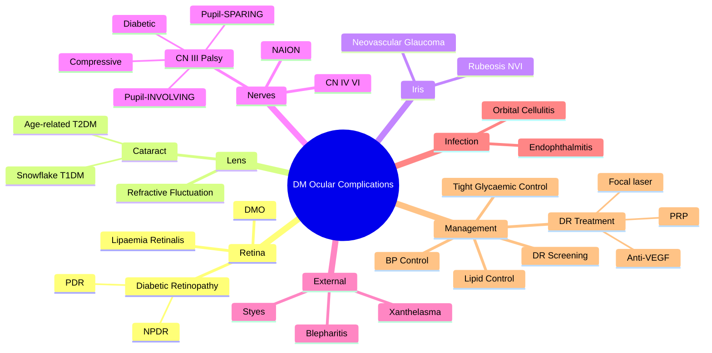

# Ocular Manifestations of Diabetes Mellitus

Related: [[Diabetic Retinopathy]], [[Cranial Nerve Palsies]]

> [!tip] **FCPS/MRCP Priority: CRITICAL**
> Multiple ocular complications: DR (most common), cataract, rubeosis, CN III palsy (pupil-sparing), refractory errors, ↑infection risk.

---

## Learning Objectives
- [ ] List the ocular complications of diabetes mellitus
- [ ] Describe diabetic retinopathy grading (NPDR, PDR, DMO)
- [ ] Recognise the difference between diabetic and compressive CN III palsy
- [ ] Identify diabetes-related lens and iris changes
- [ ] Outline systemic risk factors and management principles
- [ ] Discuss the role of glycaemic, BP, and lipid control

---

## 1. Definition / Epidemiology

### Definition
- **Ocular manifestations of diabetes mellitus:** Spectrum of eye complications occurring in patients with DM, affecting virtually every ocular structure
- The most important is **diabetic retinopathy (DR)** — a leading cause of blindness in working-age adults

### Epidemiology
- DR affects ~1 in 3 people with diabetes
- T1DM: rare at diagnosis, increases with duration (nearly all by 20 years)
- T2DM: 20-30% have DR at diagnosis (long preclinical period)
- Leading cause of blindness in working-age adults in developed countries
- Tighter glycaemic control dramatically reduces complications (DCCT, UKPDS)

### Risk Factors
- **Duration of DM** (strongest)
- **Poor glycaemic control** (HbA1c)
- **Hypertension**
- **Dyslipidaemia**
- **Pregnancy**
- **Smoking**
- **Nephropathy** (proteinuria, CKD)
- **Anaemia**
- **Puberty** (earlier in T1DM)

---

## 2. Aetiology / Pathophysiology

### Pathogenesis
- **Chronic hyperglycaemia** → activation of polyol pathway, AGEs, oxidative stress, PKC activation
- **Microvascular damage** → loss of pericytes, BM thickening, capillary closure, leakage
- **Macular oedema** → breakdown of blood-retinal barrier
- **Neovascularisation** → retinal ischaemia → VEGF release → NVD, NVE, NVI
- **Nerve ischaemia** → CN III palsy (pupil-sparing due to central ischaemia sparing peripheral parasympathetic fibres)

---

## 3. Clinical Features (Ocular Complications by Site)

### Retina (most important)
- **Diabetic retinopathy (DR):** see separate note — NPDR, PDR
- **Diabetic maculopathy / DMO** (clinically significant macular oedema)
- **Lipaemia retinalis** (very high triglycerides — cream-coloured vessels)
- **Retinal vein/artery occlusion** (DM is a risk factor)

### Lens
- **Cataract** (earlier than non-diabetics; "snowflake cataract" in young T1DM)
- **Refractive error fluctuation** (osmotic lens changes with glycaemic variation — myopic in hyperglycaemia, hypermetropic as glucose controlled)

### Iris
- **Rubeosis iridis (NVI)** — neovascularisation of iris in PDR / ocular ischaemia
- → **Neovascular (rubeotic) glaucoma** (very difficult to treat)

### Optic Nerve
- **Anterior ischaemic optic neuropathy (NAION)** — increased risk
- **Optic disc swelling in DMO/PDR** (rare)

### Cranial Nerves
- **CN III palsy** (pupil-sparing) — most common
- **CN IV, VI palsies** (less common)
- **Typically recover** over weeks-months
- **Pupil-sparing** differentiates from compressive (aneurysm) cause

### External / Adnexal
- **Blepharitis**, recurrent styes (chalazion)
- **Xanthelasma** (often with dyslipidaemia)

### Infection
- **↑ Risk** (especially with poor control)
- Orbital cellulitis
- Endophthalmitis (post-op)
- Fungal keratitis

### Other
- **Dry eye / Sjögren-like**
- **Anterior uveitis** (rare)
- **Ocular ischaemic syndrome** (severe carotid disease + DM)

---

## 4. Investigations

### First-Line
- **Visual acuity**
- **Refraction** (may fluctuate)
- **Slit-lamp examination**
- **Dilated fundus examination** (gold standard for DR screening)
- **IOP** (especially if rubeosis)

### DR Screening
- **Dilated fundus examination** OR **fundus photography** (1-2 yearly if no DR, more frequent if DR present)
- **OCT** (for DMO)
- **Fluorescein angiography (FFA)** (for PDR, DMO, treatment planning)

### Systemic
- **HbA1c, BP, lipid profile, renal function (eGFR, ACR)**
- These are vital for risk stratification and management

---

## 5. Differential Diagnosis

| Condition | Differentiating Features |
|-----------|--------------------------|
| **Diabetic CN III palsy** | Painless or mild pain, pupil-sparing, recovers in weeks-months, vasculopathic patient |
| **Compressive CN III palsy (aneurysm/ tumour)** | Severe pain, **pupil-involving** (dilated, non-reactive), needs urgent imaging |
| **Hypertensive retinopathy** | AV nicking, CWS, copper/silver wiring, no neovascularisation |
| **Central retinal vein occlusion (CRVO)** | Sudden painless ↓VA, dilated tortuous veins, "blood and thunder" fundus |
| **Diabetic cataract** | Bilateral, often posterior subcapsular, earlier than non-diabetics |
| **Snowflake cataract** | Young T1DM, bilateral white subcapsular opacities |

---

## 6. Management

### Systemic (Most Important)
- **Tight glycaemic control** (HbA1c target individualised, e.g., 6.5-7.5%)
- **BP control** (target <130/80 in most guidelines)
- **Lipid control** (statin; fenofibrate reduces DR progression)
- **Smoking cessation**
- **Treat nephropathy** (ACE inhibitor/ARB)
- **Pregnancy planning** (DR can worsen in pregnancy)

### Ocular — DR
- **NPDR:** Monitor, tight control
- **PDR:** Panretinal photocoagulation (PRP) ± anti-VEGF
- **DMO:** Intravitreal anti-VEGF (ranibizumab, aflibercept, bevacizumab); ± focal/grid laser

### Ocular — Other
- **Cataract:** Phacoemulsification + IOL (may be more challenging — small pupil, NVI risk)
- **Rubeosis / NVG:** PRP + anti-VEGF + IOP-lowering treatment
- **CN III palsy:** Observe; usually recovers; investigate atypical features (pupil involvement)
- **NAION:** Address vascular risk factors; no proven specific therapy

### Screening
- **Annual DR screening** for all diabetics (T1DM from 5 years post-diagnosis; T2DM from diagnosis)
- More frequent if DR present

---

## 7. Complications

- **Visual loss / blindness** (DR, DMO, NVG)
- **Permanent CN III palsy** (rare, usually recovers)
- **Vitreous haemorrhage, tractional retinal detachment** (PDR)
- **Stroke / MI** (DM is a vascular risk factor)

---

## 8. Red Flags / Emergencies

> [!danger] **Refer urgently if:**
> - Sudden visual loss (vitreous haemorrhage, TRD, CRVO)
> - Painful red eye with NVI (NVG)
> - Rubeosis (NVI) detected — sight-threatening
> - CN III palsy with **pupil involvement** (rule out aneurysm — urgent CTA/MRA)
> - Severe NPDR / PDR / DMO (urgent treatment)

---

## 9. FCPS/MRCP High-Yield Summary

| Site | Complication |
|------|--------------|
| **Retina** | DR (NPDR, PDR), DMO, lipaemia retinalis |
| **Lens** | Cataract (snowflake in young T1DM, age-related in T2DM) |
| **Iris** | NVI (rubeosis), neovascular glaucoma |
| **CN III** | **Pupil-sparing** palsy (vs compressive — pupil-involving) |
| **Optic nerve** | NAION |
| **External** | Blepharitis, styes, xanthelasma |
| **Infection** | Orbital cellulitis, endophthalmitis |
| **Refraction** | Fluctuating (osmotic lens changes) |

### Key Differentiator: CN III Palsy
- **Diabetic:** Pupil-SPARING (microvascular ischaemia of central motor fibres; peripheral parasympathetic fibres spared because they receive blood from pia)
- **Compressive (aneurysm, tumour):** Pupil-INVOLVING (peripheral parasympathetic fibres compressed first → dilated pupil)

---

## 10. Viva Questions

1. **Q:** Why is diabetic CN III palsy pupil-sparing?
   **A:** Diabetic microvascular disease affects the central nerve fibres (motor), sparing the peripheral parasympathetic fibres (pupil). Compressive (aneurysm) affects the periphery first → dilated pupil.

2. **Q:** What is the most common ocular complication of diabetes?
   **A:** Diabetic retinopathy (DR).

3. **Q:** What is the most important modifiable risk factor for DR?
   **A:** Glycaemic control (HbA1c).

4. **Q:** What is lipaemia retinalis?
   **A:** Cream/salmon coloured retinal vessels due to severe hypertriglyceridaemia (TG > 22 mmol/L).

5. **Q:** A 50-year-old diabetic presents with sudden painful ↓VA, ↓colour vision, and ↓red reflex. The pupil is mid-dilated and unreactive. Diagnosis?
   **A:** **Compressive CN III palsy** (e.g., posterior communicating artery aneurysm) — **NOT** diabetic (which is pupil-sparing). Needs urgent CTA/MRA.

6. **Q:** How is DMO treated?
   **A:** Intravitreal anti-VEGF (ranibizumab, aflibercept, bevacizumab); ± focal/grid laser.

7. **Q:** What is the treatment for PDR?
   **A:** Panretinal photocoagulation (PRP) ± anti-VEGF; tight glycaemic control.

---

## 11. Common Confusions / Exam Traps

| Confusion | Clarification |
|-----------|---------------|
| "Diabetic CN III palsy affects the pupil" | No — it SPARES the pupil. Pupil-involving CN III = compressive (aneurysm) — emergency |
| "Cataract in DM is the same as age-related" | Earlier onset, more aggressive, often posterior subcapsular in T1DM |
| "Lipaemia retinalis = high cholesterol" | No — it's **high triglycerides** (chylomicronaemia) |
| "Refractive error is stable in DM" | No — fluctuates with glycaemia (myopic shift with hyperglycaemia, hypermetropic with treatment) |
| "All DM patients with eye pain have CN III palsy" | Differential includes keratitis, endophthalmitis, NAION, NVG |
| "DR requires laser immediately" | No — only vision-threatening DR (DMO, PDR). Mild-moderate NPDR = monitor + tight control |

---

## 12. Mnemonics

1. **"Diabetic CN III: SPARES the Pupil"** — Diabetic (microvascular) is **S**paring; **C**ompressive (aneurysm) **C**onstricts... wait, actually: **D**iabetic = **D**oesn't touch pupil; **C**ompressive = **C**atches pupil
2. **"RETINA-LENS-IRIS-NERVE"** — **R**etinopathy (DR), **E**ye lid (blepharitis), **T**riglycerides (lipaemia), **I**ris (NVI), **N**erve (CN III), **A**ION, **L**ens (cataract)
3. **"5 R's of Diabetic Eye"** — **R**etinopathy, **R**ubeosis, **R**efractive shift, **R**ecurrent infection, **R**ecovery (CN III recovers)

---

## 13. Mind Map

---

## 14. One-Page Revision Card

| **Topic** | **DM Ocular Complications** |
|-----------|------------------------------|
| **Most common complication** | Diabetic retinopathy (DR) |
| **CN III palsy** | **Pupil-SPARING** (vs compressive — pupil-involving) |
| **Cataract** | Earlier; "snowflake" in young T1DM |
| **Iris** | Rubeosis (NVI) → NVG |
| **Optic nerve** | NAION |
| **Refraction** | Fluctuates with glucose |
| **Lipaemia retinalis** | Severe hypertriglyceridaemia |
| **Treatment of DMO** | Anti-VEGF (intravitreal) |
| **Treatment of PDR** | PRP + anti-VEGF |
| **Viva Pearl** | Diabetic CN III = pupil-sparing; Compressive = pupil-involving |

---

## Spaced Repetition Trackers

### 24-Hour Recall Prompts
- [ ] List 5 ocular complications of diabetes
- [ ] Why is diabetic CN III palsy pupil-sparing?
- [ ] What is the most important modifiable risk factor for DR?
- [ ] How is DMO treated?
- [ ] What is lipaemia retinalis and what does it indicate?

### Revision Schedule
- [ ] **Day 1** completed (creation + 24h recall)
- [ ] **Day 3** revision completed
- [ ] **Day 7** revision completed
- [ ] **Day 15** revision completed
- [ ] **Day 30** revision completed
- [ ] **Day 90** revision completed

---

## Must Know / Should Know / Nice to Know

### Must Know (Core for passing)
- [x] DR is the most common complication
- [x] CN III palsy is pupil-sparing in DM
- [x] Snowflake cataract in young T1DM
- [x] Rubeosis → neovascular glaucoma
- [x] Tight glycaemic control reduces complications
- [x] DR screening is annual

### Should Know (High probability)
- [x] DMO treatment (anti-VEGF)
- [x] PDR treatment (PRP)
- [x] NAION in DM
- [x] Lipaemia retinalis (triglycerides)
- [x] Refractive fluctuation with glucose

### Nice to Know (Differentiator)
- [ ] Xanthelasma association with dyslipidaemia
- [ ] Ocular ischaemic syndrome (severe carotid + DM)
- [ ] Pregnancy and DR progression
- [ ] Effect of bariatric/pancreas transplant on DR

---

## My Weak Points
- [ ] Add personal weak areas here

---

## Self-Test Scorecard

| Section | Score /10 |
|---------|-----------|
| Understanding: | /10 |
| Recall: | /10 |
| MCQ Performance: | /10 |
| SBA Performance: | /10 |
| Viva Confidence: | /10 |
| **Total:** | **/50** |

> [!tip] **Interpretation:** <35 = weak topic, 35-44 = acceptable but insecure, 45+ = strong exam-ready topic.

---

## Exam Answer Modes

### Long Answer Skeleton
1. Definition (DM affects every ocular structure)
2. Pathogenesis (chronic hyperglycaemia → microvascular damage, ischaemia, VEGF)
3. Complications by site:
   - Retina: DR (NPDR, PDR), DMO, lipaemia retinalis
   - Lens: cataract (snowflake in T1DM), refractive fluctuation
   - Iris: rubeosis (NVI), NVG
   - Nerves: CN III (pupil-sparing), CN IV/VI, NAION
   - External: blepharitis, styes, xanthelasma
   - Infection: orbital cellulitis, endophthalmitis
4. Risk factors (duration, glycaemia, BP, lipids, smoking, nephropathy)
5. Investigations (VA, refraction, slit-lamp, fundus, OCT, FFA, HbA1c, BP, lipids)
6. Management (tight control, DR screening, anti-VEGF for DMO, PRP for PDR)
7. Why diabetic CN III is pupil-sparing

### Short Note Skeleton
- Ocular complications of DM (retina, lens, iris, nerve, external)
- Diabetic CN III palsy — pupil-sparing
- Snowflake cataract in young T1DM
- Lipaemia retinalis
- DR screening and treatment (anti-VEGF for DMO, PRP for PDR)

### Viva One-Liners
- **Q:** Why is diabetic CN III pupil-sparing? → **A:** Central ischaemia of motor fibres; peripheral parasympathetic fibres spared
- **Q:** Most common ocular complication? → **A:** DR
- **Q:** Treatment of DMO? → **A:** Anti-VEGF
- **Q:** Treatment of PDR? → **A:** PRP ± anti-VEGF
- **Q:** Snowflake cataract seen in? → **A:** Young T1DM
- **Q:** Lipaemia retinalis = ? → **A:** Severe hypertriglyceridaemia

### Ward-Case Discussion Points
- Screen all DM patients for DR (annual)
- Address glycaemic, BP, lipid control
- Differentiate diabetic from compressive CN III palsy (pupil)
- Discuss DR treatment thresholds (PDR, DMO, severe NPDR)
- Address modifiable risk factors (smoking, BP, lipids)
- Discuss pregnancy and DR

### Last-Night-Before-Exam Sheet
- **DR is the most common complication**
- **Diabetic CN III = pupil-sparing; Compressive = pupil-involving**
- **Snowflake cataract = young T1DM**
- **Lipaemia retinalis = high TG**
- **DMO = anti-VEGF; PDR = PRP**
- **Tight glycaemic control reduces all complications**

---

## Summary

Diabetes mellitus affects virtually every ocular structure. The most common complication is diabetic retinopathy (DR), a leading cause of blindness in working-age adults. Other complications include cataract (earlier; snowflake in young T1DM), rubeosis iridis (NVI) and neovascular glaucoma, pupil-sparing CN III palsy (microvascular ischaemia of central motor fibres, sparing peripheral parasympathetic), CN IV/VI palsies, NAION, blepharitis/styes, xanthelasma, recurrent infections, and refractive error fluctuation. Tight glycaemic, BP, and lipid control are the cornerstone of prevention. DR screening is annual; treatment is anti-VEGF for DMO and PRP for PDR. Compressive CN III palsy (e.g., PCOM aneurysm) is pupil-involving and a neurological emergency.

---

## MCQs (10)

1. **Question:** Diabetic CN III palsy characteristically:
   **Options:** A. Affects the pupil B. Spares the pupil C. Causes ptosis only D. Is permanent E. Causes diplopia only
   **Answer:** B
   **Explanation:** Diabetic (microvascular) CN III palsy is pupil-sparing because peripheral parasympathetic fibres are supplied by pial vessels and are not affected by central ischaemia. Compressive lesions (aneurysm) affect the pupil.

2. **Question:** "Snowflake" cataract is associated with:
   **Options:** A. Old age B. Diabetes mellitus in young T1DM patients C. Trauma D. Steroid use E. Uveitis
   **Answer:** B
   **Explanation:** Snowflake cataract (white subcapsular opacities) is classically seen in young patients with type 1 diabetes mellitus.

3. **Question:** The most important modifiable risk factor for diabetic retinopathy is:
   **Options:** A. Age B. Smoking C. Glycaemic control (HbA1c) D. Eye rubbing E. Sleep
   **Answer:** C
   **Explanation:** Tight glycaemic control (DCCT, UKPDS) is the most important modifiable risk factor for preventing and slowing DR.

4. **Question:** Lipaemia retinalis is a feature of:
   **Options:** A. Hypercholesterolaemia B. Severe hypertriglyceridaemia C. Anaemia D. Diabetes only E. Hyperglycaemia
   **Answer:** B
   **Explanation:** Lipaemia retinalis (cream/salmon coloured retinal vessels) is seen in severe hypertriglyceridaemia (TG > 22 mmol/L), often in poorly controlled DM.

5. **Question:** The first-line treatment for diabetic macular oedema (DMO) is:
   **Options:** A. Oral steroids B. Intravitreal anti-VEGF C. Panretinal photocoagulation D. Cataract surgery E. Glaucoma drops
   **Answer:** B
   **Explanation:** Anti-VEGF agents (ranibizumab, aflibercept, bevacizumab) injected intravitreally are first-line for centre-involving DMO.

6. **Question:** Rubeosis iridis in a diabetic most commonly indicates:
   **Options:** A. Cataract B. Proliferative diabetic retinopathy / ocular ischaemia C. Acute uveitis D. Acute glaucoma E. Old age
   **Answer:** B
   **Explanation:** Rubeosis (NVI) develops in response to retinal ischaemia in PDR, indicating advanced disease and risk of neovascular glaucoma.

7. **Question:** A 60-year-old diabetic with sudden severe headache, painful ↓VA, and a fixed dilated pupil. Most likely diagnosis:
   **Options:** A. Diabetic CN III palsy (pupil-sparing) B. Compressive CN III palsy (PCOM aneurysm) C. Acute glaucoma D. Conjunctivitis E. Optic neuritis
   **Answer:** B
   **Explanation:** Painful CN III palsy with **pupil involvement** (fixed, dilated) suggests compressive lesion (PCOM aneurysm). This is a neurological emergency — urgent CTA/MRA.

8. **Question:** All of the following are ocular complications of diabetes EXCEPT:
   **Options:** A. Diabetic retinopathy B. Cataract C. Rubeosis iridis D. Glaucoma (only POAG, not NVG) E. CN III palsy
   **Answer:** D
   **Explanation:** DM does not cause primary open-angle glaucoma (POAG) directly. It causes **neovascular glaucoma** (rubeotic), not POAG. All others are recognised DM complications.

9. **Question:** Diabetic eye screening should be performed:
   **Options:** A. Only if symptoms B. Every 5 years C. Annually for all diabetics D. Only T1DM E. Only T2DM
   **Answer:** C
   **Explanation:** Annual screening is recommended for all patients with diabetes (T1DM from 5 years post-diagnosis, T2DM from diagnosis).

10. **Question:** Refractive error fluctuations in diabetes are caused by:
    **Options:** A. Cataract progression B. Osmotic changes in the lens with glycaemic variation C. Corneal oedema D. Retinal detachment E. Optic nerve disease
    **Answer:** B
    **Explanation:** Hyperglycaemia causes osmotic swelling of the lens → myopic shift; treatment causes hypermetropic shift. Refraction should be deferred until glucose is stable.

---

## SBA Questions (10)

1. **Scenario:** A 65-year-old man with T2DM, HTN, and dyslipidaemia has sudden onset of painful ↓VA in the right eye with ptosis, eye down-and-out, and a mid-dilated unreactive pupil.
   **Question:** Most likely diagnosis and most appropriate next step?
   **Options:** A. Diabetic CN III palsy (pupil-sparing) — observe B. Compressive CN III palsy (PCOM aneurysm) — urgent CTA/MRA C. Optic neuritis — IV steroids D. NAION — aspirin E. Bell's palsy — observe
   **Answer:** B
   **Explanation:** Painful CN III palsy with **pupil involvement** = compressive (PCOM aneurysm) — emergency. Urgent CTA/MRA to confirm.

2. **Scenario:** A 50-year-old with T1DM for 25 years and poor glycaemic control presents with sudden painless ↓VA in one eye. Fundus shows dot/blot haemorrhages, microaneurysms, hard exudates near the macula, and retinal thickening.
   **Question:** What is the most appropriate treatment?
   **Options:** A. Cataract surgery B. Intravitreal anti-VEGF injection for DMO C. Oral steroids D. Glaucoma surgery E. Observation only
   **Answer:** B
   **Explanation:** DMO with vision loss = first-line treatment is intravitreal anti-VEGF (e.g., ranibizumab, aflibercept, bevacizumab).

3. **Scenario:** A 55-year-old with T2DM, HTN, hyperlipidaemia, and 15-year DM duration has DR screening. Fundus shows neovascularisation of the disc (NVD) and elsewhere (NVE) with vitreous haemorrhage.
   **Question:** Most appropriate management?
   **Options:** A. Observation B. Panretinal photocoagulation (PRP) ± anti-VEGF C. Cataract surgery D. Oral steroids E. Vitrectomy immediately
   **Answer:** B
   **Explanation:** Proliferative DR (PDR) with high-risk features (NVD, NVE, vitreous haemorrhage) is treated with PRP ± anti-VEGF.

4. **Scenario:** A 30-year-old with T1DM for 20 years has bilateral lens opacities described as "snowflake" subcapsular opacities.
   **Question:** What is the diagnosis?
   **Options:** A. Age-related cataract B. Diabetic snowflake cataract C. Congenital cataract D. Traumatic cataract E. Steroid-induced cataract
   **Answer:** B
   **Explanation:** Snowflake cataract is a classic finding in young T1DM patients.

5. **Scenario:** A 45-year-old with poorly controlled DM and TG of 35 mmol/L has fundus showing cream/salmon coloured retinal vessels. Vision is 6/6.
   **Question:** What is the most likely diagnosis?
   **Options:** A. Diabetic retinopathy B. Lipaemia retinalis C. CRVO D. Hypertensive retinopathy E. Retinal artery occlusion
   **Answer:** B
   **Explanation:** Lipaemia retinalis = cream-coloured retinal vessels due to severe hypertriglyceridaemia. Treat with fibrates, insulin; vision is usually preserved unless very severe.

6. **Scenario:** A 60-year-old diabetic presents with painful ↓VA, a red eye, high IOP, and rubeosis iridis.
   **Question:** Most likely diagnosis?
   **Options:** A. Acute angle-closure glaucoma B. Neovascular (rubeotic) glaucoma C. POAG D. Uveitis E. Conjunctivitis
   **Answer:** B
   **Explanation:** Rubeosis + ↑IOP + pain in a diabetic = neovascular glaucoma (NVG), usually from PDR. Treat with PRP, anti-VEGF, IOP-lowering.

7. **Scenario:** A 50-year-old diabetic with sudden onset of ptosis and diplopia, with the eye deviated "down and out." The pupil is normal and reactive.
   **Question:** Most likely diagnosis?
   **Options:** A. Compressive CN III palsy (aneurysm) B. Diabetic (microvascular) CN III palsy C. Optic neuritis D. NAION E. Myasthenia gravis
   **Answer:** B
   **Explanation:** Pupil-sparing CN III palsy in a diabetic = microvascular (diabetic) CN III palsy. Typically recovers in weeks-months.

8. **Scenario:** A 60-year-old diabetic with HbA1c 11% has fluctuating vision — reports that his glasses prescription changes every few weeks.
   **Question:** What is the most appropriate next step?
   **Options:** A. New glasses every visit B. Defer refraction until glucose is stabilised C. Cataract surgery D. Anti-VEGF E. PRP
   **Answer:** B
   **Explanation:** Refractive error fluctuates with glycaemia. Stabilise glucose first, then refract.

9. **Scenario:** A diabetic patient has rubeosis iridis detected on slit-lamp examination. The view of the fundus is hazy.
   **Question:** Most appropriate next step?
   **Options:** A. Reassure B. Urgent referral for PRP (panretinal photocoagulation) C. Topical antibiotic D. Topical steroid E. Cataract surgery
   **Answer:** B
   **Explanation:** Rubeosis indicates severe retinal ischaemia (usually PDR) → risk of NVG. Urgent PRP to regress neovascularisation.

10. **Scenario:** A 35-year-old with T1DM for 18 years on insulin. Most appropriate DR screening interval?
    **Options:** A. Every 5 years B. Annually C. Every 2 years D. Once at age 50 E. Only if visual symptoms
    **Answer:** B
    **Explanation:** Annual DR screening is recommended for all diabetics (T1DM from 5 years post-diagnosis, T2DM from diagnosis). More frequent if DR is present.

---

## Flashcards

- **Q:** Why is diabetic CN III palsy pupil-sparing?
  **A:** Microvascular ischaemia affects the central motor fibres; peripheral parasympathetic fibres are supplied by pial vessels and are spared. Compressive lesions (aneurysm) affect the periphery first → dilated pupil.
- **Q:** What is the most common ocular complication of diabetes?
  **A:** Diabetic retinopathy (DR).
- **Q:** What is snowflake cataract?
  **A:** White subcapsular lens opacities in young T1DM patients.
- **Q:** Treatment for diabetic macular oedema (DMO)?
  **A:** Intravitreal anti-VEGF.
- **Q:** Treatment for proliferative DR (PDR)?
  **A:** Panretinal photocoagulation (PRP) ± anti-VEGF.

---

## Answer Key with Explanations

### MCQs
1. B — Diabetic CN III palsy spares the pupil
2. B — Snowflake cataract = young T1DM
3. C — Glycaemic control is the most important modifiable risk factor
4. B — Lipaemia retinalis = severe hypertriglyceridaemia
5. B — Anti-VEGF is first-line for DMO
6. B — Rubeosis indicates retinal ischaemia (PDR)
7. B — Painful + pupil-involving CN III = PCOM aneurysm (emergency)
8. D — DM does not cause POAG (only NVG)
9. C — Annual DR screening for all diabetics
10. B — Refractive fluctuation = osmotic lens changes with glucose

### SBAs
1. B — Painful + pupil-involving CN III = compressive; urgent CTA/MRA
2. B — DMO = intravitreal anti-VEGF
3. B — PDR = PRP ± anti-VEGF
4. B — Snowflake cataract = T1DM
5. B — Lipaemia retinalis = high TG
6. B — Rubeosis + ↑IOP = NVG
7. B — Pupil-sparing CN III = diabetic microvascular
8. B — Defer refraction until glucose stable
9. B — Rubeosis = urgent PRP
10. B — Annual DR screening for all diabetics

---

## Tags
#medicine #davidson #ophthalmology #diabetes #fcps #mrcp
