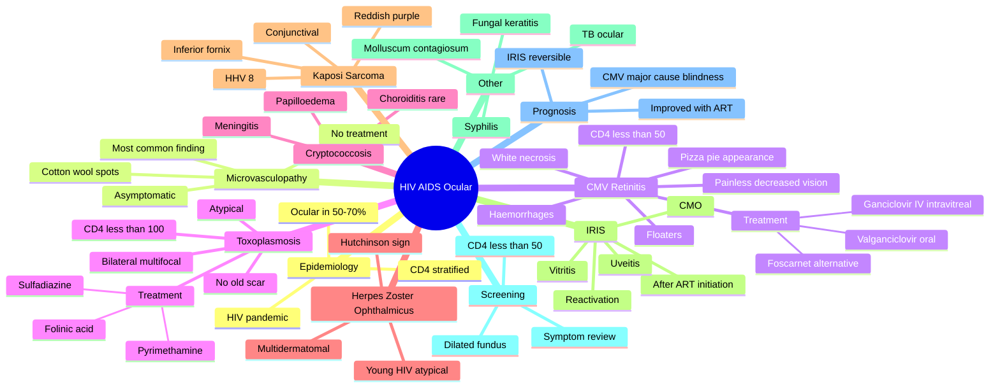

## Learning Objectives

- [ ] List the major ocular manifestations of HIV and stratify them by CD4 count.
- [ ] Recognise CMV retinitis (pizza-pie / cottage cheese and ketchup appearance) and its management with ganciclovir / valganciclovir.
- [ ] Describe the features of HIV microvasculopathy (cotton-wool spots most common ocular finding overall).
- [ ] Outline ocular opportunistic infections: HSV, VZV, Toxoplasma, Cryptococcus, PML.
- [ ] Recognise immune reconstitution inflammatory syndrome (IRIS) ocular manifestations after ART initiation.

---

# HIV Infection and AIDS — Ocular Manifestations

Related: [[Posterior Uveitis (Choroiditis)]], [[Toxoplasmosis]]

> [!tip] **FCPS/MRCP Priority: HIGH**
> HIV retinopathy (cotton wool) most common. CMV retinitis when CD4 <50 (pizza-pie). Opportunistic infections. Molluscum, KS. HAART reduces risk.

---

## 1. Ocular Manifestations by CD4

### CD4 >200
- **HIV retinopathy** (most common — cotton wool spots, microaneurysms, no vision loss)
- Molluscum contagiosum
- Herpes zoster ophthalmicus (younger, more severe)

### CD4 <200
- Kaposi sarcoma (eyelid, conjunctiva, rarely orbit)
- Toxoplasmosis

### CD4 <100
- Cryptococcosis (choroiditis, papilloedema)
- Microsporidia
- Pneumocystis (choroiditis)

### CD4 <50
- **CMV retinitis** (most common opportunistic)
- Atypical mycobacteria

---

## 2. CMV Retinitis

- Most common cause of vision loss in AIDS
- CD4 <50 (rarely >100)
- "**Pizza pie**" — yellow-white retinal necrosis with haemorrhage
- "**Cottage cheese + ketchup**"
- Perivascular distribution
- Painless, progressive
- **Treatment:** IV ganciclovir, oral valganciclovir, IV foscarnet, intravitreal
- **HAART** reduces recurrence, improves survival
- **Risk of RD** (40–50%)

---

## 3. HIV Retinopathy

- Most common ocular manifestation (50–70%)
- Cotton wool spots (nerve fibre layer infarcts)
- Microaneurysms, Roth spots
- No vision loss, asymptomatic
- Marker of systemic microvasculopathy

---

## 4. Other Ocular HIV
- Molluscum contagiosum (eyelid)
- Kaposi sarcoma (spindle cell, HHV-8) — purple-red lesions on lid, conjunctiva
- Herpes zoster ophthalmicus (younger, more severe, multi-dermatomal)
- Syphilis (uveitis, optic atrophy, Argyll Robertson)
- Toxoplasmosis (focal necrotising retinitis)

---

## 5. Management

- **HAART** — cornerstone, reduces opportunistic infections
- Specific treatment for CMV, toxoplasma, syphilis, etc.
- Ophthalmology review for any visual symptoms

---

## 6. FCPS/MRCP Summary

| Manifestation | Notes |
|---------------|-------|
| HIV retinopathy | CWS, no vision loss |
| CMV retinitis | CD4 <50, pizza-pie |
| KS | HHV-8, eyelid |
| Toxoplasmosis | Necrotising retinitis |
| HZO | Young, severe |

---

## 7. Viva Questions

1. **Q:** What is the most common ocular manifestation of HIV?
   **A:** HIV retinopathy (cotton wool spots).

2. **Q:** What CD4 count for CMV retinitis?
   **A:** <50 (rarely <100).

---

## Summary

HIV causes multiple ocular manifestations by CD4 count. Most common is HIV retinopathy (cotton wool, no vision loss). CMV retinitis at CD4 <50 is most common sight-threatening — treat with ganciclovir, HAART.

## MCQs (10)

**1. What is the most common ocular manifestation of HIV overall?**
A. CMV retinitis
B. HIV microvasculopathy (cotton-wool spots)
C. Kaposi sarcoma
D. Toxoplasmosis
E. Herpes zoster ophthalmicus
**Answer: B** — HIV microvasculopathy (cotton-wool spots) is the most common ocular manifestation overall.

**2. CMV retinitis in HIV typically occurs when CD4 count falls below:**
A. 100/μL
B. 200/μL
C. 50/μL
D. 500/μL
E. 1000/μL
**Answer: C** — CMV retinitis typically occurs when CD4 count is <50/μL.

**3. The classic fundus appearance of CMV retinitis is described as:**
A. Cherry-red spot
B. Pizza-pie or cottage cheese and ketchup
C. Bone-spicule pigmentation
D. Macular star
E. Choroidal granuloma
**Answer: B** — CMV retinitis: haemorrhages (ketchup) + white necrotic retina (cottage cheese) = 'pizza pie'.

**4. First-line treatment for CMV retinitis in HIV is:**
A. Acyclovir
B. Ganciclovir or valganciclovir
C. Foscarnet only
D. Anti-VEGF
E. Methotrexate
**Answer: B** — Ganciclovir IV / intravitreal, or oral valganciclovir is first-line for CMV retinitis.

**5. HIV retinopathy (microvasculopathy) is characterised by:**
A. Vitritis
B. Cotton-wool spots
C. Macular oedema
D. Retinal detachment
E. Optic neuritis
**Answer: B** — HIV retinopathy features cotton-wool spots (nerve fibre layer microinfarcts) — the most common finding.

**6. Ocular toxoplasmosis in HIV is most often:**
A. Unilateral solitary lesion
B. Bilateral, multifocal, often atypical
C. Always adjacent to old scar
D. Never recurrent
E. Caused by acquired infection
**Answer: B** — In HIV, toxoplasmosis is often bilateral, multifocal, atypical (no old scar), more aggressive.

**7. Cryptococcal ocular involvement in HIV most commonly presents as:**
A. Anterior uveitis
B. Papilloedema (from cryptococcal meningitis)
C. Endophthalmitis
D. Retinal detachment
E. Cataract
**Answer: B** — Cryptococcal meningitis causes raised ICP → papilloedema; choroiditis can occur.

**8. IRIS (immune reconstitution inflammatory syndrome) in the eye most commonly presents as:**
A. Acute anterior uveitis
B. Vitritis, CMO, or reactivation of prior ocular infection (e.g. CMV, TB)
C. Retinal detachment
D. Cataract
E. Glaucoma
**Answer: B** — Ocular IRIS most commonly reactivates prior CMV retinitis or causes vitritis, CMO after ART initiation.

**9. Kaposi sarcoma of the conjunctiva in HIV appears as:**
A. White plaque
B. Reddish-purple subconjunctival lesion
C. Yellow nodule
D. Pigmented lesion
E. Cystic lesion
**Answer: B** — Kaposi sarcoma: reddish-purple flat or raised conjunctival lesion, often in inferior fornix.

**10. The most appropriate screening approach for CMV retinitis in HIV is:**
A. Annual OCT
B. Dilated fundus examination when CD4 <50/μL
C. Visual field only
D. No screening
E. Self-monitoring only
**Answer: B** — Dilated fundus exam at each visit when CD4 <50/μL, with urgent referral if symptoms.

## SBA Questions (10)

**1. An HIV patient with CD4 count 30/μL presents with floaters and visual field defect. Fundus shows a yellow-white retinal lesion with adjacent haemorrhage ('pizza-pie'). The most likely diagnosis is:**
**Answer:** CMV retinitis

**2. The first-line systemic treatment for CMV retinitis in this patient is:**
**Answer:** Oral valganciclovir 900 mg BD (induction) for 3-6 weeks, then 900 mg OD (maintenance)

**3. An HIV patient with CMV retinitis on valganciclovir is started on ART. Within 4 weeks, vision worsens with marked vitritis. The most likely diagnosis is:**
**Answer:** Immune reconstitution inflammatory syndrome (IRIS) — reactivation/worsening of CMV retinitis

**4. The most appropriate management of CMV-IRIS is:**
**Answer:** Continue ART, continue anti-CMV therapy, add systemic corticosteroid (prednisolone 0.5-1 mg/kg)

**5. A 35-year-old HIV patient with CD4 25/μL presents with bilateral progressive visual loss and headache. CT shows meningeal enhancement. The most likely cause of visual loss is:**
**Answer:** Cryptococcal meningitis with raised ICP causing papilloedema (and possibly optic neuropathy)

**6. The most appropriate empirical treatment for cryptococcal meningitis in HIV is:**
**Answer:** IV amphotericin B + flucytosine for 2 weeks, then fluconazole consolidation

**7. An HIV patient presents with a reddish-purple subconjunctival lesion in the inferior fornix. The most likely diagnosis is:**
**Answer:** Kaposi sarcoma

**8. The most common organism causing visual loss in HIV patients in sub-Saharan Africa is:**
**Answer:** CMV (cytomegalovirus)

**9. An HIV patient on ART with rising CD4 count develops floaters, anterior uveitis, and a yellow-white chorioretinal lesion. The most likely diagnosis is:**
**Answer:** Ocular toxoplasmosis (or TB choroiditis — depends on endemicity)

**10. The most appropriate treatment for ocular toxoplasmosis in HIV is:**
**Answer:** Pyrimethamine + sulfadiazine + folinic acid (with clindamycin or trimethoprim alternatives)

## Flashcards

- **Q:** Most common ocular manifestation of HIV?
  **A:** HIV retinopathy — cotton-wool spots, microaneurysms, Roth spots; asymptomatic with no vision loss.
- **Q:** At what CD4 does CMV retinitis occur?
  **A:** CD4 <50 cells/µL (rarely <100); treat with IV ganciclovir / oral valganciclovir / intravitreal.
- **Q:** What does CMV retinitis look like?
  **A:** "Pizza-pie" / "cottage-cheese + ketchup" — yellow-white retinal necrosis with haemorrhages in a perivascular distribution.
- **Q:** What is the cornerstone of HIV ocular management?
  **A:** HAART — reduces opportunistic infections and CMV recurrence; improve CD4 counts.

---

## Answer Key with Explanations

### MCQs
1. **B** — HIV microvasculopathy (cotton-wool spots) is the most common ocular manifestation overall.
2. **C** — CMV retinitis typically occurs when CD4 count is <50/μL.
3. **B** — CMV retinitis: haemorrhages (ketchup) + white necrotic retina (cottage cheese) = 'pizza pie'.
4. **B** — Ganciclovir IV / intravitreal, or oral valganciclovir is first-line for CMV retinitis.
5. **B** — HIV retinopathy features cotton-wool spots (nerve fibre layer microinfarcts) — the most common finding.
6. **B** — In HIV, toxoplasmosis is often bilateral, multifocal, atypical (no old scar), more aggressive.
7. **B** — Cryptococcal meningitis causes raised ICP → papilloedema; choroiditis can occur.
8. **B** — Ocular IRIS most commonly reactivates prior CMV retinitis or causes vitritis, CMO after ART initiation.
9. **B** — Kaposi sarcoma: reddish-purple flat or raised conjunctival lesion, often in inferior fornix.
10. **B** — Dilated fundus exam at each visit when CD4 <50/μL, with urgent referral if symptoms.

### SBAs
1. CMV retinitis
2. Oral valganciclovir 900 mg BD (induction) for 3-6 weeks, then 900 mg OD (maintenance)
3. Immune reconstitution inflammatory syndrome (IRIS) — reactivation/worsening of CMV retinitis
4. Continue ART, continue anti-CMV therapy, add systemic corticosteroid (prednisolone 0.5-1 mg/kg)
5. Cryptococcal meningitis with raised ICP causing papilloedema (and possibly optic neuropathy)
6. IV amphotericin B + flucytosine for 2 weeks, then fluconazole consolidation
7. Kaposi sarcoma
8. CMV (cytomegalovirus)
9. Ocular toxoplasmosis (or TB choroiditis — depends on endemicity)
10. Pyrimethamine + sulfadiazine + folinic acid (with clindamycin or trimethoprim alternatives)

### 24-Hour Recall Prompts
- [ ] List 4 ocular manifestations of HIV stratified by CD4 count.
- [ ] Describe the fundal appearance of CMV retinitis.
- [ ] State the first-line treatment for CMV retinitis.
- [ ] Outline the role of HAART in ocular HIV.
- [ ] Differentiate HIV retinopathy from CMV retinitis clinically.
- [ ] List the ocular opportunistic infections in HIV.

### Revision Schedule
- [ ] **Day 1** completed (creation + 24h recall)
- [ ] **Day 3** revision completed
- [ ] **Day 7** revision completed
- [ ] **Day 15** revision completed
- [ ] **Day 30** revision completed
- [ ] **Day 90** revision completed

---

## Self-Test Scorecard

| Section | Score /5 |
|---------|----------|
| Understanding: | /10 |
| Recall: | /10 |
| MCQ Performance: | /10 |
| SBA Performance: | /10 |
| Viva Confidence: | /10 |
| Total: | /50 |

> [!tip]
> **Interpretation:** <35 = weak topic, 35-44 = acceptable but insecure, 45+ = strong exam-ready topic.

---

## Exam Answer Modes

### Long Answer Skeleton
1. Definition and epidemiology of HIV ocular disease
2. Pathophysiology (immune compromise → opportunistic infections)
3. Manifestations by CD4 (HIV retinopathy, HZO, KS, toxoplasmosis, CMV)
4. CMV retinitis: clinical features, variants, diagnosis
5. Investigations (CD4, viral load, CMV PCR, FFA)
6. Management: HAART cornerstone, anti-CMV induction + maintenance, RD surveillance
7. Complications (RD, blindness) and prognosis
8. Prevention (screening, prophylaxis)

### Short Note Skeleton
- Most common ocular HIV manifestation (HIV retinopathy)
- Sight-threatening (CMV retinitis) at CD4 <50
- Treatment of CMV (ganciclovir, valganciclovir, HAART)
- HZO and KS in HIV

### Viva One-Liners
- **Q:** Most common ocular HIV manifestation? → **A:** HIV retinopathy (CWS, asymptomatic).
- **Q:** Most common sight-threatening? → **A:** CMV retinitis at CD4 <50.
- **Q:** Treatment of CMV retinitis? → **A:** IV ganciclovir (induction) + oral valganciclovir (maintenance) + HAART.
- **Q:** What does CMV retinitis look like? → **A:** "Pizza-pie" perivascular necrosis with haemorrhage.
- **Q:** What organism causes KS? → **A:** HHV-8 (Kaposi's sarcoma-associated herpesvirus).
- **Q:** When does HZO in HIV occur? → **A:** Younger patients, more severe, multidermatomal, recurrent.

### Ward-Case Discussion Points
- Always check CD4 count in an HIV patient with new visual symptoms
- Examine the fundus in any HIV patient with ↓VA — CMV is treatable
- Counsel on HAART adherence (also reduces KS)
- Distinguish CMV retinitis from HIV retinopathy by clinical pattern
- Watch for retinal detachment after CMV — refer to vitreoretinal service
- Treat syphilis co-infection (uveitis, optic atrophy, Argyll Robertson)

### Last-Night-Before-Exam Sheet
- **Top 5 facts:** HIV retinopathy = most common (CWS); CMV at CD4 <50 (pizza-pie); HZO younger + severe; KS = HHV-8; HAART cornerstone
- **3 drug doses:** IV ganciclovir 5 mg/kg 12-h × 3–6 wk; oral valganciclovir 900 mg BD induction then OD; IV aciclovir 10 mg/kg 8-h for HZO
- **2 algorithms:** CD4 stratification of ocular HIV; CMV induction → maintenance
- **1 mnemonic:** "C <50 = CMV; Pizza Pie"
- **Must-know differential:** HIV retinopathy (CWS, asymptomatic) vs CMV retinitis (necrosis + haemorrhage, ↓VA)

---

## Mnemonics

1. **"CMV = Cottage cheese and Ketchup"** — CMV retinitis: white necrotic retina (cottage cheese) + haemorrhages (ketchup) = 'pizza pie'
2. **"CD4 = Clock"** — CD4 <50 = CMV; CD4 <100 = toxoplasmosis; CD4 <200 = PJP, candida
3. **"Cotton-wool spots = Commonest ocular finding"** — HIV microvasculopathy is the most common overall
4. **"IRIS = Immune Reconstitution Inflammatory Syndrome"** — happens within weeks of starting ART, reactivation of prior infection
5. **"EVS for Endophthalmitis"** — Endophthalmitis Vitrectomy Study; vancomycin + ceftazidime intravitreal

---

## Mind Map

---

## One-Page Revision Card

| Domain | Key Points |
|---|---|
| Definition | |
| Patient profile | |
| Most common ocular feature | |
| Investigations | |
| First-line management | |
| Severe / refractory management | |
| Most feared complication | |
| Prognosis | |

---

## Spaced Repetition Trackers

| Review Interval | Date | Score (0-5) | Notes |
|-----------------|------|-------------|-------|
| Day 1 | | | |
| Day 3 | | | |
| Day 7 | | | |
| Day 14 | | | |
| Day 30 | | | |
| Day 90 | | | |

## Tags
#medicine #davidson #ophthalmology #HIV #CMV #fcps #mrcp
