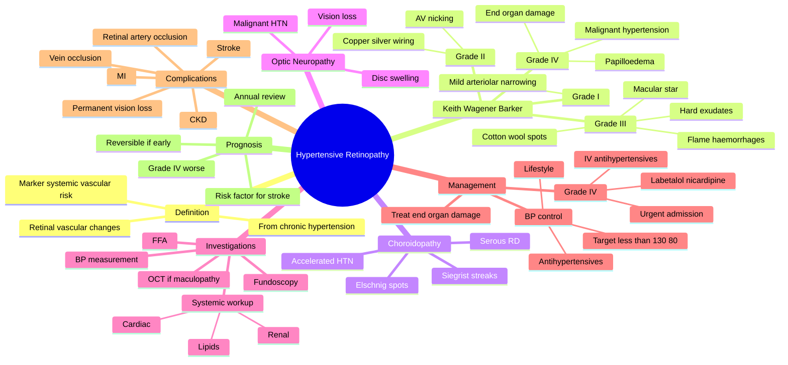

## Learning Objectives

- [ ] Grade hypertensive retinopathy (Keith-Wagener-Barker I–IV) and explain the prognostic significance of each grade.
- [ ] Identify malignant hypertensive retinopathy features: flame haemorrhages, cotton-wool spots, hard exudates, optic disc swelling (papilloedema).
- [ ] Distinguish hypertensive retinopathy from diabetic retinopathy on fundoscopy.
- [ ] Recognise hypertensive choroidopathy (Elschnig spots, Siegrist streaks) and optic neuropathy in accelerated hypertension.
- [ ] Outline systemic management priorities and ophthalmic follow-up intervals by retinopathy grade.

---

# Ocular Manifestations of Hypertension

Related: [[Hypertensive Retinopathy]], [[Central Retinal Vein Occlusion (CRVO)]]

> [!tip] **FCPS/MRCP Priority: HIGH**
> HTN retinopathy grades I-IV. Malignant HTN → papilloedema. Treat BP, address risk factors for CRVO, NAION.

---

## 1. Ocular Manifestations

### Retina
- **Hypertensive retinopathy** (KWB grades I–IV) — see separate note
- AV nicking, copper/silver wiring, CWS, hard exudates
- **Macular star** in accelerated HTN
- **Papilloedema** in malignant HTN (Grade IV)
- **Elschnig spots** (choroidal infarcts)
- Siegrist streak (choroidal)

### Optic Nerve
- **NAION** (especially in nocturnal hypotension)

### Vascular
- **CRVO, BRVO** (HTN is major risk)
- Retinal artery occlusion (HTN, atherosclerosis)
- **Ocular ischaemic syndrome** (carotid)
- **Malignant hypertensive choroidopathy** (exudative RD)

---

## 2. Management

- **Treat HTN** (urgent if malignant)
- Address other risk factors
- Treat complications (CRVO, BRVO, etc.)

---

## 3. FCPS/MRCP Summary

| Manifestation | Significance |
|---------------|--------------|
| KWB IV | Malignant HTN |
| CRVO | Major risk factor |
| NAION | Risk, esp. nocturnal |
| Elschnig | Choroidal infarct |

---

## 4. Viva Questions

1. **Q:** Fundus signs in malignant hypertension?
   **A:** KWB grade IV — papilloedema, haemorrhages, exudates, CWS.

---

## Summary

HTN causes hypertensive retinopathy (KWB grading), CRVO/BRVO, NAION, malignant HTN with choroidopathy. Treat BP.

## MCQs (10)

**1. The Keith-Wagener-Barker Grade IV hypertensive retinopathy includes:**
A. Mild arteriolar narrowing
B. AV nicking, cotton-wool spots, flame haemorrhages
C. Papilloedema
D. Copper wiring only
E. No changes
**Answer: C** — Grade IV includes papilloedema (malignant hypertension); Grade III = haemorrhages, exudates, CWS without papilloedema.

**2. Hypertensive choroidopathy is recognised on fundoscopy by:**
A. Hard exudates at macula
B. Elschnig spots and Siegrist streaks
C. Cherry-red spot
D. Bone spicules
E. Microaneurysms
**Answer: B** — Hypertensive choroidopathy shows Elschnig spots (yellow patches) and Siegrist streaks.

**3. In a patient with malignant hypertension, papilloedema is associated with:**
A. Cushing response
B. Improved prognosis
C. Indicates severe end-organ damage
D. Always transient
E. Rare finding
**Answer: C** — Malignant HTN with papilloedema = severe end-organ damage; requires urgent BP reduction.

**4. Cotton-wool spots in hypertensive retinopathy represent:**
A. Retinal haemorrhages
B. Nerve fibre layer microinfarcts
C. Lipid exudates
D. Capillary occlusion
E. Drusen
**Answer: B** — Cotton-wool spots are nerve fibre layer infarcts from arteriolar occlusion.

**5. AV (arteriovenous) nicking in hypertensive retinopathy is due to:**
A. Arterial spasm
B. Shared adventitia at crossing points
C. Capillary proliferation
D. Lipid deposition
E. Ischaemia
**Answer: B** — AV nicking: the arteriole and venule share an adventitia at crossings; arteriolar wall thickening compresses the venule.

**6. Hypertensive optic neuropathy is associated with:**
A. Mild blood pressure elevation only
B. Malignant hypertension with disc swelling
C. Always unilateral
D. Isolated finding
E. Benign course
**Answer: B** — Hypertensive optic neuropathy occurs in malignant HTN, often with disc swelling, may be irreversible.

**7. The most appropriate ophthalmic follow-up interval for moderate non-proliferative hypertensive retinopathy (Grade II) is:**
A. Every 5 years
B. Annually
C. Every 6-12 months
D. Only if symptomatic
E. Monthly
**Answer: C** — Moderate NPDR equivalent — 6-12 month follow-up with optimisation of BP control.

**8. Which of the following is NOT typically associated with hypertensive retinopathy?**
A. AV nicking
B. Cotton-wool spots
C. Flame haemorrhages
D. Macular star in neuroretinitis
E. Papilloedema (Grade IV)
**Answer: D** — Macular star in neuroretinitis is a distinct entity (often cat scratch disease), not hypertensive retinopathy.

**9. Hard exudates in the macula in hypertensive retinopathy form which pattern?**
A. Macular star
B. Macular oedema
C. Macular hole
D. Epiretinal membrane
E. Macular scar
**Answer: A** — Lipid exudates in Henle's layer form a macular star (when leakage is near fovea).

**10. The most appropriate management of a patient with Grade IV hypertensive retinopathy is:**
A. Observation
B. Topical steroid
C. Urgent reduction of blood pressure (IV in hospital)
D. Vitrectomy
E. Photodynamic therapy
**Answer: C** — Grade IV = malignant HTN with end-organ damage; requires urgent BP reduction in monitored setting.

## SBA Questions (10)

**1. A 55-year-old man with BP 220/120 mmHg presents with headache, blurred vision, and papilloedema. The most likely diagnosis is:**
**Answer:** Malignant (Grade IV) hypertensive retinopathy

**2. The most appropriate immediate management is:**
**Answer:** Urgent hospital admission, IV antihypertensives (e.g. labetalol, nicardipine) to reduce BP by ~25% in first hour

**3. On fundoscopy, the patient has flame haemorrhages, cotton-wool spots, hard exudates, and papilloedema. According to Keith-Wagener-Barker, this is:**
**Answer:** Grade IV (malignant hypertensive retinopathy)

**4. A hypertensive patient has yellow patches at the posterior pole with linear pigmented streaks. These are:**
**Answer:** Elschnig spots (yellow patches) and Siegrist streaks (linear hyperpigmented) — hypertensive choroidopathy

**5. The most important systemic risk factor for hypertensive retinopathy is:**
**Answer:** Sustained, poorly controlled blood pressure

**6. A 60-year-old with longstanding hypertension has arteriolar narrowing, AV nicking, but no haemorrhages or papilloedema. The Keith-Wagener-Barker grade is:**
**Answer:** Grade II

**7. Hypertensive retinopathy and diabetic retinopathy can be distinguished on fundoscopy by:**
**Answer:** Microaneurysms (DR), AV nicking (HR), hard exudate pattern, and clinical context (DM vs HTN)

**8. The most appropriate ophthalmic review for a patient with Grade I hypertensive retinopathy is:**
**Answer:** Annual review, with BP optimisation by GP/primary care

**9. Papilloedema in the setting of severe hypertension indicates:**
**Answer:** Severe end-organ damage (malignant hypertension); raised ICP must be excluded

**10. The most common visual symptom of hypertensive retinopathy is:**
**Answer:** Mild blurring or asymptomatic (often discovered incidentally)

## Flashcards

- **Q:** What does KWB grade IV (malignant) hypertensive retinopathy show?
  **A:** Papilloedema + flame haemorrhages + cotton-wool spots + hard exudates (± macular star); a medical emergency requiring IV BP control.
- **Q:** What are Elschnig spots?
  **A:** Choroidal infarcts (yellow-red patches with pigmented margins) seen in malignant hypertension.
- **Q:** How does hypertension cause NAION?
  **A:** Predisposes to nocturnal hypotension (over-treated BP) → optic disc hypoperfusion in a small-cup "disc at risk."
- **Q:** Most common ocular vascular complication of hypertension?
  **A:** Central retinal vein occlusion (CRVO) — HTN is the major systemic risk factor.

---

## Answer Key with Explanations

### MCQs
1. **C** — Grade IV includes papilloedema (malignant hypertension); Grade III = haemorrhages, exudates, CWS without papilloedema.
2. **B** — Hypertensive choroidopathy shows Elschnig spots (yellow patches) and Siegrist streaks.
3. **C** — Malignant HTN with papilloedema = severe end-organ damage; requires urgent BP reduction.
4. **B** — Cotton-wool spots are nerve fibre layer infarcts from arteriolar occlusion.
5. **B** — AV nicking: the arteriole and venule share an adventitia at crossings; arteriolar wall thickening compresses the venule.
6. **B** — Hypertensive optic neuropathy occurs in malignant HTN, often with disc swelling, may be irreversible.
7. **C** — Moderate NPDR equivalent — 6-12 month follow-up with optimisation of BP control.
8. **D** — Macular star in neuroretinitis is a distinct entity (often cat scratch disease), not hypertensive retinopathy.
9. **A** — Lipid exudates in Henle's layer form a macular star (when leakage is near fovea).
10. **C** — Grade IV = malignant HTN with end-organ damage; requires urgent BP reduction in monitored setting.

### SBAs
1. Malignant (Grade IV) hypertensive retinopathy
2. Urgent hospital admission, IV antihypertensives (e.g. labetalol, nicardipine) to reduce BP by ~25% in first hour
3. Grade IV (malignant hypertensive retinopathy)
4. Elschnig spots (yellow patches) and Siegrist streaks (linear hyperpigmented) — hypertensive choroidopathy
5. Sustained, poorly controlled blood pressure
6. Grade II
7. Microaneurysms (DR), AV nicking (HR), hard exudate pattern, and clinical context (DM vs HTN)
8. Annual review, with BP optimisation by GP/primary care
9. Severe end-organ damage (malignant hypertension); raised ICP must be excluded
10. Mild blurring or asymptomatic (often discovered incidentally)

### 24-Hour Recall Prompts
- [ ] Draw the KWB I–IV fundus grades from memory.
- [ ] List the ocular signs of malignant HTN (Grade IV).
- [ ] State the significance of Elschnig spots and Siegrist streaks.
- [ ] Explain how HTN causes CRVO and NAION.
- [ ] Outline the management of malignant HTN (BP targets).
- [ ] Differentiate diabetic from hypertensive retinopathy on fundoscopy.

### Revision Schedule
- [ ] **Day 1** completed (creation + 24h recall)
- [ ] **Day 3** revision completed
- [ ] **Day 7** revision completed
- [ ] **Day 15** revision completed
- [ ] **Day 30** revision completed
- [ ] **Day 90** revision completed

---

## Self-Test Scorecard

| Section | Score /5 |
|---------|----------|
| Understanding: | /10 |
| Recall: | /10 |
| MCQ Performance: | /10 |
| SBA Performance: | /10 |
| Viva Confidence: | /10 |
| Total: | /50 |

> [!tip]
> **Interpretation:** <35 = weak topic, 35-44 = acceptable but insecure, 45+ = strong exam-ready topic.

---

## Exam Answer Modes

### Long Answer Skeleton
1. Definition of hypertensive ocular disease
2. Pathophysiology (chronic vasoconstriction, fibrinoid necrosis in malignant)
3. KWB classification (grades I–IV)
4. Other ocular manifestations: CRVO, NAION, choroidopathy, ocular ischaemic syndrome
5. Fundus findings in each stage
6. Investigations: ophthalmoscopy, BP, FFA, OCT
7. Management: BP control (chronic vs malignant), specific complication Rx
8. Complications & prognosis (regression with Rx, mortality in malignant)

### Short Note Skeleton
- Definition + KWB grading
- Key fundus signs (3–4)
- Malignant HTN presentation (papilloedema, Elschnig spots)
- Management (BP control, urgency)

### Viva One-Liners
- **Q:** KWB grade IV? → **A:** Malignant HTN — papilloedema + haemorrhages + exudates + CWS.
- **Q:** Elschnig spots are? → **A:** Choroidal infarcts in malignant HTN.
- **Q:** How does HTN cause NAION? → **A:** Nocturnal hypotension + disc at risk → optic disc hypoperfusion.
- **Q:** Most common ocular vascular complication? → **A:** CRVO (HTN is the major risk factor).
- **Q:** Siegrist streak? → **A:** Choroidal pigmented streak in chronic HTN.
- **Q:** Treatment urgency in malignant HTN? → **A:** IV nicardipine/labetalol; ↓MAP 25% in 1st hour.

### Ward-Case Discussion Points
- Examine the fundus in every newly diagnosed hypertensive
- Recognise KWB grade IV (malignant HTN) — call for urgent BP control
- Counsel on adherence — asymptomatic HTN still causes end-organ damage
- Screen for end-organ damage (heart, kidney, brain)
- Distinguish NAION (nocturnal hypotension) from GCA-AION (systemic inflammation)
- Advise smoking cessation and statin therapy as part of cardiovascular risk reduction

### Last-Night-Before-Exam Sheet
- **Top 5 facts:** KWB I–IV, papilloedema = malignant HTN, Elschnig = choroidal, AV nicking = chronic, NAION from nocturnal hypotension
- **3 drug doses:** IV labetalol 20 mg bolus, then 1–2 mg/min; oral amlodipine 5 mg OD; IV nicardipine 5 mg/h titrated
- **2 algorithms:** KWB grade interpretation; BP targets in HTN urgency vs emergency
- **1 mnemonic:** KWB IV = **PHEC** (Papilloedema, Haemorrhages, Exudates, CWS)
- **Must-know differential:** Diabetic vs hypertensive retinopathy (DR has microaneurysms + dot/blot haemorrhages + hard exudates ± DMO; HTN has AV nicking + flame haemorrhages + macular star in malignant)

---

## Mnemonics

1. **"Grade IV = IV = IV (intravenous BP reduction)"** — malignant hypertensive retinopathy needs urgent IV BP control
2. **"AVN = Ateriovenous Nicking"** — shared adventitia compresses vein at crossings
3. **"CWS = Cotton-Wool Spots"** — nerve fibre layer microinfarcts (NOT lipid exudate)
4. **"KW I-IV"** — Keith-Wagener-Barker: I = mild narrowing; II = AV nicking; III = haemorrhages/CWS/exudates; IV = papilloedema
5. **"Elschnig + Siegrist = choroidopathy"** — yellow patches + linear streaks in accelerated HTN

---

## Mind Map

---

## One-Page Revision Card

| Domain | Key Points |
|---|---|
| Definition | |
| Patient profile | |
| Most common ocular feature | |
| Investigations | |
| First-line management | |
| Severe / refractory management | |
| Most feared complication | |
| Prognosis | |

---

## Spaced Repetition Trackers

| Review Interval | Date | Score (0-5) | Notes |
|-----------------|------|-------------|-------|
| Day 1 | | | |
| Day 3 | | | |
| Day 7 | | | |
| Day 14 | | | |
| Day 30 | | | |
| Day 90 | | | |

## Tags
#medicine #davidson #ophthalmology #HTN #fcps #mrcp
