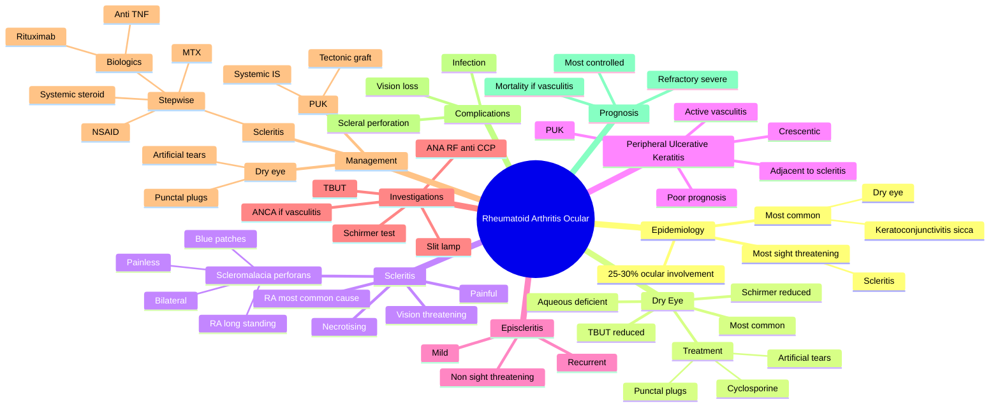

## Learning Objectives

- [ ] List the ocular manifestations of rheumatoid arthritis (keratoconjunctivitis sicca is most common; scleritis is the most sight-threatening).
- [ ] Differentiate episcleritis (mild, self-limiting) from scleritis (severe, painful, vision-threatening) on examination.
- [ ] Recognise necrotising anterior scleritis with scleral melt / perforation as an ophthalmic emergency.
- [ ] Describe peripheral ulcerative keratitis (PUK) and its association with active systemic vasculitis.
- [ ] Outline the management of RA-associated ocular disease: topical/systemic steroids, immunosuppression, biologics (rituximab, anti-TNF).

---

# Ocular Manifestations of Rheumatoid Arthritis

Related: [[Dry Eye Disease]], [[Scleritis]], [[Peripheral Ulcerative Keratitis]]

> [!tip] **FCPS/MRCP Priority: MEDIUM**
> Dry eye (most common), scleritis, peripheral ulcerative keratitis. Scleritis = severe, may need systemic immunosuppression.

---

## 1. Ocular Manifestations

- **Keratoconjunctivitis sicca** (most common, 25–30%)
- **Scleritis** (necrotizing — vision/life-threatening)
- **Peripheral ulcerative keratitis (PUK)**
- Episcleritis
- Uveitis (rare)
- Retinal vasculitis (rare)

---

## 2. Scleritis

- Severe, boring pain, wakes from sleep
- Globe tenderness
- Scleral oedema, injection (deep, violaceous)
- **Anterior:** Diffuse, nodular, necrotizing
- **Posterior:** Less common, exudative RD

### Associations
- RA (most common systemic)
- GPA (Wegener)
- SLE
- IBD
- Polyarteritis
- Relapsing polychondritis
- **Necrotizing scleritis = active systemic disease**

### Management
- **Systemic NSAID** (mild)
- **Systemic steroid** (moderate)
- **Immunosuppression:** MTX, azathioprine, cyclophosphamide, biologics (rituximab, tocilizumab)
- Treat underlying RA aggressively

---

## 3. Peripheral Ulcerative Keratitis (PUK)

- Crescent-shaped marginal corneal ulcer
- **Risk of perforation**
- Strongly associated with RA, GPA
- May be life-threatening (RA + PUK = vasculitis)
- **Systemic immunosuppression** essential

---

## 4. FCPS/MRCP Summary

| Feature | Notes |
|---------|-------|
| Dry eye | Most common |
| Scleritis | Severe, RA association |
| PUK | Perforation risk |
| Treatment | Topical (mild) → systemic (severe) |

---

## 5. Viva Questions

1. **Q:** What is the significance of PUK in RA?
   **A:** Marker of active vasculitis; can perforate; may be life-threatening.

---

## Summary

RA causes dry eye, scleritis, PUK. Scleritis is the most severe — pain out of proportion, marker of systemic vasculitis. Treat with systemic immunosuppression.

## MCQs (10)

**1. The most common ocular manifestation of rheumatoid arthritis is:**
A. Scleritis
B. Keratoconjunctivitis sicca (dry eye)
C. Peripheral ulcerative keratitis
D. Cataract
E. Uveitis
**Answer: B** — Dry eye (keratoconjunctivitis sicca) is the most common ocular manifestation of RA (~25-30%).

**2. The most sight-threatening ocular manifestation of RA is:**
A. Dry eye
B. Scleritis (especially necrotising)
C. Cataract
D. Conjunctivitis
E. Blepharitis
**Answer: B** — Scleritis (especially necrotising) is the most sight-threatening ocular manifestation.

**3. Peripheral ulcerative keratitis (PUK) in RA is most often associated with:**
A. Long disease duration
B. Active systemic vasculitis
C. Mild disease
D. Negative rheumatoid factor
E. Isolated finding
**Answer: B** — PUK in RA is associated with active systemic vasculitis; signals poor prognosis.

**4. The classic histological finding of RA-associated scleritis is:**
A. Granulomatous inflammation
B. Necrotising vasculitis of scleral vessels
C. Lymphocytic infiltration
D. Eosinophilic infiltrate
E. Amyloid deposition
**Answer: B** — RA scleritis: immune complex-mediated necrotising vasculitis of scleral vessels.

**5. Episcleritis in RA is:**
A. Sight-threatening
B. Always necrotising
C. Mild, recurrent, non-sight-threatening
D. Requires systemic immunosuppression
E. Indicative of disease flare
**Answer: C** — Episcleritis in RA is mild, recurrent, non-sight-threatening.

**6. The first-line treatment of severe RA-associated scleritis is:**
A. Topical steroid
B. Systemic NSAID → systemic steroid → immunosuppressant
C. Observation
D. Vitrectomy
E. Topical antibiotic
**Answer: B** — Stepwise: NSAID → systemic steroid → immunosuppressant (MTX, cyclophosphamide) → biologic.

**7. Dry eye (keratoconjunctivitis sicca) in RA is treated with:**
A. Topical antibiotic
B. Artificial tears (preservative-free), punctal plugs, cyclosporine drops, systemic immunosuppression if severe
C. Vitrectomy
D. LASIK
E. Cataract surgery
**Answer: B** — Standard DED ladder: artificial tears → punctal plugs → cyclosporine → systemic IS if severe.

**8. The most feared complication of RA-associated scleritis is:**
A. Cataract
B. Scleral perforation
C. Conjunctivitis
D. Stye
E. Pinguecula
**Answer: B** — Scleral perforation is the most feared complication; can lead to endophthalmitis.

**9. Methotrexate in RA-associated scleritis is used as:**
A. Topical eye drop
B. Single-dose IV
C. Oral weekly DMARD; steroid-sparing
D. Once-monthly injection
E. Sub-Tenon's injection
**Answer: C** — Methotrexate is the first-line oral DMARD for RA and is steroid-sparing in ocular RA.

**10. Rituximab (anti-CD20) is used in RA-associated ocular disease:**
A. Topical
B. First-line for all
C. In refractory disease (after failure of MTX and anti-TNF)
D. Never
E. As monotherapy in all cases
**Answer: C** — Rituximab is used in refractory RA ocular disease, particularly scleritis, after failure of conventional therapy.

## SBA Questions (10)

**1. A 60-year-old woman with long-standing RA presents with severe boring pain in the eye, scleral oedema, and scleral thinning. The most likely diagnosis is:**
**Answer:** Necrotising anterior scleritis associated with RA

**2. The most appropriate systemic therapy for necrotising RA scleritis is:**
**Answer:** High-dose systemic corticosteroid + cyclophosphamide (or rituximab); biologic (anti-TNF)

**3. A 55-year-old with RA presents with crescent-shaped peripheral corneal ulceration adjacent to scleritis. The most likely diagnosis is:**
**Answer:** Peripheral ulcerative keratitis (PUK)

**4. PUK in RA is most often associated with:**
**Answer:** Active systemic vasculitis (poor prognostic sign)

**5. A 50-year-old with RA has severe dry eye not responding to artificial tears. The next step in management is:**
**Answer:** Topical cyclosporine 0.05% or punctal plugs

**6. The most common cause of visual morbidity in RA is:**
**Answer:** Scleritis (especially necrotising) — the most sight-threatening ocular manifestation

**7. A patient with RA and scleromalacia perforans is examined. The most likely appearance is:**
**Answer:** Painless progressive bilateral scleral thinning with visible underlying choroid (blue patches)

**8. The most appropriate systemic DMARD for long-term management of RA-associated ocular disease is:**
**Answer:** Methotrexate (first-line DMARD); alternative: sulfasalazine, leflunomide, biologics

**9. Topical steroid alone is sufficient for:**
**Answer:** Anterior uveitis component / dry eye / episcleritis — but NEVER for scleritis (which is deep)

**10. A patient with RA and active scleritis is found to have a low complement (C3, C4) and high RF titre. The most likely pathology is:**
**Answer:** Immune-complex deposition in scleral vessels (Type III hypersensitivity)

## Flashcards

- **Q:** Most common ocular manifestation of rheumatoid arthritis?
  **A:** Keratoconjunctivitis sicca (dry eye) — affects 25–30% of RA patients (secondary Sjögren's).
- **Q:** Significance of scleritis in RA?
  **A:** Marker of active systemic vasculitis; necrotizing scleritis is vision- and life-threatening; requires systemic immunosuppression.
- **Q:** What is peripheral ulcerative keratitis (PUK) and its risk?
  **A:** Crescent-shaped marginal corneal ulcer in RA/GPA — risk of corneal perforation; signifies vasculitis; may be life-threatening.
- **Q:** First-line management of severe scleritis in RA?
  **A:** Systemic immunosuppression — methotrexate or cyclophosphamide ± systemic steroid; treat underlying RA aggressively.

---

## Answer Key with Explanations

### MCQs
1. **B** — Dry eye (keratoconjunctivitis sicca) is the most common ocular manifestation of RA (~25-30%).
2. **B** — Scleritis (especially necrotising) is the most sight-threatening ocular manifestation.
3. **B** — PUK in RA is associated with active systemic vasculitis; signals poor prognosis.
4. **B** — RA scleritis: immune complex-mediated necrotising vasculitis of scleral vessels.
5. **C** — Episcleritis in RA is mild, recurrent, non-sight-threatening.
6. **B** — Stepwise: NSAID → systemic steroid → immunosuppressant (MTX, cyclophosphamide) → biologic.
7. **B** — Standard DED ladder: artificial tears → punctal plugs → cyclosporine → systemic IS if severe.
8. **B** — Scleral perforation is the most feared complication; can lead to endophthalmitis.
9. **C** — Methotrexate is the first-line oral DMARD for RA and is steroid-sparing in ocular RA.
10. **C** — Rituximab is used in refractory RA ocular disease, particularly scleritis, after failure of conventional therapy.

### SBAs
1. Necrotising anterior scleritis associated with RA
2. High-dose systemic corticosteroid + cyclophosphamide (or rituximab); biologic (anti-TNF)
3. Peripheral ulcerative keratitis (PUK)
4. Active systemic vasculitis (poor prognostic sign)
5. Topical cyclosporine 0.05% or punctal plugs
6. Scleritis (especially necrotising) — the most sight-threatening ocular manifestation
7. Painless progressive bilateral scleral thinning with visible underlying choroid (blue patches)
8. Methotrexate (first-line DMARD); alternative: sulfasalazine, leflunomide, biologics
9. Anterior uveitis component / dry eye / episcleritis — but NEVER for scleritis (which is deep)
10. Immune-complex deposition in scleral vessels (Type III hypersensitivity)

### 24-Hour Recall Prompts
- [ ] List the ocular manifestations of RA from common to severe.
- [ ] Define PUK and its significance.
- [ ] Differentiate episcleritis from scleritis clinically.
- [ ] Outline the management of scleritis.
- [ ] State why necrotizing scleritis is vision- and life-threatening.
- [ ] List 5 systemic associations of scleritis.

### Revision Schedule
- [ ] **Day 1** completed (creation + 24h recall)
- [ ] **Day 3** revision completed
- [ ] **Day 7** revision completed
- [ ] **Day 15** revision completed
- [ ] **Day 30** revision completed
- [ ] **Day 90** revision completed

---

## Self-Test Scorecard

| Section | Score /5 |
|---------|----------|
| Understanding: | /10 |
| Recall: | /10 |
| MCQ Performance: | /10 |
| SBA Performance: | /10 |
| Viva Confidence: | /10 |
| Total: | /50 |

> [!tip]
> **Interpretation:** <35 = weak topic, 35-44 = acceptable but insecure, 45+ = strong exam-ready topic.

---

## Exam Answer Modes

### Long Answer Skeleton
1. Definition of RA and ocular involvement
2. Pathophysiology (immune complex, vasculitis)
3. Manifestations: dry eye (KCS), episcleritis, scleritis, PUK
4. Clinical features of each
5. Investigations (Schirmer, ANCA, RF/anti-CCP, ESR/CRP)
6. Differential diagnosis (GPA, SLE, IBD)
7. Management: stepwise, systemic immunosuppression for severe disease
8. Complications and prognosis

### Short Note Skeleton
- Dry eye (most common)
- Scleritis (severe, vasculitis marker)
- PUK (corneal melt, perforation)
- Treatment: systemic immunosuppression for severe

### Viva One-Liners
- **Q:** Most common ocular RA manifestation? → **A:** Keratoconjunctivitis sicca (dry eye).
- **Q:** Scleritis significance? → **A:** Active systemic vasculitis; vision- and life-threatening.
- **Q:** PUK in RA? → **A:** Autoimmune peripheral corneal melt — perforation risk; vasculitis warning.
- **Q:** Episcleritis vs scleritis? → **A:** Episcleritis benign, sectoral, no pain; scleritis deep boring pain, vision-threatening.
- **Q:** Treatment of severe scleritis? → **A:** Systemic immunosuppression (MTX, cyclophosphamide, biologics) + systemic steroid.
- **Q:** Scleritis associations? → **A:** RA (most common), GPA, SLE, IBD, polyarteritis, relapsing polychondritis.

### Ward-Case Discussion Points
- Examine the eye in every RA patient with visual symptoms — distinguish KCS, episcleritis, scleritis
- Ask about systemic symptoms — joint activity, vasculitic features
- Send ANCA if GPA suspected (scleritis ± sinus/lung/renal disease)
- Discuss immunosuppression options (MTX, CYC, biologics) and counsel on side effects
- Coordinate with rheumatology for systemic disease control
- Refer urgently if PUK with thinning/perforation risk

### Last-Night-Before-Exam Sheet
- **Top 5 facts:** Dry eye most common; scleritis = vasculitis marker; PUK = perforation risk; systemic immunosuppression; treat underlying RA
- **3 drug doses:** Methotrexate 15 mg/week PO/SC; cyclophosphamide IV 500–750 mg/m² every 3–4 weeks; rituximab 1 g IV day 1 and day 15
- **2 algorithms:** Stepwise scleritis management; PUK → systemic immunosuppression
- **1 mnemonic:** "Scleritis hurts, episcleritis doesn't" + "PUK + RA = vasculitis"
- **Must-know differential:** GPA (Wegener), SLE, IBD, polyarteritis, sarcoidosis

---

## Mnemonics

1. **"DED = Dry Eye Disease"** — most common ocular manifestation of RA (~25-30%)
2. **"Scleritis = Serious; Scleromalacia = Silent"** — scleromalacia perforans is painless (RA, 'quiet killer')
3. **"PUK = Peripheral Ulcerative Keratitis = Pathognomonic for vasculitis"**
4. **"Stepwise Rx: NSAID → Steroid → MTX → Biologic"** — management ladder for RA ocular disease
5. **"Rituximab = Refractory RA"** — anti-CD20 in refractory RA ocular disease

---

## Mind Map

---

## One-Page Revision Card

| Domain | Key Points |
|---|---|
| Definition | |
| Patient profile | |
| Most common ocular feature | |
| Investigations | |
| First-line management | |
| Severe / refractory management | |
| Most feared complication | |
| Prognosis | |

---

## Spaced Repetition Trackers

| Review Interval | Date | Score (0-5) | Notes |
|-----------------|------|-------------|-------|
| Day 1 | | | |
| Day 3 | | | |
| Day 7 | | | |
| Day 14 | | | |
| Day 30 | | | |
| Day 90 | | | |

## Tags
#medicine #davidson #ophthalmology #RA #fcps #mrcp
