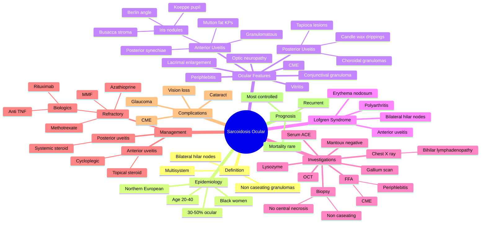

## Learning Objectives

- [ ] List the ocular manifestations of sarcoidosis (uveitis most common; also lacrimal, conjunctival, optic nerve, orbital).
- [ ] Describe the classic signs of granulomatous uveitis: large greasy keratic precipitates ('mutton-fat'), iris nodules (Koeppe, Busacca, Berlin), posterior synechiae.
- [ ] Recognise 'candle-wax drippings' (tapioca, granulomatous chorioretinitis) on fundoscopy.
- [ ] Apply the International Workshop on Ocular Sarcoidosis (IWOS) criteria for diagnosis.
- [ ] Outline first-line treatment: topical steroids; systemic steroids / immunosuppression for posterior segment or refractory disease.

---

# Ocular Sarcoidosis

Related: [[Anterior Uveitis (Iritis)]], [[Posterior Uveitis (Choroiditis)]]

> [!tip] **FCPS/MRCP Priority: MEDIUM**
> Granulomatous uveitis, candle-wax drippings, lacrimal gland enlargement, conjunctival granuloma, facial nerve palsy. CXR, ACE.

---

## 1. Ocular Manifestations

- **Anterior uveitis** (granulomatous, mutton-fat KPs, iris nodules — Koeppe, Busacca, Berlin)
- **Posterior uveitis** (choroiditis, candle-wax drippings, periphlebitis "candle wax drippings")
- **Lacrimal gland enlargement** (keratoconjunctivitis sicca)
- **Conjunctival granuloma**
- **Optic nerve granuloma**
- **VII nerve palsy** (uveoparotid fever — Heerfordt)
- Lacrimal sac, scleral nodules

---

## 2. Diagnosis (IWOS Criteria)

- Bilateral granulomatous uveitis
- Plus 7 signs:
  - Mutton-fat KPs, iris nodules
  - Vitritis, snowballs
  - Multiple chorioretinal lesions
  - Candle-wax drippings
  - NVD/NVE
  - Optic disc/choroidal nodule
  - Macular oedema

### Investigations
- CXR (bilateral hilar lymphadenopathy)
- ACE (elevated)
- Lysozyme
- Serum calcium
- **Biopsy** (conjunctival, lacrimal) — non-caseating granuloma
- Chest CT, gallium scan

---

## 3. Management

- **Topical steroid** (anterior uveitis)
- **Systemic steroid** (posterior, optic nerve)
- **Immunosuppression:** MTX, azathioprine, MMF
- **Biologics** (adalimumab — refractory)
- Treat systemic disease (pulmonary, CNS)
- Cycloplegia

---

## 4. FCPS/MRCP Summary

| Feature | Notes |
|---------|-------|
| Uveitis | Granulomatous, mutton-fat KPs |
| Choroiditis | Candle-wax drippings |
| Lacrimal | KCS |
| Heerfordt | Uveitis + parotid + VII palsy + fever |

---

## 5. Viva Questions

1. **Q:** What is Heerfordt syndrome?
   **A:** Uveitis + parotid enlargement + facial nerve palsy + fever — sarcoidosis.

---

## Summary

Sarcoidosis is a granulomatous multisystem disease with many ocular features: anterior uveitis (granulomatous), choroiditis, candle-wax drippings, lacrimal gland enlargement, conjunctival granuloma. Diagnosis: CXR, ACE, biopsy. Treat with steroids + immunosuppression.

## MCQs (10)

**1. The most common ocular manifestation of sarcoidosis is:**
A. Anterior uveitis
B. Lacrimal gland enlargement
C. Posterior uveitis
D. Conjunctival granuloma
E. Optic neuropathy
**Answer: A** — Anterior uveitis is the most common ocular manifestation of sarcoidosis (~30-50%).

**2. The classic sign of granulomatous uveitis on slit-lamp is:**
A. Fine KPs
B. Large 'mutton-fat' KPs
C. AC cells only
D. Fibrin
E. Pigment dispersion
**Answer: B** — Large 'mutton-fat' KPs are characteristic of granulomatous uveitis (sarcoid, TB, syphilis, VKH).

**3. Iris nodules in sarcoidosis include:**
A. Koeppe (pupillary margin), Busacca (mid-stroma), Berlin (angle)
B. Berlin (cornea), Koeppe (angle), Busacca (pupil)
C. All in posterior segment
D. No iris nodules
E. Only in chronic disease
**Answer: A** — Iris nodules: Koeppe (pupillary margin), Busacca (mid-stroma), Berlin (anterior chamber angle).

**4. The classic posterior segment finding in sarcoidosis is:**
A. Cherry-red spot
B. Tapioca/candle-wax drippings (chorioretinal granulomas)
C. Bone spicules
D. Microaneurysms
E. Cotton-wool spots only
**Answer: B** — Sarcoid chorioretinal granulomas = 'candle-wax drippings' or 'tapioca' lesions.

**5. The IWOS (International Workshop on Ocular Sarcoidosis) criteria include:**
A. Clinical signs + investigation findings + exclusion of other causes
B. Biopsy alone
C. Chest X-ray alone
D. Serum ACE only
E. Skin biopsy only
**Answer: A** — IWOS criteria: clinical signs + lab (ACE, lysozyme, chest X-ray, biopsy) + exclusion of other causes.

**6. Serum ACE is elevated in what percentage of sarcoidosis patients?**
A. 10-20%
B. 30-40%
C. 60-70%
D. 90-100%
E. Always
**Answer: C** — ACE is elevated in 60-70% of sarcoidosis patients; not specific (also TB, diabetes, hyperthyroidism).

**7. The most appropriate biopsy site to confirm sarcoidosis is:**
A. Conjunctival granuloma (if present)
B. Skin lesion
C. Lacrimal gland (if enlarged)
D. Transbronchial lung biopsy
E. Any accessible granulomatous tissue
**Answer: E** — Biopsy of any accessible granulomatous tissue (conjunctival, lacrimal, skin, lung) showing non-caseating granulomas.

**8. Löfgren syndrome (acute sarcoidosis) includes all EXCEPT:**
A. Erythema nodosum
B. Bilateral hilar lymphadenopathy
C. Anterior uveitis
D. Migratory polyarthritis
E. Optic neuritis
**Answer: E** — Löfgren: erythema nodosum + bilateral hilar nodes + polyarthritis + anterior uveitis.

**9. First-line treatment of ocular sarcoidosis is:**
A. Topical steroid + cycloplegic for anterior uveitis
B. Systemic steroid if posterior uveitis
C. Immunosuppression if refractory
D. All of the above (stepwise)
E. Vitrectomy only
**Answer: D** — Stepwise: topical + cycloplegic for anterior; systemic steroid for posterior; immunosuppression for refractory.

**10. The most appropriate second-line immunosuppressant for refractory ocular sarcoidosis is:**
A. Cyclophosphamide
B. Methotrexate
C. Rituximab
D. Azathioprine
E. All (options considered depending on disease)
**Answer: B** — Methotrexate is the most commonly used steroid-sparing agent in ocular sarcoidosis.

## SBA Questions (10)

**1. A 35-year-old black woman presents with bilateral hilar lymphadenopathy, erythema nodosum, and bilateral anterior uveitis. The most likely diagnosis is:**
**Answer:** Acute sarcoidosis (Löfgren syndrome)

**2. The most characteristic slit-lamp finding in sarcoid uveitis is:**
**Answer:** Large 'mutton-fat' keratic precipitates + iris nodules (Koeppe, Busacca)

**3. A sarcoid patient has creamy-yellow chorioretinal lesions along the inferior periphery. The most likely appearance is:**
**Answer:** Tapioca or 'candle-wax dripping' chorioretinal granulomas

**4. The most appropriate investigation to support ocular sarcoidosis diagnosis is:**
**Answer:** Chest X-ray (bilateral hilar lymphadenopathy) ± serum ACE, lysozyme, gallium scan, biopsy

**5. The histological hallmark of sarcoidosis on biopsy is:**
**Answer:** Non-caseating granulomas (no central necrosis)

**6. A 40-year-old with bilateral hilar lymphadenopathy and anterior uveitis has a positive Mantoux test. The most appropriate next step is:**
**Answer:** Distinguish sarcoidosis from TB (QuantiFERON-TB Gold; sputum; biopsy if possible) — do not assume sarcoid without excluding TB

**7. The first-line treatment of anterior uveitis in sarcoidosis is:**
**Answer:** Topical steroid (prednisolone acetate 1% hourly) + cycloplegic (atropine 1% or cyclopentolate 1%)

**8. Posterior uveitis in sarcoidosis requires treatment with:**
**Answer:** Systemic corticosteroid (prednisolone 0.5-1 mg/kg/day) ± immunosuppression

**9. The most common immunosuppressant used as steroid-sparing in ocular sarcoidosis is:**
**Answer:** Methotrexate (alternative: azathioprine, mycophenolate, biologics)

**10. Sarcoidosis-associated optic neuropathy is treated with:**
**Answer:** High-dose systemic corticosteroid ± IV methylprednisolone for vision-threatening disease

## Flashcards

- **Q:** What is Heerfordt syndrome?
  **A:** Uveitis + parotid gland enlargement + facial (VII) nerve palsy + fever — classic feature of sarcoidosis.
- **Q:** What are "candle-wax drippings" in sarcoidosis?
  **A:** Periphlebitis with yellow-white perivenous exudates — characteristic of ocular sarcoidosis.
- **Q:** What KPs and iris nodules are seen in sarcoid uveitis?
  **A:** Granulomatous — large "mutton-fat" KPs; Koeppe (pupil margin) and Busacca (iris surface) iris nodules.
- **Q:** First-line investigations in suspected ocular sarcoidosis?
  **A:** CXR (bilateral hilar lymphadenopathy), serum ACE, lysozyme, calcium; biopsy (conjunctival/lacrimal) for non-caseating granulomas.

---

## Answer Key with Explanations

### MCQs
1. **A** — Anterior uveitis is the most common ocular manifestation of sarcoidosis (~30-50%).
2. **B** — Large 'mutton-fat' KPs are characteristic of granulomatous uveitis (sarcoid, TB, syphilis, VKH).
3. **A** — Iris nodules: Koeppe (pupillary margin), Busacca (mid-stroma), Berlin (anterior chamber angle).
4. **B** — Sarcoid chorioretinal granulomas = 'candle-wax drippings' or 'tapioca' lesions.
5. **A** — IWOS criteria: clinical signs + lab (ACE, lysozyme, chest X-ray, biopsy) + exclusion of other causes.
6. **C** — ACE is elevated in 60-70% of sarcoidosis patients; not specific (also TB, diabetes, hyperthyroidism).
7. **E** — Biopsy of any accessible granulomatous tissue (conjunctival, lacrimal, skin, lung) showing non-caseating granulomas.
8. **E** — Löfgren: erythema nodosum + bilateral hilar nodes + polyarthritis + anterior uveitis.
9. **D** — Stepwise: topical + cycloplegic for anterior; systemic steroid for posterior; immunosuppression for refractory.
10. **B** — Methotrexate is the most commonly used steroid-sparing agent in ocular sarcoidosis.

### SBAs
1. Acute sarcoidosis (Löfgren syndrome)
2. Large 'mutton-fat' keratic precipitates + iris nodules (Koeppe, Busacca)
3. Tapioca or 'candle-wax dripping' chorioretinal granulomas
4. Chest X-ray (bilateral hilar lymphadenopathy) ± serum ACE, lysozyme, gallium scan, biopsy
5. Non-caseating granulomas (no central necrosis)
6. Distinguish sarcoidosis from TB (QuantiFERON-TB Gold; sputum; biopsy if possible) — do not assume sarcoid without excluding TB
7. Topical steroid (prednisolone acetate 1% hourly) + cycloplegic (atropine 1% or cyclopentolate 1%)
8. Systemic corticosteroid (prednisolone 0.5-1 mg/kg/day) ± immunosuppression
9. Methotrexate (alternative: azathioprine, mycophenolate, biologics)
10. High-dose systemic corticosteroid ± IV methylprednisolone for vision-threatening disease

### 24-Hour Recall Prompts
- [ ] Define Heerfordt syndrome.
- [ ] List the IWOS criteria for ocular sarcoidosis.
- [ ] Describe candle-wax drippings and periphlebitis in sarcoid.
- [ ] State the typical KPs and iris nodules in sarcoid uveitis.
- [ ] Outline first-line investigation (CXR, ACE, biopsy).
- [ ] Outline stepwise management (topical → systemic → immunosuppression → biologics).

### Revision Schedule
- [ ] **Day 1** completed (creation + 24h recall)
- [ ] **Day 3** revision completed
- [ ] **Day 7** revision completed
- [ ] **Day 15** revision completed
- [ ] **Day 30** revision completed
- [ ] **Day 90** revision completed

---

## Self-Test Scorecard

| Section | Score /5 |
|---------|----------|
| Understanding: | /10 |
| Recall: | /10 |
| MCQ Performance: | /10 |
| SBA Performance: | /10 |
| Viva Confidence: | /10 |
| Total: | /50 |

> [!tip]
> **Interpretation:** <35 = weak topic, 35-44 = acceptable but insecure, 45+ = strong exam-ready topic.

---

## Exam Answer Modes

### Long Answer Skeleton
1. Definition and epidemiology of sarcoidosis
2. Pathophysiology (non-caseating granulomas, Th1-mediated)
3. Ocular manifestations (anterior uveitis, choroiditis, candle-wax, lacrimal, optic nerve, Heerfordt)
4. IWOS diagnostic criteria
5. Investigations (CXR, ACE, lysozyme, biopsy, CT, gallium)
6. Differential diagnosis (TB, syphilis, Behçet, VKH)
7. Management: topical → systemic → immunosuppression → biologics
8. Complications and prognosis

### Short Note Skeleton
- Definition + bilateral granulomatous uveitis
- IWOS criteria (1 + 7 signs)
- Candle-wax drippings and periphlebitis
- Stepwise management

### Viva One-Liners
- **Q:** Heerfordt syndrome? → **A:** Uveitis + Parotid + Facial palsy + Fever.
- **Q:** What KPs in sarcoid uveitis? → **A:** Mutton-fat (granulomatous) with iris nodules (Koeppe, Busacca).
- **Q:** What are candle-wax drippings? → **A:** Periphlebitis with yellow-white perivenous exudates — characteristic of sarcoidosis.
- **Q:** First-line investigation? → **A:** CXR (bilateral hilar lymphadenopathy), ACE.
- **Q:** Treatment of ocular sarcoidosis? → **A:** Topical steroid (anterior) → systemic steroid → immunosuppression (MTX, AZA) → biologics (adalimumab).

### Ward-Case Discussion Points
- Examine both eyes carefully (bilateral disease is the norm)
- Look for parotid enlargement, facial palsy (Heerfordt), skin lupus pernio
- Send CXR, ACE, lysozyme, calcium, LFTs
- Discuss tissue biopsy (conjunctival/lacrimal granuloma) if diagnosis uncertain
- Counsel on chronicity — sarcoidosis often relapses
- Coordinate with respiratory/medical teams for systemic disease

### Last-Night-Before-Exam Sheet
- **Top 5 facts:** Granulomatous uveitis (mutton-fat KPs); candle-wax drippings; Heerfordt (UPFF); CXR (BHL); biopsy (non-caseating)
- **3 drug doses:** Prednisolone 1 mg/kg PO OD; methotrexate 15 mg/week PO/SC; adalimumab 40 mg SC every 2 weeks
- **2 algorithms:** IWOS diagnostic criteria; treatment step-up
- **1 mnemonic:** Heerfordt = UPFF (Uveitis Parotid Facial palsy Fever)
- **Must-know differential:** TB (caseating), syphilis (granulomatous), HLA-B27 (non-granulomatous), Behçet, VKH

---

## Mnemonics

1. **"Mutton-fat = Granulomatous"** — large KPs suggest sarcoid, TB, syphilis, VKH
2. **"Koeppe + Busacca + Berlin = Iris nodules"** — sarcoid, TB, syphilis
3. **"Löfgren = Lungs + Lymph nodes + Lytic lesions + Lots of erythema nodosum"** — acute sarcoid
4. **"ACE 60-70%"** — not specific, not always positive
5. **"IWOS = International Workshop on Ocular Sarcoidosis"** — diagnostic criteria

---

## Mind Map

---

## One-Page Revision Card

| Domain | Key Points |
|---|---|
| Definition | |
| Patient profile | |
| Most common ocular feature | |
| Investigations | |
| First-line management | |
| Severe / refractory management | |
| Most feared complication | |
| Prognosis | |

---

## Spaced Repetition Trackers

| Review Interval | Date | Score (0-5) | Notes |
|-----------------|------|-------------|-------|
| Day 1 | | | |
| Day 3 | | | |
| Day 7 | | | |
| Day 14 | | | |
| Day 30 | | | |
| Day 90 | | | |

## Tags
#medicine #davidson #ophthalmology #sarcoidosis #fcps #mrcp
