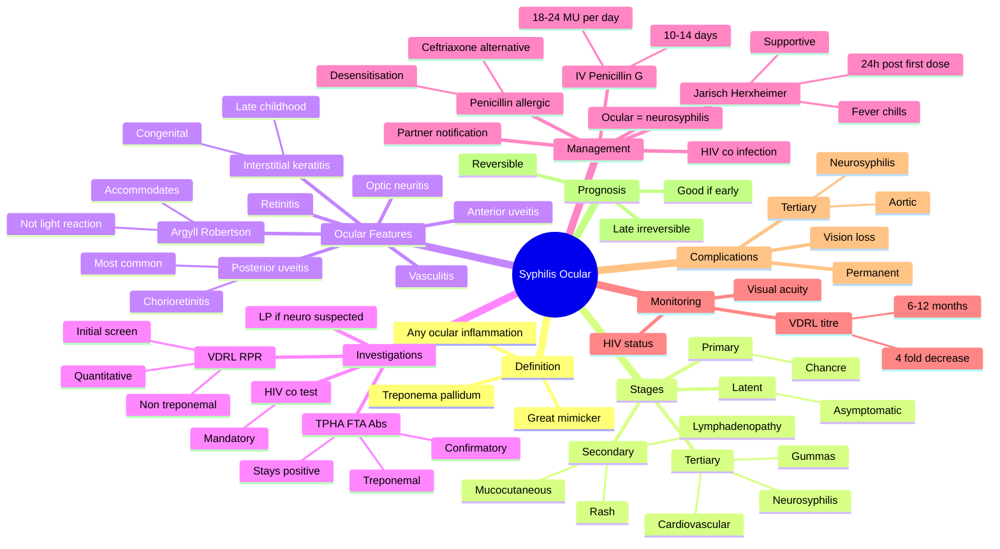

## Learning Objectives

- [ ] List ocular syphilis manifestations by stage: interstitial keratitis (congenital), granulomatous uveitis, chorioretinitis, optic neuritis, Argyll Robertson pupil.
- [ ] Recognise the great mimicker: ocular syphilis can mimic any ocular inflammation — always test syphilis serology in unexplained uveitis.
- [ ] Interpret syphilis serology (VDRL/RPR, TPHA/FTA-Abs, EIA) and the meaning of discordant results.
- [ ] Outline treatment: IV crystalline penicillin G 18-24 MU/day for 10-14 days (neurosyphilis dosing) for ocular syphilis.
- [ ] Counsel on Jarisch-Herxheimer reaction, partner notification, and HIV co-testing.

---

# Ocular Syphilis

Related: [[Argyll Robertson Pupil]], [[Anterior Uveitis (Iritis)]]

> [!tip] **FCPS/MRCP Priority: MEDIUM**
> Great mimicker. Uveitis, chorioretinitis, optic atrophy, Argyll Robertson. Always test syphilis in uveitis. Penicillin.

---

## 1. Ocular Manifestations

### Any Stage of Syphilis
- **Anterior uveitis** (granulomatous)
- **Posterior uveitis / chorioretinitis** (placoid, multifocal)
- **Optic neuritis, optic atrophy**
- **Argyll Robertson pupil** (neurosyphilis — irregular, no light, normal near)
- **Vitritis, retinal vasculitis**
- **Interstitial keratitis** (congenital — Hutchinson's triad)
- **Madarosis** (loss of lashes in secondary)

### Congenital
- **Interstitial keratitis** (50% of late congenital)
- **Hutchinson teeth, saddle nose, sabre shins**
- **Salt and pepper fundus**

---

## 2. Diagnosis

- **VDRL / RPR** (screening, non-treponemal)
- **TPHA / FTA-Abs** (confirmation, treponemal)
- **HIV co-test** (often coexist)
- CSF (neurosyphilis — VDRL)

---

## 3. Management

- **Penicillin G** (benzathine for early, IV for late/neurosyphilis)
- Jarisch-Herxheimer reaction
- Treat all sexual partners

---

## 4. FCPS/MRCP Summary

| Feature | Notes |
|---------|-------|
| Uveitis | Granulomatous |
| Chorioretinitis | Multifocal placoid |
| Argyll Robertson | Neurosyphilis |
| Interstitial keratitis | Congenital |

---

## 5. Viva Questions

1. **Q:** Why is syphilis called the great mimicker in ophthalmology?
   **A:** Can mimic any ocular inflammation — uveitis, optic neuritis, chorioretinitis, scleritis, etc.

---

## Summary

Ocular syphilis is a great mimicker. Test for syphilis in any uveitis. Argyll Robertson pupil in neurosyphilis. Treat with penicillin.

## MCQs (10)

**1. Ocular syphilis can mimic which of the following?**
A. Anterior uveitis only
B. Any ocular inflammation (great mimicker)
C. Posterior uveitis only
D. Conjunctivitis only
E. Keratitis only
**Answer: B** — Syphilis is the 'great mimicker' — can present as any ocular inflammation.

**2. The most common ocular manifestation of syphilis is:**
A. Anterior uveitis
B. Posterior uveitis (chorioretinitis)
C. Interstitial keratitis
D. Optic neuritis
E. Argyll Robertson pupil
**Answer: B** — Posterior uveitis (chorioretinitis) is the most common ocular manifestation.

**3. Interstitial keratitis in congenital syphilis typically presents:**
A. At birth
B. In infancy
C. Between ages 5-20 (late 'stigmata')
D. Only in adults
E. Never
**Answer: C** — Interstitial keratitis in congenital syphilis presents in late childhood/adolescence (5-25).

**4. The Argyll Robertson pupil is characterised by:**
A. Dilated, fixed pupil
B. Accommodates but does not react
C. Reacts but does not accommodate
D. Both lost
E. Normal
**Answer: B** — Argyll Robertson: small, irregular pupil that accommodates but does NOT react to light (prostitute's pupil).

**5. The first-line treatment of ocular syphilis is:**
A. Topical steroid
B. Benzathine penicillin IM single dose
C. IV crystalline penicillin G 18-24 MU/day for 10-14 days
D. Oral doxycycline
E. Topical antibiotic
**Answer: C** — Ocular syphilis is treated as neurosyphilis: IV crystalline penicillin G 18-24 MU/day for 10-14 days.

**6. The most appropriate initial serological test for syphilis is:**
A. TPHA
B. VDRL/RPR (non-treponemal)
C. FTA-Abs
D. EIA
E. PCR
**Answer: B** — VDRL/RPR is the initial non-treponemal screening test; positive then confirmed with treponemal (TPHA/FTA-Abs).

**7. A positive VDRL but negative TPHA most likely indicates:**
A. Active syphilis
B. Past treated syphilis
C. False positive (pregnancy, SLE, viral illness, etc.)
D. Neurosyphilis
E. Late syphilis
**Answer: C** — Isolated VDRL positive with negative TPHA is most often a false positive; repeat and consider alternative causes.

**8. The Jarisch-Herxheimer reaction is:**
A. Anaphylaxis to penicillin
B. Acute fever, chills, hypotension after first dose of penicillin (due to spirochaete lysis)
C. Allergic dermatitis
D. Severe liver toxicity
E. Renal failure
**Answer: B** — Jarisch-Herxheimer: acute febrile reaction within 24 h of first penicillin dose, due to spirochaete lysis; self-limiting but can be severe.

**9. Co-testing for which infection is MANDATORY in any patient with new syphilis diagnosis?**
A. Hepatitis B
B. Hepatitis C
C. HIV
D. TB
E. Gonorrhoea
**Answer: C** — HIV co-testing is mandatory in all patients with new syphilis diagnosis (high co-infection rate, alters management).

**10. Ocular syphilis treatment failure is best detected by:**
A. Symptom resolution alone
B. Repeat VDRL titre 4-fold decrease over 6-12 months
C. Visual field
D. OCT only
E. Clinical only
**Answer: B** — Treatment response: ≥4-fold (2 dilution) decrease in VDRL titre over 6-12 months.

## SBA Questions (10)

**1. A 30-year-old presents with bilateral anterior uveitis, positive VDRL, and positive TPHA. The most likely diagnosis is:**
**Answer:** Ocular syphilis (secondary)

**2. The most appropriate treatment is:**
**Answer:** IV crystalline penicillin G 18-24 MU/day for 10-14 days (neurosyphilis regimen)

**3. The patient develops fever, chills, and hypotension 6 hours after the first dose of penicillin. The most likely reaction is:**
**Answer:** Jarisch-Herxheimer reaction

**4. The most appropriate management of Jarisch-Herxheimer reaction is:**
**Answer:** Continue penicillin; supportive care (paracetamol, fluids, monitor); usually self-limiting within 24 hours

**5. A 40-year-old with newly diagnosed syphilis should also be tested for:**
**Answer:** HIV (mandatory), hepatitis B/C, other STIs (gonorrhoea, chlamydia)

**6. A patient with congenital syphilis presents with bilateral interstitial keratitis at age 15. The most appropriate treatment is:**
**Answer:** Topical steroid + cycloplegic; systemic penicillin (in consultation with infectious disease)

**7. The Argyll Robertson pupil is pathognomonic of:**
**Answer:** Neurosyphilis (tertiary)

**8. The most common ocular manifestation of late (tertiary) syphilis is:**
**Answer:** Optic atrophy + Argyll Robertson pupil

**9. Treatment success in early syphilis is judged by:**
**Answer:** ≥4-fold decrease in VDRL titre within 6-12 months

**10. Partner notification is required in all patients with syphilis. The minimum time for contact tracing is:**
**Answer:** Depends on stage: 3 months for primary, 2 years for early latent, longer for late latent; partners in last 3-12 months should be tested/treated

## Flashcards

- **Q:** Why is syphilis called the "great mimicker"?
  **A:** Ocular syphilis can mimic almost any ocular inflammation — uveitis, optic neuritis, chorioretinitis, scleritis, interstitial keratitis.
- **Q:** What is the Argyll Robertson pupil?
  **A:** Neurosyphilis pupil — irregular, small, accommodates but does **not** react to light ("prostitute's pupil": accommodates but does not react).
- **Q:** Which screening and confirmatory tests for syphilis?
  **A:** VDRL/RPR (non-treponemal, screening); TPHA/FTA-Abs (treponemal, confirmation).
- **Q:** Treatment of ocular/neurosyphilis?
  **A:** IV benzylpenicillin (Penicillin G) 18–24 MU/day for 10–14 days; monitor for Jarisch-Herxheimer reaction.

---

## Answer Key with Explanations

### MCQs
1. **B** — Syphilis is the 'great mimicker' — can present as any ocular inflammation.
2. **B** — Posterior uveitis (chorioretinitis) is the most common ocular manifestation.
3. **C** — Interstitial keratitis in congenital syphilis presents in late childhood/adolescence (5-25).
4. **B** — Argyll Robertson: small, irregular pupil that accommodates but does NOT react to light (prostitute's pupil).
5. **C** — Ocular syphilis is treated as neurosyphilis: IV crystalline penicillin G 18-24 MU/day for 10-14 days.
6. **B** — VDRL/RPR is the initial non-treponemal screening test; positive then confirmed with treponemal (TPHA/FTA-Abs).
7. **C** — Isolated VDRL positive with negative TPHA is most often a false positive; repeat and consider alternative causes.
8. **B** — Jarisch-Herxheimer: acute febrile reaction within 24 h of first penicillin dose, due to spirochaete lysis; self-limiting but can be severe.
9. **C** — HIV co-testing is mandatory in all patients with new syphilis diagnosis (high co-infection rate, alters management).
10. **B** — Treatment response: ≥4-fold (2 dilution) decrease in VDRL titre over 6-12 months.

### SBAs
1. Ocular syphilis (secondary)
2. IV crystalline penicillin G 18-24 MU/day for 10-14 days (neurosyphilis regimen)
3. Jarisch-Herxheimer reaction
4. Continue penicillin; supportive care (paracetamol, fluids, monitor); usually self-limiting within 24 hours
5. HIV (mandatory), hepatitis B/C, other STIs (gonorrhoea, chlamydia)
6. Topical steroid + cycloplegic; systemic penicillin (in consultation with infectious disease)
7. Neurosyphilis (tertiary)
8. Optic atrophy + Argyll Robertson pupil
9. ≥4-fold decrease in VDRL titre within 6-12 months
10. Depends on stage: 3 months for primary, 2 years for early latent, longer for late latent; partners in last 3-12 months should be tested/treated

### 24-Hour Recall Prompts
- [ ] Define the Argyll Robertson pupil and its clinical significance.
- [ ] List the ocular manifestations of syphilis by stage.
- [ ] State the screening and confirmatory tests for syphilis.
- [ ] Outline the treatment of ocular/neurosyphilis.
- [ ] Explain why ocular syphilis is the "great mimicker."
- [ ] List the components of Hutchinson's triad.

### Revision Schedule
- [ ] **Day 1** completed (creation + 24h recall)
- [ ] **Day 3** revision completed
- [ ] **Day 7** revision completed
- [ ] **Day 15** revision completed
- [ ] **Day 30** revision completed
- [ ] **Day 90** revision completed

---

## Self-Test Scorecard

| Section | Score /5 |
|---------|----------|
| Understanding: | /10 |
| Recall: | /10 |
| MCQ Performance: | /10 |
| SBA Performance: | /10 |
| Viva Confidence: | /10 |
| Total: | /50 |

> [!tip]
> **Interpretation:** <35 = weak topic, 35-44 = acceptable but insecure, 45+ = strong exam-ready topic.

---

## Exam Answer Modes

### Long Answer Skeleton
1. Definition and microbiology of *Treponema pallidum*
2. Epidemiology and stages (primary, secondary, tertiary, congenital)
3. Ocular manifestations by stage (interstitial keratitis, uveitis, chorioretinitis, optic atrophy, ARP)
4. Diagnosis: serology (VDRL/RPR, TPHA/FTA-Abs), CSF (neurosyphilis)
5. Differential diagnosis (TB, sarcoidosis, Behçet, VKH)
6. Management: penicillin (IM benzathine vs IV crystalline); Jarisch-Herxheimer reaction
7. Complications (optic atrophy, blindness) and prognosis
8. Partner notification, public health, HIV co-testing

### Short Note Skeleton
- Ocular syphilis = great mimicker
- VDRL screening + TPHA/FTA-Abs confirmation
- ARP = neurosyphilis
- Treatment: Penicillin (IV for ocular/neurosyphilis)

### Viva One-Liners
- **Q:** Argyll Robertson pupil? → **A:** Irregular, small, accommodates but does not react to light = neurosyphilis.
- **Q:** Why "great mimicker"? → **A:** Can mimic any ocular inflammation — uveitis, optic neuritis, chorioretinitis, scleritis.
- **Q:** VDRL vs TPHA? → **A:** VDRL/RPR = screening (non-treponemal); TPHA/FTA-Abs = confirmation (treponemal).
- **Q:** Treatment of ocular syphilis? → **A:** IV benzylpenicillin 18–24 MU/day × 10–14 days (neurosyphilis regimen).
- **Q:** Hutchinson's triad? → **A:** Hutchinson teeth + interstitial keratitis + VIII nerve deafness (congenital syphilis).
- **Q:** Jarisch-Herxheimer reaction? → **A:** Acute fever, headache, myalgia within hours of starting penicillin; treat supportively with antipyretics.

### Ward-Case Discussion Points
- Always test for syphilis in unexplained uveitis (anterior or posterior)
- Co-test for HIV (frequent co-infection)
- Examine pupils carefully — look for ARP
- Discuss partner notification and contact tracing
- Counsel on completion of the full penicillin course
- Monitor for Jarisch-Herxheimer reaction after first dose

### Last-Night-Before-Exam Sheet
- **Top 5 facts:** Great mimicker; ARP = neurosyphilis; VDRL/TPHA testing; IV penicillin for ocular; Hutchinson triad (congenital)
- **3 drug doses:** IV benzylpenicillin 18–24 MU/day × 10–14 days; IM benzathine penicillin 2.4 MU weekly; probenecid 500 mg QID (alternative)
- **2 algorithms:** Syphilis serology interpretation; treatment by stage
- **1 mnemonic:** ARP = "Accommodates, doesn't React" (prostitute's pupil)
- **Must-know differential:** TB uveitis, sarcoidosis, Behçet, VKH, toxoplasmosis

---

## Mnemonics

1. **"The Great Mimicker"** — syphilis can mimic any ocular inflammation; always test in unexplained uveitis
2. **"VDRL = initial; TPHA = confirm"** — VDRL/RPR for screening, TPHA/FTA-Abs for confirmation
3. **"IV Pen for Ocular"** — treat as neurosyphilis: IV crystalline penicillin 18-24 MU/day for 10-14 days
4. **"Jarisch-Herxheimer = Jolt"** — acute febrile reaction within 24h of first penicillin dose
5. **"Always co-test HIV"** — mandatory in all new syphilis diagnoses

---

## Mind Map

---

## One-Page Revision Card

| Domain | Key Points |
|---|---|
| Definition | |
| Patient profile | |
| Most common ocular feature | |
| Investigations | |
| First-line management | |
| Severe / refractory management | |
| Most feared complication | |
| Prognosis | |

---

## Spaced Repetition Trackers

| Review Interval | Date | Score (0-5) | Notes |
|-----------------|------|-------------|-------|
| Day 1 | | | |
| Day 3 | | | |
| Day 7 | | | |
| Day 14 | | | |
| Day 30 | | | |
| Day 90 | | | |

## Tags
#medicine #davidson #ophthalmology #syphilis #fcps #mrcp
