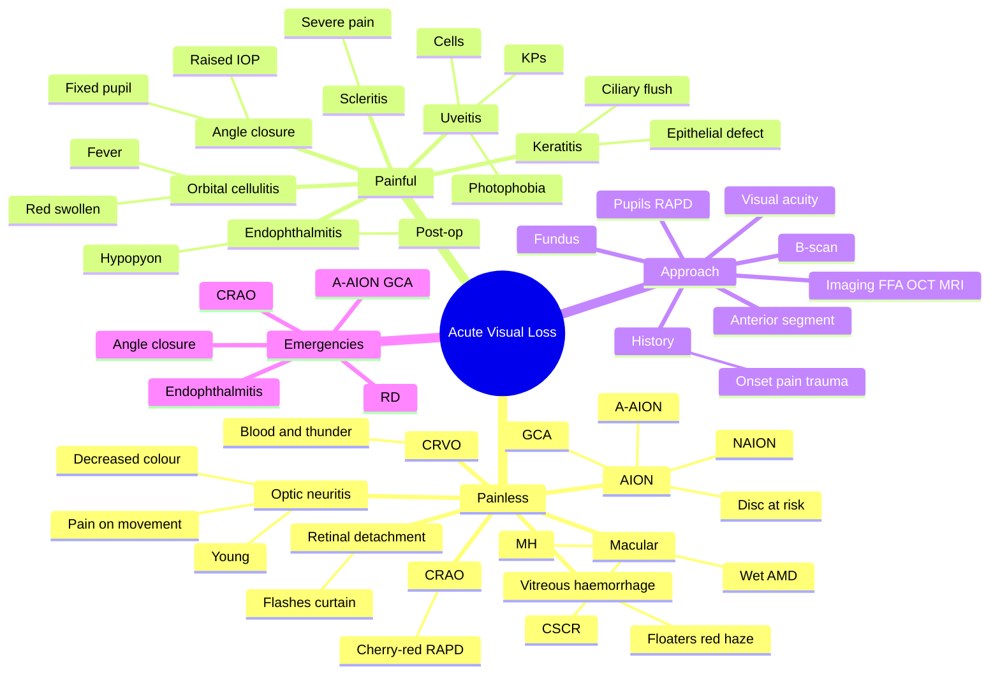

# Acute Visual Loss (Approach)

Related: [[CRAO]], [[Optic Neuritis]], [[Retinal Detachment]], [[Vitreous Haemorrhage]]

> [!tip] **FCPS/MRCP Priority: CRITICAL**
> Painless (Vitreous haemorrhage, retinal detachment, CRAO, CRVO, optic neuritis) vs painful (keratitis, uveitis, AION, endophthalmitis). RAPD + cherry-red = CRAO. Painless + flashes + curtain = RD.

---

## Learning Objectives
- [ ] Differentiate painless from painful acute visual loss
- [ ] Identify the common causes of painless visual loss and their key clues
- [ ] Identify the common causes of painful visual loss and their key clues
- [ ] Apply a structured approach (history, VA, pupils, anterior segment, fundus, B-scan, imaging)
- [ ] Recognise sight-threatening emergencies (CRAO, RD, endophthalmitis, A-AION)
- [ ] Interpret RAPD, cherry-red spot, "blood and thunder" fundus

---

## 1. Definition

- **Acute visual loss:** Significant reduction in visual acuity occurring over seconds to days
- Classified as:
  - **Painless** (most common)
  - **Painful**
  - **Transient** (amaurosis fugax — usually vascular)
- This approach focuses on persistent acute visual loss

---

## 2. Painless Acute Visual Loss

| Cause | Key Clue |
|-------|----------|
| **Vitreous haemorrhage** | Floaters, red haze, sudden ↓VA, often in PDR |
| **Retinal detachment** | Floaters, flashes of light (photopsia), curtain/veil over vision |
| **CRAO** | Sudden, deep, painless loss; cherry-red spot; RAPD; pale retina |
| **CRVO** | "Blood and thunder" fundus (extensive retinal haemorrhages) |
| **Optic neuritis** | Young adult, pain on eye movement, RAPD, ↓colour vision |
| **AION (NAION)** | Altitudinal field defect, "disc at risk" (small C/D) |
| **A-AION (GCA)** | Elderly, headache, jaw claudication, scalp tenderness, ↑ESR/CRP |
| **Macular disease (CSCR, MH, wet AMD)** | Metamorphopsia, central scotoma |
| **Conversion disorder** | Variable, tubular field, inconsistent findings |
| **Toxic/nutritional** | Bilateral, gradual, caecocentral scotoma, dyschromatopsia |
| **Posterior scleritis** | Pain on movement, ± proptosis |

### Key Clues — Painless

- **Cherry-red spot** = CRAO (central retina, pale oedematous retina around it)
- **"Blood and thunder"** = CRVO
- **Flashes + floaters + curtain** = Retinal detachment
- **Floaters + red haze** = Vitreous haemorrhage
- **Disc swelling, ↓colour, pain on EOM** = Optic neuritis
- **Altitudinal, disc at risk** = NAION
- **Elderly + headache + jaw claudication** = A-AION (GCA)
- **Metamorphopsia, central scotoma** = Macular disease (CSCR, MH, wet AMD)

---

## 3. Painful Acute Visual Loss

| Cause | Key Clue |
|-------|----------|
| **Acute keratitis** | Ciliary flush, corneal epithelial defect, infiltrate, photophobia |
| **Acute anterior uveitis** | Pain, photophobia, KPs, cells in AC, ± hypopyon |
| **Acute angle closure** | Halos, fixed mid-dilated pupil, severe ↑IOP, hard eye |
| **Endophthalmitis** | Post-op or penetrating injury, hypopyon, severe pain, ↓VA |
| **Scleritis** | Severe, boring pain, tenderness, scleral injection |
| **Optic neuritis** | Pain on eye movement, ↓colour vision |
| **AION (NAION)** | Often mild ache, altitudinal defect, disc swelling |
| **Orbital cellulitis** | Painful, red, swollen, fever, proptosis |
| **Corneal ulcer / abrasion** | Foreign body sensation, epithelial defect, infiltrate |

### Key Clues — Painful

- **Ciliary flush + KP + cells** = Anterior uveitis
- **Fixed mid-dilated pupil + ↑IOP** = Acute angle closure
- **Post-op + hypopyon + pain** = Endophthalmitis
- **Severe boring pain + tender globe** = Scleritis
- **Pain on EOM + ↓colour** = Optic neuritis
- **Ciliary flush + epithelial defect** = Keratitis
- **Fever + red swollen orbit** = Orbital cellulitis

---

## 4. Clinical Approach — Stepwise

### Step 1: History
- **Onset:** Seconds (vascular), minutes–hours (inflammation), days (RD)
- **Pain** vs painless
- **Trauma, surgery** (post-op endophthalmitis)
- **PMH:** DM, HTN, AF, MS, GCA risk, sickle cell
- **Drugs:** Anticoagulants, ethambutol, tamoxifen
- **Monocular vs binocular**
- **Preceding symptoms:** Floaters, flashes, amaurosis fugax, jaw claudication, headache

### Step 2: Visual Acuity
- Often severely reduced
- Document each eye separately
- Check pinhole (refractive error)

### Step 3: Pupils
- **RAPD** (afferent defect — prechiasmal)
  - CRAO, optic neuritis, severe retinal disease
- **Fixed mid-dilated pupil** (efferent) = acute angle closure
- **Marcus Gunn pupil** = RAPD

### Step 4: Anterior Segment
- **Cornea:** Epithelial defect, infiltrate, ulcer
- **AC:** Cells, flare, KPs, hypopyon, hyphaema
- **IOP** (high in angle closure, low in retinal detachment)
- **Iris:** Neovascularisation, atrophy

### Step 5: Posterior Segment / Fundus
- **Disc:** Swelling (papillitis, AION), pale (CRAO), neovascularisation
- **Macula:** Cherry-red spot (CRAO), haemorrhage, hole
- **Vessels:** Attenuation, emboli, "blood and thunder"
- **Periphery:** Retinal detachment (grey, mobile retina, tears)
- **Vitreous:** Haemorrhage, cells

### Step 6: B-scan Ultrasound
- If view obscured (e.g., vitreous haemorrhage)
- Detect retinal detachment, mass, thickened sclera (scleritis)

### Step 7: Imaging / Labs
- **FFA** for retinal vascular disease
- **OCT** for macular disease, RD
- **CT/MRI** for suspected optic nerve lesion, stroke, orbital mass
- **ESR, CRP** for GCA
- **Blood glucose, lipids, ECG, echo** for vascular causes

---

## 5. Specific Sight-Threatening Emergencies

| Condition | Time-Critical Treatment |
|-----------|------------------------|
| **CRAO** | Ocular massage, anterior chamber paracentesis, ↓IOP, consider intra-arterial thrombolysis (within hours) |
| **Retinal detachment** | Surgical repair (within days) |
| **Vitreous haemorrhage** | Identify cause, ± vitrectomy |
| **Acute angle closure** | Topical + systemic IOP-lowering, laser iridotomy |
| **Endophthalmitis** | Intravitreal antibiotics ± vitrectomy |
| **A-AION (GCA)** | High-dose IV methylprednisolone (start before biopsy) |
| **NAION** | No proven treatment; manage vascular risk factors |
| **Keratitis / ulcer** | Topical antibiotics, ± scrape for culture |

---

## 6. Common Patterns — Quick Recognition

| Pattern | Likely Diagnosis |
|---------|-----------------|
| **Sudden painless ↓VA + RAPD + cherry-red spot** | CRAO |
| **Sudden painless ↓VA + "blood and thunder" fundus** | CRVO |
| **Painless ↓VA + flashes + floaters + curtain** | Retinal detachment |
| **Painless ↓VA + floaters + red haze (no fundus view)** | Vitreous haemorrhage |
| **Young + pain on EOM + ↓colour + RAPD** | Optic neuritis |
| **Elderly + headache + jaw claudication + ↓VA + RAPD** | A-AION (GCA) |
| **Sudden painful ↓VA + fixed pupil + ↑IOP + halos** | Acute angle closure |
| **Painful ↓VA + KPs + cells + photophobia** | Anterior uveitis |
| **Post-op + painful ↓VA + hypopyon** | Endophthalmitis |
| **Central scotoma + metamorphopsia** | Macular disease |

---

## 7. FCPS/MRCP High-Yield Summary

| Painless + RAPD | Diagnosis |
|-----------------|-----------|
| + Cherry-red | CRAO |
| + Disc swelling (young, pain on EOM) | Optic neuritis |
| + Disc swelling (elderly, headache, jaw claudication) | A-AION (GCA) |
| + Blood and thunder | CRVO |
| + Flashes/curtain | Retinal detachment |
| + Floaters, red haze | Vitreous haemorrhage |
| + Metamorphopsia | Macular disease |
| + Bilateral, gradual, ↓colour | Toxic/nutritional |

| Painful ↓VA | Diagnosis |
|-------------|-----------|
| + Fixed pupil + ↑IOP | Angle closure |
| + KPs + cells | Uveitis |
| + Ciliary flush + epithelial defect | Keratitis |
| + Hypopyon (post-op) | Endophthalmitis |
| + Severe boring pain | Scleritis |
| + Pain on EOM + ↓colour | Optic neuritis |
| + Fever + red swollen orbit | Orbital cellulitis |

---

## 8. Viva Questions

1. **Q:** Painless acute ↓VA + cherry-red spot?
   **A:** Central retinal artery occlusion (CRAO).

2. **Q:** Painless acute ↓VA + flashes + curtain?
   **A:** Retinal detachment (rhegmatogenous).

3. **Q:** Sudden painful ↓VA + fixed mid-dilated pupil + halos?
   **A:** Acute angle-closure glaucoma.

4. **Q:** Young adult with ↓VA, pain on eye movement, ↓colour vision, RAPD?
   **A:** Optic neuritis (often demyelinating / MS).

5. **Q:** Elderly with ↓VA, headache, jaw claudication, scalp tenderness, RAPD?
   **A:** Arteritic anterior ischaemic optic neuropathy (GCA) — start IV methylprednisolone immediately.

6. **Q:** "Blood and thunder" fundus appearance?
   **A:** Central retinal vein occlusion (CRVO).

7. **Q:** Post-op patient with painful ↓VA + hypopyon?
   **A:** Endophthalmitis — intravitreal antibiotics.

---

## 9. Common Confusions / Exam Traps

| Confusion | Clarification |
|-----------|---------------|
| "Optic neuritis is painless" | Pain on **eye movement** is the rule; vision loss is painless |
| "NAION and A-AION are the same" | NAION = non-arteritic, small disc; A-AION = arteritic (GCA), high ESR/CRP |
| "Cherry-red spot is pathognomonic of CRAO" | Also in commotio retinae, macular hole (sometimes), lysosomal storage diseases |
| "All painful ↓VA is uveitis" | Could be keratitis, endophthalmitis, angle closure, scleritis |
| "Amaurosis fugax is permanent" | Transient — usually embolic from carotid; workup needed |
| "Vitreous haemorrhage is painful" | Usually painless unless associated with inflammation |
| "RD is always painful" | Painless — flashes, floaters, curtain |

---

## 10. Mnemonics

1. **"Cherry red = Central artery"** — cherry-red spot = CRAO
2. **"Blood and thunder = Vein"** — CRVO = blood and thunder
3. **"Flashes and floaters and curtain = Detachment"** — RD triad
4. **"AION = Altitudinal + Old"** — altitudinal defect, older age
5. **"GCA = Giant cell Arteritis"** — elderly, headache, jaw claudication, scalp tenderness, ↑ESR/CRP, treat with steroids before biopsy

---

## 11. Mind Map

---

## 12. One-Page Revision Card

| **Topic** | **Acute Visual Loss (Approach)** |
|-----------|----------------------------------|
| **First step** | Painless vs painful |
| **Cherry-red spot** | CRAO |
| **"Blood and thunder"** | CRVO |
| **Flashes + curtain** | Retinal detachment |
| **Painful + fixed pupil + ↑IOP** | Angle closure |
| **Young + pain on EOM** | Optic neuritis |
| **Elderly + jaw claudication** | A-AION (GCA) |
| **Post-op + hypopyon** | Endophthalmitis |
| **Imaging** | FFA (vessels), OCT (macula), MRI (optic nerve), B-scan (obscured view) |
| **Viva Pearl** | "Always check RAPD + fundus first" |

---

## Spaced Repetition Trackers

### 24-Hour Recall Prompts
- [ ] Differentiate painless vs painful acute visual loss
- [ ] List 5 causes of painless acute visual loss
- [ ] State the key clue for CRAO
- [ ] State the key clue for CRVO
- [ ] State the key clue for retinal detachment
- [ ] State the key clue for A-AION
- [ ] Outline the 7-step approach

### Revision Schedule
- [ ] **Day 1** completed (creation + 24h recall)
- [ ] **Day 3** revision completed
- [ ] **Day 7** revision completed
- [ ] **Day 15** revision completed
- [ ] **Day 30** revision completed
- [ ] **Day 90** revision completed

---

## Must Know / Should Know / Nice to Know

### Must Know (Core for passing)
- [x] Painless vs painful
- [x] CRAO = cherry-red + RAPD
- [x] CRVO = blood and thunder
- [x] RD = flashes + curtain
- [x] Angle closure = painful + fixed pupil + ↑IOP
- [x] Optic neuritis = young + pain on EOM
- [x] A-AION = elderly + jaw claudication
- [x] Endophthalmitis = post-op + hypopyon

### Should Know (High probability)
- [x] Vitreous haemorrhage presentation
- [x] Macular disease (CSCR, MH, wet AMD)
- [x] Uveitis features
- [x] Stepwise approach (history → VA → pupil → AS → fundus → B-scan)
- [x] NAION = disc at risk, altitudinal

### Nice to Know (Differentiator)
- [ ] Posterior scleritis
- [ ] Conversion disorder features
- [ ] Amaurosis fugax workup
- [ ] Intra-arterial thrombolysis for CRAO

---

## My Weak Points
- [ ] Add personal weak areas here

---

## Self-Test Scorecard

| Section | Score /5 |
|---------|----------|
| Understanding: | /10 |
| Recall: | /10 |
| MCQ Performance: | /10 |
| SBA Performance: | /10 |
| Viva Confidence: | /10 |
| Total: | /50 |

> [!tip] **Interpretation:** <35 = weak topic, 35-44 = acceptable but insecure, 45+ = strong exam-ready topic.

---

## Exam Answer Modes

### Long Answer Skeleton
1. Definition of acute visual loss
2. Differentiate painless vs painful
3. Painless causes (CRAO, CRVO, RD, vitreous haemorrhage, optic neuritis, AION, macular disease)
4. Painful causes (keratitis, uveitis, angle closure, endophthalmitis, scleritis, optic neuritis, orbital cellulitis)
5. Approach (history, VA, pupils/RAPD, anterior segment, fundus, B-scan, imaging)
6. Time-critical emergencies and treatments
7. Sight-threatening conditions to recognise immediately

### Short Note Skeleton
- Painless vs painful
- Top 3 painless: CRAO, CRVO, RD
- Top 3 painful: uveitis, angle closure, endophthalmitis
- Approach: RAPD + fundus first

### Viva One-Liners
- **Q:** Painless + cherry-red? → **A:** CRAO
- **Q:** Painless + flashes + curtain? → **A:** Retinal detachment
- **Q:** Painful + fixed pupil + ↑IOP? → **A:** Angle closure
- **Q:** Post-op + painful + hypopyon? → **A:** Endophthalmitis
- **Q:** Young + pain on EOM? → **A:** Optic neuritis
- **Q:** Elderly + jaw claudication + ↓VA? → **A:** A-AION (GCA) — start steroids

### Ward-Case Discussion Points
- Always take a careful history (onset, pain, trauma, PMH, drugs)
- Check VA in each eye
- Check for RAPD (afferent pupillary defect)
- Examine anterior segment with slit-lamp
- Dilate and examine fundus (or B-scan if view obscured)
- Recognise sight-threatening emergencies
- Image appropriately (FFA, OCT, CT/MRI)
- Treat underlying cause urgently

### Last-Night-Before-Exam Sheet
- Top 3 facts: painless vs painful, cherry-red = CRAO, RD = flashes + curtain
- 1 mnemonic: "Cherry red = Central artery; Blood and thunder = Vein"
- Must-know emergency: GCA → start IV methylpred before biopsy

---

## Summary

Acute visual loss is divided into **painless** and **painful**. Painless causes include vitreous haemorrhage (floaters, red haze), retinal detachment (flashes + curtain), CRAO (cherry-red spot + RAPD), CRVO ("blood and thunder"), optic neuritis (young, pain on EOM), AION (altitudinal; A-AION if GCA), and macular disease. Painful causes include keratitis (ciliary flush, epithelial defect), uveitis (KPs, cells, photophobia), acute angle closure (fixed pupil, ↑IOP, halos), endophthalmitis (post-op, hypopyon), scleritis (severe boring pain), optic neuritis (pain on EOM), and orbital cellulitis. **Approach:** history → VA → pupils (RAPD) → anterior segment → fundus → B-scan → imaging. Recognise time-critical emergencies: CRAO, RD, angle closure, endophthalmitis, and A-AION (start IV methylprednisolone in suspected GCA before biopsy).

## MCQs (10)

1. **Question:** Painless acute ↓VA + RAPD + cherry-red spot is characteristic of:
   **Options:** A. CRAO B. CRVO C. AION D. Retinal detachment E. Vitreous haemorrhage
   **Answer:** A
   **Explanation:** Cherry-red spot + RAPD + painless sudden loss = CRAO.

2. **Question:** Painless acute ↓VA + flashes + curtain over the visual field is most suggestive of:
   **Options:** A. Vitreous haemorrhage B. Retinal detachment C. CRAO D. AION E. None
   **Answer:** B
   **Explanation:** Flashes + floaters + curtain = retinal detachment.

3. **Question:** A "blood and thunder" fundus appearance is characteristic of:
   **Options:** A. CRAO B. CRVO C. AION D. Retinal detachment E. None
   **Answer:** B
   **Explanation:** CRVO shows extensive retinal haemorrhages — "blood and thunder."

4. **Question:** Sudden painful ↓VA + fixed mid-dilated pupil + ↑IOP + halos is most likely:
   **Options:** A. Uveitis B. Acute angle closure C. CRAO D. Endophthalmitis E. None
   **Answer:** B
   **Explanation:** Fixed mid-dilated pupil + ↑IOP + halos = acute angle closure.

5. **Question:** A young adult with ↓VA, pain on eye movement, ↓colour vision, and RAPD is most likely to have:
   **Options:** A. CRAO B. Optic neuritis C. AION D. CRVO E. None
   **Answer:** B
   **Explanation:** Pain on EOM + ↓colour + young adult = optic neuritis (often MS-related).

6. **Question:** An elderly patient with ↓VA, headache, jaw claudication, and scalp tenderness is most likely to have:
   **Options:** A. NAION B. A-AION (GCA) C. CRAO D. CRVO E. None
   **Answer:** B
   **Explanation:** GCA features (headache, jaw claudication, scalp tenderness) + ↓VA in elderly = A-AION.

7. **Question:** A patient develops painful ↓VA + hypopyon 4 days after cataract surgery. Most likely diagnosis:
   **Options:** A. Uveitis B. Endophthalmitis C. Angle closure D. CRAO E. None
   **Answer:** B
   **Explanation:** Post-op + hypopyon + pain = endophthalmitis.

8. **Question:** The first clinical step in approaching acute visual loss is:
   **Options:** A. Order MRI B. Determine if painless or painful and take history C. Order FFA D. Book surgery E. None
   **Answer:** B
   **Explanation:** Always take a careful history first — painless vs painful guides the differential.

9. **Question:** In acute visual loss, RAPD is a marker of:
   **Options:** A. Efferent pupillary defect B. Afferent (prechiasmal) lesion C. Cataract D. Angle closure E. None
   **Answer:** B
   **Explanation:** RAPD = relative afferent pupillary defect = prechiasmal lesion (optic nerve, retina).

10. **Question:** Macular disease typically causes:
    **Options:** A. Painless ↓VA + metamorphopsia + central scotoma B. Painful ↓VA + red eye C. Painless ↓VA + flashes D. Painful ↓VA + halos E. None
    **Answer:** A
    **Explanation:** Macular disease = painless ↓VA + metamorphopsia + central scotoma (CSCR, MH, wet AMD).

## SBA Questions (10)

1. **Scenario:** A 70-year-old presents with sudden, painless, complete loss of vision in one eye. Fundus shows a pale retina with a cherry-red spot. RAPD is present.
   **Question:** Most likely diagnosis?
   **Options:** A. CRAO B. CRVO C. AION D. Retinal detachment E. None
   **Answer:** A
   **Explanation:** Pale retina + cherry-red + RAPD = CRAO.

2. **Scenario:** A 60-year-old diabetic presents with painless ↓VA and floaters. Fundus view is obscured by blood.
   **Question:** Most likely diagnosis?
   **Options:** A. Vitreous haemorrhage B. CRAO C. RD D. Endophthalmitis E. None
   **Answer:** A
   **Explanation:** Diabetic + floaters + obscured fundus = vitreous haemorrhage (PDR).

3. **Scenario:** A 30-year-old woman with sudden ↓VA, pain on eye movement, ↓colour vision, RAPD, and a normal disc.
   **Question:** Most likely diagnosis?
   **Options:** A. Optic neuritis B. NAION C. CRAO D. A-AION E. None
   **Answer:** A
   **Explanation:** Pain on EOM + ↓colour + RAPD + normal disc = retrobulbar optic neuritis (often MS).

4. **Scenario:** An 80-year-old presents with ↓VA, headache, jaw claudication, scalp tenderness, and ↑ESR/CRP. RAPD is present.
   **Question:** Most appropriate next step?
   **Options:** A. IV methylprednisolone immediately (before biopsy) B. Topical antibiotic C. Antivirals D. Observation E. None
   **Answer:** A
   **Explanation:** Suspected GCA → start high-dose steroids immediately; arrange temporal artery biopsy within 2 weeks.

5. **Scenario:** A 60-year-old presents with sudden painless ↓VA. Fundus shows extensive retinal haemorrhages in all four quadrants, dilated tortuous veins, and disc swelling.
   **Question:** Most likely diagnosis?
   **Options:** A. CRVO B. CRAO C. AION D. RD E. None
   **Answer:** A
   **Explanation:** Diffuse retinal haemorrhages in all 4 quadrants + disc swelling = CRVO.

6. **Scenario:** A 55-year-old presents with sudden onset of floaters, flashes of light, and a "curtain" descending over part of the visual field. Fundus shows a grey, billowing retina.
   **Question:** Most likely diagnosis?
   **Options:** A. Retinal detachment B. Vitreous haemorrhage C. CRAO D. CRVO E. None
   **Answer:** A
   **Explanation:** Flashes + floaters + curtain + grey billowing retina = retinal detachment.

7. **Scenario:** A 65-year-old presents with sudden painful ↓VA, halos around lights, a fixed mid-dilated pupil, and IOP 60 mmHg.
   **Question:** Most likely diagnosis?
   **Options:** A. Acute angle closure B. Uveitis C. Endophthalmitis D. CRAO E. None
   **Answer:** A
   **Explanation:** Painful + halos + fixed mid-dilated pupil + ↑IOP = acute angle closure.

8. **Scenario:** A patient 5 days post-cataract surgery develops painful ↓VA, hypopyon, and severe anterior chamber inflammation.
   **Question:** Most likely diagnosis and treatment?
   **Options:** A. Uveitis — topical steroid B. Endophthalmitis — intravitreal antibiotics C. Conjunctivitis — topical AB D. CRAO — observation E. None
   **Answer:** B
   **Explanation:** Post-op + pain + hypopyon = endophthalmitis; intravitreal vancomycin + ceftazidime ± vitrectomy.

9. **Scenario:** A 50-year-old with painless ↓VA + metamorphopsia + central scotoma. OCT shows a macular hole.
   **Question:** Most likely diagnosis?
   **Options:** A. CRAO B. Macular hole C. CRVO D. RD E. None
   **Answer:** B
   **Explanation:** Metamorphopsia + central scotoma + OCT showing macular hole = macular hole.

10. **Scenario:** A 70-year-old with painless ↓VA + altitudinal field defect + small cup-to-disc ratio. No headache or jaw claudication.
    **Question:** Most likely diagnosis?
    **Options:** A. NAION B. A-AION C. CRAO D. CRVO E. None
    **Answer:** A
    **Explanation:** Altitudinal + disc at risk + no GCA features = NAION.

## Flashcards

- **Q:** Painless ↓VA + cherry-red spot = ?
  **A:** CRAO.
- **Q:** Painless ↓VA + flashes + curtain = ?
  **A:** Retinal detachment.
- **Q:** Painless ↓VA + "blood and thunder" = ?
  **A:** CRVO.
- **Q:** Painful ↓VA + fixed pupil + ↑IOP + halos = ?
  **A:** Acute angle closure.
- **Q:** Young + pain on EOM + ↓colour + RAPD = ?
  **A:** Optic neuritis (often MS).
- **Q:** Elderly + jaw claudication + ↓VA = ?
  **A:** A-AION (GCA) — start IV methylprednisolone before biopsy.
- **Q:** Post-op + pain + hypopyon = ?
  **A:** Endophthalmitis — intravitreal antibiotics.

## Answer Key with Explanations

### MCQs
1. A — CRAO = cherry-red + RAPD
2. B — RD = flashes + curtain
3. B — CRVO = blood and thunder
4. B — Angle closure = fixed pupil + ↑IOP
5. B — Optic neuritis = young + pain on EOM
6. B — A-AION = GCA features
7. B — Endophthalmitis = post-op + hypopyon
8. B — History first
9. B — RAPD = afferent defect
10. A — Macular = metamorphopsia + central scotoma

### SBAs
1. A — Cherry-red = CRAO
2. A — Vitreous haemorrhage (PDR)
3. A — Optic neuritis
4. A — Start IV methylpred immediately
5. A — CRVO
6. A — Retinal detachment
7. A — Angle closure
8. B — Endophthalmitis = intravitreal AB
9. B — Macular hole
10. A — NAION (no GCA features)

## Tags
#medicine #davidson #ophthalmology #acute-VL #approach #fcps #mrcp
