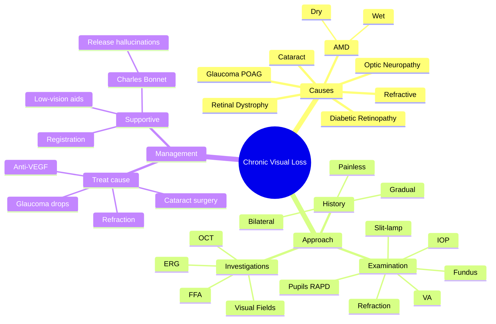

# Chronic Progressive Visual Loss

Related: [[Age-related Cataract]], [[Primary Open-Angle Glaucoma (POAG)]], [[AMD]]

> [!tip] **FCPS/MRCP Priority: HIGH**
> Gradual painless ↓VA. Top causes: cataract, glaucoma, AMD, DR, refractive error. Most are treatable. Screen high-risk populations.

---

## Learning Objectives
- [ ] Define chronic progressive visual loss
- [ ] List the common causes (refractive, cataract, glaucoma, AMD, DR)
- [ ] Describe the systematic clinical approach
- [ ] Outline the management of each major cause
- [ ] Recognise when to refer for low-vision rehabilitation

---

## 1. Definition / Classification

### Definition
- **Chronic progressive visual loss:** Gradual, painless, usually bilateral (though often asymmetric) reduction in visual acuity occurring over weeks to years
- Distinguished from **acute visual loss** (sudden, over seconds to days)

### Classification by Cause
- **Refractive** (most common, easily correctable)
- **Lens** (cataract)
- **Optic nerve** (glaucoma, optic neuropathy)
- **Retinal** (AMD, DR, dystrophies)
- **Macular** (CSCR, hole, ERM)
- **Corneal** (dystrophies, scars)
- **Amblyopic** (childhood — not progressive, but causes poor VA)

---

## 2. Aetiology / Epidemiology

### Common Causes
- **Refractive error** (most common, correctable)
- **Cataract** (most common treatable cause of blindness worldwide)
- **Glaucoma** (POAG — leading cause of irreversible blindness)
- **Age-related macular degeneration** (AMD)
- **Diabetic retinopathy / maculopathy**

### Other Causes
- Corneal disease (dystrophies, scars)
- Uveitis (chronic)
- Optic nerve (compression, hereditary, toxic, nutritional)
- Retinal dystrophy (retinitis pigmentosa, Stargardt)
- Macular (CSCR, macular hole, ERM)
- Amblyopia (childhood, non-progressive)

### Risk Factors
- **Age** (cataract, AMD, glaucoma, DR)
- **Family history** (glaucoma, RP, AMD)
- **Diabetes mellitus** (cataract, DR)
- **Hypertension** (CRVO, NAION, retinopathy)
- **Smoking** (AMD, cataract)
- **UV exposure** (cataract, AMD)
- **Steroid use** (cataract, glaucoma)

---

## 3. Clinical Features

### History
- **Gradual, painless** loss of vision
- Often bilateral but may be asymmetric
- Difficulty reading, recognising faces, driving (especially at night)
- Patients may adapt by increasing font size, better lighting
- **No pain** (pain suggests acute cause, e.g., optic neuritis, acute glaucoma)
- Ask about: PMH (DM, HTN), FH (glaucoma, AMD), medications (steroids, hydroxychloroquine, ethambutol), social (smoking, alcohol)

### Examination
- **Visual acuity** (Snellen) — first and most important
- **Refraction** — surprisingly often the answer
- **Pupils** (RAPD if asymmetric optic nerve disease)
- **Slit-lamp** (cornea, AC, lens — cataract)
- **IOP** (glaucoma)
- **Fundus** (disc cupping, maculopathy, DR, retinal dystrophy)
- **Visual fields** (glaucoma, neuro-ophthalmic)

---

## 4. Investigations

### First-Line
- **Refraction** — most common cause is refractive
- **Visual acuity** (Snellen/logMAR)
- **Slit-lamp examination**
- **IOP** measurement
- **Dilated fundus examination**

### Second-Line
- **Visual fields** (Humphrey perimetry)
- **OCT** (macula, RNFL)
- **Fundus photography / fluorescein angiography**
- **Electroretinography (ERG)** for suspected retinal dystrophies

### When to Image
- **MRI brain + orbits** — if neuro-ophthalmic cause suspected (compressive optic neuropathy, chiasmal lesion)

---

## 5. Differential Diagnosis

| Condition | Distinguishing Features |
|-----------|------------------------|
| **Refractive error** | Improves with pinhole, correctable with glasses |
| **Cataract** | Lens opacity on slit-lamp, glare, gradual |
| **POAG** | ↑ IOP, optic disc cupping, VF loss (arcuate) |
| **AMD** | Drusen (dry), neovascularisation (wet), central scotoma |
| **Diabetic retinopathy** | Microaneurysms, haemorrhages, exudates, neovascularisation |
| **Optic neuropathy** | RAPD, disc pallor, central/caecocentral scotoma |
| **Retinal dystrophy** | Bone-spicule pigmentation (RP), night blindness, ERG changes |
| **Macular hole/ERM** | Metamorphopsia, central scotoma, OCT diagnostic |

---

## 6. Management

### Treat Underlying Cause (Most Are Treatable)
- **Refractive correction** (glasses, contact lenses, refractive surgery)
- **Cataract surgery** (phacoemulsification + IOL — highly successful)
- **Glaucoma treatment** (drops → laser → surgery; ↓ IOP prevents progression but cannot restore lost vision)
- **Anti-VEGF** for wet AMD, DMO
- **Laser photocoagulation** for PDR, macular oedema
- **Vitrectomy** for advanced DR, macular hole
- **Stop offending drugs** (hydroxychloroquine, ethambutol)

### Supportive
- **Low-vision aids** (magnifiers, telescopes, large-print books, electronic devices)
- **Registration as visually impaired / blind** (if eligible)
- **Occupational therapy, mobility training**
- **Counselling and support** (visual loss → depression)

---

## 7. Complications

- **Permanent visual impairment / blindness**
- **Increased risk of falls** (especially in elderly)
- **Depression and social isolation**
- **Loss of independence** (driving, reading, daily activities)
- **Visual hallucinations** (Charles Bonnet syndrome) in severely impaired

---

## 8. Red Flags / Emergencies

- Sudden change in chronic visual loss (suggests new pathology — vitreous haemorrhage, RD)
- Pain (suggests acute cause, not chronic)
- New floaters / flashes (RD)
- RAPD present (optic nerve disease)

> Note: Chronic visual loss is not itself an emergency, but a **sudden change** in someone with chronic loss warrants urgent assessment.

---

## 9. FCPS/MRCP High-Yield Summary

| Cause | Key Point |
|-------|-----------|
| **Refractive error** | Most common, easy |
| **Cataract** | Most common treatable cause of blindness — curable by surgery |
| **POAG** | Treatable, but visual loss is irreversible |
| **AMD** | Wet = treatable (anti-VEGF); dry = supportive (AREDS vitamins) |
| **DR** | Treatable; tight glycaemic + BP control slows progression |
| **RP** | Hereditary, nyctalopia, bone-spicule pigmentation, ERG diagnostic |
| **Optic neuropathy** | RAPD, colour desaturation, central scotoma |

---

## 10. Viva Questions

1. **Q:** What is the most common treatable cause of blindness worldwide?
   **A:** Cataract.

2. **Q:** List the 5 most common causes of chronic progressive visual loss in an elderly patient.
   **A:** Refractive error, cataract, POAG, AMD, DR.

3. **Q:** A 70-year-old with gradual bilateral central vision loss and drusen — diagnosis?
   **A:** Dry AMD.

4. **Q:** What is the first investigation in chronic visual loss?
   **A:** Refraction (often reveals correctable cause) and visual acuity measurement.

5. **Q:** What is Charles Bonnet syndrome?
   **A:** Visual hallucinations in patients with severe visual loss (typically elderly with AMD) — a release phenomenon, NOT psychiatric.

---

## 11. Common Confusions / Exam Traps

| Confusion | Clarification |
|-----------|---------------|
| "Refractive error is not a real cause of visual loss" | It IS — and the most common. Always refract first. |
| "POAG is curable" | No — treatment prevents progression but does not restore lost vision |
| "Charles Bonnet = dementia" | No — it's release hallucinations, patient knows they're not real |
| "AMD always causes total blindness" | No — wet AMD treated with anti-VEGF; dry AMD causes central loss but peripheral vision preserved |
| "Cataract must be 'ripe' before surgery" | Outdated — operate when visually significant |

---

## 12. Mnemonics

1. **"Cat-Glau-AMD-DR-Ref"** — Top 5 causes of chronic VL: **Cat**aract, **Glau**coma, **AMD**, **D**iabetic **R**etinopathy, **R**efractive error
2. **"Slow and Steady Loses Sight"** — Chronic visual loss is gradual; if sudden, think acute pathology
3. **"No Pain, Big Problem"** — Painless chronic visual loss is usually the dangerous kind (glaucoma, AMD)

---

## 13. Mind Map

---

## 14. One-Page Revision Card

| **Topic** | **Chronic Progressive Visual Loss** |
|-----------|-------------------------------------|
| **Definition** | Gradual, painless ↓VA over weeks-years |
| **Top 5 Causes** | Refractive, Cataract, Glaucoma, AMD, DR |
| **First test** | Refraction (often diagnostic) |
| **Most treatable** | Cataract (curable by surgery) |
| **Most common irreversible** | Glaucoma (treat to prevent progression) |
| **AMD** | Wet = anti-VEGF; Dry = AREDS vitamins |
| **Viva Pearl** | Always refract first — most common cause is refractive |

---

## Spaced Repetition Trackers

### 24-Hour Recall Prompts
- [ ] List 5 common causes of chronic progressive visual loss
- [ ] What is the most common treatable cause of blindness?
- [ ] Why is POAG treatment unable to restore lost vision?
- [ ] Describe the systematic approach to chronic visual loss

### Revision Schedule
- [ ] **Day 1** completed (creation + 24h recall)
- [ ] **Day 3** revision completed
- [ ] **Day 7** revision completed
- [ ] **Day 15** revision completed
- [ ] **Day 30** revision completed
- [ ] **Day 90** revision completed

---

## Must Know / Should Know / Nice to Know

### Must Know (Core for passing)
- [x] Top 5 causes
- [x] Most common treatable cause (cataract)
- [x] Systematic approach (VA, refraction, pupils, slit-lamp, IOP, fundus)
- [x] Cataract = curable; Glaucoma = treatable but irreversible

### Should Know (High probability)
- [x] AMD — wet vs dry
- [x] Anti-VEGF indication
- [x] DR management principles
- [x] Charles Bonnet syndrome
- [x] Low-vision aids and registration

### Nice to Know (Differentiator)
- [ ] Retinal dystrophies (RP, Stargardt)
- [ ] ERG in diagnosis
- [ ] Hydroxychloroquine/ethambutol toxicity
- [ ] AREDS vitamin formulation

---

## My Weak Points
- [ ] Add personal weak areas here

---

## Self-Test Scorecard

| Section | Score /10 |
|---------|-----------|
| Understanding: | /10 |
| Recall: | /10 |
| MCQ Performance: | /10 |
| SBA Performance: | /10 |
| Viva Confidence: | /10 |
| **Total:** | **/50** |

> [!tip] **Interpretation:** <35 = weak topic, 35-44 = acceptable but insecure, 45+ = strong exam-ready topic.

---

## Exam Answer Modes

### Long Answer Skeleton
1. Definition (gradual, painless, bilateral ↓VA)
2. Common causes (refractive, cataract, glaucoma, AMD, DR)
3. Approach (history → VA → refraction → pupils → slit-lamp → IOP → fundus → VF)
4. Investigations (refraction, OCT, VF, FFA, MRI if neuro)
5. Management (treat cause, low-vision aids, registration)

### Short Note Skeleton
- Top 5 causes
- Most common treatable cause (cataract)
- First test = refraction
- AMD: wet vs dry
- POAG: treatable but irreversible

### Viva One-Liners
- **Q:** Most common treatable cause of blindness? → **A:** Cataract
- **Q:** First investigation in chronic visual loss? → **A:** Refraction
- **Q:** Charles Bonnet syndrome? → **A:** Release hallucinations in severe VL
- **Q:** Wet AMD treatment? → **A:** Anti-VEGF (intravitreal)
- **Q:** Most common cause of irreversible blindness? → **A:** Glaucoma

### Ward-Case Discussion Points
- Assess functional impact (reading, driving, ADL)
- Refract first — most common cause
- Check IOP and optic discs (glaucoma)
- Look for AMD signs (drusen, geographic atrophy, CNV)
- Discuss treatment options realistically (cataract curable; glaucoma only stabilising)
- Consider low-vision referral and registration

### Last-Night-Before-Exam Sheet
- **Top 5 causes:** Refractive, Cataract, Glaucoma, AMD, DR
- **Most treatable:** Cataract (curable)
- **Most common irreversible:** Glaucoma
- **Mnemonic:** "Cat-Glau-AMD-DR-Ref"
- **First test:** Refraction

---

## Summary

Chronic progressive visual loss is gradual, painless, usually bilateral, and most commonly due to refractive error, cataract, glaucoma, AMD, or DR. Most causes are treatable. The systematic approach is refraction → VA → pupils → slit-lamp → IOP → fundus → visual fields. Cataract is curable; glaucoma is treatable but irreversible. AMD: wet treated with anti-VEGF, dry with AREDS vitamins. Low-vision aids and registration are important for irreversible visual loss. Charles Bonnet syndrome (release hallucinations) is common in severe visual loss.

---

## MCQs (10)

1. **Question:** The most common treatable cause of blindness worldwide is:
   **Options:** A. Glaucoma B. Cataract C. AMD D. Diabetic retinopathy E. Trachoma
   **Answer:** B
   **Explanation:** Cataract is the leading cause of treatable blindness globally and is curable by surgery.

2. **Question:** The first investigation in chronic visual loss should be:
   **Options:** A. MRI brain B. Fluorescein angiography C. Refraction D. OCT E. ERG
   **Answer:** C
   **Explanation:** Refractive error is the most common cause of visual impairment; refraction often reveals the diagnosis.

3. **Question:** Which cause of chronic visual loss is treatable but irreversible (i.e., treatment prevents progression but cannot restore lost vision)?
   **Options:** A. Cataract B. POAG C. Refractive error D. Pterygium E. Conjunctivitis
   **Answer:** B
   **Explanation:** POAG treatment lowers IOP and prevents further optic nerve damage, but visual field loss is permanent.

4. **Question:** The most common cause of irreversible blindness worldwide is:
   **Options:** A. Cataract B. Glaucoma C. AMD D. DR E. Trachoma
   **Answer:** B
   **Explanation:** Glaucoma is the leading cause of irreversible blindness globally.

5. **Question:** Dry AMD is treated with:
   **Options:** A. Anti-VEGF injections B. Laser photocoagulation C. AREDS vitamin supplementation D. Vitrectomy E. Photodynamic therapy
   **Answer:** C
   **Explanation:** AREDS 2 formulation (vitamins C, E, zinc, copper, lutein, zeaxanthin) slows progression of intermediate dry AMD.

6. **Question:** Wet (neovascular) AMD is treated with:
   **Options:** A. Oral steroids B. Topical antibiotics C. Intravitreal anti-VEGF D. Cataract surgery E. Glaucoma drops
   **Answer:** C
   **Explanation:** Anti-VEGF agents (ranibizumab, aflibercept, bevacizumab) injected intravitreally are first-line for wet AMD.

7. **Question:** Charles Bonnet syndrome refers to:
   **Options:** A. Optic neuritis B. Release visual hallucinations in patients with severe visual loss C. Diabetic retinopathy D. Macular degeneration E. Glaucoma
   **Answer:** B
   **Explanation:** Charles Bonnet syndrome is release visual hallucinations in patients with significant visual loss (e.g., AMD), usually with preserved insight.

8. **Question:** Which of the following is NOT a typical cause of chronic progressive visual loss?
   **Options:** A. Cataract B. POAG C. AMD D. Acute angle-closure glaucoma E. Diabetic retinopathy
   **Answer:** D
   **Explanation:** Acute angle-closure glaucoma presents with sudden painful visual loss, not chronic progressive loss.

9. **Question:** A 65-year-old with gradual bilateral central vision loss, drusen on fundoscopy, and no neovascularisation. Diagnosis:
   **Options:** A. Wet AMD B. Dry AMD C. CSR D. Macular hole E. DR
   **Answer:** B
   **Explanation:** Drusen without neovascularisation = dry (non-exudative) AMD.

10. **Question:** A patient with chronic visual loss from glaucoma would benefit most from which supportive measure?
    **Options:** A. Oral vitamins B. Low-vision aids and visual rehabilitation C. Bed rest D. Antibiotics E. Laser refractive surgery
    **Answer:** B
    **Explanation:** Once vision is lost from glaucoma, low-vision aids and visual rehabilitation are the main supportive measures.

---

## SBA Questions (10)

1. **Scenario:** A 70-year-old woman presents with gradual painless bilateral vision loss over 2 years. She has difficulty reading and recognising faces. Visual acuity is 6/18 in both eyes. Pinhole does not improve.
   **Question:** What is the most appropriate first-line investigation?
   **Options:** A. MRI brain B. OCT macula C. Slit-lamp examination and refraction D. Electroretinography E. Visual evoked potentials
   **Answer:** C
   **Explanation:** Although refraction is the first test, pinhole not improving suggests non-refractive cause. Slit-lamp will identify lens opacity (cataract — the most likely diagnosis in an elderly patient with gradual painless bilateral loss).

2. **Scenario:** An 80-year-old man has gradual bilateral vision loss. Slit-lamp shows lens opacities. IOP is normal. Fundus is normal. He cannot read despite good lighting.
   **Question:** What is the definitive treatment?
   **Options:** A. Lifelong eye drops B. Cataract surgery (phacoemulsification + IOL) C. Laser photocoagulation D. Intravitreal injection E. Vitrectomy
   **Answer:** B
   **Explanation:** Cataract is treated surgically with phacoemulsification and intraocular lens implantation — highly successful, often done under local anaesthetic.

3. **Scenario:** A 65-year-old presents with gradual painless peripheral vision loss. IOP is 28 mmHg. Optic disc shows increased cup:disc ratio of 0.8 with notching.
   **Question:** What is the most likely diagnosis?
   **Options:** A. Cataract B. POAG C. AMD D. Acute angle-closure glaucoma E. Optic neuritis
   **Answer:** B
   **Explanation:** Elevated IOP with optic disc cupping and peripheral VF loss = primary open-angle glaucoma (POAG). Note: chronic, painless, peripheral.

4. **Scenario:** A 75-year-old has sudden distortion of central vision (metamorphopsia) on waking. Fundoscopy shows subretinal fluid and a greyish lesion at the macula.
   **Question:** What is the most appropriate urgent treatment?
   **Options:** A. Topical antibiotics B. Intravitreal anti-VEGF injection C. Cataract surgery D. Glaucoma drops E. Oral acetazolamide
   **Answer:** B
   **Explanation:** Sudden metamorphopsia with subretinal fluid and macular lesion = wet AMD. Treatment is urgent intravitreal anti-VEGF.

5. **Scenario:** A 60-year-old diabetic with HbA1c 10% has gradual bilateral vision loss. Fundus shows microaneurysms, dot-blot haemorrhages, and hard exudates.
   **Question:** What is the most appropriate management step?
   **Options:** A. Cataract surgery B. Tighten glycaemic control and refer for laser/anti-VEGF if needed C. Topical steroids D. Glaucoma surgery E. Vitrectomy immediately
   **Answer:** B
   **Explanation:** DR is treated with tight glycaemic, BP, and lipid control. Vision-threatening DR (DMO, PDR) requires laser or anti-VEGF.

6. **Scenario:** A 40-year-old with gradual vision loss, night blindness, and constricted visual fields. Fundus shows bone-spicule pigmentation in the periphery.
   **Question:** What is the most likely diagnosis?
   **Options:** A. AMD B. Diabetic retinopathy C. Retinitis pigmentosa D. Glaucoma E. Macular dystrophy
   **Answer:** C
   **Explanation:** Triad of night blindness, tunnel vision, and bone-spicule pigmentation = retinitis pigmentosa (RP).

7. **Scenario:** An 80-year-old with severe AMD (VA 6/60) reports seeing "little people" walking in his living room. He knows they are not real and is not distressed.
   **Question:** What is the most likely diagnosis?
   **Options:** A. Dementia B. Charles Bonnet syndrome C. Schizophrenia D. Delirium E. Stroke
   **Answer:** B
   **Explanation:** Visual hallucinations with preserved insight in a patient with severe visual loss = Charles Bonnet syndrome (release hallucinations).

8. **Scenario:** A 70-year-old has gradual vision loss. Visual fields show arcuate scotoma with nasal step. IOP 22 mmHg. Optic disc shows 0.7 cup:disc ratio with notching.
   **Question:** What is the first-line treatment?
   **Options:** A. Vitrectomy B. Topical IOP-lowering drops (e.g., prostaglandin analogue) C. Cataract surgery D. Intravitreal injection E. Observation only
   **Answer:** B
   **Explanation:** Glaucomatous VF defect with elevated IOP and optic disc cupping = POAG. First-line treatment is topical IOP-lowering drops.

9. **Scenario:** A 68-year-old with chronic visual loss is registered as partially sighted. He is struggling to read his newspaper.
   **Options:** A. Cataract surgery B. Intravitreal injection C. Low-vision aids (magnifiers, large print, electronic devices) D. Glaucoma drops E. Refractive surgery
   **Answer:** C
   **Explanation:** For untreatable visual loss, low-vision aids and visual rehabilitation are the main interventions.

10. **Scenario:** A 50-year-old on ethambutol for TB presents with gradual bilateral painless ↓VA and red-green colour desaturation.
    **Question:** What is the most likely cause?
    **Options:** A. Cataract B. Ethambutol-induced optic neuropathy C. Glaucoma C. AMD E. DR
    **Answer:** B
    **Explanation:** Ethambutol causes dose-dependent optic neuropathy. Always check colour vision and VA before starting and during treatment. Stop drug early.

---

## Flashcards

- **Q:** What is the most common treatable cause of blindness worldwide?
  **A:** Cataract — curable by phacoemulsification + IOL.
- **Q:** What is the most common cause of irreversible blindness worldwide?
  **A:** Glaucoma — visual loss is permanent, treatment only prevents further loss.
- **Q:** List 5 common causes of chronic progressive visual loss.
  **A:** Refractive error, Cataract, Glaucoma, AMD, Diabetic retinopathy.
- **Q:** What is the first investigation in chronic visual loss?
  **A:** Refraction — refractive error is the most common cause.
- **Q:** What is Charles Bonnet syndrome?
  **A:** Release visual hallucinations in patients with severe visual loss; preserved insight; common in AMD.

---

## Answer Key with Explanations

### MCQs
1. B — Cataract is the most common treatable cause of blindness worldwide
2. C — Refraction is the first and most informative test
3. B — POAG: treatment lowers IOP but cannot restore lost vision
4. B — Glaucoma is the leading cause of irreversible blindness
5. C — AREDS 2 vitamins for intermediate dry AMD
6. C — Anti-VEGF (intravitreal) for wet AMD
7. B — Charles Bonnet = release hallucinations in severe visual loss
8. D — Acute angle-closure is sudden and painful, not chronic
9. B — Drusen without CNV = dry AMD
10. B — Low-vision aids for irreversible visual loss

### SBAs
1. C — Slit-lamp (and refraction) — pinhole not improving suggests non-refractive (cataract likely)
2. B — Cataract surgery is definitive
3. B — POAG: ↑ IOP, optic disc cupping, peripheral VF loss
4. B — Wet AMD = urgent anti-VEGF
5. B — Tighten glycaemic control; refer for laser/anti-VEGF if vision-threatening
6. C — RP: night blindness, tunnel vision, bone-spicule pigmentation
7. B — Charles Bonnet syndrome: hallucinations with preserved insight
8. B — POAG: topical IOP-lowering drops first-line
9. C — Low-vision aids and visual rehabilitation
10. B — Ethambutol optic neuropathy: stop drug early

---

## Tags
#medicine #davidson #ophthalmology #chronic-VL #fcps #mrcp
