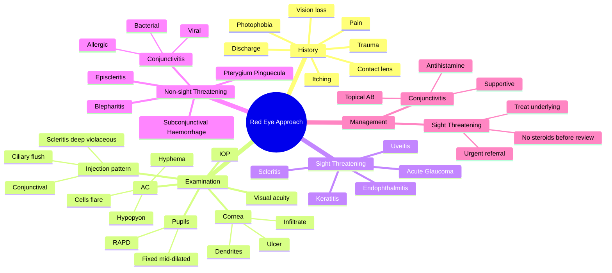

# The Red Eye (Approach)

Related: [[Bacterial Conjunctivitis]], [[Anterior Uveitis (Iritis)]], [[Acute Angle-Closure Glaucoma (PACG)]]

> [!tip] **FCPS/MRCP Priority: CRITICAL**
> Pain + ↓VA = serious. Ciliary flush = serious. Discharge pattern: purulent (bacterial), watery (viral), stringy (allergic).

---

## Learning Objectives
- [ ] List the key questions in history of red eye
- [ ] Differentiate conjunctival from ciliary injection
- [ ] Identify sight-threatening red eye
- [ ] Categorise red eye by discharge type and severity
- [ ] Recognise ophthalmic emergencies (acute glaucoma, endophthalmitis, keratitis)
- [ ] Outline initial management and when to refer

---

## 1. Definition / Classification

### Definition
- **Red eye:** Conjunctival hyperaemia from vasodilation of superficial and/or deep ocular vessels
- A symptom, not a diagnosis — requires identification of underlying cause

### Classification by Severity
- **Non-sight-threatening** (most cases)
- **Sight-threatening** (pain + ↓VA + ciliary flush)
- **Life-threatening** (orbital cellulitis, cavernous sinus thrombosis — rare)

### Classification by Discharge
- **Purulent** — bacterial
- **Watery** — viral
- **Mucoid/stringy** — allergic
- **No discharge** — uveitis, keratitis, acute glaucoma

---

## 2. Aetiology / Pathophysiology

### Aetiology
- **Infectious:** Bacterial, viral, fungal, parasitic
- **Inflammatory:** Allergic, autoimmune (uveitis, scleritis)
- **Traumatic:** Foreign body, abrasion, chemical, radiation
- **Pressure-related:** Acute angle-closure glaucoma
- **Dry eye** (paradoxical redness)
- **Systemic disease** (Sjögren, GPA, IBD, sarcoid)

### Pathophysiology
- **Conjunctival injection:** Superficial, peripheral, mobile with conjunctiva
- **Ciliary (circumcorneal) injection:** Deep, perilimbal, non-mobile — indicates corneal/AC disease
- **Scleritis:** Deep, violaceous, sectoral or diffuse, severe boring pain

---

## 3. Clinical Features

### Key History Questions
- **Pain?** (serious if present)
- **Visual loss?** (serious if present)
- **Discharge?** (purulent / watery / stringy)
- **Photophobia?** (keratitis, uveitis)
- **Itching?** (allergy)
- **Trauma, contact lens?** (high risk of keratitis)
- **Duration, recurrence, laterality**
- **PMH:** autoimmune disease, recent surgery
- **FH:** glaucoma

### Key Examination Signs
- **Visual acuity** (decreased = serious)
- **Pupils** (RAPD, fixed mid-dilated in acute glaucoma)
- **Injection pattern:**
  - **Conjunctival** (peripheral, superficial, mobile) → conjunctivitis
  - **Ciliary flush** (limbal, deep, circumcorneal) → keratitis, uveitis, acute glaucoma
- **Cornea:** Clear, infiltrate, ulcer, FB, dendrites
- **Anterior chamber:** Cells, flare, hypopyon, hyphema, depth (shallow in acute glaucoma)
- **IOP:** ↑ in acute glaucoma
- **Fundus:** If viewable

### Patterns of Redness
| Pattern | Cause |
|---------|-------|
| **Diffuse, peripheral** | Conjunctivitis |
| **Circumcorneal (ciliary flush)** | Keratitis, uveitis, acute glaucoma |
| **Sectoral, violaceous** | Scleritis, episcleritis |
| **Localised haemorrhage** | Subconjunctival haemorrhage |
| **Around pterygium** | Pterygium/Pinguecula inflammation |

---

## 4. Investigations

### First-Line (Most Cases)
- **Clinical diagnosis** (history + slit-lamp)
- Visual acuity
- Slit-lamp examination (cornea, AC, lens)
- Pupils
- IOP (careful in suspected corneal perforation)

### Second-Line
- **Fluorescein staining** (corneal abrasion, dendrites in HSV)
- **Swab for culture** (severe bacterial, neonatal, hyperacute)
- **PCR** (HSV, adenovirus, chlamydia)
- **Blood tests** if systemic (CBC, ESR, CRP, ANCA, ACE)

### When to Image
- **CT orbit** — suspected orbital cellulitis
- **B-scan US** — if fundus not visible (vitreous haemorrhage, RD)

---

## 5. Differential Diagnosis by Severity

### Non-Sight-Threatening
| Condition | Key Features |
|-----------|--------------|
| **Bacterial conjunctivitis** | Purulent discharge, no ↓VA, no ciliary flush |
| **Viral conjunctivitis** | Watery discharge, often bilateral, preauricular node |
| **Allergic conjunctivitis** | Itching, stringy discharge, bilateral, papillae |
| **Subconjunctival haemorrhage** | Localised blood, painless, no ↓VA, often spontaneous |
| **Pterygium / pinguecula** | Chronic, visible, no pain |
| **Blepharitis** | Lid margin redness, scales, collarettes |
| **Episcleritis** | Sectoral, mild discomfort, blanching with phenylephrine |

### Sight-Threatening (Pain + ↓VA + Ciliary Flush)
| Condition | Key Features |
|-----------|--------------|
| **Keratitis** (bacterial, viral, fungal, Acanthamoeba) | Infiltrate, epithelial defect, FB sensation, contact lens history |
| **Acute anterior uveitis (iritis)** | KPs, cells, flare, photophobia, ± synechiae |
| **Acute angle-closure glaucoma** | Halos, severe pain, fixed mid-dilated pupil, ↑↑IOP, cloudy cornea |
| **Scleritis** | Severe boring pain, globe tenderness, deep violaceous injection |
| **Endophthalmitis** | Post-op (or endogenous), hypopyon, pain, ↓VA, lid swelling |
| **Corneal ulcer** | White infiltrate, epithelial defect, hypopyon |

### Other
- **PVD** — floaters, usually no red eye
- **Orbital cellulitis** — proptosis, ↓EOM, fever, post-septal infection
- **Cavernous sinus thrombosis** — bilateral, CN palsies, proptosis, very ill

---

## 6. Management

### General Principles
- **Identify the cause** — most can be diagnosed clinically
- **Sight-threatening → urgent ophthalmology referral**
- Treat underlying cause
- **Never prescribe topical steroids** before ophthalmology review (worsens HSV keratitis, fungal)

### Specific Management
- **Bacterial conjunctivitis:** Topical antibiotics (chloramphenicol, fusidic acid); hygiene
- **Viral (adenoviral):** Supportive, hygiene, cold compresses; highly contagious
- **Allergic:** Antihistamines, mast cell stabilisers, topical steroid (short course)
- **Acute uveitis:** Cycloplegic + topical steroid; investigate cause (HLA-B27, sarcoid)
- **Acute angle-closure glaucoma:** Emergency — IV acetazolamide, topical β-blocker, pilocarpine, laser PI
- **Keratitis:** Urgent referral; topical antibiotics (fluoroquinolone); no contact lens
- **Scleritis:** NSAIDs ± systemic steroids; investigate for systemic disease
- **Subconjunctival haemorrhage:** Reassurance; resolves in 1-2 weeks

---

## 7. Complications

- **Vision loss** (if serious cause missed — e.g., acute glaucoma, keratitis)
- **Corneal perforation** (severe keratitis, rheumatoid)
- **Synechiae** (posterior in uveitis → glaucoma)
- **Spread of infection** (orbital cellulitis, cavernous sinus thrombosis, meningitis)
- **Symblepharon** (severe conjunctivitis — adenoviral, Stevens-Johnson)

---

## 8. Red Flags / Emergencies

> [!danger] **Refer URGENTLY to ophthalmology if:**
> - Pain + ↓VA
> - Ciliary flush (circumcorneal redness)
> - Fixed mid-dilated pupil (acute glaucoma)
> - Hypopyon (pus in AC)
> - Hyphema (blood in AC)
> - Corneal ulcer / infiltrate
> - Proptosis / ↓EOM (orbital cellulitis)
> - Recent ocular surgery (endophthalmitis)
> - Severe photophobia
> - Contact lens wearer with red eye
> - Neonate with red eye (ophthalmia neonatorum)

---

## 9. FCPS/MRCP High-Yield Summary

| Discharge / Sign | Likely Cause |
|------------------|--------------|
| **Purulent** | Bacterial conjunctivitis |
| **Watery** | Viral conjunctivitis |
| **Stringy/mucoid** | Allergic |
| **No discharge, pain, ↓VA, ciliary flush** | Uveitis, keratitis, acute glaucoma |
| **Ciliary flush** | Keratitis, uveitis, acute glaucoma (NOT conjunctivitis) |
| **Hypopyon** | Severe keratitis, endophthalmitis |
| **Hyphema** | Trauma, NVI, surgery |
| **Fixed mid-dilated pupil** | Acute angle-closure glaucoma |
| **Severe boring pain, deep injection** | Scleritis |
| **Sectoral, blanching** | Episcleritis |

### Critical Differentiators
- **Conjunctivitis vs keratitis/uveitis:** Conjunctivitis has NO ↓VA, NO ciliary flush, NO photophobia (except discomfort)
- **Episcleritis vs scleritis:** Episcleritis is mild, blanching, sectoral; scleritis is severe pain, violaceous, vision-threatening
- **Acute conjunctivitis vs acute glaucoma:** Discharge + no ↓VA + no ciliary flush = conjunctivitis; severe pain + ↓VA + halos + fixed pupil = glaucoma

---

## 10. Viva Questions

1. **Q:** What is the most important sign of serious red eye?
   **A:** Decreased visual acuity.

2. **Q:** Differentiate conjunctival from ciliary injection.
   **A:** Conjunctival = peripheral, superficial, mobile with conjunctiva. Ciliary = limbal, deep, circumcorneal, non-mobile.

3. **Q:** A 60-year-old with severe eye pain, halos, fixed mid-dilated pupil, and cloudy cornea — diagnosis?
   **A:** Acute angle-closure glaucoma.

4. **Q:** What is the difference between episcleritis and scleritis?
   **A:** Episcleritis = mild, sectoral, blanching with phenylephrine, no vision loss. Scleritis = severe boring pain, deep violaceous injection, often vision-threatening, associated with systemic disease (RA, GPA).

5. **Q:** Why is topical steroid contraindicated before ophthalmology review in red eye?
   **A:** It can worsen HSV keratitis (causes geographic ulcer, perforation) and fungal keratitis.

6. **Q:** Discharge pattern in red eye?
   **A:** Purulent = bacterial, watery = viral, stringy/mucoid = allergic.

7. **Q:** When should you suspect endophthalmitis?
   **A:** Recent ocular surgery (especially cataract) with pain, ↓VA, hypopyon, lid swelling — usually within 1-2 weeks post-op.

---

## 11. Common Confusions / Exam Traps

| Confusion | Clarification |
|-----------|---------------|
| "Red eye always = conjunctivitis" | No — must rule out sight-threatening causes (keratitis, uveitis, glaucoma) |
| "Ciliary flush is just severe conjunctivitis" | Ciliary flush = deep, perilimbal, indicates serious corneal/AC disease (NOT conjunctivitis) |
| "Topical steroids help all red eyes" | NO — they worsen HSV keratitis (geographic ulcer) and fungal keratitis. Never prescribe before slit-lamp |
| "Episcleritis and scleritis are the same" | No — episcleritis is mild, blanching; scleritis is severe, vision-threatening, often systemic |
| "Photophobia means conjunctivitis" | Photophobia is NOT a feature of simple conjunctivitis — suggests uveitis or keratitis |
| "Subconjunctival haemorrhage is dangerous" | No — usually benign, resolves in 1-2 weeks; check BP if recurrent |

---

## 12. Mnemonics

1. **"P-W-S-N"** for discharge: **P**urulent (bacterial), **W**atery (viral), **S**tringy (allergic), **N**o discharge (uveitis/keratitis/glaucoma)
2. **"3 S's of serious red eye"** — **S**evere pain, **S**ight loss (↓VA), **S**erious sign (ciliary flush, hypopyon, fixed pupil)
3. **"ABC of Red Eye"** — **A**cute glaucoma (no discharge, fixed pupil, ↑IOP), **B**acterial (purulent), **C**onjunctivitis (viral/allergic/non-sight threatening)

---

## 13. Mind Map

---

## 14. One-Page Revision Card

| **Topic** | **The Red Eye — Approach** |
|-----------|----------------------------|
| **Most important sign of seriousness** | ↓ Visual acuity |
| **Ciliary flush indicates** | Keratitis, uveitis, acute glaucoma |
| **Purulent discharge** | Bacterial |
| **Watery discharge** | Viral |
| **Stringy/mucoid** | Allergic |
| **No discharge + pain + ↓VA** | Uveitis, keratitis, acute glaucoma |
| **Fixed mid-dilated pupil + halos** | Acute angle-closure glaucoma |
| **Severe boring pain + deep violaceous** | Scleritis |
| **Hypopyon post-op** | Endophthalmitis |
| **Mnemonic** | "P-W-S-N" discharge pattern |
| **Viva Pearl** | Never use topical steroid before slit-lamp review |

---

## Spaced Repetition Trackers

### 24-Hour Recall Prompts
- [ ] List the 3 features of sight-threatening red eye
- [ ] Differentiate conjunctival from ciliary injection
- [ ] What does purulent/watery/stringy discharge suggest?
- [ ] Why is topical steroid contraindicated before ophthalmology review?
- [ ] List 5 sight-threatening causes of red eye

### Revision Schedule
- [ ] **Day 1** completed (creation + 24h recall)
- [ ] **Day 3** revision completed
- [ ] **Day 7** revision completed
- [ ] **Day 15** revision completed
- [ ] **Day 30** revision completed
- [ ] **Day 90** revision completed

---

## Must Know / Should Know / Nice to Know

### Must Know (Core for passing)
- [x] Most important sign of serious red eye = ↓VA
- [x] Differentiate conjunctival vs ciliary injection
- [x] Discharge pattern (P/W/S/N)
- [x] Acute angle-closure: painful, halos, fixed mid-dilated pupil, ↑↑IOP
- [x] Sight-threatening causes: keratitis, uveitis, acute glaucoma, scleritis, endophthalmitis
- [x] Never use topical steroid before slit-lamp

### Should Know (High probability)
- [x] Episcleritis vs scleritis
- [x] Keratitis features (infiltrate, ulcer, hypopyon)
- [x] Acute uveitis features (KPs, cells, flare)
- [x] Subconjunctival haemorrhage is benign
- [x] Contact lens wearer = red eye = keratitis until proven otherwise

### Nice to Know (Differentiator)
- [ ] Orbital cellulitis features
- [ ] Cavernous sinus thrombosis (rare, life-threatening)
- [ ] Stevens-Johnson ocular involvement
- [ ] Endogenous endophthalmitis (e.g., from endocarditis)

---

## My Weak Points
- [ ] Add personal weak areas here

---

## Self-Test Scorecard

| Section | Score /10 |
|---------|-----------|
| Understanding: | /10 |
| Recall: | /10 |
| MCQ Performance: | /10 |
| SBA Performance: | /10 |
| Viva Confidence: | /10 |
| **Total:** | **/50** |

> [!tip] **Interpretation:** <35 = weak topic, 35-44 = acceptable but insecure, 45+ = strong exam-ready topic.

---

## Exam Answer Modes

### Long Answer Skeleton
1. Definition (red eye = conjunctival hyperaemia, a symptom not diagnosis)
2. Approach (history: pain, ↓VA, discharge, photophobia → examination: VA, pupils, injection pattern, cornea, AC, IOP, fundus)
3. Differentiate conjunctival from ciliary injection
4. Discharge patterns (P/W/S/N)
5. Sight-threatening causes (keratitis, uveitis, acute glaucoma, scleritis, endophthalmitis)
6. Red flags requiring urgent referral
7. Management principles (treat cause, urgent referral, never topical steroid before review)

### Short Note Skeleton
- Approach to red eye (history → examination → identify cause)
- Discharge pattern mnemonic
- Sight-threatening triad (pain + ↓VA + ciliary flush)
- Acute angle-closure glaucoma (presentation and emergency management)

### Viva One-Liners
- **Q:** Most important sign of serious red eye? → **A:** ↓ Visual acuity
- **Q:** Conjunctival vs ciliary injection? → **A:** Conjunctival = peripheral, mobile. Ciliary = perilimbal, deep, non-mobile
- **Q:** Discharge patterns? → **A:** P-W-S-N: Purulent (bact), Watery (viral), Stringy (allergic), None (uveitis/keratitis/glaucoma)
- **Q:** Acute angle-closure triad? → **A:** Severe pain, halos, fixed mid-dilated pupil, ↑IOP
- **Q:** Why no topical steroid before review? → **A:** Worsens HSV/fungal keratitis

### Ward-Case Discussion Points
- Always check VA first (most important)
- Differentiate conjunctival from ciliary injection
- Look for hypopyon, hyphema, corneal ulcer
- Check pupil (fixed mid-dilated = acute glaucoma)
- Contact lens wearer: assume keratitis
- Avoid topical steroid until seen by ophthalmology

### Last-Night-Before-Exam Sheet
- **Top 3 serious signs:** ↓VA, pain, ciliary flush
- **Discharge mnemonic:** P-W-S-N
- **Sight-threatening causes:** Keratitis, Uveitis, Glaucoma, Scleritis, Endophthalmitis (KUGSE)
- **Acute glaucoma:** Painful, halos, fixed mid-dilated pupil, ↑IOP
- **Never:** Topical steroid before slit-lamp review

---

## Summary

Red eye is a symptom, not a diagnosis. The most important sign of seriousness is decreased visual acuity. Ciliary flush (deep perilimbal injection) indicates keratitis, uveitis, or acute glaucoma. Discharge pattern is informative: purulent = bacterial, watery = viral, stringy = allergic, none = uveitis/keratitis/glaucoma. Sight-threatening causes (keratitis, uveitis, acute glaucoma, scleritis, endophthalmitis) require urgent ophthalmology referral. **Never use topical steroids before slit-lamp review** — can worsen HSV or fungal keratitis. Contact lens wearers with red eye have keratitis until proven otherwise.

---

## MCQs (10)

1. **Question:** The most important clinical sign indicating a serious cause of red eye is:
   **Options:** A. Discharge B. Decreased visual acuity C. Redness D. Itching E. Duration
   **Answer:** B
   **Explanation:** Decreased visual acuity is the cardinal sign of a sight-threatening red eye.

2. **Question:** Ciliary (circumcorneal) injection is characteristic of:
   **Options:** A. Bacterial conjunctivitis B. Keratitis/uveitis/acute glaucoma C. Allergic conjunctivitis D. Blepharitis E. Subconjunctival haemorrhage
   **Answer:** B
   **Explanation:** Ciliary flush is deep, perilimbal injection indicating corneal, anterior chamber, or acute glaucoma pathology.

3. **Question:** A patient with severe eye pain, halos around lights, nausea, and a fixed mid-dilated pupil. Most likely diagnosis:
   **Options:** A. Acute conjunctivitis B. Acute angle-closure glaucoma C. Acute uveitis D. Scleritis E. Orbital cellulitis
   **Answer:** B
   **Explanation:** Classic triad of acute angle-closure glaucoma: severe pain, halos, fixed mid-dilated pupil, with ↑IOP and cloudy cornea.

4. **Question:** Watery discharge from a red eye is most suggestive of:
   **Options:** A. Bacterial conjunctivitis B. Viral conjunctivitis C. Allergic conjunctivitis D. Acute uveitis E. Acute glaucoma
   **Answer:** B
   **Explanation:** Watery discharge is characteristic of viral (often adenoviral) conjunctivitis.

5. **Question:** A 30-year-old contact lens wearer presents with red eye, pain, photophobia, and a white corneal infiltrate. Most likely diagnosis:
   **Options:** A. Conjunctivitis B. Acute uveitis C. Bacterial keratitis D. Acute glaucoma E. Scleritis
   **Answer:** C
   **Explanation:** Contact lens wear + pain + corneal infiltrate = bacterial keratitis (often Pseudomonas) until proven otherwise.

6. **Question:** Which feature distinguishes scleritis from episcleritis?
   **Options:** A. Sectoral redness B. Severe boring pain and violaceous injection C. Mild discomfort D. No vision loss E. Blanches with phenylephrine
   **Answer:** B
   **Explanation:** Scleritis = severe boring pain, deep violaceous injection, vision-threatening, often systemic disease.

7. **Question:** Hypopyon in a patient 5 days after cataract surgery suggests:
   **Options:** A. Acute uveitis B. Endophthalmitis C. Acute glaucoma D. Conjunctivitis E. PVD
   **Answer:** B
   **Explanation:** Post-op pain, ↓VA, and hypopyon = endophthalmitis until proven otherwise. Emergency.

8. **Question:** Topical steroid should be avoided in red eye until:
   **Options:** A. After 1 week B. After ophthalmology review C. After antibiotic course D. Always E. Never
   **Answer:** B
   **Explanation:** Topical steroids can worsen HSV keratitis (geographic ulcer, perforation) and fungal keratitis. Avoid until slit-lamp examination rules out these conditions.

9. **Question:** Stringy, mucoid discharge is most typical of:
   **Options:** A. Bacterial conjunctivitis B. Viral conjunctivitis C. Allergic conjunctivitis D. Acute uveitis E. Acute glaucoma
   **Answer:** C
   **Explanation:** Stringy/mucoid discharge with itching is the hallmark of allergic conjunctivitis.

10. **Question:** A 60-year-old with severe boring eye pain worse at night, deep violaceous injection, and tenderness on palpation. Diagnosis:
    **Options:** A. Episcleritis B. Scleritis C. Conjunctivitis D. Uveitis E. Acute glaucoma
    **Answer:** B
    **Explanation:** Severe boring pain, deep violaceous injection, tenderness = scleritis. Investigate for systemic disease (RA, GPA, SLE, IBD).

---

## SBA Questions (10)

1. **Scenario:** A 25-year-old with bilateral red eyes, watery discharge, gritty sensation, and a palpable preauricular lymph node.
   **Question:** Most likely diagnosis?
   **Options:** A. Bacterial conjunctivitis B. Viral (adenoviral) conjunctivitis C. Allergic conjunctivitis D. Acute uveitis E. Acute glaucoma
   **Answer:** B
   **Explanation:** Bilateral watery discharge, gritty sensation, and preauricular lymphadenopathy are classic for viral (adenoviral) conjunctivitis. Highly contagious.

2. **Scenario:** A 65-year-old presents with sudden severe right eye pain, blurred vision, halos around lights, nausea, and a red eye. The pupil is fixed and mid-dilated. IOP is 60 mmHg.
   **Question:** What is the most appropriate immediate management?
   **Options:** A. Topical antibiotics B. IV acetazolamide, topical β-blocker, pilocarpine, then laser peripheral iridotomy C. Oral antihistamines D. Topical steroid E. Observation
   **Answer:** B
   **Explanation:** Acute angle-closure glaucoma is an emergency. Treatment: IV acetazolamide, topical β-blocker, pilocarpine (constrict pupil), then definitive laser peripheral iridotomy.

3. **Scenario:** A 35-year-old presents with red eye, photophobia, blurred vision, and pain. The pupil is small and irregular. Slit-lamp shows keratic precipitates, cells, and flare in the AC.
   **Question:** Most likely diagnosis?
   **Options:** A. Conjunctivitis B. Acute anterior uveitis C. Acute glaucoma D. Keratitis E. Scleritis
   **Answer:** B
   **Explanation:** Photophobia, small irregular pupil, KPs, cells and flare = acute anterior uveitis (iritis). Treat with cycloplegic + topical steroid; investigate cause (HLA-B27, sarcoid).

4. **Scenario:** A 30-year-old contact lens wearer with a red eye, severe pain, photophobia, and a white corneal infiltrate with overlying epithelial defect.
   **Question:** What is the most appropriate first-line treatment?
   **Options:** A. Topical antihistamine B. Topical steroid C. Topical fluoroquinolone (e.g., moxifloxacin) and stop contact lens wear D. Cataract surgery E. Glaucoma drops
   **Answer:** C
   **Explanation:** Bacterial keratitis — stop contact lens, urgent topical fluoroquinolone (e.g., moxifloxacin, gatifloxacin). Avoid topical steroid.

5. **Scenario:** A 50-year-old with rheumatoid arthritis presents with severe boring pain, deep violaceous injection, and globe tenderness. VA is reduced.
   **Question:** Most likely diagnosis?
   **Options:** A. Episcleritis B. Scleritis C. Conjunctivitis D. Uveitis E. Acute glaucoma
   **Answer:** B
   **Explanation:** RA + severe boring pain + deep violaceous injection + reduced VA = scleritis. Needs systemic NSAIDs ± steroids; investigate systemic disease.

6. **Scenario:** A 70-year-old diabetic patient had cataract surgery 1 week ago. Now presents with pain, ↓VA, hypopyon, and lid swelling.
   **Question:** Most likely diagnosis?
   **Options:** A. Acute uveitis B. Acute glaucoma C. Endophthalmitis D. Conjunctivitis E. Corneal abrasion
   **Answer:** C
   **Explanation:** Post-op (within weeks) + pain + ↓VA + hypopyon = endophthalmitis. Emergency — vitreous tap + intravitreal antibiotics.

7. **Scenario:** A 20-year-old with bilateral red eyes, intense itching, stringy mucoid discharge, and a history of atopy.
   **Question:** Most likely diagnosis and treatment?
   **Options:** A. Bacterial — topical AB B. Viral — supportive C. Allergic — antihistamine/mast cell stabiliser D. Uveitis — cycloplegic E. Glaucoma — acetazolamide
   **Answer:** C
   **Explanation:** Bilateral itching + stringy discharge + atopy = allergic conjunctivitis. Treat with topical antihistamine ± mast cell stabiliser.

8. **Scenario:** A 60-year-old presents with a sudden painless red eye — a localised bright red patch with no vision loss and no other symptoms.
   **Question:** Most likely diagnosis?
   **Options:** A. Acute angle-closure glaucoma B. Subconjunctival haemorrhage C. Endophthalmitis D. Scleritis E. Keratitis
   **Answer:** B
   **Explanation:** Painless, localised, bright red patch with no ↓VA = subconjunctival haemorrhage. Reassurance; check BP if recurrent.

9. **Scenario:** A 35-year-old presents with red eye, mild discomfort, sectoral redness that blanches with phenylephrine, and normal VA.
   **Question:** Most likely diagnosis?
   **Options:** A. Scleritis B. Episcleritis C. Uveitis D. Acute glaucoma E. Keratitis
   **Answer:** B
   **Explanation:** Sectoral, blanching with phenylephrine, mild discomfort, normal VA = episcleritis (not scleritis). Often self-limiting; topical NSAIDs.

10. **Scenario:** A 40-year-old with red eye, severe pain, photophobia, ↓VA, dendritic ulcer on fluorescein staining.
    **Question:** Most likely diagnosis?
    **Options:** A. Bacterial keratitis B. Herpes simplex keratitis C. Fungal keratitis D. Acanthamoeba keratitis E. Marginal keratitis
    **Answer:** B
    **Explanation:** Dendritic ulcer on fluorescein staining = HSV keratitis. Treat with topical aciclovir/ganciclovir; **avoid topical steroids** (worsen disease, cause geographic ulcer/perforation).

---

## Flashcards

- **Q:** What is the most important sign of a serious red eye?
  **A:** Decreased visual acuity.
- **Q:** What is ciliary flush and what does it indicate?
  **A:** Deep perilimbal injection, non-mobile; indicates keratitis, uveitis, or acute glaucoma.
- **Q:** Discharge patterns in red eye?
  **A:** Purulent = bacterial, Watery = viral, Stringy = allergic, None = uveitis/keratitis/glaucoma.
- **Q:** Acute angle-closure glaucoma triad?
  **A:** Severe pain, halos around lights, fixed mid-dilated pupil; cloudy cornea, ↑↑IOP.
- **Q:** Why avoid topical steroid before slit-lamp review?
  **A:** Worsens HSV keratitis (geographic ulcer, perforation) and fungal keratitis.

---

## Answer Key with Explanations

### MCQs
1. B — ↓VA is the cardinal sign of a serious red eye
2. B — Ciliary flush = deep perilimbal = keratitis/uveitis/glaucoma
3. B — Pain + halos + fixed mid-dilated pupil = acute angle-closure glaucoma
4. B — Watery discharge is viral
5. C — Contact lens + infiltrate = bacterial keratitis
6. B — Scleritis has severe boring pain and violaceous injection
7. B — Post-op + hypopyon = endophthalmitis
8. B — Topical steroid requires slit-lamp review first
9. C — Stringy/mucoid = allergic
10. B — Severe boring pain + violaceous = scleritis

### SBAs
1. B — Bilateral watery + preauricular node = viral
2. B — Acute glaucoma emergency: IV acetazolamide + topical agents + laser PI
3. B — Small irregular pupil + KPs + cells/flare = uveitis
4. C — Bacterial keratitis = topical fluoroquinolone + stop contact lens
5. B — RA + boring pain + violaceous = scleritis
6. C — Post-op + hypopyon = endophthalmitis
7. C — Itching + atopy + stringy = allergic
8. B — Painless localised red patch = subconjunctival haemorrhage
9. B — Sectoral + blanching = episcleritis
10. B — Dendritic ulcer = HSV keratitis

---

## Tags
#medicine #davidson #ophthalmology #red-eye #approach #fcps #mrcp
