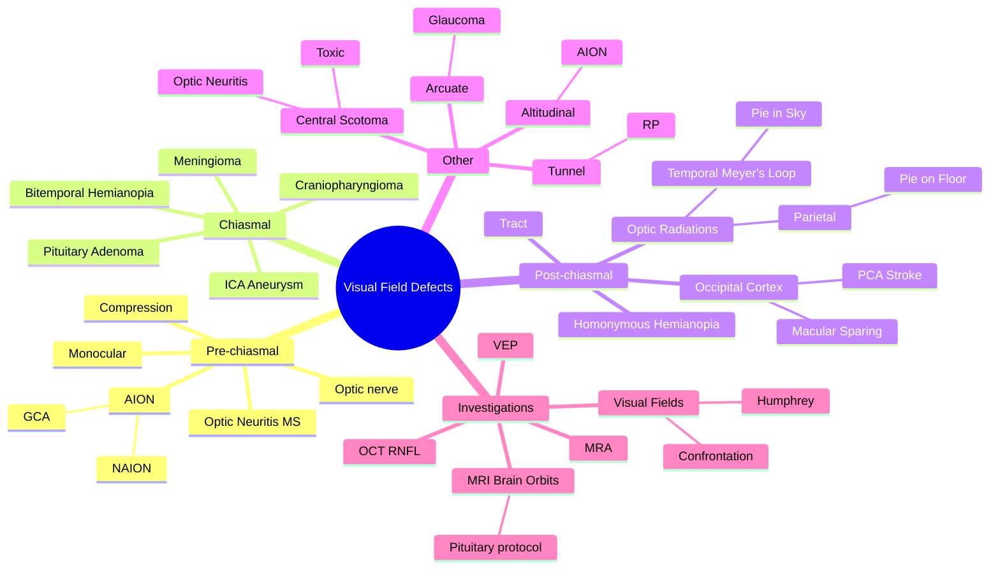

# Visual Field Defects and Pathway Lesions

Related: [[Visual Field Testing]], [[Pituitary Adenoma]]

> [!tip] **FCPS/MRCP Priority: CRITICAL**
> Localise lesion by pattern. Pre-chiasmal = monocular. Chiasmal = bitemporal. Post-chiasmal = homonymous. Altitudinal = AION. Arcuate = glaucoma.

---

## Learning Objectives
- [ ] Describe the visual pathway anatomy from retina to occipital cortex
- [ ] Localise lesions by visual field defect pattern
- [ ] Identify common causes at each site (optic nerve, chiasm, tract, radiations, cortex)
- [ ] Recognise characteristic patterns: bitemporal hemianopia, homonymous hemianopia, quadrantanopia, altitudinal, arcuate
- [ ] Outline appropriate investigations
- [ ] Identify when neuroimaging is required

---

## 1. Definition / Visual Pathway Anatomy

### Definition
- **Visual field defect:** A region of reduced or absent vision within the visual field, corresponding to damage at a specific site in the visual pathway
- The pattern of the defect localises the lesion

### The Visual Pathway
```
Retina → Optic nerve (CN II) → Optic chiasm → Optic tract → LGN (thalamus)
         → Optic radiations (Meyer's loop in temporal lobe / parietal fibres)
         → Occipital cortex (V1)
```

### Key Anatomical Points
- **Optic chiasm:** Nasal fibres (carrying temporal visual field) cross here
- **Optic tract:** Contains fibres from the same side of both visual fields (homonymous)
- **Meyer's loop:** Inferior retinal fibres (superior visual field) swing into temporal lobe
- **Parietal radiations:** Superior retinal fibres (inferior visual field)
- **Occipital cortex (V1):** Macula represented posteriorly (PCA territory — dual blood supply → macular sparing in PCA stroke)

---

## 2. Aetiology / Pathophysiology

### Aetiology by Site

**Optic Nerve (pre-chiasmal)**
- Optic neuritis (MS, NMOSD)
- AION (NAION, GCA)
- Compressive (meningioma, glioma, aneurysm)
- Trauma
- Toxic/nutritional (methanol, ethambutol, B12)
- Hereditary (LHON, DOA)

**Chiasm**
- Pituitary adenoma (most common)
- Craniopharyngioma
- Suprasellar meningioma
- Internal carotid aneurysm
- Glioma

**Post-chiasmal (tract, radiations, cortex)**
- **Stroke** (PCA territory most common)
- Tumour
- Trauma
- Demyelination (rare)
- Arteriovenous malformation

---

## 3. Clinical Features / Defect Patterns

### Visual Field Defect Patterns

| Defect | Lesion Site | Common Cause |
|--------|-------------|--------------|
| **Monocular field defect** | Optic nerve (pre-chiasmal) | Optic neuritis, AION, compression |
| **Bitemporal hemianopia** | Optic chiasm (centre) | Pituitary adenoma, craniopharyngioma, meningioma |
| **Junctional scotoma** (ipsilateral central + contralateral superotemporal) | Anterior chiasm | Pituitary (lateral extension) |
| **Homonymous hemianopia** | Post-chiasmal (tract, radiations, cortex) | Stroke (PCA), tumour |
| **Superior quadrantanopia ("pie in the sky")** | Temporal lobe (Meyer's loop) | Tumour, stroke |
| **Inferior quadrantanopia ("pie on the floor")** | Parietal lobe | Stroke, tumour |
| **Macular-sparing homonymous hemianopia** | Occipital cortex (PCA) | PCA stroke (dual blood supply to macula) |
| **Altitudinal** (superior or inferior) | Ischaemic optic neuropathy | AION (GCA, NAION) |
| **Arcuate / nasal step** | RNFL (retinal nerve fibre layer) | Glaucoma |
| **Central / caecocentral scotoma** | Optic nerve / macula | Optic neuritis, toxic/nutritional, macular |
| **Tubular / tunnel vision** | Bilateral peripheral constriction | RP, functional |
| **Constricted (peripheral)** | Retinal | RP, advanced glaucoma |

### Key Rules
- **Pre-chiasmal lesion → monocular defect** (only one optic nerve affected)
- **Chiasmal lesion → bitemporal hemianopia** (nasal fibres cross at chiasm)
- **Post-chiasmal lesion → homonymous defect** (same side of visual field in both eyes)
- **Congruous** (similar in both eyes) = cortical
- **Incongruous** (different in both eyes) = optic tract or radiation
- **Macular sparing** = occipital (PCA) — preserved central vision
- **Arcuate / nasal step** = RNFL (glaucoma)

---

## 4. Investigations

### First-Line
- **Visual fields** — confrontation (bedside), automated perimetry (Humphrey, Goldmann)
- **Visual acuity, pupils, IOP**
- **Fundus examination** (disc pallor, cupping, swelling)

### Second-Line
- **OCT** of RNFL (glaucoma) and macula
- **MRI brain + orbits** (with gadolinium, pituitary protocol) — for any unexplained, progressive, or chiasmal/post-chiasmal defect
- **MRA / CTA** — for suspected aneurysm
- **Visual evoked potentials (VEP)** — demyelination (MS)
- **ERG** — retinal dystrophy

### When to Image
- **Any unexplained visual field defect** — especially bitemporal, homonymous, or progressive
- **Optic disc swelling with visual loss** (to rule out compressive lesion)
- **RAPD + visual loss** (rule out optic nerve compression)

---

## 5. Differential Diagnosis

| Pattern | Differential Diagnosis |
|---------|------------------------|
| **Bitemporal hemianopia** | Pituitary adenoma, craniopharyngioma, meningioma, ICA aneurysm |
| **Homonymous hemianopia** | Stroke (PCA), tumour, trauma, AVM |
| **Monocular central scotoma** | Optic neuritis, AION, toxic optic neuropathy, compression |
| **Arcuate scotoma / nasal step** | POAG, NTG, other optic neuropathies |
| **Altitudinal** | NAION, BRAO, BRVO |
| **Constricted (tunnel)** | RP, advanced glaucoma, functional/non-organic |

---

## 6. Management

### General Principles
- **Identify and treat underlying cause**
- **Urgent neuroimaging** for any unexplained, progressive, or chiasmal/post-chiasmal defect
- **Vascular risk factor control** (post-stroke)
- **MDT** (neurology, endocrinology, neurosurgery, ophthalmology)

### Specific
- **Pituitary adenoma:** Transsphenoidal surgery, ± radiotherapy, ± bromocriptine/cabergoline (prolactinoma)
- **Craniopharyngioma:** Surgery ± radiotherapy
- **Optic neuritis (MS):** IV methylprednisolone (acute), disease-modifying therapy (DMT)
- **AION (GCA):** Urgent high-dose steroids; tocilizumab; temporal artery biopsy
- **Stroke (PCA):** Acute stroke management; rehabilitation
- **Glaucoma:** IOP-lowering drops, laser, surgery
- **Optic nerve compression:** Surgical decompression
- **Low-vision aids** for permanent defects

---

## 7. Complications

- **Permanent visual field loss** (especially if cause not treated early — chiasmal compression can be irreversible)
- **Driver licence restrictions** (VF requirements)
- **Increased falls risk** (hemianopia)
- **Quality of life impact** (reading, mobility)
- **Stroke sequelae** (PCA territory)

---

## 8. Red Flags / Emergencies

> [!danger] **Urgent referral / neuroimaging if:**
> - Sudden visual field loss
> - Bitemporal hemianopia (chiasmal compression — often pituitary)
> - Homonymous hemianopia (stroke / tumour)
> - Visual loss + headache + RAPD + disc swelling (compressive optic neuropathy)
> - Visual loss + jaw claudication + scalp tenderness (GCA → AION)

---

## 9. FCPS/MRCP High-Yield Summary

| Pattern | Think |
|---------|-------|
| **Monocular** | Optic nerve (MS, AION, compression) |
| **Bitemporal** | Chiasm (pituitary adenoma — most common) |
| **Homonymous** | Post-chiasmal (PCA stroke most common) |
| **Macular-sparing homonymous** | Occipital cortex (PCA) |
| **Superior quadrantanopia ("pie in sky")** | Temporal lobe (Meyer's loop) |
| **Inferior quadrantanopia ("pie on floor")** | Parietal lobe |
| **Arcuate / nasal step** | Glaucoma |
| **Altitudinal** | AION (GCA, NAION) |
| **Central scotoma** | Optic neuritis, toxic, macular |

### Key Anatomy Pearls
- **Crossing point = chiasm** (bitemporal = chiasmal)
- **After chiasm = homonymous** (same side of VF in both eyes)
- **Meyer's loop = temporal lobe** (superior quadrantanopia)
- **Parietal radiations = inferior quadrantanopia**
- **Macular sparing = occipital / PCA** (dual blood supply to macula)

---

## 10. Viva Questions

1. **Q:** A 45-year-old with progressive bitemporal vision loss. Diagnosis?
   **A:** Pituitary adenoma compressing the chiasm.

2. **Q:** Right homonymous hemianopia with macular sparing. Where is the lesion?
   **A:** Left occipital cortex (PCA territory — dual blood supply to macular region).

3. **Q:** Superior quadrantanopia ("pie in the sky") — which lobe?
   **A:** Temporal lobe (Meyer's loop carries inferior retinal fibres / superior visual field).

4. **Q:** A 70-year-old with sudden inferior altitudinal field loss. Diagnosis?
   **A:** NAION (non-arteritic AION) — typically inferior altitudinal.

5. **Q:** A 75-year-old with sudden visual loss, jaw claudication, and tender temporal artery. Diagnosis?
   **A:** Giant cell arteritis (GCA) causing arteritic AION. Treat with high-dose steroids urgently.

6. **Q:** Why is macular sparing typical in PCA stroke?
   **A:** The occipital pole (macular representation) has dual blood supply from both PCA and MCA collaterals.

7. **Q:** What is the most common cause of bitemporal hemianopia?
   **A:** Pituitary adenoma.

---

## 11. Common Confusions / Exam Traps

| Confusion | Clarification |
|-----------|---------------|
| "Bitemporal hemianopia = bilateral disease" | No — it's a single midline lesion at the chiasm (usually pituitary) |
| "Macular sparing means the macula is fine" | It means the central vision is preserved, but the rest of the field is lost |
| "Quadrantanopia = hemisphere lesion" | No — it localises to lobe (temporal vs parietal) or specific radiation |
| "RAPD in bitemporal hemianopia" | RAPD is usually absent because the optic nerves are intact; chiasmal lesion spares the nerve |
| "Inferior quadrantanopia = temporal lobe" | No — it's parietal lobe (Meyer's loop = superior quadrantanopia / temporal) |
| "Altitudinal field loss = glaucoma" | Altitudinal is typical of AION (GCA, NAION); arcuate / nasal step = glaucoma |

---

## 12. Mnemonics

1. **"CHIASMA"** — Crosses at chiasm → **bi**temporal hemianopia
2. **"Meyer's Makes the Sky Pie"** — Meyer's loop (temporal lobe) → **S**uperior quadrantanopia ("**P**ie in the **S**ky")
3. **"Parietal Pie on the Floor"** — Parietal radiations → **I**nferior quadrantanopia ("Pie on the floor")
4. **"Pre-Chiasmal is One Eye Only"** — Monocular field defect = pre-chiasmal

---

## 13. Mind Map



---

## 14. One-Page Revision Card

| **Topic** | **Visual Field Defects & Pathway Lesions** |
|-----------|---------------------------------------------|
| **Pre-chiasmal** | Monocular (one eye) |
| **Chiasmal** | Bitemporal hemianopia — pituitary |
| **Post-chiasmal** | Homonymous hemianopia — PCA stroke |
| **Pie in the sky** | Superior quadrantanopia — temporal lobe (Meyer's loop) |
| **Pie on the floor** | Inferior quadrantanopia — parietal lobe |
| **Macular sparing** | Occipital (PCA dual supply) |
| **Arcuate / nasal step** | Glaucoma |
| **Altitudinal** | AION (GCA, NAION) |
| **Mnemonic** | "Meyer's Makes Sky Pie" |
| **Most common chiasmal cause** | Pituitary adenoma |
| **Viva Pearl** | Macular sparing = occipital lesion |

---

## Spaced Repetition Trackers

### 24-Hour Recall Prompts
- [ ] List the 3 main sites and their classic field defects
- [ ] What is the most common cause of bitemporal hemianopia?
- [ ] Where is Meyer's loop and what defect does it cause?
- [ ] What does macular sparing suggest?
- [ ] What is the difference between altitudinal and arcuate defects?

### Revision Schedule
- [ ] **Day 1** completed (creation + 24h recall)
- [ ] **Day 3** revision completed
- [ ] **Day 7** revision completed
- [ ] **Day 15** revision completed
- [ ] **Day 30** revision completed
- [ ] **Day 90** revision completed

---

## Must Know / Should Know / Nice to Know

### Must Know (Core for passing)
- [x] Bitemporal hemianopia = chiasmal = pituitary
- [x] Homonymous hemianopia = post-chiasmal (PCA stroke)
- [x] Monocular defect = pre-chiasmal (optic nerve)
- [x] Pie in sky = temporal lobe (Meyer's loop)
- [x] Pie on floor = parietal lobe
- [x] Macular sparing = occipital (PCA dual supply)
- [x] Arcuate/nasal step = glaucoma
- [x] Altitudinal = AION

### Should Know (High probability)
- [x] Junctional scotoma (anterior chiasm)
- [x] GCA → AION (urgent high-dose steroids)
- [x] Optic neuritis = MS, painful, ↓colour vision
- [x] MRI brain + orbits with pituitary protocol

### Nice to Know (Differentiator)
- [ ] Toxic optic neuropathies (methanol, ethambutol)
- [ ] LHON (Leber's hereditary optic neuropathy)
- [ ] Congruous vs incongruous homonymous hemianopia
- [ ] Octopus/Kinetic perimetry differences

---

## My Weak Points
- [ ] Add personal weak areas here

---

## Self-Test Scorecard

| Section | Score /10 |
|---------|-----------|
| Understanding: | /10 |
| Recall: | /10 |
| MCQ Performance: | /10 |
| SBA Performance: | /10 |
| Viva Confidence: | /10 |
| **Total:** | **/50** |

> [!tip] **Interpretation:** <35 = weak topic, 35-44 = acceptable but insecure, 45+ = strong exam-ready topic.

---

## Exam Answer Modes

### Long Answer Skeleton
1. Visual pathway anatomy (retina → ON → chiasm → tract → LGN → radiations → cortex)
2. Defect patterns by site:
   - Pre-chiasmal = monocular
   - Chiasmal = bitemporal
   - Post-chiasmal = homonymous
3. Quadrantanopias: pie in sky = temporal (Meyer's); pie on floor = parietal
4. Macular sparing = occipital (PCA dual blood supply)
5. Causes by site (pituitary, PCA stroke, MS, AION, glaucoma)
6. Investigations (perimetry, MRI brain + orbits with pituitary protocol, OCT RNFL)
7. Management (treat underlying, e.g., pituitary surgery, IV steroids for optic neuritis/AION)

### Short Note Skeleton
- Bitemporal hemianopia — chiasmal compression — pituitary adenoma (most common)
- Pie in the sky = temporal lobe (Meyer's loop)
- Macular sparing = occipital (PCA)

### Viva One-Liners
- **Q:** Bitemporal hemianopia = ? → **A:** Chiasmal lesion (pituitary)
- **Q:** Pie in the sky = ? → **A:** Temporal lobe (Meyer's loop)
- **Q:** Macular sparing = ? → **A:** Occipital / PCA
- **Q:** Arcuate scotoma = ? → **A:** Glaucoma
- **Q:** Altitudinal = ? → **A:** AION (NAION, GCA)
- **Q:** Most common post-chiasmal cause? → **A:** PCA stroke

### Ward-Case Discussion Points
- Identify the field defect pattern
- Localise the lesion (pre-chiasmal, chiasmal, post-chiasmal)
- Differential by site
- Urgent MRI brain + orbits (pituitary protocol)
- Look for systemic features (GCA, MS, pituitary hormone abnormalities)

### Last-Night-Before-Exam Sheet
- **Pre-chiasmal = monocular** (one eye)
- **Chiasmal = bitemporal** (pituitary)
- **Post-chiasmal = homonymous** (PCA stroke)
- **Meyer's loop = pie in the sky** (temporal)
- **Parietal = pie on the floor**
- **Macular sparing = occipital (PCA)**
- **Arcuate = glaucoma**
- **Altitudinal = AION**

---

## Summary

Visual field defects localise lesions in the visual pathway. Pre-chiasmal lesions cause monocular defects (optic neuritis, AION, compression). Chiasmal lesions cause bitemporal hemianopia (most commonly pituitary adenoma). Post-chiasmal lesions cause homonymous hemianopia (most commonly PCA stroke). Quadrantanopias localise to specific lobes: superior ("pie in the sky") = temporal lobe (Meyer's loop); inferior ("pie on the floor") = parietal lobe. Macular sparing suggests occipital cortex (PCA dual blood supply). Arcuate scotomas/nasal step = glaucoma. Altitudinal defects = AION (GCA, NAION). Urgent MRI brain + orbits (pituitary protocol) is required for unexplained, progressive, or chiasmal/post-chiasmal defects.

---

## MCQs (10)

1. **Question:** Bitemporal hemianopia is caused by a lesion at:
   **Options:** A. Optic nerve B. Optic chiasm C. Optic tract D. Occipital cortex E. Retina
   **Answer:** B
   **Explanation:** Bitemporal hemianopia = chiasmal lesion (nasal fibres from both eyes cross at the chiasm and are affected by a midline lesion, classically pituitary adenoma).

2. **Question:** Right homonymous hemianopia suggests a lesion in the:
   **Options:** A. Right optic nerve B. Right chiasm C. Left optic tract or post-chiasmal pathway D. Right occipital E. Right macula
   **Answer:** C
   **Explanation:** Homonymous hemianopia = post-chiasmal lesion; the side of the visual field affected is opposite (contralateral) to the lesion.

3. **Question:** "Pie in the sky" superior quadrantanopia is due to a lesion in the:
   **Options:** A. Parietal lobe B. Temporal lobe (Meyer's loop) C. Occipital lobe D. Optic nerve E. Chiasm
   **Answer:** B
   **Explanation:** Meyer's loop in the temporal lobe carries inferior retinal fibres (superior visual field); damage causes "pie in the sky" superior quadrantanopia.

4. **Question:** Macular-sparing homonymous hemianopia is most characteristic of:
   **Options:** A. Optic tract lesion B. Temporal lobe lesion C. Parietal lobe lesion D. Occipital cortex (PCA) stroke E. Chiasmal lesion
   **Answer:** D
   **Explanation:** Macular sparing is classic for occipital cortex lesions (PCA territory) due to dual blood supply to the macular representation (PCA + MCA).

5. **Question:** Arcuate scotoma with nasal step is the classic visual field defect of:
   **Options:** A. Pituitary adenoma B. Optic neuritis C. Glaucoma D. NAION E. Stroke
   **Answer:** C
   **Explanation:** RNFL damage in glaucoma produces arcuate scotoma with nasal step (Bjerrum's area).

6. **Question:** Inferior altitudinal visual field loss is most typical of:
   **Options:** A. POAG B. NAION C. Pituitary adenoma D. Retinal detachment E. Vitreous haemorrhage
   **Answer:** B
   **Explanation:** AION (NAION, GCA) classically causes altitudinal field loss (often inferior).

7. **Question:** The most common cause of bitemporal hemianopia is:
   **Options:** A. Craniopharyngioma B. Pituitary adenoma C. Meningioma D. Optic neuritis E. Aneurysm
   **Answer:** B
   **Explanation:** Pituitary adenoma is the most common cause of chiasmal compression and bitemporal hemianopia.

8. **Question:** A 45-year-old with progressive bitemporal hemianopia, headaches, and ↓libido. Most likely diagnosis:
   **Options:** A. Craniopharyngioma B. Pituitary adenoma C. Meningioma D. Multiple sclerosis E. Stroke
   **Answer:** B
   **Explanation:** Bitemporal hemianopia + headache + ↓libido (hypogonadism) = pituitary adenoma (likely macroprolactinoma or non-functioning macroadenoma compressing the chiasm).

9. **Question:** Painless, sudden, inferior altitudinal field loss in a 60-year-old with hypertension, hyperlipidaemia, and smoking history. Most likely cause:
   **Options:** A. GCA B. NAION C. Pituitary adenoma D. Optic neuritis E. Glaucoma
   **Answer:** B
   **Explanation:** Painless altitudinal loss in vasculopathic patient = NAION (non-arteritic AION) — most common acute optic neuropathy in older adults.

10. **Question:** A patient has sudden visual loss, jaw claudication, scalp tenderness, and ESR 90 mm/hr. Most likely diagnosis:
    **Options:** A. NAION B. GCA (arteritic AION) C. Central retinal artery occlusion D. Optic neuritis E. Pituitary apoplexy
    **Answer:** B
    **Explanation:** Classic GCA presentation — visual loss + jaw claudication + scalp tenderness + ↑ESR. **Treat with urgent high-dose steroids** before biopsy to prevent contralateral eye involvement.

---

## SBA Questions (10)

1. **Scenario:** A 50-year-old woman has progressive bitemporal hemianopia, headaches, and amenorrhoea. Visual acuity is normal. Fundi are normal.
   **Question:** Most likely diagnosis and best investigation?
   **Options:** A. Optic neuritis — VEP B. Pituitary adenoma — MRI brain (pituitary protocol) C. Glaucoma — IOP and VF D. Stroke — CT head E. NAION — ESR
   **Answer:** B
   **Explanation:** Bitemporal hemianopia + amenorrhoea (hormonal symptoms) = pituitary adenoma (likely prolactinoma). MRI brain with pituitary protocol is the investigation of choice.

2. **Scenario:** A 70-year-old has sudden right homonymous hemianopia with macular sparing. Visual acuity is normal. No other neurological deficit.
   **Question:** Where is the lesion?
   **Options:** A. Right optic nerve B. Optic chiasm C. Right occipital cortex D. Left occipital cortex E. Right optic tract
   **Answer:** D
   **Explanation:** Right homonymous hemianopia = left post-chiasmal lesion. Macular sparing indicates occipital cortex (PCA territory).

3. **Scenario:** A 30-year-old woman with painful ↓VA, RAPD, and ↓colour vision in the right eye. Visual field shows a central scotoma. MRI brain shows periventricular white matter lesions.
   **Question:** Most likely diagnosis?
   **Options:** A. NAION B. Optic neuritis (MS) C. Pituitary adenoma D. GCA E. Glaucoma
   **Answer:** B
   **Explanation:** Painful ↓VA, RAPD, ↓colour vision, central scotoma, female, periventricular lesions = optic neuritis due to MS.

4. **Scenario:** A 65-year-old presents with sudden inferior altitudinal visual field loss, ↓VA, swollen optic disc, and ESR 95 mm/hr.
   **Question:** Most likely diagnosis and immediate treatment?
   **Options:** A. NAION — observe B. GCA (arteritic AION) — urgent high-dose IV/oral steroids C. Optic neuritis — IV methylprednisolone D. Glaucoma — IOP drops E. Pituitary apoplexy — surgery
   **Answer:** B
   **Explanation:** Altitudinal + swollen disc + ↑ESR = GCA. Treat with high-dose steroids urgently (before biopsy) to prevent bilateral blindness.

5. **Scenario:** A 60-year-old has gradual bilateral arcuate scotomas with nasal steps on Humphrey perimetry. IOP is 26 mmHg. Optic disc shows 0.8 cup:disc ratio with notching.
   **Question:** Most likely diagnosis?
   **Options:** A. POAG B. Pituitary adenoma C. Optic neuritis D. NAION E. CRVO
   **Answer:** A
   **Explanation:** Arcuate scotoma + nasal step + ↑IOP + optic disc cupping = primary open-angle glaucoma (POAG).

6. **Scenario:** A 40-year-old has right superior quadrantanopia ("pie in the sky"). MRI shows a left temporal lobe lesion.
   **Question:** Which structure is affected?
   **Options:** A. Parietal radiations B. Meyer's loop C. Optic tract D. Optic nerve E. Chiasm
   **Answer:** B
   **Explanation:** Meyer's loop in the temporal lobe carries inferior retinal fibres (superior visual field); damage causes "pie in the sky."

7. **Scenario:** A 35-year-old has sudden onset bitemporal hemianopia with severe headache and visual loss. Past history: acromegaly on treatment.
   **Question:** Most likely diagnosis?
   **Options:** A. Pituitary apoplexy B. Stroke C. Optic neuritis D. Glaucoma E. Migraine
   **Answer:** A
   **Explanation:** Sudden severe headache + visual loss in known pituitary macroadenoma = pituitary apoplexy (haemorrhage/infarction). Emergency — IV steroids and urgent surgery.

8. **Scenario:** A 25-year-old has sudden painless ↓VA, RAPD, and a central scotoma in one eye. MRI shows no demyelination. 1 month later, the other eye develops similar symptoms.
   **Question:** Likely cause?
   **Options:** A. MS B. Leber's hereditary optic neuropathy (LHON) C. NAION D. GCA E. Pituitary adenoma
   **Answer:** B
   **Explanation:** Sequential bilateral painless optic neuropathy in a young man = LHON (mitochondrial). 90% are men. Look for maternal inheritance.

9. **Scenario:** A 50-year-old with right inferior quadrantanopia ("pie on the floor"). MRI shows a left parietal lesion.
   **Question:** Which structure is affected?
   **Options:** A. Meyer's loop B. Parietal optic radiations C. Optic tract D. Optic nerve E. Chiasm
   **Answer:** B
   **Explanation:** Parietal radiations carry superior retinal fibres (inferior visual field). Damage causes "pie on the floor" inferior quadrantanopia.

10. **Scenario:** A 60-year-old with sudden monocular ↓VA, RAPD, altitudinal field loss, and a swollen optic disc. ESR is 18 mm/hr. Diagnosed with NAION.
    **Question:** What is the most important risk factor to address?
    **Options:** A. Start antibiotics B. Vascular risk factors — BP, glucose, cholesterol, smoking cessation C. Urgent steroids D. Surgery E. Bedrest
    **Answer:** B
    **Explanation:** NAION is associated with vascular risk factors (HTN, DM, hyperlipidaemia, smoking, sleep apnoea). Treat these — no proven specific therapy for NAION.

---

## Flashcards

- **Q:** What visual field defect pattern does a chiasmal lesion cause?
  **A:** Bitemporal hemianopia (most commonly pituitary adenoma).
- **Q:** "Pie in the sky" — which lobe?
  **A:** Temporal lobe (Meyer's loop).
- **Q:** Macular sparing suggests which lesion site?
  **A:** Occipital cortex (PCA territory — dual blood supply).
- **Q:** Most common cause of bitemporal hemianopia?
  **A:** Pituitary adenoma.
- **Q:** Arcuate scotoma with nasal step = ?
  **A:** Glaucoma.

---

## Answer Key with Explanations

### MCQs
1. B — Bitemporal hemianopia = chiasmal
2. C — Right homonymous = left post-chiasmal (contralateral)
3. B — Meyer's loop in temporal lobe = "pie in the sky"
4. D — Macular sparing = occipital (PCA dual supply)
5. C — Arcuate + nasal step = glaucoma
6. B — Altitudinal = AION (NAION, GCA)
7. B — Pituitary adenoma is the most common chiasmal cause
8. B — Bitemporal + hormonal symptoms = pituitary adenoma
9. B — Painless altitudinal in vasculopathic patient = NAION
10. B — GCA: jaw claudication, scalp tenderness, ↑ESR — urgent steroids

### SBAs
1. B — Bitemporal + amenorrhoea = pituitary; MRI pituitary protocol
2. D — Right homonymous + macular sparing = left occipital (PCA)
3. B — Painful ↓VA + RAPD + central scotoma + periventricular lesions = MS
4. B — Altitudinal + swollen disc + ↑ESR = GCA; urgent steroids
5. A — Arcuate + nasal step + ↑IOP + cupping = POAG
6. B — Pie in sky = Meyer's loop (temporal)
7. A — Sudden severe headache + visual loss in pituitary = apoplexy
8. B — Sequential bilateral optic neuropathy in young man = LHON
9. B — Pie on floor = parietal radiations
10. B — NAION: address vascular risk factors

---

## Tags
#medicine #davidson #ophthalmology #visual-field #pathway #fcps #mrcp

## PasTest Scenario SBAs (Clinical Vignettes)

> **Auto-generated PasTest/Mediscope-style scenario SBAs** grounded in the authored source. Each scenario tests a real clinical fact (triad, specific sign, contraindication, trial, first-line Rx) extracted from the topic. *Source: Ch 28: Medical Ophthalmology — Visual Field Defects and Pathway Lesions*

**Q1.** What is the most appropriate first-line therapy for Visual Field Defects and Pathway Lesions?

  - **A.** Identify and treat underlying cause
  - **B.** An advanced/surgical therapy reserved for refractory disease
  - **C.** Symptomatic treatment only, no disease-modifying therapy
  - **D.** Empiric broad-spectrum therapy without specific indication

  > **Answer: A** — Identify and treat underlying cause
  >
  > *Source:* **Identify and treat underlying cause**

