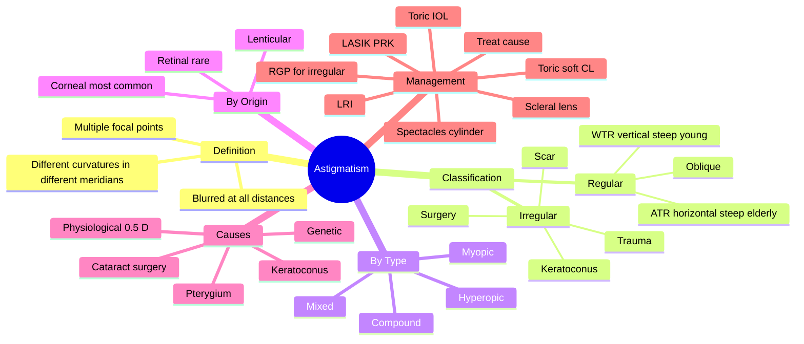

# Astigmatism

Related: [[Myopia]], [[Hyperopia]], [[Keratoconus]], [[Cataract Surgery]]

> [!tip] **FCPS/MRCP Priority: HIGH**
> Astigmatism is very common. Distinguish regular (correctable with spectacles) from irregular (requires rigid contact lens or surgical correction). Keratoconus is a key cause of irregular astigmatism.

---

## Learning Objectives
- [ ] Define astigmatism and classify types
- [ ] Distinguish regular from irregular
- [ ] Identify causes of irregular astigmatism
- [ ] Describe correction options
- [ ] Interpret keratometry and corneal topography
- [ ] Recognise WTR vs ATR astigmatism
- [ ] List surgical options for astigmatism

---

## 1. Definition

- **Astigmatism:** Refractive error where light focuses at multiple points, not one
- Caused by non-spherical cornea or lens (different curvature in different meridians)
- Results in blurred vision at all distances
- Most common refractive error after myopia and hyperopia

---

## 2. Classification

### By Pattern
- **Regular:** Two principal meridians 90° apart — correctable with cylindrical lens
  - With-the-rule (WTR): steepest meridian vertical (most common in young)
  - Against-the-rule (ATR): steepest meridian horizontal (common in elderly)
  - Oblique
- **Irregular:** Meridians not orthogonal — not correctable with simple cylinder
  - Causes: keratoconus, scarring, post-surgery, trauma, cataract

### By Type
- **Myopic astigmatism:** Both meridians focus in front of retina
- **Hyperopic astigmatism:** Both behind
- **Mixed (simple):** One on, one off retina
- **Compound:** Both myopic or both hyperopic

### By Origin
- **Corneal:** Majority of cases
- **Lenticular:** Lens shape (e.g., early cataract, lens tilt)
- **Retinal:** Rare

---

## 3. Aetiology

- **Physiological:** ~0.5 D common in normal eyes
- **Genetic:** Often familial
- **Eyelid pressure:** Ptosis, chalazion
- **Pterygium:** Induces corneal flattening
- **Cataract surgery:** Incision-induced
- **Keratoconus, pellucid marginal degeneration:** Irregular astigmatism
- **Corneal scarring:** Trauma, infection
- **Dislocated lens (ectopia lentis)**
- **Dry eye:** Irregular tear film

---

## 4. Clinical Features

- Blurred vision at all distances
- Eyestrain, headache (especially with reading)
- Squinting to improve focus
- Monocular diplopia (irregular astigmatism)
- Distortion of lines (look straight, look curved)

---

## 5. Examination

- **Refraction:** Cylinder correction determined
- **Keratometry:** Measures corneal curvature (K1, K2)
- **Corneal topography / tomography:** Maps cornea — essential for irregular
- **Retinoscopy:** Different reflexes in different meridians (scissors reflex)

---

## 6. Management

### Optical
- **Spectacles:** Cylindrical (toric) lenses
- **Contact lenses:**
  - **Toric soft:** For regular
  - **Rigid gas permeable (RGP):** For irregular (replaces cornea as primary refracting surface)
  - **Scleral lenses:** Advanced irregular
- **Refractive surgery:**
  - LASIK/PRK with wavefront
  - **Toric IOL** at cataract surgery
  - **Limbal relaxing incisions** (LRIs)
  - **ICL** (toric)

### Treat Underlying Cause
- Pterygium excision
- Chalazion drainage
- Keratoconus management (CXL, contact lens, INTACS, keratoplasty)
- Cataract surgery if lens-induced

---

## 7. FCPS/MRCP High-Yield Summary

| Topic | Key Points |
|-------|------------|
| Astigmatism | Multiple focal points, blurred at all distances |
| Regular vs irregular | Regular = correctable with cylinder; irregular = needs RGP |
| Most common | Mild physiological astigmatism (~0.5 D) |
| WTR vs ATR | WTR = vertical steep (young); ATR = horizontal steep (elderly) |
| Irregular causes | Keratoconus, scar, pterygium, surgery |

---

## 8. Viva Questions

1. **Q:** Differentiate regular from irregular astigmatism.
   **A:** Regular = principal meridians 90° apart, correctable with spectacle cylinder. Irregular = meridians not perpendicular, requires RGP/scleral lens or surgical correction.

2. **Q:** What is with-the-rule astigmatism?
   **A:** Steepest meridian is vertical (90°). Common in younger patients.

3. **Q:** How would you manage irregular astigmatism from keratoconus?
   **A:** RGP or scleral contact lens, possibly INTACS, corneal cross-linking (CXL) to halt progression, keratoplasty if severe.

---

## 11. Common Confusions / Exam Traps

| Confusion | Clarification |
|-----------|---------------|
| "Astigmatism is a disease" | It's a refractive error — usually physiological, not pathological |
| "All astigmatism needs correction" | Only ~0.5 D is physiological and asymptomatic; ≥0.75 D usually needs correction |
| "WTR = bad, ATR = good" | Neither is "bad"; WTR is common in young, ATR emerges with age |
| "Irregular astigmatism corrects with glasses" | Cannot — needs RGP/scleral lens or surgery |
| "Cylinder axis is the steep meridian" | Cylinder axis is the meridian of ZERO power (flatter meridian in minus cyl form) |
| "Astigmatism causes blindness" | It does not; it only blurs vision at all distances |
| "Monocular diplopia = brain tumour" | Most often due to irregular astigmatism (e.g., cataract, KC) — examine cornea first |

---

## 12. Mnemonics

1. **"WTR = Young, ATR = Old"** — With-the-Rule (vertical steep) in Young; Against-the-Rule (horizontal steep) in Old
2. **"Regular = Rectangular"** — meridians are at right angles (90° apart)
3. **"Irregular = Irregular shape"** — keratoconus, scar, pterygium — needs RGP, not glasses

---

## 13. Mind Map

---

## 14. One-Page Revision Card

| **Topic** | **Astigmatism** |
|-----------|-----------------|
| **Definition** | Multiple focal points due to non-spherical cornea/lens |
| **Key Feature** | Blurred vision at ALL distances |
| **Regular vs Irregular** | Regular = cylinder correctable; Irregular = needs RGP |
| **WTR vs ATR** | WTR (vertical steep) in young; ATR (horizontal steep) in elderly |
| **Common Cause of Irregular** | Keratoconus, scar, pterygium, post-surgery |
| **Examination** | Keratometry, topography, retinoscopy (scissors reflex) |
| **Correction** | Cylindrical lens / toric IOL / RGP / refractive surgery |
| **Viva Pearl** | Monocular diplopia → think irregular astigmatism (e.g., early cataract) |

---

## Spaced Repetition Trackers

### 24-Hour Recall Prompts
- [ ] Define astigmatism and state the difference between regular and irregular
- [ ] List 3 causes of irregular astigmatism
- [ ] State the difference between WTR and ATR
- [ ] Outline management of irregular astigmatism from keratoconus

### Revision Schedule
- [ ] **Day 1** completed (creation + 24h recall)
- [ ] **Day 3** revision completed
- [ ] **Day 7** revision completed
- [ ] **Day 15** revision completed
- [ ] **Day 30** revision completed
- [ ] **Day 90** revision completed

---

## Must Know / Should Know / Nice to Know

### Must Know (Core for passing)
- [x] Definition of astigmatism
- [x] Regular vs irregular distinction
- [x] WTR vs ATR
- [x] Keratoconus as a key cause of irregular astigmatism
- [x] Correction options: cylindrical lens, toric IOL, RGP

### Should Know (High probability)
- [x] Classification by type (myopic, hyperopic, mixed, compound)
- [x] Pterygium and cataract surgery as acquired causes
- [x] Corneal topography in diagnosis
- [x] Monocular diplopia as a clinical clue

### Nice to Know (Differentiator)
- [ ] Hofstetter's limits of astigmatism
- [ ] Lenticule extraction (SMILE) for astigmatism
- [ ] INTACS for keratoconus

---

## My Weak Points
- [ ] Add personal weak areas here

---

## Self-Test Scorecard

| Section | Score /5 |
|---------|----------|
| Understanding: | /10 |
| Recall: | /10 |
| MCQ Performance: | /10 |
| SBA Performance: | /10 |
| Viva Confidence: | /10 |
| Total: | /50 |

> [!tip] **Interpretation:** <35 = weak topic, 35-44 = acceptable but insecure, 45+ = strong exam-ready topic.

---

## Exam Answer Modes

### Long Answer Skeleton
1. Definition — multiple focal points due to non-spherical cornea or lens
2. Classification — by pattern (regular WTR/ATR, irregular), type (myopic/hyperopic/mixed/compound), origin (corneal/lenticular/retinal)
3. Aetiology — physiological, genetic, pterygium, post-cataract, keratoconus, scar
4. Clinical features — blurred vision at all distances, eyestrain, monocular diplopia
5. Examination — refraction, keratometry, topography, scissors reflex
6. Management — spectacles, toric CL, RGP, scleral lens, refractive surgery, toric IOL, treat underlying cause

### Short Note Skeleton
- Definition + classification (regular vs irregular)
- Common causes of irregular astigmatism
- Correction options (spectacles vs RGP vs surgery)

### Viva One-Liners
- **Q:** What is astigmatism? → **A:** Refractive error with multiple focal points due to different curvatures in different meridians
- **Q:** Regular vs irregular? → **A:** Regular = meridians 90° apart, correctable with cylinder; irregular = meridians not perpendicular, needs RGP
- **Q:** WTR vs ATR? → **A:** WTR = vertical steep (young); ATR = horizontal steep (elderly)
- **Q:** Best correction for irregular? → **A:** RGP or scleral contact lens

### Ward-Case Discussion Points
- Differentiate regular from irregular on keratometry/topography
- Identify keratoconus on topography (asymmetric bowtie, steepening)
- Discuss CXL for progressive keratoconus
- Discuss toric IOL at cataract surgery planning

### Last-Night-Before-Exam Sheet
- Top 3 facts: multiple focal points, blurred at all distances, regular vs irregular
- 1 mnemonic: "WTR = Young, ATR = Old"
- Must-know differential: keratoconus for irregular astigmatism
- Correction: cylinder for regular, RGP for irregular

---

## Summary

Astigmatism is very common. Regular astigmatism corrects with cylindrical spectacles. Irregular astigmatism requires RGP/scleral contact lens or surgical intervention. Keratoconus is the key cause of progressive irregular astigmatism in young adults. WTR is more common in young; ATR emerges with age.

## MCQs (10)

1. **Question:** Regular astigmatism is corrected with:
   **Options:** A. Spherical lens B. Cylindrical lens C. Convex lens D. Concave lens E. Prism
   **Answer:** B
   **Explanation:** A cylindrical (toric) lens neutralises the differential refractive power between the two principal meridians.

2. **Question:** A common cause of irregular astigmatism is:
   **Options:** A. Myopia B. Hyperopia C. Keratoconus D. Presbyopia E. Cataract
   **Answer:** C
   **Explanation:** Keratoconus causes progressive irregular corneal steepening → irregular astigmatism that cannot be corrected with a simple cylindrical lens.

3. **Question:** With-the-rule astigmatism has its steepest meridian at:
   **Options:** A. 0° B. 45° C. 90° D. 180° E. 135°
   **Answer:** C
   **Explanation:** WTR = steepest meridian is vertical (90°), common in younger patients.

4. **Question:** The best optical correction for irregular astigmatism is:
   **Options:** A. Spectacles B. Soft toric contact lens C. RGP contact lens D. Reading glasses E. Plano
   **Answer:** C
   **Explanation:** RGP replaces the irregular cornea with a smooth refractive surface, masking the underlying irregularity.

5. **Question:** Against-the-rule (ATR) astigmatism typically occurs in:
   **Options:** A. Children B. Young adults C. Middle age D. Elderly E. Newborns
   **Answer:** D
   **Explanation:** ATR (horizontal steep meridian) is more common in elderly due to age-related corneal changes.

6. **Question:** Which of the following causes irregular astigmatism?
   **Options:** A. Physiological 0.5 D B. Family history C. Pterygium D. Emmetropia E. Presbyopia
   **Answer:** C
   **Explanation:** Pterygium mechanically distorts the cornea, causing irregular astigmatism that is not correctable with a simple cylinder.

7. **Question:** The retinoscopy finding in astigmatism is described as:
   **Options:** A. Red reflex B. Scissors reflex C. Marcus Gunn pupil D. Afferent defect E. Cherry-red spot
   **Answer:** B
   **Explanation:** The two meridians reflect light differently, producing a "scissors" appearance on retinoscopy.

8. **Question:** Mixed astigmatism is when:
   **Options:** A. Both meridians are myopic B. Both meridians are hyperopic C. One meridian focuses on, the other off the retina D. Both meridians focus in front E. Both focus behind
   **Answer:** C
   **Explanation:** Mixed (simple) astigmatism has one meridian on the retina (emmetropic) and the other off it (myopic or hyperopic).

9. **Question:** Limbal relaxing incisions (LRIs) are used to correct:
   **Options:** A. Myopia B. Hyperopia C. Astigmatism D. Presbyopia E. Cataract
   **Answer:** C
   **Explanation:** LRIs are partial-depth peripheral corneal incisions that flatten the steep meridian, reducing astigmatism at the time of cataract surgery.

10. **Question:** A patient with irregular astigmatism from keratoconus is best managed initially with:
    **Options:** A. Spectacles B. Soft toric contact lens C. RGP or scleral contact lens D. Cycloplegic drops E. Oral vitamin A
    **Answer:** C
    **Explanation:** RGP/scleral lenses mask the irregular corneal surface; spectacles and soft toric lenses cannot correct irregular astigmatism.

## SBA Questions (10)

1. **Scenario:** A 25-year-old has progressive blurred vision, frequent spectacle changes, and keratometry shows inferior steepening.
   **Question:** Most likely diagnosis?
   **Options:** A. Myopia B. Keratoconus C. Cataract D. POAG E. Retinal detachment
   **Answer:** B
   **Explanation:** Young + progressive refractive change + corneal steepening = keratoconus until proven otherwise.

2. **Scenario:** A 30-year-old with keratoconus wants to halt progression of his disease.
   **Question:** Most appropriate intervention?
   **Options:** A. Topical steroid B. Corneal cross-linking (CXL) C. Penetrating keratoplasty D. Reading glasses E. Cycloplegics
   **Answer:** B
   **Explanation:** CXL using riboflavin and UV-A strengthens corneal collagen and halts keratoconus progression.

3. **Scenario:** A 45-year-old undergoing cataract surgery has 1.5 D of corneal astigmatism. Best intraocular lens choice to address this?
   **Options:** A. Monofocal spherical IOL B. Monofocal toric IOL C. Multifocal IOL D. Anterior chamber IOL E. Iris-fixated IOL
   **Answer:** B
   **Explanation:** Toric IOL corrects corneal astigmatism at the time of cataract surgery without relying on spectacles.

4. **Scenario:** A 60-year-old farmer presents with blurred vision at distance and near. Retinoscopy shows two focal lines 90° apart. The cylindrical correction in spectacles fully restores his vision.
   **Question:** What type of astigmatism does he have?
   **Options:** A. Irregular astigmatism B. Regular astigmatism C. Mixed astigmatism D. Pathological astigmatism E. Presbyopic astigmatism
   **Answer:** B
   **Explanation:** Two principal meridians 90° apart, correctable with a single cylindrical lens = regular astigmatism.

5. **Scenario:** A 35-year-old has monocular diplopia. Slit-lamp shows a localised anterior corneal scar from old trauma.
   **Question:** Most likely cause of his symptom?
   **Options:** A. Cataract B. Irregular astigmatism from corneal scar C. Retinal detachment D. Optic neuritis E. Migraine
   **Answer:** B
   **Explanation:** Corneal scars distort the corneal surface → irregular astigmatism → monocular diplopia. RGP lens is the best optical correction.

6. **Scenario:** An 8-year-old child is found on school screening to have 1 D of astigmatism in both eyes. Best management?
   **Options:** A. Observe; treat only if >3 D B. Spectacle correction now to prevent amblyopia C. RGP contact lens D. Refractive surgery (LASIK) E. Atropine penalisation
   **Answer:** B
   **Explanation:** Astigmatism >1 D in children can cause meridional amblyopia and must be corrected with spectacles during the visual development period.

7. **Scenario:** A 50-year-old accountant has WTR astigmatism. After age-appropriate correction with cylindrical spectacles, he still has difficulty reading small print.
   **Question:** What is the most likely additional diagnosis?
   **Options:** A. Cataract B. Presbyopia C. Glaucoma D. Macular degeneration E. Recurrent astigmatism
   **Answer:** B
   **Explanation:** At age 50, the additional symptom of difficulty with near print is age-related presbyopia (loss of accommodation), independent of astigmatism.

8. **Scenario:** A patient with pterygium has increasing astigmatism with-the-rule as the lesion encroaches the cornea.
   **Question:** What is the mechanism?
   **Options:** A. Lens sclerosis B. Mechanical corneal flattening from pterygium traction C. Retinal traction D. Optic nerve compression E. Ciliary body atrophy
   **Answer:** B
   **Explanation:** Pterygium mechanically flattens the horizontal meridian → induces WTR astigmatism. Excision reverses the astigmatism partially.

9. **Scenario:** A 22-year-old keratoconus patient with poor RGP fit and apical scarring is intolerant to RGP lenses. Next step?
   **Options:** A. Soft toric contact lens B. Scleral contact lens C. Standard spectacles D. Stop contact lens wear E. Topical lubricants only
   **Answer:** B
   **Explanation:** Scleral lenses vault over the entire cornea, providing comfort and a smooth refractive surface for advanced keratoconus not tolerating RGP.

10. **Scenario:** A patient has 3 D of with-the-rule astigmatism. The steepest meridian is at 90°. In the minus cylinder form, where is the cylinder axis placed?
    **Options:** A. 90° B. 180° C. 45° D. 135° E. 0°
    **Answer:** B
    **Explanation:** The cylinder axis corresponds to the meridian of ZERO additional power (the flatter meridian, 180°), with the full cylinder power at 90°.

## Flashcards

- **Q:** What is astigmatism?
  **A:** A refractive error where the eye has different curvatures in different meridians, producing multiple focal points and blurred vision at all distances.
- **Q:** Regular vs irregular astigmatism?
  **A:** Regular = two principal meridians 90° apart (correctable with cylindrical lens). Irregular = meridians not perpendicular (not correctable with simple cylinder; needs RGP/scleral).
- **Q:** WTR vs ATR?
  **A:** WTR (with-the-rule) = steepest meridian vertical (90°), common in young. ATR (against-the-rule) = steepest meridian horizontal (180°), common in elderly.
- **Q:** Most common cause of irregular astigmatism in a young adult?
  **A:** Keratoconus.
- **Q:** Best optical correction for irregular astigmatism?
  **A:** RGP (rigid gas permeable) or scleral contact lens — masks the irregular corneal surface.

## Answer Key with Explanations

### MCQs
1. B — Cylindrical lens corrects the differential power between meridians
2. C — Keratoconus = prototypic cause of irregular astigmatism
3. C — WTR = vertical (90°) steep meridian
4. C — RGP masks the irregularity with a smooth front surface
5. D — ATR is more common in the elderly
6. C — Pterygium mechanically distorts the cornea → irregular astigmatism
7. B — Scissors reflex is the retinoscopy sign of astigmatism
8. C — Mixed = one meridian on, one off the retina
9. C — LRIs correct corneal astigmatism at cataract surgery
10. C — RGP/scleral lens is the best for keratoconus (irregular)

### SBAs
1. B — Young + progressive refractive change + corneal steepening = keratoconus
2. B — CXL halts keratoconus progression
3. B — Toric IOL corrects astigmatism at cataract surgery
4. B — Two perpendicular meridians + correctable with cylinder = regular
5. B — Corneal scar → irregular astigmatism → monocular diplopia
6. B — Childhood astigmatism >1 D needs correction to prevent amblyopia
7. B — Difficulty with near at age 50 is presbyopia (accommodation loss)
8. B — Pterygium flattens the cornea → induces WTR astigmatism
9. B — Scleral lens for advanced/intolerant keratoconus
10. B — Cylinder axis is at the meridian of zero power (flatter meridian)

## Tags
#medicine #davidson #ophthalmology #refractive #astigmatism #fcps #mrcp

## PasTest Scenario SBAs (Clinical Vignettes)

> **Auto-generated PasTest/Mediscope-style scenario SBAs** grounded in the authored source content. Each scenario is a clinical vignette with 4 options. **Source: Ch 28: Medical Ophthalmology / Astigmatism**

**Q1.** A patient is diagnosed with Astigmatism. What is the most appropriate first-line management approach?

  - **A.** Standard guideline-directed first-line therapy
  - **B.** Most aggressive advanced therapy as first-line
  - **C.** No treatment needed in most cases
  - **D.** Investigational/compassionate-use therapy only

  > **Answer: A** — Standard guideline-directed first-line therapy

**Q2.** Which of the following best describes the underlying pathophysiology / definition of Astigmatism?

  - **A.** **Astigmatism:** Refractive error where light focuses at multiple points, not one
  - **B.** A common misattribution to a similar but distinct condition
  - **C.** An outdated or disproven mechanism
  - **D.** A complication rather than the underlying disease process

  > **Answer: A** — **Astigmatism:** Refractive error where light focuses at multiple points, not one

