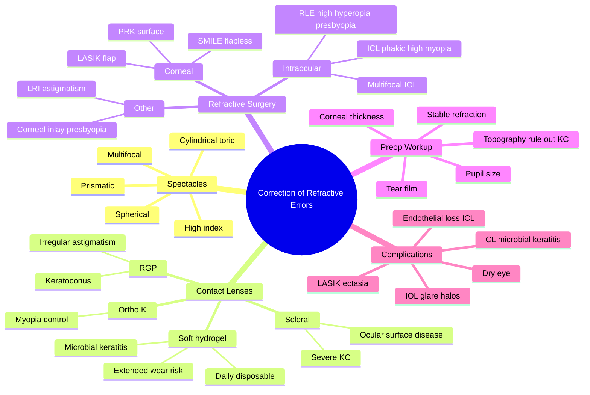

# Correction of Refractive Errors

Related: [[Myopia]], [[Hyperopia]], [[Astigmatism]], [[Presbyopia]], [[Keratoconus]]

> [!tip] **FCPS/MRCP Priority: CRITICAL**
> Master the principles and options for correcting refractive errors: spectacles, contact lenses (soft, RGP, scleral), and refractive surgery (LASIK, PRK, SMILE, ICL, RLE). Know indications, contraindications, and complications.

---

## Learning Objectives
- [ ] Describe spectacle lens types and prescriptions
- [ ] Compare contact lens options
- [ ] List refractive surgery techniques and indications
- [ ] Recognise complications of each modality
- [ ] Choose appropriate correction for different patients
- [ ] Apply pre-operative workup for refractive surgery
- [ ] Identify red flags for contact lens complications

---

## 1. Spectacles

### Lens Types
- **Spherical:** Single power (myopia/hyperopia)
- **Cylindrical (toric):** Astigmatism correction
- **Prismatic:** For strabismus/diplopia
- **Multifocal:** Bifocal, trifocal, progressive (no line)
- **High-index:** Thinner for high prescriptions

### Prescriptions
- **OD (oculus dexter):** Right eye
- **OS (oculus sinister):** Left eye
- **OU (oculus uterque):** Both eyes
- **Sphere (Sph):** Magnitude
- **Cylinder (Cyl):** Astigmatism power
- **Axis:** 0–180° direction of cylinder
- **Add:** Reading addition (presbyopia)
- **Prism:** Base direction (BO, BI, BU, BD)

---

## 2. Contact Lenses

### Soft Contact Lenses
- **Hydrogel or silicone hydrogel**
- Daily disposable, 2-week, monthly, extended wear
- Toric options for astigmatism
- Multifocal options for presbyopia
- **Complications:** CL-related dry eye, GPC (giant papillary conjunctivitis), microbial keratitis (especially with sleeping in lenses), Acanthamoeba

### Rigid Gas Permeable (RGP)
- Smaller, hard lens
- Better optics, especially for irregular astigmatism (keratoconus)
- Longer adaptation
- **Complications:** Initial discomfort, 3-and-9 o'clock staining, decentration

### Scleral Lenses
- Large-diameter RGP that vaults cornea, lands on sclera
- Used for: severe keratoconus, irregular astigmatism, ocular surface disease (Stevens-Johnson, GVHD, severe dry eye)
- Continuously bathes cornea in fluid reservoir

### Special Types
- **Orthokeratology (Ortho-K):** RGP worn overnight to temporarily reshape cornea (myopia control)
- **Hybrid:** RGP centre, soft skirt
- **Piggyback:** RGP on top of soft

---

## 3. Refractive Surgery

### Corneal-based

#### LASIK (Laser In-situ Keratomileusis)
- Flap created (microkeratome or femtosecond)
- Excimer laser ablation of stroma
- **Indications:** Myopia up to -10 D, hyperopia up to +4 D, astigmatism up to 5 D
- **Advantages:** Quick recovery, minimal pain
- **Complications:** Flap complications, dry eye, ectasia, halos, diffuse lamellar keratitis (DLK), infection

#### PRK (Photorefractive Keratectomy)
- Surface ablation, no flap
- For thinner corneas, low myopia
- **Complications:** Haze, longer recovery, pain, regression

#### SMILE (Small Incision Lenticule Extraction)
- Femtosecond laser creates lenticule, removed through small incision
- Flapless, less dry eye
- For myopia (and myopic astigmatism)

#### ICL (Implantable Collamer Lens)
- Phakic IOL placed behind iris, in front of lens
- For high myopia (>-8 to -10 D), thin corneas
- Reversible
- **Complications:** Cataract, glaucoma, endothelial loss

#### Refractive Lens Exchange (RLE)
- Lens removed, IOL inserted
- For high hyperopia, presbyopia
- Multifocal/EDOF IOLs available
- Loss of accommodation (intraocular surgery)

### Other Procedures
- **Corneal inlays (KAMRA, Raindrop):** Presbyopia, depth of focus
- **Limbal relaxing incisions (LRIs):** Astigmatism
- **Conductive keratoplasty (CK):** Historical, hyperopia

---

## 4. Choice of Correction — Summary

| Patient | Best Option |
|---------|-------------|
| Child with progressive myopia | Glasses, atropine, contact lens (MiSight) |
| Adult with low myopia | Glasses, contact lens, LASIK/SMILE |
| Adult with high myopia (-10) | ICL, RLE |
| Adult with hyperopia | Glasses, contact lens, LASIK (low) or RLE (high) |
| Astigmatism | Toric glasses/CL, toric IOL, LASIK with astigmatic correction |
| Presbyopia (emmetrope) | Reading glasses, multifocal CL, multifocal IOL |
| Presbyopia (myope) | Monovision contact lens, monovision LASIK |
| Keratoconus | RGP, scleral lens, CXL, keratoplasty |
| Post-cataract, astigmatism | Toric IOL |
| Post-cataract, presbyopia | Multifocal / EDOF IOL |

---

## 5. Refractive Surgery Pre-op Workup

- Refraction (stable ≥1 year)
- Corneal thickness (≥480 µm for LASIK; >400 µm residual stromal bed)
- Topography (exclude keratoconus)
- Pupil size (large pupils → halos)
- Tear film assessment
- IOP, fundus examination
- Contraindications: unstable refraction, keratoconus, severe dry eye, thin cornea, autoimmune, pregnancy

---

## 6. FCPS/MRCP High-Yield Summary

| Topic | Key Points |
|-------|------------|
| Spectacles | Simplest, safe, cosmetic issue |
| Soft CL | Comfortable, but risk of microbial keratitis |
| RGP CL | Better for irregular astigmatism (keratoconus) |
| Scleral lens | Severe ocular surface disease, advanced KC |
| LASIK | Flap, fast recovery, risk of ectasia |
| SMILE | Flapless, less dry eye |
| ICL | High myopia, phakic, reversible |
| RLE | High hyperopia, presbyopia, multifocal IOL |
| Common complication | Dry eye, halos, ectasia (LASIK) |

---

## 7. Viva Questions

1. **Q:** What is the most feared complication of LASIK?
   **A:** Corneal ectasia (progressive steepening, similar to keratoconus), especially in patients with subclinical keratoconus or thin corneas.

2. **Q:** When would you choose ICL over LASIK?
   **A:** High myopia (>-8 to -10 D), thin cornea (<480 µm), dry eye, contact lens intolerance. ICL preserves cornea.

3. **Q:** How do scleral lenses work?
   **A:** Large rigid lens vaults the cornea and lands on sclera; the fluid reservoir continuously bathes and protects the cornea. Used for severe KC, ocular surface disease.

---

## 11. Common Confusions / Exam Traps

| Confusion | Clarification |
|-----------|---------------|
| "LASIK is for everyone" | NO — must have stable refraction, adequate corneal thickness, no keratoconus |
| "SMILE replaces LASIK entirely" | Not yet — currently for myopia and myopic astigmatism only; not for hyperopia |
| "ICL is permanent" | NO — it is reversible (can be removed) |
| "Multifocal IOLs have no drawbacks" | WRONG — risk of glare, halos, contrast loss, especially in patients with dry eye or macular disease |
| "RLE = cataract surgery" | Functionally similar but performed in a clear lens; more ethically debated in young patients |
| "Scleral lens = cosmetic lens" | NO — large-diameter RGP for severe ocular surface disease, not cosmetic |
| "LASIK is flapless" | WRONG — LASIK involves a flap; SMILE and PRK are flapless |
| "Daily disposables have no infection risk" | Risk is lowest with dailies, but not zero; poor hygiene still causes keratitis |
| "CXL is refractive surgery" | It's a procedure to HALT ectasia in keratoconus; not primarily for refractive correction |

---

## 12. Mnemonics

1. **"LASIK Has A Flap, SMILE Has No Flap, PRK Scrapes"** — flap vs flapless corneal surgery
2. **"ICL = Inside eye, Cornea preserved, Lens in place"** — phakic IOL for high myopia
3. **"Scleral lens = Scuba mask for the eye"** — vaults cornea, fluid reservoir bathes the surface

---

## 13. Mind Map

---

## 14. One-Page Revision Card

| **Topic** | **Correction of Refractive Errors** |
|-----------|-------------------------------------|
| **Spectacles** | Simplest; spherical, cylindrical, multifocal, prismatic |
| **Soft CL** | Comfortable; daily disposable safest; extended wear → microbial keratitis |
| **RGP CL** | Best for irregular astigmatism (keratoconus) |
| **Scleral CL** | Severe KC, ocular surface disease |
| **LASIK** | Flap; fast recovery; risk of ectasia |
| **PRK** | Surface ablation; for thin corneas |
| **SMILE** | Flapless; less dry eye |
| **ICL** | Phakic; high myopia; reversible |
| **RLE** | Lens exchange; high hyperopia/presbyopia |
| **LASIK residual bed** | ≥280–300 µm |
| **LASIK cornea** | ≥480 µm |
| **Most feared LASIK complication** | Corneal ectasia |

---

## Spaced Repetition Trackers

### 24-Hour Recall Prompts
- [ ] List 3 options for correcting myopia
- [ ] State the most feared complication of LASIK
- [ ] State when ICL is preferred over LASIK
- [ ] List 4 contact lens complications
- [ ] State the minimum residual stromal bed for LASIK

### Revision Schedule
- [ ] **Day 1** completed (creation + 24h recall)
- [ ] **Day 3** revision completed
- [ ] **Day 7** revision completed
- [ ] **Day 15** revision completed
- [ ] **Day 30** revision completed
- [ ] **Day 90** revision completed

---

## Must Know / Should Know / Nice to Know

### Must Know (Core for passing)
- [x] Spectacle lens types
- [x] Contact lens types (soft, RGP, scleral) and key complications
- [x] LASIK vs PRK vs SMILE
- [x] ICL and RLE indications
- [x] Most feared LASIK complication: ectasia
- [x] Most common CL complication: microbial keratitis (Pseudomonas)
- [x] Minimum corneal thickness and residual stromal bed for LASIK

### Should Know (High probability)
- [x] Pre-op workup for refractive surgery
- [x] Toric IOL for cataract with astigmatism
- [x] Multifocal IOL advantages and drawbacks
- [x] Monovision concept
- [x] Orthokeratology (myopia control in children)

### Nice to Know (Differentiator)
- [ ] Corneal inlays (KAMRA, Raindrop)
- [ ] EDOF (extended depth of focus) IOLs
- [ ] MiSight contact lens for paediatric myopia control
- [ ] Conductive keratoplasty (historical)

---

## My Weak Points
- [ ] Add personal weak areas here

---

## Self-Test Scorecard

| Section | Score /5 |
|---------|----------|
| Understanding: | /10 |
| Recall: | /10 |
| MCQ Performance: | /10 |
| SBA Performance: | /10 |
| Viva Confidence: | /10 |
| Total: | /50 |

> [!tip] **Interpretation:** <35 = weak topic, 35-44 = acceptable but insecure, 45+ = strong exam-ready topic.

---

## Exam Answer Modes

### Long Answer Skeleton
1. Introduction — refractive errors and their correction options
2. Spectacles — lens types, prescription format
3. Contact lenses — soft (with complications), RGP, scleral, special types (Ortho-K)
4. Refractive surgery — corneal (LASIK, PRK, SMILE) and intraocular (ICL, RLE)
5. Choice of correction — patient-specific (table of options)
6. Pre-operative workup — refraction stability, corneal thickness, topography, pupil size
7. Complications — ectasia (LASIK), microbial keratitis (CL), glare/halos (multifocal IOL)

### Short Note Skeleton
- List 3 spectacle types and 3 contact lens types
- Compare LASIK vs PRK vs SMILE in one table
- State the most feared complication of LASIK and how to prevent it

### Viva One-Liners
- **Q:** Most feared LASIK complication? → **A:** Corneal ectasia
- **Q:** When to choose ICL over LASIK? → **A:** High myopia (>−8 to −10 D), thin cornea, dry eye
- **Q:** Indications for scleral lens? → **A:** Severe keratoconus, ocular surface disease
- **Q:** Minimum corneal thickness for LASIK? → **A:** ≥480 µm
- **Q:** Minimum residual stromal bed? → **A:** ≥280–300 µm

### Ward-Case Discussion Points
- Discuss spectacle vs contact lens vs surgery for a young myope
- Counsel a contact lens wearer with red eye (microbial keratitis, Acanthamoeba)
- Discuss ICL vs LASIK in a patient with high myopia and thin cornea
- Discuss multifocal vs monofocal IOL in a cataract patient

### Last-Night-Before-Exam Sheet
- Top 3 facts: LASIK flap + ectasia, ICL for high myopia, daily disposable CL = lowest infection risk
- 1 mnemonic: "LASIK flap, SMILE flapless, PRK scrapes"
- Must-know: residual stromal bed ≥280–300 µm, corneal thickness ≥480 µm
- Most common CL keratitis organism: Pseudomonas

---

## Summary

Spectacles remain the simplest correction. Contact lenses (soft, RGP, scleral) suit active patients. Refractive surgery (LASIK, PRK, SMILE, ICL, RLE) provides freedom from correction for suitable candidates. Each option has specific indications and complications. Patient selection is critical.

## MCQs (10)

1. **Question:** The most serious long-term complication of LASIK is:
   **Options:** A. Dry eye B. Halos C. Corneal ectasia D. Flap striae E. Cataract
   **Answer:** C
   **Explanation:** Ectasia is the most feared complication of LASIK, may require corneal transplant. Risk is higher in thin corneas and subclinical keratoconus.

2. **Question:** Scleral contact lenses are most useful in:
   **Options:** A. Simple myopia B. Presbyopia C. Severe keratoconus / ocular surface disease D. Aphakia E. Hyperopia
   **Answer:** C
   **Explanation:** Scleral lenses vault over the cornea and provide a fluid reservoir, protecting the ocular surface in severe KC and surface disease (e.g., Stevens-Johnson syndrome).

3. **Question:** ICL is indicated in:
   **Options:** A. Low myopia B. High myopia, thin cornea C. Presbyopia D. Hyperopia E. Children
   **Answer:** B
   **Explanation:** Phakic IOL is preferred for high myopia (>−8 to −10 D) when the cornea is too thin for LASIK or in dry eye.

4. **Question:** Minimum residual stromal bed for LASIK is:
   **Options:** A. 100 µm B. 200 µm C. 280–300 µm D. 400 µm E. 500 µm
   **Answer:** C
   **Explanation:** A residual stromal bed of ≥280–300 µm is required to maintain corneal biomechanical integrity and prevent ectasia.

5. **Question:** The contact lens type with highest risk of microbial keratitis is:
   **Options:** A. Daily disposable soft B. RGP C. Extended-wear soft D. Scleral E. Toric soft
   **Answer:** C
   **Explanation:** Overnight wear is the biggest risk factor for bacterial (especially Pseudomonas) and Acanthamoeba keratitis.

6. **Question:** Which of the following refractive surgeries is flapless?
   **Options:** A. LASIK B. PRK C. SMILE D. Both B and C E. LASEK
   **Answer:** D
   **Explanation:** PRK is surface ablation; SMILE removes a lenticule through a small incision. Both are flapless.

7. **Question:** In a spectacle prescription, "OD" refers to:
   **Options:** A. Left eye B. Right eye C. Both eyes D. Sphere E. Cylinder
   **Answer:** B
   **Explanation:** OD = oculus dexter (right eye); OS = oculus sinister (left eye); OU = oculus uterque (both eyes).

8. **Question:** The most common cause of contact lens–related bacterial keratitis is:
   **Options:** A. Staphylococcus aureus B. Streptococcus pneumoniae C. Pseudomonas aeruginosa D. Moraxella E. Haemophilus
   **Answer:** C
   **Explanation:** Pseudomonas aeruginosa is the most common and most feared cause of contact lens–related bacterial keratitis, often associated with overnight wear.

9. **Question:** SMILE differs from LASIK in that SMILE:
   **Options:** A. Has a flap B. Has higher ectasia risk C. Is flapless and has less dry eye D. Is for hyperopia only E. Requires IOL implantation
   **Answer:** C
   **Explanation:** SMILE uses a femtosecond laser to create and remove a lenticule through a small incision — flapless, preserving more corneal nerves, with less dry eye.

10. **Question:** A 60-year-old with cataract and 2 D of corneal astigmatism. The best IOL choice to address both cataract and astigmatism is:
    **Options:** A. Monofocal spherical IOL B. Monofocal toric IOL C. Multifocal IOL D. Multifocal toric IOL E. Iris-fixated IOL
    **Answer:** D
    **Explanation:** A multifocal toric IOL corrects both the cataract (apheric power) and the corneal astigmatism, providing spectacle independence for distance and near.

## SBA Questions (10)

1. **Scenario:** A 30-year-old contact lens wearer has sudden pain, red eye, hypopyon, central corneal ulcer.
   **Question:** Most likely organism?
   **Options:** A. HSV B. Streptococcus C. Pseudomonas D. Fungus E. Acanthamoeba
   **Answer:** C
   **Explanation:** Pseudomonas aeruginosa is the most common cause of contact lens–related bacterial keratitis. Hypopyon and central ulcer are typical.

2. **Scenario:** A 25-year-old wants refractive surgery. Cornea 480 µm, myopia -8 D, thin cornea.
   **Question:** Best option?
   **Options:** A. LASIK B. PRK C. ICL D. RLE E. Glasses only
   **Answer:** C
   **Explanation:** High myopia + thin cornea = ICL (phakic IOL) preferred. LASIK is contraindicated (residual stromal bed would be <300 µm).

3. **Scenario:** A 35-year-old with keratoconus has poor RGP fit and is intolerant of RGP lenses. Best contact lens option?
   **Options:** A. Soft toric contact lens B. Scleral contact lens C. Standard spectacles D. Stop contact lens wear E. Topical lubricants only
   **Answer:** B
   **Explanation:** Scleral lenses vault the entire cornea and provide a fluid reservoir — comfortable and optically effective for advanced/intolerant keratoconus.

4. **Scenario:** A 50-year-old cataract patient wants spectacle independence. After discussion, a multifocal IOL is implanted. She returns complaining of severe glare and halos at night.
   **Question:** Most likely cause?
   **Options:** A. Glaucoma B. Retinal detachment C. Multifocal IOL splitting light into multiple foci D. Corneal oedema E. Optic neuritis
   **Answer:** C
   **Explanation:** Multifocal IOLs split incoming light into multiple focal points (distance, intermediate, near) — a small amount of light is scattered, causing glare and halos, especially at night.

5. **Scenario:** A 28-year-old with high myopia (-12 D) and contact lens intolerance seeks refractive surgery. Corneal thickness is 450 µm.
   **Question:** Best option?
   **Options:** A. LASIK B. PRK C. ICL D. RLE E. Glasses only
   **Answer:** C
   **Explanation:** High myopia + thin cornea = ICL. LASIK and PRK are contraindicated due to insufficient residual stromal bed.

6. **Scenario:** A 10-year-old with progressive myopia. Parents want to slow progression.
   **Options:** A. Standard spectacles only B. Atropine 0.01% eye drops and MiSight contact lens C. LASIK D. ICL E. Corneal inlay
   **Answer:** B
   **Explanation:** Low-dose atropine and dual-focus soft contact lenses (MiSight) are evidence-based interventions for myopia control in children. Refractive surgery is contraindicated in growing eyes.

7. **Scenario:** A 45-year-old with myopia -5 D wants to eliminate spectacle dependence. After LASIK, distance vision is good but near vision is blurry.
   **Question:** Most likely cause?
   **Options:** A. Surgical failure B. Post-LASIK ectasia C. Unmasked presbyopia D. Corneal haze E. Dry eye
   **Answer:** C
   **Explanation:** LASIK corrects distance vision but does not affect accommodation. The patient is now 45 and losing accommodative reserve — presbyopia is unmasked.

8. **Scenario:** A 32-year-old with keratoconus has progressive steepening on tomography.
   **Question:** Best intervention to halt progression?
   **Options:** A. Topical steroid B. Corneal cross-linking (CXL) C. Penetrating keratoplasty D. Reading glasses E. LASIK
   **Answer:** B
   **Explanation:** CXL (riboflavin + UV-A) increases collagen cross-links and halts keratoconus progression. It is the only disease-modifying treatment.

9. **Scenario:** A 60-year-old with cataract chooses a monofocal IOL set for distance. He wants to read without glasses.
   **Question:** Best non-surgical option?
   **Options:** A. Multifocal IOL exchange B. Reading glasses (+2.5 D add) C. No correction D. Atropine drops E. Scleral lens
   **Answer:** B
   **Explanation:** Monofocal IOL set for distance → patient needs a +2.5 D reading add. Reading glasses are the simplest and safest.

10. **Scenario:** A 26-year-old contact lens wearer presents with severe pain, photophobia, ring infiltrate, and history of cleaning lenses with tap water.
    **Question:** Most likely organism?
    **Options:** A. Pseudomonas B. Streptococcus C. Acanthamoeba D. HSV E. Fungus
    **Answer:** C
    **Explanation:** Acanthamoeba keratitis is classically associated with contact lens wear and exposure to contaminated water (tap water, swimming pools). Ring infiltrate is characteristic.

## Flashcards

- **Q:** What is the most feared long-term complication of LASIK?
  **A:** Corneal ectasia (progressive steepening, may require corneal transplant).
- **Q:** When is ICL preferred over LASIK?
  **A:** High myopia (>−8 to −10 D), thin cornea (<480 µm), dry eye, contact lens intolerance.
- **Q:** What is the minimum residual stromal bed for LASIK?
  **A:** ≥280–300 µm.
- **Q:** What is the most common organism in contact lens–related bacterial keratitis?
  **A:** Pseudomonas aeruginosa.
- **Q:** What is Acanthamoeba keratitis associated with?
  **A:** Contact lens wear, exposure to tap water, ring infiltrate on the cornea.

## Answer Key with Explanations

### MCQs
1. C — Ectasia is the most feared LASIK complication
2. C — Scleral lenses for severe KC and ocular surface disease
3. B — ICL for high myopia with thin cornea
4. C — Residual stromal bed ≥280–300 µm
5. C — Extended-wear soft CL has the highest keratitis risk
6. D — PRK (surface) and SMILE (small incision) are flapless
7. B — OD = oculus dexter = right eye
8. C — Pseudomonas is the most common CL keratitis organism
9. C — SMILE is flapless with less dry eye
10. D — Multifocal toric IOL corrects both cataract and astigmatism

### SBAs
1. C — Pseudomonas in CL-related bacterial keratitis
2. C — High myopia + thin cornea = ICL
3. B — Scleral lens for RGP-intolerant keratoconus
4. C — Multifocal IOL splits light → glare, halos
5. C — ICL for high myopia with thin cornea
6. B — Atropine + MiSight for paediatric myopia control
7. C — Presbyopia unmasked after LASIK
8. B — CXL halts keratoconus progression
9. B — Monofocal IOL for distance → +2.5 D reading add
10. C — Acanthamoeba with tap water + CL wear

## Tags
#medicine #davidson #ophthalmology #refractive #correction #LASIK #fcps #mrcp
