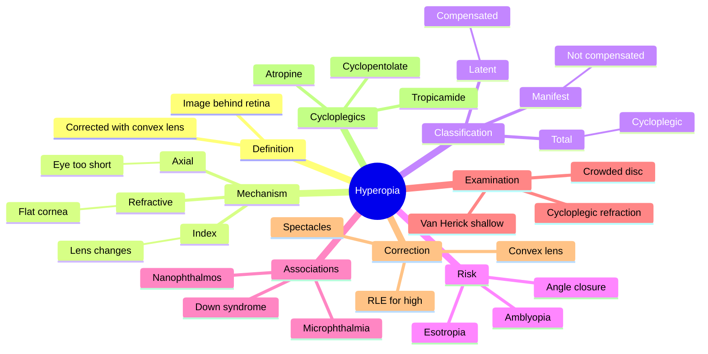

# Hyperopia

Related: [[Myopia]], [[Presbyopia]], [[Astigmatism]]

> [!tip] **FCPS/MRCP Priority: HIGH**
> Hyperopia (long-sightedness) is less commonly symptomatic in young patients (accommodation compensates) but becomes more apparent with age (presbyopia). Important risk for angle-closure glaucoma.

---

## Learning Objectives
- [ ] Define hyperopia and classify its types
- [ ] Distinguish latent, manifest and total hyperopia
- [ ] Recognise risk for angle-closure glaucoma
- [ ] Describe correction options
- [ ] Identify hyperopic complications in children and adults
- [ ] Describe the role of cycloplegic refraction

---

## 1. Definition

- **Hyperopia (long-sightedness, hypermetropia):** Image focused behind the retina
- Distant objects may be clear (with accommodation), near objects blurred
- Corrected with convex (plus/converging) lens

---

## 2. Classification

### By Mechanism
- **Axial:** Eye too short (<22 mm) — most common
- **Refractive:** Insufficient refractive power (flat cornea)
- **Index:** Reduced refractive index (e.g., lens dislocation posteriorly)

### By Degree
- Low: +0.5 to +3 D
- Moderate: +3 to +5 D
- High: >+5 D

### By Component
- **Total hyperopia:** Cycloplegic refraction
- **Latent hyperopia:** Compensated by accommodation (ciliary tone) — revealed by cycloplegia
- **Manifest hyperopia:** Not compensated — must correct for clear vision

---

## 3. Aetiology / Associations

- **Physiological:** Most infants hyperopic at birth, emmetropisation through childhood
- **Familial**
- **Microphthalmia:** Small eyes
- **Aphakia:** After cataract surgery
- **Orbital tumours:** Pushing globe forward
- **Conditions:** Down syndrome, nanophthalmos

---

## 4. Clinical Features

### Children / Young Adults
- Often asymptomatic (accommodation compensates)
- May develop accommodative esotropia (eye turns in when accommodating)
- Reading difficulties, eyestrain, headaches

### Adults / Older
- Difficulty with near work first (presbyopia unmasks hyperopia)
- Asthenopia (eyestrain)
- Frontal headache after reading

### Complications
- **Angle-closure glaucoma:** ↑ risk (shallow AC, smaller eye)
- **Accommodative esotropia** in children
- **Amblyopia** (if unilateral, large, uncorrected)
- **Maculopathy** in very high hyperopia (small eye, crowded disc)

---

## 5. Investigations

- **Visual acuity:** Distance may be normal, near reduced
- **Refraction (retinoscopy):** Reveals latent component only after cycloplegia
- **Cycloplegic refraction** (cyclopentolate 1% / atropine 1% in children) — assesses total hyperopia
- **Slit-lamp:** Shallow anterior chamber, narrow angle
- **Van Herick:** < 1/4 = shallow AC, caution with dilation
- **IOP** and **gonioscopy** if shallow AC
- **Fundus:** May show crowded disc (pseudopapilloedema)
- **Axial length (A-scan):** < 22 mm in axial hyperopia

---

## 6. Differential Diagnosis

| Condition | Distinguishing |
|-----------|---------------|
| Presbyopia | Age-related, due to lens sclerosis — not true hyperopia |
| Accommodative insufficiency | Reduced amplitude, not true refractive hyperopia |
| Myopia (mis-diagnosed) | Convex lens worsens vision in myopia |
| Aphakia (post-surgery) | No lens — high hyperopia |

---

## 7. Management

### Optical Correction
- **Spectacles:** Convex (plus) lenses
- **Contact lenses:** Less common (low/no myopia tolerance issue)
- **Refractive surgery:** LASIK, PRK (low/moderate), RLE (high)

### Special Considerations
- **Cycloplegic refraction** in children (to assess latent component)
- **Partial correction** initially in young adults (avoid accommodation spasm)
- **Full correction** in older adults (less accommodative reserve)

### Cycloplegics Used
- Atropine 1% (longest, deepest cycloplegia)
- Cyclopentolate 1% (rapid, 24h)
- Tropicamide 0.5–1% (mild, ~6h)
- Used for refraction in children, amblyopia treatment

---

## 8. Complications

- **Angle-closure glaucoma** (shallow AC, narrow angle)
- **Accommodative esotropia** in children
- **Amblyopia** (unilateral, large, uncorrected)
- **Maculopathy** in very high hyperopia
- **Asthenopia, frontal headache** with reading
- **Crowded disc / pseudopapilloedema**

---

## 9. Red Flags / Emergencies

- **Hyperope with red painful eye + halos + ↓ VA** → suspect acute angle-closure glaucoma
- **Hyperope + IOP spike** → angle closure
- **Sudden onset headache, nausea, haloes** → angle closure emergency
- **Crowded disc + reduced vision** → differentiate from true papilloedema
- **Hyperope child with persistent esotropia** → risk of amblyopia — needs urgent correction + occlusion therapy

---

## 10. FCPS/MRCP High-Yield Summary

| Topic | Key Points |
|-------|------------|
| Hyperopia | Image behind retina, corrected with convex lens |
| Latent hyperopia | Masked by accommodation; revealed by cycloplegia |
| Risk factor | Shallow AC → angle closure |
| Children | Often asymptomatic; risk of accommodative esotropia |
| Adult | Difficulty with near work (presbyopia unmasks it) |

---

## 11. Viva Questions

1. **Q:** What is latent hyperopia?
   **A:** Hyperopia compensated by ciliary body tone (accommodation), not measured without cycloplegia.

2. **Q:** Why is hyperopia a risk factor for angle-closure glaucoma?
   **A:** Smaller eye → shallow anterior chamber → narrow angle → pupillary block.

3. **Q:** How is hyperopia corrected in a child vs an adult?
   **A:** Child: full cycloplegic correction (after cyclopentolate), part-time wear. Adult: full correction but consider under-correction initially to avoid accommodation spasm.

4. **Q:** What is the difference between manifest and total hyperopia?
   **A:** Manifest = not compensated by accommodation (must be corrected for clear vision). Total = full hyperopia measured under cycloplegia. Latent = the difference (compensated).

5. **Q:** Why is hyperopia often asymptomatic in children?
   **A:** Children have a large amplitude of accommodation that can compensate for moderate hyperopia.

---

## 12. Common Confusions / Exam Traps

| Confusion | Clarification |
|-----------|---------------|
| "Hyperopia = far-sighted = good distance vision" | May see far with accommodation; near always blurred (with effort) |
| "Cycloplegia is optional" | Essential in children to uncover latent hyperopia |
| "Plus lens for myopia" | NO — plus (convex) for hyperopia; minus (concave) for myopia |
| "All hyperopes get angle closure" | Risk ↑ but not all — small, shallow AC, older age, female = highest risk |
| "Hyperopia = presbyopia" | Hyperopia = refractive error; presbyopia = age-related loss of accommodation |
| "Van Herick < 1/4 means open angle" | Van Herick < 1/4 = SHALLOW AC — caution; do gonioscopy before dilating |
| "Atropine is for uveitis only" | Atropine is also used for cycloplegic refraction in children |

---

## 13. Mnemonics

1. **"Hyperopia = PLUS"** — convex (plus) lens corrects hyperopia (image BEHIND retina, pull forward)
2. **"Hyperopia = High risk ACG"** — small eye, shallow AC, narrow angle → angle-closure glaucoma
3. **"LATent = LATe reveal"** — latent hyperopia revealed only AFTER cycloplegia
4. **"Farsighted = Far is fine (with effort), Near is hard"** — hyperopes see far with accommodation; near always difficult

---

## 14. Mind Map

---

## 15. One-Page Revision Card

| **Topic** | **Hyperopia** |
|-----------|---------------|
| **Definition** | Image focused behind retina |
| **Symptom** | Near vision blurred; distance OK with accommodation |
| **Correction** | Convex (plus) lens |
| **Mechanism (most common)** | Axial (eye too short < 22 mm) |
| **Latent hyperopia** | Revealed only after cycloplegia |
| **Risk** | Angle-closure glaucoma, accommodative esotropia, amblyopia |
| **Children** | Often asymptomatic; full cycloplegic correction |
| **Adults** | Presbyopia unmasks hyperopia; full correction |
| **Cycloplegic for refraction** | Atropine / cyclopentolate / tropicamide |
| **Viva Pearl** | "Hyperopia = PLUS, risk of angle closure" |

---

## Spaced Repetition Trackers

### 24-Hour Recall Prompts
- [ ] Define hyperopia and identify the corrective lens
- [ ] State the three types by component (latent, manifest, total)
- [ ] Explain why cycloplegia is needed in children
- [ ] List 3 complications of hyperopia
- [ ] Identify the mechanism of angle-closure risk in hyperopia
- [ ] Name 3 cycloplegic agents used in refraction

### Revision Schedule
- [ ] **Day 1** completed (creation + 24h recall)
- [ ] **Day 3** revision completed
- [ ] **Day 7** revision completed
- [ ] **Day 15** revision completed
- [ ] **Day 30** revision completed
- [ ] **Day 90** revision completed

---

## Must Know / Should Know / Nice to Know

### Must Know (Core for passing)
- [x] Definition (image behind retina, convex lens)
- [x] Latent vs manifest hyperopia
- [x] Risk of angle-closure glaucoma
- [x] Cycloplegic refraction in children
- [x] Accommodative esotropia

### Should Know (High probability)
- [x] Van Herick grading
- [x] Cycloplegics (atropine, cyclopentolate, tropicamide)
- [x] Presbyopia unmasks hyperopia
- [x] Amblyopia risk
- [x] Refractive surgery options

### Nice to Know (Differentiator)
- [ ] Axial length < 22 mm
- [ ] RLE for high hyperopia
- [ ] Pseudopapilloedema (crowded disc)
- [ ] Partial vs full correction rationale

---

## My Weak Points
- [ ] Add personal weak areas here

---

## Self-Test Scorecard

| Section | Score /5 |
|---------|----------|
| Understanding: | /10 |
| Recall: | /10 |
| MCQ Performance: | /10 |
| SBA Performance: | /10 |
| Viva Confidence: | /10 |
| Total: | /50 |

> [!tip] **Interpretation:** <35 = weak topic, 35-44 = acceptable but insecure, 45+ = strong exam-ready topic.

---

## Exam Answer Modes

### Long Answer Skeleton
1. Definition (image behind retina, convex lens)
2. Classification — by mechanism (axial, refractive, index), degree, component (latent, manifest, total)
3. Aetiology (physiological, familial, microphthalmia, aphakia, syndromes)
4. Clinical features — children (asymptomatic, esotropia) vs adults (asthenopia, headache)
5. Investigations (refraction, cycloplegic, Van Herick, gonioscopy, fundus)
6. Complications (angle closure, esotropia, amblyopia)
7. Management — optical correction, cycloplegic refraction, partial vs full correction

### Short Note Skeleton
- Definition + mechanism + correction
- Latent vs manifest vs total hyperopia
- Angle-closure risk and Van Herick
- Cycloplegic refraction in children

### Viva One-Liners
- **Q:** What is hyperopia? → **A:** Image focused behind retina; corrected with convex (plus) lens.
- **Q:** What is latent hyperopia? → **A:** Hyperopia masked by accommodation, revealed by cycloplegia.
- **Q:** Why is hyperopia a risk for angle-closure? → **A:** Small eye → shallow AC → narrow angle → pupillary block.
- **Q:** Cycloplegic agents? → **A:** Atropine 1%, cyclopentolate 1%, tropicamide 0.5–1%.
- **Q:** What is accommodative esotropia? → **A:** Esotropia on accommodation due to uncorrected hyperopia (high AC/A ratio).

### Ward-Case Discussion Points
- Distinguish hyperopia from presbyopia
- Cycloplegic refraction in children
- Examine AC depth (Van Herick), do gonioscopy if shallow
- Discuss risk of angle closure in older hyperopes
- Counsel on correction strategies and amblyopia prevention

### Last-Night-Before-Exam Sheet
- **Top 5 facts:**
  1. Hyperopia = image behind retina, corrected with convex (plus) lens
  2. Latent hyperopia revealed by cycloplegia
  3. Risk of angle-closure glaucoma (shallow AC)
  4. Children often asymptomatic — risk of accommodative esotropia
  5. Cycloplegics: atropine, cyclopentolate, tropicamide
- **Mnemonic:** "Hyperopia = PLUS, ACG risk"
- **Must-know viva:** Why hyperopia causes angle closure

---

## Summary

Hyperopia is corrected with convex lenses. Latent component requires cycloplegia for full assessment. Hyperopia is a risk factor for angle-closure glaucoma and accommodative esotropia. Children usually asymptomatic; hyperopia becomes symptomatic as accommodation fails with age.

## MCQs (10)

1. **Question:** Hyperopia is corrected with:
   **Options:** A. Convex lens B. Concave lens C. Cylinder D. Prism E. Plano
   **Answer:** A
   **Explanation:** Convex (converging) lens brings focal point forward onto retina.

2. **Question:** Latent hyperopia is revealed by:
   **Options:** A. Snellen chart B. Tonometry C. Cycloplegia D. Perimetry E. Gonioscopy
   **Answer:** C
   **Explanation:** Cycloplegia (atropine, cyclopentolate) paralyses accommodation.

3. **Question:** A risk factor for angle-closure glaucoma is:
   **Options:** A. Myopia B. Hyperopia C. Astigmatism D. Emmetropia E. Presbyopia
   **Answer:** B
   **Explanation:** Hyperopia = shallow AC = angle closure risk.

4. **Question:** In a 4-year-old with hyperopia, the appropriate refraction technique is:
   **Options:** A. Manifest refraction B. Cycloplegic refraction C. Autorefraction only D. Trial frame E. None
   **Answer:** B
   **Explanation:** Cycloplegia essential in children due to high accommodation.

5. **Question:** The most common mechanism of hyperopia is:
   **Options:** A. Refractive B. Index C. Axial D. Positional E. Mixed
   **Answer:** C
   **Explanation:** Axial hyperopia (eye too short, < 22 mm) is the most common type.

6. **Question:** Van Herick grade < 1/4 indicates:
   **Options:** A. Open angle, no concern B. Deep anterior chamber C. Shallow anterior chamber — caution with dilation D. Normal AC D. Cataract E. Glaucoma
   **Answer:** C
   **Explanation:** Van Herick < 1/4 = shallow AC, narrow angle, do gonioscopy before dilating.

7. **Question:** Accommodative esotropia in a child is associated with:
   **Options:** A. Myopia B. Hyperopia C. Astigmatism D. Emmetropia E. Presbyopia
   **Answer:** B
   **Explanation:** Hyperopia → accommodation → excess convergence → esotropia.

8. **Question:** The deepest cycloplegia is produced by:
   **Options:** A. Tropicamide B. Cyclopentolate C. Atropine 1% D. Phenylephrine E. Pilocarpine
   **Answer:** C
   **Explanation:** Atropine 1% gives the deepest and longest cycloplegia (up to 2 weeks).

9. **Question:** Crowded disc (pseudopapilloedema) in high hyperopia must be distinguished from:
   **Options:** A. Cataract B. Papilloedema / optic neuritis C. Retinal detachment D. Macular hole E. Glaucoma
   **Answer:** B
   **Explanation:** Crowded disc can mimic true papilloedema; clinical correlation + imaging differentiates.

10. **Question:** A 50-year-old hyperope reports difficulty reading. He had no previous glasses. Best explanation:
    **Options:** A. Cataract B. Presbyopia unmasks hyperopia C. Acute angle closure D. Macular degeneration E. Retinal detachment
    **Answer:** B
    **Explanation:** With age, accommodation declines; latent hyperopia becomes manifest, near vision fails first.

## SBA Questions (10)

1. **Scenario:** A 5-year-old has esotropia on attempted near fixation, with hyperopia +4 D.
   **Question:** Most likely diagnosis?
   **Options:** A. CN VI palsy B. Accommodative esotropia C. Sensory esotropia D. Infantile esotropia E. Duane syndrome
   **Answer:** B
   **Explanation:** Hyperopia → excessive accommodation → convergence → esotropia (DDO/DDA ratio).

2. **Scenario:** A 60-year-old hyperope presents with severe right eye pain, halos around lights, nausea, and IOP 56 mmHg. AC is shallow.
   **Question:** Most likely diagnosis?
   **Options:** A. Acute angle-closure glaucoma B. Open-angle glaucoma C. Uveitis D. Endophthalmitis E. Conjunctivitis
   **Answer:** A
   **Explanation:** Pain, halos, nausea, ↑ IOP, shallow AC = acute angle-closure glaucoma — emergency.

3. **Scenario:** A 4-year-old has +5 D hyperopia on cycloplegic refraction. Manifest refraction is +2 D.
   **Question:** How much is latent hyperopia?
   **Options:** A. +1 D B. +2 D C. +3 D D. +5 D E. +7 D
   **Answer:** C
   **Explanation:** Total (cycloplegic) = manifest + latent. So latent = 5 − 2 = 3 D.

4. **Scenario:** A 30-year-old hyperope with shallow AC is being dilated for fundus exam. Best precaution?
   **Options:** A. No precaution B. Use tropicamide only; check AC depth first; have pilocarpine ready C. Use atropine D. Use phenylephrine E. Avoid dilation altogether
   **Answer:** B
   **Explanation:** Shallow AC + mydriasis → angle closure. Use short-acting mydriatic, check Van Herick, have pilocarpine ready.

5. **Scenario:** A 7-year-old child has unilateral hyperopia +6 D, never worn glasses. Best management to prevent amblyopia?
   **Options:** A. Observation B. Full cycloplegic correction + part-time wear + occlusion therapy if needed C. Surgery D. Contact lens only E. Laser
   **Answer:** B
   **Explanation:** Full correction + occlusion therapy if amblyopia develops.

6. **Scenario:** A 35-year-old hyperope has been wearing +2 D glasses for years. Now presbyopic, needs +3 D for near. Distance correction unchanged.
   **Question:** Best correction?
   **Options:** A. Single-vision distance B. Single-vision near C. Bifocals (distance top, near bottom) D. Progressive addition lenses E. Contact lens only
   **Answer:** C
   **Explanation:** Hyperope + presbyope = needs distance and near correction → bifocals or progressive lenses.

7. **Scenario:** A 55-year-old hyperope (shallow AC) is started on topical atropine for uveitis. Develops eye pain and ↑ IOP.
   **Question:** Mechanism of IOP rise?
   **Options:** A. Open angle B. Pupil block from mydriasis in shallow AC C. Steroid response D. Infection E. Hypotony
   **Answer:** B
   **Explanation:** Atropine → mydriasis → pupillary block in shallow AC → angle closure.

8. **Scenario:** A 4-year-old is being refracted. Cycloplegic refraction is +3 D. Manifest was +1 D.
   **Question:** What is the implication for glasses prescription?
   **Options:** A. Prescribe manifest only (+1 D) B. Prescribe total (+3 D) — but reduce if cannot tolerate C. Prescribe double D D. No glasses E. Refer to ophthalmology only
   **Answer:** B
   **Explanation:** Children — full cycloplegic correction; may under-correct if intolerant to encourage wear.

9. **Scenario:** A 65-year-old hyperope with shallow AC. Best prophylaxis against acute angle closure?
   **Options:** A. Laser peripheral iridotomy (LPI) B. Trabeculectomy C. Topical β-blocker D. Cataract surgery only E. No prophylaxis needed
   **Answer:** A
   **Explanation:** LPI creates a bypass for aqueous flow, prevents pupil block — prophylactic in shallow AC if at risk.

10. **Scenario:** A 25-year-old has +1 D hyperopia, asymptomatic, normal AC.
    **Question:** Best management?
    **Options:** A. Glasses always B. Glasses for near only if symptomatic C. Surgery D. Cycloplegic refraction E. Observation; treat if symptomatic
    **Answer:** E
    **Explanation:** Low hyperopia, asymptomatic, normal AC — observation. Treat if symptomatic (asthenopia, esotropia, headache).

## Flashcards

- **Q:** What is hyperopia?
  **A:** Image focused behind the retina; corrected with convex (plus) lens.
- **Q:** What is latent hyperopia?
  **A:** Hyperopia compensated by accommodation; revealed only after cycloplegia.
- **Q:** Why is hyperopia a risk factor for angle-closure glaucoma?
  **A:** Small eye → shallow AC → narrow angle → pupillary block.
- **Q:** Name 3 cycloplegic agents.
  **A:** Atropine 1% (deepest), cyclopentolate 1% (24 h), tropicamide 0.5–1% (~6 h).
- **Q:** What is accommodative esotropia?
  **A:** Convergent squint in a hyperopic child due to excessive accommodation-convergence linkage.

## Answer Key with Explanations

### MCQs
1. A — Convex (converging) lens corrects hyperopia
2. C — Cycloplegia reveals latent hyperopia
3. B — Hyperopia = shallow AC = ACG risk
4. B — Cycloplegic refraction in children
5. C — Axial hyperopia is most common
6. C — Van Herick < 1/4 = shallow AC
7. B — Hyperopia → accommodative esotropia
8. C — Atropine gives the deepest cycloplegia
9. B — Crowded disc mimics papilloedema
10. B — Presbyopia unmasks hyperopia

### SBAs
1. B — Hyperopia + esotropia on near = accommodative esotropia
2. A — Pain, halos, ↑ IOP, shallow AC = ACG
3. C — Latent = total − manifest = 5 − 2 = 3 D
4. B — Shallow AC → caution with mydriasis
5. B — Full correction + occlusion for amblyopia
6. C — Hyperope + presbyope → bifocals
7. B — Atropine + shallow AC → angle closure
8. B — Full cycloplegic correction in children
9. A — LPI for angle-closure prophylaxis
10. E — Asymptomatic low hyperopia = observation

## Tags
#medicine #davidson #ophthalmology #refractive #hyperopia #fcps #mrcp
