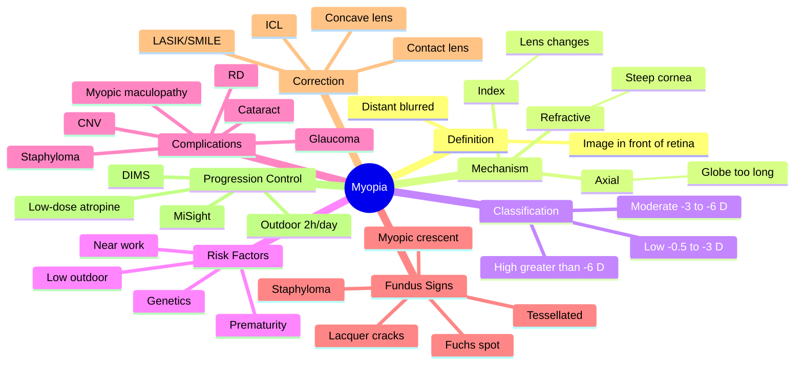

# Myopia

Related: [[Hyperopia]], [[Astigmatism]], [[Presbyopia]], [[Correction of Refractive Errors]]

> [!tip] **FCPS/MRCP Priority: HIGH**
> Most common refractive error. Distinguish simple (school) myopia from pathological (degenerative) myopia. Rising global prevalence.

---

## Learning Objectives
- [ ] Define myopia and classify its types
- [ ] Identify risk factors and epidemiology
- [ ] Describe the optical basis
- [ ] Outline correction options
- [ ] Recognise complications of pathological myopia
- [ ] Describe methods to slow myopia progression in children
- [ ] List the fundus signs of high myopia

---

## 1. Definition

- **Myopia (short-sightedness):** Image focused in front of retina
- Distant objects blurred, near objects clear
- Corrected with concave (minus/diverging) lens

---

## 2. Classification

### By Mechanism
- **Axial:** Globe too long (>24 mm) — most common
- **Refractive:** Excessive refractive power (steep cornea, lens changes — e.g., nuclear sclerosis causing "second sight" myopia)
- **Index:** ↑ refractive index of lens (early cataract, diabetes)

### By Severity
- Low: -0.5 to -3 D
- Moderate: -3 to -6 D
- High (pathological): >-6 D
- Severe (degenerate): >-10 D

### By Age of Onset
- **Congenital myopia:** Present at birth, often high
- **Youth-onset / school myopia:** 6–14 years, progresses through teens
- **Adult-onset:** 20–40 years, often due to near work
- **Late-onset:** After 40, rule out diabetes, nuclear cataract

---

## 3. Epidemiology

- Affects ~30% of European populations, >80% in some East Asian countries
- Rising globally
- Age 20–30: peak prevalence
- Earlier onset = higher final refractive error
- Risk factors: family history, ↑ near work (reading, screens), ↑ outdoor time protective, urban > rural

---

## 4. Aetiology

- **Genetic:** Multiple loci (MYP1-20), high heritability
- **Environmental:** Near work, lack of outdoor light
- **Prematurity:** Higher myopia (smaller eyes, then axial growth)
- **Marfan, homocystinuria:** Ectopia lentis, myopia

---

## 5. Clinical Features

- Distant vision blurred, near clear
- Squinting to improve focus
- Headache, eyestrain with prolonged near work
- Children: sitting close to TV/blackboard, reduced school performance
- **Night myopia:** Worse in low light (dilated pupil + accommodation)

---

## 6. Investigations

- **Visual acuity (Snellen / logMAR):** Distance blur, near clear
- **Refraction (retinoscopy / autorefraction):** Objective and subjective
- **Keratometry / corneal topography:** Identifies steep cornea (keratoconus, refractive myopia)
- **Axial length measurement (A-scan biometry):** >24 mm in axial myopia
- **Slit-lamp examination:** Look for keratoconus, lenticular changes, lens subluxation
- **Dilated fundus examination:** Peripapillary atrophy, lattice degeneration, tears, staphyloma
- **IOP:** Rule out glaucoma (raised risk in high myopia)
- **OCT / FFA:** For myopic maculopathy, CNV

---

## 7. Differential Diagnosis

| Condition | Distinguishing |
|-----------|---------------|
| Myopic astigmatism | Two meridians differ in refractive power |
| Nuclear sclerosis ("second sight") | Myopic shift in older patients |
| Diabetes (transient myopia) | From lens swelling in hyperglycaemia |
| Keratoconus | Progressive, irregular astigmatism, scissoring reflex |
| Migraine / accommodative spasm | Fluctuating vision, spasm of near reflex |

---

## 8. Complications (Pathological Myopia)

| Complication | Description |
|--------------|-------------|
| **Myopic maculopathy** | Lacquer cracks, Fuchs spot, CNV, macular hole, RD |
| **Retinal detachment** | ↑ risk (peripheral degeneration, lattice, holes) |
| **Posterior staphyloma** | Bulging of posterior pole |
| **Glaucoma** | ↑ risk (even at normal IOP) |
| **Cataract** | Earlier onset (nuclear sclerosis) |
| **Strabismus** | Esotropia, exotropia |

### Fundus Signs in High Myopia
- Tessellated/tigroid fundus
- Peripapillary atrophy (myopic crescent)
- Lacquer cracks
- Fuchs spot (subretinal haemorrhage + pigment)
- Posterior staphyloma
- Lattice degeneration
- Dome-shaped macula

---

## 9. Management

### Optical Correction
- **Spectacles:** Concave (negative) lenses
- **Contact lenses:** Soft, RGP
- **Refractive surgery:** LASIK, PRK, SMILE, ICL, RLE (refractive lens exchange)
- **Orthokeratology:** RGP overnight to temporarily flatten cornea

### Prevention / Progression Control (in children)
- Increased outdoor time (2 h/day)
- Reduced near work
- **Atropine 0.01–0.05%** low-dose drops — slows progression
- **DIMS spectacle lenses** (defocus incorporated multiple segments)
- **MiSight contact lenses** (dual-focus)

---

## 10. Red Flags / Emergencies

- **Sudden visual loss in a myope** → think retinal detachment (flashes, floaters, curtain)
- **Distortion / central scotoma** → suspect myopic CNV, macular hole
- **Very rapidly progressive myopia** in adult → diabetes, nuclear sclerosis, keratoconus
- **Myopia in a child < 6 months** → consider retinopathy of prematurity, congenital cataract, congenital glaucoma
- **Painful red eye + myopia** → consider angle-closure (rare, but high myopes can have it)

---

## 11. FCPS/MRCP High-Yield Summary

| Topic | Key Points |
|-------|------------|
| Myopia definition | Image in front of retina, corrected with concave lens |
| Mechanism | Axial (most common), refractive, index |
| Pathological myopia | >-6 D, risk of RD, maculopathy, glaucoma |
| High-risk eye | Tessellated fundus, myopic crescent, staphyloma |
| Progression control | Outdoor time, low-dose atropine, DIMS/MiSight |

---

## 12. Viva Questions

1. **Q:** Differentiate simple myopia from pathological myopia.
   **A:** Simple: -0.5 to -6 D, no degenerative changes. Pathological: >-6 D, axial length >26 mm, with retinal/macular degeneration, ↑ risk RD/CNV/glaucoma.

2. **Q:** What eye signs are seen in high myopia?
   **A:** Myopic crescent, tessellated fundus, lacquer cracks, Fuchs spot, staphyloma, lattice degeneration.

3. **Q:** How is childhood myopia progression controlled?
   **A:** Outdoor time 2 h/day, low-dose atropine 0.01–0.05%, DIMS spectacle lenses, MiSight contact lenses.

4. **Q:** What is "second sight" myopia?
   **A:** Myopic shift in an older patient due to nuclear sclerosis — patient may no longer need reading glasses temporarily.

5. **Q:** Why is high myopia a risk factor for retinal detachment?
   **A:** Axial elongation → peripheral retinal thinning → lattice, holes, tears → RD.

---

## 13. Common Confusions / Exam Traps

| Confusion | Clarification |
|-----------|---------------|
| "All myopes need surgery" | Most corrected with glasses/CL; surgery (LASIK etc.) is elective |
| "Myopia doesn't cause disease" | Pathological myopia → RD, CNV, glaucoma, maculopathy |
| "Outdoor time is irrelevant" | Outdoor light increases dopamine release → slows axial elongation (evidence-based) |
| "Atropine is for amblyopia only" | Low-dose atropine 0.01–0.05% is used for myopia control, not amblyopia |
| "Myopia = far-sighted" | NO — myopia = near-sighted (short-sighted). Hyperopia = far-sighted (long-sighted) |
| "Minus lens for hyperopia" | Plus (convex) lens for hyperopia; minus (concave) for myopia |
| "Concave for hyperopia" | NO — concave for myopia; convex for hyperopia |
| "LASIK cures myopia" | Refractive surgery reshapes cornea but does NOT alter pathological complications |

---

## 14. Mnemonics

1. **"Myopia = Minus"** — concave (minus) lens corrects myopia (image in FRONT of retina, push back)
2. **"Nearsighted = Near is fine, Far is bad"** — myopes see near well, distance blurred
3. **"Outdoor 2 hours, Atropine low-dose, DIMS or MiSight"** — **OADM** — myopia control measures
4. **"Pathological myopia = Perilous"** — high myopia carries risk of RD, CNV, glaucoma, cataract, staphyloma

---

## 15. Mind Map

---

## 16. One-Page Revision Card

| **Topic** | **Myopia** |
|-----------|------------|
| **Definition** | Image focused in front of retina |
| **Symptom** | Distant vision blurred, near clear |
| **Correction** | Concave (minus) lens |
| **Mechanism (most common)** | Axial (globe too long > 24 mm) |
| **Pathological** | > -6 D, with degenerative changes |
| **Complications** | RD, maculopathy, CNV, glaucoma, cataract, staphyloma |
| **Fundus signs** | Tessellated, myopic crescent, lacquer cracks, Fuchs spot |
| **Progression control** | Outdoor time, low-dose atropine, DIMS, MiSight |
| **Refractive surgery** | LASIK, PRK, SMILE, ICL, RLE |
| **Viva Pearl** | "Myopia = minus, hyperopia = plus" |

---

## Spaced Repetition Trackers

### 24-Hour Recall Prompts
- [ ] Define myopia and identify the corrective lens
- [ ] List the 3 mechanisms of myopia
- [ ] State the cut-off for pathological myopia
- [ ] List 3 complications of high myopia
- [ ] List 3 methods to slow childhood myopia progression
- [ ] Identify 3 fundus signs of high myopia

### Revision Schedule
- [ ] **Day 1** completed (creation + 24h recall)
- [ ] **Day 3** revision completed
- [ ] **Day 7** revision completed
- [ ] **Day 15** revision completed
- [ ] **Day 30** revision completed
- [ ] **Day 90** revision completed

---

## Must Know / Should Know / Nice to Know

### Must Know (Core for passing)
- [x] Definition (image in front of retina, concave lens)
- [x] Three mechanisms (axial, refractive, index)
- [x] Pathological myopia > -6 D
- [x] Major complications: RD, maculopathy, glaucoma
- [x] Fundus signs (myopic crescent, tessellated, staphyloma)

### Should Know (High probability)
- [x] Progression control (outdoor time, atropine, DIMS)
- [x] Refractive surgery options (LASIK, ICL)
- [x] "Second sight" phenomenon
- [x] Diabetes and myopia
- [x] Prematurity association

### Nice to Know (Differentiator)
- [ ] MYP gene loci
- [ ] SMILE, RLE specifics
- [ ] Orthokeratology mechanism
- [ ] ICL (implantable collamer lens) details

---

## My Weak Points
- [ ] Add personal weak areas here

---

## Self-Test Scorecard

| Section | Score /5 |
|---------|----------|
| Understanding: | /10 |
| Recall: | /10 |
| MCQ Performance: | /10 |
| SBA Performance: | /10 |
| Viva Confidence: | /10 |
| Total: | /50 |

> [!tip] **Interpretation:** <35 = weak topic, 35-44 = acceptable but insecure, 45+ = strong exam-ready topic.

---

## Exam Answer Modes

### Long Answer Skeleton
1. Definition (image in front of retina, concave lens)
2. Classification — by mechanism (axial, refractive, index), severity, age of onset
3. Epidemiology (global rise, East Asia, age group)
4. Aetiology (genetic + environmental)
5. Clinical features (distance blur, squint, headache, night myopia)
6. Investigations (refraction, axial length, fundus)
7. Complications of pathological myopia (RD, maculopathy, CNV, glaucoma, staphyloma)
8. Management — optical correction, refractive surgery, progression control

### Short Note Skeleton
- Definition + mechanism + correction
- Pathological myopia: definition + complications
- Progression control in children

### Viva One-Liners
- **Q:** What is myopia? → **A:** Image focused in front of retina; corrected with concave (minus) lens.
- **Q:** Commonest mechanism? → **A:** Axial (globe too long).
- **Q:** Cut-off for pathological? → **A:** > -6 D.
- **Q:** Why is RD common? → **A:** Axial elongation → peripheral retinal thinning → tears.
- **Q:** How to slow childhood progression? → **A:** Outdoor 2 h/day, low-dose atropine, DIMS, MiSight.

### Ward-Case Discussion Points
- Distinguish simple vs pathological myopia
- Discuss optical correction (glasses, CL, surgery)
- Counsel parents on myopia control in children
- Examine fundus in high myopes (look for staphyloma, lacquer cracks, RD)
- Explain refractive surgery options and limitations

### Last-Night-Before-Exam Sheet
- **Top 5 facts:**
  1. Myopia = image in front of retina, corrected with concave lens
  2. Axial myopia = globe too long (most common)
  3. Pathological = > -6 D
  4. Complications: RD, maculopathy, CNV, glaucoma, staphyloma
  5. Progression control: outdoor + atropine + DIMS/MiSight
- **Mnemonic:** "Myopia = MINUS; Hyperopia = PLUS"
- **Must-know viva:** Fundus signs of high myopia

---

## Summary

Myopia is the most common refractive error. The epidemic is rising globally, particularly in East Asia. Distant blur is the main symptom. Pathological myopia carries risks of RD, maculopathy, and glaucoma. Treatment includes spectacles, contact lenses, and refractive surgery; progression in children can be slowed.

## MCQs (10)

1. **Question:** Myopia is corrected with:
   **Options:** A. Convex lens B. Concave lens C. Cylinder D. Prism E. No lens
   **Answer:** B
   **Explanation:** Concave (diverging) lens moves focal point back onto retina.

2. **Question:** Pathological myopia is defined as:
   **Options:** A. >-1 D B. >-3 D C. >-6 D D. >-10 D E. Any myopia
   **Answer:** C
   **Explanation:** >-6 D associated with degenerative changes.

3. **Question:** A tessellated fundus with myopic crescent is characteristic of:
   **Options:** A. Hyperopia B. Myopia C. Astigmatism D. Presbyopia E. Emmetropia
   **Answer:** B
   **Explanation:** Myopic crescent = peripapillary atrophy, classic high myopia sign.

4. **Question:** Low-dose atropine is used in myopia to:
   **Options:** A. Improve vision B. Slow progression C. Cause miosis D. Cause mydriasis E. Reduce IOP
   **Answer:** B
   **Explanation:** 0.01–0.05% atropine slows axial elongation in children.

5. **Question:** The most common mechanism of myopia is:
   **Options:** A. Refractive B. Index C. Axial D. Positional E. Mixed
   **Answer:** C
   **Explanation:** Axial myopia (globe too long) is the most common type.

6. **Question:** Fuchs spot in high myopia is:
   **Options:** A. Corneal deposit B. Subretinal haemorrhage + pigment at the macula C. Iris freckles D. Lens opacity E. Conjunctival pigment
   **Answer:** B
   **Explanation:** Fuchs spot = subretinal haemorrhage followed by pigment proliferation at the macula in pathological myopia.

7. **Question:** "Second sight" myopia in older adults is caused by:
   **Options:** A. Cataract surgery B. Nuclear sclerosis C. Retinal detachment D. Diabetes E. Trauma
   **Answer:** B
   **Explanation:** Nuclear sclerosis increases lens refractive index → myopic shift; reading vision temporarily improves.

8. **Question:** A myope presenting with sudden floaters, flashes, and a curtain across vision likely has:
   **Options:** A. Cataract B. Retinal detachment C. Glaucoma D. Uveitis E. Macular degeneration
   **Answer:** B
   **Explanation:** Floaters + flashes + curtain = rhegmatogenous retinal detachment; high myopia is a major risk factor.

9. **Question:** Which intervention has the strongest evidence for slowing childhood myopia progression?
   **Options:** A. Reading more B. Low-dose atropine + outdoor time C. Watching TV D. Eating carrots E. Glasses only
   **Answer:** B
   **Explanation:** Outdoor time (2 h/day) and low-dose atropine (0.01–0.05%) are evidence-based.

10. **Question:** Posterior staphyloma in high myopia refers to:
    **Options:** A. Anterior lens dislocation B. Bulging of the posterior pole of the eye C. Corneal ectasia D. Iris atrophy E. Optic disc swelling
    **Answer:** B
    **Explanation:** Posterior staphyloma = outward bulging of the posterior sclera/uvea, characteristic of pathological myopia.

## SBA Questions (10)

1. **Scenario:** An 8-year-old has progressive myopia -3 D. Parents worried about progression.
   **Question:** Best intervention to slow progression?
   **Options:** A. Glasses only B. Bifocals C. Low-dose atropine + outdoor time D. Contact lenses E. LASIK
   **Answer:** C
   **Explanation:** Low-dose atropine + increased outdoor time is evidence-based for progression control.

2. **Scenario:** A 25-year-old high myope (-12 D) presents with sudden floaters, flashes of light, and a "curtain" coming down over his right eye. Visual acuity is 6/60.
   **Question:** Most likely diagnosis?
   **Options:** A. Vitreous haemorrhage B. Retinal detachment C. Central retinal vein occlusion D. Macular hole E. Optic neuritis
   **Answer:** B
   **Explanation:** High myopia + flashes + floaters + curtain = rhegmatogenous RD; urgent referral.

3. **Scenario:** A 60-year-old with known myopia is delighted that he can now read without his reading glasses. His distance vision, however, has worsened.
   **Question:** Most likely cause?
   **Options:** A. Cataract B. Nuclear sclerosis (second sight) C. Retinal detachment D. Diabetes E. Glaucoma
   **Answer:** B
   **Explanation:** "Second sight" = myopic shift due to nuclear sclerosis.

4. **Scenario:** A 50-year-old with high myopia is found on routine exam to have a tessellated fundus, peripapillary atrophy, and a posterior staphyloma. IOP is normal. No symptoms.
   **Question:** Best management?
   **Options:** A. Topical steroid B. Topical IOP-lowering drops (prophylactic) C. Observation + regular review + patient education about RD symptoms D. Laser retinopexy (prophylactic) E. Vitrectomy
   **Answer:** C
   **Explanation:** Asymptomatic high myopia = observation, education on RD warning signs, regular review.

5. **Scenario:** A 12-year-old with -7 D myopia wants freedom from glasses. Parents ask about refractive surgery.
   **Question:** Best advice?
   **Options:** A. LASIK now B. PRK now C. Wait until at least 18–21 years and refraction stable for 1–2 years D. ICL only E. Surgery not possible
   **Answer:** C
   **Explanation:** Refractive surgery deferred until adulthood and stable refraction.

6. **Scenario:** A 35-year-old high myope has distortion of central vision and a small subretinal haemorrhage at the macula on fundoscopy.
   **Question:** Most likely diagnosis?
   **Options:** A. Central serous retinopathy B. Myopic choroidal neovascularisation C. Macular hole D. Vitreous haemorrhage E. CME
   **Answer:** B
   **Explanation:** Myopic CNV is a leading cause of visual loss in pathological myopia.

7. **Scenario:** A 7-year-old with progressive myopia. Cycloplegic refraction is -2.5 D. The mother had -8 D myopia.
   **Question:** Main risk factor in this child?
   **Options:** A. Diet B. Genetic (family history) + near work C. Infection D. Trauma E. Allergy
   **Answer:** B
   **Explanation:** Family history (high myopia) and environmental factors (near work) are key contributors.

8. **Scenario:** A 30-year-old with -10 D myopia. On fundus exam, the optic disc has a temporal crescent and the fundus is tigroid. Visual acuity 6/9.
   **Question:** What complication is this patient at risk of?
   **Options:** A. Conjunctivitis B. Retinal detachment / myopic maculopathy / glaucoma C. Blepharitis D. Pterygium E. Pinguecula
   **Answer:** B
   **Explanation:** High myopia = RD, maculopathy, glaucoma risk.

9. **Scenario:** A teacher notes that a 7-year-old child sits very close to the blackboard and is squinting. Visual acuity 6/60 in both eyes, improves to 6/6 with -2.0 D lens.
   **Question:** Most likely diagnosis?
   **Options:** A. Hyperopia B. Myopia C. Astigmatism D. Presbyopia E. Emmetropia
   **Answer:** B
   **Explanation:** Distance blur improving with concave lens = myopia.

10. **Scenario:** A 40-year-old diabetic presents with sudden bilateral myopia. Blood sugar is 30 mmol/L.
    **Question:** Mechanism of myopia?
    **Options:** A. Axial B. Refractive (corneal) C. Index (lens swelling) D. Positional E. None
    **Answer:** C
    **Explanation:** Hyperglycaemia → osmotic lens swelling → ↑ refractive index → index myopia. Resolves with euglycaemia.

## Flashcards

- **Q:** What is myopia?
  **A:** Image focused in front of the retina; corrected with concave (minus) lens.
- **Q:** What is the cut-off for pathological myopia?
  **A:** > -6 D (or axial length > 26 mm).
- **Q:** Name 3 fundus signs of high myopia.
  **A:** Myopic crescent, tessellated/tigroid fundus, lacquer cracks, Fuchs spot, posterior staphyloma.
- **Q:** How is childhood myopia progression slowed?
  **A:** Outdoor time 2 h/day, low-dose atropine 0.01–0.05%, DIMS spectacle lenses, MiSight contact lenses.
- **Q:** Name 3 complications of pathological myopia.
  **A:** Retinal detachment, myopic maculopathy (CNV), glaucoma, cataract, posterior staphyloma.

## Answer Key with Explanations

### MCQs
1. B — Concave (diverging) lens corrects myopia
2. C — > -6 D = pathological
3. B — Myopic crescent is pathognomonic of myopia
4. B — Low-dose atropine slows axial elongation
5. C — Axial myopia is the most common mechanism
6. B — Fuchs spot = subretinal haemorrhage + pigment
7. B — "Second sight" = nuclear sclerosis myopic shift
8. B — Floaters + flashes + curtain = RD
9. B — Outdoor time + low-dose atropine (evidence-based)
10. B — Posterior staphyloma = bulging of posterior pole

### SBAs
1. C — Outdoor time + low-dose atropine slows progression
2. B — High myopia + flashes + floaters + curtain = RD
3. B — "Second sight" = nuclear sclerosis
4. C — Asymptomatic high myopia = observation + education
5. C — Wait until adulthood and stable refraction
6. B — Myopic CNV at the macula
7. B — Family history + near work = main risk factors
8. B — High myopia risk = RD, maculopathy, glaucoma
9. B — Distance blur improving with concave lens = myopia
10. C — Hyperglycaemia → lens swelling → index myopia

## Tags
#medicine #davidson #ophthalmology #refractive #myopia #fcps #mrcp
