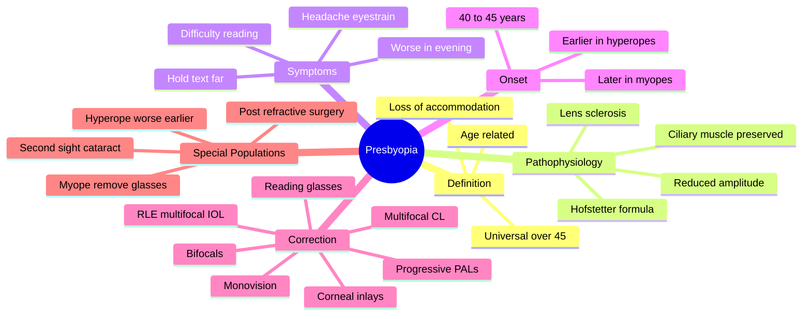

# Presbyopia

Related: [[Hyperopia]], [[Myopia]], [[Correction of Refractive Errors]]

> [!tip] **FCPS/MRCP Priority: HIGH**
> Age-related loss of accommodation affects everyone >45. Presbyopia is not a disease but a normal aging change. Master the symptoms, mechanism, and correction options.

---

## Learning Objectives
- [ ] Define presbyopia
- [ ] Explain the pathophysiology (loss of lens elasticity)
- [ ] Describe clinical features and natural history
- [ ] Outline correction options
- [ ] Manage presbyopia in special populations (myopes, hyperopes, post-cataract/refractive surgery)
- [ ] Apply Hofstetter's formula for amplitude of accommodation
- [ ] Explain monovision principle

---

## 1. Definition

- **Presbyopia:** Age-related, progressive loss of accommodation (near focusing ability)
- Universally affects people >45 years
- Not a refractive error per se, but a loss of accommodative amplitude

---

## 2. Pathophysiology

- **Lens:** Progressive loss of elasticity (sclerosis); cannot change shape
- **Ciliary muscle:** Function preserved but cannot deform lens
- **Zonules:** Mechanically impaired
- Net result: ↓ amplitude of accommodation

### Amplitude of Accommodation (Hofstetter's formula)
- Minimum expected: 15 – 0.25 × age
- Mean: 18.5 – 0.30 × age
- Maximum: 25 – 0.40 × age
- Age 40: ~6 D → Age 50: ~2 D → Age 60: ~0.5 D

### Other Contributing Factors
- Decreased ciliary muscle efficiency
- ↓ Near pupillary miosis (depth of focus reduced)
- Lenticular sclerosis + nuclear cataract can transiently improve near vision ("second sight")

---

## 3. Clinical Features

- Difficulty reading fine print, especially in low light
- Need to hold reading material further away
- Eyestrain, frontal headache after near work
- Slow to refocus from near to far (intermittent blur)
- Symptoms worse in evening/fatigue
- Onset: 40–45 years (earlier in hyperopes, later in myopes)

---

## 4. Examination

- **Near vision:** Reduced (N5, N6, N8…)
- **Distance vision:** Usually normal
- **Refraction:** Distance correction may be needed
- **Accommodative amplitude:** Reduced

### Plus Acceptance Test
- Add plus lenses binocularly at near until clear
- Determine add power needed

---

## 5. Management

### Spectacles
| Type | Description | Use |
|------|-------------|-----|
| **Single-vision reading** | For near only | Pure presbyope with no distance Rx |
| **Bifocals** | Distance top, near bottom (segment) | Presbyope who needs both |
| **Progressive addition (PALs)** | Gradual change, no line | Cosmetic, all distances |
| **Occupational** | Intermediate + near | Office work, computer use |
| **Trifocals** | Distance + intermediate + near | Older presbyopes, large add |

### Contact Lenses
- **Monovision:** One eye for distance, one for near
- **Multifocal contact lenses:** Concentric or aspheric designs
- **Monovision contact lens + reading glasses**

### Surgical / Other
- **Refractive lens exchange** (RLE) with multifocal IOL
- **Corneal inlays** (e.g., KAMRA, Raindrop)
- **LASIK monovision**
- **Pharmacological:** Miotic drops (pilocarpine, aceclidine) — temporary ciliary contraction
- **Scleral expansion bands** (historical)

---

## 6. Special Populations

### Myopes
- Naturally better at near (less accommodation needed)
- May remove distance glasses to read
- Multifocal contact lenses / monovision
- After cataract surgery: can choose monofocal for monovision, or multifocal IOL

### Hyperopes
- Earlier onset and worse symptoms
- Often need both distance and near correction
- May have been asymptomatic, then suddenly notice blur

### Post-Refractive Surgery
- More challenging: presbyopic changes harder to predict
- May need enhancement

---

## 7. FCPS/MRCP High-Yield Summary

| Topic | Key Points |
|-------|------------|
| Presbyopia | Loss of accommodation due to lens sclerosis |
| Onset | 40–45 years |
| Mechanism | Lens loses elasticity (NOT ciliary muscle) |
| Correction | Reading adds, bifocals, progressives, multifocal CLs |
| Hyperope | Earlier, worse symptoms |
| Myope | Later, may remove glasses to read |

---

## 8. Viva Questions

1. **Q:** What is the cause of presbyopia?
   **A:** Age-related loss of lens elasticity (sclerosis) → cannot become more convex for near focus. Ciliary muscle is preserved.

2. **Q:** Why do hyperopes notice presbyopia earlier than myopes?
   **A:** Hyperopes already use accommodation for distance; less reserve for near. Myopes can read without accommodation (or with less).

3. **Q:** What is monovision?
   **A:** Contact lens or refractive correction where dominant eye is corrected for distance and non-dominant eye for near. Brain adapts to suppress blur.

---

## 11. Common Confusions / Exam Traps

| Confusion | Clarification |
|-----------|---------------|
| "Presbyopia is a refractive error" | It's a loss of accommodative amplitude, not a refractive error per se |
| "Ciliary muscle weakness causes presbyopia" | NO — ciliary muscle is preserved; the LENS loses elasticity |
| "Presbyopia is a disease" | NO — universal age-related change |
| "Reading in dim light causes presbyopia" | NO — it unmasks it (less depth of focus from larger pupil) |
| "Myopes don't get presbyopia" | WRONG — they do, but can simply remove distance glasses to read |
| "Hyperopes get presbyopia later" | WRONG — they get it earlier and more severely |
| "Multifocal IOLs give perfect vision" | No — risk of glare, halos, reduced contrast, especially at night |
| "LASIK cures presbyopia" | No — only monovision LASIK is possible; reading glasses may still be needed |
| "Second sight" is improvement | It is — but it's a sign of early nuclear cataract, not regression of presbyopia |

---

## 12. Mnemonics

1. **"Presbyopia = Problem of the Lens, not the muscle"** — lens sclerosis, ciliary muscle preserved
2. **"Myopes MOVE glasses, Hyperopes NEED glasses"** — myopes remove distance glasses to read; hyperopes need both
3. **"MONOVISION = Master eye for distance, Other eye for Near"** — dominant eye distance, non-dominant eye near

---

## 13. Mind Map

---

## 14. One-Page Revision Card

| **Topic** | **Presbyopia** |
|-----------|-----------------|
| **Definition** | Age-related loss of accommodation |
| **Onset** | 40–45 years |
| **Mechanism** | Lens sclerosis (ciliary muscle preserved) |
| **Key Formula** | Hofstetter minimum = 15 − 0.25 × age |
| **Symptoms** | Difficulty reading, holds text far, headache |
| **Hyperope** | Earlier, worse, needs both distance + near |
| **Myope** | Later, removes glasses to read |
| **Correction** | Reading add, bifocals, progressives, multifocal CL, monovision |
| **Viva Pearl** | Lens problem, not muscle problem |

---

## Spaced Repetition Trackers

### 24-Hour Recall Prompts
- [ ] Define presbyopia and state the underlying mechanism
- [ ] State the typical age of onset and the difference between myopes and hyperopes
- [ ] List 4 spectacle options for presbyopia
- [ ] Explain monovision

### Revision Schedule
- [ ] **Day 1** completed (creation + 24h recall)
- [ ] **Day 3** revision completed
- [ ] **Day 7** revision completed
- [ ] **Day 15** revision completed
- [ ] **Day 30** revision completed
- [ ] **Day 90** revision completed

---

## Must Know / Should Know / Nice to Know

### Must Know (Core for passing)
- [x] Definition of presbyopia
- [x] Mechanism: lens sclerosis, ciliary muscle preserved
- [x] Onset: 40–45 years
- [x] Hyperope earlier/worse, myope later
- [x] Correction options: reading add, bifocals, progressives
- [x] Monovision concept

### Should Know (High probability)
- [x] Hofstetter's formula
- [x] Multifocal contact lens / IOL options
- [x] "Second sight" as early nuclear cataract
- [x] Post-refractive surgery considerations

### Nice to Know (Differentiator)
- [ ] Corneal inlays (KAMRA, Raindrop)
- [ ] Scleral expansion bands (historical)
- [ ] Pharmacological miotic drops (pilocarpine, aceclidine)

---

## My Weak Points
- [ ] Add personal weak areas here

---

## Self-Test Scorecard

| Section | Score /5 |
|---------|----------|
| Understanding: | /10 |
| Recall: | /10 |
| MCQ Performance: | /10 |
| SBA Performance: | /10 |
| Viva Confidence: | /10 |
| Total: | /50 |

> [!tip] **Interpretation:** <35 = weak topic, 35-44 = acceptable but insecure, 45+ = strong exam-ready topic.

---

## Exam Answer Modes

### Long Answer Skeleton
1. Definition — age-related loss of accommodation
2. Pathophysiology — lens sclerosis, ciliary muscle preserved, ↓ amplitude of accommodation (Hofstetter)
3. Clinical features — difficulty reading, holding text far, eyestrain, worse in evening
4. Onset — 40–45 years; earlier in hyperopes, later in myopes
5. Examination — reduced near vision, plus acceptance test
6. Management — reading glasses, bifocals, progressives, multifocal CL, monovision, RLE with multifocal IOL
7. Special populations — myope vs hyperope vs post-refractive surgery

### Short Note Skeleton
- Definition + mechanism (lens sclerosis, NOT ciliary muscle)
- Onset (40–45 years) and difference between myope and hyperope
- Correction options (spectacle + contact lens + surgical)

### Viva One-Liners
- **Q:** Cause of presbyopia? → **A:** Age-related lens sclerosis (not ciliary muscle weakness)
- **Q:** Onset age? → **A:** 40–45 years
- **Q:** Why are hyperopes affected earlier? → **A:** They use accommodation for distance, leaving less reserve for near
- **Q:** What is monovision? → **A:** Dominant eye corrected for distance, non-dominant eye for near

### Ward-Case Discussion Points
- Differentiate presbyopia from hyperopia
- Choose between bifocals, progressives, and monovision for the patient
- Discuss multifocal IOL at cataract surgery
- Explain "second sight" as a sign of nuclear cataract

### Last-Night-Before-Exam Sheet
- Top 3 facts: lens sclerosis (not muscle), 40–45 years onset, myope removes glasses
- 1 mnemonic: "Presbyopia = Problem of the Lens, not the muscle"
- Must-know differential: hyperopia (constant, not age-related) vs presbyopia (age-related)
- Hofstetter minimum: 15 − 0.25 × age

---

## Summary

Presbyopia is the universal age-related loss of near focusing. Caused by lens sclerosis, not muscle weakness. Corrected with reading adds, bifocals, progressives, or multifocal contact lenses. Special considerations for myopes, hyperopes, and post-refractive surgery patients.

## MCQs (10)

1. **Question:** Presbyopia is caused by:
   **Options:** A. Ciliary muscle weakness B. Lens sclerosis C. Lens dislocation D. Retinal disease E. Optic nerve disease
   **Answer:** B
   **Explanation:** Loss of lens elasticity (sclerosis) is the key mechanism. The ciliary muscle remains functional.

2. **Question:** Presbyopia typically begins at age:
   **Options:** A. 20 B. 30 C. 40–45 D. 60 E. 70
   **Answer:** C
   **Explanation:** Around 40–45 years, when accommodative reserve falls below 3 D.

3. **Question:** Monovision involves:
   **Options:** A. Both eyes corrected for distance B. Both eyes corrected for near C. One eye for distance, one for near D. No correction E. Multifocal lens
   **Answer:** C
   **Explanation:** Dominant eye for distance, non-dominant eye for near. The brain learns to suppress blur from each eye at the relevant distance.

4. **Question:** Myopes with presbyopia may:
   **Options:** A. Need bifocals only B. Remove glasses to read C. Need prism correction D. Have diplopia E. Need strabismus surgery
   **Answer:** B
   **Explanation:** Myopes can simply remove distance glasses to read because they can focus on near objects without accommodation.

5. **Question:** According to Hofstetter's formula, the minimum expected amplitude of accommodation at age 50 is approximately:
   **Options:** A. 0.5 D B. 1.5 D C. 2.5 D D. 5.0 D E. 6.0 D
   **Answer:** C
   **Explanation:** Minimum amplitude = 15 − 0.25 × 50 = 15 − 12.5 = 2.5 D.

6. **Question:** Which of the following is the underlying cause of presbyopia?
   **Options:** A. Ciliary body atrophy B. Loss of lens elasticity C. Zonular rupture D. Retinal degeneration E. Pupillary miosis
   **Answer:** B
   **Explanation:** Sclerosis (loss of elasticity) of the crystalline lens is the primary pathology. Ciliary muscle and zonules are largely preserved.

7. **Question:** Hyperopes typically experience presbyopia:
   **Options:** A. Later than myopes B. At the same time as myopes C. Earlier and more severely than myopes D. Never E. Only after surgery
   **Answer:** C
   **Explanation:** Hyperopes already use accommodation for distance vision, leaving less reserve for near. Symptoms appear earlier and are more severe.

8. **Question:** A 65-year-old with a nuclear cataract reports that his near vision has recently improved without glasses. This is known as:
   **Options:** A. First sight B. Second sight C. Third sight D. False sight E. Cataract reversal
   **Answer:** B
   **Explanation:** "Second sight" — the myopic shift from nuclear sclerosis transiently improves near vision but is a sign of progressive cataract.

9. **Question:** Which IOL option is best for a patient undergoing cataract surgery who wishes to be spectacle-independent for distance and near?
   **Options:** A. Monofocal spherical IOL B. Monofocal toric IOL C. Multifocal IOL D. Iris-fixated IOL E. Anterior chamber IOL
   **Answer:** C
   **Explanation:** Multifocal IOLs provide distance, intermediate, and near focal points, reducing spectacle dependence (at the cost of glare/halos).

10. **Question:** The "add" power in a presbyopic spectacle prescription corrects for:
    **Options:** A. Distance vision B. Astigmatism C. Loss of accommodation D. Prism imbalance E. Colour vision
    **Answer:** C
    **Explanation:** The "add" is a positive lens added for near work, compensating for the loss of accommodative amplitude.

## SBA Questions (10)

1. **Scenario:** A 50-year-old previously emmetropic accountant complains that reading is blurry.
   **Question:** Most appropriate correction?
   **Options:** A. Distance glasses B. Reading glasses +1.5 D C. Trifocals D. No correction E. Distance multifocals
   **Answer:** B
   **Explanation:** Simple presbyopia in an emmetrope — reading glasses only (no distance correction needed).

2. **Scenario:** A 48-year-old hyperope presents with difficulty reading. She has worn distance glasses for years and now reports eyestrain with prolonged near work.
   **Question:** Most appropriate management?
   **Options:** A. Single-vision reading glasses B. Progressive addition lenses (PALs) C. Contact lens only D. Refractive surgery E. Cycloplegic drops
   **Answer:** B
   **Explanation:** Hyperopes need BOTH distance and near correction; PALs provide a smooth transition for both.

3. **Scenario:** A 55-year-old myope (-3 D) reports that he can read without his glasses but distance vision is blurred. He wants spectacle independence.
   **Question:** Best surgical option?
   **Options:** A. Multifocal IOL B. LASIK monovision C. Standard monofocal IOL for both eyes D. Corneal inlay only E. No surgery
   **Answer:** B
   **Explanation:** LASIK monovision (dominant eye for distance, non-dominant for near) is the best surgical option. Multifocal IOLs require lens extraction (RLE), not justified in this 55-year-old with clear lenses.

4. **Scenario:** A 60-year-old presents with gradual difficulty reading and now needs to hold the newspaper at arm's length. Near vision is reduced. Distance vision is normal.
   **Question:** Most likely diagnosis?
   **Options:** A. Hyperopia B. Presbyopia C. Cataract D. Glaucoma E. Macular degeneration
   **Answer:** B
   **Explanation:** Age >45, normal distance vision, progressive near difficulty = presbyopia (universal age-related accommodation loss).

5. **Scenario:** A 50-year-old asks why he can suddenly read without his distance glasses for the first time in 30 years.
   **Question:** Most likely explanation?
   **Options:** A. Presbyopia has resolved B. Second sight from early nuclear cataract C. Improvement in ciliary muscle D. Spontaneous myopia reduction E. Conjunctival degeneration
   **Answer:** B
   **Explanation:** "Second sight" — nuclear sclerosis increases the lens's refractive index, producing a myopic shift that improves near vision.

6. **Scenario:** A 45-year-old teacher complains of headaches after marking papers for prolonged periods. He is emmetropic. Near vision is N6.
   **Question:** Most appropriate management?
   **Options:** A. Single-vision distance glasses B. Reading glasses +1.0 D C. Trifocals D. No correction E. Scleral lens
   **Answer:** B
   **Explanation:** Early presbyopia with eyestrain — a low-power reading add (+1.0 D) relieves accommodative demand.

7. **Scenario:** A patient has cataract surgery with a multifocal IOL and complains of severe glare and halos at night, with reduced contrast.
   **Question:** What is the most likely cause?
   **Options:** A. Glaucoma B. Retinal detachment C. Multifocal IOL design splitting light D. Corneal oedema E. Optic neuritis
   **Answer:** C
   **Explanation:** Multifocal IOLs split light into multiple foci, causing glare, halos, and reduced contrast sensitivity, especially at night.

8. **Scenario:** A 52-year-old asks for surgical correction of presbyopia but does not want intraocular surgery.
   **Question:** Best option?
   **Options:** A. LASIK monovision B. Refractive lens exchange C. Multifocal IOL D. Scleral expansion band E. Bifocals only
   **Answer:** A
   **Explanation:** LASIK monovision is corneal (not intraocular) surgery. RLE and multifocal IOL are intraocular.

9. **Scenario:** A 47-year-old with hyperopia (+2 D) starts needing reading glasses at age 43, much earlier than her emmetropic friends.
   **Question:** Why?
   **Options:** A. Lens is normal B. Hyperopes already accommodate for distance, leaving less reserve for near C. Ciliary muscle is weaker D. Zonules are ruptured E. Pupil is dilated
   **Answer:** B
   **Explanation:** Hyperopes constantly accommodate for distance, depleting accommodative reserve. Presbyopia symptoms appear earlier and more severely.

10. **Scenario:** A 60-year-old post-cataract patient with a monofocal IOL set for distance wants to read without glasses.
    **Question:** Best non-surgical option?
    **Options:** A. Multifocal IOL exchange B. Reading glasses (+2.5 D) over the distance correction C. No intervention D. Contact lens only E. Cycloplegics
    **Answer:** B
    **Explanation:** Standard monofocal IOL set for distance → patient still needs a +2.5 D add for near. Reading glasses are the simplest and safest option.

## Flashcards

- **Q:** What is presbyopia?
  **A:** Age-related, progressive loss of accommodation due to loss of lens elasticity.
- **Q:** What is the underlying mechanism?
  **A:** Lens sclerosis (loss of elasticity) — NOT ciliary muscle weakness. Ciliary muscle is preserved.
- **Q:** Typical age of onset?
  **A:** 40–45 years. Earlier in hyperopes, later in myopes.
- **Q:** What is monovision?
  **A:** Correction where the dominant eye is set for distance and the non-dominant eye for near. Brain adapts.
- **Q:** What is "second sight"?
  **A:** Transient improvement of near vision in an older myope/hyperope due to nuclear cataract-induced myopic shift.

## Answer Key with Explanations

### MCQs
1. B — Lens sclerosis is the underlying mechanism
2. C — 40–45 years is the typical onset
3. C — Monovision = one eye distance, one eye near
4. B — Myopes can remove distance glasses to read
5. C — Hofstetter minimum at 50 = 15 − 0.25(50) = 2.5 D
6. B — Loss of lens elasticity is the primary pathology
7. C — Hyperopes have earlier and more severe presbyopia
8. B — "Second sight" from nuclear cataract-induced myopic shift
9. C — Multifocal IOL gives distance + intermediate + near
10. C — Add compensates for loss of accommodation

### SBAs
1. B — Emmetropic presbyope needs reading glasses only
2. B — Hyperope needs both distance and near — PALs
3. B — LASIK monovision is the best non-intraocular surgical option
4. B — Age-related near difficulty = presbyopia
5. B — Second sight = myopic shift from nuclear cataract
6. B — Low reading add for early presbyopia with eyestrain
7. C — Multifocal IOLs split light → glare, halos, ↓ contrast
8. A — LASIK monovision is corneal, not intraocular
9. B — Hyperopes exhaust accommodative reserve for distance
10. B — Monofocal IOL set for distance still needs a +2.5 D add

## Tags
#medicine #davidson #ophthalmology #refractive #presbyopia #fcps #mrcp
