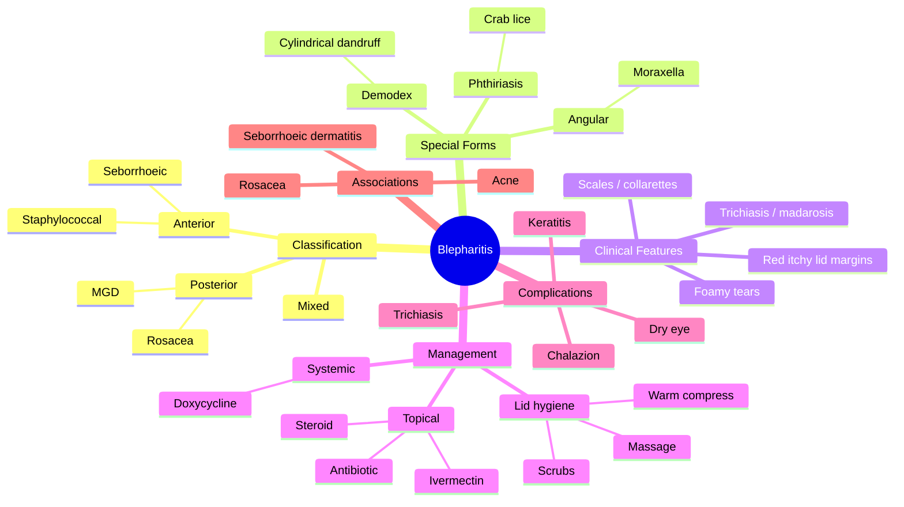

# Blepharitis

Related: [[Dry Eye Disease (Keratoconjunctivitis Sicca)]], [[Chalazion (Meibomian Cyst)]], [[Lids and Lacrimal Hub]]

> [!tip] **FCPS/MRCP Priority: HIGH**
> Common cause of chronic red, gritty eyes. Differentiate anterior (lash line, staphylococcal/seborrhoeic) from posterior (MGD, meibomian gland dysfunction).

---

## Learning Objectives
- [ ] Define blepharitis and classify it into anterior, posterior, and mixed forms
- [ ] Describe the clinical features of staphylococcal, seborrhoeic, and MGD-related blepharitis
- [ ] Recognise special forms: angular, Demodex, phthiriasis palpebrarum
- [ ] Outline the stepwise management of blepharitis (lid hygiene, topical, systemic)
- [ ] Identify associated conditions and complications (dry eye, chalazion, keratitis, rosacea)

---

## 1. Definition / Epidemiology

### Definition
- **Blepharitis:** Inflammation of the eyelid margins
- Usually chronic, bilateral
- Common cause of red eye, dry eye, recurrent styes

### Epidemiology
- Very common — accounts for a large proportion of patients presenting to eye clinics with chronic ocular irritation
- Increases with age; both sexes affected
- Strongly associated with seborrhoeic dermatitis and acne rosacea

---

## 2. Classification

| Type | Location | Causes |
|------|----------|--------|
| **Anterior blepharitis** | Outside lid margin, around lashes | Staphylococcal, seborrhoeic |
| **Posterior blepharitis** | Inner lid margin, meibomian glands | Meibomian gland dysfunction (MGD), rosacea |
| **Mixed** | Both | Most common in clinical practice |

### Special Forms
- **Angular blepharitis:** Inflammation of the lateral (or medial) canthus — classically **Moraxella** species
- **Demodex blepharitis:** Mite (Demodex folliculorum / D. brevis) infestation of lash follicles — produces **cylindrical dandruff** (collarettes)
- **Phthiriasis palpebrarum:** Crab lice (Pthirus pubis) on the lashes — typically sexually transmitted; nits visible on lash shafts
- **Pediculosis:** Body/head louse infestation
- **Allergic contact blepharitis:** Topical medications, cosmetics, contact lens solutions

---

## 3. Aetiology / Pathophysiology

### Anterior Blepharitis
- **Staphylococcal:** Direct infection of lash follicles by *Staphylococcus aureus*; exotoxins and immune complex–mediated inflammation
- **Seborrhoeic:** Associated with seborrhoeic dermatitis of scalp/face; lipid-rich scales, Pityrosporum yeast may contribute

### Posterior Blepharitis (MGD)
- Obstruction of meibomian gland orifices by thickened, inspissated meibum
- Gland dropout, ductal hyperkeratinisation
- Altered meibum composition (↓ polar lipids → tear film instability, evaporative dry eye)
- Bacterial lipases (from commensal skin flora) break down meibum → free fatty acids → irritation, foamy tears

### Systemic Associations
- Rosacea (40% of posterior blepharitis)
- Seborrhoeic dermatitis
- Acne vulgaris
- Atopic dermatitis
- Psoriasis

---

## 4. Clinical Features

### Symptoms
- Itching, burning, gritty foreign body sensation
- Red, swollen lid margins
- Crusting, scaling at lash base (collarettes)
- Broken or misdirected lashes (trichiasis)
- Loss of lashes (madarosis)
- Whitish scales (seborrhoeic) or dry, hard scales (staphylococcal)
- Foamy tear film (MGD — saponification of meibum)
- Symptoms typically worse in the morning
- Photophobia if marginal keratitis is present

### Signs by Type
| Feature | Staphylococcal | Seborrhoeic | MGD (Posterior) |
|---------|---------------|-------------|-----------------|
| Scales | Hard, brittle, fibrinous | Soft, oily, easily removed | Minimal at lash line |
| Lashes | Broken, misdirected, collarettes | Madarosis | Usually normal |
| Lid margin | Hyperaemic, ulcers, madarosis | Mildly inflamed | Plugged meibomian orifices, telangiectasia |
| Tear film | Normal/sparse | Foamy | Foamy, frothy |
| Meibum | Normal | Increased | Cloudy, inspissated, toothpaste-like |

### Associated Conditions
- Dry eye disease (50% have coexisting)
- Chalazion (chronic meibomian obstruction)
- Hordeolum (acute suppurative)
- Conjunctivitis (chronic bacterial)
- Keratitis (punctate epitheliopathy, marginal infiltrates, phlyctenular)
- Rosacea (40% of posterior blepharitis)

---

## 5. Examination

- **Slit-lamp:** Lid margins, lashes, meibomian gland expression, tear film assessment
- **Express meibomian glands:** Apply digital pressure to tarsus — clear meibum is normal; cloudy/inspissated/cheesy = MGD
- **TBUT (tear break-up time):** Reduced (<10 s) in MGD-related evaporative dry eye
- **Schirmer test:** Reduced in coexisting aqueous-deficient dry eye
- **Lash sampling:** Epilate 2–3 lashes and examine under light microscopy for **Demodex mites** (cigar-shaped, with eight legs) or lice/nits
- **Lid margin:** Telangiectasia, blocked orifices, frothy discharge (saponified meibum)
- **Cornea:** Stain with fluorescein — look for inferior punctate epitheliopathy, marginal infiltrates

---

## 6. Investigations

- **Clinical diagnosis** in most cases
- **Slit-lamp biomicroscopy** is the cornerstone
- **Lash microscopy** when Demodex/phthiriasis suspected
- **Meibography** (infra-red imaging of meibomian glands) — for documentation of gland dropout in MGD
- **Schirmer / TBUT** — quantify associated dry eye
- **Biopsy** of atypical lid margin lesions (rule out sebaceous gland carcinoma, BCC, SCC)

---

## 7. Differential Diagnosis

| Condition | Distinguishing Features |
|-----------|------------------------|
| **Chalazion** | Chronic, painless, firm tarsal nodule pointing conjunctivally |
| **Hordeolum (stye)** | Acute, painful, suppurative, localised to lash line or tarsus |
| **Sebaceous gland carcinoma** | Elderly, recurrent/unilateral, lash loss, pagetoid conjunctival spread — masquerade |
| **Basal cell carcinoma** | Pearly nodule with rolled edges, ulceration, telangiectasia, slow growth |
| **Contact dermatoblepharitis** | Symmetrical lid oedema, eczema of surrounding skin, history of topical use |
| **Trachoma** | Arlt's line, pannus, Herbert's pits, follicular reaction, in endemic areas |

---

## 8. Management

### Lid Hygiene (Cornerstone for All Types)
- **Warm compress** 5–10 min (softens inspissated meibum)
- **Lid massage** (express meibomian glands)
- **Lid scrubs** (baby shampoo diluted, dedicated lid wipes, or hypochlorous acid)
- Frequency: 1–2× daily initially, then maintenance

### Topical Therapy
- **Antibiotic ointment:** Chloramphenicol, fusidic acid, or bacitracin (staphylococcal) — apply to lid margin at bedtime
- **Antibiotic-steroid combination:** Short course (1–2 weeks) for severe inflammation — avoid long-term steroid
- **Topical azithromycin 1.5%:** Anti-inflammatory and antibacterial — useful in MGD
- **Ivermectin 1% cream** (or topical tea tree oil scrubs 50% weekly + daily lid scrubs): For **Demodex**
- **Cyclosporine 0.05% drops:** For associated dry eye, anti-inflammatory

### Systemic Therapy
- **Doxycycline 100 mg BD** (alternatives: lymecycline 408 mg daily, azithromycin pulse, minocycline) for **MGD / rosacea** — anti-inflammatory dose (sub-antimicrobial) — reduces MMP-9 activity, modifies meibum composition, decreases lipase production by commensal bacteria
- **6–12 week course**, then taper
- Contraindicated in pregnancy, <8 years old

### Adjuncts
- Artificial tears (preservative-free) for coexisting dry eye
- **Omega-3 fatty acid supplementation** (1–2 g/day EPA + DHA) — improves meibum quality
- Intense pulsed light (IPL) therapy for refractory MGD
- LipiFlow thermal pulsation device

### Treat Associated Conditions
- Rosacea (metronidazole gel, oral tetracyclines)
- Seborrhoeic dermatitis (ketoconazole shampoo, topical steroids for face)
- Acne vulgaris
- Co-existing dry eye (preservative-free lubricants, cyclosporine)

---

## 9. Complications

- Recurrent chalazia
- Trichiasis, madarosis, poliosis (white lashes)
- Marginal keratitis, phlyctenular keratitis
- Dry eye disease (evaporative ± aqueous-deficient)
- Corneal neovascularisation (chronic)
- Lower lid cicatrisation and ectropion (long-standing posterior disease)
- Loss of meibomian glands (irreversible if advanced)

---

## 10. Red Flags / Emergencies

- Acute preseptal/orbital cellulitis superimposed (fever, spreading erythema, proptosis, ↓ vision) — same-day referral
- Unilateral recurrent lesion in elderly with lash loss — **biopsy to exclude sebaceous carcinoma**
- Marked corneal involvement (ulcer, infiltrate, vascularisation) — urgent ophthalmology
- Trichiasis causing corneal abrasion — refer for epilation / electrolysis

---

## 11. FCPS/MRCP High-Yield Summary

| Topic | Key Points |
|-------|------------|
| Anterior vs posterior | Anterior = lash line; Posterior = meibomian |
| Staphylococcal | Hard crusts, collarettes, broken lashes |
| Seborrhoeic | Soft oily scales, seborrhoeic dermatitis association |
| MGD | Foamy tears, cloudy meibum, posterior disease |
| Rosacea | Acne, telangiectasia, MGD |
| Demodex | Cylindrical dandruff, treat with tea tree oil / ivermectin |
| Treatment | Lid hygiene + doxycycline (MGD) + topical AB (staph) |
| Phthiriasis | Crab lice on lashes, treat with permethrin |

---

## 12. Viva Questions

1. **Q:** Differentiate anterior from posterior blepharitis.
   **A:** Anterior = inflammation at lash line (staph/seborrhoeic). Posterior = meibomian gland dysfunction (MGD), often with rosacea.

2. **Q:** What systemic drug is used for chronic MGD / posterior blepharitis?
   **A:** Doxycycline 100 mg BD × 6–12 weeks (anti-inflammatory effect on meibomian glands and MMPs; sub-antimicrobial dose).

3. **Q:** What is Demodex blepharitis?
   **A:** Mite (Demodex folliculorum) infestation of lash follicles. Cylindrical dandruff (collarettes) is pathognomonic. Treat with tea tree oil scrubs 50% weekly + daily lid scrubs, or topical ivermectin.

4. **Q:** What is phthiriasis palpebrarum?
   **A:** Infestation of lashes by crab lice (Pthirus pubis). Nits visible on lash shafts. Treat with petrolatum occlusion, careful manual removal, or permethrin; screen for other STIs.

5. **Q:** How do you treat angular blepharitis?
   **A:** Topical antibiotic ointment (e.g., chloramphenicol, fusidic acid) — Moraxella is the typical organism.

---

## 13. Common Confusions / Exam Traps

| Confusion | Clarification |
|-----------|---------------|
| "Blepharitis is just poor hygiene" | Often a multifactorial inflammatory condition associated with rosacea, MGD, seborrhoeic dermatitis — not a hygiene issue alone |
| "Doxycycline is used for its antibiotic effect" | Used at **sub-antimicrobial** anti-inflammatory dose to inhibit MMPs, not to kill bacteria |
| "Posterior blepharitis is infectious" | It is primarily **obstructive / inflammatory** (MGD) — not primarily infection |
| "Demodex is rare" | Very common in elderly; cylindrical dandruff is the diagnostic clue |
| "Cylindrical dandruff = staphylococcal blepharitis" | No — pathognomonic for **Demodex** |
| "Blepharitis resolves in days with drops" | Chronic condition requiring **weeks to months** of lid hygiene and systemic therapy for MGD |
| "Foamy tears = bacterial conjunctivitis" | No — frothy/foamy tears = **MGD** (saponification of meibum) |

---

## 14. Mnemonics

1. **"**A**nterior = **A**round the **A**sh (lash line)"** — Anterior blepharitis involves the lash line
2. **"**P**osterior = **P**lugged meibomian **P**ores"** — Posterior blepharitis = MGD
3. **"**D**oxycycline for **D**ry meibum"** — Doxycycline improves meibum quality (anti-inflammatory dose)
4. **"**T**ea **T**ree for **T**iny **T**icks"** — Tea tree oil scrubs for Demodex

---

## 15. Mind Map

---

## 16. One-Page Revision Card

| **Topic** | **Blepharitis** |
|-----------|-----------------|
| **Definition** | Chronic inflammation of the eyelid margins |
| **Anterior** | Lash line — staphylococcal, seborrhoeic |
| **Posterior** | Meibomian glands — MGD, rosacea |
| **Demodex clue** | Cylindrical dandruff at lash root |
| **Phthiriasis clue** | Nits on lash shaft (crab lice) |
| **Foamy tears** | MGD (saponification of meibum) |
| **First-line** | Lid hygiene (warm compress + scrub + massage) |
| **Systemic** | Doxycycline 100 mg BD × 6–12 weeks for MGD |
| **Demodex Rx** | Tea tree oil 50% weekly + daily lid scrubs |
| **Complications** | Dry eye, chalazion, marginal keratitis |
| **Viva Pearl** | Cylindrical dandruff = Demodex; sub-antimicrobial doxycycline for MGD |

---

## Spaced Repetition Trackers

### 24-Hour Recall Prompts
- [ ] Define blepharitis and differentiate anterior vs posterior
- [ ] List the organisms involved in staphylococcal vs angular vs Demodex blepharitis
- [ ] State 3 management principles for MGD-related posterior blepharitis
- [ ] Name the systemic drug of choice and its mechanism
- [ ] Identify the clue for Demodex blepharitis

### Revision Schedule
- [ ] **Day 1** completed (creation + 24h recall)
- [ ] **Day 3** revision completed
- [ ] **Day 7** revision completed
- [ ] **Day 15** revision completed
- [ ] **Day 30** revision completed
- [ ] **Day 90** revision completed

---

## Must Know / Should Know / Nice to Know

### Must Know (Core for passing)
- [x] Definition and classification (anterior vs posterior)
- [x] Clinical features (scales, collarettes, foamy tears, madarosis)
- [x] Stepwise management (lid hygiene → topical → systemic)
- [x] Doxycycline indication and mechanism in MGD

### Should Know (High probability)
- [x] Demodex — cylindrical dandruff, tea tree oil / ivermectin treatment
- [x] Phthiriasis palpebrarum — sexually transmitted, nits on lashes
- [x] Rosacea association with posterior blepharitis
- [x] Complications: chalazion, marginal keratitis, dry eye

### Nice to Know (Differentiator)
- [ ] Meibography and LipiFlow for refractory MGD
- [ ] Intense pulsed light (IPL) therapy
- [ ] Sub-antimicrobial doxycycline dose rationale (MMP inhibition)
- [ ] Angular blepharitis — Moraxella

---

## My Weak Points
- [ ] Add personal weak areas here

---

## Self-Test Scorecard

| Section | Score /5 |
|---------|----------|
| Understanding: | /10 |
| Recall: | /10 |
| MCQ Performance: | /10 |
| SBA Performance: | /10 |
| Viva Confidence: | /10 |
| Total: | /50 |

> [!tip] **Interpretation:** <35 = weak topic, 35–44 = acceptable but insecure, 45+ = strong exam-ready topic.

---

## Exam Answer Modes

### Long Answer Skeleton
1. **Definition:** Chronic inflammation of eyelid margins, common cause of red eye
2. **Classification:** Anterior (staph/seborrhoeic) vs posterior (MGD/rosacea) vs mixed; special forms (angular, Demodex, phthiriasis)
3. **Aetiology/pathophysiology:** Staph exotoxins, meibomian gland obstruction, altered meibum, rosacea
4. **Clinical features:** Itching, scales, collarettes, foamy tears, madarosis, trichiasis
5. **Examination:** Slit-lamp, meibomian expression, TBUT, lash microscopy
6. **Management:** Lid hygiene → topical AB ± steroid → systemic doxycycline (MGD) → treat associations
7. **Complications:** Dry eye, chalazion, marginal keratitis, corneal NV

### Short Note Skeleton
- Definition + classification
- Anterior vs posterior features
- Stepwise management
- Demodex — cylindrical dandruff, tea tree oil

### Viva One-Liners
- **Q:** Anterior vs posterior? → **A:** Anterior = lash line; Posterior = meibomian gland (MGD)
- **Q:** Drug of choice for MGD? → **A:** Doxycycline 100 mg BD for 6–12 weeks
- **Q:** Cylindrical dandruff indicates? → **A:** Demodex blepharitis
- **Q:** Phthiriasis treatment? → **A:** Petrolatum occlusion, manual removal, permethrin, screen for STIs
- **Q:** Foamy tears? → **A:** MGD (saponified meibum)
- **Q:** Why doxycycline in MGD? → **A:** Anti-inflammatory (↓ MMP-9, alters meibum), not antibiotic

### Ward-Case Discussion Points
- Demonstrate lid eversion and meibomian gland expression
- Identify anterior vs posterior blepharitis
- Look for signs of rosacea, seborrhoeic dermatitis
- Initiate lid hygiene counselling
- Recognise when biopsy is needed (recurrent, elderly, atypical)

### Last-Night-Before-Exam Sheet
- **Top 5 facts:** anterior = lash line; posterior = MGD; doxycycline 100 mg BD; Demodex = cylindrical dandruff; lid hygiene is cornerstone
- **Mnemonics:** "Anterior = Around the Ash (lash line)"; "Doxycycline for Dry meibum"; "Tea Tree for Tiny Ticks"
- **Must-know differential:** Sebaceous carcinoma in elderly with recurrent lid lesion
- **Trap to avoid:** Doxycycline is anti-inflammatory, not antimicrobial here

---

## Summary

Blepharitis is a common, chronic, bilateral inflammation of the eyelid margins and a major cause of dry eye symptoms. Anterior (staphylococcal / seborrhoeic) and posterior (MGD / rosacea) types often coexist. Treatment is **lid hygiene first-line**, with topical antibiotic ± short-course steroid for staphylococcal disease, oral doxycycline for MGD, and tea tree oil / ivermectin for Demodex. Special forms (angular — Moraxella, phthiriasis — crab lice) require targeted therapy. Complications include dry eye, recurrent chalazion, marginal keratitis, and trichiasis.

---

## MCQs (10)

1. **Question:** Posterior blepharitis is most commonly due to:
   **Options:** A. Staphylococcal infection B. Meibomian gland dysfunction C. Allergy D. Trichiasis E. Blepharospasm
   **Answer:** B
   **Explanation:** MGD = posterior blepharitis; the meibomian glands lie within the tarsus posterior to the lash line.

2. **Question:** Doxycycline in chronic MGD-related blepharitis is used primarily for its:
   **Options:** A. Antibacterial effect B. Anti-inflammatory effect C. Antiviral effect D. Analgesic effect E. Immunosuppressive effect
   **Answer:** B
   **Explanation:** Used at sub-antimicrobial dose; inhibits MMP-9, alters meibum composition, and reduces bacterial lipase activity.

3. **Question:** Cylindrical dandruff (collarettes) at the lash base is pathognomonic of:
   **Options:** A. Staphylococcal blepharitis B. Demodex blepharitis C. Seborrhoeic blepharitis D. Rosacea E. Trachoma
   **Answer:** B
   **Explanation:** Sleeve-like debris around the lash shaft is characteristic of Demodex folliculorum infestation.

4. **Question:** Foamy tear film is characteristic of:
   **Options:** A. Bacterial conjunctivitis B. Meibomian gland dysfunction C. Viral conjunctivitis D. Keratitis E. Acute uveitis
   **Answer:** B
   **Explanation:** Saponification of abnormal meibum by bacterial lipases produces frothy/foamy tears.

5. **Question:** Angular blepharitis is most commonly caused by:
   **Options:** A. Staphylococcus aureus B. Streptococcus pneumoniae C. Moraxella D. Chlamydia E. Adenovirus
   **Answer:** C
   **Explanation:** Moraxella lacunata / M. catarrhalis classically cause inflammation at the canthal angles.

6. **Question:** The first-line treatment for blepharitis of any type is:
   **Options:** A. Systemic corticosteroid B. Topical antibiotic C. Lid hygiene D. Topical steroid E. Surgical lid excision
   **Answer:** C
   **Explanation:** Warm compress, lid massage, and lid scrubs are the cornerstone of therapy for all forms of blepharitis.

7. **Question:** Phthiriasis palpebrarum is treated with:
   **Options:** A. Oral ivermectin only B. Petrolatum jelly / permethrin + manual removal of lice and nits C. Topical steroid D. Cryotherapy E. Laser ablation
   **Answer:** B
   **Explanation:** Application of ophthalmic-grade petrolatum (smothers lice), careful manual removal, or permethrin; also screen for other STIs.

8. **Question:** A complication of chronic posterior blepharitis is:
   **Options:** A. Acute retinal detachment B. Meibomian gland atrophy and evaporative dry eye C. Bilateral optic neuritis D. Macular oedema E. Lens subluxation
   **Answer:** B
   **Explanation:** Chronic MGD leads to gland dropout, tear film instability, and evaporative dry eye.

9. **Question:** Which clinical sign is typical of staphylococcal (anterior) blepharitis?
   **Options:** A. Foamy tears B. Soft, oily scales C. Hard, brittle scales with collarettes and broken lashes D. Yellow tarsal nodule E. Pagetoid conjunctival lesion
   **Answer:** C
   **Explanation:** Staphylococcal disease causes fibrinous, hard scales, broken lashes, and collarettes around the lash base.

10. **Question:** Rosacea is most strongly associated with which type of blepharitis?
    **Options:** A. Staphylococcal anterior blepharitis B. Seborrhoeic anterior blepharitis C. Posterior blepharitis (MGD) D. Angular blepharitis E. Phthiriasis
    **Answer:** C
    **Explanation:** Up to 40% of patients with posterior blepharitis / MGD have underlying acne rosacea.

---

## SBA Questions (10)

1. **Scenario:** A 45-year-old woman presents with chronic bilateral red, itchy, gritty eyes worse in the morning. On slit-lamp: red lid margins with hard scales around the lashes and several broken lashes. The meibomian glands express clear fluid.
   **Question:** Most likely diagnosis?
   **Options:** A. Staphylococcal anterior blepharitis B. Seborrhoeic blepharitis C. MGD (posterior blepharitis) D. Demodex blepharitis E. Allergic blepharitis
   **Answer:** A
   **Explanation:** Hard, brittle scales + broken lashes + clear meibum (no MGD) = staphylococcal anterior blepharitis.

2. **Scenario:** A 60-year-old man with facial flushing, telangiectasia, and papulopustular rash presents with gritty eyes, frothy tears, and cloudy toothpaste-like meibum on expression.
   **Question:** Most appropriate systemic drug?
   **Options:** A. Oral aciclovir B. Oral prednisolone C. Doxycycline 100 mg BD D. Topical steroid only E. Oral fluconazole
   **Answer:** C
   **Explanation:** Rosacea + MGD = posterior blepharitis; oral doxycycline (sub-antimicrobial anti-inflammatory dose) is the systemic drug of choice.

3. **Scenario:** A 70-year-old woman has chronic blepharitis. Slit-lamp shows sleeve-like cylindrical debris encircling the lash shafts of both eyes.
   **Question:** Most appropriate specific therapy?
   **Options:** A. Topical aciclovir B. Tea tree oil 50% lid scrubs + daily lid hygiene C. Systemic doxycycline D. Topical steroid only E. Oral albendazole
   **Answer:** B
   **Explanation:** Cylindrical dandruff = Demodex; treat with tea tree oil scrubs and lid hygiene (± ivermectin).

4. **Scenario:** A 50-year-old presents with red, itchy eyes and whitish oily scales on the lashes that are easily removed. He has seborrhoeic dermatitis of the scalp.
   **Question:** Most likely diagnosis?
   **Options:** A. Staphylococcal blepharitis B. Seborrhoeic blepharitis C. MGD D. Demodex E. Trachoma
   **Answer:** B
   **Explanation:** Soft, oily, easily-removed scales + scalp seborrhoeic dermatitis = seborrhoeic anterior blepharitis.

5. **Scenario:** A 35-year-old sexually active man presents with itching of the lid margins. On examination, lice and nits are seen attached to the lash shafts of both upper lids.
   **Question:** Most appropriate management step?
   **Options:** A. Topical steroid only B. Oral ivermectin C. Manual removal of lice and nits + application of ophthalmic petrolatum; screen for other STIs D. Systemic doxycycline E. Topical aciclovir
   **Answer:** C
   **Explanation:** Phthiriasis palpebrarum — treat with mechanical removal and petrolatum (smothers lice); screen for STIs.

6. **Scenario:** A 55-year-old with chronic posterior blepharitis has been on lid hygiene for 3 months with partial response. The ophthalmologist adds doxycycline 100 mg BD.
   **Question:** What is the principal mechanism of doxycycline in this setting?
   **Options:** A. Bactericidal against Staph aureus B. Inhibition of MMP-9 and modification of meibum composition C. Direct antiviral effect D. Increased tear production E. Vasodilation of lid vessels
   **Answer:** B
   **Explanation:** Doxycycline is used at sub-antimicrobial dose for its anti-inflammatory effect — inhibition of matrix metalloproteinases (MMP-9) and altered meibum composition.

7. **Scenario:** A 30-year-old presents with redness and soreness at the lateral canthus of both eyes. The conjunctiva at the canthus is inflamed, and there is mild discharge.
   **Question:** Most likely organism?
   **Options:** A. Staph aureus B. Moraxella C. Chlamydia trachomatis D. Herpes simplex E. Adenovirus
   **Answer:** B
   **Explanation:** Angular blepharitis at the lateral canthus = Moraxella.

8. **Scenario:** A 60-year-old man with chronic posterior blepharitis is on lid hygiene and doxycycline. He now has blurred vision and inferior punctate corneal staining.
   **Question:** Best additional therapy?
   **Options:** A. Stop all treatment B. Preservative-free artificial tears ± topical cyclosporine 0.05% C. Systemic aciclovir D. Topical antifungal E. Photodynamic therapy
   **Answer:** B
   **Explanation:** Coexisting evaporative dry eye — add preservative-free lubricants and topical cyclosporine for anti-inflammatory effect.

9. **Scenario:** An elderly patient with chronic blepharitis has now developed recurrent chalazia and unilateral lash loss with pagetoid conjunctival spread.
   **Question:** Most appropriate next step?
   **Options:** A. Continue current treatment B. Topical steroid only C. **Full-thickness incisional biopsy of the lid lesion to exclude sebaceous gland carcinoma** D. Topical antibiotic E. Topical antifungal
   **Answer:** C
   **Explanation:** Recurrent lesion + lash loss + pagetoid spread in elderly = suspect sebaceous gland carcinoma; biopsy is mandatory (masquerade syndrome).

10. **Scenario:** A 45-year-old with chronic blepharitis and severe dry eye has not improved with lid hygiene, doxycycline, and lubricants. Slit-lamp shows severe meibomian gland obstruction.
    **Question:** Which advanced therapy directly addresses meibomian gland obstruction?
    **Options:** A. Oral corticosteroids B. Intense pulsed light (IPL) / LipiFlow thermal pulsation C. Topical aciclovir D. Vitrectomy E. Retinal laser
    **Answer:** B
    **Explanation:** IPL or LipiFlow thermal pulsation are device-based therapies for refractory MGD that heat and express meibomian glands.

---

## Flashcards

- **Q:** What is blepharitis?
  **A:** Chronic inflammation of the eyelid margins, common cause of red, gritty, dry eyes.
- **Q:** Anterior vs posterior blepharitis?
  **A:** Anterior = at the lash line (staph / seborrhoeic); Posterior = meibomian gland (MGD / rosacea).
- **Q:** What is the systemic drug of choice for chronic MGD?
  **A:** Doxycycline 100 mg BD × 6–12 weeks (anti-inflammatory, sub-antimicrobial dose; inhibits MMP-9).
- **Q:** Cylindrical dandruff indicates which organism?
  **A:** *Demodex folliculorum* (mite) — treat with tea tree oil lid scrubs / ivermectin.
- **Q:** Foamy tears suggest what pathology?
  **A:** Meibomian gland dysfunction (saponification of meibum by bacterial lipases).
- **Q:** Angular blepharitis — typical organism?
  **A:** *Moraxella* — treat with topical antibiotic.

---

## Answer Key with Explanations

### MCQs
1. **B** — MGD = posterior blepharitis (meibomian glands are within the tarsus).
2. **B** — Doxycycline is used for its anti-inflammatory (MMP inhibition) effect, not antimicrobial.
3. **B** — Cylindrical dandruff = Demodex (pathognomonic).
4. **B** — Frothy tears = MGD (saponification of meibum).
5. **C** — Angular blepharitis = Moraxella.
6. **C** — Lid hygiene is the cornerstone of blepharitis management.
7. **B** — Phthiriasis = mechanical removal + petrolatum / permethrin; screen for STIs.
8. **B** — Chronic posterior blepharitis → meibomian gland atrophy and evaporative dry eye.
9. **C** — Staphylococcal = hard, brittle scales + broken lashes + collarettes.
10. **C** — Rosacea is most strongly associated with posterior (MGD) blepharitis.

### SBAs
1. **A** — Hard, brittle scales + broken lashes + clear meibum = staphylococcal anterior blepharitis.
2. **C** — Rosacea + MGD → doxycycline (anti-inflammatory).
3. **B** — Cylindrical dandruff = Demodex; treat with tea tree oil / lid hygiene.
4. **B** — Soft oily scales + scalp seborrhoeic dermatitis = seborrhoeic blepharitis.
5. **C** — Phthiriasis = manual removal + petrolatum; screen for STIs.
6. **B** — Doxycycline's mechanism in MGD is MMP-9 inhibition and meibum modification.
7. **B** — Angular canthal inflammation = Moraxella.
8. **B** — Add preservative-free lubricants ± cyclosporine for associated dry eye.
9. **C** — Recurrent + lash loss + pagetoid spread in elderly → biopsy to exclude sebaceous carcinoma.
10. **B** — IPL / LipiFlow directly addresses meibomian obstruction in refractory MGD.

---

## Tags
#medicine #davidson #ophthalmology #blepharitis #MGD #fcps #mrcp

## PasTest Scenario SBAs (Clinical Vignettes)

> **Auto-generated PasTest/Mediscope-style scenario SBAs** grounded in the authored source content. Each scenario is a clinical vignette with 4 options. **Source: Ch 28: Medical Ophthalmology / Blepharitis**

**Q1.** A patient is diagnosed with Blepharitis. What is the most appropriate first-line management approach?

  - **A.** Standard guideline-directed first-line therapy
  - **B.** Most aggressive advanced therapy as first-line
  - **C.** No treatment needed in most cases
  - **D.** Investigational/compassionate-use therapy only

  > **Answer: A** — Standard guideline-directed first-line therapy

**Q2.** Which of the following best describes the underlying pathophysiology / definition of Blepharitis?

  - **A.** **Blepharitis:** Inflammation of the eyelid margins
  - **B.** A common misattribution to a similar but distinct condition
  - **C.** An outdated or disproven mechanism
  - **D.** A complication rather than the underlying disease process

  > **Answer: A** — **Blepharitis:** Inflammation of the eyelid margins

