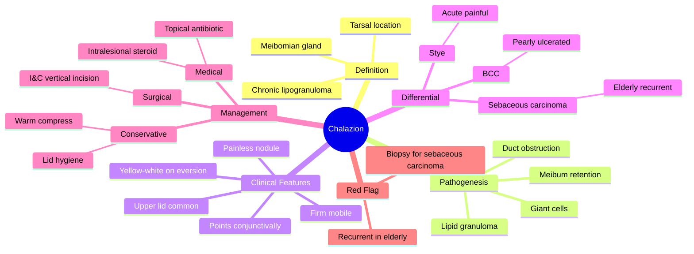

# Chalazion (Meibomian Cyst)

Related: [[Blepharitis]], [[Hordeolum (Stye)]], [[Eyelid Tumours]]

> [!tip] **FCPS/MRCP Priority: HIGH**
> Differentiate from stye (acute, painful, suppurative) and **sebaceous carcinoma** (chronic, recurrent, elderly). Watch for the masquerade.

---

## Learning Objectives
- [ ] Define chalazion and describe its pathogenesis
- [ ] Identify the clinical features and differentiate it from hordeolum
- [ ] Outline stepwise management (conservative → intralesional steroid → I&C)
- [ ] Recognise indications for biopsy (recurrent, atypical, elderly)
- [ ] List the differential diagnosis of a chronic lid nodule

---

## 1. Definition / Epidemiology

### Definition
- **Chalazion (meibomian cyst):** Chronic, lipogranulomatous inflammation of a meibomian gland caused by obstruction of the gland duct and retention of meibum
- Histology: **lipid-laden macrophages, multinucleated giant cells, chronic inflammatory cells, and fibrosis** — a granulomatous foreign-body reaction to leaked meibum

### Epidemiology
- Common in adults; both sexes
- Often associated with blepharitis, MGD, rosacea, and seborrhoeic dermatitis
- Most common in the **upper lid** (more meibomian glands)
- Recurrent or atypical chalazia in elderly patients should raise suspicion of **sebaceous gland carcinoma**

---

## 2. Aetiology / Pathophysiology

### Pathogenesis
- Obstruction of the meibomian gland duct by thickened, inspissated meibum
- Retention and leakage of meibum into surrounding tarsal tissue
- **Lipogranulomatous reaction** — lipid-laden macrophages, foreign-body giant cells, plasma cells, lymphocytes
- Granulation tissue and fibrosis → firm, slowly enlarging nodule

### Risk Factors
- Chronic blepharitis (especially posterior — MGD)
- Rosacea
- Seborrhoeic dermatitis
- Acne vulgaris
- Poor lid hygiene
- Diabetes mellitus (implicated in recurrent cases)
- Demodex infestation (contributes to MGD)

### Natural History
- Most resolve spontaneously over weeks to months
- May persist or enlarge → cosmetic concern, mechanical ptosis, astigmatism (if large)
- Internal hordeolum that fails to drain may evolve into a chalazion

---

## 3. Clinical Features

### Symptoms
- **Painless, slowly growing** lump in the eyelid
- ± mild heaviness, cosmetic concern
- ± blurred vision (if large lesion presses on globe or induces astigmatism)
- No acute pain, no systemic symptoms (distinguishes from stye)

### Signs
- **Firm, round, mobile, non-tender** nodule
- Usually **away from the lash line** (in the tarsus, not at the follicle)
- **Tarsal (inner) location** — points **toward the conjunctival side**
- Eversion of the lid reveals a **yellow-white nodule** on the tarsal conjunctiva
- ± mild skin erythema (if secondary infection)
- Most commonly in the **upper lid**
- Spontaneous drainage (conjunctival side) may occur

### Multiple / Recurrent Chalazia
- Suggest underlying blepharitis, MGD, rosacea
- In elderly patients: must **exclude sebaceous gland carcinoma**

---

## 4. Examination

- **Evert the lid** (after instilling topical anaesthetic) to visualise the tarsal conjunctival surface
- **Yellow-white nodule** visible on the tarsal surface
- Express meibomian glands: assess for **MGD** (cloudy/inspissated meibum)
- Check the **lash line** (to rule out a stye at the follicle)
- Palpate for size, mobility, tenderness, fixity to skin or tarsus
- Inspect lid margin for loss of lashes (madarosis) and ulceration
- Examine preauricular and submandibular lymph nodes
- **Biopsy if recurrent, atypical, elderly** — to rule out sebaceous gland carcinoma
- Imaging generally not required

---

## 5. Investigations

- **Clinical diagnosis** in most cases
- Slit-lamp biomicroscopy for detailed assessment
- **Biopsy + histopathology** for:
  - Recurrent chalazion at the same site
  - Atypical features (irregular margin, ulceration, pagetoid spread, lash loss)
  - Patients > 50–60 years old
  - Lesions unresponsive to standard treatment
- **Meibography** (infra-red) may document MGD in recurrent cases

---

## 6. Differential Diagnosis

| Condition | Distinguishing Features |
|-----------|------------------------|
| **Hordeolum (stye)** | Acute, painful, suppurative, at the lash line (external) or in tarsus (internal) |
| **Sebaceous gland carcinoma** | Elderly, recurrent, atypical, lash loss, pagetoid conjunctival spread; **masquerade syndrome** |
| **Basal cell carcinoma (BCC)** | Pearly nodule with rolled edges, central ulceration, telangiectasia, slow-growing |
| **Squamous cell carcinoma (SCC)** | Ulcerated, hyperkeratotic, indurated |
| **Molluscum contagiosum** | Umbilicated, pearly papule near the lid margin; can shed virus → chronic follicular conjunctivitis |
| **Xanthelasma** | Yellow soft plaques on medial canthus (skin, not tarsus) |
| **Pyogenic granuloma** | Red, vascular, friable nodule; usually after trauma or surgery |
| **Keratoacanthoma** | Rapidly growing, central keratin plug, may involute |
| **Preseptal cellulitis** | Diffuse lid swelling, erythema, tenderness, fever |

---

## 7. Management

### Conservative (First-line; most resolve)
- **Warm compress** 4×/day × 2 weeks (10–15 min each session)
- **Lid massage** after warm compress to express gland contents
- **Lid hygiene** (lid scrubs) to clear meibomian orifices
- Treat underlying blepharitis / MGD

### Medical
- **Intralesional corticosteroid (triamcinolone acetonide 0.1–0.2 mL of 40 mg/mL)** — for lesions persisting despite 2–4 weeks of conservative therapy
  - Injected through the tarsal conjunctiva or transcutaneously
  - Avoid in suspected sebaceous carcinoma (would mask histology)
- **Topical antibiotic** (chloramphenicol, fusidic acid) if secondary infection
- **Topical antibiotic–steroid** combination if significant inflammation

### Surgical — Incision and Curettage (I&C)
- Indicated if: not resolved with conservative + medical therapy, large, cosmetically unacceptable, or recurrent
- Technique:
  - Local anaesthetic infiltration (2% lignocaine ± adrenaline)
  - Apply chalazion clamp; evert the lid
  - **Vertical incision over the tarsal conjunctiva** (preserves meibomian glands and avoids lid notching)
  - Curette out the gelatinous contents
  - Send specimen for **histopathology** in atypical / recurrent cases
- Apply antibiotic ointment post-procedure

### Recurrent / Atypical Lesions
- **Send specimen for histopathology** to **exclude sebaceous gland carcinoma** (especially in elderly)
- Treat underlying blepharitis / MGD / rosacea
- Reassess diagnosis if no resolution after I&C + biopsy

---

## 8. Complications

- Secondary infection → internal hordeolum, preseptal cellulitis (rare)
- Mechanical ptosis (large upper lid lesion)
- Induced astigmatism
- Cosmetic deformity
- Recurrence (suggests underlying MGD or malignancy)
- **Misdiagnosis of sebaceous gland carcinoma** — the most serious complication
- Lid notching (if horizontal incision made across the tarsus — avoid this)

---

## 9. Red Flags / Emergencies

- **Recurrent chalazion at the same site** — biopsy to exclude malignancy
- **Unilateral, atypical lesion in elderly** with lash loss, ulceration, or pagetoid spread — suspect **sebaceous gland carcinoma**
- Rapid growth, fixity to deeper structures, induration
- Non-resolution after I&C with histopathology
- Associated proptosis or restricted ocular motility (orbital extension)

---

## 10. FCPS/MRCP High-Yield Summary

| Topic | Key Points |
|-------|------------|
| Chalazion | Chronic meibomian cyst, painless, points conjunctivally |
| Stye (hordeolum) | Acute, painful, suppurative, at lash line |
| Pathology | Lipogranuloma (lipid-laden macrophages, giant cells) |
| First-line | Warm compress + lid hygiene |
| Persistent | Intralesional triamcinolone OR incision and curettage |
| Recurrent in elderly | **Biopsy** — exclude sebaceous gland carcinoma |
| Underlying associations | Blepharitis, MGD, rosacea |
| Avoid | Horizontal incision across tarsus → lid notching |

---

## 11. Viva Questions

1. **Q:** How do you differentiate a chalazion from a stye?
   **A:** Chalazion = chronic, painless, away from lash line, points conjunctivally, on tarsus. Stye = acute, painful, suppurative, at lash line (external) or in tarsus (internal).

2. **Q:** What is the pathology of a chalazion?
   **A:** Lipogranulomatous inflammation — lipid-laden macrophages, multinucleated giant cells, lymphocytes, and fibrosis.

3. **Q:** When should you biopsy a chalazion?
   **A:** Recurrent, atypical, or in elderly — to exclude sebaceous gland carcinoma (masquerade syndrome).

4. **Q:** What is the treatment of a persistent chalazion?
   **A:** Intralesional triamcinolone OR incision and curettage (I&C); the incision is made **vertically** on the tarsal conjunctiva to avoid lid notching.

5. **Q:** Why do chalazia recur?
   **A:** Underlying blepharitis, MGD, rosacea — or missed sebaceous gland carcinoma in the elderly.

---

## 12. Common Confusions / Exam Traps

| Confusion | Clarification |
|-----------|---------------|
| "Chalazion is a cyst of the lash follicle" | No — it is in the **meibomian gland** (tarsus), not the lash follicle |
| "Chalazion points externally" | No — points **toward the conjunctiva** (visible on lid eversion) |
| "Recurrent chalazion is benign in the elderly" | **No** — must biopsy to exclude **sebaceous gland carcinoma** (masquerade) |
| "Chalazion needs immediate incision" | First-line is conservative (warm compress); only I&C if persistent |
| "Horizontal incision is preferred for I&C" | **Vertical** incision on tarsal conjunctiva preserves meibomian glands and avoids lid notching |
| "Intralesional steroid is safe in all cases" | Avoid if sebaceous carcinoma is suspected (may obscure histology) |
| "Chalazion and stye are the same thing" | Stye = acute suppurative (glands of Zeis/Moll/meibomian); chalazion = chronic lipogranuloma |

---

## 13. Mnemonics

1. **"**C**halazion = **C**hronic, **C**onjunctival, **C**heesy core"** — chronic, points to conjunctiva, with cheesy/granulomatous contents
2. **"**S**ebaceous **C**arcinoma = **S**ingle site, **S**uspicious in **S**eniors"** — always biopsy recurrent chalazion in elderly
3. **"**I**ncise **V**ertically, **C**urette **C**ontents"** — vertical incision on tarsal conjunctiva to avoid lid notching

---

## 14. Mind Map

---

## 15. One-Page Revision Card

| **Topic** | **Chalazion (Meibomian Cyst)** |
|-----------|--------------------------------|
| **Definition** | Chronic lipogranuloma of meibomian gland |
| **Pathology** | Lipid-laden macrophages, giant cells |
| **Location** | Tarsus — points to **conjunctiva** (visible on eversion) |
| **Symptoms** | Painless, slowly growing lump |
| **Differential** | Stye (acute), sebaceous carcinoma (elderly) |
| **First-line** | Warm compress 4×/day × 2 weeks + lid hygiene |
| **Persistent** | Intralesional triamcinolone OR I&C |
| **I&C technique** | Vertical incision on tarsal conjunctiva |
| **Recurrent / elderly** | **Biopsy — exclude sebaceous carcinoma** |
| **Viva Pearl** | Recurrent chalazion in elderly = sebaceous carcinoma until proven otherwise |

---

## Spaced Repetition Trackers

### 24-Hour Recall Prompts
- [ ] Define chalazion and state its pathology
- [ ] List 3 differences from a stye
- [ ] Outline the stepwise management
- [ ] State the indication and technique for I&C
- [ ] Identify the red flag for sebaceous gland carcinoma

### Revision Schedule
- [ ] **Day 1** completed (creation + 24h recall)
- [ ] **Day 3** revision completed
- [ ] **Day 7** revision completed
- [ ] **Day 15** revision completed
- [ ] **Day 30** revision completed
- [ ] **Day 90** revision completed

---

## Must Know / Should Know / Nice to Know

### Must Know (Core for passing)
- [x] Definition and pathology
- [x] Difference from stye (chronic vs acute, painless vs painful, tarsus vs lash line)
- [x] First-line management (warm compress, lid hygiene)
- [x] I&C indication and technique
- [x] Recurrent lesion in elderly — biopsy to exclude sebaceous carcinoma

### Should Know (High probability)
- [x] Intralesional triamcinolone for persistent lesions
- [x] Associations: blepharitis, MGD, rosacea
- [x] Vertical (not horizontal) incision on tarsal conjunctiva
- [x] Differential: BCC, SCC, molluscum, xanthelasma

### Nice to Know (Differentiator)
- [ ] Histology details (multinucleated giant cells, plasma cells, fibrosis)
- [ ] Meibography to assess MGD
- [ ] Avoid intralesional steroid if malignancy suspected
- [ ] Astigmatism induced by large upper lid lesions

---

## My Weak Points
- [ ] Add personal weak areas here

---

## Self-Test Scorecard

| Section | Score /5 |
|---------|----------|
| Understanding: | /10 |
| Recall: | /10 |
| MCQ Performance: | /10 |
| SBA Performance: | /10 |
| Viva Confidence: | /10 |
| Total: | /50 |

> [!tip] **Interpretation:** <35 = weak topic, 35–44 = acceptable but insecure, 45+ = strong exam-ready topic.

---

## Exam Answer Modes

### Long Answer Skeleton
1. **Definition:** Chronic lipogranulomatous inflammation of meibomian gland
2. **Pathogenesis:** Duct obstruction → meibum retention → lipogranuloma (macrophages, giant cells, fibrosis)
3. **Clinical features:** Painless, firm, mobile tarsal nodule pointing conjunctivally; ± blepharitis / MGD
4. **Differential:** Stye, sebaceous carcinoma, BCC, SCC, molluscum, xanthelasma
5. **Management:** Conservative (warm compress) → intralesional steroid → I&C (vertical incision) → biopsy if atypical/recurrent/elderly
6. **Complications:** Cosmetic, mechanical ptosis, astigmatism, missed malignancy

### Short Note Skeleton
- Definition + pathology
- Key features: painless, tarsal, points conjunctivally
- Difference from stye
- Treatment: warm compress → I&C; biopsy in elderly/recurrent

### Viva One-Liners
- **Q:** Chalazion vs stye? → **A:** Chalazion = chronic, painless, tarsal, lipogranuloma; Stye = acute, painful, suppurative, at lash line
- **Q:** Pathology? → **A:** Lipogranulomatous inflammation (lipid-laden macrophages, giant cells)
- **Q:** When to biopsy? → **A:** Recurrent, atypical, or in elderly (exclude sebaceous carcinoma)
- **Q:** I&C incision direction? → **A:** **Vertical** incision on tarsal conjunctiva (avoids lid notching)
- **Q:** First-line treatment? → **A:** Warm compress 4×/day × 2 weeks + lid hygiene

### Ward-Case Discussion Points
- Evert the lid and demonstrate the tarsal nodule
- Differentiate from stye, BCC, sebaceous carcinoma
- Initiate warm compress + lid hygiene
- Discuss when to consider biopsy (elderly, recurrent, atypical)
- Counsel on chronicity and underlying MGD

### Last-Night-Before-Exam Sheet
- **Top 5 facts:** chronic lipogranuloma; painless tarsal nodule; points conjunctivally; warm compress first; **biopsy recurrent lesion in elderly**
- **Mnemonics:** "Chalazion = Chronic, Conjunctival, Cheesy core"; "Sebaceous Carcinoma = Single site, Suspicious in Seniors"; "Incise Vertically, Curette Contents"
- **Must-know differential:** Sebaceous gland carcinoma (masquerade syndrome)
- **Trap to avoid:** Intralesional steroid if malignancy is suspected

---

## Summary

Chalazion is a chronic lipogranuloma of a meibomian gland, presenting as a painless, firm, mobile tarsal nodule that points toward the conjunctival surface. Conservative management (warm compress, lid hygiene) resolves most cases; intralesional triamcinolone or incision and curettage (with a **vertical** tarsal incision) is used for persistent lesions. **Recurrent or atypical lesions, particularly in the elderly, must be biopsied to exclude sebaceous gland carcinoma** (masquerade syndrome). Underlying blepharitis, MGD, and rosacea should be treated to prevent recurrence.

---

## MCQs (10)

1. **Question:** A chalazion is best described as:
   **Options:** A. Acute infection of meibomian gland B. Chronic lipogranulomatous inflammation C. Malignant tumour D. Sebaceous cyst E. Allergic reaction
   **Answer:** B
   **Explanation:** Chronic lipogranulomatous inflammation due to obstruction and leakage of meibum.

2. **Question:** The histology of a chalazion shows:
   **Options:** A. Neutrophilic microabscess B. Lipid-laden macrophages and multinucleated giant cells C. Atypical squamous cells D. Caseating granulomas E. Lymphoid follicles with germinal centres
   **Answer:** B
   **Explanation:** Lipogranulomatous reaction — lipid-laden macrophages, foreign-body giant cells, plasma cells, lymphocytes.

3. **Question:** A chalazion typically points:
   **Options:** A. Toward the skin B. Toward the conjunctiva C. Outward (anteriorly) D. Inferiorly E. Superiorly
   **Answer:** B
   **Explanation:** Tarsal (inner) location — points to conjunctiva, visible on lid eversion.

4. **Question:** First-line management of a small chalazion is:
   **Options:** A. Incision and curettage B. Warm compresses and lid hygiene C. Steroid injection D. Cryotherapy E. Radiotherapy
   **Answer:** B
   **Explanation:** Conservative first-line; most resolve with warm compresses 4×/day × 2 weeks.

5. **Question:** A recurrent chalazion at the same site in a 70-year-old should raise suspicion of:
   **Options:** A. Basal cell carcinoma B. Sebaceous gland carcinoma C. Melanoma D. Squamous papilloma E. Trachoma
   **Answer:** B
   **Explanation:** Sebaceous carcinoma is the classic masquerade — must biopsy.

6. **Question:** The preferred incision direction for incision and curettage of a chalazion is:
   **Options:** A. Horizontal across the tarsus B. Vertical on the tarsal conjunctiva C. Oblique skin incision D. Through the lash line E. Random
   **Answer:** B
   **Explanation:** Vertical incision preserves meibomian glands and avoids lid notching.

7. **Question:** Intralesional triamcinolone for a chalazion is given:
   **Options:** A. As first-line therapy B. For persistent lesions failing conservative treatment C. Only for lower lid lesions D. As prophylaxis E. Only in children
   **Answer:** B
   **Explanation:** Used after failure of warm compress; injected into the lesion through the tarsal conjunctiva or skin.

8. **Question:** A chalazion differs from a stye because chalazion is:
   **Options:** A. Acute and suppurative B. Painful at the lash line C. Chronic, painless, and on the tarsus D. Always bilateral E. Caused by Demodex
   **Answer:** C
   **Explanation:** Chalazion = chronic, painless, tarsal; stye = acute, painful, at lash line (external) or tarsus (internal).

9. **Question:** Which of the following conditions is most likely associated with multiple chalazia?
   **Options:** A. Acute glaucoma B. Posterior blepharitis (MGD) and rosacea C. Retinal detachment D. Optic neuritis E. Interstitial keratitis
   **Answer:** B
   **Explanation:** Underlying MGD, blepharitis, and rosacea predispose to multiple / recurrent chalazia.

10. **Question:** A 65-year-old with a 6-month history of a chalazion not responding to I&C and intralesional steroid has lash loss and a thickened, vascularised upper lid margin.
    **Options:** A. Continue observation B. Topical steroid only C. **Biopsy to exclude sebaceous gland carcinoma** D. Topical antibiotic E. Cryotherapy
    **Answer:** C
    **Explanation:** Atypical, recurrent lesion in elderly with lash loss → biopsy mandatory to exclude sebaceous carcinoma.

---

## SBA Questions (10)

1. **Scenario:** A 35-year-old woman presents with a 3-week history of a painless, firm, mobile lump in the right upper lid. Eversion of the lid reveals a yellow-white nodule on the tarsal conjunctiva.
   **Question:** Most likely diagnosis?
   **Options:** A. Stye (hordeolum) B. Chalazion C. Sebaceous carcinoma D. BCC E. Xanthelasma
   **Answer:** B
   **Explanation:** Painless + tarsal + yellow-white nodule on eversion = chalazion.

2. **Scenario:** A 28-year-old has a small chalazion in the right upper lid for 3 weeks. There is no pain, no lash loss, and no eyelid erythema.
   **Question:** Best initial management?
   **Options:** A. Incision and curettage B. Intralesional triamcinolone C. Warm compress 4×/day × 2 weeks + lid hygiene D. Topical steroid E. Biopsy
   **Answer:** C
   **Explanation:** First-line is conservative — warm compress and lid hygiene; most resolve in 2–4 weeks.

3. **Scenario:** A 45-year-old man has a chalazion persisting after 4 weeks of warm compresses. There is no suspicion of malignancy.
   **Question:** Most appropriate next step?
   **Options:** A. Continue observation B. **Intralesional triamcinolone OR incision and curettage** C. Oral doxycycline D. Cryotherapy E. Topical steroid only
   **Answer:** B
   **Explanation:** Persistent chalazion after conservative treatment → intralesional steroid or I&C.

4. **Scenario:** A 70-year-old has a recurrent chalazion at the same site on the upper lid, with lash loss (madarosis) and pagetoid conjunctival vascularisation.
   **Question:** Most likely diagnosis?
   **Options:** A. Recurrent chalazion B. **Sebaceous gland carcinoma** C. BCC D. SCC E. Trichoepithelioma
   **Answer:** B
   **Explanation:** Recurrent chalazion + lash loss + pagetoid spread in elderly = sebaceous gland carcinoma (masquerade syndrome).

5. **Scenario:** A 60-year-old woman with suspected recurrent chalazion is about to undergo incision and curettage. The surgeon plans a vertical incision on the tarsal conjunctiva.
   **Question:** Why is a vertical incision preferred over a horizontal one?
   **Options:** A. Faster healing B. Better cosmesis only C. **Preserves meibomian glands and avoids lid notching** D. Reduces infection risk E. Easier to perform
   **Answer:** C
   **Explanation:** Vertical incision follows the plane of the meibomian glands, preserving their structure and preventing lid margin notching.

6. **Scenario:** A 50-year-old with multiple recurrent chalazia in both eyes has thickened, erythematous lid margins with telangiectasia and facial flushing.
   **Question:** Most likely associated systemic condition?
   **Options:** A. Diabetes mellitus B. Acne rosacea C. HIV D. Sarcoidosis E. Tuberculosis
   **Answer:** B
   **Explanation:** Rosacea is strongly associated with MGD and recurrent chalazia.

7. **Scenario:** A 65-year-old with a 4-month history of a chalazion has had three incision and curettage procedures with no resolution. Histology shows foamy, vacuolated cells infiltrating the tarsus with pagetoid conjunctival spread.
   **Question:** Most likely diagnosis?
   **Options:** A. Recurrent chalazion B. Sebaceous gland carcinoma C. BCC D. Squamous papilloma E. Trichoepithelioma
   **Answer:** B
   **Explanation:** Vacuolated, foamy (lipid-laden) cells with pagetoid spread = sebaceous carcinoma.

8. **Scenario:** A 40-year-old presents with a 2-week history of an acutely painful red lump at the right upper lid lash line with a yellow pustule.
   **Question:** Most likely diagnosis?
   **Options:** A. Chalazion B. **External hordeolum (stye)** C. Preseptal cellulitis D. Sebaceous carcinoma E. BCC
   **Answer:** B
   **Explanation:** Acute + painful + at lash line = external hordeolum (stye), not chalazion.

9. **Scenario:** A 70-year-old is scheduled for I&C of a recurrent upper lid chalazion. There is lash loss and the lesion has irregular margins.
   **Question:** Most important step in management?
   **Options:** A. Use general anaesthesia B. **Send the specimen for histopathology** C. Use only intralesional steroid D. Apply cryotherapy to the base E. Treat with topical antibiotic only
   **Answer:** B
   **Explanation:** Atypical, recurrent chalazion in elderly — specimen must go for histopathology to rule out sebaceous carcinoma.

10. **Scenario:** A patient with a chalazion undergoes I&C. Histology shows lipid-laden macrophages, multinucleated giant cells, lymphocytes, and fibrosis.
    **Question:** What is the diagnosis?
    **Options:** A. Sebaceous carcinoma B. **Chalazion (lipogranuloma)** C. Hordeolum D. BCC E. Molluscum contagiosum
    **Answer:** B
    **Explanation:** Classic lipogranulomatous histology of a chalazion.

---

## Flashcards

- **Q:** What is a chalazion?
  **A:** Chronic lipogranulomatous inflammation of a meibomian gland from duct obstruction and meibum retention.
- **Q:** Pathology of chalazion?
  **A:** Lipid-laden macrophages, multinucleated giant cells, plasma cells, lymphocytes, fibrosis.
- **Q:** How to differentiate chalazion from stye?
  **A:** Chalazion = chronic, painless, tarsal, points to conjunctiva. Stye = acute, painful, suppurative, at lash line.
- **Q:** First-line treatment of chalazion?
  **A:** Warm compress 4×/day × 2 weeks + lid hygiene.
- **Q:** When to biopsy?
  **A:** Recurrent, atypical, or in elderly — to exclude **sebaceous gland carcinoma** (masquerade syndrome).
- **Q:** I&C incision direction?
  **A:** **Vertical** on the tarsal conjunctiva (avoids lid notching, preserves meibomian glands).

---

## Answer Key with Explanations

### MCQs
1. **B** — Chalazion is a chronic lipogranulomatous inflammation of the meibomian gland.
2. **B** — Histology: lipid-laden macrophages and foreign-body giant cells (lipogranuloma).
3. **B** — Tarsal location → points to the conjunctival surface (visible on lid eversion).
4. **B** — Warm compresses and lid hygiene are first-line; most resolve spontaneously.
5. **B** — Recurrent chalazion in elderly = suspect sebaceous gland carcinoma; biopsy.
6. **B** — Vertical incision on tarsal conjunctiva preserves meibomian glands and avoids lid notching.
7. **B** — Intralesional triamcinolone is for lesions failing conservative treatment.
8. **C** — Chalazion = chronic, painless, tarsal (vs stye = acute, painful, at lash line).
9. **B** — MGD and rosacea predispose to multiple/recurrent chalazia.
10. **C** — Atypical, recurrent lesion in elderly with lash loss → biopsy to exclude sebaceous carcinoma.

### SBAs
1. **B** — Painless, tarsal, yellow-white nodule on eversion = chalazion.
2. **C** — First-line is conservative: warm compress + lid hygiene.
3. **B** — Persistent chalazion → intralesional triamcinolone OR I&C.
4. **B** — Recurrent + lash loss + pagetoid spread in elderly = sebaceous carcinoma (masquerade).
5. **C** — Vertical incision preserves meibomian glands and prevents lid notching.
6. **B** — Rosacea is associated with MGD and recurrent chalazia.
7. **B** — Foamy vacuolated cells with pagetoid spread = sebaceous carcinoma.
8. **B** — Acute, painful, at lash line = external hordeolum (stye).
9. **B** — Specimen must be sent for histopathology in atypical/recurrent elderly cases.
10. **B** — Lipid-laden macrophages + giant cells + fibrosis = classic chalazion histology.

---

## Tags
#medicine #davidson #ophthalmology #chalazion #lids #fcps #mrcp
