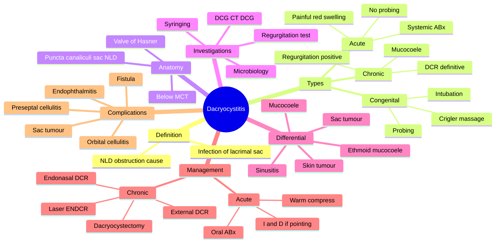

# Dacryocystitis

Related: [[Lids and Lacrimal Hub]], [[Dacryostenosis]]

> [!tip] **FCPS/MRCP Priority: HIGH**
> Acute = painful, red swelling at medial canthus. Chronic = mucocoele with regurgitation on pressure. Always consider in medial canthal swelling.

---

## Learning Objectives
- [ ] Define dacryocystitis and distinguish acute from chronic
- [ ] Identify nasolacrimal duct obstruction as the underlying cause
- [ ] Describe the clinical features of acute and chronic dacryocystitis
- [ ] Perform and interpret the regurgitation test and lacrimal syringing
- [ ] List the differential diagnoses of medial canthal swelling
- [ ] Describe the management of acute (medical ± I&D) and chronic (DCR) dacryocystitis
- [ ] Manage congenital dacryocystitis (Crigler massage, probing, intubation)
- [ ] Recognise the risk of endophthalmitis and the importance of pre-op clearance

---

## 1. Definition

- **Dacryocystitis:** Infection/inflammation of the lacrimal sac
- Usually due to obstruction of the nasolacrimal duct (NLD)
- Acute (suppurative) or chronic (mucocoele)

---

## 2. Causes

- **Nasolacrimal duct obstruction (NLDO):** Most common underlying cause
  - Idiopathic (acquired, age-related)
  - Congenital (delayed canalisation)
  - Secondary: dacryolith, tumour, sinus disease, post-surgery, radiation
- **Lacrimal sac tumour** (rare) — must consider if chronic

---

## 3. Clinical Features

### Acute Dacryocystitis
- Painful, red, swollen mass at medial canthus (below medial canthal tendon)
- Epiphora
- Tearing, discharge (purulent)
- May have preseptal cellulitis
- Systemic: fever, lymphadenopathy

### Chronic Dacryocystitis
- Epiphora (chronic tearing)
- Mucocoele: swelling at medial canthus, expresses mucoid material on pressure
- Regurgitation test: pressure on sac → fluid/mucus refluxes through punctum
- Recurrent low-grade infections
- Risk of endophthalmitis (especially after intraocular surgery)

### Congenital
- Most common cause of neonatal epiphora
- Often resolves by 1 year

---

## 4. Examination

- Regurgitation test (pressure over lacrimal sac)
- Syringing (lacrimal irrigation)
- Lacrimal sac palpation
- Look for fistula (chronic)
- Dacryocystography (DCG) or CT-DCG for anatomy
- Bimanual exam to differentiate from tumour

### Differential of Medial Canthal Swelling
- Dacryocystitis
- Mucocoele
- Lacrimal sac tumour (pleomorphic adenoma, lymphoma)
- Ethmoid mucocoele
- Skin tumour

---

## 5. Management

### Acute Dacryocystitis
- **Systemic antibiotics** (flucloxacillin, co-amoxiclav, or as per local guidance)
- **Warm compresses**
- **Topical antibiotics** (chloramphenicol)
- **Incision and drainage** if pointing/fluctuant (do NOT probe or syringing in acute — risk of spread)
- **Definitive surgery (DCR) deferred** until acute resolves (~2–4 weeks)

### Chronic Dacryocystitis
- **Dacryocystorhinostomy (DCR):** Surgical — creates new drainage pathway between lacrimal sac and nasal cavity
  - **External DCR:** Gold standard, very high success (>90%)
  - **Endonasal (ENDCR):** Faster recovery, no scar
  - **Laser-assisted ENDCR:** Limited success vs external
- **Dacryocystectomy** (sac removal) — elderly, frail, tumour

### Congenital
- **Crigler massage** (hydrostatic pressure on sac)
- **Probing** at 12–18 months if persistent
- **Intubation** (silicon stent) if probing fails
- **DCR** if persistent beyond 4–5 years

---

## 6. Pathophysiology and Anatomy — Extended

### Anatomy Review
- Lacrimal drainage: puncta → canaliculi (common canaliculus → ampulla) → lacrimal sac → NLD → inferior meatus of nose (under inferior turbinate)
- Valve of Hasner: mucosal fold at lower end of NLD (site of congenital obstruction)
- Valve of Rosenmüller: at junction of common canaliculus and sac (prevents reflux)

### Pathophysiology
- NLD obstruction → stasis of tears in sac → bacterial proliferation (Staph aureus, Strep, Haemophilus)
- Acute: pyogenic infection → abscess formation, can spread to preseptal tissues
- Chronic: low-grade inflammation, mucocoele (sterile mucus accumulation), recurrent acute exacerbations
- Post-viral (esp. HSV), chronic sinusitis, nasal polyps, dacryolith, malignancy may obstruct NLD

---

## 7. Clinical Features — Extended

### Acute Dacryocystitis
- Tender, erythematous, warm swelling at medial canthus BELOW the medial canthal tendon
- Distinguishes from preseptal cellulitis (more diffuse) and hordeolum (lid margin)
- Epiphora and purulent discharge from punctum (reflux on lacrimal sac pressure)
- Systemic features: fever, malaise, preauricular/submandibular lymphadenopathy
- May point and discharge through skin (fistula formation in chronic recurrent cases)

### Chronic Dacryocystitis
- Persistent epiphora
- Mucocoele: painless or mildly tender, reducible swelling below MCT
- Regurgitation test positive: pressure over sac → mucoid/mucopurulent material from punctum
- Recurrent low-grade infection (acute on chronic)
- Risk of endophthalmitis after intraocular surgery (cataract) — must be cleared pre-op

### Congenital
- Neonatal epiphora ± mucoid discharge, often within first weeks of life
- Distinguish from congenital glaucoma (buphthalmos, photophobia, corneal oedema) and conjunctivitis
- Crigler test: hydrostatic pressure on sac may express material from punctum
- 90% resolve spontaneously by 12 months

---

## 8. Investigations

### Bedside
- **Regurgitation test** (pressure over sac): positive = mucoid/mucopurulent reflux from punctum
- **Lacrimal syringing:** normal canaliculi + obstruction at sac/NLD level
- **Fluorescein disappearance test** (FDT): fluorescein remains after 5 min = obstruction
- **Dye disappearance test**

### Imaging
- **Dacryocystography (DCG):** Contrast study outlines lacrimal system; identifies level of obstruction
- **CT-DCG** or **CT of sinuses/orbit:** When tumour or sinus disease suspected
- **MRI** for soft-tissue tumours
- **Nasal endoscopy:** Pre-op assessment for DCR

### Microbiology
- Swab of discharge (purulent material from punctum or I&D)
- Common organisms: Staph aureus, Strep pneumoniae, H. influenzae, Pseudomonas (chronic)

---

## 9. Differential Diagnosis — Medial Canthal Swelling

| Condition | Distinguishing feature |
|-----------|------------------------|
| Acute dacryocystitis | Tender, below MCT, positive regurgitation |
| Chronic dacryocystitis/mucocoele | Below MCT, painless, expresses mucoid material |
| Lacrimal sac tumour (pleomorphic adenoma, lymphoma) | Firm, non-tender, ABOVE MCT, blood-stained reflux |
| Preseptal cellulitis | Diffuse lid swelling, no punctal reflux |
| Ethmoid mucocoele | Deeper, proptosis, ± chronic sinusitis |
| Frontal/ethmoid sinus mucocoele | Above MCT, imaging distinguishes |
| Skin tumour (BCC, SCC) | Cutaneous, ulceration, telangiectasia |
| Dacryolith (stone) | Hard on palpation, recurrent infections |
| Sinusitis with periorbital extension | Sinus tenderness, fever, imaging |
| Granuloma (sarcoid, TB) | Chronic, systemic features |

### "Above MCT vs Below MCT" Rule
- Lacrimal sac swelling is BELOW the medial canthal tendon
- Tumours of sac, ethmoid mucocoele and sinus disease can extend ABOVE the tendon — suspect tumour

---

## 10. Management — Extended

### Acute Dacryocystitis
- **First-line:** Oral flucloxacillin (or co-amoxiclav); metronidazole if anaerobic suspicion
- Topical chloramphenicol drops
- Warm compresses; analgesia
- **Avoid probing/syringing** in acute phase (risk of spreading infection, especially orbital cellulitis)
- **Incision and drainage (I&D):** If pointing or fluctuant; make incision over most prominent point; do not probe duct
- **DCR deferred** until acute inflammation resolves (typically 2–4 weeks)

### Chronic Dacryocystitis
- **Definitive surgery: DCR (Dacryocystorhinostomy)**
  - **External DCR:** Gold standard. 90–95% success. Cutaneous incision, remove bone between sac and nose, fashion mucosal flaps (sac to nasal mucosa), often with silicone intubation
  - **Endonasal DCR (ENDCR):** Through nose, no scar, faster recovery, slightly lower success (80–90%)
  - **Laser-assisted ENDCR:** Holmium:YAG or KTP laser; rapid healing but lower success (60–80%)
- **Dacryocystectomy (surgical removal of sac):** Elderly, frail, tumour
- Balloon dacryoplasty: less effective, can be tried for partial obstruction

### Congenital Dacryocystitis / NLDO
- **Crigler massage** (hydrostatic pressure): 10 strokes 2–3× daily, over the sac
- **Probing** at 12–18 months if persistent: passes a probe through punctum to nose
- **Silicone intubation** (stent): if probing fails; stent left for 2–6 months
- **Balloon dacryoplasty** for older children
- **DCR** if persistent beyond 4–5 years

### Prevention of Endophthalmitis
- All patients undergoing intraocular surgery (cataract, vitrectomy) must have patent lacrimal system or be treated before surgery
- DCR before cataract surgery if NLD obstruction present (combined procedure possible)

---

## 11. Complications

- Preseptal cellulitis
- Orbital cellulitis (rare but serious)
- Lacrimal sac abscess
- Cutaneous fistula (chronic recurrent)
- **Endophthalmitis** (especially post-intraocular surgery) — devastating
- Dacryolith formation
- Recurrence after DCR (5–10%)
- Sac tumour (rare; long-standing chronic dacryocystitis may predispose to lymphoma)

---

## 12. Red Flags / Emergencies

- Spreading cellulitis / orbital involvement (proptosis, painful eye movements, vision loss) — emergency
- Suspected lacrimal sac tumour (firm mass, ABOVE MCT, blood-stained reflux, rapid growth) — biopsy
- Acute dacryocystitis in a child (consider Haemophilus, urgent ENT/oral antibiotics)
- Bilateral dacryocystitis in a child — consider rare causes (Langerhans cell histiocytosis, lymphoma, sinus pathology)
- Patient awaiting intraocular surgery with active dacryocystitis — defer surgery or treat first

---

## 13. FCPS/MRCP High-Yield Summary

| Topic | Key Points |
|-------|------------|
| Cause | NLD obstruction |
| Acute | Painful, red, swelling at medial canthus, systemic ABx |
| Chronic | Mucocoele, regurgitation, epiphora |
| Definitive | DCR (external preferred) |
| Regurgitation test | Pressure → fluid from punctum |
| Don't probe acute | Risk of spread |
| Endophthalmitis risk | Chronic dacryocystitis + intraocular surgery |
| Congenital | Crigler massage → probing → intubation → DCR |
| Medial canthal tumour | Above MCT → consider sac tumour |

### Key One-Liners
- "Dacryocystitis = lacrimal sac infection, usually NLD obstruction"
- "Regurgitation test: pressure on sac → fluid from punctum"
- "DCR is definitive; don't probe in acute"
- "Endophthalmitis risk: must clear NLD obstruction before cataract surgery"

---

## 14. Viva Questions

1. **Q:** What is the most common cause of dacryocystitis?
   **A:** Nasolacrimal duct obstruction (NLDO).

2. **Q:** What is the surgical management of chronic dacryocystitis?
   **A:** Dacryocystorhinostomy (DCR) — creates bypass drainage into nose.

3. **Q:** Why is probing avoided in acute dacryocystitis?
   **A:** Risk of spreading infection; definitive surgery is done after acute resolves.

4. **Q:** Differentiate lacrimal sac mucocoele from lacrimal sac tumour.
   **A:** Mucocoele = below MCT, expresses mucoid material, mobile; tumour = firm, may be above MCT, blood-stained reflux, progressive.

5. **Q:** Management of congenital dacryocystitis.
   **A:** Crigler massage (most resolve by 12 months) → probing at 12–18 months if persistent → intubation → DCR if persistent.

6. **Q:** Why is chronic dacryocystitis a concern before cataract surgery?
   **A:** Risk of endophthalmitis from infected sac.

---

## 15. Common Confusions / Exam Traps

| Confusion | Clarification |
|-----------|---------------|
| "Probing is part of acute management" | NO — risk of spreading infection. Defer to after acute resolves |
| "DCR can be done in acute dacryocystitis" | NO — defer until acute inflammation settles (2–4 weeks) |
| "Medial canthal swelling = dacryocystitis" | Differential is wide: tumour, ethmoid mucocoele, sinus disease |
| "Dacryocystitis is always acute" | Chronic form exists — mucocoele, recurrent low-grade infection |
| "External DCR and endonasal DCR have same success" | External has higher success (>90%) and is the gold standard |
| "Dacryolith is a tumour" | A stone (calcific concretion) in the sac |
| "Antibiotics alone cure chronic dacryocystitis" | NO — definitive treatment is DCR |

---

## 16. Mnemonics

1. **"DCR = Drainage into the Cavity of the nose (Rhinostomy)"** — DacryoCystoRhinostomy
2. **"ABD: Acute Before DCR"** — Don't probe or do DCR in acute; medical management first
3. **"MICE: Massage → Intubation → Curettage (probing) → End DCR"** — congenital management ladder
4. **"RED-SAC"** — Regurgitation test, Epiphora, Discharge — the three cardinal signs of chronic dacryocystitis
5. **"Above MCT = ALARM"** — mass above medial canthal tendon suggests tumour, not simple mucocoele

---

## Mind Map

---

## One-Page Revision Card

| **Topic** | **Key Point** |
|-----------|---------------|
| **Definition** | Infection of the lacrimal sac, usually from NLD obstruction |
| **Acute features** | Painful red swelling BELOW MCT, fever, purulent discharge |
| **Chronic features** | Epiphora, mucocoele, positive regurgitation, recurrent low-grade infection |
| **Regurgitation test** | Pressure on sac → fluid/mucus from punctum = positive |
| **Investigations** | Clinical, syringing, DCG/CT-DCG |
| **Acute management** | Oral ABx, warm compress, I&D if pointing; NO probing |
| **Chronic management** | DCR (external preferred, >90% success) |
| **Congenital** | Crigler massage → probing 12–18 mo → intubation → DCR |
| **Biggest risk** | Endophthalmitis if intraocular surgery on infected sac |
| **Viva pearl** | "Above MCT = ALARM — suspect tumour" |

---

## Spaced Repetition Trackers

### 24-Hour Recall Prompts
- [ ] Define dacryocystitis
- [ ] Identify the most common cause (NLDO)
- [ ] Describe the regurgitation test
- [ ] State the management of acute dacryocystitis (and why probing is avoided)
- [ ] Define DCR and its success rate
- [ ] List the management ladder for congenital dacryocystitis
- [ ] Explain why chronic dacryocystitis is a concern before cataract surgery

### Revision Schedule
- [ ] **Day 1** completed (creation + 24h recall)
- [ ] **Day 3** revision completed
- [ ] **Day 7** revision completed
- [ ] **Day 15** revision completed
- [ ] **Day 30** revision completed
- [ ] **Day 90** revision completed

---

## Must Know / Should Know / Nice to Know

### Must Know (Core for passing)
- [x] Definition of dacryocystitis
- [x] NLD obstruction as the most common cause
- [x] Acute vs chronic clinical features
- [x] Regurgitation test
- [x] Acute management: systemic ABx, no probing
- [x] Chronic management: DCR
- [x] Endophthalmitis risk before intraocular surgery

### Should Know (High probability)
- [x] Crigler massage, probing, intubation for congenital
- [x] External DCR vs endonasal DCR
- [x] Differential of medial canthal swelling
- [x] Above MCT = suspect tumour

### Nice to Know (Differentiator)
- [ ] Laser-assisted DCR (limitations)
- [ ] Dacryocystectomy indications
- [ ] Specific organisms (Staph, Strep, H. influenzae)
- [ ] CT-DCG for anatomical mapping

---

## My Weak Points
- [ ] Add personal weak areas here

---

## Self-Test Scorecard

| Section | Score /10 |
|---------|-----------|
| Understanding: | /10 |
| Recall: | /10 |
| MCQ Performance: | /10 |
| SBA Performance: | /10 |
| Viva Confidence: | /10 |
| **Total:** | **/50** |

> [!tip] **Interpretation:** <35 = weak topic, 35-44 = acceptable but insecure, 45+ = strong exam-ready topic.

---

## Exam Answer Modes

### Long Answer Skeleton
1. **Definition** — infection/inflammation of the lacrimal sac, usually NLDO
2. **Aetiology** — primary NLDO (idiopathic, age-related), secondary (dacryolith, tumour, sinus disease, post-surgery, radiation)
3. **Anatomy** — drainage pathway puncta → canaliculi → sac → NLD → inferior meatus
4. **Clinical features** — acute (painful, red, below MCT) vs chronic (epiphora, mucocoele, positive regurgitation) vs congenital
5. **Differential** — medial canthal mass (sac tumour, ethmoid mucocoele, sinus disease, skin tumour)
6. **Investigations** — regurgitation test, syringing, FDT, DCG, microbiology
7. **Management** — acute (systemic ABx, NO probing, I&D if pointing, defer DCR); chronic (DCR external > endonasal); congenital (Crigler → probing → intubation → DCR)
8. **Complications** — preseptal/orbital cellulitis, fistula, endophthalmitis, sac tumour

### Short Note Skeleton
- Definition + cause (NLDO)
- Regurgitation test
- Acute management (oral ABx, no probing, defer DCR)
- Chronic management (DCR, external preferred)

### Viva One-Liners
- **Q:** Most common cause of dacryocystitis? → **A:** NLD obstruction
- **Q:** Define DCR? → **A:** Dacryocystorhinostomy — surgical drainage from sac to nose
- **Q:** Why no probing in acute? → **A:** Risk of spreading infection
- **Q:** Management of congenital? → **A:** Crigler massage → probing at 12–18 mo → intubation → DCR
- **Q:** Why is it a concern before cataract? → **A:** Risk of endophthalmitis

### Ward-Case Discussion Points
- Inspect and palpate the medial canthal area — note location (below vs above MCT)
- Test for regurgitation; perform syringing
- Examine nose (septal deviation, polyps) — relevant for DCR planning
- Assess for preseptal/orbital cellulitis signs
- Check visual acuity, pupil, eye movements
- Discuss management plan and surgical options
- Counsel about endophthalmitis risk if surgery planned

### Last-Night-Before-Exam Sheet
- **Top 5 facts:** Dacryocystitis = lacrimal sac infection; NLDO cause; Regurgitation test; DCR is definitive (external > endonasal); Endophthalmitis risk
- **Mnemonics:** "ABD: Acute Before DCR"; "Above MCT = ALARM (tumour)"
- **Must-know differential:** Medial canthal mass — mucocoele vs sac tumour vs ethmoid mucocoele
- **Viva buzz-phrase:** "Crigler massage for congenital — 90% resolve by 12 months"

---

## Summary

Dacryocystitis is infection of the lacrimal sac, almost always due to nasolacrimal duct obstruction. Acute dacryocystitis presents with a painful red swelling at the medial canthus (below MCT) and is treated with systemic antibiotics; probing and DCR are deferred until the acute inflammation resolves. Chronic dacryocystitis presents with epiphora, mucocoele, and a positive regurgitation test, and is definitively treated by dacryocystorhinostomy (DCR) — external DCR is the gold standard. Congenital dacryocystitis is managed by Crigler massage, with probing reserved for persistent cases after 12–18 months. Chronic dacryocystitis must be treated before intraocular surgery to prevent endophthalmitis. Always consider lacrimal sac tumour in atypical or above-MCT masses.

---

## MCQs (10)

1. **Question:** The most common underlying cause of dacryocystitis is:
   **Options:** A. Allergy B. Nasolacrimal duct obstruction C. Trauma D. Tumour E. Glaucoma
   **Answer:** B
   **Explanation:** NLDO is the underlying cause in the majority of cases.

2. **Question:** The definitive surgical treatment for chronic dacryocystitis is:
   **Options:** A. Punctoplasty B. Dacryocystorhinostomy (DCR) C. Lid surgery D. Tarsorrhaphy E. Tarsal strip
   **Answer:** B
   **Explanation:** DCR creates a new drainage pathway from the lacrimal sac to the nose.

3. **Question:** A positive regurgitation test (pressure on lacrimal sac → fluid from punctum) suggests:
   **Options:** A. Dry eye B. Lacrimal sac obstruction (NLDO) C. Glaucoma D. Uveitis E. Cataract
   **Answer:** B
   **Explanation:** Reflux of material from the punctum on sac pressure indicates stasis in the sac due to NLD obstruction.

4. **Question:** In acute dacryocystitis, probing of the nasolacrimal duct is contraindicated because of the risk of:
   **Options:** A. Corneal abrasion B. Glaucoma C. Spread of infection (preseptal/orbital cellulitis) D. Cataract E. Retinal detachment
   **Answer:** C
   **Explanation:** Probing in acute infection may push pus into surrounding tissues, leading to cellulitis.

5. **Question:** The gold-standard surgical procedure for chronic dacryocystitis is:
   **Options:** A. Endonasal DCR B. External DCR C. Laser DCR D. Dacryocystectomy E. Balloon dacryoplasty
   **Answer:** B
   **Explanation:** External DCR has the highest long-term success rate (>90%) and is the gold standard.

6. **Question:** A 6-month-old infant has persistent tearing and mucoid discharge from the right eye since birth. The most appropriate first-line management is:
   **Options:** A. Immediate DCR B. Oral antibiotics C. Crigler massage D. Topical anaesthetic E. Topical steroid
   **Answer:** C
   **Explanation:** Crigler massage is the first-line management; most cases resolve by 12 months.

7. **Question:** Chronic dacryocystitis is a significant concern prior to which of the following procedures?
   **Options:** A. Ear syringing B. Tonometry C. Intraocular surgery (e.g., cataract) D. Visual field testing E. Fluorescein angiography
   **Answer:** C
   **Explanation:** Chronic dacryocystitis carries a high risk of endophthalmitis after intraocular surgery; DCR is performed first.

8. **Question:** A mass ABOVE the medial canthal tendon with blood-stained reflux from the punctum most likely represents:
   **Options:** A. Acute dacryocystitis B. Lacrimal sac tumour C. Ethmoid mucocoele D. Conjunctivitis E. Pterygium
   **Answer:** B
   **Explanation:** Mass above MCT and blood-stained reflux are red flags for a lacrimal sac tumour; biopsy needed.

9. **Question:** The most common organism causing acute dacryocystitis is:
   **Options:** A. Pseudomonas B. Staphylococcus aureus C. Chlamydia trachomatis D. Candida E. Adenovirus
   **Answer:** B
   **Explanation:** Staph aureus is the most common organism; Strep pneumoniae and H. influenzae also occur.

10. **Question:** Dacryocystorhinostomy (DCR) creates a new drainage pathway from the lacrimal sac to the:
    **Options:** A. Maxillary sinus B. Nasal cavity (middle meatus) C. Frontal sinus D. Ethmoid sinus E. Sphenoid sinus
    **Answer:** B
    **Explanation:** DCR creates an opening into the nasal cavity, typically at the level of the middle meatus.

---

## SBA Questions (10)

1. **Scenario:** A 60-year-old has chronic epiphora, medial canthal swelling, and pressure on the sac produces mucoid reflux from the punctum.
   **Question:** What is the diagnosis?
   **Options:** A. Acute dacryocystitis B. Chronic dacryocystitis with mucocoele C. Preseptal cellulitis D. Dry eye E. Glaucoma
   **Answer:** B
   **Explanation:** Chronic swelling with regurgitation = chronic dacryocystitis/mucocoele.

2. **Scenario:** A 55-year-old presents with a 2-day history of painful red swelling at the medial canthus, fever, and purulent discharge from the punctum.
   **Question:** What is the most appropriate first-line management?
   **Options:** A. Topical anaesthetic B. DCR C. Oral antibiotics + warm compresses; defer DCR D. Immediate syringing E. Topical steroid
   **Answer:** C
   **Explanation:** Acute dacryocystitis = systemic antibiotics and warm compresses; defer DCR until acute resolves.

3. **Scenario:** A 65-year-old with chronic dacryocystitis is listed for elective cataract surgery. The ophthalmologist wants to address the lacrimal problem first.
   **Question:** What is the most appropriate surgery to perform before cataract surgery?
   **Options:** A. Lateral tarsal strip B. DCR C. Tarsorrhaphy D. Lid biopsy E. Punctoplasty
   **Answer:** B
   **Explanation:** DCR clears the infected sac and reduces endophthalmitis risk before intraocular surgery.

4. **Scenario:** A 70-year-old has acute dacryocystitis with a pointing abscess.
   **Question:** What is the most appropriate next step?
   **Options:** A. DCR B. Probing and syringing C. Incision and drainage D. Topical anaesthetic E. Topical steroid
   **Answer:** C
   **Explanation:** Pointing abscess needs incision and drainage; DCR is deferred.

5. **Scenario:** A 9-month-old has persistent tearing and mucoid discharge from the right eye. Crigler massage has not resolved the symptoms.
   **Question:** What is the most appropriate next step?
   **Options:** A. DCR B. Probing of the nasolacrimal duct C. Enucleation D. Topical anaesthetic E. Topical steroid
   **Answer:** B
   **Explanation:** After 12 months, if symptoms persist, probing is the next step; if it fails, intubation, then DCR.

6. **Scenario:** A 60-year-old has a firm, non-tender mass at the medial canthus extending ABOVE the medial canthal tendon, with blood-stained reflux from the punctum.
   **Question:** What is the most likely diagnosis?
   **Options:** A. Acute dacryocystitis B. Chronic dacryocystitis C. Lacrimal sac tumour D. Ethmoid mucocoele E. Skin abscess
   **Answer:** C
   **Explanation:** Firm, above MCT, blood-stained reflux = lacrimal sac tumour (red flags) — biopsy required.

7. **Scenario:** A patient undergoes external DCR for chronic dacryocystitis. The surgery is successful with an anastomosis between the sac and the nasal cavity.
   **Question:** What is the long-term success rate of external DCR?
   **Options:** A. 30–40% B. 50–60% C. 90–95% D. 100% E. <30%
   **Answer:** C
   **Explanation:** External DCR has a >90% long-term success rate.

8. **Scenario:** A 50-year-old with chronic dacryocystitis has endonasal DCR. Compared with external DCR, endonasal DCR has the advantage of:
   **Options:** A. Higher success rate B. No cutaneous scar and faster recovery C. Lower need for silicone stents D. Better in cicatricial cases E. More appropriate in children
   **Answer:** B
   **Explanation:** Endonasal DCR avoids a skin scar and offers faster recovery; success is slightly lower than external.

9. **Scenario:** A 60-year-old with chronic dacryocystitis has had multiple failed DCRs and is not fit for further complex surgery.
   **Question:** What is the most appropriate alternative?
   **Options:** A. Endonasal DCR B. External DCR C. Dacryocystectomy D. Probing E. Tarsorrhaphy
   **Answer:** C
   **Explanation:** Dacryocystectomy (surgical removal of the sac) is reserved for frail, elderly, or tumour cases.

10. **Scenario:** A 70-year-old presents with fever, painful red swelling over the medial canthus, and the eye is mildly proptosed with restricted eye movements.
    **Question:** What is the most likely complication?
    **Options:** A. Conjunctivitis B. Orbital cellulitis C. Acute dacryocystitis alone D. Iritis E. Scleritis
    **Answer:** B
    **Explanation:** Painful red swelling + proptosis + restricted eye movements = orbital cellulitis (emergency) — IV antibiotics and urgent CT.

---

## Flashcards

- **Q:** What is dacryocystitis?
  **A:** Infection/inflammation of the lacrimal sac, usually from NLD obstruction.
- **Q:** What is the most common underlying cause?
  **A:** Nasolacrimal duct obstruction (NLDO).
- **Q:** What does the regurgitation test show?
  **A:** Pressure on the lacrimal sac causes fluid/mucus to reflux from the punctum (positive in NLDO).
- **Q:** What is the definitive surgery for chronic dacryocystitis?
  **A:** Dacryocystorhinostomy (DCR) — external DCR is the gold standard (>90% success).
- **Q:** Why is probing avoided in acute dacryocystitis?
  **A:** Risk of spreading infection to preseptal/orbital tissues.
- **Q:** Management ladder for congenital dacryocystitis?
  **A:** Crigler massage → probing (12–18 mo) → silicone intubation → DCR.

---

## Answer Key with Explanations

### MCQs
1. **B** — NLDO is the most common underlying cause
2. **B** — DCR is the definitive surgery
3. **B** — Regurgitation test indicates sac stasis from NLDO
4. **C** — Probing in acute dacryocystitis risks spreading infection
5. **B** — External DCR is the gold standard (>90% success)
6. **C** — Crigler massage is the first-line for congenital
7. **C** — Chronic dacryocystitis increases endophthalmitis risk with intraocular surgery
8. **B** — Mass above MCT with blood-stained reflux = sac tumour
9. **B** — Staph aureus is the most common organism
10. **B** — DCR drains into the nasal cavity (middle meatus)

### SBAs
1. **B** — Chronic swelling + regurgitation = chronic dacryocystitis/mucocoele
2. **C** — Acute = oral ABx + warm compresses; defer DCR
3. **B** — DCR first to clear the sac before cataract surgery
4. **C** — Pointing abscess = I&D; defer DCR
5. **B** — Persistent congenital dacryocystitis after massage = probing
6. **C** — Above MCT + blood-stained reflux = sac tumour (red flag)
7. **C** — External DCR success rate 90–95%
8. **B** — Endonasal = no scar, faster recovery (but slightly lower success)
9. **C** — Dacryocystectomy for frail/multiple-failed DCR
10. **B** — Proptosis + restricted EOM in acute dacryocystitis = orbital cellulitis (emergency)

---

## Tags
#medicine #davidson #ophthalmology #dacryocystitis #NLDO #fcps #mrcp
