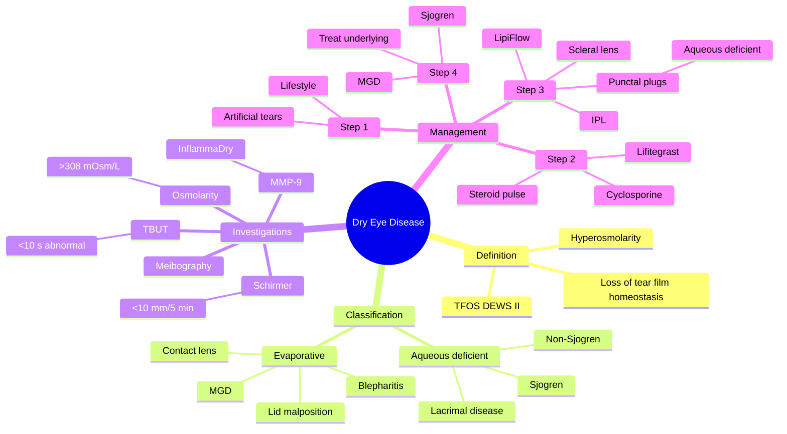

# Dry Eye Disease (Keratoconjunctivitis Sicca)

Related: [[Blepharitis]], [[Sjogren Syndrome]], [[Rheumatoid Arthritis (Ocular)]]

> [!tip] **FCPS/MRCP Priority: CRITICAL**
> Common cause of chronic red, gritty eyes. Differentiate aqueous-deficient (Sjogren) from evaporative (MGD). Master stepwise management.

---

## Learning Objectives
- [ ] Define dry eye disease using TFOS DEWS II criteria
- [ ] Classify DED into aqueous-deficient and evaporative subtypes
- [ ] Identify common risk factors and associations (Sjogren, MGD, drugs)
- [ ] Perform and interpret Schirmer test and TBUT
- [ ] Apply the stepwise management algorithm
- [ ] Recognise when to refer for systemic disease (Sjogren)

---

## 1. Definition (TFOS DEWS II)

- **Dry eye disease (DED):** Multifactorial disease of the ocular surface characterised by loss of tear film homeostasis, with ocular symptoms, in which tear film instability and hyperosmolarity, ocular surface inflammation and damage, and neurosensory abnormalities play etiological roles.

---

## 2. Classification

### Aqueous-deficient
- **Sjogren syndrome:** Primary or secondary (RA, SLE, systemic sclerosis)
- Non-Sjogren (age-related, lacrimal gland duct obstruction, post-radiation, congenital alacrima)

### Evaporative
- **Meibomian gland dysfunction (MGD)** — most common cause
- Blepharitis
- Lid malposition (ectropion, lagophthalmos)
- Contact lens wear
- Ocular surface disease (medication, allergy)

---

## 3. Risk Factors

- Female, post-menopausal
- Older age
- Autoimmune disease (Sjogren, RA, SLE, scleroderma)
- Medications: antihistamines, antidepressants, diuretics, beta-blockers, isotretinoin, OCP
- Environmental: low humidity, wind, screens
- Contact lens wear
- Refractive surgery (LASIK-induced)
- Vitamin A deficiency

---

## 4. Clinical Features

- **Symptoms:** Grittiness, burning, foreign body sensation, dryness, photophobia, blurred vision (variable)
- Worse in evening, low humidity, prolonged screen use
- **Paradoxical lacrimation** (reflex tearing in response to irritation)
- **Signs:** Conjunctival hyperaemia, decreased tear meniscus, foamy tears (MGD), punctate epitheliopathy (fluorescein/lissamine staining), filaments (severe)

---

## 5. Investigations

| Test | What it measures | Normal |
|------|------------------|--------|
| **Schirmer I** | Total tear production (5 min, no anaesthetic) | >15 mm/5 min; <10 = dry eye; <5 = severe |
| **TBUT** | Tear film stability | >10 s; <10 = evaporative |
| **Staining** | Surface damage | Oxford / NEI grading |
| **Lissamine / Rose bengal** | Devitalised cells | Negative |
| **Tear osmolarity** | Hyperosmolarity | >308 mOsm/L diagnostic |
| **InflammaDry** | MMP-9 | Positive in inflammatory DED |
| **Meibography** | MGD structural | Loss of glands |

---

## 6. Management (Stepwise)

### Step 1: Lifestyle and Artificial Tears
- **Artificial tears** (preservative-free if used >4×/day) — carboxymethylcellulose, hyaluronic acid
- Warm compress, lid hygiene
- Environmental modification (humidifier, breaks from screens)
- Omega-3 supplementation

### Step 2: Anti-inflammatory
- **Topical cyclosporine A 0.05%** (Ikervis) — twice daily, long-term
- **Lifitegrast 5%** (Xiidra) — twice daily
- Topical corticosteroid (short course, taper) for acute flare
- **Tacrolimus 0.03%** (compounded, off-label) for refractory

### Step 3: Procedural
- **Punctal plugs** (collagen temporary, silicone permanent) — for aqueous-deficient
- **Intense pulsed light (IPL)** for MGD
- **LipiFlow** (thermal pulsation) for MGD
- **Scleral lenses** for severe ocular surface disease
- **Amniotic membrane** for severe
- **Tarsorrhaphy** (lateral, partial) in severe exposure
- **Salivary gland transplantation** (submandibular → subconjunctival)

### Step 4: Treat Underlying
- **Sjogren:** rheumatology referral, hydroxychloroquine, biologics
- **MGD:** doxycycline, IPL/LipiFlow
- **Medication review:** stop culprit drugs if possible

---

## 7. FCPS/MRCP High-Yield Summary

| Topic | Key Points |
|-------|------------|
| Aqueous-deficient | ↓ tear production (Schirmer ↓) |
| Evaporative | MGD, normal production but rapid evaporation (TBUT ↓) |
| Schirmer | <10 mm/5 min = dry eye |
| TBUT | <10 s = abnormal |
| Treatment | Artificial tears → cyclosporine/lifitegrast → plugs |
| Sjogren | Anti-Ro (SSA), Anti-La (SSB); systemic disease |
| Punctal plugs | For aqueous-deficient, NOT evaporative |

---

## 8. Viva Questions

1. **Q:** Differentiate aqueous-deficient from evaporative dry eye.
   **A:** Aqueous-deficient = ↓ tear production (Schirmer low). Evaporative = tear production normal but evaporates fast (TBUT low, MGD).

2. **Q:** What is Sjogren syndrome?
   **A:** Autoimmune exocrinopathy: dry eyes + dry mouth. Primary (isolated) or secondary (with RA, SLE, scleroderma). Anti-Ro, anti-La antibodies.

3. **Q:** When are punctal plugs indicated?
   **A:** Aqueous-deficient DED (not evaporative). Block tear drainage to retain tears.

---

## 9. Common Confusions / Exam Traps

| Confusion | Clarification |
|-----------|---------------|
| "Punctal plugs help all dry eye" | Plugs are for aqueous-deficient DED only — in evaporative DED they worsen ocular surface inflammation |
| "Schirmer and TBUT measure the same thing" | Schirmer = tear production; TBUT = tear film stability (evaporative) |
| "Sjogren = dry eyes only" | Sjogren is a systemic autoimmune exocrinopathy — also causes dry mouth, parotid swelling, arthritis, lymphoma risk |
| "Cyclosporine drops are steroid-sparing" | Yes — topical CsA is a T-cell immunomodulator, used for chronic anti-inflammatory control |
| "DED patients don't tear" | Paradoxical reflex tearing is common in response to surface irritation |
| "All dry eye needs systemic workup" | Only refractory, severe, bilateral, with dry mouth, parotid swelling or autoimmune features |
| "Low Schirmer = Sjogren" | Low Schirmer is dry eye; Sjogren is one cause — confirm with anti-Ro/La and lip biopsy |

---

## 10. Mnemonics

1. **"Aqueous = Add (produce less); Evaporative = Escape (evaporate fast)"** — Schirmer ↓ vs TBUT ↓.
2. **"STING" for Sjogren antibodies** — **S**jogren = **S**SA (anti-Ro) and **S**SB (anti-La); plus **T**ear, salivar**I**-gland, parotid e**N**largement, **G**land biopsy focus score.
3. **"Dry eye DREAD"** — **D**efinition (TFOS DEWS II), **R**isk (postmenopausal, screens, drugs), **E**vaporative > aqueous overall, **A**rtificial tears first, **D**on't plug in MGD.
4. **"Plug, don't pour"** — for aqueous-deficient DED, retain tears with punctal plugs.

---

## 11. Mind Map

---

## 12. One-Page Revision Card

| **Topic** | **Dry Eye Disease (Keratoconjunctivitis Sicca)** |
|-----------|---------------------------------------------------|
| **Definition** | Loss of tear film homeostasis with symptoms and ocular surface damage |
| **Subtypes** | Aqueous-deficient (Sjogren) vs Evaporative (MGD) |
| **Key test — production** | Schirmer I (<10 mm/5 min) |
| **Key test — stability** | TBUT (<10 s abnormal) |
| **Tear osmolarity** | >308 mOsm/L supports diagnosis |
| **Most common cause overall** | Evaporative (MGD) |
| **First-line treatment** | Preservative-free artificial tears |
| **Anti-inflammatory step** | Topical cyclosporine / lifitegrast |
| **Punctal plugs** | Aqueous-deficient only |
| **Sjogren antibodies** | Anti-Ro (SSA), anti-La (SSB) |
| **Viva pearl** | Don't plug evaporative DED — it worsens it |

---

## 13. Spaced Repetition Trackers

### 24-Hour Recall Prompts
- [ ] Define dry eye disease (TFOS DEWS II)
- [ ] List the two main subtypes and key differences
- [ ] State Schirmer and TBUT cut-offs for diagnosis
- [ ] Identify first-line and second-line therapy
- [ ] Explain why punctal plugs are not used in evaporative DED

### Revision Schedule
- [ ] **Day 1** completed (creation + 24h recall)
- [ ] **Day 3** revision completed
- [ ] **Day 7** revision completed
- [ ] **Day 15** revision completed
- [ ] **Day 30** revision completed
- [ ] **Day 90** revision completed

---

## 14. Must Know / Should Know / Nice to Know

### Must Know (Core for passing)
- [x] TFOS DEWS II definition
- [x] Aqueous-deficient vs evaporative
- [x] Schirmer and TBUT cut-offs
- [x] Stepwise management
- [x] Sjogren antibodies (anti-Ro/La)

### Should Know (High probability)
- [x] MGD is the most common cause of evaporative DED
- [x] Punctal plugs for aqueous-deficient only
- [x] Topical cyclosporine / lifitegrast for chronic DED
- [x] Paradoxical reflex tearing
- [x] Risk factor drugs (antihistamines, antidepressants, OCP, isotretinoin)

### Nice to Know (Differentiator)
- [ ] Tear osmolarity and InflammaDry (MMP-9)
- [ ] IPL and LipiFlow for MGD
- [ ] Scleral lens and amniotic membrane for severe disease
- [ ] Salivary gland transplantation in end-stage

---

## 15. My Weak Points
- [ ] Add personal weak areas here

---

## 16. Self-Test Scorecard

| Section | Score /5 |
|---------|----------|
| Understanding: | /10 |
| Recall: | /10 |
| MCQ Performance: | /10 |
| SBA Performance: | /10 |
| Viva Confidence: | /10 |
| Total: | /50 |

> [!tip] **Interpretation:** <35 = weak topic, 35-44 = acceptable but insecure, 45+ = strong exam-ready topic.

---

## 17. Exam Answer Modes

### Long Answer Skeleton
1. Definition (TFOS DEWS II)
2. Classification — aqueous-deficient vs evaporative
3. Risk factors — age, female, drugs, autoimmune, environment
4. Clinical features — symptoms out of proportion to signs, paradoxical tearing
5. Investigations — Schirmer (<10 mm/5 min), TBUT (<10 s), osmolarity, MMP-9
6. Stepwise management:
   - Step 1: artificial tears, lid hygiene, environmental
   - Step 2: cyclosporine / lifitegrast / short steroid
   - Step 3: plugs (aqueous-deficient), IPL/LipiFlow (evaporative), scleral lens
   - Step 4: treat underlying (Sjogren, MGD, drugs)
7. Sjogren syndrome — anti-Ro/La, systemic features, lip biopsy

### Short Note Skeleton
- Define dry eye (TFOS DEWS II)
- Differentiate aqueous-deficient vs evaporative
- Schirmer and TBUT interpretation
- First-line therapy

### Viva One-Liners
- **Q:** Define dry eye disease? → **A:** Multifactorial loss of tear film homeostasis with symptoms and ocular surface damage (TFOS DEWS II).
- **Q:** Aqueous-deficient vs evaporative? → **A:** Aqueous = ↓ production (Schirmer ↓). Evaporative = normal production, fast evaporation (TBUT ↓, MGD).
- **Q:** When are punctal plugs indicated? → **A:** Aqueous-deficient DED only — not evaporative.
- **Q:** Sjogren syndrome? → **A:** Autoimmune exocrinopathy with dry eyes, dry mouth; anti-Ro/SSA, anti-La/SSB.
- **Q:** Most common cause of evaporative DED? → **A:** Meibomian gland dysfunction (MGD).

### Ward-Case Discussion Points
- History: grittiness, burning, time of day (worse evening), screen use, drugs
- Examination: tear meniscus, lid margins, meibomian gland expression, TBUT, fluorescein
- Investigations: Schirmer, TBUT, osmolarity if available
- Initial management: preservative-free tears, lid hygiene, humidifier
- Identify red flags for systemic disease (sicca symptoms, parotid swelling, joint pain)
- Step up therapy appropriately; refer rheumatology if Sjogren suspected

### Last-Night-Before-Exam Sheet
- **Top 3 facts:** TFOS DEWS II definition, Schirmer <10 mm/5 min = DED, punctal plugs only for aqueous-deficient
- **1 mnemonic:** "Aqueous = Add (less); Evaporative = Escape (fast)"
- **Must-know:** Sjogren = anti-Ro (SSA), anti-La (SSB)

---

## Summary
Dry eye disease is multifactorial, classified as aqueous-deficient or evaporative. Symptoms are out of proportion to signs. Schirmer and TBUT are key investigations. Stepwise management: artificial tears → anti-inflammatory (cyclosporine/lifitegrast) → punctal plugs. Treat underlying cause (MGD, Sjogren).

---

## MCQs (10)

1. **Question:** The most common cause of evaporative dry eye is:
   **Options:** A. Sjogren syndrome B. Meibomian gland dysfunction C. Punctal stenosis D. Conjunctivitis E. Allergy
   **Answer:** B
   **Explanation:** MGD is the leading cause of evaporative DED.

2. **Question:** A Schirmer I test result of <10 mm/5 min suggests:
   **Options:** A. Glaucoma B. Dry eye C. Uveitis D. Cataract E. Keratitis
   **Answer:** B
   **Explanation:** Reduced tear production; <5 mm/5 min = severe.

3. **Question:** Punctal plugs are most appropriately used in:
   **Options:** A. Evaporative DED B. Aqueous-deficient DED C. Acute conjunctivitis D. Glaucoma E. Uveitis
   **Answer:** B
   **Explanation:** Block drainage in aqueous-deficient DED to retain tears; avoided in evaporative.

4. **Question:** The most common autoantibody in primary Sjogren syndrome is:
   **Options:** A. ANA B. Anti-dsDNA C. Anti-Ro (SSA) D. Anti-Smith E. Anti-CCP
   **Answer:** C
   **Explanation:** Anti-Ro (SSA) is the most common antibody in primary Sjogren.

5. **Question:** A tear break-up time (TBUT) of <10 seconds is diagnostic of:
   **Options:** A. Glaucoma B. Tear film instability / evaporative DED C. Uveitis D. Cataract E. Retinal detachment
   **Answer:** B
   **Explanation:** TBUT <10 s = tear film instability (evaporative DED).

6. **Question:** First-line treatment of mild-to-moderate dry eye disease is:
   **Options:** A. Topical steroid B. Topical cyclosporine C. Artificial tears (preservative-free if frequent) D. Punctal plugs E. Tarsorrhaphy
   **Answer:** C
   **Explanation:** Artificial tears (preservative-free if >4×/day) are first-line.

7. **Question:** Which drug class is most likely to worsen dry eye?
   **Options:** A. Beta-blockers B. Antihistamines C. ACE inhibitors D. Macrolides E. Calcium channel blockers
   **Answer:** B
   **Explanation:** Antihistamines have anticholinergic effects reducing tear production.

8. **Question:** A patient with dry eye and dry mouth is suspected of having Sjogren syndrome. The most appropriate next serological test is:
   **Options:** A. ANCA B. Anti-CCP C. Anti-Ro (SSA) and anti-La (SSB) D. Anti-HBc E. Anti-centromere
   **Answer:** C
   **Explanation:** Anti-Ro/SSA and anti-La/SSB are the serological hallmarks of primary Sjogren.

9. **Question:** Paradoxical reflex tearing in a patient with dry eye is best explained by:
   **Options:** A. Lacrimal gland hypersecretion B. Ocular surface irritation triggering reflex lacrimation C. Lacrimal duct obstruction D. Allergic conjunctivitis E. Blepharitis
   **Answer:** B
   **Explanation:** Surface irritation triggers reflex tearing via the trigeminal-lacrimal reflex.

10. **Question:** A patient with dry eye is started on punctal plugs but has severe blepharitis and meibomian gland dysfunction. What is the most likely outcome?
    **Options:** A. Improvement in symptoms B. Worsening of ocular surface inflammation C. Permanent cure D. Resolution of MGD E. Decreased tear production
    **Answer:** B
    **Explanation:** Plugs in evaporative DED retain inflamed tears, worsening surface inflammation.

## SBA Questions (10)

1. **Scenario:** A 60-year-old woman has dry eyes, dry mouth, parotid enlargement, positive Schirmer, positive anti-Ro.
   **Question:** Diagnosis?
   **Options:** A. SLE B. RA C. Primary Sjogren syndrome D. Sarcoidosis E. IgG4 disease
   **Answer:** C
   **Explanation:** Sicca + parotid + anti-Ro = primary Sjogren.

2. **Scenario:** A 55-year-old post-menopausal woman has bilateral gritty, burning eyes worse in the evenings. Schirmer I is 6 mm/5 min, TBUT 12 s.
   **Question:** Most likely subtype of DED?
   **Options:** A. Evaporative B. Aqueous-deficient C. Mixed but predominantly aqueous-deficient D. Allergic E. Mucin-deficient
   **Answer:** C
   **Explanation:** Low Schirmer with normal TBUT = predominantly aqueous-deficient.

3. **Scenario:** A 45-year-old man on screen-based work has chronic red eyes with foamy tear film and blocked meibomian gland orifices. Schirmer 18 mm/5 min, TBUT 5 s.
   **Question:** Best next step in management?
   **Options:** A. Punctal plugs B. Topical cyclosporine C. Warm compress and lid hygiene D. Oral steroids E. Topical antibiotic
   **Answer:** C
   **Explanation:** MGD/evaporative DED — manage with warm compress and lid hygiene first.

4. **Scenario:** A 65-year-old woman with severe aqueous-deficient DED remains symptomatic on preservative-free tears, cyclosporine, and short steroid courses.
   **Question:** Most appropriate procedural intervention?
   **Options:** A. Topical NSAID B. Punctal plugs C. Enucleation D. Laser photocoagulation E. Topical anaesthetic
   **Answer:** B
   **Explanation:** Punctal plugs retain tears in aqueous-deficient DED when medical therapy fails.

5. **Scenario:** A patient with rheumatoid arthritis complains of dry eyes and dry mouth. Schirmer 4 mm/5 min.
   **Question:** Most likely diagnosis?
   **Options:** A. Primary Sjogren B. Secondary Sjogren syndrome C. Sarcoidosis D. SLE E. Age-related DED
   **Answer:** B
   **Explanation:** RA + sicca = secondary Sjogren syndrome.

6. **Scenario:** A 50-year-old contact lens wearer has persistent dry eye despite lubricants; meibography shows 60% gland dropout.
   **Question:** Best procedural therapy?
   **Options:** A. Punctal plugs B. LipiFlow thermal pulsation C. Enucleation D. Topical anaesthetic E. Radial keratotomy
   **Answer:** B
   **Explanation:** LipiFlow is a thermal pulsation device that treats MGD by clearing meibomian glands.

7. **Scenario:** A 70-year-old with severe aqueous-deficient DED has persistent corneal filaments and epitheliopathy despite maximal medical therapy.
   **Question:** Most appropriate next step?
   **Options:** A. Topical NSAID B. Scleral contact lens / amniotic membrane C. Enucleation D. Topical anaesthetic E. Cyclodiode laser
   **Answer:** B
   **Explanation:** Scleral lens or amniotic membrane protects the ocular surface in severe DED.

8. **Scenario:** A patient with chronic dry eye is found to have a tear osmolarity of 320 mOsm/L.
   **Question:** Interpretation?
   **Options:** A. Normal B. Consistent with hyperosmolar DED C. Suggests allergic disease D. Suggests infection E. Suggests glaucoma
   **Answer:** B
   **Explanation:** Tear osmolarity >308 mOsm/L supports a diagnosis of DED (TFOS DEWS II).

9. **Scenario:** A 60-year-old woman on long-term antihistamines and amitriptyline presents with new dry eye symptoms.
   **Question:** Best initial step?
   **Options:** A. Lifitegrast B. Punctal plugs C. Medication review and lubricants D. Topical steroid E. LipiFlow
   **Answer:** C
   **Explanation:** Identify and stop culprit anticholinergic drugs; use lubricants.

10. **Scenario:** A patient with severe evaporative DED from MGD is being considered for punctal plugs.
    **Question:** What is the most appropriate advice?
    **Options:** A. Plugs are first-line B. Plugs may worsen the surface inflammation and are contraindicated C. Plugs cure MGD D. Plugs should be combined with topical anaesthetic E. Plugs reduce meibomian gland function
    **Answer:** B
    **Explanation:** Plugs in evaporative DED retain inflammatory tears and worsen surface disease.

## Flashcards

- **Q:** What is the TFOS DEWS II definition of dry eye?
  **A:** A multifactorial disease of the ocular surface with loss of tear film homeostasis, tear hyperosmolarity, inflammation and neurosensory abnormalities.
- **Q:** Schirmer I cut-off for dry eye?
  **A:** <10 mm/5 min (severe <5 mm/5 min).
- **Q:** TBUT cut-off for tear film instability?
  **A:** <10 seconds.
- **Q:** Most common cause of evaporative DED?
  **A:** Meibomian gland dysfunction (MGD).
- **Q:** Antibodies in primary Sjogren syndrome?
  **A:** Anti-Ro (SSA) and anti-La (SSB).

## Answer Key with Explanations

### MCQs
1. B — MGD is the leading cause of evaporative DED
2. B — Schirmer <10 mm/5 min = dry eye
3. B — Punctal plugs are for aqueous-deficient DED
4. C — Anti-Ro (SSA) is the most common antibody in primary Sjogren
5. B — TBUT <10 s = tear film instability
6. C — Artificial tears are first-line therapy
7. B — Antihistamines have anticholinergic effects
8. C — Anti-Ro/La are diagnostic of Sjogren
9. B — Reflex tearing in response to surface irritation
10. B — Plugs in evaporative DED worsen inflammation

### SBAs
1. C — Sicca + parotid + anti-Ro = primary Sjogren
2. C — Low Schirmer with normal TBUT = aqueous-deficient
3. C — Warm compress and lid hygiene for MGD
4. B — Punctal plugs for refractory aqueous-deficient DED
5. B — RA + sicca = secondary Sjogren
6. B — LipiFlow for MGD
7. B — Scleral lens / amniotic membrane for severe DED
8. B — Tear osmolarity >308 mOsm/L supports DED
9. C — Medication review and lubricants for drug-induced DED
10. B — Plugs contraindicated in evaporative DED

## Tags
#medicine #davidson #ophthalmology #dry-eye #Sjogren #fcps #mrcp

## PasTest Scenario SBAs (Clinical Vignettes)

> **Auto-generated PasTest/Mediscope-style scenario SBAs** grounded in the authored source. Each scenario tests a real clinical fact (triad, specific sign, contraindication, trial, first-line Rx) extracted from the topic. *Source: Ch 28: Medical Ophthalmology — Dry Eye Disease*

**Q1.** Which of the following features is most specific or characteristic of Dry Eye Disease?

  - **A.** Tear osmolarity
  - **B.** A feature common to many acute inflammatory conditions
  - **C.** A non-specific sign that does not localise the diagnosis
  - **D.** An investigation finding rather than a clinical feature

  > **Answer: A** — Tear osmolarity
  >
  > *Source:* ce damage | Oxford / NEI grading |
| **Lissamine / Rose bengal** | Devitalised cells | Negative |
| **Tear osmolarity** | Hyperosmolarity | >308 mOsm/L diagnostic |
| **InflammaDry** | MMP-9 | Positiv

