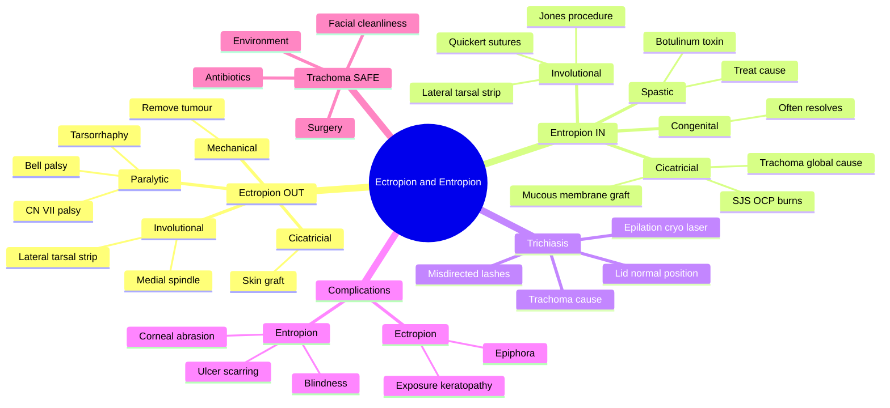

# Ectropion and Entropion

Related: [[Lids and Lacrimal Hub]], [[Trichiasis]], [[Bell Palsy (CN VII)]], [[Blepharitis]]

> [!tip] **FCPS/MRCP Priority: MEDIUM**
> Ectropion = lid turns OUT → exposure, epiphora. Entropion = lid turns IN → lashes abrade cornea. Causes differ by age and mechanism.

---

## Learning Objectives
- [ ] Define ectropion and entropion and distinguish them clinically
- [ ] List the aetiological types (involutional, cicatricial, paralytic, mechanical, spastic, congenital)
- [ ] Identify clinical features and complications of each
- [ ] Describe the surgical and medical management options
- [ ] Recognise trachoma as a leading global cause of cicatricial entropion
- [ ] Differentiate true entropion from trichiasis

---

## 1. Ectropion

### Definition
- Lid margin (usually lower) turns outward, away from globe

### Types
- **Involutional (senile):** Most common, due to lid laxity
- **Cicatricial:** Scarring of skin (burns, trauma, dermatitis)
- **Paralytic:** CN VII palsy (orbicularis weakness)
- **Mechanical:** Tumour, lid mass pulling lid down

### Clinical Features
- Eye irritation, redness
- **Epiphora** (tears can't drain)
- Exposure keratopathy
- Conjunctival hyperaemia, drying

### Management
- **Involutional:** Lateral tarsal strip (shorten lid), medial spindle, Quickert sutures
- **Cicatricial:** Treat underlying scarring, lid reconstruction, skin graft
- **Paralytic:** Lubrication, taping at night, lateral tarsorrhaphy, consider CN VII surgery
- **Mechanical:** Remove cause

---

## 2. Entropion

### Definition
- Lid margin turns inward, lashes rub against cornea/conjunctiva

### Types
- **Involutional (senile):** Most common in elderly, due to lid laxity + overriding orbicularis
- **Cicatricial:** Trachoma, Stevens-Johnson, OCP, chemical injury
- **Acute spastic:** Sustained squeezing (post-op, ocular irritation)
- **Congenital:** Rare, can be associated with epiblepharon

### Clinical Features
- Foreign body sensation, pain, redness
- Photophobia, lacrimation
- **Corneal abrasion, ulceration, scarring, neovascularisation**
- Lashes directed toward globe (trichiasis)

### Management
- **Involutional:** Quickert sutures (everting sutures), lateral tarsal strip, Jones procedure
- **Cicatricial:** Treat scarring, mucous membrane graft, lid surgery
- **Acute spastic:** Treat cause (irritation), botulinum toxin, taping
- **Congenital:** Reassure (often resolves); surgery if persistent

---

## 3. Trichiasis

- Misdirected lashes (lid in normal position)
- Causes: trachoma, chronic blepharitis, cicatricial
- Treatment: Epilation, electrolysis, cryotherapy, laser ablation

---

## 4. Aetiology and Pathophysiology — Extended

### Why Involutional Ectropion Develops
- Age-related horizontal lid laxity (medial and lateral canthal tendons stretch)
- Disinsertion of lower lid retractors (capsulopalpebral fascia)
- Gravity and chronic orbicularis weakness
- Often bilateral and slowly progressive

### Why Involutional Entropion Develops
- Horizontal lid laxity + overriding preseptal orbicularis (rolls over the lid margin on lid closure)
- Disinsertion/weakness of lower lid retractors
- Age-related enophthalmos (loss of orbital fat)
- Tight lower lid retractors force the margin inward

### Cicatricial Entropion
- Posterior lamellar scarring shortens the tarsal conjunctiva, rotating the margin inward
- Trachoma is the leading infectious cause worldwide
- Stevens-Johnson syndrome, ocular cicatricial pemphigoid, chemical burns, post-surgical scarring

### Paralytic Ectropion
- Facial nerve (CN VII) palsy → orbicularis oculi paralysis → atonic lower lid
- Lower lid sags outward, punctum everts (epiphora), exposure keratopathy
- Bell palsy, Ramsay Hunt, parotid tumour, skull base lesion

### Acute Spastic Entropion
- Sustained orbicularis spasm (post-op, inflamed eye, tight patching)
- Lid clamps shut, preseptal orbicularis overrides the margin
- Treats the underlying cause ± botulinum toxin injection

---

## 5. Clinical Features — Extended

### Ectropion Signs (graded)
- Punctal eversion → epiphora is the early and dominant symptom
- Exposure of bulbar conjunctiva → hyperaemia, hypertrophy, keratinisation
- Exposure keratopathy (inferior cornea): punctate epitheliopathy → ulcer
- Symptoms worse in wind/cold/air-conditioning

### Entropion Signs
- In-turned lid margin with posteriorly directed lashes
- **Cornea first to be touched** (Riolan muscle, marginal and meibomian orifices abrade)
- Chronic irritation → punctate epitheliopathy → corneal ulcer → scarring → pannus
- Often worst in downgaze (patient looks down, lid flicks inward)

### Examination Pearls
- Snap-back test (lid laxity): pull lower lid down, count seconds to return (>2 s = lax)
- Distraction test: pull lid away from globe (>6 mm = lax)
- Medial canthal tendon laxity: pull punctum laterally (≥2 mm = lax)
- Fluorescein staining to assess corneal damage

---

## 6. Investigations

- Clinical diagnosis (slit-lamp examination is usually sufficient)
- Visual acuity
- Fluorescein staining (corneal damage)
- Schirmer test if dry-eye component
- Facial nerve examination in suspected paralytic ectropion
- Imaging (CT/MRI) only if tumour or sinus disease suspected

---

## 7. Differential Diagnosis

| Condition | Distinguishing feature |
|-----------|------------------------|
| Trichiasis | Misdirected lashes but normal lid position |
| Ectropion | Lid turned OUT |
| Entropion | Lid turned IN |
| Epiblepharon | Congenital, horizontal skin fold pushes lashes up; lid position normal |
| Distichiasis | Extra row of lashes at meibomian orifices |
| Floppy eyelid syndrome | Easily everted upper lid, obese patients |
| Lid tumour | Mass effect, mechanical ectropion/entropion |
| Facial nerve palsy | Other CN VII signs: brow, mouth, Bell phenomenon |

---

## 8. Management — Extended

### Medical (Temporary or Definitive Conservative)
- **Lubricants:** Artificial tears, ointments at night
- **Taping at night:** Pulls lower lid into position, protects cornea
- **Botulinum toxin** to orbicularis (temporary measure, spastic entropion)
- Treat underlying blepharitis, dry eye, inflammation

### Surgical — Ectropion
- **Medial spindle procedure:** For punctal ectropion (tarsoconjunctival diamond excision + everting sutures)
- **Lateral tarsal strip:** Shortens the lid horizontally, anchors to periosteum
- **Bick procedure:** Shortening of the lower lid at the lateral canthus
- **Skin graft / Z-plasty:** For cicatricial cases
- **Lateral tarsorrhaphy:** Paralytic ectropion — sutures lateral lids together
- **Medial canthoplasty:** Re-attaches medial canthal tendon
- **CN VII reanimation:** Nerve graft, masseter/facial transfer for chronic facial palsy

### Surgical — Entropion
- **Quickert everting sutures:** 3 everting sutures; temporary, can be definitive
- **Jones procedure:** Reattaching lower lid retractors
- **Wheeler procedure / Bick:** Lid splitting, rotation of marginal strip
- **Lateral tarsal strip + retractor reinsertion:** For involutional entropion with horizontal laxity
- **Mucous membrane graft:** Cicatricial — replaces scarred tarsoconjunctiva
- **Botulinum toxin:** Spastic or temporary

### Surgical — Trichiasis
- Epilation (temporary)
- Electrolysis, cryotherapy, argon laser ablation (permanent)

---

## 9. Complications

- **Ectropion:** Exposure keratopathy, corneal ulcer, conjunctival keratinisation, permanent epiphora
- **Entropion:** Corneal abrasion, ulcer, scarring, microbial keratitis, blindness
- Surgical: recurrence, over/under-correction, lid notch, haematoma, infection

---

## 10. Red Flags / Emergencies

- Acute CN VII palsy with complete eye closure failure → urgent lubrication, tarsorrhaphy to prevent corneal perforation
- Corneal ulcer in entropion → urgent ophthalmology referral
- Suspected tumour causing mechanical ectropion/entropion → biopsy
- Suspected trachoma in endemic exposure → public health notification, SAFE strategy

---

## 11. FCPS/MRCP High-Yield Summary

| Condition | Ectropion | Entropion |
|-----------|-----------|-----------|
| Definition | Lid turns OUT | Lid turns IN |
| Common type | Involutional | Involutional |
| Symptom | Epiphora, exposure | Pain, corneal abrasion |
| Cause (cicatricial) | Burns, scarring | Trachoma, SJS |
| Cause (paralytic) | CN VII palsy | — |
| Treatment | Lateral tarsal strip | Quickert sutures, tarsal strip |

### Key One-Liners
- "Ectropion = OUT → tears OUT (epiphora); Entropion = IN → IN to cornea"
- "Trachoma is the global #1 cause of entropion"
- "Bell palsy = classic cause of paralytic ectropion"
- "Quickert sutures = first-line involutional entropion fix"

---

## 12. Viva Questions

1. **Q:** Differentiate ectropion from entropion.
   **A:** Ectropion = lid out, exposure, epiphora. Entropion = lid in, lashes scratch cornea, pain, abrasion.

2. **Q:** Most common cause of entropion worldwide?
   **A:** Trachoma (cicatricial). In developed countries, involutional (senile) is most common.

3. **Q:** Differentiate entropion from trichiasis.
   **A:** Entropion = lid margin in-turned; trichiasis = lid normal position but lashes misdirected.

4. **Q:** What surgical procedure for involutional ectropion?
   **A:** Lateral tarsal strip ± medial spindle (for punctal ectropion).

5. **Q:** What is the SAFE strategy for trachoma?
   **A:** Surgery (for trichiasis), Antibiotics (azithromycin), Facial cleanliness, Environmental improvement.

---

## 13. Common Confusions / Exam Traps

| Confusion | Clarification |
|-----------|---------------|
| "Ectropion and entropion are the same" | Opposite: Ectropion = lid OUT, Entropion = lid IN |
| "Entropion vs trichiasis" | Entropion = lid malposition; trichiasis = lash malposition (lid normal) |
| "Trachoma is rare" | Leading infectious cause of blindness worldwide; endemic in Africa, Asia, Australia |
| "Bell palsy causes entropion" | Bell palsy causes paralytic ECTROPION (orbicularis weakness) |
| "Quickert sutures are definitive for entropion" | Often a temporary/initial measure; high recurrence; definitive surgery may follow |
| "Probing/syringing is part of management" | Not in entropion/ectropion; these are lid malpositions |

---

## 14. Mnemonics

1. **"Ectropion = Eyes Cry OUT"** — tears spill out (epiphora) because lid is OUT
2. **"Entropion = Eye IN-truding lashes"** — lid IN, lashes abrade the IN-side
3. **"ENT-ropion: ENT = Eye N-ner Turns"** — inward turning lid
4. **"TRICHIASIS"** = TRaCHoma is the leading global Infectious cause
5. **"PFL: Paralysis, Fat, Loose tendons"** — three mechanisms of involutional ectropion

---

## Mind Map

---

## One-Page Revision Card

| **Topic** | **Ectropion** | **Entropion** |
|-----------|----------------|----------------|
| **Definition** | Lid turns OUT | Lid turns IN |
| **Most common type** | Involutional (senile) | Involutional (senile) |
| **Classic symptom** | Epiphora (tears spill) | Pain, foreign body, photophobia |
| **Corneal risk** | Exposure keratopathy | Abrasion, ulcer, scarring |
| **Global #1 cause** | — | Trachoma (cicatricial) |
| **Paralytic cause** | CN VII palsy (Bell palsy) | — |
| **First-line surgery** | Lateral tarsal strip | Quickert sutures |
| **Differential** | Trichiasis (lid normal) | Trichiasis (lid normal) |
| **Viva pearl** | "Ectropion = Eyes Cry OUT" | "Entropion = Eye IN" |

---

## Spaced Repetition Trackers

### 24-Hour Recall Prompts
- [ ] Define ectropion and entropion
- [ ] State the most common aetiology of each
- [ ] List the corneal complications of entropion
- [ ] Name the surgical options for involutional ectropion
- [ ] Why is trachoma a leading cause of entropion?
- [ ] Differentiate entropion from trichiasis

### Revision Schedule
- [ ] **Day 1** completed (creation + 24h recall)
- [ ] **Day 3** revision completed
- [ ] **Day 7** revision completed
- [ ] **Day 15** revision completed
- [ ] **Day 30** revision completed
- [ ] **Day 90** revision completed

---

## Must Know / Should Know / Nice to Know

### Must Know (Core for passing)
- [x] Definition of ectropion (OUT) and entropion (IN)
- [x] Most common type = involutional
- [x] Trachoma = global leading cause of entropion
- [x] CN VII palsy = paralytic ectropion
- [x] Quickert sutures for involutional entropion
- [x] Lateral tarsal strip for involutional ectropion

### Should Know (High probability)
- [x] Differences between ectropion and entropion
- [x] Distinguish entropion from trichiasis
- [x] Corneal complications of entropion (abrasion, ulcer, scarring)
- [x] Trachoma SAFE strategy
- [x] Bell palsy and eye care (lubrication, taping, tarsorrhaphy)

### Nice to Know (Differentiator)
- [ ] Histology of trachomatous scarring
- [ ] Specific surgical techniques (Wheeler, Bick, Jones, medial spindle)
- [ ] Botulinum toxin use in spastic entropion
- [ ] WHO 2020 trachoma elimination targets

---

## My Weak Points
- [ ] Add personal weak areas here

---

## Self-Test Scorecard

| Section | Score /10 |
|---------|-----------|
| Understanding: | /10 |
| Recall: | /10 |
| MCQ Performance: | /10 |
| SBA Performance: | /10 |
| Viva Confidence: | /10 |
| **Total:** | **/50** |

> [!tip] **Interpretation:** <35 = weak topic, 35-44 = acceptable but insecure, 45+ = strong exam-ready topic.

---

## Exam Answer Modes

### Long Answer Skeleton
1. **Definition** of ectropion and entropion (lid margin turned out / in)
2. **Aetiology** (involution, cicatricial, paralytic, spastic, mechanical, congenital)
3. **Pathogenesis** of involutional (laxity, retractor disinsertion, overriding orbicularis)
4. **Clinical features** (symptoms, signs, corneal complications)
5. **Differential** (trichiasis, lid tumour, facial palsy)
6. **Investigations** (clinical, fluorescein, lid laxity tests)
7. **Management** (medical: lubrication, taping; surgical: tarsal strip, Quickert sutures, grafts)
8. **Complications and prevention** (corneal ulcer, trachoma SAFE strategy)

### Short Note Skeleton
- Definition + key distinguishing feature (OUT vs IN)
- Common cause (involutional)
- Surgical treatment (lateral tarsal strip / Quickert sutures)
- Trachoma (global cause)

### Viva One-Liners
- **Q:** Ectropion vs entropion? → **A:** Ectropion = lid OUT (epiphora, exposure); Entropion = lid IN (corneal abrasion, pain)
- **Q:** Most common type? → **A:** Involutional (senile) in both
- **Q:** Global cause of entropion? → **A:** Trachoma (cicatricial)
- **Q:** Bell palsy cause? → **A:** Paralytic ECTROPION (CN VII)
- **Q:** Trichiasis vs entropion? → **A:** Trichiasis = lashes misdirected, lid normal position

### Ward-Case Discussion Points
- Examine the lid: out vs in, laxity, scarring, orbicularis function
- Examine the cornea: fluorescein staining, ulcer
- Test facial nerve function in paralytic ectropion
- Identify trachoma (Arlt's line, Herbert pits, pannus)
- Discuss surgical options and prognosis
- Counsel on UV / wind protection post-surgery

### Last-Night-Before-Exam Sheet
- **Top 5 facts:** Ectropion = OUT, Entropion = IN; Both most commonly involutional; Trachoma = global entropion; CN VII palsy = paralytic ectropion; Quickert sutures / tarsal strip
- **Mnemonics:** "Ectropion = Eyes Cry OUT"; "Entropion = Eye IN"; "TRICHIASIS" via trachoma
- **Must-know differential:** Trichiasis (lid position normal)
- **Viva buzz-phrase:** "SAFE strategy for trachoma"

---

## Summary

Ectropion (lid OUT) and entropion (lid IN) are lid malpositions. Involutional (age-related lid laxity and retractor disinsertion) is the most common type in both. Ectropion causes epiphora and exposure keratopathy; entropion causes corneal abrasion, ulcer, and scarring. Globally, trachoma is the leading infectious cause of cicatricial entropion (SAFE strategy). CN VII palsy causes paralytic ectropion. Initial management is lubrication and taping; definitive surgery is lateral tarsal strip (ectropion) or Quickert sutures (entropion). Always distinguish entropion from trichiasis (lid position normal).

---

## MCQs (10)

1. **Question:** A 70-year-old man complains of a constantly watering right eye. The lower lid is everted away from the globe and the punctum is visible. What is the diagnosis?
   **Options:** A. Entropion B. Ectropion C. Trichiasis D. Ptosis E. Blepharitis
   **Answer:** B
   **Explanation:** Lower lid turned out + epiphora = involutional ectropion with punctal eversion.

2. **Question:** Which is the most common type of ectropion?
   **Options:** A. Cicatricial B. Paralytic C. Involutional D. Mechanical E. Congenital
   **Answer:** C
   **Explanation:** Involutional (senile) is the most common, due to age-related lid laxity.

3. **Question:** A patient with Bell palsy has a red, watering eye and the lower lid sags. The cornea shows a small inferior epithelial defect. The most appropriate next step is:
   **Options:** A. Topical antibiotic only B. Oral steroids C. Intensive lubrication, taping at night, urgent ophthalmology review D. Wait for spontaneous recovery only E. Systemic antifungal
   **Answer:** C
   **Explanation:** Paralytic ectropion with exposure keratopathy — intensive lubrication, lid taping, consider tarsorrhaphy; treat Bell palsy cause.

4. **Question:** Entropion most commonly results in which corneal complication?
   **Options:** A. Exposure keratopathy B. Corneal abrasion/ulcer from in-turned lashes C. Band keratopathy D. Keratoconus E. Interstitial keratitis
   **Answer:** B
   **Explanation:** In-turned lid and lashes abrade the cornea → abrasion, ulcer, scarring, vascularisation.

5. **Question:** The global leading infectious cause of entropion is:
   **Options:** A. Staphylococcus aureus B. Chlamydia trachomatis (trachoma) C. Herpes simplex D. Adenovirus E. Pseudomonas
   **Answer:** B
   **Explanation:** Trachoma (Chlamydia trachomatis A–C) is the leading infectious cause of blindness via cicatricial entropion.

6. **Question:** Differentiating entropion from trichiasis: the key difference is:
   **Options:** A. Corneal involvement B. Pupil size C. Position of the lid margin D. Visual acuity E. Age of patient
   **Answer:** C
   **Explanation:** Entropion = lid margin IN-turned; trichiasis = lid margin in normal position but lashes misdirected.

7. **Question:** A 75-year-old has involutional entropion of the right lower lid with mild discomfort. The most appropriate first-line surgical procedure is:
   **Options:** A. Lateral tarsorrhaphy B. Quickert everting sutures C. Mucous membrane graft D. Frontalis sling E. Tarsorrhaphy
   **Answer:** B
   **Explanation:** Quickert everting sutures (3 mattress sutures from fornix to skin) is a quick, effective first-line procedure for involutional entropion.

8. **Question:** The most appropriate management of a lateral canthal ectropion with significant horizontal lid laxity in an elderly patient is:
   **Options:** A. Botulinum toxin B. Topical steroid C. Lateral tarsal strip procedure D. Punctoplasty E. Skin biopsy
   **Answer:** C
   **Explanation:** Lateral tarsal strip tightens the lid horizontally by anchoring it to the lateral orbital periosteum — addresses lid laxity directly.

9. **Question:** A child with Stevens-Johnson syndrome develops an in-turned lower lid with lashes touching the cornea. The most definitive surgical treatment is:
   **Options:** A. Quickert sutures B. Lateral tarsal strip C. Mucous membrane (oral mucosal) graft D. Botulinum toxin E. Taping
   **Answer:** C
   **Explanation:** Cicatricial entropion with posterior lamellar scarring requires a mucous membrane graft to replace the scarred tarsoconjunctiva.

10. **Question:** In the WHO SAFE strategy for trachoma, "A" stands for:
    **Options:** A. Antiseptics B. Antibiotics C. Antivirals D. Antifungals E. Anti-inflammatory
    **Answer:** B
    **Explanation:** SAFE = Surgery (for trichiasis), Antibiotics (azithromycin), Facial cleanliness, Environmental improvement.

---

## SBA Questions (10)

1. **Scenario:** A 72-year-old woman presents with constant tearing of the right eye. The lower lid is everted with the punctum visible and the inferior bulbar conjunctiva is red. Visual acuity is normal.
   **Question:** What is the most likely diagnosis?
   **Options:** A. Entropion B. Ectropion C. Trichiasis D. Preseptal cellulitis E. Nasolacrimal duct obstruction
   **Answer:** B
   **Explanation:** Everted lower lid with visible punctum = involutional ectropion; tears spill out (epiphora).

2. **Scenario:** A 78-year-old man has had a right Bell palsy for 2 weeks. The right eye is red, watering, and the lower lid sags away from the globe. Fluorescein staining shows a small inferior corneal epithelial defect.
   **Question:** The most appropriate management of the eye is:
   **Options:** A. Topical antibiotic only B. Oral steroids only C. Intensive lubrication, lid taping at night, ophthalmology referral D. Observe only E. Topical anaesthetic
   **Answer:** C
   **Explanation:** Paralytic ectropion + exposure keratopathy = aggressive lubrication, lid taping at night, possible tarsorrhaphy; treat underlying Bell palsy.

3. **Scenario:** A 60-year-old man presents with a painful red eye and a feeling of sand in the eye. The lower lid is in-turned and the lashes are touching the cornea. He has a history of trachoma in childhood.
   **Question:** What is the most likely diagnosis?
   **Options:** A. Ectropion B. Trichiasis C. Entropion (cicatricial) D. Blepharitis E. Pterygium
   **Answer:** C
   **Explanation:** Lid in-turned + lashes touching cornea in a trachoma-endemic patient = cicatricial entropion.

4. **Scenario:** A 75-year-old has involutional entropion of the right lower lid. The cornea is intact. The ophthalmologist offers an outpatient procedure with three everting mattress sutures.
   **Question:** What is the most likely procedure?
   **Options:** A. Lateral tarsal strip B. Quickert sutures C. Mucous membrane graft D. Frontalis sling E. Tarsorrhaphy
   **Answer:** B
   **Explanation:** Three everting mattress sutures = Quickert sutures — first-line outpatient procedure for involutional entropion.

5. **Scenario:** A 65-year-old with involutional ectropion has the punctum everted. He is to undergo surgery for horizontal lid laxity.
   **Question:** What is the most appropriate surgical procedure?
   **Options:** A. Quickert sutures B. Lateral tarsal strip C. Medial spindle only D. Mucous membrane graft E. Botulinum toxin
   **Answer:** B
   **Explanation:** Horizontal lid laxity in involutional ectropion is treated by lateral tarsal strip.

6. **Scenario:** A 35-year-old woman has had Stevens-Johnson syndrome with bilateral ocular involvement. She now has in-turned lower lids and lashes touching the cornea with corneal scarring.
   **Question:** What is the most appropriate surgical treatment?
   **Options:** A. Quickert sutures B. Lateral tarsal strip C. Mucous membrane graft D. Taping only E. Observation
   **Answer:** C
   **Explanation:** Cicatricial entropion (SJS) requires replacement of the scarred posterior lamella with a mucous membrane graft.

7. **Scenario:** A patient post-cataract surgery develops an in-turned lower lid and intense pain. The eye was patched tightly for 24 hours.
   **Question:** What is the most likely diagnosis?
   **Options:** A. Involutional entropion B. Cicatricial entropion C. Acute spastic entropion D. Paralytic ectropion E. Trichiasis
   **Answer:** C
   **Explanation:** Tight patching + orbicularis spasm = acute spastic entropion; treat by removing the patch and addressing the cause.

8. **Scenario:** A 70-year-old man with a long history of trachoma is screened in a trachoma-endemic region. He has a few misdirected lashes touching the globe but the lid margin is in normal position.
   **Question:** What is the most likely diagnosis?
   **Options:** A. Cicatricial entropion B. Trichiasis C. Ectropion D. Distichiasis E. Epiblepharon
   **Answer:** B
   **Explanation:** Misdirected lashes with the lid margin in normal position = trichiasis, not entropion.

9. **Scenario:** A 70-year-old woman with right Bell palsy has paralytic ectropion. Despite intensive lubrication and taping, she has recurrent corneal ulcers.
   **Question:** What is the most appropriate surgical option to protect the cornea?
   **Options:** A. Lateral tarsal strip B. Quickert sutures C. Lateral tarsorrhaphy D. Mucous membrane graft E. Frontalis sling
   **Answer:** C
   **Explanation:** Lateral tarsorrhaphy sutures the lateral lids together to narrow the palpebral aperture and protect the cornea.

10. **Scenario:** A 60-year-old has an in-turned right lower lid with no corneal abrasion. Conservative measures fail. The surgeon plans definitive surgery to reattach the lower lid retractors.
    **Question:** What is the name of this procedure?
    **Options:** A. Quickert sutures B. Jones procedure C. Wheeler procedure D. Lateral tarsal strip E. Tarsorrhaphy
    **Answer:** B
    **Explanation:** The Jones procedure reattaches the disinserted lower lid retractors to the inferior tarsal border.

---

## Flashcards

- **Q:** Ectropion vs Entropion — which way does the lid turn?
  **A:** Ectropion = lid turns OUT (away from globe); Entropion = lid turns IN (toward globe).
- **Q:** What is the most common type of ectropion/entropion?
  **A:** Involutional (senile) — age-related lid laxity and retractor disinsertion.
- **Q:** What is the global leading cause of entropion?
  **A:** Trachoma (Chlamydia trachomatis) — cicatricial entropion.
- **Q:** Differentiate entropion from trichiasis.
  **A:** Entropion = lid margin in-turned. Trichiasis = lid margin normal but lashes misdirected.
- **Q:** What surgical procedure is first-line for involutional entropion?
  **A:** Quickert everting sutures (3 mattress sutures from fornix to skin).
- **Q:** CN VII palsy causes which type of ectropion?
  **A:** Paralytic ectropion (orbicularis oculi weakness).

---

## Answer Key with Explanations

### MCQs
1. **B** — Lower lid everted + epiphora = involutional ectropion
2. **C** — Involutional is the most common type of ectropion
3. **C** — Paralytic ectropion needs aggressive lubrication, taping, tarsorrhaphy
4. **B** — In-turned lashes abrade the cornea → abrasion/ulcer
5. **B** — Trachoma (Chlamydia) is the global leading infectious cause
6. **C** — Lid position distinguishes entropion from trichiasis
7. **B** — Quickert everting sutures are first-line for involutional entropion
8. **C** — Lateral tarsal strip addresses horizontal lid laxity
9. **C** — Cicatricial entropion (SJS) needs mucous membrane graft
10. **B** — SAFE: Surgery, Antibiotics, Facial cleanliness, Environment

### SBAs
1. **B** — Everted lower lid with visible punctum = ectropion
2. **C** — Paralytic ectropion with exposure keratopathy → lubricants, taping, ophthalmology
3. **C** — Lid in-turned + lashes touching cornea + trachoma history = cicatricial entropion
4. **B** — Three everting mattress sutures = Quickert sutures
5. **B** — Horizontal lid laxity → lateral tarsal strip
6. **C** — Cicatricial entropion (SJS) needs mucous membrane graft
7. **C** — Tight patch + orbicularis spasm = spastic entropion
8. **B** — Misdirected lashes with normal lid position = trichiasis
9. **C** — Recurrent ulcers in paralytic ectropion → lateral tarsorrhaphy
10. **B** — Reattaching lower lid retractors = Jones procedure

---

## Tags
#medicine #davidson #ophthalmology #ectropion #entropion #fcps #mrcp
