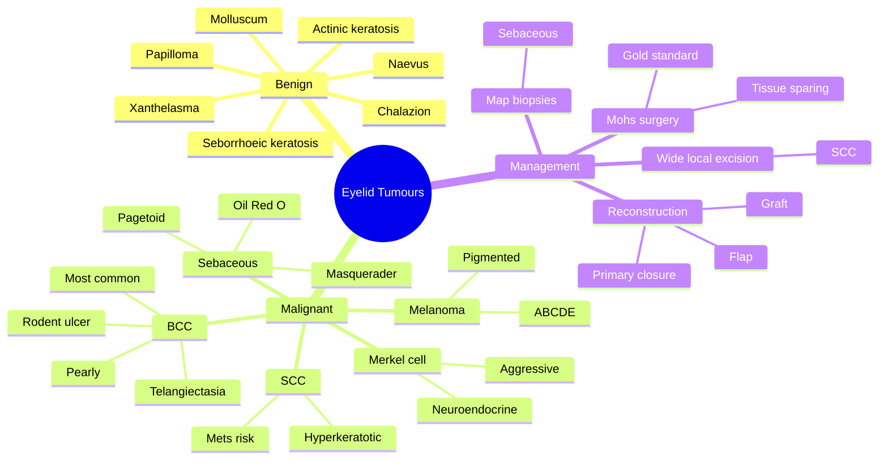

# Eyelid Tumours

Related: [[Lids and Lacrimal Hub]], [[Chalazion (Meibomian Cyst)]], [[Basal Cell Carcinoma]]

> [!tip] **FCPS/MRCP Priority: MEDIUM**
> Most common eyelid malignancy is BCC. Always consider sebaceous gland carcinoma in elderly with recurrent chalazion or pagetoid spread.

---

## Learning Objectives
- [ ] Classify common benign and malignant eyelid tumours
- [ ] Recognise the clinical features of basal cell, squamous cell, sebaceous gland carcinoma and melanoma
- [ ] Identify the "masquerade" presentation of sebaceous gland carcinoma
- [ ] Describe principles of Mohs micrographic surgery and lid reconstruction
- [ ] Apply correct management including excision margins and reconstruction

---

## 1. Benign Tumours

| Tumour | Features |
|--------|----------|
| **Papilloma** | Skin tag, pedunculated, common |
| **Seborrhoeic keratosis** | "Stuck-on" appearance, waxy |
| **Naevus** | Pigmented, may be junctional, compound, intradermal |
| **Xanthelasma** | Yellow plaques on medial canthus, may indicate hyperlipidaemia |
| **Chalazion** | Firm nodule, lipogranuloma (see Chalazion) |
| **Molluscum contagiosum** | Umbilicated, viral, can cause chronic follicular conjunctivitis |
| **Verruca vulgaris** | Common wart, HPV |
| **Actinic keratosis** | Pre-malignant, scaly, sun-damaged skin |
| **Keratoacanthoma** | Rapidly growing, dome-shaped, central keratin plug |

---

## 2. Malignant Tumours

### Basal Cell Carcinoma (BCC)
- **Most common** eyelid malignancy (>90%)
- Lower lid > upper lid > medial canthus
- **Nodular:** Pearly nodule, central ulceration, telangiectasia, "rodent ulcer"
- **Morpheaic/infiltrative:** Sclerotic, ill-defined, aggressive
- **Slow growth, locally invasive, rarely metastasises**
- Risk: sun exposure, fair skin, immunosuppression
- **Treatment:** Mohs micrographic surgery (gold standard for periocular), wide local excision with margin control, radiotherapy (selected)

### Squamous Cell Carcinoma (SCC)
- Less common than BCC but more aggressive
- Ulcerated, hyperkeratotic, may metastasise
- Risk: sun, actinic keratosis, xeroderma pigmentosum, immunosuppression
- Treatment: Excision with wide margins, possible SLN biopsy

### Sebaceous Gland Carcinoma
- **Masquerader** — may mimic chalazion
- Elderly, often upper lid, more common in women, Asians
- Pagetoid spread (multifocal, map biopsy positive)
- Loss of lashes, regional lymphadenopathy
- **High mortality** if missed
- **Biopsy with special stains** (Oil Red O on fresh tissue) for lipid
- Treatment: Wide excision, map biopsies, exenteration (advanced), SLN

### Malignant Melanoma
- Pigmented (or amelanotic) lesion, irregular
- ABCDE criteria
- Treatment: Wide excision, SLN biopsy, systemic staging

### Merkel Cell Carcinoma
- Rare, aggressive, neuroendocrine
- Elderly, sun-exposed
- Violet/nodular, rapidly growing

---

## 3. Key Examination Points

- Size, location, margin definition
- Ulceration, crusting
- Loss of lashes (madarosis)
- Lymphadenopathy
- Lid function (closure, position)
- Globe involvement
- Fundus if indicated (intraocular extension)

---

## 4. Management Principles

### Excision with Margin Control
- **Mohs micrographic surgery** — gold standard for periocular (preserves tissue, high cure)
- Standard excision with 4–5 mm margins for SCC
- Frozen section / paraffin control

### Reconstruction
- Primary closure (small defects)
- Flap (Tenzel, glabellar, Mustardé, Hughes, Cutler-Beard)
- Graft (skin, tarsoconjunctival, mucosa)
- Heals by secondary intention (medial canthus)

### Special
- **Sebaceous carcinoma:** Multidisciplinary, map biopsies
- **SCC/Melanoma:** SLN biopsy if high-risk
- **Metastatic workup** if indicated (SCC, melanoma, sebaceous)

---

## 5. FCPS/MRCP High-Yield Summary

| Tumour | Frequency | Key Clue |
|--------|-----------|----------|
| BCC | Most common | Pearly, telangiectasia, ulceration, slow |
| SCC | 2nd | Hyperkeratotic, ulcerated, faster, mets risk |
| Sebaceous | Elderly women | Masquerades as chalazion, pagetoid |
| Melanoma | Rare | Pigmented, irregular |
| Xanthelasma | Common | Yellow, medial canthus, hyperlipidaemia |

---

## 6. Viva Questions

1. **Q:** What is the most common eyelid malignancy?
   **A:** Basal cell carcinoma (90%). Most on lower lid.

2. **Q:** When do you suspect sebaceous gland carcinoma?
   **A:** Recurrent chalazion in elderly, lid thickening, pagetoid spread, lash loss, regional lymphadenopathy.

3. **Q:** What is the gold standard for periocular BCC excision?
   **A:** Mohs micrographic surgery — preserves healthy tissue, highest cure rate.

---

## 7. Common Confusions / Exam Traps

| Confusion | Clarification |
|-----------|---------------|
| "Sebaceous carcinoma = chalazion" | Recurrent chalazion in elderly with lash loss / pagetoid = sebaceous carcinoma until proven otherwise |
| "BCC rarely metastasises, so is benign" | BCC is malignant — locally invasive, can erode orbit, only metastasises very rarely |
| "SCC and BCC behave the same" | SCC is more aggressive, higher metastatic potential, needs wider margins and SLN staging |
| "Pigmented lesion = melanoma" | Seborrhoeic keratosis, naevus, pigmented BCC and amelanotic melanoma can mimic; biopsy if doubtful |
| "All eyelid lesions can be observed" | Any persistent / recurrent / ulcerated / pigmented lesion in an adult needs biopsy |
| "Mohs is for SCC only" | Mohs is gold standard for periocular BCC; SCC usually wide local excision |

---

## 8. Mnemonics

1. **"BCC — Be Cool & Cautious"** — slow, locally invasive, rarely metastasises, but still needs excision.
2. **"Sebaceous = Senior, Upper lid, Asian, Spread (pagetoid), Oil Red O stain"** — the great masquerader.
3. **"SCC Spreads and SCC Sends nodes"** — SCC metastasises to lymph nodes more than BCC.
4. **"BCC is to eyelid as SCC is to skin elsewhere"** — relative frequency reverses at the lid.

---

## 9. Mind Map

---

## 10. One-Page Revision Card

| **Topic** | **Eyelid Tumours** |
|-----------|---------------------|
| **Most common malignancy** | Basal cell carcinoma (>90%) |
| **Most common site** | Lower lid > upper lid > medial canthus |
| **Classic BCC features** | Pearly nodule, central ulceration, telangiectasia |
| **Masquerader** | Sebaceous gland carcinoma (recurrent chalazion in elderly) |
| **Gold standard excision** | Mohs micrographic surgery (periocular) |
| **Sebaceous — key stain** | Oil Red O on fresh tissue |
| **SCC behaviour** | More aggressive, metastasises to nodes |
| **Viva pearl** | Recurrent chalazion in elderly = biopsy |

---

## 11. Spaced Repetition Trackers

### 24-Hour Recall Prompts
- [ ] List the 4 most common eyelid malignancies in order
- [ ] Describe classic features of nodular BCC
- [ ] Identify the "masquerade" eyelid tumour and its key clues
- [ ] State the gold standard for periocular BCC excision
- [ ] Name the special stain for sebaceous carcinoma

### Revision Schedule
- [ ] **Day 1** completed (creation + 24h recall)
- [ ] **Day 3** revision completed
- [ ] **Day 7** revision completed
- [ ] **Day 15** revision completed
- [ ] **Day 30** revision completed
- [ ] **Day 90** revision completed

---

## 12. Must Know / Should Know / Nice to Know

### Must Know (Core for passing)
- [x] BCC is the most common eyelid malignancy
- [x] Classic BCC appearance (pearly, telangiectasia, rodent ulcer)
- [x] Sebaceous carcinoma is the great masquerader
- [x] Mohs surgery is the gold standard for periocular BCC
- [x] Recurrent chalazion in elderly = biopsy

### Should Know (High probability)
- [x] SCC is more aggressive than BCC and metastasises
- [x] Madarosis (lash loss) is a red flag
- [x] Sebaceous carcinoma stained with Oil Red O
- [x] Medial canthal lesions behave more aggressively
- [x] Pagetoid spread of sebaceous carcinoma

### Nice to Know (Differentiator)
- [ ] Merkel cell carcinoma is a neuroendocrine tumour
- [ ] Flap reconstruction options (Tenzel, Mustardé, Hughes, Cutler-Beard)
- [ ] Xanthelasma may indicate hyperlipidaemia
- [ ] SLN biopsy indications in SCC and melanoma

---

## 13. My Weak Points
- [ ] Add personal weak areas here

---

## 14. Self-Test Scorecard

| Section | Score /5 |
|---------|----------|
| Understanding: | /10 |
| Recall: | /10 |
| MCQ Performance: | /10 |
| SBA Performance: | /10 |
| Viva Confidence: | /10 |
| Total: | /50 |

> [!tip] **Interpretation:** <35 = weak topic, 35-44 = acceptable but insecure, 45+ = strong exam-ready topic.

---

## 15. Exam Answer Modes

### Long Answer Skeleton
1. Classify eyelid tumours (benign vs malignant)
2. Epidemiology — BCC >90%, most common on lower lid
3. Describe each malignancy (BCC, SCC, sebaceous, melanoma)
4. Emphasise sebaceous carcinoma as the "masquerader"
5. Examination: size, location, ulceration, madarosis, lymphadenopathy
6. Management — Mohs surgery, wide local excision, reconstruction
7. Red flags — recurrent chalazion, lash loss, pigmented/ulcerated lesion

### Short Note Skeleton
- Classification of eyelid tumours
- Features of BCC vs sebaceous carcinoma
- Mohs micrographic surgery — indications and rationale

### Viva One-Liners
- **Q:** Most common eyelid malignancy? → **A:** Basal cell carcinoma (>90%), most often on the lower lid.
- **Q:** What is the "masquerader" eyelid tumour? → **A:** Sebaceous gland carcinoma, mimics recurrent chalazion.
- **Q:** Gold standard for periocular BCC? → **A:** Mohs micrographic surgery.
- **Q:** Special stain for sebaceous carcinoma? → **A:** Oil Red O on fresh tissue.
- **Q:** When do you suspect SCC over BCC? → **A:** Faster growth, hyperkeratosis, ulceration, regional lymphadenopathy.

### Ward-Case Discussion Points
- Always inspect periorbital skin, lid margins and ask for lash loss
- Compare bilateral lids; map lesion precisely
- Palpate preauricular and submandibular nodes
- Discuss Mohs vs wide local excision with patient
- Document baseline photograph for follow-up
- Highlight red flags to refer urgently

### Last-Night-Before-Exam Sheet
- **Top 3 facts:** BCC most common, sebaceous = masquerader, Mohs = gold standard
- **1 mnemonic:** "Sebaceous = Senior, Upper lid, Asian, Spread, Oil Red O"
- **Must-know differential:** Recurrent chalazion in elderly = sebaceous carcinoma until proven otherwise

---

## Summary
BCC is the most common eyelid malignancy; sebaceous carcinoma is the great masquerader. Recurrent chalazion in elderly warrants biopsy. Mohs surgery is gold standard for periocular tumours.

---

## MCQs (10)

1. **Question:** The most common malignant eyelid tumour is:
   **Options:** A. SCC B. BCC C. Sebaceous gland carcinoma D. Melanoma E. Merkel cell carcinoma
   **Answer:** B
   **Explanation:** BCC accounts for >90% of eyelid malignancies.

2. **Question:** A recurrent chalazion in an elderly patient with pagetoid conjunctival spread suggests:
   **Options:** A. BCC B. SCC C. Sebaceous gland carcinoma D. Melanoma E. Molluscum contagiosum
   **Answer:** C
   **Explanation:** Sebaceous carcinoma is the classic masquerade syndrome in elderly with recurrent chalazion and pagetoid spread.

3. **Question:** Mohs micrographic surgery is the gold standard for:
   **Options:** A. Chalazion B. Periocular BCC C. Stye D. Pterygium E. Cataract
   **Answer:** B
   **Explanation:** Mohs provides highest cure rate and tissue-sparing for periocular BCC.

4. **Question:** A pearly nodule with central ulceration and telangiectasia on the lower lid of an elderly fair-skinned man is most likely:
   **Options:** A. SCC B. Nodular BCC C. Sebaceous carcinoma D. Keratoacanthoma E. Molluscum
   **Answer:** B
   **Explanation:** Classic rodent ulcer = nodular BCC.

5. **Question:** Which eyelid malignancy is most likely to metastasise to regional lymph nodes?
   **Options:** A. BCC B. SCC C. Xanthelasma D. Papilloma E. Seborrhoeic keratosis
   **Answer:** B
   **Explanation:** SCC has higher metastatic potential than BCC; SLN biopsy may be needed.

6. **Question:** The histological hallmark stain used to confirm sebaceous gland carcinoma on fresh tissue is:
   **Options:** A. Congo red B. Oil Red O C. Periodic acid–Schiff (PAS) D. Gram stain E. Giemsa
   **Answer:** B
   **Explanation:** Oil Red O stains intracellular lipid in sebaceous carcinoma on fresh tissue.

7. **Question:** "Pagetoid spread" in the context of an eyelid tumour most characteristically refers to:
   **Options:** A. BCC B. SCC C. Sebaceous gland carcinoma D. Melanoma E. Merkel cell carcinoma
   **Answer:** C
   **Explanation:** Pagetoid (intraepithelial) spread is characteristic of sebaceous carcinoma — multifocal map biopsies required.

8. **Question:** The most useful reconstruction for a large lower lid defect (>50%) after tumour excision is:
   **Options:** A. Primary closure B. Tenzel flap C. Hughes tarsoconjunctival flap D. Glabellar flap E. Mustardé cheek rotation flap
   **Answer:** C
   **Explanation:** Hughes flap is the workhorse for large lower lid full-thickness defects.

9. **Question:** Madarosis (loss of lashes) localised to a chronic lid lesion in an elderly patient most strongly suggests:
   **Options:** A. Chalazion B. Sebaceous gland carcinoma C. Stye D. Blepharitis E. Papilloma
   **Answer:** B
   **Explanation:** Lash loss over a chronic lesion is a red flag for sebaceous carcinoma.

10. **Question:** Xanthelasma on the medial canthus is associated with:
    **Options:** A. Diabetes B. Hyperlipidaemia C. Hypertension D. SLE E. Sarcoidosis
    **Answer:** B
    **Explanation:** Xanthelasma may indicate hyperlipidaemia; check fasting lipid profile.

## SBA Questions (10)

1. **Scenario:** An 80-year-old has a slowly growing pearly nodule on the lower lid with central ulceration and telangiectasia.
   **Question:** Most likely diagnosis?
   **Options:** A. SCC B. BCC C. Sebaceous carcinoma D. Melanoma E. Chalazion
   **Answer:** B
   **Explanation:** Classic nodular BCC (rodent ulcer).

2. **Scenario:** A 75-year-old woman has had three "chalazia" incised from the same upper lid over 18 months, with progressive madarosis and regional lymphadenopathy.
   **Question:** Most appropriate next step?
   **Options:** A. Repeat incision and curettage B. Topical steroid C. Full-thickness incisional biopsy with Oil Red O D. Topical antibiotic E. Observation
   **Answer:** C
   **Explanation:** Suspect sebaceous carcinoma; full-thickness biopsy with lipid stains is required.

3. **Scenario:** A 60-year-old outdoor worker presents with a hyperkeratotic ulcerated nodule on the lower lid margin that has grown rapidly over 2 months.
   **Question:** Most likely diagnosis?
   **Options:** A. BCC B. SCC C. Sebaceous carcinoma D. Keratoacanthoma E. Naevus
   **Answer:** B
   **Explanation:** Hyperkeratosis, ulceration, rapid growth favours SCC.

4. **Scenario:** A patient has a 4 mm nodular BCC on the lower lid, 3 mm from the lid margin. The lesion is well-defined.
   **Question:** Most appropriate definitive treatment?
   **Options:** A. Wide local excision with 1 mm margin B. Mohs micrographic surgery C. Cryotherapy D. Topical 5-FU E. Radiotherapy alone
   **Answer:** B
   **Explanation:** Mohs is gold standard for periocular BCC — tissue sparing and high cure rate.

5. **Scenario:** A 70-year-old man has a pigmented, irregular, raised lesion on the lower lid that has changed in size and colour over 6 months.
   **Question:** Most appropriate next step?
   **Options:** A. Topical steroid B. Observation C. Excisional biopsy with SLN staging D. Antibiotics E. Laser ablation
   **Answer:** C
   **Explanation:** Suspicious for malignant melanoma; excisional biopsy with SLN staging is needed.

6. **Scenario:** A patient with a sebaceous gland carcinoma of the upper lid has clinical involvement of the bulbar conjunctiva with multifocal intraepithelial disease.
   **Question:** What is the next best step in evaluation?
   **Options:** A. Topical chemotherapy B. Map biopsies of conjunctiva C. Enucleation D. Topical steroid E. Observation
   **Answer:** B
   **Explanation:** Map biopsies delineate pagetoid spread to plan surgical clearance.

7. **Scenario:** A 50-year-old presents with yellow plaques over both medial canthi; fasting lipids show LDL 4.5 mmol/L.
   **Question:** Most likely diagnosis and associated finding?
   **Options:** A. Xanthelasma; hyperlipidaemia B. Chalazion; diabetes C. Naevus; anaemia D. BCC; sun exposure E. SCC; immunosuppression
   **Answer:** A
   **Explanation:** Xanthelasma is associated with hyperlipidaemia.

8. **Scenario:** Following excision of a periocular BCC, a 60% full-thickness lower lid defect remains.
   **Question:** Most appropriate reconstruction?
   **Options:** A. Direct closure B. Hughes tarsoconjunctival flap C. Tenzel semicircular flap D. Free skin graft only E. Lateral tarsorrhaphy alone
   **Answer:** B
   **Explanation:** Large (>50%) full-thickness lower lid defects are best reconstructed with Hughes flap.

9. **Scenario:** An elderly man presents with a violaceous, rapidly growing nodule on the upper lid; biopsy shows a neuroendocrine tumour.
   **Question:** Most likely diagnosis?
   **Options:** A. BCC B. SCC C. Merkel cell carcinoma D. Sebaceous carcinoma E. Melanoma
   **Answer:** C
   **Explanation:** Merkel cell carcinoma is an aggressive neuroendocrine tumour.

10. **Scenario:** A patient with eyelid SCC has a palpable ipsilateral preauricular node.
    **Question:** Most appropriate next step in management?
    **Options:** A. Reassurance B. Topical antibiotic C. SLN biopsy / neck dissection planning D. Topical steroid E. Laser ablation
    **Answer:** C
    **Explanation:** Palpable regional node in SCC requires SLN biopsy and metastatic workup.

## Flashcards

- **Q:** What is the most common malignant eyelid tumour?
  **A:** Basal cell carcinoma (>90%); most often on the lower lid.
- **Q:** Which eyelid tumour is the "great masquerader"?
  **A:** Sebaceous gland carcinoma — mimics recurrent chalazion in elderly.
- **Q:** Gold standard excision for periocular BCC?
  **A:** Mohs micrographic surgery — tissue-sparing with highest cure rate.
- **Q:** Special stain used to confirm sebaceous gland carcinoma?
  **A:** Oil Red O on fresh tissue (stains intracellular lipid).
- **Q:** When should you suspect sebaceous carcinoma over chalazion?
  **A:** Recurrent chalazion, unilateral, in an elderly patient, with madarosis, lid thickening, or pagetoid conjunctival spread.

## Answer Key with Explanations

### MCQs
1. B — BCC >90% of eyelid malignancies
2. C — Sebaceous carcinoma = masquerade syndrome
3. B — Mohs is gold standard for periocular BCC
4. B — Pearly nodule, central ulcer, telangiectasia = nodular BCC
5. B — SCC metastasises to nodes more than BCC
6. B — Oil Red O on fresh tissue for sebaceous carcinoma
7. C — Pagetoid spread is characteristic of sebaceous carcinoma
8. C — Hughes flap for large (>50%) lower lid defects
9. B — Madarosis over chronic lesion = sebaceous carcinoma red flag
10. B — Xanthelasma is associated with hyperlipidaemia

### SBAs
1. B — Classic rodent ulcer = nodular BCC
2. C — Recurrent chalazion + madarosis + lymph node = biopsy for sebaceous carcinoma
3. B — Hyperkeratotic, ulcerated, rapid = SCC
4. B — Mohs is gold standard for periocular BCC
5. C — Pigmented, changing lesion = excisional biopsy for melanoma
6. B — Map biopsies delineate pagetoid spread in sebaceous carcinoma
7. A — Xanthelasma associated with hyperlipidaemia
8. B — Hughes flap for large lower lid defects
9. C — Merkel cell = aggressive neuroendocrine tumour
10. C — SCC with regional node = SLN biopsy / staging

## Tags
#medicine #davidson #ophthalmology #lid-tumour #BCC #sebaceous #fcps #mrcp
