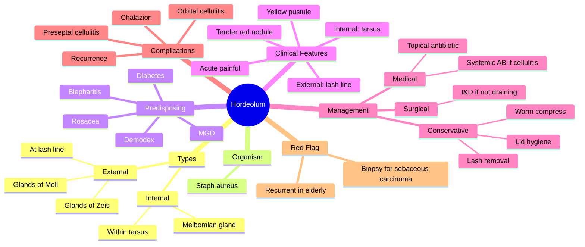

# Hordeolum (Stye)

Related: [[Chalazion (Meibomian Cyst)]], [[Blepharitis]]

> [!tip] **FCPS/MRCP Priority: HIGH**
> Acute, painful, suppurative lid lump. **External** (glands of Zeis/Moll at lash follicle) vs **internal** (meibomian gland within tarsus). Treat with warm compress ± topical antibiotic.

---

## Learning Objectives
- [ ] Define hordeolum and differentiate external from internal stye
- [ ] State the common causative organism and predisposing factors
- [ ] Describe the clinical features of external vs internal hordeolum
- [ ] Outline the management (warm compress, topical antibiotic, drainage)
- [ ] Recognise complications and red flags (preseptal cellulitis, recurrent lesion in elderly)

---

## 1. Definition / Epidemiology

### Definition
- **Hordeolum (stye):** Acute suppurative (purulent) infection of the eyelid glands
- **External hordeolum:** Infection of the **glands of Zeis** (sebaceous, opening into lash follicle) or **glands of Moll** (apocrine sweat glands at lash root)
- **Internal hordeolum:** Acute suppurative infection of a **meibomian gland** within the tarsal plate

### Epidemiology
- Very common
- Affects all ages; slight female predominance
- Associated with blepharitis, MGD, rosacea, and poor lid hygiene
- Recurrent styes suggest underlying lid margin disease

---

## 2. Aetiology / Pathophysiology

### Causative Organism
- **Staphylococcus aureus** — most common (over 90%)
- Occasionally *Staphylococcus epidermidis* (less virulent)
- Mixed flora in chronic blepharitis

### Pathogenesis
- Obstruction and bacterial infection of an eyelid gland
- Folliculitis of the lash (external) or suppurative meibomianitis (internal)
- Neutrophilic microabscess formation
- Spontaneous drainage through the skin (external) or tarsal conjunctiva (internal)

### Predisposing Factors
- Chronic blepharitis (especially posterior / MGD)
- Rosacea
- Seborrhoeic dermatitis
- Diabetes mellitus
- Immunocompromise
- Poor lid hygiene
- Demodex infestation (vector for bacterial carriage)
- Contact lens wear
- Make-up / ocular cosmetics use
- Stress and fatigue

### Course
- Most external styes resolve spontaneously in 1–2 weeks with drainage
- Internal styes may evolve into a chalazion if they fail to drain
- Recurrent styes warrant evaluation for underlying blepharitis, MGD, and (in elderly) sebaceous gland carcinoma

---

## 3. Classification

| Type | Gland Involved | Location | Drains |
|------|----------------|----------|--------|
| **External hordeolum** | Glands of Zeis (sebaceous) / Moll (apocrine) | At the lash follicle / lid margin | Through the skin |
| **Internal hordeolum** | Meibomian gland | Within the tarsal plate | Through the tarsal conjunctiva |
| **Multiple / recurrent** | Several glands, often bilateral | — | Indicates underlying lid disease |

---

## 4. Clinical Features

### External Hordeolum
- **Acute, tender, red lump at the lash line**
- Localised swelling, erythema, warmth
- **Yellow pustule** at the base of a single lash (points outward to the skin)
- ± epiphora, mild photophobia
- ± preauricular lymphadenopathy
- Pain increases until spontaneous drainage
- Most resolve in 7–10 days

### Internal Hordeolum
- **Acute, tender, red lump within the tarsus**
- More diffuse lid swelling than external
- **Points toward the conjunctival side** — visible on lid eversion as a yellow abscess
- Often more painful than external
- May cause mechanical ptosis
- Can evolve into a chronic chalazion if it fails to drain

### Common Features
- Pain, swelling, redness
- Localised warmth
- Mild epiphora
- Foreign body sensation
- Preauricular lymphadenopathy (especially with internal hordeolum)

### Symptoms Worse / Indicating Complications
- Spreading erythema, fever, proptosis, ↓ vision → **preseptal / orbital cellulitis** — emergency
- Recurrent at same site in elderly → **sebaceous carcinoma**
- Persistence beyond 4–6 weeks → consider chalazion formation or alternative diagnosis

---

## 5. Examination

- **Visual acuity** (baseline; check for associated keratitis / cellulitis)
- **Inspection:** Localised tender red nodule at lash line (external) or in tarsus (internal)
- **Palpation:** Warm, tender, often fluctuant
- **Lid eversion** (after topical anaesthetic) — to identify tarsal lesion in internal stye
- **Examine other eye** and lid margins for signs of blepharitis / MGD
- **Preauricular and submandibular lymph nodes** — may be enlarged and tender
- **Pupil, slit-lamp examination** to rule out associated keratitis or uveitis
- **Fundus** (if signs of orbital involvement — check for optic nerve compromise)
- **Send pus for culture and sensitivity** if atypical, recurrent, or unresponsive to empirical therapy

---

## 6. Investigations

- **Clinical diagnosis** — no routine investigations required
- **Pus culture and sensitivity** — if recurrent, atypical, neonatal, immunocompromised, or not responding to empirical antibiotic
- **Slit-lamp examination** — to assess cornea and anterior chamber
- **Biopsy** — if atypical, recurrent, or suspicious for sebaceous gland carcinoma (especially in elderly patients with recurrent or atypical lesions and lash loss)
- **Blood glucose / HbA1c** — if recurrent styes (rule out diabetes)

---

## 7. Differential Diagnosis

| Condition | Distinguishing Features |
|-----------|------------------------|
| **Chalazion** | Chronic, painless, firm, tarsal nodule pointing conjunctivally |
| **Preseptal cellulitis** | Diffuse lid swelling, erythema, fever, often follows skin breach |
| **Orbital cellulitis** | Proptosis, ↓ vision, restricted EOM, chemosis — emergency |
| **Sebaceous gland carcinoma** | Elderly, recurrent, atypical, lash loss, pagetoid spread |
| **Basal cell carcinoma** | Pearly nodule, central ulceration, telangiectasia |
| **Squamous cell carcinoma** | Ulcerated, hyperkeratotic |
| **Molluscum contagiosum** | Umbilicated, pearly papule at lid margin |
| **Dacryocystitis** | Tender swelling medial to inner canthus, epiphora, regurgitation |
| **Insect bite / allergic reaction** | History of exposure, pruritus, often bilateral, wheal |

---

## 8. Management

### Conservative (First-line)
- **Warm compress** 4×/day × 7–10 days (10–15 min each session)
- Promotes spontaneous drainage in most cases
- **Pull out the affected lash** (external stye) — aids drainage and accelerates resolution
- Maintain lid hygiene (lid scrubs, baby shampoo)

### Medical
- **Topical antibiotic ointment** (chloramphenicol, fusidic acid) to lid margin — 7–10 days
  - Most useful for staphylococcal infection
- **Topical antibiotic–steroid combination** — short course (≤1 week) for marked inflammation; avoid prolonged use
- **Systemic antibiotic** (flucloxacillin, erythromycin, co-amoxiclav) if:
  - Preseptal cellulitis
  - Recurrent lesions
  - Immunocompromised patient
  - No response to topical therapy

### Surgical
- **Incision and drainage** — if the lesion is pointing but not draining
  - External: small stab incision over the pointing abscess, with lash removal
  - Internal: evert lid, vertical incision on the tarsal conjunctiva
- Internal hordeolum that fails to drain may require I&C and may evolve into a chalazion
- **Send specimen for histopathology** in atypical / recurrent / elderly cases

### Treat Underlying Disease
- Blepharitis, MGD, rosacea
- Improve lid hygiene
- Address Demodex infestation
- Optimise diabetes control
- Counsel on avoidance of eye rubbing, contaminated cosmetics, contact lens hygiene

---

## 9. Complications

- Preseptal cellulitis (most common significant complication)
- Orbital cellulitis (rare but serious — emergency)
- Chalazion formation (internal hordeolum failing to drain)
- Recurrent styes (underlying blepharitis / MGD)
- Spread to surrounding skin (impetiginisation)
- Mechanical ptosis (large internal stye)
- Secondary conjunctivitis / keratitis
- Septicaemia (very rare, immunocompromised)
- **Misdiagnosis of sebaceous gland carcinoma** in elderly

---

## 10. Red Flags / Emergencies

- **Orbital cellulitis:** Proptosis, ↓ vision, restricted EOM, chemosis, fever — emergency CT / IV antibiotics
- Preseptal cellulitis with systemic signs (fever, lymphadenopathy)
- Recurrent stye at the **same site in the elderly** with lash loss — **biopsy to exclude sebaceous carcinoma**
- Neonatal stye (consider Chlamydia, other organisms — refer)
- Bilateral, simultaneous, or recurrent in immunocompromised patients
- Non-resolution after 4–6 weeks of appropriate treatment

---

## 11. FCPS/MRCP High-Yield Summary

| Topic | Key Points |
|-------|------------|
| External stye | At lash line — glands of Zeis / Moll |
| Internal stye | Within tarsus — meibomian gland |
| Organism | **Staphylococcus aureus** |
| Predisposing | Blepharitis, MGD, rosacea, DM |
| Treatment | Warm compress + topical AB; ± I&D |
| Recurrent | Treat underlying blepharitis; biopsy in elderly |
| Complication | Preseptal cellulitis; chalazion (internal) |
| Mascara / cosmetics | Common vector — replace regularly, avoid sharing |

---

## 12. Viva Questions

1. **Q:** Differentiate external and internal stye.
   **A:** External = at the lash line (glands of Zeis / Moll), points outward to skin. Internal = within the tarsus (meibomian), points to the conjunctiva.

2. **Q:** What is the most common causative organism?
   **A:** **Staphylococcus aureus**.

3. **Q:** What is the first-line treatment?
   **A:** Warm compress 4×/day × 7–10 days, with topical antibiotic ointment (chloramphenicol or fusidic acid) for staphylococcal cover.

4. **Q:** What is the role of lash removal?
   **A:** Pulling out the affected lash in an external stye aids drainage and accelerates resolution.

5. **Q:** When should you suspect sebaceous gland carcinoma?
   **A:** Recurrent stye at the same site in an elderly patient, especially with lash loss and pagetoid conjunctival spread — biopsy mandatory.

---

## 13. Common Confusions / Exam Traps

| Confusion | Clarification |
|-----------|---------------|
| "Stye and chalazion are the same" | Stye = **acute** suppurative; chalazion = **chronic** lipogranuloma |
| "External stye involves meibomian gland" | No — external = glands of Zeis / Moll; **internal** stye = meibomian |
| "All styes need systemic antibiotics" | Most resolve with warm compress + topical AB; systemic only if cellulitis, recurrent, or immunocompromised |
| "Stye is caused by poor hygiene alone" | Usually *S. aureus* in the setting of blepharitis, MGD, rosacea, or DM — not just hygiene |
| "Recurrent stye in elderly is benign" | **No** — must biopsy to exclude **sebaceous gland carcinoma** (masquerade) |
| "Stye is contagious" | Stye itself is not considered contagious; styes are usually endogenous (S. aureus from patient's own flora) |
| "Stye needs incision in all cases" | Most drain spontaneously; I&D only if pointing but not draining |

---

## 14. Mnemonics

1. **"**E**xternal = **E**yelash **E**xit"** — External stye points to the skin at the lash root
2. **"**I**nternal = **I**nside the **I**nner Tarsus"** — Internal stye is within the tarsal plate, points to conjunctiva
3. **"**S**taph **S**tye = **S**kin Side, **S**wift Resolution with **S**queezing (warm compress)"** — *S. aureus*, external, hot compress first
4. **"**R**ecurrent **R**edness in **R**etirement? **R**ule out sebaceous carcinoma"** — recurrent lesion in elderly = biopsy

---

## 15. Mind Map

---

## 16. One-Page Revision Card

| **Topic** | **Hordeolum (Stye)** |
|-----------|----------------------|
| **Definition** | Acute suppurative infection of eyelid glands |
| **External** | Glands of Zeis (sebaceous) / Moll (apocrine) — at lash line |
| **Internal** | Meibomian gland — within tarsus |
| **Causative organism** | *Staphylococcus aureus* |
| **Predisposing** | Blepharitis, MGD, rosacea, DM, Demodex |
| **First-line** | Warm compress 4×/day × 7–10 days + topical antibiotic |
| **Lash removal** | Aids drainage in external stye |
| **Indications for I&D** | Pointing but not draining |
| **Systemic AB** | Preseptal cellulitis, recurrent, immunocompromised |
| **Complication** | Preseptal / orbital cellulitis, chalazion |
| **Red flag** | Recurrent lesion in elderly — biopsy for sebaceous carcinoma |
| **Viva Pearl** | External = lash line; Internal = tarsus; *S. aureus* |

---

## Spaced Repetition Trackers

### 24-Hour Recall Prompts
- [ ] Define hordeolum and differentiate external vs internal
- [ ] State the commonest causative organism
- [ ] List 4 predisposing factors
- [ ] Outline the first-line management
- [ ] Identify the red flag for sebaceous gland carcinoma

### Revision Schedule
- [ ] **Day 1** completed (creation + 24h recall)
- [ ] **Day 3** revision completed
- [ ] **Day 7** revision completed
- [ ] **Day 15** revision completed
- [ ] **Day 30** revision completed
- [ ] **Day 90** revision completed

---

## Must Know / Should Know / Nice to Know

### Must Know (Core for passing)
- [x] Definition and classification (external vs internal)
- [x] Commonest organism (*S. aureus*)
- [x] First-line treatment (warm compress + topical AB)
- [x] Differences from chalazion
- [x] Recurrent lesion in elderly — biopsy to exclude sebaceous carcinoma

### Should Know (High probability)
- [x] Predisposing factors: blepharitis, MGD, rosacea, DM
- [x] Lash removal in external stye
- [x] Indications for systemic antibiotics
- [x] Complications: preseptal cellulitis, chalazion

### Nice to Know (Differentiator)
- [ ] Demodex as a vector for *S. aureus* carriage
- [ ] Recurrent stye — check HbA1c
- [ ] I&D technique: vertical incision for internal, stab incision for external
- [ ] Histology: neutrophilic microabscess (vs lipogranuloma of chalazion)

---

## My Weak Points
- [ ] Add personal weak areas here

---

## Self-Test Scorecard

| Section | Score /5 |
|---------|----------|
| Understanding: | /10 |
| Recall: | /10 |
| MCQ Performance: | /10 |
| SBA Performance: | /10 |
| Viva Confidence: | /10 |
| Total: | /50 |

> [!tip] **Interpretation:** <35 = weak topic, 35–44 = acceptable but insecure, 45+ = strong exam-ready topic.

---

## Exam Answer Modes

### Long Answer Skeleton
1. **Definition:** Acute suppurative infection of eyelid glands — external (Zeis/Moll) vs internal (meibomian)
2. **Aetiology:** *S. aureus*; predisposing factors (blepharitis, MGD, rosacea, DM)
3. **Clinical features:** Acute tender red nodule, yellow pustule, preauricular lymphadenopathy
4. **Examination:** Inspection, lid eversion, exclude cellulitis
5. **Differential:** Chalazion, preseptal/orbital cellulitis, sebaceous carcinoma
6. **Management:** Warm compress + topical AB; lash removal (external); I&D if not draining; systemic AB if cellulitis
7. **Complications:** Preseptal / orbital cellulitis, chalazion, recurrence
8. **Red flag:** Recurrent lesion in elderly → biopsy for sebaceous carcinoma

### Short Note Skeleton
- Definition (acute suppurative) + classification (external / internal)
- Causative organism (*S. aureus*)
- First-line management (warm compress + topical AB)
- Difference from chalazion

### Viva One-Liners
- **Q:** External vs internal stye? → **A:** External = lash line (Zeis/Moll); Internal = tarsus (meibomian)
- **Q:** Commonest organism? → **A:** *Staphylococcus aureus*
- **Q:** First-line treatment? → **A:** Warm compress 4×/day × 7–10 days + topical antibiotic
- **Q:** Red flag? → **A:** Recurrent stye in elderly — biopsy to exclude sebaceous carcinoma
- **Q:** Role of lash removal? → **A:** In external stye — pulls the lash, drains the abscess, accelerates resolution
- **Q:** When to use systemic antibiotics? → **A:** Preseptal cellulitis, immunocompromised, recurrent, no response to topical

### Ward-Case Discussion Points
- Differentiate hordeolum from chalazion, preseptal cellulitis
- Initiate warm compress and topical antibiotic
- Counsel on lid hygiene and underlying blepharitis
- Recognise red flags (orbital involvement, recurrent lesion in elderly)
- Discuss follow-up and indications for I&D

### Last-Night-Before-Exam Sheet
- **Top 5 facts:** *S. aureus*; external = lash line (Zeis/Moll); internal = tarsus (meibomian); warm compress first; **recurrent in elderly = biopsy**
- **Mnemonics:** "External = Eyelash Exit"; "Internal = Inside the Inner Tarsus"; "Staph Stye = Skin Side, Swift Resolution with Squeezing (warm compress)"
- **Must-know differential:** Chalazion (chronic, painless), preseptal cellulitis (diffuse, fever), sebaceous carcinoma (recurrent, elderly, lash loss)
- **Trap to avoid:** Stye is not contagious; systemic AB only if cellulitis or recurrent

---

## Summary

Hordeolum is an acute suppurative infection of the eyelid glands caused by **Staphylococcus aureus**. **External** styes involve the glands of Zeis (sebaceous) or Moll (apocrine) at the lash line and point outward to the skin; **internal** styes involve the meibomian gland within the tarsus and point to the conjunctiva. **Predisposing factors** include chronic blepharitis, MGD, rosacea, diabetes, and Demodex infestation. **First-line treatment** is warm compress and topical antibiotic; most resolve in 7–10 days. **Incision and drainage** is reserved for lesions that are pointing but not draining, and **systemic antibiotics** are required for preseptal cellulitis, recurrent disease, or immunocompromised patients. **Recurrent stye at the same site in an elderly patient** warrants **biopsy to exclude sebaceous gland carcinoma** (masquerade syndrome).

---

## MCQs (10)

1. **Question:** External stye involves which gland(s)?
   **Options:** A. Meibomian gland B. Tarsal plate C. Glands of Zeis and Moll D. Lacrimal gland E. Conjunctival goblet cells
   **Answer:** C
   **Explanation:** External stye = glands of Zeis (sebaceous) or Moll (apocrine sweat) at the lash root.

2. **Question:** The most common causative organism of a stye is:
   **Options:** A. Streptococcus pyogenes B. **Staphylococcus aureus** C. Pseudomonas aeruginosa D. Herpes simplex virus E. Haemophilus influenzae
   **Answer:** B
   **Explanation:** *S. aureus* is responsible for the majority of styes.

3. **Question:** First-line treatment of a simple stye is:
   **Options:** A. Topical steroid B. Systemic antibiotic C. **Warm compresses ± topical antibiotic** D. Incision and drainage E. Radiotherapy
   **Answer:** C
   **Explanation:** Warm compresses 4×/day × 7–10 days, often with topical antibiotic; most resolve spontaneously.

4. **Question:** Internal stye differs from external stye in that it:
   **Options:** A. Is caused by Streptococcus B. Involves the meibomian gland within the tarsus C. Is treated with radiotherapy D. Always requires I&D E. Is contagious
   **Answer:** B
   **Explanation:** Internal stye = meibomian gland infection within the tarsal plate, points to the conjunctival side.

5. **Question:** A stye is most accurately described as:
   **Options:** A. Chronic lipogranuloma B. **Acute suppurative infection of an eyelid gland** C. Malignant tumour D. Sebaceous cyst E. Allergic reaction
   **Answer:** B
   **Explanation:** Stye = acute, suppurative, neutrophilic microabscess of an eyelid gland.

6. **Question:** Pulling out the affected eyelash is a useful adjunct in the management of:
   **Options:** A. Internal stye B. Chalazion C. **External stye** D. Sebaceous carcinoma E. BCC
   **Answer:** C
   **Explanation:** In external stye, epilation of the affected lash aids drainage.

7. **Question:** Recurrent stye at the same site in a 70-year-old patient with lash loss and a thickened lid margin should raise suspicion of:
   **Options:** A. Staphylococcal reinfection B. **Sebaceous gland carcinoma** C. BCC D. Trachoma E. Molluscum contagiosum
   **Answer:** B
   **Explanation:** Recurrent lesion + lash loss + atypical features in elderly = suspect sebaceous carcinoma (masquerade syndrome); biopsy.

8. **Question:** An external stye typically drains:
   **Options:** A. Toward the conjunctiva B. **Through the skin at the lash line** C. Through the tarsal plate D. Inferiorly E. Spontaneously into the orbit
   **Answer:** B
   **Explanation:** External stye = pointing to the skin at the lash root.

9. **Question:** Which of the following is a complication of a stye?
   **Options:** A. Retinal detachment B. **Preseptal cellulitis** C. Macular oedema D. Optic neuritis E. Lens subluxation
   **Answer:** B
   **Explanation:** Preseptal cellulitis (diffuse lid swelling, erythema, fever) is a recognised complication; orbital cellulitis is rare but more serious.

10. **Question:** A 25-year-old has an acute, painful, red lump at the right upper lid lash line with a yellow pustule. The preauricular lymph node is enlarged and tender. The most likely diagnosis is:
    **Options:** A. Chalazion B. **External hordeolum (stye)** C. Internal hordeolum D. Preseptal cellulitis E. Sebaceous carcinoma
    **Answer:** B
    **Explanation:** Acute, painful, at lash line, with yellow pustule and preauricular lymphadenopathy = external hordeolum (stye).

---

## SBA Questions (10)

1. **Scenario:** A 25-year-old presents with a 3-day history of an acute, painful, tender red lump at the right upper lid lash line with a yellow pustule at the base of one lash.
   **Question:** Most likely diagnosis?
   **Options:** A. Chalazion B. **External hordeolum (stye)** C. Internal hordeolum D. Preseptal cellulitis E. Sebaceous carcinoma
   **Answer:** B
   **Explanation:** Acute, painful, at lash line, with yellow pustule = external hordeolum (stye).

2. **Scenario:** A 30-year-old has a 5-day history of a tender red lump in the left upper lid. Lid eversion shows a yellow abscess on the tarsal conjunctiva.
   **Question:** Most likely diagnosis?
   **Options:** A. External hordeolum B. **Internal hordeolum** C. Chalazion D. Preseptal cellulitis E. Sebaceous carcinoma
   **Answer:** B
   **Explanation:** Tarsal (inner) location with abscess on the tarsal conjunctiva = internal hordeolum (meibomian gland).

3. **Scenario:** A 28-year-old has a 4-day-old stye at the right upper lid lash line with a yellow pustule. There is no cellulitis, no fever, and vision is normal.
   **Question:** Best initial management?
   **Options:** A. Immediate incision and drainage B. Systemic IV antibiotics C. **Warm compresses 4×/day × 7–10 days + topical antibiotic ointment** D. Topical steroid only E. Cryotherapy
   **Answer:** C
   **Explanation:** First-line is conservative — warm compresses and topical antibiotic; most resolve spontaneously.

4. **Scenario:** A 70-year-old has had three styes at the same site on the right upper lid over 6 months. There is madarosis and a thickened, vascularised lid margin.
   **Question:** Most appropriate next step?
   **Options:** A. Continue current management B. **Full-thickness incisional biopsy of the lid lesion to exclude sebaceous gland carcinoma** C. Long-term oral doxycycline D. Topical steroid only E. Topical antifungal
   **Answer:** B
   **Explanation:** Recurrent lesion + lash loss + atypical features in elderly → biopsy to exclude sebaceous carcinoma.

5. **Scenario:** A 40-year-old with a stye develops diffuse lid swelling, erythema, fever (38.5 °C), and tender preauricular lymphadenopathy over 24 hours.
   **Question:** Most appropriate management?
   **Options:** A. Continue warm compresses only B. Topical steroid only C. **Oral systemic antibiotic (e.g., flucloxacillin) ± admission for IV antibiotics** D. Topical antifungal E. Radiotherapy
   **Answer:** C
   **Explanation:** Preseptal cellulitis superimposed on a stye — requires systemic (often IV) antibiotics; consider admission.

6. **Scenario:** A 35-year-old with recurrent styes has thickened lid margins with telangiectasia and facial flushing. Slit-lamp shows cloudy, inspissated meibum.
   **Question:** Most likely associated systemic condition?
   **Options:** A. Diabetes mellitus B. **Acne rosacea** C. HIV D. Sarcoidosis E. Tuberculosis
   **Answer:** B
   **Explanation:** Rosacea with MGD predisposes to recurrent styes.

7. **Scenario:** A 45-year-old has a large internal stye that has not drained despite 7 days of warm compresses. There is a yellow abscess visible on the tarsal conjunctiva.
   **Question:** Most appropriate next step?
   **Options:** A. Continue observation B. **Incision and drainage (vertical incision on tarsal conjunctiva)** C. Topical steroid only D. Cryotherapy E. Radiotherapy
   **Answer:** B
   **Explanation:** Pointing but not draining → I&D. Vertical incision on tarsal conjunctiva preserves meibomian glands.

8. **Scenario:** A 50-year-old with a stye and surrounding cellulitis reports decreased vision, proptosis, restricted eye movements, and chemosis.
   **Question:** Most likely diagnosis and most appropriate next step?
   **Options:** A. Preseptal cellulitis — continue topical antibiotic B. **Orbital cellulitis — emergency CT orbits and IV antibiotics; same-day ophthalmology / ENT review** C. Allergic reaction — antihistamine D. Conjunctivitis — topical antibiotic E. Uveitis — topical steroid
   **Answer:** B
   **Explanation:** Proptosis, ↓ vision, restricted EOM = orbital cellulitis. Emergency CT and IV antibiotics are required.

9. **Scenario:** A 60-year-old with recurrent styes is found to have a random blood glucose of 18 mmol/L.
   **Question:** Most appropriate next step in management of the recurrent styes?
   **Options:** A. Long-term oral doxycycline B. **Optimise glycaemic control + lid hygiene** C. Cryotherapy D. Topical antifungal E. Refer for I&D
   **Answer:** B
   **Explanation:** Diabetes is a recognised predisposing factor for recurrent styes — optimise glycaemic control alongside lid hygiene.

10. **Scenario:** A 30-year-old woman presents with an external stye. On examination, there are collarettes (cylindrical dandruff) at the lash roots of both eyes.
    **Question:** Which additional therapy should be considered?
    **Options:** A. Oral valaciclovir B. **Tea tree oil lid scrubs / topical ivermectin for Demodex** C. Oral metronidazole D. Topical amphotericin B E. Topical ciclosporin
    **Answer:** B
    **Explanation:** Cylindrical dandruff = Demodex, which acts as a vector for *S. aureus*; treat with tea tree oil / ivermectin.

---

## Flashcards

- **Q:** What is a hordeolum?
  **A:** Acute suppurative infection of an eyelid gland — external (Zeis/Moll) or internal (meibomian).
- **Q:** Commonest causative organism?
  **A:** *Staphylococcus aureus*.
- **Q:** External vs internal stye?
  **A:** External = lash line (Zeis/Moll) → skin; Internal = tarsus (meibomian) → conjunctiva.
- **Q:** First-line treatment?
  **A:** Warm compress 4×/day × 7–10 days + topical antibiotic (chloramphenicol / fusidic acid).
- **Q:** Red flag?
  **A:** Recurrent stye at the same site in an elderly patient with lash loss → **biopsy to exclude sebaceous gland carcinoma**.
- **Q:** When to use systemic antibiotics?
  **A:** Preseptal/orbital cellulitis, recurrent disease, immunocompromised, no response to topical therapy.

---

## Answer Key with Explanations

### MCQs
1. **C** — External stye = glands of Zeis (sebaceous) and Moll (apocrine) at the lash root.
2. **B** — *S. aureus* is the most common cause of styes.
3. **C** — Warm compresses ± topical antibiotic are first-line; most resolve in 7–10 days.
4. **B** — Internal stye = meibomian gland infection within the tarsal plate.
5. **B** — Stye = acute suppurative infection of an eyelid gland (vs chalazion = chronic lipogranuloma).
6. **C** — Epilation of the affected lash aids drainage in external stye.
7. **B** — Recurrent lesion + lash loss + atypical features in elderly = suspect sebaceous carcinoma (masquerade).
8. **B** — External stye points to the skin at the lash line.
9. **B** — Preseptal cellulitis is the most common significant complication.
10. **B** — Acute, painful, at lash line, with yellow pustule = external hordeolum.

### SBAs
1. **B** — Acute, painful, at lash line, with yellow pustule = external hordeolum.
2. **B** — Tarsal (inner) location with tarsal conjunctival abscess = internal hordeolum.
3. **C** — First-line is warm compresses + topical antibiotic; most resolve spontaneously.
4. **B** — Recurrent + lash loss + atypical features in elderly → biopsy for sebaceous carcinoma.
5. **C** — Preseptal cellulitis → systemic (often IV) antibiotics.
6. **B** — Rosacea with MGD predisposes to recurrent styes.
7. **B** — Pointing but not draining → I&D (vertical incision on tarsal conjunctiva).
8. **B** — Proptosis + ↓ vision + restricted EOM = orbital cellulitis; emergency CT + IV antibiotics.
9. **B** — Diabetes predisposes to recurrent styes — optimise glycaemic control + lid hygiene.
10. **B** — Cylindrical dandruff = Demodex (vector for *S. aureus*) → tea tree oil / ivermectin.

---

## Tags
#medicine #davidson #ophthalmology #stye #hordeolum #fcps #mrcp
