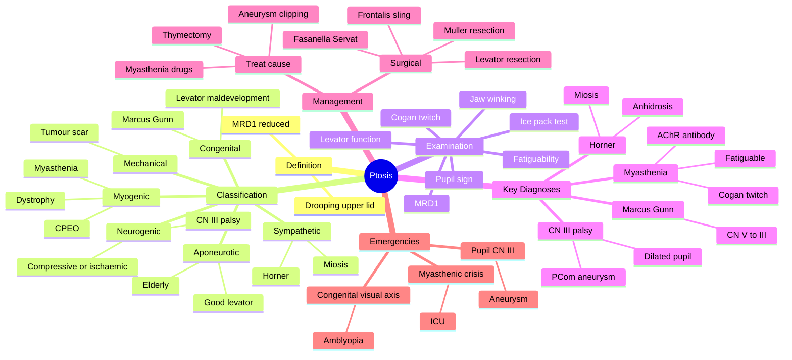

# Ptosis

Related: [[Myasthenia Gravis (Ocular)]], [[CN III Palsy]], [[Horner Syndrome]]

> [!tip] **FCPS/MRCP Priority: HIGH**
> Differentiate the cause of ptosis by pupil: CN III palsy (dilated), Horner (miosis), myasthenia (fatiguable, ± diplopia). Myasthenia is the most important to exclude.

---

## Learning Objectives
- [ ] Define ptosis (blepharoptosis) and describe MRD1 measurement
- [ ] Classify ptosis by aetiology (aponeurotic, neurogenic, myogenic, mechanical, traumatic, congenital)
- [ ] Differentiate CN III palsy, Horner syndrome, and myasthenia by clinical features (especially pupil)
- [ ] Identify specific clinical signs: fatiguability, Cogan twitch, ice pack test, jaw-winking
- [ ] Describe the management of each aetiology
- [ ] Identify red flags (pupil-involving CN III palsy, myasthenic crisis)
- [ ] Recognise congenital ptosis and amblyopia risk

---

## 1. Definition

- **Ptosis (blepharoptosis):** Drooping of the upper eyelid
- Margin-reflex distance (MRD1) reduced
- May be congenital or acquired

---

## 2. Classification

### By Cause
| Type | Cause | Key features |
|------|-------|--------------|
| **Aponeurotic (involutional)** | Levator dehiscence, age | Common in elderly |
| **Neurogenic (CN III palsy)** | Oculomotor nerve lesion | Dilated pupil, down-and-out |
| **Sympathetic (Horner)** | Sympathetic lesion | Miosis, anhidrosis |
| **Myogenic** | Myasthenia gravis, dystrophy | Fatiguable, ± diplopia |
| **Mechanical** | Tumour, scarring | Mass effect |
| **Traumatic** | Lid injury, post-surgical | |
| **Congenital** | Levator maldevelopment | Poor levator function, amblyopia risk |

---

## 3. Key Examination Points

- **MRD1** (margin-reflex distance 1): distance from corneal light reflex to upper lid margin (normal 4–5 mm)
- **Levator function** (lid excursion from down to up gaze): normal >12 mm
- **Pupil:** Dilated (CN III) vs miosis (Horner)
- **Fatiguability:** Sustained upgaze → progressive ptosis (myasthenia)
- **Cogan lid twitch:** Brief over-elevation after looking down then up (myasthenia)
- **Jaw-winking** (Marcus Gunn): Lid elevates with chewing (congenital, CN V–III synkinesis)
- **Bell phenomenon** (upward eye roll on lid closure)
- **Ice pack test:** Improves ptosis in myasthenia

---

## 4. Management

### Treat Underlying Cause
- **Myasthenia:** Acetylcholinesterase inhibitors, immunosuppression, thymectomy
- **CN III palsy:** Treat cause (aneurysm, ischaemia)
- **Horner:** Investigate sympathetic chain
- **Mechanical:** Remove lesion

### Surgical
- **Levator resection** (if levator function reasonable, >4 mm)
- **Frontalis sling** (poor levator function: myogenic dystrophy, congenital)
  - Materials: silicone rod, fascia lata (autograft or banked)
- **Müller muscle resection** (mild ptosis with good levator function, e.g., Horner)
- **Fasanella-Servat** (mild ptosis)

### Special Situations
- **Children with congenital ptosis:** Amblyopia risk (deprivation, astigmatism) — early surgery if visual axis obstructed
- **Acute CN III palsy:** Pupil involvement → emergency (aneurysm, uncal herniation)
- **Myasthenia crisis:** ICU, plasma exchange / IVIG

---

## 5. Anatomy and Pathophysiology — Extended

### Anatomy
- **Levator palpebrae superioris:** Main elevator; CN III; contributes 14 mm of lid elevation
- **Müller's muscle (superior tarsal muscle):** Sympathetic; contributes ~2 mm of tone
- **Frontalis muscle:** CN VII; accessory elevator (used in frontalis sling procedure)
- **Orbicularis oculi:** CN VII; closes the lid
- **CN III nucleus:** single midline subnucleus for levators (bilateral ptosis if bilateral lesion)
- **Sympathetic pathway:** hypothalamus → ciliospinal centre of Budge (C8–T2) → superior cervical ganglion → along ICA → cavernous plexus → Müller's muscle

### Pathophysiology by Type
- **Aponeurotic (involutional):** Stretching/dehiscence of levator aponeurosis from tarsus; elderly; good levator function
- **Neurogenic:** CN III palsy (compressive: aneurysm/tumour; ischaemic: diabetes, hypertension) → levator weakness
- **Sympathetic (Horner):** Loss of Müller's muscle tone → mild ptosis (~1–2 mm); ± miosis, anhidrosis
- **Myogenic:** Myasthenia gravis (AChR antibodies at NMJ); chronic progressive external ophthalmoplegia (CPEO); myotonic dystrophy; oculopharyngeal muscular dystrophy
- **Mechanical:** Mass effect (tumour, scar, dermatochalasis) overcomes levator
- **Traumatic:** Levator or CN III injury
- **Congenital:** Levator maldevelopment; ± superior rectus weakness; ± jaw-winking (Marcus Gunn)

---

## 6. Clinical Features — Extended

### History Pearls
- **Onset:** Sudden = neurogenic (CN III, Horner); gradual = aponeurotic, myogenic
- **Variation through day:** Fatiguable = myasthenia
- **Diplopia:** Suggests myasthenia or CN III palsy (not aponeurotic)
- **Pain:** Compressive CN III palsy (aneurysm), Tolosa-Hunt, cavernous sinus
- **Chewing/sucking moves the lid:** Marcus Gunn jaw-winking
- **Past medical:** Diabetes, hypertension, myasthenia, thyroid eye disease
- **Drugs:** Steroids, beta-blockers, opioids
- **Family history:** Myasthenia, muscular dystrophy

### Examination Pearls
- **MRD1:** <2 mm = severe; <4 mm = mild
- **Levator function (LF):** >12 mm = good; 5–12 mm = fair; <4 mm = poor
- **Pupil:** Always check — first step in differential
  - **Dilated + ptosis + down-and-out:** CN III palsy (compressive)
  - **Constricted + ptosis + anhidrosis:** Horner
  - **Normal + fatigable:** Myasthenia
  - **Normal + bilateral slow-onset:** Aponeurotic, myotonic dystrophy
- **Bell phenomenon:** Upward eye roll on attempted lid closure (preserved in myogenic)
- **Cogan twitch:** Brief overshoot of lid on refixation from downgaze — myasthenia
- **Fatiguability test:** Sustained upgaze 1–2 min → progressive ptosis = myasthenia
- **Ice pack test:** Ice on closed lid 2 min → improvement >2 mm = myasthenia
- **Jaw-winking (Marcus Gunn):** Congenital synkinesis (CN V to III)
- **Extraocular movements:** Restriction/aberration in CN III palsy, myasthenia, CPEO
- **Fatigable diplopia:** Myasthenia

### Quantifying Ptosis
- **Mild:** 1–2 mm
- **Moderate:** 3 mm
- **Severe:** >4 mm (covers pupil, amblyopia risk in children)

---

## 7. Special Syndromes

### Myasthenia Gravis (Ocular)
- Ocular onset in 50% (ptosis + diplopia); 80% progress to generalised
- Fatiguable ptosis, Cogan's twitch, ice test positive
- Anti-AChR antibodies (50% in ocular MG, 90% in generalised)
- Anti-MuSK antibodies
- Single-fibre EMG: most sensitive
- Edrophonium (Tensilon) test rarely used now
- **CT chest:** Thymoma in 10–15%
- Treatment: pyridostigmine, steroids, immunosuppression, thymectomy

### Horner Syndrome
- Sympathetic chain lesion (anywhere from hypothalamus to orbit)
- **Triad:** Ptosis (mild, ~1–2 mm, Müller's), miosis, anhidrosis (ipsilateral face)
- ± enophthalmos (apparent)
- Causes: Pancoast tumour, carotid dissection, brainstem stroke, syringomyelia, congenital
- **Pharmacological testing:** Cocaine drops → affected pupil does not dilate; apraclonidine or phenylephrine (reversal of anisocoria)
- Hydroxyamphetamine distinguishes pre- vs postganglionic

### CN III Palsy
- **Pupil-involving (compressive):** Posterior communicating artery aneurysm, uncal herniation, tumour — EMERGENCY
- **Pupil-sparing (ischaemic):** Diabetes, hypertension (vasa nervorum) — usually resolves over 3–6 months
- Ptosis + down-and-out eye + diplopia
- Pain common (compressive)

### Marcus Gunn Jaw-Winking Syndrome
- Congenital synkinesis: pterygoid muscle (CN V) miswires to levator (CN III)
- Ptotic lid elevates with chewing, sucking, jaw movement
- Often unilateral; 5% of congenital ptosis
- Treat with levator excision + frontalis sling if severe

### Chronic Progressive External Ophthalmoplegia (CPEO)
- Bilateral, slowly progressive ptosis + EOM restriction
- Mitochondrial inheritance; mitochondrial DNA deletions
- ± Kearns-Sayre (CPEO + heart block + pigmentary retinopathy)
- Surgical: frontalis sling

### Myotonic Dystrophy
- Bilateral ptosis, myotonia, frontal balding, cataracts, facial weakness
- Cardiac conduction defects

### Oculopharyngeal Muscular Dystrophy
- Late-onset (5th–6th decade), bilateral ptosis, dysphagia
- French-Canadian, Bukhara Jewish descent

### Blepharophimosis Syndrome
- Congenital severe ptosis, telecanthus, epicanthus inversus, blepharophimosis
- FOXL2 gene mutation; autosomal dominant
- Early surgery (medial canthoplasty, frontalis sling)

---

## 8. Investigations

- **Clinical diagnosis** with structured examination
- **Visual acuity, pupil, EOM** — first-line
- **Ice pack test** — bedside screen for myasthenia
- **Anti-AChR antibodies, anti-MuSK antibodies** — myasthenia
- **CT/MRI brain ± cavernous sinus ± orbits** — pupil-involving CN III palsy, Horner
- **CT/MRI chest, MRA, carotid imaging** — as indicated
- **CT chest (thymoma screen)** — myasthenia
- **Edrophonium (Tensilon) test** — rarely used
- **Single-fibre EMG** — most sensitive for myasthenia
- **Cocaine/apraclonidine drops** — Horner confirmation
- **Genetic testing** — congenital, dystrophy
- **Echocardiogram, ECG** — Kearns-Sayre (heart block)
- **Lysosomal enzyme screen** — if metabolic cause

---

## 9. Differential Diagnosis

| Condition | Distinguishing feature |
|-----------|------------------------|
| Dermatochalasis | Excess skin, not true ptosis; lid margin in normal position |
| Blepharospasm | Involuntary lid closure, not ptosis |
| Lid retraction | Opposite — lid too high (thyroid eye disease) |
| Lid oedema | Lid swollen, mechanically heavy |
| Brow ptosis | Brow descends onto lid, pushing it down |
| Enophthalmos | Globe sits deeper, can mimic ptosis |
| Microphthalmos | Small eye, narrow palpebral fissure |

---

## 10. Management — Extended

### Treat Underlying Cause (Always First)
- **Myasthenia:** Pyridostigmine, steroids ± azathioprine, IVIG/plasma exchange (crisis), thymectomy (thymoma or generalised)
- **CN III palsy (compressive):** Urgent neurosurgical referral (aneurysm clipping)
- **CN III palsy (ischaemic):** Risk-factor control; spontaneous recovery common
- **Horner:** Investigate sympathetic chain (Pancoast, carotid dissection, brainstem)
- **Mechanical:** Excision of tumour, scar release
- **Traumatic:** Repair levator if possible; later reconstruction

### Surgical — Levator Resection
- **Indication:** Moderate ptosis with good levator function (≥5 mm, ideally >8 mm)
- Resect a measured amount of levator through a skin crease incision
- Anterior approach
- **Outcome:** Predictable, adjustable

### Surgical — Frontalis Sling
- **Indication:** Poor levator function (<4 mm) — severe congenital, myogenic, CN III palsy
- Suspends lid from frontalis muscle (brow)
- **Materials:** Silicone rod (adjustable), fascia lata (autograft or banked), Supramid
- **Complication:** Exposure keratopathy, sling infection, lagophthalmos

### Surgical — Müller's Muscle Resection
- **Indication:** Mild ptosis with good levator function; **Horner syndrome** (mild)
- Posterior approach (conjunctival)
- Resection of 8–10 mm of Müller's muscle + conjunctiva
- Predictable; small lift (~2 mm)

### Surgical — Fasanella-Servat
- **Indication:** Mild ptosis with good levator function
- Resection of upper tarsus + Müller's muscle + conjunctiva
- Less commonly used now

### Surgical — Blepharoplasty, Brow Lift
- For dermatochalasis or brow ptosis contributing to apparent ptosis

### Special Situations
- **Children with congenital ptosis blocking visual axis:** Early surgery (often frontalis sling) to prevent amblyopia
- **Myasthenic crisis:** ICU, plasma exchange / IVIG, secure airway
- **Aneurysmal CN III palsy:** Urgent neurosurgical clipping/endovascular coiling

---

## 11. Complications

- **Cosmetic:** Asymmetry, lid crease abnormality
- **Exposure keratopathy / ulcer** (over-correction, lagophthalmos)
- **Under-correction** (recurrence)
- **Sling exposure / infection** (frontalis sling)
- **Diplopia** (post-op)
- **Amblyopia** (congenital, if not treated early)
- **Surgical failure / recurrence**

---

## 12. Red Flags / Emergencies

- **Acute painful CN III palsy with dilated pupil** → Compressive (PCom aneurysm) — urgent CT/MRA, neurosurgery
- **Ptosis with diplopia and progression** → Myasthenia (consider myasthenic crisis if bulbar/respiratory)
- **Horner with neck pain** → Carotid dissection (urgent imaging, anticoagulation)
- **Horner with smoker, weight loss, arm pain** → Pancoast tumour (CXR, chest CT)
- **Congenital ptosis covering visual axis** → urgent surgery to prevent amblyopia
- **Ptosis with proptosis and restriction** → Cavernous sinus pathology

---

## 13. FCPS/MRCP High-Yield Summary

| Cause | Pupil | Key Clue |
|-------|-------|----------|
| CN III palsy | **Dilated** (if compressive) | Down-and-out |
| Horner | **Constricted** | Anhidrosis |
| Myasthenia | Normal | Fatiguable, Cogan twitch, ice test |
| Aponeurotic | Normal | Elderly, good levator function |
| Mechanical | Normal | Mass, scar |
| Congenital | Normal | Poor levator function, amblyopia risk |
| Marcus Gunn | Normal | Lid elevates with chewing (CN V–III) |

### Key One-Liners
- "Dilated pupil + ptosis = CN III palsy = PCom aneurysm until proven otherwise"
- "Miosis + ptosis = Horner — think sympathetic chain"
- "Fatiguable ptosis + normal pupil = myasthenia — ice test"
- "Cogan twitch + ice test + AChR antibody = myasthenia"
- "Poor levator function = frontalis sling"
- "Good levator function + Horner = Müller resection"

---

## 14. Viva Questions

1. **Q:** How do you differentiate CN III palsy from Horner syndrome causing ptosis?
   **A:** CN III palsy = dilated pupil (compressive), down-and-out eye, ± pain. Horner = miosis, ptosis (mild), anhidrosis, ± facial flushing.

2. **Q:** How do you diagnose ocular myasthenia?
   **A:** Fatiguable ptosis on sustained upgaze, Cogan's lid twitch, ice pack test (improvement), anti-AChR antibodies, single-fibre EMG (most sensitive), tensilon (edrophonium) test.

3. **Q:** What is jaw-winking (Marcus Gunn) syndrome?
   **A:** Congenital synkinesis: ptotic lid elevates with chewing/sucking (CN V–III miswiring). Treat with levator excision + frontalis sling if severe.

4. **Q:** What surgical options for poor levator function?
   **A:** Frontalis sling (silicone rod, fascia lata).

5. **Q:** Why is pupil-involving CN III palsy an emergency?
   **A:** Suggests compressive lesion (PCom aneurysm, tumour) — risk of rupture, subarachnoid haemorrhage.

6. **Q:** Causes of Horner syndrome?
   **A:** Sympathetic chain lesion — Pancoast tumour, carotid dissection, brainstem stroke, syringomyelia, congenital.

---

## 15. Common Confusions / Exam Traps

| Confusion | Clarification |
|-----------|---------------|
| "All CN III palsies spare the pupil" | WRONG — compressive lesions (aneurysm) involve the pupil; ischaemic (diabetic) spares it |
| "Myasthenia is always bilateral" | Initially unilateral in many; both eyes can be involved but not always at the same time |
| "Ptosis with normal pupil is always benign" | Could be myasthenia (life-threatening if crisis) — investigate |
| "Ice pack test is diagnostic of myasthenia" | Sensitive but not specific — confirm with AChR antibodies and EMG |
| "Müller's muscle resection for severe ptosis" | Only for MILD ptosis (~2 mm), with good levator function |
| "Horner syndrome is a stroke" | It's a SYMPATHETIC lesion; many causes — must investigate |
| "Congenital ptosis can wait" | If covers visual axis → AMBLYOPIA — operate early |
| "Jaw-winking improves with levator resection" | No — needs levator excision + frontalis sling |

---

## 16. Mnemonics

1. **"3-2-1 rule for Horner":** Ptosis (mild), miosis, anhidrosis (3 signs; 2 pupils unequal; 1 sympathetic chain)
2. **"DADD" for myasthenia:** Diplopia, Anticholinesterases effective, Descending weakness, Diurnal variation
3. **"PUPIL" for CN III palsy:** Ptosis, Up-gaze loss (eye down-and-out), Pupil involvement = emergency
4. **"CNI: Compressive = Involved pupil"** — Compressive CN III = pupil Involved
5. **"Horner Has MICE"** — **M**iosis, **I**psilateral ptosis, **C**onstrict pupil, **E**ye looks smaller

---

## Mind Map

---

## One-Page Revision Card

| **Topic** | **Key Point** |
|-----------|---------------|
| **Definition** | Drooping upper lid, MRD1 reduced |
| **First step in exam** | Check the PUPIL — divides differential |
| **CN III palsy** | Dilated pupil (compressive) — aneurysm emergency |
| **Horner** | Miosis + mild ptosis + anhidrosis |
| **Myasthenia** | Fatiguable, Cogan twitch, ice test, AChR Ab |
| **Aponeurotic** | Elderly, normal pupils, good levator function |
| **Congenital** | Poor levator function; amblyopia risk |
| **Marcus Gunn** | Ptotic lid elevates with chewing (CN V–III) |
| **Surgery — good levator** | Levator resection / Müller resection |
| **Surgery — poor levator** | Frontalis sling |
| **Viva pearl** | "Pupil-involving CN III = PCom aneurysm until proven otherwise" |

---

## Spaced Repetition Trackers

### 24-Hour Recall Prompts
- [ ] Define ptosis
- [ ] List 4 aetiological categories
- [ ] State the first step in examination (pupil)
- [ ] Differentiate CN III palsy from Horner by pupil
- [ ] List 3 bedside signs of myasthenia
- [ ] Name the emergency in CN III palsy
- [ ] Identify the surgical option for poor levator function
- [ ] Define Marcus Gunn jaw-winking

### Revision Schedule
- [ ] **Day 1** completed (creation + 24h recall)
- [ ] **Day 3** revision completed
- [ ] **Day 7** revision completed
- [ ] **Day 15** revision completed
- [ ] **Day 30** revision completed
- [ ] **Day 90** revision completed

---

## Must Know / Should Know / Nice to Know

### Must Know (Core for passing)
- [x] Definition of ptosis and MRD1
- [x] Classification (aponeurotic, neurogenic, sympathetic, myogenic, mechanical, congenital)
- [x] Pupil sign differential (dilated = CN III, miosis = Horner, normal = myasthenia/aponeurotic)
- [x] Fatiguability, Cogan twitch, ice test for myasthenia
- [x] Pupil-involving CN III palsy = emergency (PCom aneurysm)
- [x] Frontalis sling for poor levator function
- [x] Levator resection for good levator function
- [x] Amblyopia risk in congenital ptosis

### Should Know (High probability)
- [x] AChR antibodies, single-fibre EMG, thymoma screen
- [x] Horner syndrome causes and pharmacological tests
- [x] Marcus Gunn jaw-winking
- [x] Müller's muscle resection for Horner
- [x] Myasthenic crisis management

### Nice to Know (Differentiator)
- [ ] CPEO, Kearns-Sayre syndrome
- [ ] Oculopharyngeal muscular dystrophy
- [ ] Myotonic dystrophy features
- [ ] Blepharophimosis syndrome (FOXL2)
- [ ] Tensilon test details
- [ ] Carotid dissection and Horner

---

## My Weak Points
- [ ] Add personal weak areas here

---

## Self-Test Scorecard

| Section | Score /10 |
|---------|-----------|
| Understanding: | /10 |
| Recall: | /10 |
| MCQ Performance: | /10 |
| SBA Performance: | /10 |
| Viva Confidence: | /10 |
| **Total:** | **/50** |

> [!tip] **Interpretation:** <35 = weak topic, 35-44 = acceptable but insecure, 45+ = strong exam-ready topic.

---

## Exam Answer Modes

### Long Answer Skeleton
1. **Definition** — drooping of upper lid, MRD1 reduced
2. **Classification** — aponeurotic, neurogenic, sympathetic, myogenic, mechanical, traumatic, congenital
3. **Anatomy** — levator (CN III), Müller's (sympathetic), frontalis (CN VII)
4. **History and examination** — onset, variation, pupil, fatiguability, Cogan twitch, ice test, levator function
5. **Specific diagnoses** — CN III palsy, Horner, myasthenia, aponeurotic, congenital
6. **Investigations** — anti-AChR, single-fibre EMG, CT/MRI brain, CT chest (thymoma), cocaine/apraclonidine
7. **Management** — treat cause; surgical options (levator resection, frontalis sling, Müller resection)
8. **Complications and emergencies** — pupil-involving CN III palsy, myasthenic crisis, amblyopia

### Short Note Skeleton
- Definition + classification
- Pupil examination is the first step
- Pupil-involving CN III palsy = emergency (PCom aneurysm)
- Myasthenia triad: fatiguable ptosis, Cogan twitch, ice test positive
- Surgical options: levator resection (good LF) / frontalis sling (poor LF)

### Viva One-Liners
- **Q:** Ptosis with dilated pupil? → **A:** CN III palsy — compressive (aneurysm) until proven otherwise
- **Q:** Ptosis with miosis? → **A:** Horner syndrome — investigate sympathetic chain
- **Q:** Fatiguable ptosis? → **A:** Myasthenia gravis
- **Q:** Best surgical option for poor levator function? → **A:** Frontalis sling
- **Q:** Marcus Gunn? → **A:** Congenital synkinesis; lid elevates with chewing
- **Q:** Why urgent in CN III palsy with dilated pupil? → **A:** Risk of PCom aneurysm rupture

### Ward-Case Discussion Points
- Examine the lid: MRD1, levator function, lid crease height
- Check pupil: dilated, constricted, or normal
- Test for fatiguability (sustained upgaze), Cogan twitch, ice test
- Examine eye movements, Bell phenomenon
- Look for jaw-winking (congenital)
- Examine the brow, facial nerve, neck (lymph nodes, scars)
- Discuss differential and required investigations
- Counsel on emergency features (sudden onset, pain, diplopia, dysphagia)

### Last-Night-Before-Exam Sheet
- **Top 5 facts:** Ptosis = upper lid droop; Pupil = first step in exam; Dilated = CN III; Miosis = Horner; Fatiguable = myasthenia
- **Mnemonics:** "3-2-1 rule for Horner"; "DADD for myasthenia"; "PUPIL for CN III"; "CNI = Compressive = Involved pupil"
- **Must-know emergency:** Pupil-involving CN III palsy = PCom aneurysm
- **Viva buzz-phrase:** "Frontalis sling for poor levator, levator resection for good levator"

---

## Summary

Ptosis (blepharoptosis) is drooping of the upper eyelid, defined by a reduced MRD1. It is classified by aetiology into aponeurotic, neurogenic (CN III palsy), sympathetic (Horner), myogenic (myasthenia, dystrophy, CPEO), mechanical, traumatic, and congenital. The first step in examination is always the pupil: dilated pupil with ptosis suggests CN III palsy (compressive — PCom aneurysm — emergency); miosis with mild ptosis suggests Horner syndrome; normal pupils with fatiguable ptosis and Cogan's twitch suggest myasthenia gravis. Treatment of the underlying cause is always first; surgical options depend on levator function — levator resection (good function), frontalis sling (poor function), Müller resection (mild Horner). Marcus Gunn jaw-winking is a congenital CN V–III synkinesis. Children with ptosis covering the visual axis need early surgery to prevent amblyopia.

---

## MCQs (10)

1. **Question:** Ptosis with a dilated pupil suggests:
   **Options:** A. Myasthenia B. Horner C. CN III palsy D. Aponeurotic E. Congenital
   **Answer:** C
   **Explanation:** Compressive CN III palsy (e.g., PCom aneurysm) affects parasympathetic fibres → dilated pupil.

2. **Question:** Fatiguable ptosis is characteristic of:
   **Options:** A. Horner B. Myasthenia C. CN III palsy D. Aponeurotic E. None
   **Answer:** B
   **Explanation:** Myasthenia — sustained upgaze worsens ptosis.

3. **Question:** Cogan lid twitch is seen in:
   **Options:** A. Horner B. CN III palsy C. Myasthenia D. Bell palsy E. None
   **Answer:** C
   **Explanation:** Brief lid over-elevation on upgaze after downgaze — myasthenia.

4. **Question:** Ptosis with miosis and anhidrosis is most likely:
   **Options:** A. CN III palsy B. Myasthenia C. Horner syndrome D. Aponeurotic E. Congenital
   **Answer:** C
   **Explanation:** Miosis + ptosis + anhidrosis = Horner (sympathetic chain lesion).

5. **Question:** A 60-year-old smoker has ptosis, miosis, anhidrosis, and left arm pain. The most likely cause is:
   **Options:** A. Myasthenia gravis B. Pancoast tumour C. CN III palsy D. Multiple sclerosis E. Migraine
   **Answer:** B
   **Explanation:** Horner syndrome + smoker + arm pain = Pancoast tumour (apical lung tumour invading sympathetic chain).

6. **Question:** Marcus Gunn jaw-winking syndrome is best described as:
   **Options:** A. Acquired CN III palsy B. Congenital synkinesis between CN V and III C. Myasthenia D. Horner E. Bell palsy
   **Answer:** B
   **Explanation:** Congenital miswiring: pterygoid (CN V) → levator (CN III); ptotic lid elevates with chewing.

7. **Question:** The most appropriate surgical procedure for severe congenital ptosis with poor levator function is:
   **Options:** A. Levator resection B. Frontalis sling C. Müller muscle resection D. Fasanella-Servat E. Tarsorrhaphy
   **Answer:** B
   **Explanation:** Poor levator function → frontalis sling (silicone rod or fascia lata).

8. **Question:** An ice pack test that improves ptosis suggests:
   **Options:** A. Horner B. CN III palsy C. Myasthenia gravis D. Aponeurotic E. Congenital
   **Answer:** C
   **Explanation:** Ice improves neuromuscular transmission transiently in myasthenia.

9. **Question:** Pupil-sparing CN III palsy in a diabetic patient is most commonly due to:
   **Options:** A. Posterior communicating artery aneurysm B. Ischaemic neuropathy C. Brainstem stroke D. Multiple sclerosis E. Tumour
   **Answer:** B
   **Explanation:** Diabetic CN III palsy is ischaemic (vasa nervorum), typically pupil-sparing; resolves over 3–6 months.

10. **Question:** A child with severe congenital ptosis covering the visual axis is at risk of:
    **Options:** A. Glaucoma B. Amblyopia C. Retinoblastoma D. Cataract E. Uveitis
    **Answer:** B
    **Explanation:** Visual axis obstruction in a child → deprivation amblyopia; early surgery is required.

---

## SBA Questions (10)

1. **Scenario:** A 60-year-old has ptosis that worsens at the end of the day, diplopia, normal pupil.
   **Question:** Most likely diagnosis?
   **Options:** A. CN III palsy B. Horner C. Myasthenia gravis D. Aponeurotic E. Skull base tumour
   **Answer:** C
   **Explanation:** Fatiguable ptosis + diplopia + normal pupil = myasthenia.

2. **Scenario:** A 55-year-old presents with sudden painful ptosis, dilated pupil, and a "down-and-out" eye.
   **Question:** Most likely diagnosis?
   **Options:** A. Myasthenia B. Aponeurotic ptosis C. Compressive CN III palsy (PCom aneurysm) D. Horner E. Migraine
   **Answer:** C
   **Explanation:** Pain + dilated pupil + down-and-out = compressive CN III palsy — PCom aneurysm is the classic cause.

3. **Scenario:** A 70-year-old has mild ptosis (1 mm), miosis, and anhidrosis on one side. There is no diplopia.
   **Question:** Most likely diagnosis?
   **Options:** A. CN III palsy B. Horner syndrome C. Myasthenia D. Aponeurotic E. Bell palsy
   **Answer:** B
   **Explanation:** Mild ptosis + miosis + anhidrosis = Horner syndrome.

4. **Scenario:** A 6-year-old has severe unilateral ptosis since birth. The lid elevates when he chews. Levator function is poor.
   **Question:** Most appropriate surgical management?
   **Options:** A. Levator resection B. Frontalis sling C. Müller resection D. Observation E. Tarsorrhaphy
   **Answer:** B
   **Explanation:** Poor levator + Marcus Gunn jaw-winking = frontalis sling (often with levator excision).

5. **Scenario:** A 65-year-old has bilateral, slowly progressive ptosis over 10 years, with external ophthalmoplegia and pigmentary retinopathy. ECG shows first-degree heart block.
   **Question:** Most likely diagnosis?
   **Options:** A. Myasthenia gravis B. Kearns-Sayre syndrome (CPEO + heart block + retinopathy) C. Multiple sclerosis D. Myasthenic crisis E. Migraine
   **Answer:** B
   **Explanation:** CPEO + pigmentary retinopathy + heart block = Kearns-Sayre syndrome.

6. **Scenario:** A 40-year-old diabetic presents with sudden ptosis and a "down-and-out" eye, but the pupil is normal. There is no pain.
   **Question:** Most likely cause?
   **Options:** A. PCom aneurysm B. Ischaemic CN III palsy (diabetic) C. Myasthenia D. Horner E. Migraine
   **Answer:** B
   **Explanation:** Pupil-sparing CN III palsy in a diabetic = ischaemic mononeuropathy (vasa nervorum); usually resolves.

7. **Scenario:** A 50-year-old has bilateral ptosis that worsens through the day. Anti-AChR antibodies are positive. CT chest shows an anterior mediastinal mass.
   **Question:** The mediastinal mass most likely is:
   **Options:** A. Thymoma B. Lymphoma C. Teratoma D. Thyroid E. Bronchogenic carcinoma
   **Answer:** A
   **Explanation:** Myasthenia is associated with thymoma (10–15%) — thymectomy indicated.

8. **Scenario:** A 75-year-old with severe ptosis has levator function of 2 mm. The lid margin is 1 mm below the pupil.
   **Question:** Most appropriate surgery?
   **Options:** A. Levator resection B. Frontalis sling C. Müller resection D. Fasanella-Servat E. Observation
   **Answer:** B
   **Explanation:** Levator function <4 mm = frontalis sling.

9. **Scenario:** A 35-year-old presents with sudden painful Horner syndrome and neck pain. He is a non-smoker.
   **Question:** Most appropriate next step?
   **Options:** A. Topical anaesthetic B. Urgent CT/MRI of neck and carotid imaging (carotid dissection) C. Topical steroid D. Observation E. Tensilon test
   **Answer:** B
   **Explanation:** Painful Horner + neck pain = carotid dissection until proven otherwise; urgent imaging and anticoagulation.

10. **Scenario:** A 5-year-old has severe ptosis covering the pupil since birth. The child has poor levator function and chin-up head posture.
    **Question:** Why is early surgery indicated?
    **Options:** A. Cosmetic concerns B. To prevent amblyopia and allow visual development C. To prevent glaucoma D. To prevent strabismus E. To prevent diplopia
    **Answer:** B
    **Explanation:** Visual axis obstruction in a child → deprivation amblyopia; early surgery is critical.

---

## Flashcards

- **Q:** What is the first step in examination of ptosis?
  **A:** Check the PUPIL — divides differential (dilated = CN III, miosis = Horner, normal = myasthenia/aponeurotic).
- **Q:** Ptosis with dilated pupil — diagnosis?
  **A:** Compressive CN III palsy (PCom aneurysm) — emergency.
- **Q:** Ptosis with miosis — diagnosis?
  **A:** Horner syndrome (sympathetic chain lesion).
- **Q:** Fatiguable ptosis + Cogan's twitch + ice test positive — diagnosis?
  **A:** Myasthenia gravis.
- **Q:** Surgical option for poor levator function?
  **A:** Frontalis sling (silicone rod or fascia lata).
- **Q:** Surgical option for good levator function in mild ptosis (e.g., Horner)?
  **A:** Müller's muscle resection (or Fasanella-Servat).
- **Q:** Marcus Gunn jaw-winking syndrome?
  **A:** Congenital CN V–III synkinesis; ptotic lid elevates with chewing; treat with frontalis sling if severe.

---

## Answer Key with Explanations

### MCQs
1. **C** — Dilated pupil = compressive CN III palsy (parasympathetic involvement)
2. **B** — Fatiguable ptosis is the hallmark of myasthenia
3. **C** — Cogan twitch = myasthenia
4. **C** — Miosis + ptosis + anhidrosis = Horner
5. **B** — Horner + smoker + arm pain = Pancoast tumour
6. **B** — Marcus Gunn = CN V–III synkinesis (congenital)
7. **B** — Poor levator function → frontalis sling
8. **C** — Ice pack test improves ptosis in myasthenia
9. **B** — Pupil-sparing CN III palsy in diabetic = ischaemic
10. **B** — Visual axis obstruction in a child → amblyopia

### SBAs
1. **C** — Fatiguable ptosis + diplopia + normal pupil = myasthenia
2. **C** — Pain + dilated pupil + down-and-out = compressive CN III palsy (PCom aneurysm)
3. **B** — Mild ptosis + miosis + anhidrosis = Horner
4. **B** — Marcus Gunn + poor levator function = frontalis sling
5. **B** — CPEO + retinopathy + heart block = Kearns-Sayre
6. **B** — Pupil-sparing CN III palsy in diabetic = ischaemic
7. **A** — Thymoma is associated with myasthenia
8. **B** — Levator function <4 mm = frontalis sling
9. **B** — Painful Horner + neck pain = carotid dissection (urgent imaging)
10. **B** — Visual axis obstruction in a child → amblyopia (early surgery needed)

---

## Tags
#medicine #davidson #ophthalmology #ptosis #myasthenia #fcps #mrcp
