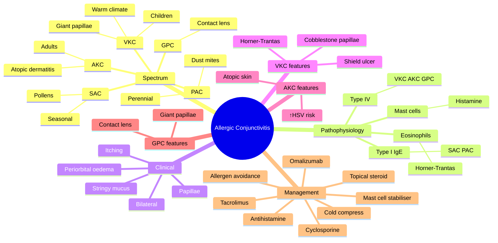

# Allergic Conjunctivitis

Related: [[Bacterial Conjunctivitis]], [[Viral Conjunctivitis]], [[Vernal Keratoconjunctivitis]]

> [!tip] **FCPS/MRCP Priority: HIGH**
> Most common allergic eye disease. Distinguished by severe itching, bilateral involvement, papillae, history of atopy.

---

## Learning Objectives

- [ ] Define allergic conjunctivitis and describe its spectrum (SAC, PAC, VKC, AKC, GPC)
- [ ] Explain the underlying Type I and Type IV hypersensitivity mechanisms
- [ ] Identify the cardinal clinical features (itching, papillae, bilateral, atopy)
- [ ] Differentiate allergic from viral and bacterial conjunctivitis
- [ ] Recognise VKC, AKC, and GPC and their complications (shield ulcer, Horner-Trantas dots)
- [ ] Apply a stepwise approach to management including mast cell stabilisers, antihistamines, steroids, and steroid-sparing agents

---

## 1. Definition

- **Allergic conjunctivitis:** Immunoglobulin E (IgE)–mediated inflammation of the conjunctiva due to airborne allergens
- Part of the spectrum of ocular allergy
- Most common ocular allergic disease

---

## 2. Classification (Chronic vs Acute)

|| Type | Acute / Seasonal / Perennial | Chronic / Severe |
|------|------------------------------|------------------|
| **Seasonal allergic (SAC)** | Pollens (spring/summer) | — |
| **Perennial allergic (PAC)** | Dust mites, animal dander, mould | — |
| **Vernal keratoconjunctivitis (VKC)** | — | Children, warm climate, spring/summer |
| **Atopic keratoconjunctivitis (AKC)** | — | Adults with atopic dermatitis |
| **Giant papillary conjunctivitis (GPC)** | — | Contact lens / ocular prosthesis |

---

## 3. Pathophysiology

- **Type I hypersensitivity** (IgE-mediated mast cell degranulation) — SAC, PAC
- **Type IV (cell-mediated)** predominant in VKC, AKC, GPC
- Histamine, tryptase, leukotrienes, prostaglandins released
- Mast cells, eosinophils infiltrate
- Cobblestone papillae (giant in VKC/GPC)
- Eosinophil aggregates at the limbus (Horner-Trantas dots)
- Chronic disease → conjunctival remodelling, giant papillae, shield ulcer

---

## 4. Clinical Features

### SAC / PAC
- **Intense itching** (cardinal symptom)
- Bilateral redness
- Watery / mucoid discharge
- Chemosis (acute)
- Conjunctival papillae (small, fine)
- Periorbital oedema (severe)

### VKC
- Children 5–15 y, boys > girls
- Spring/summer, warm climates
- Severe itching, photophobia, lacrimation
- **Giant cobblestone papillae** (upper tarsus)
- **Horner-Trantas dots** (limbal white dots = eosinophil aggregates)
- **Shield ulcer** (cornea)
- Stringy mucus

### AKC
- Adults with atopic dermatitis
- Year-round
- Periorbital skin involvement
- Risk of **herpes simplex keratitis** (10%)
- Risk of cataract, retinal detachment

### GPC
- Contact lens wear (esp. soft), prosthesis, sutures
- Giant papillae (upper tarsus)
- Itching, mucus, lens intolerance

---

## 5. Examination

- Visual acuity (normal or slightly ↓)
- **Itching** (key feature)
- Bilateral
- Papillae (small = allergic; giant cobblestone = VKC/GPC)
- **Follicles absent** (vs viral)
- Preauricular node **absent** (vs viral)
- Discharge: watery, stringy mucus (VKC)
- Cornea: clear (or shield ulcer in VKC, SPK in AKC)
- Skin: atopic dermatitis (AKC)

---

## 6. Investigations

- **Clinical diagnosis** (history + slit-lamp)
- Skin-prick testing / serum-specific IgE (allergen identification)
- Conjunctival cytology: eosinophils (in severe forms)
- Tear film: ↑ IgE, ↑ eosinophil cationic protein
- Co-existing atopy work-up (asthma, eczema, allergic rhinitis)

---

## 7. Differential Diagnosis

|| Condition | Distinguishing |
|-----------|---------------|
| **Viral conjunctivitis** | Watery discharge, follicles, preauricular node |
| **Bacterial conjunctivitis** | Purulent discharge, no itching, papillae |
| **Chlamydial (adult inclusion) conjunctivitis** | Chronic, follicles, genitourinary contact |
| **Dry eye (keratoconjunctivitis sicca)** | Gritty sensation, tear-film instability, postmenopausal women |
| **Blepharitis** | Lid margin disease, scales, rosacea |
| **Toxic / medicamentosa** | Drug-related, papillae, no itching as dominant feature |

---

## 8. Management

### General
- Avoid allergens
- Cold compresses
- Artificial tears (dilute allergens, wash away mediators)
- Stop contact lens (GPC)
- Cold compresses, lid hygiene

### Pharmacological
|| Step | Treatment |
|------|-----------|
| 1 | Topical antihistamine / mast cell stabiliser (olopatadine, ketotifen) — BD |
| 2 | Topical mast cell stabiliser alone (cromoglycate, nedocromil) — QDS |
| 3 | Topical antihistamine (alone) — temporary |
| 4 | Topical steroid (short course, for severe/VKC) |
| 5 | Topical cyclosporine / tacrolimus (for severe, steroid-sparing) |
| 6 | Oral antihistamine |

### Severe / VKC / AKC
- **Topical cyclosporine A 0.05–2%** (compounded)
- **Topical tacrolimus 0.03%**
- **Supratarsal steroid injection** (severe VKC)
- Consider **omalizumab** in refractory (systemic biologic)
- Shield ulcer: topical steroid + cycloplegia; protect with bandage contact lens

### Other
- Allergen-specific immunotherapy (selected cases)
- Treat co-existing atopy (asthma, eczema, rhinitis)

---

## 9. Complications

- **Shield ulcer** (VKC) — superior cornea
- Secondary **herpes simplex keratitis** (AKC) — 10%
- **Cataract** (anterior subcapsular, AKC)
- **Retinal detachment** (AKC, from chronic inflammation / atopic disease)
- **Symblepharon, giant papillae** (chronic disease)
- **Vision loss** (corneal scarring, ulceration)
- Secondary infection from topical steroid misuse

---

## 10. Red Flags / Emergencies

- **Shield ulcer** (corneal involvement in VKC)
- ↓ Visual acuity (corneal involvement, scarring)
- Suspected secondary herpes simplex keratitis
- Pain, photophobia (keratitis, not pure allergic)
- Unilateral disease (think alternate diagnosis)
- Use of topical steroid without ophthalmology review

---

## 11. FCPS/MRCP High-Yield Summary

|| Topic | Key Points |
|-------|------------|
| Cardinal symptom | Itching |
| Sign | Papillae (not follicles) |
| Bilateral | Yes |
| Discharge | Watery / stringy (VKC) |
| VKC | Children, giant papillae, Horner-Trantas, shield ulcer |
| AKC | Adults, atopic dermatitis, ↑herpes risk |
| GPC | Contact lens, prosthesis |
| Treatment | Antihistamine, mast cell stabiliser, steroid (short), cyclosporine |

---

## 12. Viva Questions

1. **Q:** What is the cardinal symptom of allergic conjunctivitis?
   **A:** Itching (intense).

2. **Q:** Differentiate VKC from SAC.
   **A:** VKC = children, seasonal, severe, giant papillae, shield ulcer, Horner-Trantas dots. SAC = any age, less severe, fine papillae.

3. **Q:** What is a Horner-Trantas dot?
   **A:** White-yellow dots at the limbus = aggregates of eosinophils in VKC/AKC.

4. **Q:** What is the first-line treatment for SAC?
   **A:** Topical antihistamine / mast cell stabiliser (e.g., olopatadine BD) + allergen avoidance.

5. **Q:** When is topical cyclosporine used?
   **A:** In severe VKC/AKC refractory to topical steroids, as a steroid-sparing agent.

---

## 13. Common Confusions / Exam Traps

|| Confusion | Clarification |
|-----------|---------------|
| "Allergic conjunctivitis = follicles" | Wrong — papillae are the hallmark. Follicles suggest viral/chlamydial. |
| "Itching = viral" | Opposite — itching is the hallmark of allergic; viral has foreign body sensation. |
| "VKC is the same as SAC" | VKC is severe, child, with giant papillae, Horner-Trantas, shield ulcer; SAC is mild. |
| "AKC = VKC" | AKC = adults, atopic dermatitis, year-round; VKC = children, seasonal, warm climate. |
| "GPC = infectious" | GPC is mechanical / immune response to contact lens or prosthesis, not infection. |
| "Allergy needs topical steroid" | Not first-line — start with antihistamine/mast cell stabiliser; steroid only for severe/refractory. |
| "Herpes simplex is a complication of AKC" | Yes — 10% of AKC patients develop HSV keratitis. Always suspect co-existing HSV. |
| "Shield ulcer is infectious" | Shield ulcer is sterile corneal epithelial defect in VKC. |
| "Papillae in upper tarsus = viral" | No — papillae in upper tarsus (cobblestone) = VKC / GPC. |

---

## 14. Mnemonics

1. **"Allergic = Itch, Papillae, Atopy"** — **I-P-A**: cardinal triad of allergic conjunctivitis.
2. **"VKC = Kids, Cobblestones, Climate"** — VKC in children, warm climate, cobblestone papillae.
3. **"AKC = Adults, Atopic dermatitis, All year"** — A-A-A: adults, atopic dermatitis, all-year chronicity.

---

## 15. Mind Map

---

## 16. One-Page Revision Card

|| **Topic** | **Allergic Conjunctivitis** |
|-----------|-----------------------------|
|| **Definition** | IgE-mediated inflammation of conjunctiva due to allergens |
|| **Cardinal Symptom** | Itching (intense) |
|| **Cardinal Sign** | Papillae (not follicles) |
|| **Bilateral** | Yes (vs unilateral in HSV) |
|| **Discharge** | Watery, mucoid; stringy mucus in VKC |
|| **SAC / PAC** | Mild; pollens, dust mites |
|| **VKC** | Children, warm climate, giant papillae, Horner-Trantas, shield ulcer |
|| **AKC** | Adults, atopic dermatitis, ↑herpes risk, cataract, RD |
|| **GPC** | Contact lens / prosthesis, giant papillae |
|| **Treatment** | Allergen avoidance → antihistamine → mast cell stabiliser → steroid → cyclosporine |
|| **Viva Pearl** | Itching + papillae + bilateral + atopy = allergic |

---

## Spaced Repetition Trackers

### 24-Hour Recall Prompts
- [ ] Identify the cardinal symptom and sign of allergic conjunctivitis
- [ ] List the spectrum of ocular allergy (SAC, PAC, VKC, AKC, GPC)
- [ ] Differentiate VKC from SAC
- [ ] State two complications of AKC
- [ ] Outline the stepwise management of allergic conjunctivitis

### Revision Schedule
- [ ] **Day 1** completed (creation + 24h recall)
- [ ] **Day 3** revision completed
- [ ] **Day 7** revision completed
- [ ] **Day 15** revision completed
- [ ] **Day 30** revision completed
- [ ] **Day 90** revision completed

---

## Must Know / Should Know / Nice to Know

### Must Know (Core for passing)
- [x] Definition and spectrum (SAC, PAC, VKC, AKC, GPC)
- [x] Cardinal symptom: itching; sign: papillae
- [x] Differentiate from viral and bacterial conjunctivitis
- [x] First-line treatment: antihistamine / mast cell stabiliser
- [x] VKC triad: children, cobblestone papillae, shield ulcer

### Should Know (High probability)
- [x] AKC association with atopic dermatitis, herpes simplex, cataract
- [x] GPC — contact lens-related
- [x] Horner-Trantas dots = limbal eosinophil aggregates
- [x] Topical steroid for severe disease (short course)
- [x] Cyclosporine / tacrolimus for steroid-sparing

### Nice to Know (Differentiator)
- [ ] Omalizumab in refractory disease
- [ ] Type IV hypersensitivity in VKC / AKC / GPC
- [ ] Allergen-specific immunotherapy
- [ ] Tear film IgE, eosinophil cationic protein

---

## My Weak Points
- [ ] Add personal weak areas here

---

## Self-Test Scorecard

|| Section | Score /5 |
|---------|----------|
|| Understanding: | /10 |
|| Recall: | /10 |
|| MCQ Performance: | /10 |
|| SBA Performance: | /10 |
|| Viva Confidence: | /10 |
|| Total: | /50 |

> [!tip] **Interpretation:** <35 = weak topic, 35-44 = acceptable but insecure, 45+ = strong exam-ready topic.

---

## Exam Answer Modes

### Long Answer Skeleton
1. Definition (IgE-mediated inflammation of conjunctiva)
2. Spectrum: SAC, PAC, VKC, AKC, GPC
3. Pathophysiology (Type I and Type IV hypersensitivity)
4. Cardinal features: itching, papillae, bilateral, history of atopy
5. Differentiate VKC, AKC, GPC
6. Investigations (clinical, allergen testing)
7. Management: avoidance → cold compress → antihistamine → mast cell stabiliser → steroid → cyclosporine
8. Complications: shield ulcer, herpes keratitis, cataract, RD

### Short Note Skeleton
- Definition + IgE-mediated
- Cardinal symptom: itching
- Cardinal sign: papillae (cobblestone in VKC)
- SAC vs VKC vs AKC
- First-line: antihistamine / mast cell stabiliser
- Severe: topical steroid → cyclosporine

### Viva One-Liners
- **Q:** Cardinal symptom? → **A:** Itching.
- **Q:** What is the sign? → **A:** Papillae (not follicles).
- **Q:** VKC triad? → **A:** Children, warm climate, cobblestone papillae + Horner-Trantas + shield ulcer.
- **Q:** AKC association? → **A:** Atopic dermatitis, ↑risk of herpes simplex keratitis.
- **Q:** GPC cause? → **A:** Contact lens, prosthesis, sutures.

### Ward-Case Discussion Points
- Differentiate allergic from viral and bacterial at the slit-lamp
- Identify VKC features (giant papillae, Horner-Trantas)
- Counsel on allergen avoidance, cold compress, lubricant use
- Identify complications (shield ulcer, HSV in AKC)
- Recognise steroid-sparing role of cyclosporine in severe VKC/AKC

### Last-Night-Before-Exam Sheet
- Top 3 facts: itching is cardinal, papillae (not follicles), bilateral
- 1 mnemonic: **"Allergic = Itch, Papillae, Atopy"** (I-P-A)
- Must-know differential: viral = follicles + preauricular node
- Must-know triad of VKC: child + cobblestone + shield ulcer

---

## Summary

Allergic conjunctivitis is the most common ocular allergy, characterised by itching, bilateral involvement, and papillae. SAC/PAC are mild; VKC (children), AKC (adults with atopy), and GPC (CL wearers) are severe forms requiring anti-inflammatory or immunomodulatory therapy. First-line treatment is allergen avoidance and topical antihistamine / mast cell stabiliser. Severe forms may need topical steroid and steroid-sparing agents (cyclosporine, tacrolimus). Complications include shield ulcer (VKC), secondary HSV keratitis (AKC), and cataract / retinal detachment (AKC).

## MCQs (10)

1. **Question:** The cardinal symptom of allergic conjunctivitis is:
   **Options:** A. Pain B. Itching C. Discharge D. Diplopia E. Photophobia
   **Answer:** B
   **Explanation:** Itching is the hallmark of allergic conjunctivitis (vs foreign body sensation in viral, pain in bacterial/keratitis).

2. **Question:** Giant cobblestone papillae are characteristic of:
   **Options:** A. SAC B. PAC C. VKC D. Bacterial E. Viral
   **Answer:** C
   **Explanation:** VKC classically shows giant cobblestone papillae on the upper tarsal conjunctiva.

3. **Question:** Horner-Trantas dots are:
   **Options:** A. Limbal eosinophil aggregates B. Corneal ulcers C. Retinal lesions D. Optic disc swelling E. Conjunctival follicles
   **Answer:** A
   **Explanation:** White-yellow dots at the limbus = aggregates of eosinophils, seen in VKC and AKC.

4. **Question:** Allergic conjunctivitis is mediated by which type of hypersensitivity (in SAC/PAC)?
   **Options:** A. Type I B. Type II C. Type III D. Type IV E. None
   **Answer:** A
   **Explanation:** SAC/PAC are Type I IgE-mediated. VKC/AKC/GPC have additional Type IV components.

5. **Question:** The first-line treatment for mild seasonal allergic conjunctivitis is:
   **Options:** A. Topical steroid B. Oral prednisolone C. Topical antihistamine / mast cell stabiliser D. Cyclosporine drops E. Patching
   **Answer:** C
   **Explanation:** First-line is topical dual-acting antihistamine/mast cell stabiliser (e.g., olopatadine) + allergen avoidance.

6. **Question:** Which of the following is a recognised complication of atopic keratoconjunctivitis?
   **Options:** A. Retinal detachment B. Herpes simplex keratitis C. Endophthalmitis D. Optic neuritis E. Macular oedema
   **Answer:** B
   **Explanation:** AKC is associated with 10% incidence of herpes simplex keratitis (and cataract, retinal detachment).

7. **Question:** Giant papillary conjunctivitis (GPC) is most commonly associated with:
   **Options:** A. Bacterial infection B. Contact lens wear C. Viral infection D. Allergy to pollen E. Trauma
   **Answer:** B
   **Explanation:** GPC is a chronic inflammatory response to contact lens (esp. soft) wear, ocular prosthesis, or sutures.

8. **Question:** A 6-year-old boy with severe itching, photophobia, stringy discharge, and giant upper tarsal papillae most likely has:
   **Options:** A. SAC B. VKC C. AKC D. GPC E. Pharyngoconjunctival fever
   **Answer:** B
   **Explanation:** VKC = children, seasonal, severe itching, cobblestone papillae, stringy mucus.

9. **Question:** Topical cyclosporine A is used in allergic conjunctivitis primarily as:
   **Options:** A. First-line treatment B. A steroid-sparing agent in severe disease C. An antibiotic D. A lubricant E. A vasoconstrictor
   **Answer:** B
   **Explanation:** Cyclosporine is used in severe VKC/AKC as a steroid-sparing immunomodulator.

10. **Question:** Shield ulcer is a complication of:
    **Options:** A. SAC B. VKC C. AKC D. GPC E. PAC
    **Answer:** B
    **Explanation:** Shield ulcer is a sterile epithelial defect of the superior cornea in severe VKC.

## SBA Questions (10)

1. **Scenario:** A 7-year-old boy in spring presents with severe itching, photophobia, stringy mucus, giant upper tarsal papillae, and white dots at the limbus.
   **Question:** Most likely diagnosis?
   **Options:** A. SAC B. VKC C. AKC D. GPC E. Bacterial conjunctivitis
   **Answer:** B
   **Explanation:** Child + spring/warm climate + giant papillae + Horner-Trantas = VKC.

2. **Scenario:** A 25-year-old with atopic dermatitis presents with bilateral red eyes, itching, periorbital skin thickening, and mild discharge. He uses topical steroid intermittently.
   **Question:** What is the most likely diagnosis?
   **Options:** A. SAC B. VKC C. AKC D. GPC E. Pharyngoconjunctival fever
   **Answer:** C
   **Explanation:** Adult + atopic dermatitis + year-round chronic symptoms = AKC.

3. **Scenario:** A 22-year-old soft contact lens wearer presents with bilateral itching, mucus discharge, and giant papillae on the upper tarsus. He denies pain or photophobia.
   **Question:** Most likely diagnosis?
   **Options:** A. SAC B. VKC C. AKC D. GPC E. Bacterial
   **Answer:** D
   **Explanation:** Soft contact lens + giant papillae + itching = GPC.

4. **Scenario:** A 30-year-old with severe VKC has persistent symptoms despite a short course of topical steroid. The ophthalmologist wants a steroid-sparing agent.
   **Question:** Which is the most appropriate next step?
   **Options:** A. Long-term high-dose topical steroid B. Topical cyclosporine A C. Oral aciclovir D. Topical antibiotic E. Patching
   **Answer:** B
   **Explanation:** Topical cyclosporine A is a steroid-sparing immunomodulator used in severe VKC/AKC.

5. **Scenario:** A 28-year-old with AKC develops a painful red eye with a dendritic ulcer on fluorescein staining.
   **Question:** Most appropriate next step?
   **Options:** A. Increase topical steroid B. Topical and oral aciclovir C. Stop all drops D. Topical cyclosporine only E. Patching
   **Answer:** B
   **Explanation:** Suspected herpes simplex keratitis — treat with topical and oral aciclovir. Always consider co-existing HSV in AKC.

6. **Scenario:** A 10-year-old boy with VKC develops a corneal epithelial defect on the superior cornea. The lesion is sterile.
   **Question:** What is the most likely diagnosis of the corneal lesion?
   **Options:** A. Bacterial keratitis B. Herpes simplex keratitis C. Shield ulcer D. Marginal keratitis E. Filamentary keratitis
   **Answer:** C
   **Explanation:** Superior sterile corneal epithelial defect in VKC = shield ulcer.

7. **Scenario:** A 24-year-old with PAC asks about allergen avoidance and first-line treatment.
   **Question:** Which is the most appropriate first-line management?
   **Options:** A. Topical steroid for 4 weeks B. Oral prednisolone C. Allergen avoidance + topical olopatadine BD D. Topical cyclosporine E. Topical antibiotic
   **Answer:** C
   **Explanation:** Allergen avoidance + topical antihistamine / mast cell stabiliser (e.g., olopatadine BD).

8. **Scenario:** A 35-year-old with AKC has bilateral red eyes with a paper-thin corneal ulcer on the superior cornea. Visual acuity is reduced.
   **Question:** In addition to topical steroid and cycloplegia, what is the most appropriate adjunct?
   **Options:** A. Bandage contact lens B. Topical antibiotic only C. Stop all medications D. Evisceration E. Topical atropine only
   **Answer:** A
   **Explanation:** Shield ulcer management includes topical steroid, cycloplegia, and bandage contact lens to protect the cornea and aid healing.

9. **Scenario:** A 30-year-old with severe refractory AKC remains symptomatic despite topical steroid, cyclosporine, and oral antihistamine.
   **Question:** Which systemic biologic agent may be considered?
   **Options:** A. Infliximab B. Omalizumab C. Rituximab D. Etanercept E. Adalimumab
   **Answer:** B
   **Explanation:** Omalizumab (anti-IgE monoclonal antibody) has been used successfully in severe refractory AKC.

10. **Scenario:** A patient presents with intense itching, redness, and stringy white mucus. There are fine papillae on the tarsal conjunctiva and seasonal occurrence.
    **Question:** Most likely diagnosis?
    **Options:** A. VKC B. AKC C. SAC D. GPC E. Bacterial conjunctivitis
    **Answer:** C
    **Explanation:** Intense itching + fine papillae + seasonal occurrence = SAC. (VKC has giant papillae, AKC is year-round in adults with atopy.)

## Flashcards

- **Q:** What is the cardinal symptom of allergic conjunctivitis?
  **A:** Itching (intense, the hallmark feature).
- **Q:** What is the cardinal sign on slit-lamp?
  **A:** Papillae (small fine papillae in SAC/PAC; giant cobblestone in VKC/GPC).
- **Q:** What are Horner-Trantas dots?
  **A:** White-yellow limbal dots composed of eosinophil aggregates, seen in VKC and AKC.
- **Q:** What is shield ulcer?
  **A:** A sterile superior corneal epithelial defect seen in severe VKC.
- **Q:** What is the first-line treatment for SAC/PAC?
  **A:** Allergen avoidance + topical dual-acting antihistamine / mast cell stabiliser (e.g., olopatadine BD).

## Answer Key with Explanations

### MCQs
1. B — Itching is the cardinal symptom of allergic conjunctivitis
2. C — VKC is associated with giant cobblestone papillae
3. A — Horner-Trantas dots = limbal eosinophil aggregates
4. A — SAC/PAC are Type I IgE-mediated hypersensitivity reactions
5. C — Topical antihistamine / mast cell stabiliser is first-line
6. B — AKC has 10% risk of herpes simplex keratitis
7. B — GPC is associated with soft contact lens wear
8. B — VKC is the diagnosis in a child with giant papillae and stringy mucus
9. B — Cyclosporine is a steroid-sparing agent in severe VKC/AKC
10. B — Shield ulcer is a complication of VKC

### SBAs
1. B — Child + giant papillae + Horner-Trantas = VKC
2. C — Adult + atopic dermatitis + chronic = AKC
3. D — Soft contact lens + giant papillae = GPC
4. B — Cyclosporine as steroid-sparing agent in severe VKC
5. B — Suspected HSV keratitis in AKC — aciclovir treatment
6. C — Superior sterile corneal defect in VKC = shield ulcer
7. C — Allergen avoidance + topical olopatadine is first-line
8. A — Shield ulcer management: steroid + cycloplegia + bandage contact lens
9. B — Omalizumab in refractory AKC
10. C — Intense itching + fine papillae + seasonal = SAC

## Tags
#medicine #davidson #ophthalmology #allergic-conjunctivitis #VKC #fcps #mrcp
