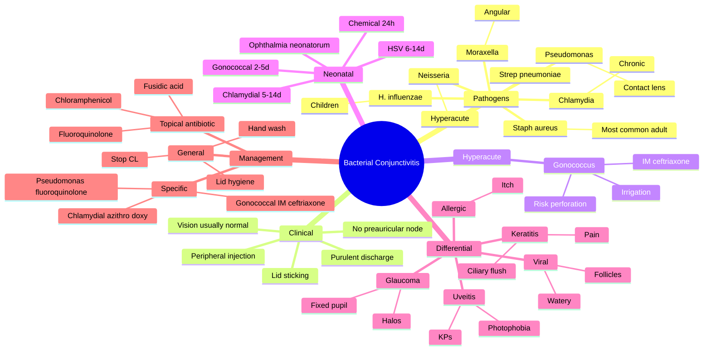

# Bacterial Conjunctivitis

Related: [[Viral Conjunctivitis]], [[Allergic Conjunctivitis]], [[Trachoma]]

> [!tip] **FCPS/MRCP Priority: CRITICAL**
> Most common cause of red, sticky eye. Distinguish from viral, allergic, and serious causes (keratitis, uveitis, acute glaucoma). Treat with topical antibiotics.

---

## Learning Objectives
- [ ] Define bacterial conjunctivitis and list common pathogens
- [ ] Recognise acute, hyperacute, chronic and neonatal presentations
- [ ] Differentiate from viral, allergic, keratitis, uveitis and acute glaucoma
- [ ] Identify sight-threatening features (gonococcal, Pseudomonas in CL wearers)
- [ ] Apply appropriate empirical and organism-specific treatment
- [ ] Counsel on hygiene, contact lens cessation and follow-up

---

## 1. Definition

- **Bacterial conjunctivitis:** Acute inflammation of the conjunctiva due to bacterial infection
- Usually self-limiting, often bilateral (one eye first, then the other)

---

## 2. Pathogens

| Organism | Notes |
|----------|-------|
| **Staph aureus** | Most common in adults |
| **Strep pneumoniae** | Common, can be hyperacute |
| **H. influenzae** | Common in children |
| **Moraxella** | Angular blepharoconjunctivitis, alcoholics, debilitated |
| **Pseudomonas** | Contact lens wearers (severe) |
| **Neisseria gonorrhoeae** | Hyperacute, severe, profuse purulent discharge — emergency |
| **Chlamydia** | Adult inclusion conjunctivitis, trachoma |
| **Strep viridans** | Less common |

---

## 3. Clinical Features

- **Redness** (conjunctival injection, peripheral, not perilimbal)
- **Purulent discharge** (yellow/green, lid sticking in morning)
- **Grittiness, irritation** (not severe pain)
- **Vision** usually normal (mild blur due to discharge)
- Preauricular lymph node usually absent (unlike viral)

### Special Forms

#### Hyperacute (Gonococcal)
- Severe, profuse, purulent discharge
- Rapid onset, marked chemosis
- **Risk of corneal perforation** — emergency
- Treat: IM ceftriaxone + topical + saline irrigation

#### Chronic Bacterial
- Staph aureus, Moraxella
- Angular, lid margin involvement
- Persists >4 weeks

#### Ophthalmia Neonatorum
- Within first month of life
- Causes by timing: chemical (24h), gonococcal (2–5d), chlamydial (5–14d), HSV (6–14d)
- Treatment depends on cause

---

## 4. Examination

- **Visual acuity** (normal or slightly ↓)
- **Pupils** (normal)
- **Slit-lamp:**
  - Conjunctival injection (peripheral, not ciliary)
  - Discharge (purulent, mucopurulent)
  - Papillae (small bumps, hyperacute)
  - Follicles (less common in bacterial)
  - **Cornea clear** (key feature — if corneal involvement, consider keratitis)
- Preauricular lymph node usually absent

---

## 5. Differential Diagnosis

| Condition | Distinguishing |
|-----------|---------------|
| Viral conjunctivitis | Watery discharge, follicles, preauricular node |
| Allergic | Itching, bilateral, history of atopy |
| Keratitis | Pain, ↓VA, corneal lesion, ciliary flush |
| Acute uveitis | Pain, photophobia, ↓VA, KPs |
| Acute angle-closure | Severe pain, halos, fixed pupil, ↑IOP |
| Scleritis | Severe boring pain, globe tenderness |
| Dacryocystitis | Medial canthal swelling |

---

## 6. Management

### Empirical
- **Topical antibiotic:** Chloramphenicol, fusidic acid, polymyxin-trimethoprim, fluoroquinolone (moxifloxacin, ofloxacin)
- 4×/day × 5–7 days
- Fucithalmic (fusidic acid) BD — preferred for compliance

### Specific
- **Gonococcal:** IM ceftriaxone 1g single dose + topical + irrigation
- **Chlamydial:** Oral azithromycin 1g single dose OR doxycycline 100 mg BD × 7 days
- **Pseudomonas (CL wearer):** Fluoroquinolone, hourly initially

### General
- Lid hygiene
- Cool compresses
- Avoid contact lenses until resolved
- Hand hygiene (prevent spread)

---

## 7. FCPS/MRCP High-Yield Summary

| Topic | Key Points |
|-------|------------|
| Common organism (adult) | Staph aureus |
| Common organism (children) | H. influenzae, Strep pneumoniae |
| Discharge | Purulent |
| Vision | Usually normal |
| Ciliary flush | Absent (vs keratitis/uveitis) |
| Hyperacute | Gonococcus — emergency |
| Treatment | Topical AB (chloramphenicol, fusidic) |

---

## 8. Viva Questions

1. **Q:** How do you differentiate bacterial from viral conjunctivitis?
   **A:** Bacterial = purulent discharge, no preauricular node. Viral = watery, follicles, preauricular node, often with URTI.

2. **Q:** What is the most important cause of hyperacute conjunctivitis?
   **A:** Gonococcal (Neisseria gonorrhoeae) — emergency due to corneal perforation risk.

3. **Q:** When do you suspect chlamydial conjunctivitis in an adult?
   **A:** Chronic, follicular conjunctivitis, sexually active, treatment-resistant.

---

## 9. Common Confusions / Exam Traps

| Confusion | Clarification |
|-----------|---------------|
| "Red eye = conjunctivitis" | Many causes — must exclude keratitis, uveitis, acute glaucoma, scleritis |
| "Bacterial = purulent; viral = watery" | Useful but not absolute — chlamydial is follicular (viral-like), gonococcal is hyperacute |
| "Topical steroid for red eye" | NEVER start topical steroid without slit-lamp exam — can blind in HSV keratitis |
| "Hyperacute = severe bacterial" | Hyperacute = gonococcus until proven otherwise — emergency systemic treatment |
| "Allergic conjunctivitis needs antibiotics" | Allergic is non-infective — treat with antihistamines / mast cell stabilisers |
| "Contact lens wearer with red eye is fine on lubricants" | Pseudomonas risk — stop CL, urgent fluoroquinolone, watch for corneal involvement |
| "Ophthalmia neonatorum is always bacterial" | Can be chemical, gonococcal, chlamydial or HSV — timing guides cause |

---

## 10. Mnemonics

1. **"Staph Strep H. flu — Most common bacterial cause"** — S**S**H = Staph/Strep/Haemophilus.
2. **"Hyperacute = Hospitalise — Gonococcus"** — Profuse pus, rapid onset, perforation risk.
3. **"Bacterial = puruBact, no node"** — purulent discharge, no preauricular node.
4. **"Ophthalmia Neonatorum timing — ChemGCSHV"** — **Ch**emical 24h, **G**onococcal 2–5d, **C**hlamydial 5–14d, **H**SV 6–14d.

---

## 11. Mind Map

---

## 12. One-Page Revision Card

| **Topic** | **Bacterial Conjunctivitis** |
|-----------|------------------------------|
| **Definition** | Acute bacterial infection of the conjunctiva |
| **Most common adult organism** | Staph aureus |
| **Most common child organism** | H. influenzae, Strep pneumoniae |
| **Discharge** | Purulent (yellow/green), lid sticking |
| **Preauricular node** | Usually absent (vs viral) |
| **Vision** | Usually normal |
| **Hyperacute** | Gonococcus — emergency, IM ceftriaxone |
| **Contact lens** | Pseudomonas risk — urgent fluoroquinolone |
| **Neonatal** | Ophthalmia neonatorum — chemical/gonococcal/chlamydial/HSV |
| **First-line topical** | Chloramphenicol, fusidic acid, polymyxin-trimethoprim |
| **Viva pearl** | Never start topical steroid without slit-lamp exam |

---

## 13. Spaced Repetition Trackers

### 24-Hour Recall Prompts
- [ ] State the most common bacterial cause in adults and children
- [ ] List features differentiating bacterial from viral conjunctivitis
- [ ] Identify the emergency red eye — hyperacute gonococcal
- [ ] Outline empirical and specific antibiotic treatment
- [ ] State timing of ophthalmia neonatorum causes

### Revision Schedule
- [ ] **Day 1** completed (creation + 24h recall)
- [ ] **Day 3** revision completed
- [ ] **Day 7** revision completed
- [ ] **Day 15** revision completed
- [ ] **Day 30** revision completed
- [ ] **Day 90** revision completed

---

## 14. Must Know / Should Know / Nice to Know

### Must Know (Core for passing)
- [x] Most common organism in adults (Staph aureus)
- [x] Most common in children (H. influenzae)
- [x] Purulent discharge, no preauricular node
- [x] Hyperacute gonococcal — emergency
- [x] First-line topical antibiotics

### Should Know (High probability)
- [x] Pseudomonas in contact lens wearers
- [x] Chlamydial — chronic, follicular, treatment-resistant
- [x] Differential — viral, allergic, keratitis, uveitis, acute glaucoma
- [x] Avoid topical steroid in undiagnosed red eye
- [x] Hygiene and contact lens advice

### Nice to Know (Differentiator)
- [ ] Ophthalmia neonatorum timing and causes
- [ ] Moraxella — angular blepharoconjunctivitis
- [ ] Adult inclusion conjunctivitis (serotypes D–K)
- [ ] Fluoroquinolone monotherapy for Pseudomonas

---

## 15. My Weak Points
- [ ] Add personal weak areas here

---

## 16. Self-Test Scorecard

| Section | Score /5 |
|---------|----------|
| Understanding: | /10 |
| Recall: | /10 |
| MCQ Performance: | /10 |
| SBA Performance: | /10 |
| Viva Confidence: | /10 |
| Total: | /50 |

> [!tip] **Interpretation:** <35 = weak topic, 35-44 = acceptable but insecure, 45+ = strong exam-ready topic.

---

## 17. Exam Answer Modes

### Long Answer Skeleton
1. Definition — acute bacterial infection of the conjunctiva
2. Pathogens — Staph (adults), H. influenzae (children), Pneumococcus, Moraxella
3. Special forms — hyperacute (gonococcal), chronic, contact-lens (Pseudomonas), neonatal
4. Clinical features — purulent discharge, lid sticking, no preauricular node, vision usually normal
5. Examination — peripheral injection, no ciliary flush, cornea clear
6. Differential — viral (watery, follicles, node), allergic (itch), keratitis/uveitis/glaucoma (pain, ↓VA)
7. Management:
   - Empirical: chloramphenicol, fusidic acid, fluoroquinolone 5–7 days
   - Gonococcal: IM ceftriaxone + topical + irrigation
   - Chlamydial: azithromycin / doxycycline
   - Pseudomonas: hourly fluoroquinolone
8. Prevention — hand hygiene, contact lens hygiene, school exclusion (24h after treatment)

### Short Note Skeleton
- Common organisms and clinical features
- Distinguish from viral and allergic
- First-line topical antibiotics

### Viva One-Liners
- **Q:** Most common organism in adult bacterial conjunctivitis? → **A:** Staph aureus.
- **Q:** Hyperacute purulent conjunctivitis — what is it and how to treat? → **A:** Gonococcal — IM ceftriaxone 1 g single dose + topical + irrigation; risk of corneal perforation.
- **Q:** Bacterial vs viral? → **A:** Bacterial = purulent, no preauricular node. Viral = watery, follicles, preauricular node, URTI.
- **Q:** Why avoid topical steroid in undiagnosed red eye? → **A:** Risk of worsening HSV keratitis — exam must exclude herpes.
- **Q:** Red eye in a contact lens wearer? → **A:** Stop CL, urgent review for Pseudomonas — hourly fluoroquinolone if corneal involvement.

### Ward-Case Discussion Points
- Take a careful history — duration, discharge type, contact lens, sexual history
- Visual acuity, pupils, slit-lamp examination
- Differentiate from keratitis, uveitis, acute angle-closure
- Sample for culture in severe, neonatal, hyperacute, recurrent or treatment-resistant cases
- Prescribe appropriate topical / systemic antibiotic
- Counsel on hygiene, contact lens cessation, school/work exclusion

### Last-Night-Before-Exam Sheet
- **Top 3 facts:** Staph aureus = most common adult, gonococcal = hyperacute emergency, never start topical steroid without slit-lamp
- **1 mnemonic:** "Hyperacute = Hospitalise — Gonococcus"
- **Must-know differential:** Red eye ≠ conjunctivitis; rule out keratitis, uveitis, glaucoma

---

## Summary
Bacterial conjunctivitis is common and self-limiting. Staph aureus is the most common pathogen. Distinguish from viral (watery, preauricular node), allergic (itching, bilateral), and serious causes (keratitis, uveitis, acute glaucoma). Treat with topical antibiotic; hyperacute gonococcal requires systemic ceftriaxone.

---

## MCQs (10)

1. **Question:** Most common bacterial cause of acute conjunctivitis in adults is:
   **Options:** A. Staph aureus B. Strep pneumoniae C. H. influenzae D. Pseudomonas E. Neisseria gonorrhoeae
   **Answer:** A
   **Explanation:** Staph aureus is the most common adult pathogen.

2. **Question:** Hyperacute purulent conjunctivitis with preauricular lymphadenopathy suggests:
   **Options:** A. Staph aureus B. Strep pneumoniae C. Neisseria gonorrhoeae D. H. influenzae E. Moraxella
   **Answer:** C
   **Explanation:** Hyperacute purulent conjunctivitis = gonococcal — emergency.

3. **Question:** Treatment of choice for hyperacute gonococcal conjunctivitis is:
   **Options:** A. Topical antibiotic only B. Oral ciprofloxacin alone C. IM ceftriaxone + topical + irrigation D. Oral doxycycline E. Observation
   **Answer:** C
   **Explanation:** Systemic ceftriaxone + topical + saline irrigation is required due to risk of corneal perforation.

4. **Question:** A 4-year-old with sticky red eye, no preauricular node, mucopurulent discharge — most likely cause is:
   **Options:** A. Adenovirus B. Staph aureus C. Chlamydia D. Allergic E. Gonococcal
   **Answer:** B
   **Explanation:** Staph aureus is the most common cause in children too, though H. influenzae is also common.

5. **Question:** Which feature is NOT typical of bacterial conjunctivitis?
   **Options:** A. Purulent discharge B. Preauricular lymphadenopathy C. Lid sticking in the morning D. Gritty sensation E. Conjunctival injection
   **Answer:** B
   **Explanation:** Preauricular lymphadenopathy is typical of viral, not bacterial, conjunctivitis.

6. **Question:** A contact lens wearer with red eye, pain, and a small corneal ulcer is most likely to be infected with:
   **Options:** A. Staph aureus B. Strep pneumoniae C. Pseudomonas D. Moraxella E. Neisseria
   **Answer:** C
   **Explanation:** Pseudomonas aeruginosa is the most feared pathogen in contact lens wearers and can rapidly cause corneal perforation.

7. **Question:** Topical antibiotic commonly used as first-line empirical treatment for bacterial conjunctivitis in the UK is:
   **Options:** A. Chloramphenicol B. Ofloxacin C. Moxifloxacin D. Gentamicin E. Tobramycin
   **Answer:** A
   **Explanation:** Chloramphenicol is the most commonly used first-line topical antibiotic.

8. **Question:** Adult inclusion conjunctivitis is caused by:
   **Options:** A. Chlamydia trachomatis D–K B. Adenovirus C. Staph aureus D. Herpes simplex E. Moraxella
   **Answer:** A
   **Explanation:** Chlamydia trachomatis serotypes D–K cause adult inclusion conjunctivitis.

9. **Question:** A neonate presents 7 days after birth with mucopurulent eye discharge. The most likely cause is:
   **Options:** A. Chemical conjunctivitis B. Gonococcal conjunctivitis C. Chlamydial conjunctivitis D. HSV E. Staph aureus
   **Answer:** C
   **Explanation:** Chlamydial ophthalmia neonatorum typically presents 5–14 days after birth.

10. **Question:** Which of the following is a contraindication to topical corticosteroid use in a red eye?
    **Options:** A. Bacterial conjunctivitis B. Viral conjunctivitis C. Allergic conjunctivitis D. Suspected herpetic keratitis E. Dacryocystitis
    **Answer:** D
    **Explanation:** Topical corticosteroids are contraindicated in suspected HSV keratitis — they worsen epithelial disease.

## SBA Questions (10)

1. **Scenario:** A 25-year-old contact lens wearer has severe red eye, profuse purulent discharge, and a hypopyon.
   **Question:** Most likely organism?
   **Options:** A. Staph aureus B. Strep pneumoniae C. Pseudomonas D. Neisseria E. H. influenzae
   **Answer:** C
   **Explanation:** CL wearers at risk of Pseudomonas — severe, hypopyon, risk of perforation.

2. **Scenario:** A 30-year-old presents with sudden severe redness, profuse purulent discharge, lid swelling, and preauricular node developing 12 hours after onset.
   **Question:** Most likely diagnosis?
   **Options:** A. Staph aureus conjunctivitis B. Hyperacute gonococcal conjunctivitis C. Viral conjunctivitis D. Allergic conjunctivitis E. Keratitis
   **Answer:** B
   **Explanation:** Hyperacute, profuse pus, rapid onset = gonococcal — emergency.

3. **Scenario:** A 6-year-old with bilateral purulent discharge, gritty eyes, no preauricular node, mild conjunctival injection.
   **Question:** Best first-line topical antibiotic?
   **Options:** A. Chloramphenicol B. IM ceftriaxone C. Oral aciclovir D. Topical steroid E. Oral doxycycline
   **Answer:** A
   **Explanation:** Empirical topical chloramphenicol first-line for simple bacterial conjunctivitis.

4. **Scenario:** A 22-year-old sexually active adult has 6 weeks of follicular conjunctivitis unresponsive to topical antibiotics.
   **Question:** Most appropriate management?
   **Options:** A. Continue topical antibiotic B. Oral azithromycin 1 g single dose C. Topical steroid D. Topical antifungal E. Topical anaesthetic
   **Answer:** B
   **Explanation:** Adult inclusion (chlamydial) conjunctivitis — oral azithromycin or doxycycline.

5. **Scenario:** A neonate develops copious purulent discharge from both eyes on day 3 of life with marked lid swelling.
   **Question:** Most likely organism?
   **Options:** A. Staph aureus B. Chlamydia C. Neisseria gonorrhoeae D. HSV E. Chemical
   **Answer:** C
   **Explanation:** Gonococcal ophthalmia neonatorum typically presents at 2–5 days.

6. **Scenario:** A 40-year-old presents with a 3-day history of red eye, mucopurulent discharge, and vision 6/9. Examination shows peripheral conjunctival injection, no ciliary flush, no corneal lesion.
   **Question:** Most appropriate next step?
   **Options:** A. Topical steroid B. Topical antibiotic C. Acyclovir D. Topical anaesthetic E. Cyclodiode laser
   **Answer:** B
   **Explanation:** Simple bacterial conjunctivitis — empirical topical antibiotic.

7. **Scenario:** A 50-year-old with red eye and pain has ciliary flush, a corneal epithelial defect, and a hypopyon.
   **Question:** Most likely diagnosis?
   **Options:** A. Bacterial conjunctivitis B. Viral conjunctivitis C. Microbial keratitis D. Allergic conjunctivitis E. Pingueculitis
   **Answer:** C
   **Explanation:** Pain, ciliary flush, hypopyon, corneal lesion = microbial keratitis, not simple conjunctivitis.

8. **Scenario:** A 20-year-old presents with bilateral itching, watery discharge, conjunctival chemosis, and a history of hay fever.
   **Question:** Most appropriate treatment?
   **Options:** A. Topical chloramphenicol B. Topical antihistamine / mast cell stabiliser C. Topical steroid (high dose) D. IM ceftriaxone E. Oral doxycycline
   **Answer:** B
   **Explanation:** Allergic conjunctivitis — treat with topical antihistamine / mast cell stabiliser.

9. **Scenario:** A 35-year-old has severe pain, photophobia, decreased vision, fixed mid-dilated pupil, and haloes around lights.
   **Question:** Most likely diagnosis?
   **Options:** A. Acute conjunctivitis B. Acute angle-closure glaucoma C. Viral conjunctivitis D. Allergic conjunctivitis E. Pingueculitis
   **Answer:** B
   **Explanation:** Pain, haloes, fixed mid-dilated pupil, decreased vision = acute angle-closure glaucoma — emergency.

10. **Scenario:** A patient with bacterial conjunctivitis on topical chloramphenicol has not improved after 5 days. Examination now shows a marginal corneal infiltrate.
    **Question:** Most appropriate management?
    **Options:** A. Continue chloramphenicol B. Stop all treatment C. Switch to a fluoroquinolone and review urgently for keratitis D. Add topical steroid E. Topical anaesthetic
    **Answer:** C
    **Explanation:** Worsening with corneal involvement = suspect keratitis — switch to fluoroquinolone, urgent ophthalmology review.

## Flashcards

- **Q:** Most common bacterial organism in adult conjunctivitis?
  **A:** Staph aureus.
- **Q:** Most common bacterial organism in children?
  **A:** H. influenzae and Strep pneumoniae.
- **Q:** What does hyperacute purulent conjunctivitis suggest?
  **A:** Neisseria gonorrhoeae — emergency, IM ceftriaxone, risk of corneal perforation.
- **Q:** What organism is most feared in contact lens wearers with red eye?
  **A:** Pseudomonas aeruginosa — risk of corneal perforation, treat with fluoroquinolone.
- **Q:** What is the timing of ophthalmia neonatorum causes?
  **A:** Chemical 24h, Gonococcal 2–5d, Chlamydial 5–14d, HSV 6–14d.

## Answer Key with Explanations

### MCQs
1. A — Staph aureus is the most common adult pathogen
2. C — Hyperacute purulent = gonococcal
3. C — IM ceftriaxone + topical + irrigation for gonococcal
4. B — Staph aureus is the most common cause in children
5. B — Preauricular node = viral, not bacterial
6. C — CL wearer with ulcer = Pseudomonas
7. A — Chloramphenicol is first-line in UK
8. A — Adult inclusion conjunctivitis = Chlamydia D–K
9. C — Chlamydial ophthalmia neonatorum presents 5–14d
10. D — Topical steroid contraindicated in suspected HSV keratitis

### SBAs
1. C — Pseudomonas in CL wearers
2. B — Hyperacute gonococcal conjunctivitis
3. A — Chloramphenicol first-line
4. B — Oral azithromycin for chlamydial conjunctivitis
5. C — Gonococcal at 2–5 days
6. B — Topical antibiotic for simple bacterial conjunctivitis
7. C — Ciliary flush + hypopyon + corneal lesion = microbial keratitis
8. B — Allergic conjunctivitis — antihistamine
9. B — Fixed mid-dilated pupil + haloes = acute angle-closure glaucoma
10. C — Worsening with corneal involvement = keratitis, switch to fluoroquinolone

## Tags
#medicine #davidson #ophthalmology #conjunctivitis #bacterial #fcps #mrcp

## PasTest Scenario SBAs (Clinical Vignettes)

> **Auto-generated PasTest/Mediscope-style scenario SBAs** grounded in the authored source. Each scenario tests a real clinical fact (triad, specific sign, contraindication, trial, first-line Rx) extracted from the topic. *Source: Ch 28: Medical Ophthalmology — Bacterial Conjunctivitis*

**Q1.** What is the most appropriate first-line therapy for Bacterial Conjunctivitis?

  - **A.** Topical antibiotic:
  - **B.** An advanced/surgical therapy reserved for refractory disease
  - **C.** Symptomatic treatment only, no disease-modifying therapy
  - **D.** Empiric broad-spectrum therapy without specific indication

  > **Answer: A** — Topical antibiotic:
  >
  > *Source:* **Topical antibiotic:** Chloramphenicol, fusidic acid, polymyxin-trimethoprim, fluoroquinolone (moxifloxacin, ofloxacin)

