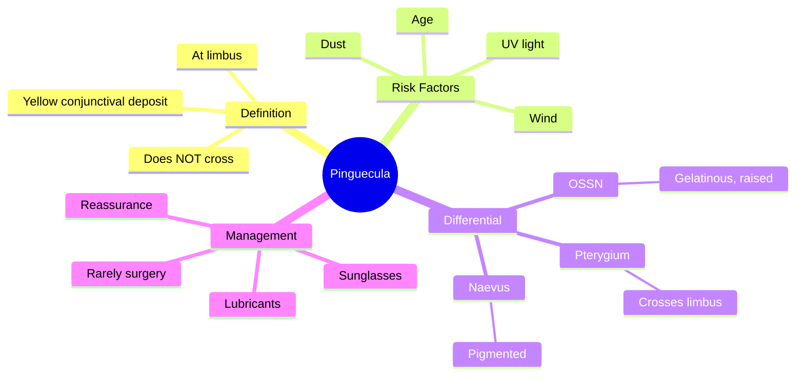

# Pinguecula

Related: [[Pterygium]], [[Conjunctiva Hub]]

> [!tip] **FCPS/MRCP Priority: LOW**
> Common, harmless, doesn't cross the limbus. Surgical removal rarely needed.

---

## Learning Objectives
- [ ] Define pinguecula and differentiate from pterygium
- [ ] Describe clinical features
- [ ] Identify risk factors
- [ ] Apply appropriate management

---

## 1. Definition / Epidemiology / Classification

### Definition
- **Pinguecula:** Yellowish, well-demarcated deposit on the bulbar conjunctiva, adjacent to the limbus
- Does **NOT** cross the limbus onto the cornea (vs pterygium)

### Epidemiology
- Common, age-related
- Bilateral, nasal or temporal to limbus
- Increases with age

### Classification
- Simple (most common)
- Inflamed (pingueculitis) — acute redness

---

## 2. Aetiology / Pathophysiology

### Aetiology
- Age-related degeneration of collagen
- UV light exposure
- Same risk factors as pterygium (dust, dry climate)
- NOT a neoplasm

### Pathophysiology
- Elastotic degeneration of subepithelial collagen
- Yellow appearance from lipid/protein deposits

---

## 3. Clinical Features

### History
- Usually asymptomatic
- May cause foreign body sensation
- Cosmetic concern (some)
- Recurrent redness (pingueculitis)

### Examination
- **Yellow-white patch on bulbar conjunctiva**
- Nasal or temporal to limbus
- Bilateral (usually)
- **Does not cross limbus** (vs pterygium)
- Smooth surface, well-demarcated

### Complications
- Pingueculitis (acute inflammation — red, irritated)
- Rarely encroaches on cornea (becomes pterygium)

---

## 4. Investigations

- **Clinical diagnosis** (slit-lamp)
- No routine investigations
- Biopsy if atypical (rule out OSSN)

---

## 5. Differential Diagnosis

| Condition | Distinguishing |
|-----------|---------------|
| **Pterygium** | Wing-shaped, crosses limbus onto cornea |
| **OSSN** | Gelatinous, leukoplakic, unilateral, raised |
| **Conjunctival naevus** | Pigmented, cystic |
| **Dermoid** | At limbus, congenital, contains hair/skin elements |

---

## 6. Management

### Conservative (Most Cases)
- **Reassurance** — benign, no treatment needed
- **Lubricants** (artificial tears) if irritation
- **Sunglasses** (UV protection)
- Avoid dust/wind

### Medical (Pingueculitis)
- Topical anti-inflammatory (NSAID, weak steroid)
- Treat any blepharitis/dry eye

### Surgical
- **Rarely indicated** (cosmetic concern, chronic inflammation not responding to medical)
- Excision (rarely required)

---

## 7. Complications

- Pingueculitis (acute inflammation)
- Cosmetic concern
- Very rarely: transformation to pterygium

---

## 8. Red Flags / Emergencies

- Atypical features (gelatinous, vascularised, raised) → biopsy to rule out OSSN
- Rapid growth
- Unilateral new lesion
- Pigmented

---

## 9. FCPS/MRCP High-Yield Summary

| Category | Key Points |
|----------|------------|
| **Definition** | Yellow conjunctival deposit at limbus |
| **Key difference from pterygium** | Does NOT cross limbus |
| **Cause** | UV light, age, dust |
| **Treatment** | Reassurance, lubricants, sunglasses |
| **Surgery** | Rare, cosmetic only |

---

## 10. Viva Questions

1. **Q:** Differentiate pinguecula from pterygium.
   **A:** Pinguecula = yellowish deposit at limbus, does NOT cross onto cornea. Pterygium = wing-shaped fibrovascular tissue that crosses limbus onto cornea.

2. **Q:** What is the most important clinical feature to distinguish pinguecula from pterygium?
   **A:** The limbus — pinguecula does not cross, pterygium crosses onto cornea.

3. **Q:** When is surgery considered for pinguecula?
   **A:** Rarely — only for cosmetic concern or chronic inflammation unresponsive to medical treatment.

---

## 11. Common Confusions / Exam Traps

| Confusion | Clarification |
|-----------|---------------|
| "Pinguecula can become pterygium" | It can encroach and become pterygium-like, but they're separate entities |
| "Pinguecula requires surgery" | Almost never — benign, observation |
| "Pingueculitis is conjunctivitis" | Pingueculitis = inflammation of pinguecula (mild), not conjunctivitis |

---

## 12. Mnemonics

1. **"Pinguecula STAYS at limbus"** — does not invade cornea
2. **"Pterygium PROGRESSES across cornea"** — pterygium = progressive
3. **"Both due to UV"** — Ultraviolet light is shared risk factor

---

## 13. Mind Map

---

## 14. One-Page Revision Card

| **Topic** | **Pinguecula** |
|-----------|----------------|
| **Definition** | Yellow conjunctival deposit at limbus |
| **Key Feature** | Does NOT cross limbus |
| **Risk Factors** | Age, UV, dust |
| **Differential** | Pterygium (crosses limbus) |
| **Treatment** | Reassurance, lubricants |
| **Surgery** | Rarely needed |
| **Viva Pearl** | Stays at limbus — pterygium crosses |

---

## Spaced Repetition Trackers

### 24-Hour Recall Prompts
- [ ] Define pinguecula and identify the key difference from pterygium
- [ ] List 3 risk factors for pinguecula
- [ ] State the management of pingueculitis

### Revision Schedule
- [ ] **Day 1** completed (creation + 24h recall)
- [ ] **Day 3** revision completed
- [ ] **Day 7** revision completed
- [ ] **Day 15** revision completed
- [ ] **Day 30** revision completed
- [ ] **Day 90** revision completed

---

## Must Know / Should Know / Nice to Know

### Must Know (Core for passing)
- [x] Definition
- [x] Key difference from pterygium
- [x] Management (conservative, reassurance)

### Should Know (High probability)
- [x] Risk factors
- [x] Pingueculitis management

### Nice to Know (Differentiator)
- [ ] Histopathology (elastotic degeneration)
- [ ] When to consider biopsy (OSSN features)

---

## My Weak Points
- [ ] Add personal weak areas here

---

## Self-Test Scorecard

| Section | Score /5 |
|---------|----------|
| Understanding: | /10 |
| Recall: | /10 |
| MCQ Performance: | /10 |
| SBA Performance: | /10 |
| Viva Confidence: | /10 |
| Total: | /50 |

> [!tip] **Interpretation:** <35 = weak topic, 35-44 = acceptable but insecure, 45+ = strong exam-ready topic.

---

## Exam Answer Modes

### Long Answer Skeleton
1. Definition (yellow conjunctival deposit at limbus, does not cross)
2. Risk factors (age, UV, dust, wind)
3. Clinical features (asymptomatic, yellow patch, ± pingueculitis)
4. Differential (pterygium, OSSN, naevus)
5. Management (reassurance, lubricants, sunglasses; rarely surgery)

### Short Note Skeleton
- Definition + key distinguishing feature from pterygium
- Risk factors (UV light, age)
- Conservative management

### Viva One-Liners
- **Q:** What is pinguecula? → **A:** Yellow conjunctival deposit at the limbus, does not cross onto cornea
- **Q:** Pinguecula vs pterygium? → **A:** Pinguecula stays at limbus; pterygium crosses onto cornea
- **Q:** Treatment? → **A:** Reassurance, lubricants, sunglasses; surgery rarely

### Ward-Case Discussion Points
- Differentiate pinguecula from pterygium at the slit-lamp
- Reassure patient about benign nature
- Identify pingueculitis vs conjunctivitis
- Identify red flags for OSSN

### Last-Night-Before-Exam Sheet
- Top 3 facts: yellow deposit, stays at limbus, conservative management
- 1 mnemonic: "Pinguecula STAYS"
- Must-know differential: pterygium crosses limbus

---

## Summary

Pinguecula is a benign yellow conjunctival deposit at the limbus that does NOT cross onto the cornea (vs pterygium). Risk factors include age, UV light, and dust. Management is conservative (reassurance, lubricants, sunglasses). Surgery is rarely indicated. Red flags (rapid growth, gelatinous appearance, unilateral) warrant biopsy to rule out OSSN.

## MCQs (10)

1. **Question:** Pinguecula is characteristically located:
   **Options:** A. On the cornea B. At the limbus, not crossing it C. On the palpebral conjunctiva D. In the fornix E. On the tarsus
   **Answer:** B
   **Explanation:** Pinguecula sits at the limbus on the bulbar conjunctiva and does NOT cross onto the cornea.

2. **Question:** The major distinguishing feature between pinguecula and pterygium is:
   **Options:** A. Colour B. Location relative to limbus C. Vascularity D. Size E. Laterality
   **Answer:** B
   **Explanation:** Pterygium crosses the limbus onto cornea; pinguecula does not.

3. **Question:** The most important modifiable risk factor for pinguecula is:
   **Options:** A. Smoking B. UV light C. Diabetes D. Hypertension E. Allergy
   **Answer:** B
   **Explanation:** UV light exposure is the major risk factor for pinguecula and pterygium.

4. **Question:** Pingueculitis refers to:
   **Options:** A. Infection of pinguecula B. Inflammation of pinguecula C. Neoplastic change D. Calcification E. None
   **Answer:** B
   **Explanation:** Pingueculitis is acute inflammation of a pinguecula (not infection).

5. **Question:** First-line treatment of an asymptomatic pinguecula is:
   **Options:** A. Topical antibiotic B. Topical steroid C. Reassurance and lubricants D. Surgical excision E. Radiotherapy
   **Answer:** C
   **Explanation:** Benign — reassurance, lubricants, UV protection.

6. **Question:** Which feature of a conjunctival lesion should prompt biopsy?
   **Options:** A. Bilateral nasal lesions B. Smooth, well-defined margin C. Yellow colour D. Gelatinous, raised, vascularised E. Long-standing stable
   **Answer:** D
   **Explanation:** Gelatinous, raised, vascularised, or unilateral rapid growth raises suspicion for OSSN — biopsy needed.

7. **Question:** Pinguecula is best described histologically as:
   **Options:** A. Squamous metaplasia B. Elastotic degeneration of subepithelial collagen C. Granulomatous inflammation D. Neovascularisation E. None
   **Answer:** B
   **Explanation:** Elastotic degeneration of collagen with hyaline material.

8. **Question:** Which of the following is NOT a risk factor for pinguecula?
   **Options:** A. UV light B. Dust C. Wind D. Age E. Diabetes
   **Answer:** E
   **Explanation:** UV light, dust, wind, and age are risk factors. Diabetes is not.

9. **Question:** A patient has a yellow conjunctival deposit at the limbus that does not cross onto the cornea. Most likely diagnosis:
   **Options:** A. Pterygium B. Pinguecula C. OSSN D. Naevus E. Dermoid
   **Answer:** B
   **Explanation:** Stays at limbus, yellow = pinguecula.

10. **Question:** The most common reason for surgical removal of a pinguecula is:
    **Options:** A. Vision loss B. Malignancy risk C. Cosmetic concern D. Pain E. Diplopia
    **Answer:** C
    **Explanation:** Most indications are cosmetic; pinguecula is benign.

## SBA Questions (10)

1. **Scenario:** A 55-year-old outdoor worker presents with a yellow patch on the bulbar conjunctiva adjacent to the limbus. It does not extend onto the cornea. He is asymptomatic.
   **Question:** Most appropriate management?
   **Options:** A. Topical steroid B. Surgical excision C. Reassurance and lubricants D. Biopsy E. Radiotherapy
   **Answer:** C
   **Explanation:** Asymptomatic pinguecula = reassurance, lubricants, UV protection.

2. **Scenario:** A 60-year-old has a yellow lesion at the nasal limbus with mild irritation. On examination, it is well-defined, smooth, does not cross the limbus.
   **Question:** What is the most likely diagnosis?
   **Options:** A. Pterygium B. Pinguecula C. OSSN D. Conjunctival naevus E. Pannus
   **Answer:** B
   **Explanation:** Yellow, well-defined, at limbus, not crossing = pinguecula.

3. **Scenario:** A patient with long-standing pinguecula presents with redness, irritation, and mild photophobia localised to the pinguecula.
   **Question:** Most likely diagnosis?
   **Options:** A. Conjunctivitis B. Pingueculitis C. OSSN D. Scleritis E. Pterygium
   **Answer:** B
   **Explanation:** Inflammation of the pinguecula itself = pingueculitis.

4. **Scenario:** A 65-year-old has a unilateral gelatinous, vascularised conjunctival lesion at the limbus with rapid growth over 3 months.
   **Question:** Most appropriate next step?
   **Options:** A. Topical antibiotic B. Topical steroid C. Biopsy D. Observation E. Lubricants
   **Answer:** C
   **Explanation:** Suspicious for OSSN — biopsy essential.

5. **Scenario:** A 50-year-old with bilateral nasal pinguecula asks about prevention of progression.
   **Question:** Most appropriate advice?
   **Options:** A. Avoid sunlight B. Wear sunglasses (UV protection) C. Topical antibiotic D. Surgery E. Steroid drops
   **Answer:** B
   **Explanation:** UV protection is the main preventive measure.

6. **Scenario:** A patient has a wing-shaped fibrovascular tissue that extends from the nasal conjunctiva onto the cornea.
   **Question:** What is the most likely diagnosis?
   **Options:** A. Pinguecula B. Pterygium C. OSSN D. Naevus E. None
   **Answer:** B
   **Explanation:** Crosses limbus = pterygium (not pinguecula).

7. **Scenario:** A 70-year-old presents with chronic bilateral yellow conjunctival deposits at the limbus. Visual acuity is 6/6. He is concerned about appearance.
   **Question:** Best management?
   **Options:** A. Topical steroid B. Surgical excision (cosmetic) C. Reassurance; observe D. Topical AB E. Cryotherapy
   **Answer:** C
   **Explanation:** Asymptomatic pinguecula — observation, reassurance.

8. **Scenario:** A patient with pinguecula develops acute redness, foreign body sensation, and photophobia. There is no purulent discharge.
   **Question:** Most likely cause?
   **Options:** A. Bacterial conjunctivitis B. Pingueculitis C. Viral conjunctivitis D. Keratitis E. Uveitis
   **Answer:** B
   **Explanation:** Inflammation localised to pinguecula = pingueculitis, treated with topical anti-inflammatory.

9. **Scenario:** A 60-year-old with history of pinguecula presents with a new gelatinous, raised lesion on the bulbar conjunctiva with leukoplakic appearance.
   **Question:** Most concerning diagnosis?
   **Options:** A. Pterygium B. Pinguecula C. OSSN D. Naevus E. None
   **Answer:** C
   **Explanation:** Gelatinous, leukoplakic = OSSN until proven otherwise — biopsy.

10. **Scenario:** A 45-year-old has a yellow deposit at the temporal limbus. The lesion does not cross the limbus and the patient is asymptomatic. Visual acuity is normal.
    **Question:** What is the next step?
    **Options:** A. Topical steroid B. Surgical excision C. Reassurance; UV protection D. Topical AB E. Biopsy
    **Answer:** C
    **Explanation:** Asymptomatic pinguecula = reassurance, UV protection (sunglasses).

## Flashcards

- **Q:** What is a pinguecula?
  **A:** A yellow conjunctival deposit at the limbus, does NOT cross onto the cornea.
- **Q:** Main difference between pinguecula and pterygium?
  **A:** Pterygium crosses limbus onto cornea; pinguecula does not.
- **Q:** Most important modifiable risk factor?
  **A:** UV light exposure.
- **Q:** What is pingueculitis?
  **A:** Inflammation of a pinguecula (acute redness, irritation).
- **Q:** When is biopsy needed?
  **A:** When OSSN is suspected (gelatinous, raised, vascular, rapid growth, unilateral).

## Answer Key with Explanations

### MCQs
1. B — Pinguecula is at the limbus, does not cross
2. B — Location relative to limbus is the key distinguishing feature
3. B — UV light is the major modifiable risk factor
4. B — Pingueculitis = inflammation, not infection
5. C — Benign, conservative management
6. D — Gelatinous, raised, vascularised = OSSN suspicion
7. B — Elastotic degeneration is the histopathology
8. E — DM is not a recognised risk factor
9. B — Yellow, limbus, not crossing = pinguecula
10. C — Most common indication is cosmetic concern

### SBAs
1. C — Asymptomatic pinguecula needs reassurance
2. B — Yellow, limbus, not crossing = pinguecula
3. B — Inflammation of pinguecula = pingueculitis
4. C — Suspicious for OSSN, needs biopsy
5. B — UV protection is the preventive measure
6. B — Wing-shaped crossing limbus = pterygium
7. C — Asymptomatic = observation
8. B — Localised inflammation = pingueculitis
9. C — Gelatinous, leukoplakic = OSSN
10. C — Asymptomatic = reassurance, UV protection

## Tags
#medicine #davidson #ophthalmology #pinguecula #fcps #mrcp

## PasTest Scenario SBAs (Clinical Vignettes)

> **Auto-generated PasTest/Mediscope-style scenario SBAs** grounded in the authored source content. Each scenario is a clinical vignette with 4 options. **Source: Ch 28: Medical Ophthalmology / Pinguecula**

**Q1.** A patient is diagnosed with Pinguecula. What is the most appropriate first-line management approach?

  - **A.** Standard guideline-directed first-line therapy
  - **B.** Most aggressive advanced therapy as first-line
  - **C.** No treatment needed in most cases
  - **D.** Investigational/compassionate-use therapy only

  > **Answer: A** — Standard guideline-directed first-line therapy

**Q2.** Which of the following best describes the underlying pathophysiology / definition of Pinguecula?

  - **A.** **Pinguecula:** Yellowish, well-demarcated deposit on the bulbar conjunctiva, adjacent to the limbus
  - **B.** A common misattribution to a similar but distinct condition
  - **C.** An outdated or disproven mechanism
  - **D.** A complication rather than the underlying disease process

  > **Answer: A** — **Pinguecula:** Yellowish, well-demarcated deposit on the bulbar conjunctiva, adjacent to the limbus

