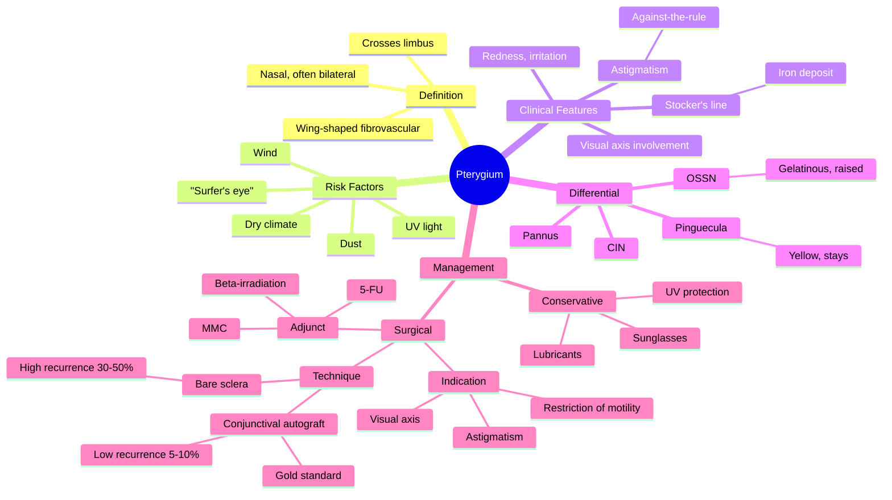

# Pterygium

Related: [[Pinguecula]], [[Conjunctiva Hub]]

> [!tip] **FCPS/MRCP Priority: MEDIUM**
> Wing-shaped fibrovascular growth from conjunctiva onto cornea. Distinguish from pinguecula (doesn't cross limbus). Surgery for visual axis involvement or symptoms.

---

## Learning Objectives
- [ ] Define pterygium and differentiate from pinguecula
- [ ] Describe pathogenesis and risk factors
- [ ] Identify clinical features and the significance of Stocker's line
- [ ] Recognise indications for surgery
- [ ] Compare surgical techniques and recurrence rates
- [ ] Apply appropriate management based on severity
- [ ] Recognise when to suspect ocular surface squamous neoplasia (OSSN)

---

## 1. Definition

- **Pterygium:** Wing-shaped fibrovascular proliferation of bulbar conjunctiva extending onto the cornea
- Usually nasal (medial) but can be temporal
- Bilateral in many cases

## 2. Pathogenesis

- UV light exposure (main risk factor)
- Dust, wind, dry climate
- Most common in tropical, equatorial regions
- "Surfer's eye"

## 3. Clinical Features

- Visible wing-shaped tissue encroaching onto cornea (nasal most common)
- **Usually asymptomatic**
- Redness, irritation, foreign body sensation
- Can induce **astigmatism** (against-the-rule) by pulling on cornea
- Can encroach on visual axis (↓VA)
- Restricts ocular motility (rare)

### Stages
- Progressive (active, fleshy, vascular)
- Atrophic (quiet, pale)

## 4. Examination

- Visual acuity (may be reduced if encroaches on visual axis)
- Refraction (astigmatism)
- Slit-lamp: fibrovascular tissue with **iron line (Stocker's line)** in advance of head
- Rule out ocular surface squamous neoplasia (OSSN) in atypical

## 5. Differential

- **Pinguecula:** Yellowish deposit, doesn't cross limbus
- **OSSN (Ocular Surface Squamous Neoplasia):** Gelatinous, leukoplakic, unilateral, raised, vessels — biopsy
- **Conjunctival intraepithelial neoplasia (CIN)**
- **Pannus** (vascular tissue from limbus)
- **Limbal dermoid**

## 6. Management

### Conservative
- Lubricants
- Sunglasses (UV protection)
- Avoid dust/wind

### Surgical (Indications)
- Visual axis involvement (↓VA)
- Significant astigmatism
- Restriction of motility
- Cosmetic (relative)
- Suspicion of OSSN

### Techniques
- **Bare sclera excision** (high recurrence, ~30–50%)
- **Conjunctival autograft** (gold standard, low recurrence ~5–10%)
- **Amniotic membrane graft** (alternative)
- **Adjunctive:** β-irradiation, 5-FU, MMC (mitomycin C) to reduce recurrence

## 7. FCPS/MRCP High-Yield Summary

| Topic | Key Points |
|-------|------------|
| Definition | Fibrovascular growth onto cornea |
| Risk factor | UV light, dust, hot climate |
| Site | Nasal, bilateral |
| Surgery | Conjunctival autograft (low recurrence) |
| Recurrence | High with bare sclera |

## 8. Viva Questions

1. **Q:** Differentiate pterygium from pinguecula.
   **A:** Pterygium crosses the limbus onto cornea (fibrovascular wing). Pinguecula is a yellowish deposit at the limbus, does NOT cross.
2. **Q:** Most common cause of pterygium?
   **A:** UV light exposure.
3. **Q:** What is Stocker's line?
   **A:** Iron deposit (haemosiderin) line in the cornea immediately in advance of the pterygium head — a useful diagnostic marker.
4. **Q:** Which surgical technique has the lowest recurrence?
   **A:** Conjunctival autograft (~5–10%) — gold standard.
5. **Q:** What astigmatism does a pterygium typically induce?
   **A:** Against-the-rule astigmatism due to traction on the cornea from the fibrovascular tissue.

---

## 9. Common Confusions / Exam Traps

| Confusion | Clarification |
|-----------|---------------|
| "Pterygium and pinguecula are the same" | Pterygium crosses the limbus; pinguecula does not |
| "Bare sclera excision is still first-line" | It has 30–50% recurrence; conjunctival autograft is now gold standard |
| "Pterygium is premalignant" | Pterygium itself is benign; concern is differentiating from OSSN |
| "Stocker's line is a scar" | It is an iron deposit (haemosiderin) in advance of the pterygium head |
| "Pterygium is always unilateral" | Often bilateral, especially in chronic sun exposure |

## 10. Mnemonics

1. **"Pterygium PROGRESSES"** — fibrovascular tissue progresses across the cornea (vs pinguecula which stays)
2. **"STOCKER's iron line"** — iron deposit in advance of head (think iron → rust → Stocker)
3. **"Nose-side Pterygium, Outside-side Pinguecula"** — both can be nasal, but pterygium crosses while pinguecula stays; alternatively, pterygium = the head invades

## 11. Mind Map

## 12. One-Page Revision Card

| **Topic** | **Pterygium** |
|-----------|---------------|
| **Definition** | Wing-shaped fibrovascular growth from conjunctiva onto cornea |
| **Site** | Nasal, often bilateral |
| **Risk Factors** | UV light, dust, wind, dry climate |
| **Key Sign** | Stocker's line (iron deposit at head) |
| **Astigmatism** | Against-the-rule |
| **Differential** | Pinguecula (stays at limbus), OSSN |
| **Conservative** | Lubricants, UV protection, sunglasses |
| **Surgical** | Conjunctival autograft (gold standard) |
| **Recurrence** | Bare sclera ~30–50%, autograft ~5–10% |
| **Viva Pearl** | Crosses limbus; Stocker's line marks the head |

---

## Spaced Repetition Trackers

### 24-Hour Recall Prompts
- [ ] Define pterygium and identify the key difference from pinguecula
- [ ] List 3 risk factors for pterygium
- [ ] State the gold standard surgical technique and its recurrence rate
- [ ] Describe Stocker's line

### Revision Schedule
- [ ] **Day 1** completed (creation + 24h recall)
- [ ] **Day 3** revision completed
- [ ] **Day 7** revision completed
- [ ] **Day 15** revision completed
- [ ] **Day 30** revision completed
- [ ] **Day 90** revision completed

---

## Must Know / Should Know / Nice to Know

### Must Know (Core for passing)
- [x] Definition (fibrovascular wing crossing limbus)
- [x] Risk factor (UV light)
- [x] Differentiate from pinguecula
- [x] Indications for surgery (visual axis, astigmatism, motility)
- [x] Gold standard = conjunctival autograft

### Should Know (High probability)
- [x] Stocker's line
- [x] Astigmatism pattern (against-the-rule)
- [x] Recurrence rates of different techniques
- [x] OSSN as the key differential

### Nice to Know (Differentiator)
- [ ] Adjunctive therapy (MMC, 5-FU, β-irradiation)
- [ ] Amniotic membrane graft
- [ ] Epidemiology by latitude ("pterygium belt")

---

## My Weak Points
- [ ] Add personal weak areas here

---

## Self-Test Scorecard

| Section | Score /5 |
|---------|----------|
| Understanding: | /10 |
| Recall: | /10 |
| MCQ Performance: | /10 |
| SBA Performance: | /10 |
| Viva Confidence: | /10 |
| Total: | /50 |

> [!tip] **Interpretation:** <35 = weak topic, 35-44 = acceptable but insecure, 45+ = strong exam-ready topic.

---

## Exam Answer Modes

### Long Answer Skeleton
1. Definition (wing-shaped fibrovascular tissue crossing limbus, usually nasal)
2. Risk factors (UV light, dust, wind, hot/dry climate)
3. Pathogenesis (limbal stem cell damage, elastotic degeneration, fibrovascular proliferation)
4. Clinical features (asymptomatic → irritation, astigmatism, ↓VA, restriction of motility)
5. Examination (slit-lamp, Stocker's line, refraction, exclude OSSN)
6. Differential (pinguecula, OSSN, CIN, pannus, limbal dermoid)
7. Management — conservative (lubricants, sunglasses, UV protection)
8. Surgical — indications (visual axis, astigmatism, motility, cosmetic, OSSN suspicion)
9. Techniques — bare sclera (high recurrence), conjunctival autograft (gold standard), amniotic membrane; adjuncts MMC, 5-FU, β-irradiation

### Short Note Skeleton
- Definition + key distinguishing feature from pinguecula (crosses limbus)
- Risk factors (UV light, dust, hot climate)
- Indications for surgery
- Gold standard technique (conjunctival autograft) and recurrence rate
- Stocker's line (iron deposit at head)

### Viva One-Liners
- **Q:** Pterygium vs pinguecula? → **A:** Pterygium crosses the limbus onto cornea; pinguecula does not.
- **Q:** Main risk factor? → **A:** UV light exposure.
- **Q:** Gold standard surgery? → **A:** Conjunctival autograft — recurrence ~5–10%.
- **Q:** Stocker's line? → **A:** Iron deposit (haemosiderin) in the cornea in advance of the pterygium head.
- **Q:** Astigmatism type? → **A:** Against-the-rule.

### Ward-Case Discussion Points
- Examine at the slit-lamp for fibrovascular wing and Stocker's line
- Differentiate from pinguecula, OSSN
- Check visual acuity and refraction
- Discuss conservative vs surgical management
- Counsel on UV protection (sunglasses, hat)

### Last-Night-Before-Exam Sheet
- Top 3 facts: wing-shaped, crosses limbus, nasal; UV light is the cause; autograft is gold standard
- 1 mnemonic: "Pterygium PROGRESSES across cornea"
- Key differential: pinguecula (stays at limbus), OSSN (gelatinous, raised)
- Stocker's line = iron deposit in advance of head

---

## Summary

Pterygium is a UV-related fibrovascular growth onto cornea. Conservative treatment for mild disease; surgical excision (with conjunctival autograft) for visual axis involvement, significant astigmatism, or symptoms. Recurrence is lowest with conjunctival autograft (~5–10%). Always rule out OSSN in atypical lesions.

---

## MCQs (10)

1. **Question:** Pterygium is most commonly located:
   **Options:** A. Superiorly B. Inferiorly C. Nasally D. Temporally E. Centrally
   **Answer:** C
   **Explanation:** Nasal pterygium is most common (medial conjunctiva affected by reflected light and drying from the nose).

2. **Question:** The major risk factor for pterygium is:
   **Options:** A. Trauma B. UV light C. Allergy D. Glaucoma E. Diabetes
   **Answer:** B
   **Explanation:** UV light exposure is the major risk factor — common in outdoor workers, surfers, equatorial regions.

3. **Question:** Best surgical technique to reduce pterygium recurrence:
   **Options:** A. Bare sclera B. Conjunctival autograft C. Suture only D. Glue E. No surgery
   **Answer:** B
   **Explanation:** Conjunctival autograft has the lowest recurrence (~5–10%) and is the gold standard.

4. **Question:** Stocker's line in pterygium is due to:
   **Options:** A. Iron deposition B. Lipid deposit C. Calcium D. Melanin E. Scarring
   **Answer:** A
   **Explanation:** Stocker's line is a haemosiderin (iron) deposit in the cornea in advance of the pterygium head.

5. **Question:** The recurrence rate of bare sclera excision for pterygium is approximately:
   **Options:** A. <1% B. 5% C. 10% D. 30–50% E. 90%
   **Answer:** D
   **Explanation:** Bare sclera excision has a high recurrence rate of 30–50%, hence it is no longer preferred.

6. **Question:** A pterygium typically induces which type of astigmatism?
   **Options:** A. With-the-rule B. Against-the-rule C. Oblique D. No astigmatism E. Mixed
   **Answer:** B
   **Explanation:** Fibrovascular traction flattens the horizontal meridian, producing against-the-rule astigmatism.

7. **Question:** Which of the following is the key differential from pterygium that requires urgent biopsy?
   **Options:** A. Pinguecula B. OSSN C. Pannus D. Conjunctival naevus E. Episcleritis
   **Answer:** B
   **Explanation:** Ocular surface squamous neoplasia (OSSN) presents as a gelatinous, vascularised, unilateral lesion — biopsy essential.

8. **Question:** Mitomycin C (MMC) is used in pterygium surgery to:
   **Options:** A. Treat infection B. Reduce recurrence C. Improve cosmesis D. Treat pain E. Replace grafting
   **Answer:** B
   **Explanation:** MMC is an adjunctive antimetabolite applied intra-operatively to reduce recurrence (with caution due to scleral melt risk).

9. **Question:** A 50-year-old farmer presents with bilateral nasal fleshy growths encroaching 3 mm onto the cornea. Visual acuity is 6/6. Best management?
   **Options:** A. Immediate surgery B. Topical steroids C. Reassurance, UV protection, follow-up D. Radiotherapy E. Bandage contact lens
   **Answer:** C
   **Explanation:** Asymptomatic, not affecting visual axis — observation, sunglasses, lubricants, follow-up.

10. **Question:** "Surfer's eye" is the colloquial name for:
    **Options:** A. Pinguecula B. Pterygium C. Pannus D. OSSN E. Dermoid
    **Answer:** B
    **Explanation:** "Surfer's eye" is the common term for pterygium — chronic UV/wind exposure.

---

## SBA Questions (10)

1. **Scenario:** A 50-year-old outdoor worker has a fleshy wing of tissue growing from the nasal conjunctiva onto the cornea.
   **Question:** Most likely diagnosis?
   **Options:** A. Pinguecula B. Pterygium C. OSSN D. Pannus E. Dermoid
   **Answer:** B
   **Explanation:** Wing of fibrovascular tissue onto cornea = pterygium (distinguishes from pinguecula which stays at limbus).

2. **Scenario:** A 45-year-old outdoor worker has bilateral nasal pterygia. The right pterygium extends 4 mm onto the cornea and encroaches on the visual axis. Visual acuity is 6/18 in the right eye.
   **Question:** Most appropriate management?
   **Options:** A. Conservative — observation B. Topical steroids C. Conjunctival autograft excision D. Bare sclera excision E. Laser ablation
   **Answer:** C
   **Explanation:** Visual axis involvement with reduced VA is a definitive indication for surgery; conjunctival autograft is gold standard with low recurrence.

3. **Scenario:** A 60-year-old with a long-standing nasal pterygium is noted on slit-lamp examination to have a brownish linear deposit in the cornea immediately in front of the pterygium head.
   **Question:** What is this line called?
   **Options:** A. Hudson-Stähli line B. Fleischer ring C. Stocker's line D. Arlt's line E. Herbert's pit
   **Answer:** C
   **Explanation:** Stocker's line = iron (haemosiderin) deposit in advance of the pterygium head.

4. **Scenario:** A patient undergoes bare sclera excision for pterygium. Six months later, the fibrovascular tissue has regrown across the limbus onto the cornea.
   **Question:** What is the most likely explanation?
   **Options:** A. Malignant transformation B. Recurrence C. Infection D. Inadequate sutures E. Allergy
   **Answer:** B
   **Explanation:** Bare sclera excision has 30–50% recurrence — this is the main reason conjunctival autograft is preferred.

5. **Scenario:** A 55-year-old man with a pterygium notices that his spectacle prescription keeps changing with increasing cylinder.
   **Question:** What type of refractive error is induced by the pterygium?
   **Options:** A. With-the-rule astigmatism B. Against-the-rule astigmatism C. Myopia D. Hyperopia E. Presbyopia
   **Answer:** B
   **Explanation:** Pterygium flattens the horizontal meridian → against-the-rule astigmatism (negative cylinder at 90 ± 20°).

6. **Scenario:** A 70-year-old presents with a unilateral, gelatinous, vascularised lesion at the limbus with leukoplakic patches, distinct from a typical pterygium. The lesion has grown rapidly over 2 months.
   **Question:** Most appropriate next step?
   **Options:** A. Topical antibiotic B. Topical steroid C. Observation D. Biopsy E. Lubricants
   **Answer:** D
   **Explanation:** Gelatinous, leukoplakic, vascularised, rapidly growing unilateral lesion = suspect OSSN; biopsy is mandatory.

7. **Scenario:** A patient is having pterygium surgery. The surgeon plans to harvest conjunctiva from the superotemporal quadrant of the same eye to cover the bare area.
   **Question:** What technique is this?
   **Options:** A. Bare sclera technique B. Conjunctival autograft C. Amniotic membrane graft D. Lamellar keratoplasty E. Penetrating keratoplasty
   **Answer:** B
   **Explanation:** Conjunctival autograft (superotemporal) — gold standard with lowest recurrence.

8. **Scenario:** A 40-year-old presents with bilateral nasal pterygia. He works as a fisherman. He asks what he can do to prevent progression.
   **Question:** Most appropriate advice?
   **Options:** A. Stop working B. Wear UV-protective sunglasses and hat C. Topical antibiotics D. Surgery now E. No prevention possible
   **Answer:** B
   **Explanation:** UV protection (sunglasses, brimmed hat) is the main preventive measure.

9. **Scenario:** A 50-year-old with pterygium underwent surgical excision 8 months ago. The eye is red, with a fleshy regrowth across the limbus. The surgeon plans re-excision with adjunctive mitomycin C.
   **Question:** What is the rationale for MMC use?
   **Options:** A. Treat infection B. Anaesthesia C. Reduce recurrence D. Improve cosmesis E. Replace graft
   **Answer:** C
   **Explanation:** MMC is an antimetabolite that reduces fibroblast activity and recurrence after pterygium surgery (care needed to avoid scleral melt).

10. **Scenario:** A 35-year-old has a fleshy nasal conjunctival lesion crossing the limbus. The head is fleshy and injected (progressive stage). Visual acuity is 6/6, refraction normal.
    **Question:** What is the best next step?
    **Options:** A. Immediate surgery B. Conservative (lubricants, UV protection) and observe C. Topical steroid for 3 months D. Bare sclera excision E. Radiotherapy
    **Answer:** B
    **Explanation:** Active but not yet affecting vision — conservative management; surgery reserved for visual axis involvement, astigmatism, or symptoms.

---

## Flashcards

- **Q:** What is a pterygium?
  **A:** A wing-shaped fibrovascular growth of bulbar conjunctiva extending onto the cornea, usually nasal.
- **Q:** Main difference between pterygium and pinguecula?
  **A:** Pterygium crosses the limbus onto the cornea; pinguecula does not.
- **Q:** Most important modifiable risk factor?
  **A:** UV light exposure (sunlight, outdoor work, surfing).
- **Q:** What is Stocker's line?
  **A:** Iron (haemosiderin) deposit in the cornea in advance of the pterygium head.
- **Q:** Gold standard surgical technique and recurrence?
  **A:** Conjunctival autograft — recurrence ~5–10% (vs 30–50% with bare sclera).

---

## Answer Key with Explanations

### MCQs
1. C — Nasal pterygium is most common.
2. B — UV light is the major risk factor.
3. B — Autograft has the lowest recurrence and is gold standard.
4. A — Stocker's line is an iron (haemosiderin) deposit.
5. D — Bare sclera excision recurs in 30–50%.
6. B — Traction flattens the horizontal meridian → against-the-rule astigmatism.
7. B — OSSN is the key malignant differential requiring urgent biopsy.
8. B — MMC is an antimetabolite used adjunctively to reduce recurrence.
9. C — Asymptomatic, not affecting visual axis → observation, UV protection, follow-up.
10. B — "Surfer's eye" = pterygium.

### SBAs
1. B — Wing of fibrovascular tissue onto cornea = pterygium.
2. C — Visual axis involvement with reduced VA = surgery; autograft = gold standard.
3. C — Iron deposit in advance of head = Stocker's line.
4. B — Bare sclera recurrence 30–50%; this is why autograft is preferred.
5. B — Pterygium induces against-the-rule astigmatism.
6. D — Gelatinous, leukoplakic, rapid growth → OSSN; biopsy is mandatory.
7. B — Superotemporal conjunctival autograft = gold standard.
8. B — UV protection is the main preventive advice.
9. C — MMC reduces fibroblast-mediated recurrence.
10. B — Active but not affecting vision → conservative; surgery only for visual axis/symptoms.

---

## Tags
#medicine #davidson #ophthalmology #pterygium #fcps #mrcp

## PasTest Scenario SBAs (Clinical Vignettes)

> **Auto-generated PasTest/Mediscope-style scenario SBAs** grounded in the authored source content. Each scenario is a clinical vignette with 4 options. **Source: Ch 28: Medical Ophthalmology / Pterygium**

**Q1.** A patient presents with features consistent with Pterygium. The clinical picture is most consistent with: Visible wing-shaped tissue encroaching onto cornea (nasal most common) What is the most likely diagnosis?

  - **A.** Pterygium
  - **B.** A closely related condition in the same clinical area
  - **C.** A complication of Pterygium
  - **D.** An unrelated mimic with overlapping features

  > **Answer: A** — Pterygium

**Q2.** A patient is diagnosed with Pterygium. What is the most appropriate first-line management approach?

  - **A.** Standard guideline-directed first-line therapy
  - **B.** Most aggressive advanced therapy as first-line
  - **C.** No treatment needed in most cases
  - **D.** Investigational/compassionate-use therapy only

  > **Answer: A** — Standard guideline-directed first-line therapy

**Q3.** Which of the following best describes the underlying pathophysiology / definition of Pterygium?

  - **A.** **Pterygium:** Wing-shaped fibrovascular proliferation of bulbar conjunctiva extending onto the cornea
  - **B.** A common misattribution to a similar but distinct condition
  - **C.** An outdated or disproven mechanism
  - **D.** A complication rather than the underlying disease process

  > **Answer: A** — **Pterygium:** Wing-shaped fibrovascular proliferation of bulbar conjunctiva extending onto the cornea

