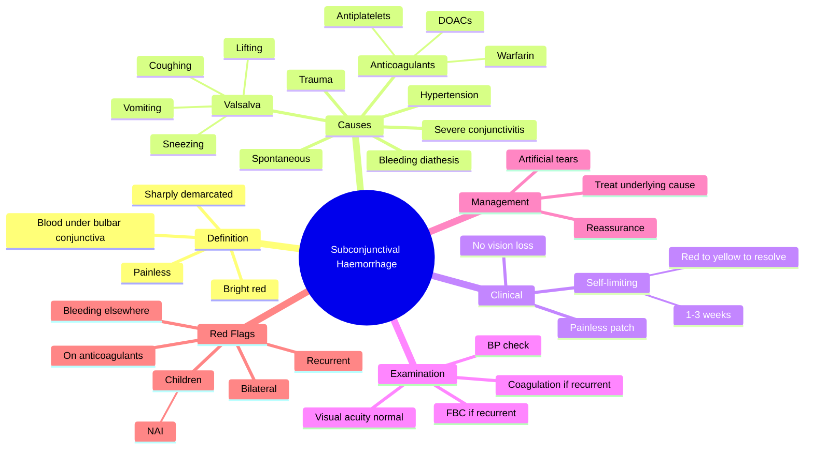

# Subconjunctival Haemorrhage

Related: [[Hypertension (Ocular)]], [[Conjunctiva Hub]]

> [!tip] **FCPS/MRCP Priority: MEDIUM**
> Usually benign, self-limiting, often without cause. Check BP, INR, anticoagulants. Recurrent or bilateral may signal systemic cause.

---

## Learning Objectives
- [ ] Define subconjunctival haemorrhage (SCH) and its typical course
- [ ] List common causes including Valsalva, trauma, anticoagulation
- [ ] Recognise when to investigate (recurrent, bilateral, in children)
- [ ] Differentiate from conjunctivitis, pterygium, and ocular trauma
- [ ] Provide appropriate reassurance and management
- [ ] Identify red flags warranting further systemic workup
- [ ] Describe the natural history of resolution (red → yellow → clear)

---

## 1. Definition

- **Subconjunctival haemorrhage (SCH):** Blood beneath the bulbar conjunctiva
- Usually focal, sharply demarcated, bright red
- Painless

## 2. Causes

- **Spontaneous (most common):** Often no cause found
- **Trauma:** Eye rubbing, foreign body, surgery
- **Valsalva:** Coughing, sneezing, vomiting, lifting
- **Anticoagulants:** Warfarin, DOACs, antiplatelets
- **Bleeding diathesis:** Thrombocytopenia, coagulopathy
- **Hypertension** (controversial)
- **Vascular:** Amyloidosis
- **Severe acute conjunctivitis** (e.g., haemorrhagic viral)
- **Trachoma** (late pannus)

## 3. Clinical Features

- Bright red, sharply demarcated patch on bulbar conjunctiva
- Painless
- No visual loss (unless extensive or posterior)
- Self-limiting (resolves in 2–3 weeks, colour change from red→yellow→resolve)

## 4. Examination

- Visual acuity (normal)
- BP (check for hypertension)
- Coagulation studies if indicated (recurrent, anticoagulant, on warfarin)
- Full blood count (thrombocytopenia)

## 5. Management

- **Reassurance** — most resolve in 1–3 weeks
- Artificial tears if irritation
- Treat underlying cause (BP control, anticoagulant review)
- No specific therapy

## 6. FCPS/MRCP High-Yield Summary

| Topic | Key Points |
|-------|------------|
| Common | Spontaneous, often no cause |
| Self-limiting | 1–3 weeks |
| Check | BP, anticoagulants, platelets if recurrent |
| Treatment | Reassurance |

## 7. Viva Questions

1. **Q:** What should you check in a patient with recurrent subconjunctival haemorrhage?
   **A:** Blood pressure, anticoagulant use, coagulation profile, platelet count.
2. **Q:** Why is SCH painless?
   **A:** The subconjunctival space has no pain fibres; it stretches without pain.
3. **Q:** What is the natural history of SCH?
   **A:** Bright red → brown/yellow → resolution in 1–3 weeks (haemoglobin breakdown).
4. **Q:** In children, recurrent SCH raises concern for what?
   **A:** Non-accidental injury (NAI) and bleeding diathesis.

---

## 8. Common Confusions / Exam Traps

| Confusion | Clarification |
|-----------|---------------|
| "SCH is painful like conjunctivitis" | SCH is painless; conjunctivitis is gritty/irritated |
| "Always needs workup" | Single, spontaneous SCH needs only BP check; recurrent/bilateral needs FBC, coagulation |
| "SCH can cause vision loss" | Vision is preserved unless SCH is massive and posterior (rare) |
| "Anticoagulants must be stopped" | Only after review of indication; usually continue unless very high INR |
| "SCH is the same as hyphaema" | Hyphaema = blood in anterior chamber (between cornea and iris); SCH = blood under conjunctiva |

## 9. Mnemonics

1. **"SCH is PAINLESS"** — Painless Acute Isolated Non-purulent Lesion of the Subconjunctiva
2. **"BP — Bleed — Platelets — Pee (urine dipstick for blood)"** — workup for recurrent SCH
3. **"Red → Yellow → Gone"** — natural history of resolution (oxyhaemoglobin → bilirubin)

## 10. Mind Map

## 11. One-Page Revision Card

| **Topic** | **Subconjunctival Haemorrhage** |
|-----------|---------------------------------|
| **Definition** | Blood under bulbar conjunctiva, sharply demarcated, painless |
| **Common Cause** | Spontaneous (often no cause), Valsalva |
| **Self-limiting** | 1–3 weeks (red → yellow → resolve) |
| **Examination** | VA, BP, FBC, coagulation if recurrent |
| **Management** | Reassurance, lubricants, treat cause |
| **Differential** | Conjunctivitis (painful/gritty), hyphaema (anterior chamber) |
| **Red Flags** | Recurrent, bilateral, in children, anticoagulant use |
| **Viva Pearl** | Painless + red patch + normal VA = SCH |

---

## Spaced Repetition Trackers

### 24-Hour Recall Prompts
- [ ] Define SCH and identify the key clinical features
- [ ] List 4 causes of SCH
- [ ] State the natural history (timeline) of resolution
- [ ] Identify red flags requiring further workup
- [ ] Differentiate SCH from hyphaema and conjunctivitis

### Revision Schedule
- [ ] **Day 1** completed (creation + 24h recall)
- [ ] **Day 3** revision completed
- [ ] **Day 7** revision completed
- [ ] **Day 15** revision completed
- [ ] **Day 30** revision completed
- [ ] **Day 90** revision completed

---

## Must Know / Should Know / Nice to Know

### Must Know (Core for passing)
- [x] Definition (blood under bulbar conjunctiva)
- [x] Painless, self-limiting
- [x] Resolution 1–3 weeks
- [x] Reassurance as mainstay of management
- [x] Recurrent → check BP, FBC, coagulation, anticoagulants

### Should Know (High probability)
- [x] Valsalva causes
- [x] Anticoagulant association
- [x] Children with SCH — consider NAI and bleeding diathesis
- [x] Natural history colour change (red → yellow → resolve)

### Nice to Know (Differentiator)
- [ ] Amyloidosis as a cause
- [ ] Severe viral conjunctivitis (e.g., enterovirus, coxsackie) as cause
- [ ] Difference between hyphaema, SCH, and vitreous haemorrhage

---

## My Weak Points
- [ ] Add personal weak areas here

---

## Self-Test Scorecard

| Section | Score /5 |
|---------|----------|
| Understanding: | /10 |
| Recall: | /10 |
| MCQ Performance: | /10 |
| SBA Performance: | /10 |
| Viva Confidence: | /10 |
| Total: | /50 |

> [!tip] **Interpretation:** <35 = weak topic, 35-44 = acceptable but insecure, 45+ = strong exam-ready topic.

---

## Exam Answer Modes

### Long Answer Skeleton
1. Definition (blood under bulbar conjunctiva, sharply demarcated, painless, red patch)
2. Causes — spontaneous (most common), Valsalva, trauma, anticoagulants, bleeding diathesis, hypertension (controversial), severe conjunctivitis, amyloidosis
3. Clinical features (painless, no visual loss, self-limiting)
4. Natural history (red → yellow → clear over 1–3 weeks)
5. Examination (VA normal, BP, FBC, coagulation if indicated)
6. Differential (conjunctivitis, hyphaema, pterygium, pannus, conjunctival naevus)
7. Management — reassurance, lubricants, treat underlying cause (BP, anticoagulant review)
8. Red flags — recurrent, bilateral, in children (NAI), anticoagulant use, bleeding elsewhere

### Short Note Skeleton
- Definition + key clinical features (painless, self-limiting, red patch)
- Common causes (Valsalva, trauma, anticoagulation, spontaneous)
- Investigation of recurrent SCH (BP, FBC, coagulation)
- Management (reassurance, lubricants, treat cause)
- Red flags (recurrent, bilateral, NAI in children)

### Viva One-Liners
- **Q:** What is SCH? → **A:** Blood beneath the bulbar conjunctiva — painless, sharply demarcated, red patch.
- **Q:** How long does it take to resolve? → **A:** 1–3 weeks (red → yellow → clear).
- **Q:** What to check in recurrent SCH? → **A:** BP, FBC, coagulation, anticoagulant use.
- **Q:** Children with SCH? → **A:** Consider NAI and bleeding diathesis.
- **Q:** SCH vs hyphaema? → **A:** SCH = under conjunctiva; hyphaema = in anterior chamber (visible blood level behind cornea).

### Ward-Case Discussion Points
- Confirm SCH at slit-lamp and rule out posterior extension
- Check visual acuity (should be normal)
- Measure blood pressure
- Take drug history (anticoagulants, antiplatelets)
- Ask about Valsalva, trauma, coughing
- In children, consider NAI — examine for other signs
- Reassure patient about self-limiting nature

### Last-Night-Before-Exam Sheet
- Top 3 facts: painless red patch, self-limiting 1–3 weeks, check BP and anticoagulants if recurrent
- 1 mnemonic: "SCH is PAINLESS"
- Key differential: conjunctivitis (painful/gritty), hyphaema (anterior chamber)
- Children with SCH — think NAI

---

## Summary

Subconjunctival haemorrhage is usually benign and self-limiting. Check BP and anticoagulant use, especially if recurrent. Treat any underlying cause. Always consider NAI and bleeding diathesis in children with SCH.

---

## MCQs (10)

1. **Question:** Subconjunctival haemorrhage is most often:
   **Options:** A. Painful B. Painless C. Vision-threatening D. Bilateral E. Recurrent
   **Answer:** B
   **Explanation:** SCH is classically painless — the subconjunctival space has no pain fibres.

2. **Question:** Recurrent subconjunctival haemorrhage warrants checking:
   **Options:** A. Cholesterol B. Blood pressure C. Calcium D. Uric acid E. None
   **Answer:** B
   **Explanation:** BP should be checked; also FBC, coagulation, anticoagulant use.

3. **Question:** A typical subconjunctival haemorrhage resolves in:
   **Options:** A. A few hours B. 1–3 days C. 1–3 weeks D. 2–3 months E. Never
   **Answer:** C
   **Explanation:** SCH typically resolves in 1–3 weeks (red → yellow → clear).

4. **Question:** Which of the following is the commonest cause of SCH?
   **Options:** A. Trauma B. Spontaneous (no cause found) C. Hypertension D. Bleeding diathesis E. Tumour
   **Answer:** B
   **Explanation:** Spontaneous SCH with no identifiable cause is the most common form.

5. **Question:** Subconjunctival haemorrhage is best distinguished from hyphaema by:
   **Options:** A. Colour B. Location of blood C. Pain D. Vision E. Bilaterality
   **Answer:** B
   **Explanation:** SCH = blood under bulbar conjunctiva; hyphaema = blood in anterior chamber (visible blood level behind cornea).

6. **Question:** All of the following may cause SCH EXCEPT:
   **Options:** A. Valsalva B. Warfarin C. Aspirin D. Vitamin C deficiency E. Trauma
   **Answer:** D
   **Explanation:** Valsalva, anticoagulants, antiplatelets, trauma all cause SCH. Vitamin C deficiency causes bleeding tendencies but is not a common direct cause of SCH.

7. **Question:** In a child with recurrent SCH, the most important consideration is:
   **Options:** A. Allergy B. Vitamin deficiency C. Non-accidental injury (NAI) D. Refractive error E. Strabismus
   **Answer:** C
   **Explanation:** In children, recurrent SCH raises concern for non-accidental injury and bleeding diathesis.

8. **Question:** The colour change of an SCH as it resolves goes:
   **Options:** A. Red → green → clear B. Red → blue → clear C. Red → yellow → clear D. Red → black → clear E. No change
   **Answer:** C
   **Explanation:** Oxyhaemoglobin (red) is broken down to bilirubin (yellow) and then resolves.

9. **Question:** Visual acuity in isolated SCH is:
   **Options:** A. Severely reduced B. Moderately reduced C. Normal D. Variable E. Always blurred
   **Answer:** C
   **Explanation:** Visual acuity is preserved in isolated SCH (unless very extensive and posterior).

10. **Question:** First-line management of an isolated, spontaneous SCH in a 60-year-old on no medication is:
    **Options:** A. Topical antibiotic B. Topical steroid C. Reassurance, BP check, lubricants D. Surgical drainage E. Anticoagulation reversal
    **Answer:** C
    **Explanation:** Most cases are self-limiting; reassure, check BP, give artificial tears for irritation.

---

## SBA Questions (10)

1. **Scenario:** A 60-year-old presents with a sudden, painless bright red patch on the white of the eye, noticed on waking. Visual acuity is 6/6, no pain, no discharge. He is on no medication.
   **Question:** Most appropriate next step?
   **Options:** A. Urgent referral B. Topical antibiotics C. Reassurance and BP check D. CT brain E. Lumbar puncture
   **Answer:** C
   **Explanation:** Painless SCH with normal VA and no medications — reassure, check BP, review in 2–3 weeks.

2. **Scenario:** A 70-year-old on warfarin for atrial fibrillation presents with recurrent SCH over the past 3 months. INR is 3.8.
   **Question:** Most appropriate next step?
   **Options:** A. Stop warfarin B. Reassure, continue warfarin, review INR C. Add aspirin D. Plasma exchange E. Surgical drainage
   **Answer:** B
   **Explanation:** Recurrent SCH in a patient on warfarin warrants INR check; reassure and review dose to bring INR to therapeutic range. Do not stop warfarin abruptly (risk of stroke).

3. **Scenario:** A 35-year-old with severe cough (pertussis) develops a sudden red patch on the bulbar conjunctiva, painless, with normal VA.
   **Question:** Most likely diagnosis?
   **Options:** A. Conjunctivitis B. Subconjunctival haemorrhage C. Hyphaema D. Pterygium E. Scleritis
   **Answer:** B
   **Explanation:** Valsalva from coughing can cause spontaneous SCH — painless, red, well-demarcated patch.

4. **Scenario:** A 4-year-old child is brought in by the mother with bilateral SCH. The child has bruises of different ages on the limbs.
   **Question:** Most appropriate next step?
   **Options:** A. Reassure B. Topical antibiotic C. Check for non-accidental injury and bleeding diathesis D. Topical steroid E. Lubricants
   **Answer:** C
   **Explanation:** Bilateral SCH in a child with bruises of different ages — must exclude NAI; check FBC, coagulation, involve paediatrics/social services.

5. **Scenario:** A 50-year-old presents with a red patch on the eye after a heavy weightlifting session. Visual acuity is 6/6.
   **Question:** Most likely cause?
   **Options:** A. Conjunctivitis B. Valsalva-induced SCH C. Retinal detachment D. Acute glaucoma E. Keratitis
   **Answer:** B
   **Explanation:** Heavy lifting → Valsalva → rupture of small subconjunctival vessels → SCH.

6. **Scenario:** An elderly patient on clopidogrel presents with SCH. Visual acuity is preserved. There is no history of trauma.
   **Question:** Best management?
   **Options:** A. Stop clopidogrel immediately B. Reassure, lubricate, review with cardiologist C. Platelet transfusion D. Surgical drainage E. IV vitamin K
   **Answer:** B
   **Explanation:** Reassure; do not stop antiplatelet therapy without consulting cardiology (risk of stent thrombosis).

7. **Scenario:** A 60-year-old presents with SCH. On examination, the red patch is bright red, sharply demarcated, painless, and VA is 6/6. There is no posterior extension.
   **Question:** Most likely natural history?
   **Options:** A. Permanent B. Resolves in 1–3 weeks (red → yellow → clear) C. Progresses to hyphaema D. Requires surgery E. Causes glaucoma
   **Answer:** B
   **Explanation:** Self-limiting — haemoglobin breaks down (red → yellow) and clears in 1–3 weeks.

8. **Scenario:** A patient with SCH complains of mild foreign body sensation. The eye is otherwise comfortable and VA is normal.
   **Question:** Most appropriate symptomatic treatment?
   **Options:** A. Topical anaesthetic B. Topical antibiotic C. Artificial tears (lubricants) D. Topical steroid E. Padding
   **Answer:** C
   **Explanation:** Lubricants (artificial tears) relieve the mild irritation; no specific therapy needed.

9. **Scenario:** A 55-year-old with hypertension and recurrent SCH has BP 165/100 mmHg. He is not on anticoagulants.
   **Question:** Most appropriate next step?
   **Options:** A. Urgent referral B. Optimise BP control and observe C. Topical haemostatic agents D. Surgical drainage E. MRI brain
   **Answer:** B
   **Explanation:** Optimise antihypertensive therapy; uncontrolled BP may contribute to recurrent SCH.

10. **Scenario:** A patient presents with SCH but on close slit-lamp examination, blood is seen layered in the anterior chamber with a fluid level.
    **Question:** What is the diagnosis?
    **Options:** A. SCH B. Hyphaema C. Vitreous haemorrhage D. Pterygium E. Conjunctivitis
    **Answer:** B
    **Explanation:** Blood in the anterior chamber with a visible level = hyphaema (typically from trauma). This is more serious and needs urgent ophthalmology review.

---

## Flashcards

- **Q:** What is subconjunctival haemorrhage?
  **A:** Blood beneath the bulbar conjunctiva — sharply demarcated, bright red, painless.
- **Q:** How long does SCH take to resolve?
  **A:** 1–3 weeks (red → yellow → clear) as haemoglobin is broken down.
- **Q:** What are the common causes of SCH?
  **A:** Spontaneous (most common), Valsalva (cough, sneeze, lift), trauma, anticoagulants, bleeding diathesis, hypertension.
- **Q:** What to check in recurrent SCH?
  **A:** BP, full blood count (platelets), coagulation profile, anticoagulant use.
- **Q:** In a child with SCH, what to consider?
  **A:** Non-accidental injury (NAI) and bleeding diathesis — important safeguarding issue.

---

## Answer Key with Explanations

### MCQs
1. B — Painless (no pain fibres in subconjunctival space).
2. B — Recurrent SCH → check BP, FBC, coagulation, anticoagulants.
3. C — Resolves in 1–3 weeks.
4. B — Spontaneous with no cause is most common.
5. B — SCH is under conjunctiva; hyphaema is in the anterior chamber.
6. D — Vitamin C deficiency is not a typical direct cause of SCH.
7. C — Children with recurrent SCH → NAI and bleeding diathesis.
8. C — Red → yellow → clear (haemoglobin breakdown).
9. C — VA preserved in isolated SCH.
10. C — Reassurance, BP check, lubricants for isolated SCH.

### SBAs
1. C — Painless SCH, no meds → reassure, BP check.
2. B — Do not stop warfarin abruptly; review INR and reassure.
3. B — Valsalva from cough → SCH.
4. C — Bilateral SCH in a child with bruises of different ages → NAI workup.
5. B — Heavy lifting → Valsalva-induced SCH.
6. B — Reassure, do not stop clopidogrel without cardiology review.
7. B — Self-limiting in 1–3 weeks.
8. C — Artificial tears for mild irritation.
9. B — Optimise BP control in hypertensive with recurrent SCH.
10. B — Layered blood in anterior chamber = hyphaema, not SCH.

---

## Tags
#medicine #davidson #ophthalmology #subconjunctival #fcps #mrcp

## PasTest Scenario SBAs (Clinical Vignettes)

> **Auto-generated PasTest/Mediscope-style scenario SBAs** grounded in the authored source. Each scenario tests a real clinical fact (triad, specific sign, contraindication, trial, first-line Rx) extracted from the topic. *Source: Ch 28: Medical Ophthalmology — Subconjunctival Haemorrhage*

**Q1.** What is the most appropriate first-line therapy for Subconjunctival Haemorrhage?

  - **A.** Reassurance
  - **B.** An advanced/surgical therapy reserved for refractory disease
  - **C.** Symptomatic treatment only, no disease-modifying therapy
  - **D.** Empiric broad-spectrum therapy without specific indication

  > **Answer: A** — Reassurance
  >
  > *Source:* - **Reassurance** — most resolve in 1–3 weeks
- Artificial tears if irritation
- Treat underlying cause (BP control, anticoagulant review)
- No specific therapy

