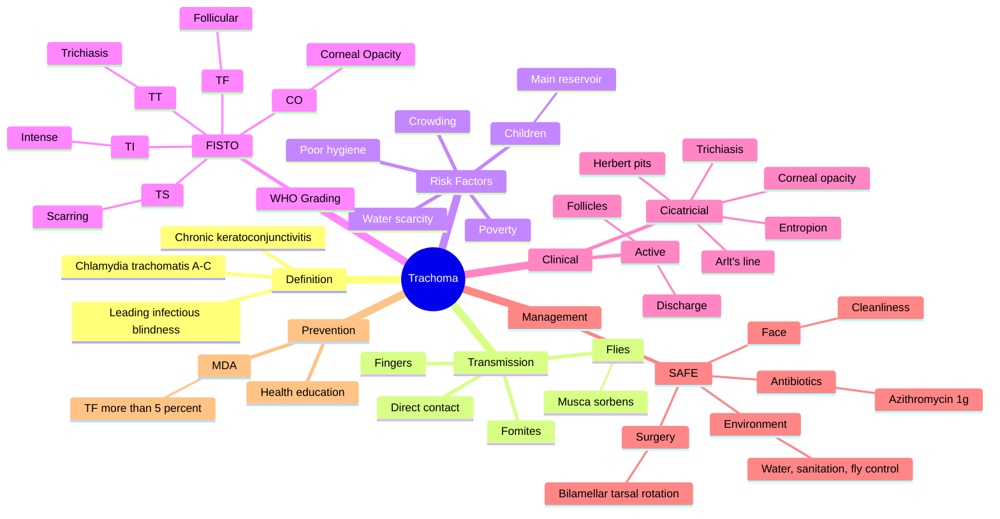

# Trachoma

Related: [[Conjunctiva Hub]], [[Chlamydia trachomatis]], [[Entropion]]

> [!tip] **FCPS/MRCP Priority: HIGH**
> Leading infectious cause of blindness worldwide. Caused by Chlamydia trachomatis A–C. WHO SAFE strategy. Endemic in poor, crowded, dry regions.

---

## Learning Objectives
- [ ] Define trachoma and identify the causative organism
- [ ] Describe the WHO simplified grading (FISTO)
- [ ] Recognise clinical features of active and cicatricial disease
- [ ] Apply the WHO SAFE strategy for prevention and treatment
- [ ] State the drug of choice and dosing for mass drug administration
- [ ] Identify indications and type of surgery for trichiasis
- [ ] Differentiate trachoma from adult inclusion conjunctivitis and vernal keratoconjunctivitis
- [ ] Recognise pathognomonic signs (Herbert's pits, Arlt's line)

---

## 1. Definition

- **Trachoma:** Chronic keratoconjunctivitis caused by Chlamydia trachomatis serotypes A, B, Ba, and C
- Leading infectious cause of blindness globally
- Endemic in 40+ countries, particularly sub-Saharan Africa, Middle East, parts of Asia

## 2. Pathogenesis

- **Organism:** Chlamydia trachomatis (ocular serotypes A–C, distinct from genital D–K and L)
- **Transmission:** Direct contact (eye–eye), fingers, fomites (towels, bedding), flies (Musca sorbens)
- Risk factors: poverty, crowding, poor hygiene, water scarcity, dry/dusty environment, children (main reservoir)

## 3. WHO Clinical Grading (FISTO)

| Grade | Sign | Description |
|-------|------|-------------|
| **TF** | Trachomatous Inflammation (Follicular) | ≥5 follicles on upper tarsus |
| **TI** | Trachomatous Inflammation (Intense) | Inflammatory thickening obscuring >50% of deep tarsal vessels |
| **TS** | Trachomatous Scarring | Scars on tarsus |
| **TT** | Trachomatous Trichiasis | ≥1 lash touching globe, or evidence of epilation |
| **CO** | Corneal Opacity | Visible opacity over pupil |

## 4. Clinical Features (Stages)

### Active (Children, 1–10 y)
- Follicles on upper tarsal conjunctiva
- Mucopurulent discharge
- Photophobia
- Usually bilateral

### Cicatricial
- **Arlt's line** — linear scarring on upper tarsus
- **Herbert's pits** — peripheral depressions at limbus (resolved limbal follicles)
- **Entropion** (cicatricial)
- **Trichiasis** (in-turned lashes)
- **Corneal opacification** → blindness

## 5. Diagnosis

- Clinical (WHO simplified grading)
- PCR for C. trachomatis (research, monitoring)
- Conjunctival swab

## 6. Differential

- **Adult inclusion conjunctivitis** (serotypes D–K, sexually transmitted, more follicular, less scarring)
- **Vernal keratoconjunctivitis** (giant papillae, no scarring)
- **Other chronic conjunctivitis**

## 7. Management

### WHO SAFE Strategy
| Letter | Component |
|--------|-----------|
| **S** | Surgery (for trichiasis — bilamellar tarsal rotation) |
| **A** | Antibiotics (azithromycin single dose, mass drug administration) |
| **F** | Facial cleanliness (children) |
| **E** | Environmental improvement (water, sanitation, fly control) |

### Specific
- **Azithromycin 1 g single oral dose** (children: 20 mg/kg) — given as MDA
- Alternative: Tetracycline eye ointment BD × 6 weeks (cheaper, less effective, poor compliance)
- **Surgery:** Bilamellar tarsal rotation (or Trabut procedure) for trichiasis — prevents blindness
- Epilation (temporary) for small numbers of lashes

## 8. Prevention

- **Mass Drug Administration (MDA):** Azithromycin to entire community when TF >5% in children
- **Clean face:** Reduce ocular–nasal discharge
- **Improved water and sanitation:** Latrines, fly control
- **Health education**

## 9. FCPS/MRCP High-Yield Summary

| Topic | Key Points |
|-------|------------|
| Cause | Chlamydia trachomatis A–C |
| WHO | Leading infectious blindness cause |
| Endemic | Sub-Saharan Africa, poor regions |
| SAFE | Surgery, Antibiotics, Face, Environment |
| Drug | Azithromycin 1g single dose |
| Surgery | Bilamellar tarsal rotation for trichiasis |

## 10. Viva Questions

1. **Q:** What organism causes trachoma?
   **A:** Chlamydia trachomatis serotypes A, B, Ba, and C (ocular).
2. **Q:** Describe the WHO SAFE strategy.
   **A:** Surgery (trichiasis), Antibiotics (azithromycin MDA), Facial cleanliness, Environmental improvement.
3. **Q:** What is a Herbert pit?
   **A:** Limbal depression representing resolved limbal follicle — pathognomonic of trachoma.
4. **Q:** What is Arlt's line?
   **A:** Linear scarring on the upper tarsal conjunctiva — sign of cicatricial trachoma.
5. **Q:** What mass drug administration is used and at what threshold?
   **A:** Single-dose oral azithromycin; MDA to community when TF >5% in children 1–9 years.

---

## 11. Common Confusions / Exam Traps

| Confusion | Clarification |
|-----------|---------------|
| "Trachoma serotypes are the same as chlamydial STI" | Trachoma = A–C; STI = D–K; LGV = L1–L3 |
| "SAFE is just antibiotics" | SAFE = Surgery, Antibiotics, Facial cleanliness, Environmental improvement |
| "All trichiasis is treated with epilation" | Epilation is temporary; definitive treatment is bilamellar tarsal rotation |
| "Tetracycline ointment is first-line" | Azithromycin single oral dose is first-line; tetracycline ointment is alternative (worse compliance) |
| "Herbert pits are corneal ulcers" | Herbert pits = limbal depressions from resolved follicles (pathognomonic, not ulcers) |
| "Trachoma is an acute disease" | It is chronic, with active (follicular) and cicatricial phases |

## 12. Mnemonics

1. **"SAFE"** — Surgery, Antibiotics, Face, Environmental improvement (WHO strategy)
2. **"FISTO"** — Follicular, Intense, Scarring, Trichiasis, Opacity (WHO grading)
3. **"ABC trachoma, D-K does the deed (sex)"** — A–C causes trachoma; D–K causes STI/inclusion conjunctivitis

## 13. Mind Map

## 14. One-Page Revision Card

| **Topic** | **Trachoma** |
|-----------|--------------|
| **Cause** | Chlamydia trachomatis A–C |
| **WHO Status** | Leading infectious cause of blindness |
| **Grading** | FISTO: TF, TI, TS, TT, CO |
| **Signs** | Follicles, Arlt's line, Herbert's pits, trichiasis, entropion |
| **Drug** | Azithromycin 1g single dose (children 20 mg/kg) |
| **Surgery** | Bilamellar tarsal rotation for trichiasis |
| **Strategy** | SAFE: Surgery, Antibiotics, Face, Environment |
| **MDA Trigger** | TF >5% in children 1–9 years |
| **Viva Pearl** | A–C = trachoma, D–K = STI |

---

## Spaced Repetition Trackers

### 24-Hour Recall Prompts
- [ ] State the organism and serotypes that cause trachoma
- [ ] List the WHO SAFE strategy components
- [ ] Recall the WHO simplified grading (FISTO)
- [ ] Identify the drug of choice and dose for MDA
- [ ] State the surgery for trichiasis

### Revision Schedule
- [ ] **Day 1** completed (creation + 24h recall)
- [ ] **Day 3** revision completed
- [ ] **Day 7** revision completed
- [ ] **Day 15** revision completed
- [ ] **Day 30** revision completed
- [ ] **Day 90** revision completed

---

## Must Know / Should Know / Nice to Know

### Must Know (Core for passing)
- [x] Cause — Chlamydia trachomatis A–C
- [x] WHO SAFE strategy
- [x] Drug of choice — Azithromycin 1g single dose
- [x] Surgery for trichiasis — bilamellar tarsal rotation
- [x] WHO grading (FISTO)
- [x] Herbert's pits = pathognomonic

### Should Know (High probability)
- [x] Active vs cicatricial disease features
- [x] Arlt's line
- [x] MDA threshold (TF >5% in children)
- [x] Transmission (flies, fingers, fomites)
- [x] Trachoma vs adult inclusion conjunctivitis (D–K)

### Nice to Know (Differentiator)
- [ ] Trabut procedure (alternative surgery)
- [ ] Musca sorbens (specific vector fly)
- [ ] Elimination targets and current global status (GET 2020)

---

## My Weak Points
- [ ] Add personal weak areas here

---

## Self-Test Scorecard

| Section | Score /5 |
|---------|----------|
| Understanding: | /10 |
| Recall: | /10 |
| MCQ Performance: | /10 |
| SBA Performance: | /10 |
| Viva Confidence: | /10 |
| Total: | /50 |

> [!tip] **Interpretation:** <35 = weak topic, 35-44 = acceptable but insecure, 45+ = strong exam-ready topic.

---

## Exam Answer Modes

### Long Answer Skeleton
1. Definition (chronic keratoconjunctivitis caused by C. trachomatis A–C; leading infectious cause of blindness)
2. Epidemiology (endemic in sub-Saharan Africa, Middle East, parts of Asia; poverty, crowding, water scarcity)
3. Pathogenesis and transmission (eye–eye, fingers, fomites, flies — Musca sorbens; children are main reservoir)
4. WHO clinical grading — FISTO (TF, TI, TS, TT, CO)
5. Clinical features — active (follicles, mucopurulent discharge, photophobia) and cicatricial (Arlt's line, Herbert's pits, entropion, trichiasis, corneal opacity)
6. Diagnosis — clinical; PCR for research/monitoring
7. Differential — adult inclusion conjunctivitis (D–K), vernal keratoconjunctivitis, other chronic conjunctivitis
8. Management — WHO SAFE strategy
   - S — Surgery: bilamellar tarsal rotation for trichiasis
   - A — Antibiotics: azithromycin 1g single dose (children 20 mg/kg); tetracycline ointment alternative
   - F — Facial cleanliness
   - E — Environmental improvement (water, sanitation, fly control)
9. Prevention — MDA when TF >5% in 1–9-year-olds; health education; clean faces

### Short Note Skeleton
- Definition + causative organism + serotypes (A–C)
- WHO grading (FISTO) — quick recall
- WHO SAFE strategy
- Drug of choice (azithromycin 1g) and surgery (bilamellar tarsal rotation)
- Herbert's pits — pathognomonic sign

### Viva One-Liners
- **Q:** Organism causing trachoma? → **A:** Chlamydia trachomatis serotypes A, B, Ba, C.
- **Q:** SAFE? → **A:** Surgery, Antibiotics, Face, Environment.
- **Q:** Drug of choice? → **A:** Azithromycin 1g single oral dose (children 20 mg/kg).
- **Q:** What is Herbert's pit? → **A:** Limbal depression from resolved limbal follicle — pathognomonic.
- **Q:** Surgery for trichiasis? → **A:** Bilamellar tarsal rotation (Trabut is an alternative).
- **Q:** MDA threshold? → **A:** TF >5% in children 1–9 years.

### Ward-Case Discussion Points
- Examine upper tarsus (evert lid) for follicles and scarring
- Check for Herbert's pits at limbus
- Look for trichiasis, entropion, corneal opacity
- Take history — endemic area, exposure, hygiene
- Discuss WHO SAFE strategy
- Counsel on mass treatment, family hygiene, latrine use

### Last-Night-Before-Exam Sheet
- Top 3 facts: C. trachomatis A–C; SAFE strategy; azithromycin 1g single dose
- 1 mnemonic: "SAFE — Surgery, Antibiotics, Face, Environment"
- Herbert's pits = pathognomonic
- Trachoma serotypes A–C; STI serotypes D–K
- Bilamellar tarsal rotation for trichiasis

---

## Summary

Trachoma is the leading infectious cause of blindness, caused by Chlamydia trachomatis A–C. Endemic in poor regions. Clinical grading uses WHO FISTO. Treatment is the SAFE strategy with azithromycin mass drug administration and surgery for trichiasis.

---

## MCQs (10)

1. **Question:** Trachoma is caused by:
   **Options:** A. Staph aureus B. Strep pneumoniae C. Chlamydia trachomatis A-C D. Adenovirus E. HSV
   **Answer:** C
   **Explanation:** C. trachomatis A–C (ocular serotypes) cause trachoma.

2. **Question:** The drug of choice for trachoma MDA is:
   **Options:** A. Penicillin B. Doxycycline C. Azithromycin D. Ciprofloxacin E. Metronidazole
   **Answer:** C
   **Explanation:** Single-dose oral azithromycin 1g (children 20 mg/kg) is the drug of choice for MDA.

3. **Question:** Herbert pits in trachoma are:
   **Options:** A. Corneal ulcers B. Limbal depressions from old follicles C. Tarsal scars D. Conjunctival follicles E. Iris lesions
   **Answer:** B
   **Explanation:** Herbert's pits are limbal depressions formed after resolution of limbal follicles — pathognomonic of trachoma.

4. **Question:** The WHO SAFE strategy stands for:
   **Options:** A. Steroids, Antibiotics, Fluorescein, Examination B. Surgery, Antibiotics, Face, Environment C. Surgery, Antivirals, Fluorescein, Education D. Steroids, Atropine, Fluorometholone, Examination E. None
   **Answer:** B
   **Explanation:** S = Surgery (trichiasis), A = Antibiotics (azithromycin), F = Facial cleanliness, E = Environmental improvement.

5. **Question:** Adult inclusion conjunctivitis is caused by Chlamydia trachomatis serotypes:
   **Options:** A. A–C B. D–K C. L1–L3 D. A and B E. None
   **Answer:** B
   **Explanation:** Adult inclusion conjunctivitis is caused by genital serotypes D–K (sexually transmitted), distinct from trachoma (A–C).

6. **Question:** Mass Drug Administration (MDA) for trachoma is triggered when:
   **Options:** A. TF >50% in adults B. TF >5% in children 1–9 years C. TT >1% in adults D. CO >1% in any group E. TS >10% in any group
   **Answer:** B
   **Explanation:** WHO recommends MDA with azithromycin when TF >5% in children aged 1–9 years.

7. **Question:** The surgical procedure of choice for trachomatous trichiasis is:
   **Options:** A. Epilation B. Bilamellar tarsal rotation C. Punctal cautery D. Tarsorrhaphy E. Penetrating keratoplasty
   **Answer:** B
   **Explanation:** Bilamellar tarsal rotation (or Trabut) is the surgical procedure to correct trichiasis and prevent corneal scarring.

8. **Question:** The vector fly implicated in trachoma transmission is:
   **Options:** A. Musca domestica B. Anopheles C. Musca sorbens D. Tsetse fly E. Sandfly
   **Answer:** C
   **Explanation:** Musca sorbens (the bazaar fly) is strongly implicated in trachoma transmission in endemic areas.

9. **Question:** Arlt's line in trachoma is:
   **Options:** A. Iron line at limbus B. Linear scarring on upper tarsus C. Corneal ulcer D. Conjunctival cyst E. Iris atrophy
   **Answer:** B
   **Explanation:** Arlt's line is a horizontal line of scarring on the upper tarsal conjunctiva — sign of cicatricial trachoma.

10. **Question:** The WHO FISTO grade 'TT' refers to:
    **Options:** A. Trachomatous Follicles B. Trachomatous Inflammation C. Trachomatous Scarring D. Trachomatous Trichiasis E. Trachomatous Tear
    **Answer:** D
    **Explanation:** TT = Trachomatous Trichiasis (≥1 lash touching the globe or evidence of epilation).

---

## SBA Questions (10)

1. **Scenario:** A 30-year-old in rural Africa has in-turned upper lashes scratching the cornea, previous recurrent red eyes, scarred tarsus.
   **Question:** Most appropriate management?
   **Options:** A. Topical antibiotics B. Bilamellar tarsal rotation C. Lubricants D. Azithromycin only E. Observation
   **Answer:** B
   **Explanation:** Trichiasis (TT) needs surgery to prevent blindness — bilamellar tarsal rotation is the operation of choice.

2. **Scenario:** A WHO survey in an endemic region finds TF in 12% of children aged 1–9 years.
   **Question:** What is the recommended intervention?
   **Options:** A. No intervention B. Mass drug administration of azithromycin to the community C. Topical tetracycline only D. Surgery for all trichiasis cases E. Vaccination
   **Answer:** B
   **Explanation:** TF >5% in children 1–9 years triggers community-wide MDA with azithromycin.

3. **Scenario:** A 6-year-old child in an endemic area presents with photophobia, mucopurulent discharge, and follicles on the upper tarsal conjunctiva. No scarring is seen.
   **Question:** What is the WHO grade?
   **Options:** A. TF B. TI C. TS D. TT E. CO
   **Answer:** A
   **Explanation:** ≥5 follicles on the upper tarsus without intense inflammation = Trachomatous Inflammation Follicular (TF).

4. **Scenario:** A patient with trachoma has in-turned lashes scratching the cornea. The surgeon plans to evert the lid and rotate the tarsal plate outward to direct lashes away from the globe.
   **Question:** What is this procedure called?
   **Options:** A. Punctoplasty B. Trabut/bilamellar tarsal rotation C. Tarsorrhaphy D. Ectropion repair E. Penetrating keratoplasty
   **Answer:** B
   **Explanation:** Bilamellar tarsal rotation (Trabut procedure) is the standard for trachomatous trichiasis.

5. **Scenario:** A 7-year-old child with active trachoma (TF) is treated with the recommended single-dose oral medication. Which drug was given?
   **Options:** A. Doxycycline B. Azithromycin C. Ciprofloxacin D. Penicillin V E. Metronidazole
   **Answer:** B
   **Explanation:** Single-dose azithromycin 20 mg/kg is the recommended treatment for active trachoma in children.

6. **Scenario:** An older patient with chronic trachoma has whitish depressions at the limbus on slit-lamp examination.
   **Question:** What is the most likely finding?
   **Options:** A. Corneal ulcer B. Herbert's pits C. Bitot's spots D. Arcus senilis E. Kayser-Fleischer ring
   **Answer:** B
   **Explanation:** Herbert's pits = limbal depressions from resolved limbal follicles — pathognomonic of trachoma.

7. **Scenario:** A trachoma elimination programme assesses a community. The prevalence of trichiasis (TT) in adults is 0.8%, and TF in children 1–9 years is 3%.
   **Question:** What action is needed?
   **Options:** A. Urgent MDA of azithromycin B. Surgery for trichiasis cases; no MDA needed C. Topical tetracycline for all D. No public health action E. Quarantine
   **Answer:** B
   **Explanation:** TF <5% → MDA not triggered. However, TT cases need surgery. Continue surveillance.

8. **Scenario:** A traveller returning from an endemic area presents with follicular conjunctivitis, mucopurulent discharge, and preauricular lymphadenopathy. Adult inclusion conjunctivitis is suspected.
   **Question:** What is the likely serotype?
   **Options:** A. A B. B C. C D. D E. F
   **Answer:** D
   **Explanation:** Adult inclusion conjunctivitis = serotype D (genital serotype D–K), not trachoma serotype (A–C). It is sexually transmitted.

9. **Scenario:** A community health worker in a trachoma-endemic area is told that the 'F' in SAFE stands for facial cleanliness. A mother asks why this matters.
   **Question:** Best explanation?
   **Options:** A. Improves vision B. Reduces ocular–nasal discharge that attracts flies, decreasing transmission C. Cures infection D. Prevents dehydration E. Replaces antibiotics
   **Answer:** B
   **Explanation:** Clean faces reduce the discharge that attracts Musca sorbens flies — a key transmission route.

10. **Scenario:** A patient with chronic trachoma develops bilateral corneal opacification. Visual acuity is 3/60 in both eyes.
    **Question:** What is the WHO grade?
    **Options:** A. TF B. TI C. TS D. TT E. CO
    **Answer:** E
    **Explanation:** CO = Corneal Opacity — visible opacity over the pupil. This is the blinding end-stage.

---

## Flashcards

- **Q:** What organism causes trachoma?
  **A:** Chlamydia trachomatis serotypes A, B, Ba, and C.
- **Q:** What is the WHO SAFE strategy?
  **A:** Surgery (trichiasis), Antibiotics (azithromycin), Face (cleanliness), Environment (water, sanitation, fly control).
- **Q:** What is a Herbert's pit?
  **A:** A limbal depression formed after a limbal follicle resolves — pathognomonic of trachoma.
- **Q:** What is the drug of choice for trachoma MDA?
  **A:** Azithromycin 1g single oral dose (children 20 mg/kg).
- **Q:** What surgery is used for trachomatous trichiasis?
  **A:** Bilamellar tarsal rotation (Trabut procedure).

---

## Answer Key with Explanations

### MCQs
1. C — C. trachomatis A–C (ocular serotypes).
2. C — Azithromycin 1g single dose (or 20 mg/kg in children).
3. B — Limbal depressions from resolved follicles — pathognomonic.
4. B — S = Surgery, A = Antibiotics, F = Face, E = Environment.
5. B — Adult inclusion conjunctivitis = serotypes D–K.
6. B — MDA triggered by TF >5% in children 1–9 years.
7. B — Bilamellar tarsal rotation is the surgery of choice.
8. C — Musca sorbens is the bazaar fly implicated in trachoma.
9. B — Arlt's line is linear scarring on the upper tarsus.
10. D — TT = Trachomatous Trichiasis.

### SBAs
1. B — Trichiasis → bilamellar tarsal rotation to prevent blindness.
2. B — TF >5% in children → MDA with azithromycin.
3. A — Follicles on upper tarsus = TF (Trachomatous Inflammation Follicular).
4. B — Trabut/bilamellar tarsal rotation for trichiasis.
5. B — Azithromycin 20 mg/kg single dose.
6. B — Limbal depressions = Herbert's pits.
7. B — TF <5% → no MDA; treat TT cases with surgery.
8. D — Adult inclusion conjunctivitis is caused by serotype D (D–K group).
9. B — Clean faces reduce fly-attracting discharge, breaking transmission.
10. E — Corneal opacity = CO (blinding end-stage).

---

## Tags
#medicine #davidson #ophthalmology #trachoma #chlamydia #fcps #mrcp

## PasTest Scenario SBAs (Clinical Vignettes)

> **Auto-generated PasTest/Mediscope-style scenario SBAs** grounded in the authored source content. Each scenario is a clinical vignette with 4 options. **Source: Ch 28: Medical Ophthalmology / Trachoma**

**Q1.** A patient is diagnosed with Trachoma. What is the most appropriate first-line management approach?

  - **A.** Standard guideline-directed first-line therapy
  - **B.** Most aggressive advanced therapy as first-line
  - **C.** No treatment needed in most cases
  - **D.** Investigational/compassionate-use therapy only

  > **Answer: A** — Standard guideline-directed first-line therapy

**Q2.** Which of the following best describes the underlying pathophysiology / definition of Trachoma?

  - **A.** **Trachoma:** Chronic keratoconjunctivitis caused by Chlamydia trachomatis serotypes A, B, Ba, and C
  - **B.** A common misattribution to a similar but distinct condition
  - **C.** An outdated or disproven mechanism
  - **D.** A complication rather than the underlying disease process

  > **Answer: A** — **Trachoma:** Chronic keratoconjunctivitis caused by Chlamydia trachomatis serotypes A, B, Ba, and C

