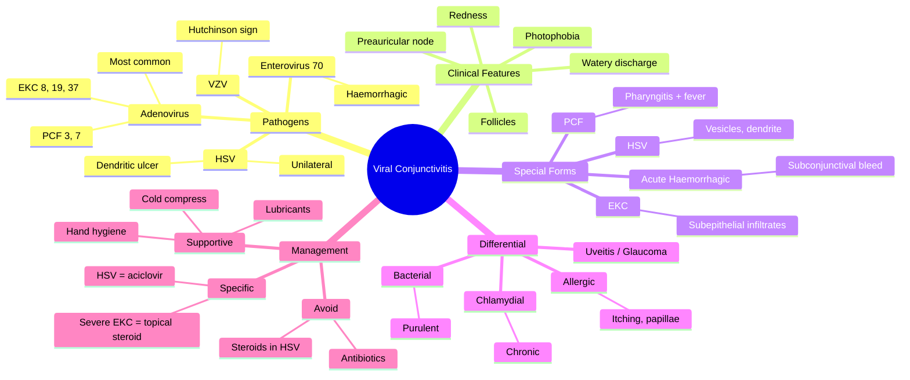

# Viral Conjunctivitis

Related: [[Bacterial Conjunctivitis]], [[Allergic Conjunctivitis]], [[Adenovirus]]

> [!tip] **FCPS/MRCP Priority: CRITICAL**
> Adenoviral is the most common cause. Highly contagious. Distinguish from bacterial (watery vs purulent) and allergic (itching, bilateral).

---

## Learning Objectives

- [ ] Define viral conjunctivitis and identify the common causative organisms
- [ ] Describe the clinical features of adenoviral, EKC, pharyngoconjunctival fever, and acute haemorrhagic conjunctivitis
- [ ] Differentiate viral from bacterial and allergic conjunctivitis
- [ ] Recognise HSV conjunctivitis and the role of antiviral therapy
- [ ] Apply appropriate infection-control measures to limit spread
- [ ] Identify complications (subepithelial infiltrates, pseudomembranes) and their management

---

## 1. Definition

- **Viral conjunctivitis:** Conjunctival inflammation due to viral infection
- Usually self-limiting, very contagious
- A leading cause of acute red-eye presentations in primary care and ophthalmology

---

## 2. Pathogens / Epidemiology

|| Virus | Notes |
|-------|-------|
| **Adenovirus** | Most common, several serotypes (8, 19, 37 = EKC; 3, 7 = pharyngoconjunctival fever) |
| **HSV** | Usually unilateral, with vesicles on lid, may have keratitis (dendritic ulcer) |
| **VZV** | Herpes zoster — V1, Hutchinson sign, keratitis |
| **Enterovirus 70 / Coxsackie A24** | Acute haemorrhagic conjunctivitis |
| **Molluscum contagiosum** | Chronic follicular conjunctivitis from spilling viral particles |
| **EBV, measles, mumps, rubella** | Systemic features |

### Epidemiology
- Adenovirus: most common; outbreaks in schools, clinics, eye-care settings
- HSV: 1% of primary care presentations; mostly HSV-1
- Enterovirus 70 / Coxsackie A24: epidemic in tropical regions
- Transmission: direct contact, fomites (towels, dropper bottles, tonometers)

---

## 3. Pathophysiology

- Virus binds to conjunctival epithelium → cellular infection and lysis
- Lymphoid (follicular) reaction in substantia propria — characteristic of viral infection
- Preauricular lymph node drains the lateral conjunctiva and lateral lid skin — enlarged in viral infections
- In EKC, deeper stromal involvement produces late subepithelial infiltrates (immune-mediated)

---

## 4. Clinical Features

- **Redness** (bilateral, often starts in one eye)
- **Watery discharge**
- **Itching, irritation, foreign body sensation**
- **Photophobia** (if cornea involved)
- **Preauricular lymphadenopathy** (key feature)
- **Follicles** on tarsal conjunctiva (small, dome-shaped)
- **± Systemic:** URTI, fever, pharyngitis (pharyngoconjunctival fever)

### Special Forms

#### Epidemic Keratoconjunctivitis (EKC)
- Adenovirus 8, 19, 37
- Severe, prolonged (2–3 weeks)
- Pseudomembranes
- **Subepithelial corneal infiltrates** (late, may persist)
- Highly contagious

#### Pharyngoconjunctival Fever
- Adenovirus 3, 7
- Children
- Pharyngitis + fever + conjunctivitis
- Self-limiting

#### Acute Haemorrhagic Conjunctivitis
- Enterovirus 70, Coxsackie A24
- Subconjunctival haemorrhage prominent
- Africa, Asia outbreaks

#### HSV Conjunctivitis
- Usually unilateral
- Vesicles on lid margin
- May progress to keratitis with **dendritic ulcer** (fluorescein staining)
- Treat with topical and oral aciclovir

---

## 5. Examination

- Visual acuity (usually normal)
- Watery discharge
- **Follicles** (vs papillae in bacterial/allergic)
- **Preauricular lymph node** (key sign)
- Pseudomembranes (severe cases)
- Subepithelial infiltrates (later, slit-lamp)
- Cornea: usually clear, may have dendrites (HSV)

---

## 6. Investigations

- **Clinical diagnosis** (history + slit-lamp)
- Viral PCR / immunofluorescence from conjunctival swab (severe, atypical, hospital outbreak investigation)
- Paired serology (rarely needed)
- Corneal scrape if HSV suspected and keratitis present

---

## 7. Differential Diagnosis

|| Condition | Distinguishing |
|-----------|---------------|
| **Bacterial conjunctivitis** | Purulent discharge, no preauricular node, papillae |
| **Allergic conjunctivitis** | Intense itching, papillae, no follicles, history of atopy |
| **Chlamydial (adult inclusion) conjunctivitis** | Follicles, chronic, genitourinary contact, preauricular node |
| **Acute anterior uveitis** | Pain, photophobia, cells/flare, miosis, ↓VA |
| **Acute angle-closure glaucoma** | Severe pain, halos, fixed mid-dilated pupil, hard eye |
| **Keratitis** | Corneal lesion, pain, photophobia, lacrimation |

---

## 8. Management

### Supportive
- **Cold compresses**
- **Artificial tears** (lubrication, comfort)
- **Hand hygiene** — prevent spread (epidemics!)
- Avoid sharing towels, pillows
- Stay off work/school until resolved (especially EKC)
- Avoid swimming pools until resolution

### Specific
- **HSV:** Topical aciclovir, oral aciclovir/valaciclovir
- **Severe adenoviral:** Topical steroid (only by ophthalmologist) for pseudomembranes or subepithelial infiltrates affecting vision
- **Pseudomembranes:** Gentle peeling under topical anaesthesia
- Consider topical povidone-iodine in severe adenoviral (off-label)

### NOT Antibiotics
- Viral — no benefit
- Reserve for secondary bacterial infection
- Routine antibiotics do not prevent bacterial superinfection

---

## 9. Complications

- **Subepithelial corneal infiltrates** (EKC) — may persist for months, reduce vision
- **Pseudomembranes** — require removal; risk of symblepharon
- **Secondary bacterial infection** (rare)
- **Chronic keratoconjunctivitis** (Molluscum, Chlamydia co-infection)
- **Vision loss** (severe keratitis, scarring)
- **HSV:** dendritic ulcer, geographic ulcer, disciform keratitis, stromal scarring

---

## 10. Red Flags / Emergencies

- Severe pain (suggests keratitis or other than simple conjunctivitis)
- ↓ Visual acuity (keratitis, uveitis, glaucoma)
- Photophobia with ciliary flush (keratitis, uveitis)
- Dendritic ulcer (HSV — needs antivirals, not steroids)
- Unilaterally painful vesicle + Hutchinson sign (zoster)
- Pupil abnormalities, fixed mid-dilated pupil (angle-closure glaucoma)
- Hypopyon, large corneal ulcer (keratitis)
- Neonate with conjunctivitis (ophthalmia neonatorum — different protocol)

---

## 11. FCPS/MRCP High-Yield Summary

|| Topic | Key Points |
|-------|------------|
| Most common cause | Adenovirus |
| Discharge | Watery |
| Follicles | Present (vs papillae in bacterial) |
| Preauricular node | Present (vs absent in bacterial) |
| EKC | Severe, prolonged, corneal infiltrates |
| Treatment | Supportive, hygiene, avoid spread |
| HSV | Unilateral, dendrite, treat with aciclovir |
| Avoid | Topical steroid (unless severe, by ophthalmologist) |

---

## 12. Viva Questions

1. **Q:** How do you differentiate viral from bacterial conjunctivitis?
   **A:** Viral = watery, follicles, preauricular node. Bacterial = purulent, no preauricular node.

2. **Q:** What is the most common cause of viral conjunctivitis?
   **A:** Adenovirus.

3. **Q:** What is the most important complication of EKC?
   **A:** Subepithelial corneal infiltrates (may reduce vision, take months to resolve).

4. **Q:** Why is hand hygiene critical in viral conjunctivitis?
   **A:** Adenovirus is highly contagious via direct contact and fomites; epidemics occur in eye clinics, schools, and workplaces.

5. **Q:** How is HSV conjunctivitis managed?
   **A:** Topical and oral aciclovir (or valaciclovir); refer to ophthalmology; never use topical steroid alone (worsens).

---

## 13. Common Confusions / Exam Traps

|| Confusion | Clarification |
|-----------|---------------|
| "Follicles vs papillae" | Follicles = viral (lymphoid); papillae = bacterial / allergic (vascular tufts). Do not mix up. |
| "Topical steroid in viral conjunctivitis" | Avoid in HSV (worsens ulcer). In severe adenoviral/EKC with subepithelial infiltrates or pseudomembranes, may be used by ophthalmologist only. |
| "Antibiotics help viral conjunctivitis" | No — viral, self-limiting. Reserve for secondary bacterial infection. |
| "Preauricular node = bacterial" | Opposite — viral (and chlamydial). Bacterial usually lacks preauricular node. |
| "EKC = ordinary viral conjunctivitis" | EKC is severe, prolonged, with late corneal infiltrates; close ophthalmology follow-up required. |
| "All viral conjunctivitis needs antivirals" | No — only HSV and VZV. Adenoviral = supportive care. |
| "Pharyngoconjunctival fever is bacterial" | Adenoviral (3, 7); children; pharyngitis + fever + conjunctivitis. |

---

## 14. Mnemonics

1. **"Viral = Watery, Follicles, Preauricular node"** — three cardinal features distinguishing viral from bacterial/allergic.
2. **"EKC = Serious Adenoviral with Subepithelial infiltrates"** — remember S-A-S: **S**evere, **A**denovirus 8/19/37, **S**ubepithelial infiltrates.
3. **"HSV = Herpes, Single eye, Vesicles, dendritic, treat with Anti-viral"** — H-S-S-V-A: single eye, dendritic ulcer on fluorescein.

---

## 15. Mind Map

---

## 16. One-Page Revision Card

|| **Topic** | **Viral Conjunctivitis** |
|-----------|--------------------------|
|| **Definition** | Conjunctival inflammation from viral infection, usually self-limiting |
|| **Most Common Cause** | Adenovirus |
|| **Discharge** | Watery (not purulent) |
|| **Key Sign** | Preauricular lymphadenopathy + follicles |
|| **EKC Features** | Severe, prolonged, subepithelial corneal infiltrates |
|| **HSV Features** | Unilateral, lid vesicles, dendritic ulcer |
|| **Differential** | Bacterial (purulent), Allergic (itching), Chlamydial (chronic) |
|| **Treatment** | Supportive, hygiene; aciclovir for HSV |
|| **Avoid** | Topical steroid in HSV, routine antibiotics |
|| **Viva Pearl** | Watery + follicles + preauricular node = viral until proven otherwise |

---

## Spaced Repetition Trackers

### 24-Hour Recall Prompts
- [ ] Name the most common cause of viral conjunctivitis and its key clinical features
- [ ] List the three cardinal signs differentiating viral from bacterial conjunctivitis
- [ ] Describe the management of EKC and HSV conjunctivitis
- [ ] Identify why topical steroids are contraindicated in HSV conjunctivitis
- [ ] Recall two complications of EKC

### Revision Schedule
- [ ] **Day 1** completed (creation + 24h recall)
- [ ] **Day 3** revision completed
- [ ] **Day 7** revision completed
- [ ] **Day 15** revision completed
- [ ] **Day 30** revision completed
- [ ] **Day 90** revision completed

---

## Must Know / Should Know / Nice to Know

### Must Know (Core for passing)
- [x] Definition and most common cause (adenovirus)
- [x] Cardinal features: watery discharge, follicles, preauricular node
- [x] Differentiate viral from bacterial and allergic
- [x] Management is supportive + hygiene
- [x] HSV requires antivirals (aciclovir)

### Should Know (High probability)
- [x] EKC and its complications (subepithelial infiltrates)
- [x] Pharyngoconjunctival fever (adenovirus 3, 7)
- [x] Acute haemorrhagic conjunctivitis (enterovirus 70)
- [x] When to use topical steroids (severe EKC, by ophthalmologist)
- [x] Avoid topical steroid in HSV

### Nice to Know (Differentiator)
- [ ] Serotype associations of adenoviral disease
- [ ] Pseudomembrane management
- [ ] Topical povidone-iodine in severe adenoviral
- [ ] Outbreak control measures in eye clinics (tonometer disinfection)

---

## My Weak Points
- [ ] Add personal weak areas here

---

## Self-Test Scorecard

|| Section | Score /5 |
|---------|----------|
|| Understanding: | /10 |
|| Recall: | /10 |
|| MCQ Performance: | /10 |
|| SBA Performance: | /10 |
|| Viva Confidence: | /10 |
|| Total: | /50 |

> [!tip] **Interpretation:** <35 = weak topic, 35-44 = acceptable but insecure, 45+ = strong exam-ready topic.

---

## Exam Answer Modes

### Long Answer Skeleton
1. Definition (viral inflammation of conjunctiva, usually self-limiting)
2. Common pathogens (adenovirus = most common; HSV, VZV, enterovirus 70)
3. Clinical features (watery discharge, follicles, preauricular node, photophobia)
4. Special forms (EKC, PCF, acute haemorrhagic, HSV)
5. Differential (bacterial, allergic, chlamydial, uveitis, glaucoma, keratitis)
6. Investigations (clinical, viral PCR if needed)
7. Management (supportive, hand hygiene, antivirals for HSV, topical steroid for severe EKC by ophthalmologist)
8. Complications and prognosis

### Short Note Skeleton
- Definition + adenovirus as most common cause
- Three cardinal features: watery + follicles + preauricular node
- EKC features
- HSV — dendritic ulcer, aciclovir
- Management: supportive + hygiene

### Viva One-Liners
- **Q:** Most common cause of viral conjunctivitis? → **A:** Adenovirus.
- **Q:** Three cardinal signs? → **A:** Watery discharge, follicles, preauricular node.
- **Q:** Treatment of viral conjunctivitis? → **A:** Supportive — cold compress, lubricants, hand hygiene.
- **Q:** Treatment of HSV conjunctivitis? → **A:** Topical and oral aciclovir.
- **Q:** Why avoid topical steroid in HSV? → **A:** Worsens dendritic ulcer and causes geographic ulceration.

### Ward-Case Discussion Points
- Differentiate viral from bacterial and allergic at the slit-lamp
- Counsel on hand hygiene to prevent spread
- Identify EKC features and refer to ophthalmology
- Identify HSV dendrite and treat with aciclovir
- Recognise red flags: pain, ↓VA, photophobia with ciliary flush (keratitis/uveitis)

### Last-Night-Before-Exam Sheet
- Top 3 facts: adenovirus = most common, watery + follicles + preauricular node, supportive care
- 1 mnemonic: **"Viral = Watery, Follicles, Preauricular node"**
- Must-know differential: bacterial = purulent, allergic = itching
- Must-know caution: NO topical steroid in HSV

---

## Summary

Viral conjunctivitis is most often adenoviral, self-limiting, and highly contagious. Distinguish by watery discharge, follicles, and preauricular node. Treat with cold compresses, lubricants, and strict hygiene. EKC is the severe form with corneal involvement (subepithelial infiltrates). HSV requires antiviral treatment (aciclovir); topical steroid is contraindicated in HSV but may be used by ophthalmologist in severe EKC with vision-threatening infiltrates. Red flags: severe pain, ↓VA, photophobia with ciliary flush, hypopyon.

## MCQs (10)

1. **Question:** The most common cause of viral conjunctivitis is:
   **Options:** A. HSV B. VZV C. Adenovirus D. Enterovirus E. EBV
   **Answer:** C
   **Explanation:** Adenovirus is the most common cause of viral conjunctivitis, particularly in epidemics.

2. **Question:** Preauricular lymphadenopathy is a feature of which type of conjunctivitis?
   **Options:** A. Bacterial B. Viral C. Allergic D. Toxic E. None
   **Answer:** B
   **Explanation:** Viral conjunctivitis (especially adenoviral) classically presents with preauricular lymphadenopathy.

3. **Question:** Follicles on the tarsal conjunctiva are characteristic of:
   **Options:** A. Bacterial B. Viral C. Allergic D. Toxic E. Fungal
   **Answer:** B
   **Explanation:** Follicles (lymphoid aggregates) indicate a viral or chlamydial cause.

4. **Question:** Subepithelial corneal infiltrates in viral conjunctivitis are typical of:
   **Options:** A. Pharyngoconjunctival fever B. Acute haemorrhagic conjunctivitis C. EKC D. HSV keratitis E. Molluscum
   **Answer:** C
   **Explanation:** EKC (adenovirus 8, 19, 37) is characterised by late subepithelial infiltrates that can persist for months.

5. **Question:** First-line treatment for adenoviral conjunctivitis is:
   **Options:** A. Topical antibiotic B. Topical steroid C. Topical aciclovir D. Supportive care and hand hygiene E. Oral steroids
   **Answer:** D
   **Explanation:** Adenoviral conjunctivitis is self-limiting — supportive care (cold compress, lubricants), strict hand hygiene to prevent spread.

6. **Question:** HSV conjunctivitis classically shows on fluorescein staining:
   **Options:** A. Dendritic ulcer B. Geographic ulcer C. Ring infiltrate D. Hypopyon E. Pseudomembrane
   **Answer:** A
   **Explanation:** HSV produces a dendritic (branching) epithelial ulcer with terminal bulbs on fluorescein staining.

7. **Question:** Pharyngoconjunctival fever is caused by:
   **Options:** A. Adenovirus 8 B. Adenovirus 3, 7 C. Enterovirus 70 D. HSV E. VZV
   **Answer:** B
   **Explanation:** Adenovirus serotypes 3 and 7 cause pharyngoconjunctival fever (children, pharyngitis + fever + conjunctivitis).

8. **Question:** Acute haemorrhagic conjunctivitis is most associated with:
   **Options:** A. Adenovirus 8 B. Enterovirus 70 C. HSV D. VZV E. Molluscum
   **Answer:** B
   **Explanation:** Enterovirus 70 and Coxsackie A24 cause acute haemorrhagic conjunctivitis (Africa, Asia epidemics).

9. **Question:** Which topical agent is contraindicated in HSV conjunctivitis?
   **Options:** A. Aciclovir B. Lubricants C. Topical steroid alone D. Antihistamine E. None
   **Answer:** C
   **Explanation:** Topical steroid alone (without antiviral cover) worsens HSV keratitis and may cause geographic ulceration.

10. **Question:** The average duration of uncomplicated viral conjunctivitis is:
    **Options:** A. 1 day B. 1 week C. 2–3 weeks D. 3 months E. 1 year
    **Answer:** C
    **Explanation:** Most cases of viral conjunctivitis resolve in 2–3 weeks; EKC may be prolonged.

## SBA Questions (10)

1. **Scenario:** A 30-year-old has bilateral red eyes, watery discharge, follicles on the tarsal conjunctiva, preauricular lymphadenopathy, and a recent URTI.
   **Question:** Most likely diagnosis?
   **Options:** A. Bacterial conjunctivitis B. Viral (adenoviral) conjunctivitis C. Allergic conjunctivitis D. Acute angle-closure glaucoma E. Anterior uveitis
   **Answer:** B
   **Explanation:** Watery discharge + follicles + preauricular node + URTI = adenoviral conjunctivitis.

2. **Scenario:** A 45-year-old presents 4 days after eye clinic attendance with redness, watery discharge, follicles, and tender preauricular node. Visual acuity is 6/6 in both eyes.
   **Question:** What is the most likely diagnosis?
   **Options:** A. Allergic conjunctivitis B. Adenoviral EKC C. Acute bacterial conjunctivitis D. HSV keratitis E. Acute angle-closure glaucoma
   **Answer:** B
   **Explanation:** Onset after eye clinic attendance (transmission via tonometer/hands) + follicles + preauricular node = EKC (adenoviral).

3. **Scenario:** A 7-year-old child has fever, sore throat, and bilateral conjunctivitis with watery discharge. Examination shows small follicles on the tarsal conjunctiva.
   **Question:** Which virus is most likely responsible?
   **Options:** A. Adenovirus 8 B. Adenovirus 3, 7 C. Enterovirus 70 D. HSV E. VZV
   **Answer:** B
   **Explanation:** Pharyngoconjunctival fever — adenovirus serotypes 3 and 7.

4. **Scenario:** A patient with severe adenoviral conjunctivitis (EKC) develops a pseudomembrane over the tarsal conjunctiva and ↓ visual acuity from subepithelial infiltrates 10 days after onset.
   **Question:** Most appropriate next step in management?
   **Options:** A. Topical antibiotic only B. Topical steroid (by ophthalmologist) + continue supportive C. Oral aciclovir D. Stop all drops E. Patching
   **Answer:** B
   **Explanation:** In severe EKC with subepithelial infiltrates affecting vision or pseudomembranes, a short course of topical steroid (started by an ophthalmologist) is appropriate along with supportive measures.

5. **Scenario:** A 25-year-old presents with unilateral red eye, lid vesicles, and a dendritic ulcer seen on fluorescein staining. Visual acuity is slightly reduced.
   **Question:** Most appropriate treatment?
   **Options:** A. Topical antibiotic B. Topical aciclovir and oral aciclovir C. Topical steroid alone D. Observation E. Patching
   **Answer:** B
   **Explanation:** HSV keratitis requires both topical and oral antiviral therapy (aciclovir or valaciclovir); topical steroid alone is contraindicated.

6. **Scenario:** A patient with viral conjunctivitis asks when he can return to work.
   **Question:** Which is the most appropriate advice regarding return to work?
   **Options:** A. Immediately, as it is self-limiting B. After 24 hours of topical antibiotic C. After symptoms have fully resolved (especially in EKC, usually 10–14 days) D. After 48 hours of topical steroid E. Never
   **Answer:** C
   **Explanation:** Viral conjunctivitis (especially EKC) is highly contagious; patients should stay off work until symptoms resolve, often 10–14 days.

7. **Scenario:** A 35-year-old presents with unilateral painful red eye, photophobia, watery discharge, vesicles on the lid, and a positive Hutchinson's sign (vesicle on the tip of the nose).
   **Question:** Most likely diagnosis?
   **Options:** A. Adenoviral EKC B. Herpes zoster ophthalmicus C. Bacterial conjunctivitis D. Allergic conjunctivitis E. Molluscum
   **Answer:** B
   **Explanation:** Hutchinson's sign (nasociliary nerve involvement) indicates herpes zoster ophthalmicus — VZV reactivation in V1 dermatome.

8. **Scenario:** A 40-year-old returns from tropical Africa with bilateral red eyes, profuse watery discharge, and prominent subconjunctival haemorrhages. There is mild preauricular lymphadenopathy.
   **Question:** Most likely causative organism?
   **Options:** A. Adenovirus 8 B. Enterovirus 70 C. HSV D. VZV E. Chlamydia
   **Answer:** B
   **Explanation:** Acute haemorrhagic conjunctivitis (subconjunctival haemorrhage) is caused by enterovirus 70 (or Coxsackie A24), common in African and Asian outbreaks.

9. **Scenario:** A 6-year-old has chronic red eyes, mild discharge, and small umbilicated nodules on the lid margin. Follicular conjunctivitis is present.
   **Question:** Most likely diagnosis?
   **Options:** A. EKC B. Molluscum contagiosum C. VKC D. Bacterial conjunctivitis E. HSV
   **Answer:** B
   **Explanation:** Umbilicated lid nodules + chronic follicular conjunctivitis = Molluscum contagiosum. Cure is by lesion removal/excision.

10. **Scenario:** A 20-year-old presents with a 2-day history of unilateral red eye. Examination shows a small, branching, fluorescein-staining lesion on the cornea. Visual acuity is reduced.
    **Question:** The most appropriate topical treatment is:
    **Options:** A. Chloramphenicol B. Ganciclovir 0.15% (or aciclovir 3%) C. Prednisolone acetate 1% D. Olopatadine E. Atropine
    **Answer:** B
    **Explanation:** Dendritic ulcer = HSV keratitis; treat with topical ganciclovir or aciclovir. Topical steroid is contraindicated.

## Flashcards

- **Q:** What is the most common cause of viral conjunctivitis?
  **A:** Adenovirus.
- **Q:** Three cardinal clinical features of viral conjunctivitis?
  **A:** Watery discharge, follicles on tarsal conjunctiva, preauricular lymphadenopathy.
- **Q:** What is the typical clinical course of adenoviral conjunctivitis?
  **A:** Self-limiting, resolves in 2–3 weeks; EKC is more severe and may last longer.
- **Q:** What is the most important complication of EKC?
  **A:** Subepithelial corneal infiltrates (may reduce vision; persist for months).
- **Q:** What is the treatment of HSV conjunctivitis?
  **A:** Topical and oral aciclovir (or valaciclovir); avoid topical steroid alone.

## Answer Key with Explanations

### MCQs
1. C — Adenovirus is the most common cause of viral conjunctivitis
2. B — Viral conjunctivitis (especially adenoviral) classically causes preauricular lymphadenopathy
3. B — Follicles = lymphoid response = viral or chlamydial
4. C — EKC is the severe adenoviral form with late subepithelial infiltrates
5. D — Adenoviral conjunctivitis is self-limiting; supportive care + hygiene
6. A — HSV produces a branching dendritic ulcer with terminal bulbs
7. B — Pharyngoconjunctival fever = adenovirus 3, 7
8. B — Enterovirus 70 causes acute haemorrhagic conjunctivitis
9. C — Topical steroid alone worsens HSV keratitis
10. C — Most cases resolve in 2–3 weeks

### SBAs
1. B — Watery + follicles + preauricular node + URTI = adenoviral
2. B — Clinic-acquired adenoviral = EKC
3. B — Pharyngoconjunctival fever = adenovirus 3, 7
4. B — Severe EKC with vision-threatening infiltrates/pseudomembranes — ophthalmologist-initiated topical steroid
5. B — HSV keratitis requires topical + oral aciclovir
6. C — Highly contagious; stay off work until resolution (especially EKC)
7. B — Hutchinson's sign = nasociliary nerve involvement = herpes zoster ophthalmicus
8. B — Acute haemorrhagic conjunctivitis = enterovirus 70
9. B — Umbilicated lid nodules + chronic follicular conjunctivitis = Molluscum
10. B — Dendritic ulcer = HSV keratitis; treat with topical antiviral

## Tags
#medicine #davidson #ophthalmology #viral-conjunctivitis #adenovirus #fcps #mrcp

## PasTest Scenario SBAs (Clinical Vignettes)

> **Auto-generated PasTest/Mediscope-style scenario SBAs** grounded in the authored source. Each scenario tests a real clinical fact (triad, specific sign, contraindication, trial, first-line Rx) extracted from the topic. *Source: Ch 28: Medical Ophthalmology — Viral Conjunctivitis*

**Q1.** Which of the following features is most specific or characteristic of Viral Conjunctivitis?

  - **A.** Preauricular lymphadenopathy
  - **B.** A feature common to many acute inflammatory conditions
  - **C.** A non-specific sign that does not localise the diagnosis
  - **D.** An investigation finding rather than a clinical feature

  > **Answer: A** — Preauricular lymphadenopathy
  >
  > *Source:* **Redness** (bilateral, often starts in one eye)
- **Watery discharge**
- **Itching, irritation, foreign body sensation**
- **Photophobia** (if cornea involved)
- **Preauricular lymphadenopathy** (key

