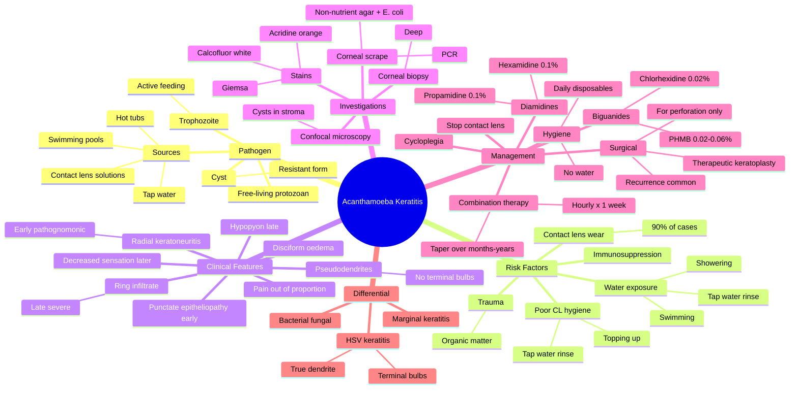

# Acanthamoeba Keratitis

Related: [[Bacterial Keratitis]], [[Fungal Keratitis]], [[Contact Lens Hygiene]]

> [!tip] **FCPS/MRCP Priority: MEDIUM**
> Severe pain OUT OF PROPORTION to signs. Contact lens + water exposure. Diagnostic delay is common. Treat with biguanides (PHMB, chlorhexidine) + diamidines.

---

## Learning Objectives
- [ ] Define Acanthamoeba keratitis and identify the causative organism
- [ ] Describe the two morphological forms (trophozoite and cyst)
- [ ] Recognise contact lens wear + water exposure as the most important risk factor
- [ ] Identify the hallmark clinical feature: pain out of proportion to signs
- [ ] Distinguish radial keratoneuritis (early) from ring infiltrate (late)
- [ ] List appropriate investigations (corneal scrape, PCR, confocal microscopy)
- [ ] Outline evidence-based treatment with biguanides and diamidines
- [ ] Justify the need for prolonged treatment and prevention counselling

---

## 1. Definition

- **Acanthamoeba keratitis (AK):** Corneal infection by free-living amoeba (Acanthamoeba species)
- Most common in contact lens wearers exposed to contaminated water

## 2. Pathogen

- **Acanthamoeba:** Free-living protozoan, two forms: trophozoite (active) and cyst (resistant)
- Found in: tap water, swimming pools, hot tubs, lakes, showers, contact lens solutions

## 3. Risk Factors

- **Contact lens wear** (90%+ of cases)
- **Exposure to contaminated water** (swimming, showering in CL)
- **Poor CL hygiene** (topping up solution, using tap water to rinse)
- Trauma (organic matter)
- Immunosuppression

## 4. Clinical Features

- **Severe pain OUT OF PROPORTION to signs** (key)
- Red eye, photophobia, lacrimation
- Early: punctate epitheliopathy, **pseudodendrites** (no terminal bulbs)
- **Radial keratoneuritis** (perineural infiltrate) — pathognomonic early
- **Ring infiltrate** (late, severe)
- Disciform stromal oedema
- Hypopyon
- Decreased corneal sensation (later)
- Slow progression (often misdiagnosed as HSV)

## 5. Investigations

- **Corneal scrape:** Non-nutrient agar with **E. coli** (amoebic trails), PCR
- **Confocal microscopy** (cysts in stroma)
- **Corneal biopsy** (deep)
- Stains: calcofluor white, Giemsa, acridine orange

## 6. Differential Diagnosis

- **HSV keratitis:** Dendrite with terminal bulbs, less severe pain
- **Bacterial/fungal:** Different pattern
- **Marginal keratitis**

## 7. Management

### Medical
- **Biguanides:**
  - **Polyhexamethylene biguanide (PHMB) 0.02–0.06%** — first-line
  - **Chlorhexidine 0.02%** — alternative
- **Diamidines:**
  - **Propamidine (Brolene) 0.1%**
  - **Hexamidine 0.1%**
- Combined therapy, hourly × 1 week, then taper
- Treatment: **months** to years
- **Cycloplegia** for comfort
- **Stop contact lens** permanently (or refit with daily disposable and rigorous hygiene)

### Surgical
- **Therapeutic keratoplasty** (only when infection cleared) for visual rehabilitation or perforation
- Recurrence in graft is common

## 8. Complications

- Corneal scarring → permanent visual loss
- Corneal perforation
- Secondary bacterial or fungal superinfection
- Recurrence of infection in corneal graft
- Cataract (chronic inflammation, steroid use)
- Secondary glaucoma

## 9. Red Flags / Emergencies

- Severe pain out of proportion to early slit-lamp findings (high index of suspicion in CL wearers)
- Radial keratoneuritis on slit-lamp (pathognomonic early sign)
- Ring infiltrate (late, severe)
- Diagnostic delay >2 weeks is associated with worse visual outcome
- Clinical deterioration despite topical steroid/antiviral therapy
- Suspected perforation (Descemetocele, positive Seidel test)

## 10. FCPS/MRCP High-Yield Summary

| Topic | Key Points |
|-------|------------|
| Risk factor | Contact lens + water |
| Hallmark | Pain out of proportion to signs |
| Early sign | Radial keratoneuritis |
| Late sign | Ring infiltrate |
| Treatment | PHMB + propamidine (months) |
| Hygiene | No water exposure, daily disposables |

## 11. Viva Questions

1. **Q:** What is the hallmark of Acanthamoeba keratitis?
   **A:** Pain out of proportion to signs.

2. **Q:** What is the most important risk factor?
   **A:** Contact lens wear, especially with water exposure (swimming, showering in CL, rinsing with tap water).

3. **Q:** What is radial keratoneuritis?
   **A:** Inflammatory infiltrate along corneal nerves — early pathognomonic sign of Acanthamoeba keratitis.

4. **Q:** Why is combination therapy used?
   **A:** Biguanides (PHMB/chlorhexidine) target the cyst wall; diamidines (propamidine/hexamidine) target the trophozoite. Combination is synergistic and prevents resistance.

5. **Q:** What is the role of corneal transplant?
   **A:** Therapeutic keratoplasty is reserved for visual rehabilitation after infection is cleared, or for perforation. Recurrence in the graft is common.

## 12. Common Confusions / Exam Traps

| Confusion | Clarification |
|-----------|---------------|
| "AK always presents with hypopyon" | Hypopyon is a LATE finding; early disease may have minimal signs |
| "AK and HSV dendrite are the same" | AK has PSEUDODENDRITES (no terminal bulbs, "stuck-on"); HSV has TRUE DENDRITES with terminal bulbs |
| "AK is rare" | Incidence is increasing with CL wear; high index of suspicion in CL wearers with pain-sign mismatch |
| "AK can be treated with aciclovir" | AK does NOT respond to antivirals; requires biguanides + diamidines |
| "AK resolves in days" | Treatment takes months to years; cysts are highly resistant |
| "Stop contact lens and resume after 1 month" | Daily disposable lenses may be resumed ONLY after full resolution with strict no-water hygiene |
| "Acanthamoeba is a bacterium" | It is a free-living PROTOZOAN with two forms: trophozoite (active) and cyst (resistant) |

## 13. Mnemonics

1. **"Acanthamoeba = AWESOME Pain"** — **A**moeba, **W**ater + contact lens, **E**ye pain out of proportion, **S**lit-lamp quiet early, **O**nset days–weeks, **M**onths of treatment, **E**xam trap
2. **"RADIAL PERINEURITIS = early Acanthamoeba"** — RAdial keratoneuritis is pathognomonic EARLY
3. **"RING = late Acanthamoeba"** — Ring infiltrate is the LATE, severe form

## 14. Mind Map

## 15. One-Page Revision Card

| **Topic** | **Acanthamoeba Keratitis** |
|-----------|----------------------------|
| **Pathogen** | Free-living amoeba; trophozoite + cyst |
| **Most important risk factor** | Contact lens wear + water exposure |
| **Hallmark feature** | Pain out of proportion to signs |
| **Early sign (pathognomonic)** | Radial keratoneuritis |
| **Late sign** | Ring infiltrate |
| **Dendrite** | Pseudodendrite (NO terminal bulbs) |
| **First-line treatment** | PHMB 0.02–0.06% + propamidine 0.1% |
| **Treatment duration** | Months to years |
| **Prevention** | No water exposure; daily disposables |
| **Viva Pearl** | Pain out of proportion in CL wearer = Acanthamoeba until proven otherwise |

---

## Spaced Repetition Trackers

### 24-Hour Recall Prompts
- [ ] Define Acanthamoeba keratitis and name the most important risk factor
- [ ] Describe the hallmark clinical feature
- [ ] Differentiate radial keratoneuritis from ring infiltrate (timing)
- [ ] List first-line medical treatment
- [ ] Explain why combination therapy (biguanide + diamidine) is used
- [ ] State key prevention advice for contact lens wearers
- [ ] Identify why Acanthamoeba is often misdiagnosed as HSV

### Revision Schedule
- [ ] **Day 1** completed (creation + 24h recall)
- [ ] **Day 3** revision completed
- [ ] **Day 7** revision completed
- [ ] **Day 15** revision completed
- [ ] **Day 30** revision completed
- [ ] **Day 90** revision completed

## Must Know / Should Know / Nice to Know

### Must Know (Core for passing)
- [x] Pain out of proportion to signs is the hallmark
- [x] Contact lens wear + water exposure is the most important risk factor
- [x] Radial keratoneuritis is the early pathognomonic sign
- [x] Ring infiltrate is the late sign
- [x] First-line treatment: PHMB + propamidine (combination, prolonged)

### Should Know (High probability)
- [x] Acanthamoeba is a free-living protozoan with trophozoite and cyst forms
- [x] AK pseudodendrites lack terminal bulbs (vs HSV true dendrite)
- [x] Investigations: PCR, non-nutrient agar with E. coli, confocal microscopy
- [x] Prevention: no water exposure, daily disposable CL, hand hygiene

### Nice to Know (Differentiator)
- [ ] Confocal microscopy can visualise cysts in vivo
- [ ] Non-nutrient agar with E. coli shows "amoebic trails"
- [ ] Calcofluor white stains cysts
- [ ] Therapeutic keratoplasty has high recurrence rate in graft
- [ ] Diagnostic delay >2 weeks worsens visual outcome

## My Weak Points
- [ ] Add personal weak areas here

## Self-Test Scorecard

| Section | Score /5 |
|---------|----------|
| Understanding: | /10 |
| Recall: | /10 |
| MCQ Performance: | /10 |
| SBA Performance: | /10 |
| Viva Confidence: | /10 |
| Total: | /50 |

> [!tip] **Interpretation:** <35 = weak topic, 35-44 = acceptable but insecure, 45+ = strong exam-ready topic.

## Exam Answer Modes

### Long Answer Skeleton
1. **Definition:** Corneal infection by free-living amoeba Acanthamoeba (protozoan with trophozoite and cyst forms)
2. **Epidemiology:** Mostly in contact lens wearers (90%+)
3. **Risk factors:** Contact lens wear, water exposure (swimming, showering in CL, tap water rinse), poor CL hygiene
4. **Pathogenesis:** Cysts adhere to cornea via mannose-binding protein; penetrate through micro-trauma; resistant to many disinfectants
5. **Clinical features:** Pain OUT OF PROPORTION to signs; early punctate epitheliopathy and pseudodendrites; radial keratoneuritis (early pathognomonic); ring infiltrate (late)
6. **Investigations:** PCR (most sensitive), non-nutrient agar with E. coli, confocal microscopy, calcofluor white stain
7. **Differential:** HSV keratitis (true dendrite with terminal bulbs), bacterial/fungal keratitis, marginal keratitis
8. **Management:**
   - Medical: PHMB 0.02–0.06% + propamidine 0.1% (biguanide + diamidine), hourly × 1 week, taper over months
   - Cycloplegia, lubrication
   - Stop contact lens permanently
   - Surgical: therapeutic keratoplasty for perforation or visual rehabilitation (high recurrence)
9. **Prevention:** No water exposure, daily disposables, hand hygiene, no "topping up" solutions

### Short Note Skeleton
- **Definition + risk factor** (CL wear + water exposure)
- **Hallmark:** pain out of proportion to signs
- **Early sign:** radial keratoneuritis
- **Late sign:** ring infiltrate
- **Treatment:** PHMB + propamidine, months

### Viva One-Liners
- **Q:** Hallmark feature? → **A:** Pain out of proportion to signs
- **Q:** Most important risk factor? → **A:** Contact lens wear + water exposure
- **Q:** Early pathognomonic sign? → **A:** Radial keratoneuritis (perineural infiltrate)
- **Q:** Late sign? → **A:** Ring infiltrate
- **Q:** First-line treatment? → **A:** PHMB 0.02–0.06% + propamidine 0.1% (biguanide + diamidine)
- **Q:** Why combination therapy? → **A:** Biguanides target cyst wall; diamidines target trophozoite
- **Q:** How does Acanthamoeba differ from HSV? → **A:** Pseudodendrite (no terminal bulbs); pain out of proportion; CL history; non-response to aciclovir

### Ward-Case Discussion Points
- Take a careful contact lens history (type, hygiene, water exposure)
- Always consider AK in a CL wearer with pain-sign mismatch
- Stop contact lens and do not refit until fully resolved
- Avoid topical steroids in early disease
- Counsel on prevention: no water exposure, daily disposables, no "topping up"

### Last-Night-Before-Exam Sheet
- Top 3 facts: CL + water, pain out of proportion, PHMB + propamidine
- 1 mnemonic: "Acanthamoeba = AWESOME Pain"
- Must-know differential: HSV (true dendrite with terminal bulbs)
- Early sign: radial keratoneuritis; late sign: ring infiltrate
- Prevention: no water, daily disposables, no topping up

## Summary

Acanthamoeba keratitis is a sight-threatening corneal infection caused by a free-living protozoan with active (trophozoite) and resistant (cyst) forms. It is most commonly seen in contact lens wearers exposed to contaminated water (swimming, showering in CL, rinsing with tap water). The hallmark clinical feature is **pain out of proportion to signs**. Early pathognomonic sign is **radial keratoneuritis** (perineural infiltrate); late sign is **ring infiltrate**. Diagnosis is by PCR, confocal microscopy, and culture on non-nutrient agar with E. coli. First-line treatment is prolonged combination therapy with **PHMB (biguanide) + propamidine (diamidine)** for months. Therapeutic keratoplasty is reserved for perforation or visual rehabilitation, with high recurrence. Prevention includes no water exposure, daily disposable lenses, and strict hygiene.

## MCQs (10)

1. **Question:** The hallmark clinical feature of Acanthamoeba keratitis is:
   **Options:** A. Pain out of proportion to signs B. Severe itching C. Purulent discharge D. Diplopia E. Marked visual loss at presentation
   **Answer:** A
   **Explanation:** Pain out of proportion to clinical signs is the classic hallmark — high index of suspicion in CL wearers.

2. **Question:** Acanthamoeba keratitis is most associated with:
   **Options:** A. Trauma B. Contact lens wear + water exposure C. Ocular surgery D. Allergy E. Glaucoma
   **Answer:** B
   **Explanation:** Contact lens wear with water exposure accounts for >90% of cases.

3. **Question:** The first-line treatment of Acanthamoeba keratitis is:
   **Options:** A. Topical steroid alone B. Oral aciclovir C. PHMB + propamidine D. Fortified cefazolin E. Fluconazole
   **Answer:** C
   **Explanation:** Biguanide (PHMB) + diamidine (propamidine) combination therapy is first-line.

4. **Question:** The early pathognomonic slit-lamp sign of Acanthamoeba keratitis is:
   **Options:** A. Dendritic ulcer with terminal bulbs B. Radial keratoneuritis C. Ring infiltrate D. Geographic ulcer E. Hypopyon
   **Answer:** B
   **Explanation:** Radial keratoneuritis (perineural infiltrate) is the early pathognomonic sign.

5. **Question:** Acanthamoeba exists in which two forms?
   **Options:** A. Spore and hyphae B. Trophozoite and cyst C. Budding yeast and pseudohyphae D. Gram-positive and gram-negative E. Latent and lytic
   **Answer:** B
   **Explanation:** Trophozoite (active, feeding) and cyst (resistant, dormant) — cysts are highly resistant to disinfectants.

6. **Question:** A 25-year-old contact lens wearer has pain out of proportion to signs, with pseudodendrites on slit-lamp but no terminal bulbs. The most likely diagnosis is:
   **Options:** A. HSV epithelial keratitis B. Acanthamoeba keratitis C. Bacterial keratitis D. Fungal keratitis E. Marginal keratitis
   **Answer:** B
   **Explanation:** CL + pain out of proportion + pseudodendrites (no terminal bulbs) = Acanthamoeba.

7. **Question:** In the investigation of Acanthamoeba keratitis, non-nutrient agar is typically cultured with:
   **Options:** A. Sheep blood B. E. coli C. Sabouraud broth D. Chocolate agar overlay E. None
   **Answer:** B
   **Explanation:** Non-nutrient agar seeded with E. coli is used to grow Acanthamoeba (it feeds on the bacteria, producing "amoebic trails").

8. **Question:** The late, severe slit-lamp sign of Acanthamoeba keratitis is:
   **Options:** A. Dendritic ulcer B. Ring infiltrate C. Radial keratoneuritis D. Hypopyon only E. Pseudomembrane
   **Answer:** B
   **Explanation:** Ring infiltrate is a LATE, severe sign indicating deep stromal infection.

9. **Question:** The most sensitive investigation for Acanthamoeba keratitis is:
   **Options:** A. Gram stain B. KOH mount C. PCR of corneal scrape D. Blood agar culture E. Schirmer test
   **Answer:** C
   **Explanation:** PCR of corneal scrape is the most sensitive and specific investigation.

10. **Question:** Acanthamoeba keratitis is best prevented by:
    **Options:** A. Daily topical steroids B. Weekly oral aciclovir C. Avoiding water exposure with contact lenses D. Use of preserved tear drops E. Routine topical antibiotic
    **Answer:** C
    **Explanation:** Prevention: avoid water exposure (swimming, showering in CL), use daily disposables, do not "top up" solution, hand hygiene.

## SBA Questions (10)

1. **Scenario:** A 25-year-old contact lens wearer has severe pain in the eye but minimal slit-lamp findings.
   **Question:** Most likely diagnosis?
   **Options:** A. Bacterial keratitis B. HSV keratitis C. Acanthamoeba keratitis D. Fungal keratitis E. Allergic conjunctivitis
   **Answer:** C
   **Explanation:** Pain out of proportion to signs in CL wearer = Acanthamoeba.

2. **Scenario:** A 28-year-old soft contact lens wearer presents with a 3-week history of red eye, severe pain, photophobia. Slit-lamp shows a pseudodendritic lesion WITHOUT terminal bulbs and a radial perineural infiltrate.
   **Question:** Most likely diagnosis?
   **Options:** A. HSV epithelial keratitis B. Herpes zoster keratitis C. Acanthamoeba keratitis D. Fungal keratitis E. Bacterial keratitis
   **Answer:** C
   **Explanation:** Pseudodendrite (no bulbs) + radial keratoneuritis = Acanthamoeba.

3. **Scenario:** A 30-year-old contact lens wearer is diagnosed with Acanthamoeba keratitis. He admits to swimming and showering with his contact lenses in place.
   **Question:** Most appropriate first-line treatment?
   **Options:** A. Topical aciclovir 5×/day B. Topical prednisolone C. Topical PHMB + propamidine hourly D. Topical natamycin E. Topical moxifloxacin
   **Answer:** C
   **Explanation:** PHMB + propamidine combination, hourly initially, is the first-line treatment.

4. **Scenario:** A patient with Acanthamoeba keratitis has been on PHMB + propamidine for 6 months. The infiltrate is now stable with a ring scar and vision 6/60. There is no active inflammation. The patient is unhappy with the vision.
   **Question:** Most appropriate next step?
   **Options:** A. Continue intensive antifungal B. Add topical steroid C. Consider optical/therapeutic keratoplasty after infection cleared D. Stop all treatment E. Add oral antifungal
   **Answer:** C
   **Explanation:** Infection is cleared, vision limited by scar — consider keratoplasty for visual rehabilitation. Recurrence in graft is common.

5. **Scenario:** A contact lens wearer with suspected Acanthamoeba keratitis has a corneal scrape sent for investigation. The microbiology lab is asked to culture on non-nutrient agar. With what should the agar be seeded?
   **Options:** A. Sheep blood B. E. coli C. Candida D. Sabouraud broth E. None
   **Answer:** B
   **Explanation:** Non-nutrient agar with E. coli is used to grow Acanthamoeba (which feeds on E. coli, producing "amoebic trails").

6. **Scenario:** A 22-year-old contact lens wearer is being treated for Acanthamoeba keratitis. She is using PHMB + propamidine, with the dose being tapered. How long should treatment be continued?
   **Options:** A. 1 week B. 1 month C. 3 months D. Months to years E. 10 days
   **Answer:** D
   **Explanation:** Treatment is prolonged (months to years) because cysts are highly resistant; must be continued until full resolution.

7. **Scenario:** A 24-year-old contact lens wearer presents with severe eye pain but minimal slit-lamp findings. Acanthamoeba is suspected. Confocal microscopy is performed.
   **Question:** What finding is most likely?
   **Options:** A. Branching hyphae B. Budding yeasts C. Cysts (double-walled) in stroma D. Gram-negative rods E. Pseudohyphae
   **Answer:** C
   **Explanation:** Confocal microscopy shows Acanthamoeba cysts (double-walled, highly refractile) in the corneal stroma.

8. **Scenario:** A 27-year-old contact lens wearer with Acanthamoeba keratitis is being treated with PHMB + propamidine. He asks when he can resume contact lens wear.
   **Question:** Most appropriate advice?
   **Options:** A. Resume in 1 week B. Resume in 1 month C. After full resolution, daily disposables only with strict no-water hygiene D. Resume when infiltrate resolves E. Never resume
   **Answer:** C
   **Explanation:** After full resolution, daily disposables may be resumed with strict no-water hygiene, hand washing, and no "topping up" of solution.

9. **Scenario:** A 26-year-old contact lens wearer has been treated for "HSV keratitis" with aciclovir for 3 weeks, with no improvement. Slit-lamp shows a ring infiltrate. CL history reveals showering in lenses.
   **Question:** Most likely correct diagnosis?
   **Options:** A. Treatment-resistant HSV B. Fungal keratitis C. Acanthamoeba keratitis D. Bacterial keratitis E. Marginal keratitis
   **Answer:** C
   **Explanation:** CL + water + ring infiltrate + no response to aciclovir = Acanthamoeba (commonly misdiagnosed as HSV).

10. **Scenario:** A 25-year-old contact lens wearer is diagnosed with Acanthamoeba keratitis. The microbiology registrar asks which stain to use on the corneal scrape to highlight cysts.
    **Question:** Most appropriate stain?
    **Options:** A. Gram stain B. KOH wet mount C. Calcofluor white D. India ink E. Congo red
    **Answer:** C
    **Explanation:** Calcofluor white binds chitin in the cyst wall and fluoresces under UV light — a useful rapid stain for Acanthamoeba.

## Flashcards

- **Q:** What is the hallmark clinical feature of Acanthamoeba keratitis?
  **A:** Pain out of proportion to signs (in a contact lens wearer with otherwise minimal slit-lamp findings).
- **Q:** What is the most important risk factor for Acanthamoeba keratitis?
  **A:** Contact lens wear, especially with water exposure (swimming, showering in CL, rinsing with tap water).
- **Q:** What is the early pathognomonic sign of Acanthamoeba keratitis?
  **A:** Radial keratoneuritis (perineural infiltrate along corneal nerves).
- **Q:** What is the late severe sign of Acanthamoeba keratitis?
  **A:** Ring infiltrate (in the deep stroma, indicating severe established disease).
- **Q:** What is the first-line treatment for Acanthamoeba keratitis?
  **A:** Topical PHMB 0.02–0.06% (biguanide) + propamidine 0.1% (diamidine), hourly × 1 week, then taper over months to years.

## Answer Key with Explanations

### MCQs
1. A — Pain out of proportion to signs is the hallmark of Acanthamoeba keratitis
2. B — Contact lens wear + water exposure is the most important risk factor
3. C — PHMB + propamidine combination is first-line
4. B — Radial keratoneuritis is the early pathognomonic sign
5. B — Trophozoite (active) and cyst (resistant) are the two morphological forms
6. B — CL + pain out of proportion + pseudodendrites (no bulbs) = Acanthamoeba
7. B — Non-nutrient agar is seeded with E. coli to culture Acanthamoeba
8. B — Ring infiltrate is the late, severe sign of Acanthamoeba keratitis
9. C — PCR of corneal scrape is the most sensitive investigation
10. C — Prevention = no water exposure, daily disposables, no topping up

### SBAs
1. C — CL wearer + pain out of proportion = Acanthamoeba
2. C — Pseudodendrite (no bulbs) + radial keratoneuritis = Acanthamoeba
3. C — PHMB + propamidine hourly is first-line
4. C — Infection cleared, scar limits vision → consider keratoplasty
5. B — Non-nutrient agar is seeded with E. coli
6. D — Treatment takes months to years (cysts are highly resistant)
7. C — Confocal microscopy shows double-walled cysts in stroma
8. C — Resume CL only after full resolution with strict hygiene
9. C — CL + water + ring infiltrate + aciclovir failure = Acanthamoeba
10. C — Calcofluor white stains cyst walls (chitin) under UV light

## Tags
#medicine #davidson #ophthalmology #acanthamoeba #keratitis #fcps #mrcp

## PasTest Scenario SBAs (Clinical Vignettes)

> **Auto-generated PasTest/Mediscope-style scenario SBAs** grounded in the authored source. Each scenario tests a real clinical fact (triad, specific sign, contraindication, trial, first-line Rx) extracted from the topic. *Source: Ch 28: Medical Ophthalmology — Acanthamoeba Keratitis*

**Q1.** Which of the following features is most specific or characteristic of Acanthamoeba Keratitis?

  - **A.** Severe pain OUT OF PROPORTION to signs
  - **B.** A feature common to many acute inflammatory conditions
  - **C.** A non-specific sign that does not localise the diagnosis
  - **D.** An investigation finding rather than a clinical feature

  > **Answer: A** — Severe pain OUT OF PROPORTION to signs
  >
  > *Source:* **Severe pain OUT OF PROPORTION to signs** (key)
- Red eye, photophobia, lacrimation
- Early: punctate epitheliopathy, **pseudodendrites** (no terminal bulbs)
- **Radial keratoneuritis** (perineural i

