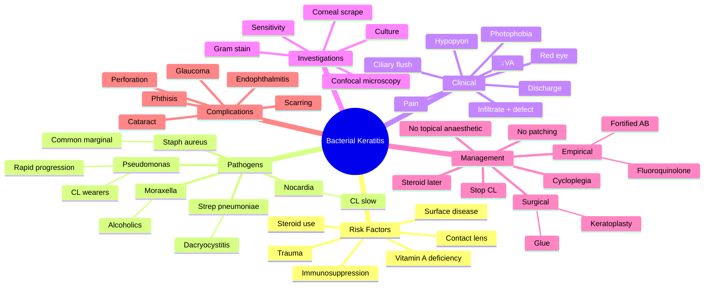

# Bacterial Keratitis

Related: [[Viral Keratitis (HSV)]], [[Fungal Keratitis]], [[Acanthamoeba Keratitis]], [[Corneal Ulcer]]

> [!tip] **FCPS/MRCP Priority: CRITICAL**
> Ocular emergency. Painful red eye + ↓VA + corneal infiltrate = bacterial keratitis until proven otherwise. Most common in contact lens wearers. Empirical fortified antibiotics.

---

## Learning Objectives

- [ ] Define bacterial keratitis and recognise it as an ophthalmologic emergency
- [ ] Identify the major risk factors (contact lens wear, trauma, ocular surface disease)
- [ ] List the common causative organisms (Pseudomonas in CL wearers, Staph, Strep, Moraxella)
- [ ] Describe the clinical features and slit-lamp findings
- [ ] Plan appropriate investigations (corneal scrape, culture, sensitivity)
- [ ] Initiate empirical treatment with fortified antibiotics or fluoroquinolones
- [ ] Recognise complications (perforation, scarring) and surgical options (glue, keratoplasty)
- [ ] Apply infection-control measures and prevention (CL hygiene, no overnight wear)

---

## 1. Definition

- **Bacterial keratitis (microbial keratitis):** Infection of the cornea with bacteria
- Vision-threatening; can progress to perforation
- True ophthalmologic emergency

---

## 2. Risk Factors

- **Contact lens wear** (most important, especially overnight/extended wear)
- Trauma (corneal abrasion, foreign body)
- Ocular surface disease (dry eye, lid malposition)
- Topical steroid use (immunosuppression)
- Immunosuppression (systemic)
- Lagophthalmos, exposure
- Previous corneal surgery (refractive, graft)
- Vitamin A deficiency
- Diabetes mellitus, chronic illness
- Chronic dacryocystitis (Strep pneumoniae)

---

## 3. Pathogens

|| Organism | Notes |
|----------|-------|
| **Pseudomonas aeruginosa** | Most common in CL wearers, severe, rapid progression |
| **Staph aureus** | Common, often marginal |
| **Strep pneumoniae** | Often with dacryocystitis, rapid ulceration |
| **Moraxella** | Alcoholics, debilitated, indolent |
| **Strep viridans** | Associated with CL |
| **Nocardia, Mycobacteria** | CL-associated, slowly progressive |

---

## 4. Pathophysiology

- Bacterial entry via epithelial defect (microtrauma, CL wear, dry eye)
- Adherence and invasion of stroma
- Neutrophil infiltration → stromal melt (collagenase / protease activity)
- Severe cases: descemetocoele, perforation
- Pseudomonal proteases → rapid stromal melting (within 24–48 hours)
- Hypopyon: sterile anterior chamber exudate (corneal inflammation, not necessarily endophthalmitis)

---

## 5. Clinical Features

- **Pain, photophobia, lacrimation**
- **Red eye, ↓VA**
- **Discharge** (mucopurulent)
- **Corneal infiltrate** (white spot, focal) + **overlying epithelial defect** (stains with fluorescein)
- **Hypopyon** (severe — sterile or infectious)
- **Ciliary flush** (limbal injection)
- **± Lid swelling**

### Slit-lamp Signs
- Stromal infiltrate with feathery/defined edges
- Stromal oedema, loss of clarity
- AC reaction (cells, flare, hypopyon)
- Loss of corneal sensation (severe, esp. Pseudomonas, Acanthamoeba)

---

## 6. Investigations

- **Corneal scrape** for Gram stain, culture (bacterial, fungal, Acanthamoeba), sensitivity
  - Bedside plating on blood agar, chocolate, Sabouraud, thioglycolate, non-nutrient agar with E. coli (Acanthamoeba)
- PCR (selected)
- **In vivo confocal microscopy** (Acanthamoeba, fungal)
- Anterior segment OCT (corneal thickness, infiltrate depth)
- B-scan ultrasound (if view of posterior segment obscured)

---

## 7. Differential Diagnosis

|| Condition | Distinguishing |
|-----------|---------------|
| **Viral keratitis (HSV)** | Dendritic ulcer, ↓corneal sensation, unilateral |
| **Fungal keratitis** | Feathery edges, satellite lesions, slower, trauma with vegetable matter |
| **Acanthamoeba keratitis** | Severe pain out of proportion, ring infiltrate, CL wear + water exposure |
| **Marginal keratitis** | Sterile, peripheral, hypersensitivity to staph |
| **Sterile infiltrate (CL-related)** | Small, peripheral, less pain, no epithelial break |
| **Peripheral ulcerative keratitis** | Systemic autoimmune disease (RA, GPA) |
| **Acute anterior uveitis** | Pain, photophobia, no corneal infiltrate |

---

## 8. Management

### Empirical (Before Culture)
- **Fortified antibiotics** (hourly around the clock)
  - **Cefazolin 5%** (or vancomycin) + **Tobramycin 1.4%** (or gentamicin/ciprofloxacin)
  - Or monotherapy with **fluoroquinolone (moxifloxacin, gatifloxacin, ciprofloxacin) 0.5%**
- **Cycloplegia** (atropine 1%, homatropine 2%) — pain, prevent synechiae
- **No patching** (worsens infection)
- **Topical steroid** — only after infection controlled, on ophthalmologist's advice

### Specific (After Culture)
- **Pseudomonas:** Fluoroquinolone or aminoglycoside
- **Staph (MSSA/MRSA):** Cefazolin / vancomycin
- **Strep:** Penicillin G
- **Nocardia:** Amikacin, sulfonamides
- **Mycobacteria:** Amikacin, clarithromycin

### Surgical
- **Therapeutic keratoplasty** (corneal transplant) for perforation or non-resolving
- **Cyanoacrylate glue + BCL** for small perforations
- **Tarsorrhaphy** (adjunctive)
- Amniotic membrane transplantation (for non-healing epithelium)

### Supportive
- Stop contact lens
- Analgesia
- Tetanus prophylaxis (if trauma)
- No topical anaesthetic for pain (toxic to epithelium)
- Daily review until improvement; then tail therapy

---

## 9. Complications

- **Corneal perforation** (emergency — keratoplasty / glue)
- **Corneal scarring** (visual loss)
- **Descemetocoele** (localised thinning, impending perforation)
- **Endophthalmitis** (extension into globe)
- **Cataract** (steroid use)
- **Glaucoma** (peripheral anterior synechiae, steroid response)
- **Phthisis bulbi** (severe, end-stage)
- Recurrence

---

## 10. Red Flags / Emergencies

- **Painful red eye + ↓VA + corneal infiltrate** = bacterial keratitis until proven otherwise
- Hypopyon
- Descemetocoele / perforation
- Ring infiltrate (Acanthamoeba)
- Post-surgical / post-trauma keratitis
- CL wearer with red eye
- Rapid progression
- Neonatal keratitis (consider Neisseria gonorrhoeae)

---

## 11. FCPS/MRCP High-Yield Summary

|| Topic | Key Points |
|-------|------------|
| Most common (CL wearer) | Pseudomonas |
| Risk factor | Contact lens (overnight) |
| Treatment (empirical) | Fortified cefazolin + tobramycin, or fluoroquinolone |
| Cycloplegia | Atropine for pain and to prevent synechiae |
| Steroids | After infection controlled, by ophthalmologist only |
| Perforation | Glue, therapeutic keratoplasty |
| Hypopyon | Sterile AC reaction (most cases) |
| No patching | Worsens infection |
| Corneal scrape | Before starting empirical therapy (if possible) |

---

## 12. Viva Questions

1. **Q:** How do you diagnose bacterial keratitis?
   **A:** Slit-lamp: corneal infiltrate + epithelial defect (fluorescein staining). Corneal scrape for Gram stain, culture, sensitivity.

2. **Q:** What is the most common cause of bacterial keratitis in a contact lens wearer?
   **A:** Pseudomonas aeruginosa.

3. **Q:** When can topical steroids be used in bacterial keratitis?
   **A:** Only after the infection is controlled, by an ophthalmologist, to reduce scarring — never first-line.

4. **Q:** What is a hypopyon in bacterial keratitis?
   **A:** A layer of white cells in the anterior chamber — usually a sterile inflammatory reaction; rarely indicates endophthalmitis in keratitis alone.

5. **Q:** How do you manage a small corneal perforation?
   **A:** Cyanoacrylate tissue glue + bandage contact lens ± therapeutic keratoplasty for larger perforations.

---

## 13. Common Confusions / Exam Traps

|| Confusion | Clarification |
|-----------|---------------|
| "Hypopyon = endophthalmitis" | Hypopyon in bacterial keratitis is usually sterile AC reaction; endophthalmitis is a separate entity with vitreous involvement. |
| "Topical steroid first-line" | NEVER as first-line; only after infection controlled, by ophthalmologist. |
| "Patch the eye" | NEVER — patching worsens infection by creating a warm, moist environment. |
| "Topical anaesthetic for pain" | NEVER for prolonged use — toxic to epithelium, delays healing. |
| "All corneal ulcers are bacterial" | Fungal, Acanthamoeba, viral (HSV) must be considered — history (vegetable trauma, CL + water, dendritic) guides. |
| "CL wear is safe" | Overnight / extended wear is the biggest risk factor for Pseudomonas keratitis. |
| "Fortified antibiotics always required" | Fluoroquinolone monotherapy is acceptable for small / peripheral ulcers; fortified for severe / central / large. |
| "Pseudomonas is slow" | Opposite — rapid progression; can perforate within 24–48 hours. |
| "Corneal scrape after antibiotics" | Ideally BEFORE starting empirical therapy; if not, take scrape first then start. |
| "Acanthamoeba is treated like bacterial" | Acanthamoeba needs specific therapy: polyhexamethylene biguanide (PHMB), chlorhexidine, propamidine, diamidines. |

---

## 14. Mnemonics

1. **"Bacterial Keratitis = Pain, Photophobia, ↓VA, Infiltrate, Defect"** — **P-P-D-I-D**: the five cardinal features.
2. **"CL wearer = Pseudomonas"** — most common organism, most severe, rapid progression.
3. **"No Patch, No Steroid First, No Anaesthetic"** — three DON'Ts in bacterial keratitis.

---

## 15. Mind Map

---

## 16. One-Page Revision Card

|| **Topic** | **Bacterial Keratitis** |
|-----------|-------------------------|
|| **Definition** | Bacterial infection of cornea; ocular emergency |
|| **Most Important Risk Factor** | Contact lens (esp. overnight) |
|| **Most Common Organism (CL wearer)** | Pseudomonas aeruginosa |
|| **Cardinal Features** | Pain, photophobia, ↓VA, infiltrate, epithelial defect |
|| **Slit-Lamp Sign** | Stromal infiltrate + fluorescein-staining defect + hypopyon |
|| **Investigation** | Corneal scrape → Gram stain, culture, sensitivity |
|| **Empirical Treatment** | Fortified cefazolin + tobramycin OR fluoroquinolone monotherapy |
|| **Cycloplegia** | Atropine for pain + prevent synechiae |
|| **Avoid** | Patching, topical anaesthetic, steroid first-line |
|| **Perforation Management** | Cyanoacrylate glue + BCL; therapeutic keratoplasty |
|| **Viva Pearl** | Painful red eye + ↓VA + infiltrate + CL = bacterial until proven otherwise |

---

## Spaced Repetition Trackers

### 24-Hour Recall Prompts
- [ ] Define bacterial keratitis and identify the most common cause in contact lens wearers
- [ ] List the cardinal clinical features
- [ ] Outline the empirical treatment regimen
- [ ] State when topical steroids can be introduced
- [ ] Recall the management of a small corneal perforation

### Revision Schedule
- [ ] **Day 1** completed (creation + 24h recall)
- [ ] **Day 3** revision completed
- [ ] **Day 7** revision completed
- [ ] **Day 15** revision completed
- [ ] **Day 30** revision completed
- [ ] **Day 90** revision completed

---

## Must Know / Should Know / Nice to Know

### Must Know (Core for passing)
- [x] Definition and that it is an ocular emergency
- [x] Most common cause: Pseudomonas in CL wearers
- [x] Cardinal features: pain, ↓VA, photophobia, infiltrate + defect
- [x] Empirical treatment: fortified antibiotics OR fluoroquinolone
- [x] Cycloplegia with atropine
- [x] Avoid patching and topical anaesthetic
- [x] Hypopyon is usually sterile AC reaction

### Should Know (High probability)
- [x] Corneal scrape before empirical therapy
- [x] Topical steroid only after infection controlled
- [x] Surgical management of perforation (glue, keratoplasty)
- [x] Differential (fungal, Acanthamoeba, viral)
- [x] Risk factors (CL wear, trauma, dry eye, steroid, vitamin A deficiency)

### Nice to Know (Differentiator)
- [ ] Specific therapy: cefazolin / vancomycin (Staph), aminoglycoside / FQ (Pseudomonas)
- [ ] Acanthamoeba therapy (PHMB, chlorhexidine, propamidine)
- [ ] In vivo confocal microscopy
- [ ] Tetanus prophylaxis in trauma-related cases
- [ ] Amniotic membrane transplantation for non-healing epithelium

---

## My Weak Points
- [ ] Add personal weak areas here

---

## Self-Test Scorecard

|| Section | Score /5 |
|---------|----------|
|| Understanding: | /10 |
|| Recall: | /10 |
|| MCQ Performance: | /10 |
|| SBA Performance: | /10 |
|| Viva Confidence: | /10 |
|| Total: | /50 |

> [!tip] **Interpretation:** <35 = weak topic, 35-44 = acceptable but insecure, 45+ = strong exam-ready topic.

---

## Exam Answer Modes

### Long Answer Skeleton
1. Definition: bacterial infection of cornea, ocular emergency
2. Risk factors: CL wear (esp. overnight), trauma, dry eye, topical/systemic immunosuppression
3. Pathogens: Pseudomonas (CL), Staph aureus, Strep pneumoniae (with dacryocystitis), Moraxella (alcoholics)
4. Pathophysiology: epithelial defect → bacterial invasion → stromal melt (collagenase) → perforation
5. Clinical features: pain, photophobia, ↓VA, red eye, mucopurulent discharge, infiltrate, epithelial defect, hypopyon
6. Investigations: corneal scrape (Gram stain, culture, sensitivity), PCR, confocal microscopy
7. Management: empirical fortified antibiotics (cefazolin + tobramycin) or fluoroquinolone monotherapy, cycloplegia (atropine), no patching, no topical anaesthetic, steroids only after infection controlled
8. Surgical: cyanoacrylate glue + BCL for small perforation; therapeutic keratoplasty for larger
9. Complications: perforation, scarring, endophthalmitis, cataract, glaucoma
10. Prevention: CL hygiene, no overnight wear, avoid swimming in CL

### Short Note Skeleton
- Definition + ocular emergency
- Risk factor: CL wear (overnight) → Pseudomonas
- Cardinal features: pain, photophobia, ↓VA, infiltrate + defect
- Empirical treatment: fortified AB (cefazolin + tobramycin) or FQ
- Cycloplegia + no patching + no topical anaesthetic
- Perforation: glue + BCL or keratoplasty

### Viva One-Liners
- **Q:** Most common organism in CL wearer? → **A:** Pseudomonas aeruginosa.
- **Q:** Empirical treatment? → **A:** Fortified cefazolin + tobramycin, or fluoroquinolone monotherapy.
- **Q:** When can topical steroid be used? → **A:** Only after infection is controlled, by an ophthalmologist, to reduce scarring.
- **Q:** What is a hypopyon in keratitis? → **A:** Sterile AC reaction; not necessarily endophthalmitis.
- **Q:** Management of small perforation? → **A:** Cyanoacrylate tissue glue + bandage contact lens.

### Ward-Case Discussion Points
- Recognise bacterial keratitis as an ocular emergency
- Identify risk factors (CL wear, trauma, surface disease)
- Counsel on CL hygiene and avoidance of overnight wear
- Initiate empirical treatment and refer to ophthalmology
- Identify perforation and arrange glue / keratoplasty
- Differentiate from fungal, Acanthamoeba, viral keratitis by history

### Last-Night-Before-Exam Sheet
- Top 3 facts: Pseudomonas in CL wearer, fortified AB empirical, no patching / no anaesthetic / no steroid first
- 1 mnemonic: **"Pain, Photophobia, ↓VA, Infiltrate, Defect"** (P-P-D-I-D)
- Must-know management: empirical fortified cefazolin + tobramycin, or fluoroquinolone
- Must-know complication: corneal perforation → glue / keratoplasty

---

## Summary

Bacterial keratitis is an ocular emergency. Most common in contact lens wearers (Pseudomonas). Empirical treatment with fortified antibiotics (or fluoroquinolone) hourly, cycloplegia, and avoidance of patching. Corneal scrape guides specific therapy. Perforation requires glue or keratoplasty. Topical steroid is contraindicated as first-line; only after infection is controlled, by an ophthalmologist. Hypopyon is usually a sterile anterior chamber reaction. Prevention: contact lens hygiene, no overnight wear, avoid water exposure with CL.

## MCQs (10)

1. **Question:** The most common cause of bacterial keratitis in contact lens wearers is:
   **Options:** A. Staph aureus B. Strep pneumoniae C. Pseudomonas aeruginosa D. H. influenzae E. Moraxella
   **Answer:** C
   **Explanation:** Pseudomonas aeruginosa is the most common and most severe cause of bacterial keratitis in contact lens wearers (especially overnight wear).

2. **Question:** Empirical treatment of bacterial keratitis is:
   **Options:** A. Topical steroid B. Topical fortified antibiotics hourly C. Patching D. Wait for culture E. Lubricants only
   **Answer:** B
   **Explanation:** Empirical therapy is started with fortified antibiotics (cefazolin + tobramycin) or fluoroquinolone monotherapy, hourly around the clock. No patching, no steroid first-line.

3. **Question:** Cycloplegia in bacterial keratitis is used to:
   **Options:** A. Reduce infection B. Pain relief and prevent posterior synechiae C. Reduce IOP D. Improve vision E. None
   **Answer:** B
   **Explanation:** Atropine relieves ciliary spasm (pain) and prevents posterior synechiae in severe keratitis with AC reaction.

4. **Question:** A hypopyon in bacterial keratitis most commonly represents:
   **Options:** A. Corneal perforation B. Sterile anterior chamber reaction C. Acute glaucoma D. Vitreous haemorrhage E. Endophthalmitis
   **Answer:** B
   **Explanation:** Hypopyon in bacterial keratitis is usually a sterile inflammatory reaction in the anterior chamber; endophthalmitis is a separate diagnosis with vitreous involvement.

5. **Question:** Which of the following should be AVOIDED in suspected bacterial keratitis?
   **Options:** A. Fortified antibiotics B. Cycloplegia C. Topical anaesthetic D. Corneal scrape E. Referral
   **Answer:** C
   **Explanation:** Topical anaesthetic is toxic to corneal epithelium and delays healing — should not be prescribed for ongoing analgesia.

6. **Question:** The most important modifiable risk factor for bacterial keratitis is:
   **Options:** A. Diabetes B. Overnight contact lens wear C. Cataract D. Glaucoma E. Hypertension
   **Answer:** B
   **Explanation:** Overnight / extended contact lens wear is the most important modifiable risk factor; corneal hypoxia and microtrauma predispose to bacterial (especially pseudomonal) keratitis.

7. **Question:** The investigation of choice to confirm the causative organism in bacterial keratitis is:
   **Options:** A. Schirmer test B. Corneal scrape for Gram stain and culture C. Optical coherence tomography D. Visual fields E. Fundus fluorescein angiography
   **Answer:** B
   **Explanation:** Corneal scrape with Gram stain, culture, and sensitivity is the gold standard for identifying the organism and guiding specific therapy.

8. **Question:** Topical steroids in bacterial keratitis should be started:
   **Options:** A. As first-line treatment B. Only after infection is controlled, by an ophthalmologist C. In all cases D. With topical antibiotic from the start in all cases E. Never
   **Answer:** B
   **Explanation:** Topical steroids are added only after the infection is controlled, by an ophthalmologist, to reduce scarring — never first-line.

9. **Question:** A small corneal perforation in bacterial keratitis is best managed initially by:
   **Options:** A. Enucleation B. Evisceration C. Cyanoacrylate glue + bandage contact lens D. Topical antibiotic only E. Patching
   **Answer:** C
   **Explanation:** Cyanoacrylate tissue glue with a bandage contact lens is the first-line treatment for small perforations; therapeutic keratoplasty is used for larger or non-resolving perforations.

10. **Question:** Patching the eye in bacterial keratitis should be avoided because:
    **Options:** A. It causes pain B. It worsens infection by creating a warm, moist environment C. It is too expensive D. It is too difficult E. None
    **Answer:** B
    **Explanation:** Patching creates a warm, moist environment that promotes bacterial growth and worsens the infection.

## SBA Questions (10)

1. **Scenario:** A 25-year-old soft contact lens wearer presents with a 2-day history of painful red eye, photophobia, mucopurulent discharge, and reduced vision. Slit-lamp shows a central white corneal infiltrate with overlying epithelial defect and a small hypopyon.
   **Question:** What is the most appropriate initial treatment?
   **Options:** A. Topical steroid B. Topical fortified antibiotics hourly C. Patching the eye D. Oral aciclovir E. Lubricants only
   **Answer:** B
   **Explanation:** This is bacterial keratitis (CL wearer, pain, ↓VA, infiltrate + defect + hypopyon). Empirical fortified antibiotics (cefazolin + tobramycin) or fluoroquinolone monotherapy, hourly, is the initial treatment. No patching, no steroid first-line.

2. **Scenario:** A 30-year-old contact lens wearer with bacterial keratitis has not improved after 48 hours of empirical fortified antibiotics. A corneal scrape is taken. Gram stain shows Gram-negative rods.
   **Question:** The most likely organism is:
   **Options:** A. Staph aureus B. Pseudomonas aeruginosa C. Strep pneumoniae D. Moraxella E. Nocardia
   **Answer:** B
   **Explanation:** Gram-negative rods in a CL wearer = Pseudomonas aeruginosa.

3. **Scenario:** A 50-year-old alcoholic presents with an indolent corneal ulcer after minor trauma. Slit-lamp shows a peripheral infiltrate with minimal discharge.
   **Question:** The most likely organism is:
   **Options:** A. Pseudomonas B. Staph aureus C. Moraxella D. Strep viridans E. Acanthamoeba
   **Answer:** C
   **Explanation:** Moraxella is classically associated with alcoholics and debilitated patients, causing indolent peripheral keratitis.

4. **Scenario:** A 60-year-old with chronic dacryocystitis develops a rapid, deep, central corneal ulcer.
   **Question:** The most likely organism is:
   **Options:** A. Pseudomonas B. Staph aureus C. Strep pneumoniae D. Moraxella E. Nocardia
   **Answer:** C
   **Explanation:** Strep pneumoniae is classically associated with chronic dacryocystitis — "ulcus serpens" — rapidly progressive central ulcer.

5. **Scenario:** A 28-year-old soft contact lens wearer develops a painful red eye, ring infiltrate on the cornea, and severe pain out of proportion to findings after swimming and showering in CL.
   **Question:** Most likely diagnosis?
   **Options:** A. Bacterial keratitis (Pseudomonas) B. Fungal keratitis C. Acanthamoeba keratitis D. Herpes simplex keratitis E. Marginal keratitis
   **Answer:** C
   **Explanation:** Severe pain out of proportion + ring infiltrate + CL wear + water exposure = Acanthamoeba keratitis.

6. **Scenario:** A patient with bacterial keratitis develops a small perforation (1 mm) at the ulcer site.
   **Question:** What is the most appropriate initial management?
   **Options:** A. Enucleation B. Evisceration C. Cyanoacrylate tissue glue + bandage contact lens D. Topical steroid E. Observation
   **Answer:** C
   **Explanation:** Cyanoacrylate tissue glue with a bandage contact lens is the first-line treatment for small corneal perforations.

7. **Scenario:** A 35-year-old with severe bacterial keratitis on fortified antibiotics has a hypopyon occupying 30% of the AC. The vitreous is clear on B-scan.
   **Question:** The hypopyon most likely represents:
   **Options:** A. Endophthalmitis B. Sterile anterior chamber reaction C. Corneal perforation D. Retinal detachment E. Glaucoma
   **Answer:** B
   **Explanation:** A hypopyon in bacterial keratitis with a clear vitreous (no endophthalmitis) is a sterile anterior chamber reaction; this does not require intravitreal antibiotics.

8. **Scenario:** A 45-year-old farmer sustains corneal trauma with a vegetable matter (tree branch). 5 days later, he develops a corneal ulcer with feathery edges and satellite lesions.
   **Question:** Most likely diagnosis?
   **Options:** A. Bacterial keratitis B. Fungal keratitis C. Acanthamoeba keratitis D. Herpes simplex keratitis E. Marginal keratitis
   **Answer:** B
   **Explanation:** Vegetable matter trauma + feathery edges + satellite lesions = fungal keratitis (often Fusarium or Aspergillus).

9. **Scenario:** A 20-year-old with bacterial keratitis is started on empirical fortified cefazolin + tobramycin hourly. When should topical steroid be added?
   **Options:** A. On day 1 B. As soon as the hypopyon resolves C. After the infection is clinically controlled (typically 1–2 weeks), by an ophthalmologist D. When the patient requests it E. Never
   **Answer:** C
   **Explanation:** Topical steroid is added only after the infection is controlled (reduced infiltrate, no progression), by an ophthalmologist, to reduce scarring. Not first-line, not on day 1.

10. **Scenario:** A 40-year-old CL wearer presents with a corneal ulcer. The ophthalmologist decides to perform a corneal scrape before starting empirical therapy.
    **Question:** What is the most appropriate plating media for the corneal scrape?
    **Options:** A. Blood agar only B. Chocolate agar only C. Blood agar, chocolate, Sabouraud, thioglycolate, and non-nutrient agar with E. coli D. MacConkey agar E. LJ medium
    **Answer:** C
    **Explanation:** Corneal scrape should be plated on multiple media: blood agar + chocolate (bacteria), Sabouraud (fungal), thioglycolate (anaerobes), and non-nutrient agar with E. coli (Acanthamoeba).

## Flashcards

- **Q:** Most common organism causing bacterial keratitis in a contact lens wearer?
  **A:** Pseudomonas aeruginosa.
- **Q:** What is the empirical treatment of bacterial keratitis?
  **A:** Fortified antibiotics (cefazolin + tobramycin) hourly, OR fluoroquinolone monotherapy (moxifloxacin / gatifloxacin / ciprofloxacin).
- **Q:** When can topical steroids be used in bacterial keratitis?
  **A:** Only after the infection is clinically controlled, by an ophthalmologist, to reduce scarring — never as first-line therapy.
- **Q:** What is the management of a small corneal perforation?
  **A:** Cyanoacrylate tissue glue + bandage contact lens; therapeutic keratoplasty for larger or non-resolving perforations.
- **Q:** Why is patching avoided in bacterial keratitis?
  **A:** Patching creates a warm, moist environment that worsens the infection.

## Answer Key with Explanations

### MCQs
1. C — Pseudomonas aeruginosa is most common in CL wearers
2. B — Fortified antibiotics hourly (or FQ monotherapy); no patching, no steroid
3. B — Cycloplegia relieves ciliary spasm (pain) and prevents synechiae
4. B — Hypopyon in bacterial keratitis is usually a sterile AC reaction
5. C — Topical anaesthetic is toxic to epithelium and delays healing
6. B — Overnight / extended contact lens wear is the most important modifiable risk factor
7. B — Corneal scrape with Gram stain, culture, and sensitivity is the gold standard
8. B — Topical steroids only after infection is controlled, by an ophthalmologist
9. C — Cyanoacrylate glue + BCL is first-line for small perforations
10. B — Patching worsens infection by creating a warm, moist environment

### SBAs
1. B — Empirical fortified antibiotics hourly for bacterial keratitis
2. B — Gram-negative rods in CL wearer = Pseudomonas
3. C — Moraxella in alcoholics (indolent peripheral keratitis)
4. C — Strep pneumoniae in chronic dacryocystitis (ulcus serpens)
5. C — Severe pain out of proportion + ring infiltrate + CL + water = Acanthamoeba
6. C — Cyanoacrylate glue + BCL for small corneal perforation
7. B — Hypopyon with clear vitreous = sterile AC reaction
8. B — Vegetable trauma + feathery edges + satellite = fungal keratitis
9. C — Topical steroid only after infection controlled, by ophthalmologist
10. C — Multiple media: blood, chocolate, Sabouraud, thioglycolate, non-nutrient agar with E. coli

## Tags
#medicine #davidson #ophthalmology #keratitis #bacterial #fcps #mrcp
