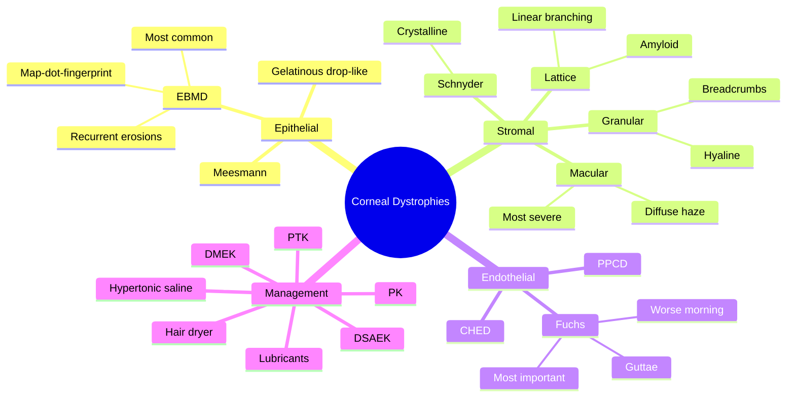

# Corneal Dystrophies

Related: [[Fuchs Endothelial Dystrophy]], [[Keratoconus]]

> [!tip] **FCPS/MRCP Priority: MEDIUM**
> Group of inherited, bilateral, progressive corneal diseases. Classified by layer affected: epithelial, stromal, endothelial. Fuchs endothelial dystrophy is most clinically important.

---

## Learning Objectives
- [ ] Define corneal dystrophies and classify by anatomical layer
- [ ] Identify the most common dystrophy (EBMD)
- [ ] Recognise Fuchs endothelial dystrophy
- [ ] Differentiate stromal dystrophies (lattice, granular, macular)
- [ ] Apply management (lubricants, hypertonic saline, keratoplasty)
- [ ] Choose correct keratoplasty procedure (DMEK vs DSAEK vs PK)

---

## 1. Definition

- **Corneal dystrophies:** Group of inherited, bilateral, symmetrical, progressive corneal diseases
- Classified by the layer primarily affected
- Usually autosomal dominant

---

## 2. Classification (IC3D)

### Epithelial & Subepithelial
| Dystrophy | Features |
|-----------|----------|
| **Epithelial basement membrane dystrophy (EBMD, map-dot-fingerprint)** | Most common; recurrent erosions, blurred vision |
| **Meesmann** | Microcysts, rare |
| **Lisch** | Band-shaped, X-linked |
| **Gelatinous drop-like** | Subepithelial amyloid |

### Stromal
| Dystrophy | Features |
|-----------|----------|
| **Lattice** | Amyloid deposits, linear branching; recurrent erosions |
| **Granular** | Hyaline, "breadcrumbs" |
| **Macular** | Most severe stromal, ↓ vision, photophobia |
| **Schnyder** | Crystalline, central |
| **Congenital stromal (CSCD)** | Congenital clouding |

### Endothelial
| Dystrophy | Features |
|-----------|----------|
| **Fuchs endothelial dystrophy** | Most common; guttata, corneal oedema |
| **Posterior polymorphous (PPCD)** | Vesicular endothelial lesions |
| **Congenital hereditary endothelial dystrophy (CHED)** | Congenital bilateral corneal oedema |

---

## 3. Clinical Approach

### History
- Family history (often AD)
- Age of onset
- Recurrent erosions (waking with pain, photophobia)
- Progressive blurred vision

### Examination
- Visual acuity
- Slit-lamp: location, pattern, depth of opacity
- Corneal sensation (normal in dystrophy)
- Specular microscopy (endothelial cell count, guttata)
- Pachymetry (increased in oedema)
- Anterior segment OCT

---

## 4. Specific: Fuchs Endothelial Dystrophy

- **Most clinically important**
- Bilateral, more common in women, age >50
- Progressive endothelial cell loss
- **Guttae** (excrescences on Descemet's)
- Corneal oedema, epithelial bullae (bullous keratopathy)
- Decreased vision, glare (worse in morning — corneal oedema accumulates overnight)
- May be complicated by recurrent erosions

### Stages
1. **Stage 1:** Central guttata, asymptomatic
2. **Stage 2:** Stromal oedema, blurred vision (worse morning)
3. **Stage 3:** Epithelial oedema, bullae, painful erosions
4. **Stage 4:** Subepithelial scarring

### Management
- **Hypertonic saline (5% NaCl)** drops morning + ointment at night
- **Hair dryer** (cool/warm) on face to dehydrate cornea in morning
- Avoid surgery until necessary
- **Descemet's stripping endothelial keratoplasty (DSEK/DSAEK)** — preferred
- **Descemet's membrane endothelial keratoplasty (DMEK)** — newer
- **Penetrating keratoplasty** for advanced with scarring

---

## 5. Specific: Epithelial Basement Membrane Dystrophy

- Most common corneal dystrophy
- Map (geographic), dot (microcysts), fingerprint lines
- Recurrent corneal erosions (RCE)
- Treatment: lubricants, hypertonic saline, BCL, anterior stromal puncture, PTK

---

## 6. Specific: Lattice Dystrophy

- Amyloid deposits, linear branching lines
- Recurrent erosions
- Decreased vision (stromal haze)
- Treatment: lubricants, BCL, PTK, keratoplasty

---

## 7. FCPS/MRCP High-Yield Summary

| Dystrophy | Layer | Key Sign |
|-----------|-------|----------|
| EBMD (map-dot-fingerprint) | Epithelial BM | Recurrent erosions, fingerprint pattern |
| Lattice | Stromal | Linear branching, amyloid |
| Granular | Stromal | Hyaline, breadcrumbs |
| Macular | Stromal | Most severe stromal, ↓ vision |
| Fuchs | Endothelial | Guttata, oedema worse in morning |

---

## 8. Viva Questions

1. **Q:** What is the most common corneal dystrophy?
   **A:** Epithelial basement membrane dystrophy (EBMD / map-dot-fingerprint).

2. **Q:** How does Fuchs endothelial dystrophy present?
   **A:** Blurred vision worse in morning, glare, halos. Guttae on slit-lamp, endothelial cell loss on specular microscopy.

3. **Q:** What is the modern surgical treatment for Fuchs dystrophy?
   **A:** DMEK (Descemet's membrane endothelial keratoplasty) — preferred over DSAEK/PK.

---

## 9. Common Confusions / Exam Traps

| Confusion | Clarification |
|-----------|---------------|
| "Most common dystrophy is Fuchs" | **EBMD** is the most common; Fuchs is the most clinically important endothelial dystrophy |
| "Fuchs vision is worse at night" | Vision is **worse in the morning** (corneal oedema accumulates overnight, evaporates during the day) |
| "DMEK = PK" | DMEK is endothelial-only (selective); PK is full-thickness (more rejection, more sutures) |
| "Corneal dystrophies are usually bilateral and inherited" | Most are AD, bilateral, symmetrical — but EBMD can be sporadic/unilateral cases |
| "Macular and granular look similar" | Granular has clear spaces between opacities; macular has **diffuse haze between opacities** (more severe) |
| "Lattice dystrophy is glycogen" | Lattice = **amyloid**; granular = hyaline |

---

## 10. Mnemonics

1. **"Fuchs = Foggier Early"** — Vision worse in the **morning** in Fuchs (oedema accumulates overnight)
2. **"Lattice = Lines (Amyloid)"** — Lattice = linear branching lines of amyloid
3. **"Granular = Granules (Hyaline) like bread crumbs"** — Hyaline "breadcrumbs" in stroma
4. **"EBMD = Easy to Map"** — EBMD shows map-dot-fingerprint pattern, most common dystrophy

---

## 11. Mind Map

---

## 12. One-Page Revision Card

| **Topic** | **Corneal Dystrophies** |
|-----------|--------------------------|
| **Definition** | Inherited, bilateral, symmetrical, progressive corneal opacities |
| **Classification** | By anatomical layer: epithelial, stromal, endothelial |
| **Most common** | Epithelial basement membrane dystrophy (EBMD / map-dot-fingerprint) |
| **Most clinically important** | Fuchs endothelial dystrophy |
| **EBMD features** | Map, dot (microcysts), fingerprint lines; recurrent erosions |
| **Fuchs features** | Guttae, ↓ endothelial cells, blurred vision worse in morning |
| **Stromal** | Lattice (amyloid), Granular (hyaline), Macular (most severe) |
| **Fuchs Rx** | Hypertonic saline, hair dryer, DMEK/DSAEK, PK |
| **EBMD Rx** | Lubricants, BCL, anterior stromal puncture, PTK |
| **Genetics** | Usually autosomal dominant |
| **Viva Pearl** | Fuchs = morning blur; EBMD = most common; Lattice = amyloid |

---

## Spaced Repetition Trackers

### 24-Hour Recall Prompts
- [ ] State the most common corneal dystrophy and the most clinically important
- [ ] Describe the slit-lamp appearance of Fuchs endothelial dystrophy
- [ ] List the 3 main categories of stromal dystrophies
- [ ] Explain why Fuchs vision is worse in the morning
- [ ] Name the modern surgical treatment for Fuchs dystrophy

### Revision Schedule
- [ ] **Day 1** completed (creation + 24h recall)
- [ ] **Day 3** revision completed
- [ ] **Day 7** revision completed
- [ ] **Day 15** revision completed
- [ ] **Day 30** revision completed
- [ ] **Day 90** revision completed

---

## Must Know / Should Know / Nice to Know

### Must Know (Core for passing)
- [x] Most common dystrophy: EBMD
- [x] Most clinically important: Fuchs
- [x] Fuchs: guttata, vision worse in morning
- [x] Stromal: lattice (amyloid), granular (hyaline), macular
- [x] Treatment: lubricants, hypertonic saline, DMEK

### Should Know (High probability)
- [x] Map-dot-fingerprint pattern of EBMD
- [x] Recurrent corneal erosions
- [x] Hypertonic saline and hair dryer for Fuchs
- [x] DMEK vs DSAEK vs PK
- [x] Inheritance pattern (autosomal dominant)

### Nice to Know (Differentiator)
- [ ] IC3D classification
- [ ] Meesmann, Lisch, Schnyder, PPCD, CHED
- [ ] Specular microscopy / AS-OCT findings
- [ ] PTK (phototherapeutic keratectomy) for EBMD
- [ ] Anterior stromal puncture

---

## My Weak Points
- [ ] Add personal weak areas here

---

## Self-Test Scorecard

| Section | Score /5 |
|---------|----------|
| Understanding: | /10 |
| Recall: | /10 |
| MCQ Performance: | /10 |
| SBA Performance: | /10 |
| Viva Confidence: | /10 |
| Total: | /50 |

> [!tip] **Interpretation:** <35 = weak topic, 35-44 = acceptable but insecure, 45+ = strong exam-ready topic.

---

## Exam Answer Modes

### Long Answer Skeleton
1. Definition (inherited, bilateral, symmetrical, progressive)
2. Classification by layer (epithelial, stromal, endothelial)
3. Epithelial — EBMD (most common; map-dot-fingerprint; recurrent erosions)
4. Stromal — lattice (amyloid), granular (hyaline), macular (most severe)
5. Endothelial — Fuchs (most clinically important; guttata, vision worse in morning)
6. Investigations (slit-lamp, specular microscopy, pachymetry, AS-OCT)
7. Management — lubricants, hypertonic saline, hair dryer; DMEK/DSAEK/PK for advanced

### Short Note Skeleton
- Definition + classification
- EBMD (most common, recurrent erosions, map-dot-fingerprint)
- Fuchs (morning blur, guttata, DMEK)
- One-line on stromal dystrophies

### Viva One-Liners
- **Q:** Most common corneal dystrophy? → **A:** EBMD (epithelial basement membrane dystrophy / map-dot-fingerprint)
- **Q:** Most clinically important corneal dystrophy? → **A:** Fuchs endothelial dystrophy
- **Q:** Why is Fuchs vision worse in the morning? → **A:** Corneal oedema accumulates overnight with closed lids
- **Q:** Modern surgery for Fuchs? → **A:** DMEK (Descemet's membrane endothelial keratoplasty)
- **Q:** Deposit type in lattice dystrophy? → **A:** Amyloid

### Ward-Case Discussion Points
- Assess family history (autosomal dominant pattern)
- Slit-lamp signs (guttata, map-dot-fingerprint, lattice lines)
- Specular microscopy for endothelial cell count
- Counsel on chronicity and genetic basis
- Discuss surgical timing (hypertonic saline first; surgery for advanced disease)

### Last-Night-Before-Exam Sheet
- **Top 5 facts:** EBMD most common; Fuchs most clinically important; Fuchs = morning blur; lattice = amyloid; granular = hyaline "breadcrumbs"; macular = most severe stromal
- **Mnemonic:** "Fuchs = Foggier Early" (morning)
- **Surgery hierarchy:** Hypertonic saline → DMEK (preferred) → DSAEK → PK
- **Deposit recall:** Lattice = Amyloid; Granular = Hyaline; Macular = Mucopolysaccharide

---

## Summary

Corneal dystrophies are inherited, bilateral, progressive. Classified by layer: epithelial (EBMD), stromal (lattice, granular, macular), endothelial (Fuchs). Fuchs is the most clinically important. Treatment is supportive, with keratoplasty (DMEK preferred) for advanced disease.

---

## MCQs (10)

1. **Question:** The most common corneal dystrophy is:
   **Options:** A. Lattice B. Granular C. Fuchs D. EBMD E. Macular
   **Answer:** D
   **Explanation:** EBMD (map-dot-fingerprint) is the most common.

2. **Question:** Fuchs endothelial dystrophy characteristically causes:
   **Options:** A. Pain on waking B. Vision worse in morning C. Diplopia D. Photophobia E. None
   **Answer:** B
   **Explanation:** Corneal oedema accumulates overnight, worse in morning.

3. **Question:** Preferred modern surgery for Fuchs dystrophy is:
   **Options:** A. PK B. LASIK C. DMEK D. INTACS E. PRK
   **Answer:** C
   **Explanation:** DMEK replaces only Descemet's + endothelium.

4. **Question:** Lattice corneal dystrophy is characterised by deposits of:
   **Options:** A. Hyaline B. Amyloid C. Lipid D. Iron E. Copper
   **Answer:** B
   **Explanation:** Lattice = amyloid. Granular = hyaline. Iron = Fleischer ring. Copper = Kayser-Fleischer (Wilson's).

5. **Question:** The classic slit-lamp sign of Fuchs endothelial dystrophy is:
   **Options:** A. Kayser-Fleischer ring B. Fleischer ring C. Guttae (Descemet's excrescences) D. Vogt's striae E. Munson sign
   **Answer:** C
   **Explanation:** Central guttae (drop-like excrescences on Descemet's membrane) are the hallmark of Fuchs. Kayser-Fleischer = Wilson's. Fleischer = keratoconus. Vogt's striae and Munson sign = keratoconus.

6. **Question:** Which of the following stromal dystrophies is the most severe and most likely to cause early visual loss?
   **Options:** A. Lattice B. Granular C. Macular D. Schnyder E. Congenital stromal
   **Answer:** C
   **Explanation:** Macular dystrophy causes the earliest and most severe visual loss among the stromal dystrophies (glycosaminoglycan deposits with diffuse stromal haze between lesions).

7. **Question:** A 60-year-old woman with Fuchs dystrophy uses 5% sodium chloride drops in the morning and ointment at night. She asks why her vision is still blurriest first thing. The best explanation is:
   **Options:** A. The drops are ineffective B. Corneal oedema accumulates overnight C. She has cataracts D. She has glaucoma E. The ointment is toxic
   **Answer:** B
   **Explanation:** Closed lids overnight reduce evaporation, and the dysfunctional endothelium cannot pump fluid out, so the stroma swells. Drops and hair dryer help dehydrate the cornea in the morning.

8. **Question:** Recurrent corneal erosions are most characteristically associated with which corneal dystrophy?
   **Options:** A. Fuchs endothelial dystrophy B. Granular dystrophy C. Epithelial basement membrane dystrophy (EBMD) D. Macular dystrophy E. Posterior polymorphous dystrophy
   **Answer:** C
   **Explanation:** EBMD (map-dot-fingerprint) is the classic cause of recurrent corneal erosions. Lattice and granular can also cause RCE, but EBMD is the strongest association.

9. **Question:** In Fuchs endothelial dystrophy, specular microscopy typically shows:
   **Options:** A. Increased endothelial cell density B. Polymegathism, pleomorphism, and guttata with reduced cell count C. Normal endothelial mosaic D. Enlarged epithelial cells E. Corneal neovascularisation
   **Answer:** B
   **Explanation:** Endothelial cells show variation in size (polymegathism) and shape (pleomorphism), reduced count, and guttata (dark spots) on specular microscopy — all consistent with endothelial pump failure.

10. **Question:** Granular corneal dystrophy is histologically characterised by:
    **Options:** A. Amyloid deposits B. Hyaline deposits C. Glycosaminoglycan deposits D. Lipid deposits E. Iron deposits
    **Answer:** B
    **Explanation:** Granular dystrophy has hyaline (non-collagenous protein) deposits that stain with Masson trichrome — the "breadcrumbs" appearance. Lattice = amyloid, Macular = glycosaminoglycan, Schnyder = cholesterol/lipid, Fleischer = iron.

## SBA Questions (10)

1. **Scenario:** A 65-year-old has progressive blurred vision worse in the morning, with central guttae on slit-lamp and reduced endothelial cell count.
   **Question:** Diagnosis?
   **Options:** A. Keratoconus B. Fuchs endothelial dystrophy C. Lattice dystrophy D. Cataract E. Glaucoma
   **Answer:** B
   **Explanation:** Morning blur + guttae = Fuchs.

2. **Scenario:** A 45-year-old with epithelial basement membrane dystrophy presents repeatedly with sudden pain, photophobia, and lacrimation on waking, with a localised epithelial defect on fluorescein staining.
   **Question:** Most appropriate initial treatment for the acute episode?
   **Options:** A. Topical fortified antibiotics hourly B. Topical steroid C. Lubricant / bandage contact lens + cycloplegia D. Penetrating keratoplasty E. Acyclovir ointment
   **Answer:** C
   **Explanation:** This is a recurrent corneal erosion in EBMD. Initial treatment is lubrication ± bandage contact lens, with cycloplegia for comfort. Antibiotics only if secondary infection suspected. PK is for advanced disease with scarring. Acyclovir is for HSV (dendritic ulcer).

3. **Scenario:** A 50-year-old with bilateral lattice dystrophy has decreasing vision due to central stromal haze. Conservative measures have failed.
   **Question:** Which surgical option is most appropriate?
   **Options:** A. LASIK B. Phototherapeutic keratectomy (PTK) C. DMEK D. Penetrating keratoplasty (PK) E. Intravitreal injection
   **Answer:** D
   **Explanation:** Lattice is a stromal dystrophy — full-thickness PK is the standard. PTK is for superficial disease. DMEK is endothelial (used for Fuchs). LASIK is contraindicated.

4. **Scenario:** A 70-year-old with Fuchs dystrophy has advanced bullous keratopathy and 6/60 vision in the affected eye despite maximal medical therapy.
   **Question:** Most appropriate surgical option?
   **Options:** A. LASIK B. Photorefractive keratectomy C. DMEK D. Penetrating keratoplasty E. Cataract extraction only
   **Answer:** C
   **Explanation:** Bullous keratopathy from endothelial failure → DMEK (selective endothelial transplant). PK is reserved for cases with subepithelial scarring (Fuchs Stage 4). Refractive surgery contraindicated.

5. **Scenario:** A 35-year-old with bilateral linear branching refractile lines in the stroma on slit-lamp, history of recurrent corneal erosions, and a strong family history.
   **Question:** Diagnosis?
   **Options:** A. Granular dystrophy B. Lattice dystrophy C. Macular dystrophy D. Schnyder dystrophy E. Fuchs dystrophy
   **Answer:** B
   **Explanation:** Linear branching lines + RCE + family history = lattice (amyloid deposits).

6. **Scenario:** A 5-year-old presents with bilateral congenital corneal oedema and a positive family history. Specular microscopy cannot identify endothelial cells.
   **Question:** Most likely diagnosis?
   **Options:** A. Congenital glaucoma B. CHED (congenital hereditary endothelial dystrophy) C. Peters anomaly D. Birth trauma E. Interstitial keratitis
   **Answer:** B
   **Explanation:** Bilateral congenital corneal oedema with absent/reduced endothelial cells = CHED. Peters anomaly has a central posterior defect and iris adhesions.

7. **Scenario:** A 25-year-old with recurrent erosions is found on slit-lamp to have geographic grey patches, microcysts, and concentric parallel lines ("fingerprints") in the epithelium bilaterally.
   **Question:** Diagnosis?
   **Options:** A. Lattice dystrophy B. Granular dystrophy C. EBMD (map-dot-fingerprint) D. Fuchs dystrophy E. Meesmann dystrophy
   **Answer:** C
   **Explanation:** Map (geographic) + dot (microcysts) + fingerprint lines = EBMD, the most common corneal dystrophy and a leading cause of recurrent corneal erosions.

8. **Scenario:** A 60-year-old with Fuchs dystrophy is started on 5% NaCl drops and ointment and is also told to use a hair dryer held at arm's length on the face in the morning.
   **Question:** What is the rationale for the hair dryer?
   **Options:** A. To warm the cornea B. To dehydrate the cornea via evaporation C. To dilate the pupil D. To treat blepharitis E. To reduce pain via massage
   **Answer:** B
   **Explanation:** Evaporative dehydration of the cornea reduces overnight stromal oedema, improving morning vision. Heat and massage are not the primary mechanism.

9. **Scenario:** A 12-year-old with bilateral discrete, well-defined, crumb-like (breadcrumb) central stromal opacities and a positive family history.
   **Question:** Diagnosis?
   **Options:** A. Lattice dystrophy B. Granular dystrophy C. Macular dystrophy D. Schnyder dystrophy E. Fuchs dystrophy
   **Answer:** B
   **Explanation:** Discrete, breadcrumb-like opacities with clear stroma between = granular (hyaline). Lattice has linear branching; macular has diffuse haze between lesions.

10. **Scenario:** A 65-year-old with Fuchs dystrophy has been told she may eventually need a corneal transplant. She asks which procedure is most modern and best.
    **Question:** Best answer?
    **Options:** A. Penetrating keratoplasty B. Deep anterior lamellar keratoplasty C. Descemet's membrane endothelial keratoplasty (DMEK) D. LASIK E. Photorefractive keratectomy
    **Answer:** C
    **Explanation:** DMEK selectively replaces only Descemet's + endothelium; faster visual recovery, lower rejection than DSAEK or PK, and is the current gold standard for endothelial failure (Fuchs).

## Flashcards

- **Q:** What are the three main layers in which corneal dystrophies are classified?
  **A:** Epithelial (and subepithelial), Stromal, Endothelial — the IC3D anatomical classification.
- **Q:** Most common corneal dystrophy?
  **A:** Epithelial basement membrane dystrophy (EBMD / map-dot-fingerprint).
- **Q:** Most clinically important corneal dystrophy?
  **A:** Fuchs endothelial dystrophy.
- **Q:** Why is vision worse in the morning in Fuchs?
  **A:** Corneal oedema accumulates overnight because the dysfunctional endothelium cannot pump out fluid; vision improves as fluid evaporates during the day.
- **Q:** Deposit type in lattice, granular, and macular dystrophies?
  **A:** Lattice = amyloid; Granular = hyaline; Macular = glycosaminoglycan (mucopolysaccharide).
- **Q:** Modern surgical treatment for Fuchs?
  **A:** DMEK (Descemet's membrane endothelial keratoplasty) — selective endothelial replacement.

## Answer Key with Explanations

### MCQs
1. D — EBMD (map-dot-fingerprint) is the most common
2. B — Fuchs = morning blur (corneal oedema accumulates overnight)
3. C — DMEK is the modern endothelial replacement
4. B — Lattice = amyloid
5. C — Guttae are the hallmark of Fuchs
6. C — Macular = most severe stromal dystrophy
7. B — Oedema accumulates overnight
8. C — EBMD = classic cause of recurrent corneal erosions
9. B — Polymegathism, pleomorphism, guttata, reduced cell count
10. B — Granular = hyaline (Masson trichrome positive)

### SBAs
1. B — Morning blur + guttae = Fuchs
2. C — RCE treated with lubrication, BCL, cycloplegia
3. D — Lattice is stromal → PK
4. C — Bullous keratopathy → DMEK
5. B — Linear branching + RCE + family history = lattice
6. B — Bilateral congenital oedema = CHED
7. C — Map-dot-fingerprint = EBMD
8. B — Hair dryer aids evaporation
9. B — Breadcrumbs = granular
10. C — DMEK is the modern standard

## Tags
#medicine #davidson #ophthalmology #corneal-dystrophy #Fuchs #fcps #mrcp
