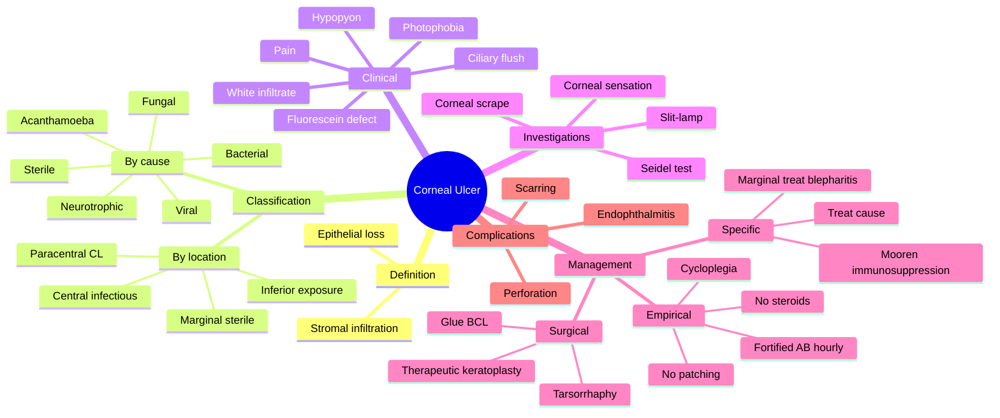

# Corneal Ulcer

Related: [[Bacterial Keratitis]], [[Fungal Keratitis]], [[Viral Keratitis (HSV)]], [[Acanthamoeba Keratitis]]

> [!tip] **FCPS/MRCP Priority: CRITICAL**
> Open sore on cornea. Infectious aetiology until proven otherwise. Marginal vs central vs peripheral. Treat aggressively to prevent perforation.

---

## Learning Objectives
- [ ] Define corneal ulcer and differentiate by location (central, paracentral, peripheral)
- [ ] List the major aetiologies (bacterial, fungal, viral, Acanthamoeba, sterile)
- [ ] Recognise clinical features and red flags
- [ ] Interpret the Seidel test
- [ ] Apply empirical management (fortified antibiotics, cycloplegia)
- [ ] Identify complications (scarring, perforation, endophthalmitis)

---

## 1. Definition

- **Corneal ulcer:** Loss of corneal epithelium with underlying stromal infiltration
- Usually infectious (bacterial, fungal, viral, Acanthamoeba)
- Can be sterile (peripheral, marginal — immune-related)

---

## 2. Classification

### By Location
- **Central:** Most vision-threatening, often severe infection
- **Paracentral:** Often contact lens–related
- **Peripheral/Marginal:** Often immune (sterile) — Staph hypersensitivity, associated blepharitis
- **Inferior:** Exposure, lagophthalmos

### By Cause
- Infectious (bacterial, fungal, viral, Acanthamoeba)
- Sterile (marginal keratitis, Mooren's ulcer)
- Neurotrophic (poor healing due to nerve damage)
- Traumatic

---

## 3. Clinical Features

- Pain, photophobia, lacrimation
- Red eye, blurred vision
- White spot on cornea (infiltrate)
- Overlying epithelial defect (fluorescein positive)
- Ciliary flush
- AC reaction (cells, flare, hypopyon)
- Discharge (mucopurulent, watery)
- Eyelid swelling
- Decreased corneal sensation (HSV, Acanthamoeba)

---

## 4. Examination

- Visual acuity
- Slit-lamp: size, location, depth, edges, satellite lesions, endothelial plaque
- Seidel test (active leak — concentrated fluorescein streaming)
- Corneal scrape for microbiology (bacterial, fungal, Acanthamoeba)
- Corneal sensation testing

---

## 5. Management

### Empirical
- **Hourly fortified antibiotics** (cefazolin 5% + tobramycin 1.4%) or fluoroquinolone
- **Cycloplegia** (atropine)
- **Avoid patching, steroids**

### Specific
- Treat underlying cause (bacterial, fungal, viral, Acanthamoeba)
- **Mooren's ulcer** (autoimmune, idiopathic): immunosuppression (steroid, cyclosporine, MMF)
- **Peripheral marginal** (Staph hypersensitivity): treat blepharitis, mild steroid

### Surgical
- **Therapeutic keratoplasty** for non-healing, perforation
- **Glue + BCL** for small perforations
- **Tarsorrhaphy** (adjunct for persistent defects)

---

## 6. Complications

- Scarring (vision loss)
- Perforation
- Endophthalmitis
- Recurrence (HSV)
- Glaucoma (peripheral anterior synechiae)

---

## 7. FCPS/MRCP High-Yield Summary

| Topic | Key Points |
|-------|------------|
| Marginal ulcer | Sterile, Staph hypersensitivity |
| Central ulcer | Infectious, vision-threatening |
| Treatment | Empirical fortified AB, cycloplegia |
| Seidel test | Active perforation |
| Complication | Scarring, perforation |

---

## 8. Viva Questions

1. **Q:** How do you differentiate marginal from central corneal ulcer?
   **A:** Marginal = peripheral, sterile, immune to Staph exotoxin, with blepharitis. Central = infectious, severe, hypopyon.

2. **Q:** What is the Seidel test?
   **A:** Apply concentrated fluorescein — positive test shows streaming of aqueous through defect (perforation).

---

## 9. Common Confusions / Exam Traps

| Confusion | Clarification |
|-----------|---------------|
| "Patch the eye in corneal ulcer" | **Do not patch** — patching creates a warm, moist environment that promotes microbial growth |
| "Topical steroid in microbial keratitis" | **Avoid topical steroid initially** — worsens infection, especially fungal and HSV |
| "Mooren's ulcer is infectious" | Mooren's is **autoimmune/idiopathic**, treated with immunosuppression |
| "Marginal ulcer = central ulcer" | Marginal is usually **sterile, immune-mediated** (Staph hypersensitivity); central is usually infectious |
| "Seidel test = infection" | Seidel detects **aqueous leak (perforation)**, not infection |
| "Hypopyon always means endophthalmitis" | Sterile hypopyon can occur in severe peripheral/marginal ulcers; **endophthalmitis** involves the vitreous |

---

## 10. Mnemonics

1. **"STOP — no Steroids, no Tape-patching, only Open treatment"** in suspected infectious ulcer
2. **"CLAP — Cefazolin + (tobra)mycin/fluoroquinolone, Atropine, Pad with BCL only if needed"** — empirical regimen
3. **"Mooren's = Munches (autoimmune, peripheral, painful, progressive)"** — painful, progressive, peripheral, autoimmune
4. **"SeS = Streaming Sign = Seidel"** — positive = perforation

---

## 11. Mind Map

---

## 12. One-Page Revision Card

| **Topic** | **Corneal Ulcer** |
|-----------|---------------------|
| **Definition** | Loss of corneal epithelium + stromal infiltration |
| **Most common cause** | Bacterial (especially in contact lens wearers — Pseudomonas) |
| **Marginal ulcer** | Peripheral, sterile, Staph hypersensitivity, treat blepharitis |
| **Central ulcer** | Infectious, often severe, hypopyon possible |
| **Seidel test** | Concentrated fluorescein + slit-lamp → streaming = perforation |
| **Empirical Rx** | Fortified antibiotics hourly (cefazolin + tobramycin or fluoroquinolone) |
| **Adjuncts** | Cycloplegia (atropine) for ciliary spasm, comfort |
| **Avoid initially** | Topical steroids, eye patching |
| **Mooren's ulcer** | Autoimmune, painful, progressive peripheral ulcer — immunosuppression |
| **Surgical** | Glue + BCL for small perforations; therapeutic keratoplasty for non-healing |
| **Complications** | Scarring, perforation, endophthalmitis, secondary glaucoma |
| **Viva Pearl** | STOP = no Steroids, no Tape-patching, Open treatment |

---

## Spaced Repetition Trackers

### 24-Hour Recall Prompts
- [ ] Define corneal ulcer and name 3 aetiologies
- [ ] List 3 clinical features
- [ ] Describe the Seidel test
- [ ] State empirical treatment of bacterial keratitis
- [ ] Name 3 complications of corneal ulcer
- [ ] Differentiate marginal from central ulcer

### Revision Schedule
- [ ] **Day 1** completed (creation + 24h recall)
- [ ] **Day 3** revision completed
- [ ] **Day 7** revision completed
- [ ] **Day 15** revision completed
- [ ] **Day 30** revision completed
- [ ] **Day 90** revision completed

---

## Must Know / Should Know / Nice to Know

### Must Know (Core for passing)
- [x] Definition (epithelial loss + stromal infiltration)
- [x] Marginal = sterile, Staph hypersensitivity
- [x] Central = usually infectious
- [x] Empirical Rx: fortified antibiotics hourly + cycloplegia
- [x] Avoid steroids and patching initially
- [x] Seidel test = perforation

### Should Know (High probability)
- [x] Complications: scarring, perforation, endophthalmitis
- [x] Hypopyon in severe ulcers
- [x] Mooren's ulcer (autoimmune)
- [x] Corneal scrape for microbiology
- [x] Acanthamoeba — contact lens + tap water

### Nice to Know (Differentiator)
- [ ] Specific antimicrobial regimens (antifungal, anti-amoebic)
- [ ] Tarsorrhaphy indications
- [ ] Neurotrophic ulcer (V, VII palsy)
- [ ] Glue + BCL technique
- [ ] Therapeutic keratoplasty indications

---

## My Weak Points
- [ ] Add personal weak areas here

---

## Self-Test Scorecard

| Section | Score /5 |
|---------|----------|
| Understanding: | /10 |
| Recall: | /10 |
| MCQ Performance: | /10 |
| SBA Performance: | /10 |
| Viva Confidence: | /10 |
| Total: | /50 |

> [!tip] **Interpretation:** <35 = weak topic, 35-44 = acceptable but insecure, 45+ = strong exam-ready topic.

---

## Exam Answer Modes

### Long Answer Skeleton
1. Definition (epithelial loss + stromal infiltration)
2. Aetiology (bacterial > fungal > viral > Acanthamoeba > sterile)
3. Classification by location (central / paracentral / peripheral / inferior)
4. Clinical features (pain, photophobia, white infiltrate, hypopyon, ↓VA)
5. Investigations (slit-lamp, Seidel test, corneal scrape, sensation)
6. Management — empirical (fortified AB, cycloplegia, no patch, no steroid), specific, surgical
7. Complications (scarring, perforation, endophthalmitis)
8. Mooren's ulcer (autoimmune) — separate paragraph

### Short Note Skeleton
- Definition + aetiology
- Marginal vs central
- Empirical treatment (fortified AB, cycloplegia)
- One-line on Seidel and complications

### Viva One-Liners
- **Q:** Marginal vs central corneal ulcer? → **A:** Marginal = peripheral, sterile, Staph hypersensitivity, treat blepharitis. Central = infectious, vision-threatening
- **Q:** Seidel test? → **A:** Concentrated fluorescein → streaming of aqueous = perforation
- **Q:** Empirical Rx for severe bacterial ulcer? → **A:** Fortified antibiotics (cefazolin 5% + tobramycin 1.4%) hourly + cycloplegia; no patching, no steroids
- **Q:** Why avoid topical steroid? → **A:** Worsens infection, especially fungal and HSV
- **Q:** Why avoid patching? → **A:** Promotes microbial growth; only patch perforated ulcers with BCL/glue
- **Q:** Acanthamoeba risk factor? → **A:** Contact lens use + exposure to tap water

### Ward-Case Discussion Points
- Initial assessment: VA, slit-lamp, corneal sensation
- Corneal scrape before empirical treatment
- Empirical fortified antibiotics hourly
- Counsel contact lens wearers on hygiene
- Recognise Acanthamoeba (ring infiltrate, severe pain disproportionate to signs)
- Recognise Mooren's (autoimmune, painful, peripheral)
- Escalate to corneal specialist for non-healing, perforation

### Last-Night-Before-Exam Sheet
- **Top 5 facts:** Epithelial loss + infiltration; marginal = sterile; central = infectious; fortified AB hourly; no steroids/no patching
- **Mnemonic:** "STOP — no Steroids, no Tape-patching, only Open"
- **CLAP:** Cefazolin + tobramycin/fluoroquinolone, Atropine cycloplegia, ± BCL
- **Seidel:** Concentrated fluorescein → streaming = perforation
- **Complications:** Scarring, perforation, endophthalmitis

---

## Summary

Corneal ulcer is loss of corneal epithelium with stromal infiltration. Often infectious; treat empirically with fortified antibiotics. Marginal ulcers are often sterile. Perforation requires urgent intervention.

---

## MCQs (10)

1. **Question:** A marginal corneal ulcer is most often:
   **Options:** A. Bacterial B. Fungal C. Sterile (Staph hypersensitivity) D. Viral E. Acanthamoeba
   **Answer:** C
   **Explanation:** Marginal = immune to Staph exotoxin, with blepharitis.

2. **Question:** A positive Seidel test indicates:
   **Options:** A. Active infection B. Active aqueous leak (perforation) C. Allergy D. Glaucoma E. Uveitis
   **Answer:** B
   **Explanation:** Streaming of aqueous through defect.

3. **Question:** Empirical treatment for severe corneal ulcer:
   **Options:** A. Topical steroid B. Fortified antibiotics hourly C. Patching D. Wait for culture E. None
   **Answer:** B
   **Explanation:** Fortified AB hourly, no patching, no steroids initially.

4. **Question:** The most appropriate initial management of a perforated corneal ulcer of <2 mm is:
   **Options:** A. Enucleation B. Topical steroid C. Tissue adhesive (glue) + bandage contact lens D. Topical anaesthetic and discharge E. Tarsorrhaphy alone
   **Answer:** C
   **Explanation:** Small perforations are sealed with cyanoacrylate glue and protected with a bandage contact lens, with cycloplegia and antibiotics. Tarsorrhaphy alone does not seal; enucleation is radical and inappropriate.

5. **Question:** A 25-year-old soft contact lens wearer who cleans lenses with tap water presents with a painful red eye, ring-shaped corneal infiltrate, and severe pain disproportionate to signs. Most likely organism:
   **Options:** A. Staphylococcus aureus B. Pseudomonas aeruginosa C. Acanthamoeba D. Herpes simplex E. Candida
   **Answer:** C
   **Explanation:** Acanthamoeba is associated with contact lens use + tap-water rinsing; classic ring infiltrate and pain out of proportion to signs.

6. **Question:** Mooren's ulcer is best classified as:
   **Options:** A. Infectious peripheral keratitis B. Autoimmune idiopathic peripheral ulcer C. Contact lens related D. Fungal E. Bacterial marginal ulcer
   **Answer:** B
   **Explanation:** Mooren's is a chronic, painful, progressive peripheral ulcer driven by autoimmunity against corneal stroma — treated with immunosuppression, not antibiotics.

7. **Question:** In microbial keratitis, topical corticosteroid is best avoided initially because it may:
   **Options:** A. Cause cataract B. Worsen infection, especially fungal and HSV C. Cause glaucoma D. Mask the pain E. Delay epithelialisation only
   **Answer:** B
   **Explanation:** Steroids impair host defence and worsen fungal, Acanthamoeba, and HSV ulcers. They are added only later under cover of specific antimicrobials when inflammation is disproportionate to infection.

8. **Question:** A hypopyon in bacterial keratitis usually indicates:
   **Options:** A. Endophthalmitis B. Severe AC inflammation but often sterile C. Fungal infection D. Allergic reaction E. Glaucoma
   **Answer:** B
   **Explanation:** Hypopyon in bacterial keratitis is usually a sterile reaction to bacterial exotoxins (unless the cornea has perforated or endophthalmitis has developed). It does not mean the aqueous is infected.

9. **Question:** Initial corneal scrape in suspected bacterial keratitis should be sent for all of the following EXCEPT:
   **Options:** A. Gram stain B. Blood agar C. Chocolate agar D. Sabouraud agar (fungal) E. PCR for adenovirus only
   **Answer:** E
   **Explanation:** Adenovirus causes epidemic keratoconjunctivitis, not bacterial keratitis. Bacterial/fungal/Acanthamoeba cultures (and sensitivities) are sent. PCR for HSV may also be sent if indicated.

10. **Question:** A patient with a peripheral corneal ulcer, adjacent to an area of lid margin inflammation with collarettes, has mild symptoms. Most likely diagnosis and most appropriate initial treatment:
    **Options:** A. Bacterial ulcer — fortified AB hourly B. Fungal ulcer — antifungals C. Marginal keratitis — lid hygiene + mild topical steroid D. Acanthamoeba — anti-amoebics E. Mooren's — immunosuppression
    **Answer:** C
    **Explanation:** Marginal (catarrhal) ulcer is associated with staphylococcal blepharitis (collarettes) — treatment is lid hygiene ± short course of mild topical steroid, with antibiotics only if secondary infection.

## SBA Questions (10)

1. **Scenario:** A 30-year-old contact lens wearer has painful red eye, ↓VA, central corneal ulcer with hypopyon, mucopurulent discharge.
   **Question:** Most appropriate first-line treatment?
   **Options:** A. Topical steroid B. Topical fortified antibiotics hourly C. Patching D. Oral steroid E. Lubricants
   **Answer:** B
   **Explanation:** Bacterial ulcer — empirical fortified AB.

2. **Scenario:** A 24-year-old soft contact lens wearer presents with severe pain, photophobia, and a ring-shaped stromal infiltrate. He rinses his lenses with tap water. Slit-lamp shows reduced corneal sensation.
   **Question:** Most likely diagnosis?
   **Options:** A. Bacterial keratitis B. Fungal keratitis C. Herpes simplex keratitis D. Acanthamoeba keratitis E. Marginal keratitis
   **Answer:** D
   **Explanation:** Contact lens + tap water + ring infiltrate + pain out of proportion + reduced sensation = Acanthamoeba.

3. **Scenario:** A patient with a severe central bacterial ulcer is started on empirical therapy. Ten minutes after starting drops, a Seidel test becomes positive.
   **Question:** What does this indicate?
   **Options:** A. Worsening infection B. Corneal perforation with aqueous leak C. Drug allergy D. Hypopyon formation E. Improved ulcer
   **Answer:** B
   **Explanation:** Streaming of fluorescein = aqueous leaking through a full-thickness defect = perforation. The patient needs urgent glue + BCL or therapeutic keratoplasty.

4. **Scenario:** A 50-year-old with chronic blepharitis presents with a peripheral corneal infiltrate, a clear zone of cornea between the infiltrate and the limbus, and mild symptoms.
   **Question:** Most likely diagnosis?
   **Options:** A. Bacterial keratitis B. Fungal keratitis C. Marginal (catarrhal) keratitis D. Mooren's ulcer E. HSV keratitis
   **Answer:** C
   **Explanation:** Peripheral infiltrate + clear zone from limbus + blepharitis = marginal keratitis, an immune reaction to staphylococcal exotoxin.

5. **Scenario:** A patient with a small (<2 mm) perforated corneal ulcer is brought to the eye casualty.
   **Question:** Most appropriate next step?
   **Options:** A. Enucleation B. Tarsorrhaphy alone C. Cyanoacrylate glue + bandage contact lens + cycloplegia + antibiotics D. Topical steroid E. Discharge with lubricants
   **Answer:** C
   **Explanation:** Small perforations are managed with tissue glue + BCL, with cycloplegia (prevents iris prolapse) and broad-spectrum antibiotics. Tarsorrhaphy alone doesn't seal; enucleation is extreme.

6. **Scenario:** A 35-year-old farmer presents with a slow-growing corneal ulcer after a corneal foreign body with vegetable matter. The infiltrate has feathery edges and satellite lesions.
   **Question:** Most likely organism?
   **Options:** A. Pseudomonas B. Staphylococcus C. Fusarium / Aspergillus (fungal) D. Acanthamoeba E. HSV
   **Answer:** C
   **Explanation:** Vegetable trauma + slow course + feathery edges + satellite lesions = fungal (Fusarium, Aspergillus). Treatment is intensive topical antifungals (natamycin 5%, amphotericin B 0.15%).

7. **Scenario:** A 60-year-old with rheumatoid arthritis presents with a painful, progressive, peripheral corneal ulcer bilaterally with overhanging edges and no infection. Inflammatory markers are elevated.
   **Question:** Most likely diagnosis?
   **Options:** A. Bacterial keratitis B. Fungal keratitis C. Mooren's ulcer D. Marginal keratitis E. Acanthamoeba
   **Answer:** C
   **Explanation:** Painful, progressive, bilateral peripheral ulcer with overhanging leading edge, autoimmune background, no infection = Mooren's ulcer. Treatment is immunosuppression (topical/systemic steroid, cyclosporine, MMF).

8. **Scenario:** A 22-year-old has a red, painful eye after swimming in a contact lens. Slit-lamp shows a single, dense, central ulcer with a hypopyon and mucopurulent discharge.
   **Question:** Empirical treatment?
   **Options:** A. Topical steroid hourly B. Fortified cefazolin 5% + tobramycin 1.4% hourly, cycloplegia, no patch C. Topical aciclovir 5×/day D. Lubricants only E. Topical natamycin alone
   **Answer:** B
   **Explanation:** Severe bacterial keratitis (likely Pseudomonas in a contact lens wearer) → empirical fortified antibiotics hourly + cycloplegia; no patching, no steroids until infection controlled.

9. **Scenario:** A 40-year-old contact lens wearer with bacterial keratitis is improving on fortified antibiotics. On day 5, the epithelium has healed but stromal scarring remains, with best-corrected VA 6/36.
   **Question:** Most appropriate next step?
   **Options:** A. Enucleation B. Stop all treatment C. Taper antibiotics; consider future keratoplasty for visual rehabilitation D. Add topical steroid immediately E. Topical anaesthetic for comfort
   **Answer:** C
   **Explanation:** Once infection is controlled, antibiotics are tapered. Residual stromal scarring with poor vision is addressed later with optical keratoplasty. Steroids are added cautiously only after infection is cleared.

10. **Scenario:** A 30-year-old with a small peripheral ulcer is patched overnight. The next day, the ulcer is significantly larger with worsening discharge.
    **Question:** Most likely explanation?
    **Options:** A. Treatment failure only B. Patching promoted microbial growth — inappropriate for suspected infectious ulcer C. Drug allergy D. Secondary glaucoma E. Cataract progression
    **Answer:** B
    **Explanation:** Patching creates a warm, moist, dark environment that accelerates microbial proliferation, especially in bacterial and especially Pseudomonas ulcers. Patching is contraindicated in suspected microbial keratitis.

## Flashcards

- **Q:** What is the difference between a marginal and a central corneal ulcer?
  **A:** Marginal = peripheral, usually sterile, immune to staphylococcal exotoxin, with associated blepharitis (lid collarettes). Central = usually infectious, vision-threatening, may have hypopyon.
- **Q:** What is the Seidel test?
  **A:** Apply concentrated fluorescein to the cornea; a positive test (visible streaming/dilution of dye by leaking aqueous) indicates a full-thickness corneal perforation.
- **Q:** What is the empirical treatment of severe bacterial keratitis?
  **A:** Hourly topical fortified antibiotics (cefazolin 5% + tobramycin 1.4%, or fluoroquinolone) + cycloplegia (atropine). Avoid patching and topical steroids initially.
- **Q:** What is Mooren's ulcer?
  **A:** A chronic, painful, progressive peripheral corneal ulcer driven by autoimmunity; treated with immunosuppression (steroids, cyclosporine, MMF), not antibiotics.
- **Q:** Why avoid topical steroids in suspected microbial keratitis?
  **A:** Steroids impair host immunity and worsen infection, particularly fungal, Acanthamoeba, and HSV ulcers. Added only after specific antimicrobial cover and infection control.
- **Q:** Acanthamoeba keratitis — risk factor and clinical clue?
  **A:** Risk factor = contact lens use + exposure to tap water. Clinical clue = severe pain out of proportion to signs, ring-shaped stromal infiltrate, decreased corneal sensation.

## Answer Key with Explanations

### MCQs
1. C — Marginal = sterile, Staph hypersensitivity
2. B — Seidel = aqueous leak = perforation
3. B — Fortified antibiotics hourly is empirical Rx
4. C — Glue + BCL for small perforations
5. C — Acanthamoeba: contact lens + tap water + ring infiltrate
6. B — Mooren's = autoimmune peripheral ulcer
7. B — Steroids worsen infection, especially fungal and HSV
8. B — Hypopyon usually sterile in bacterial keratitis
9. E — Adenovirus PCR is not indicated for bacterial keratitis
10. C — Marginal ulcer → lid hygiene + mild steroid

### SBAs
1. B — Empirical fortified AB hourly
2. D — Acanthamoeba (contact lens + tap water + ring)
3. B — Seidel positive = perforation
4. C — Marginal keratitis (blepharitis-related)
5. C — Small perforation → glue + BCL
6. C — Fungal (feathery edges, satellite lesions)
7. C — Mooren's ulcer (autoimmune)
8. B — Empirical fortified AB + cycloplegia
9. C — Taper, plan optical keratoplasty for scar
10. B — Patching worsens microbial keratitis

## Tags
#medicine #davidson #ophthalmology #cornea #ulcer #fcps #mrcp
