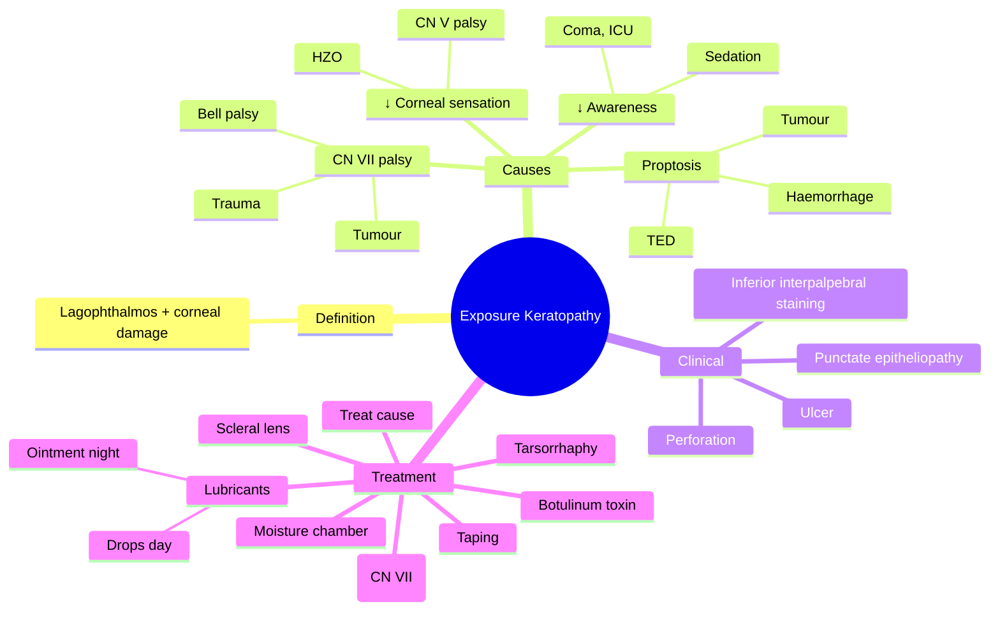

# Exposure Keratopathy

Related: [[Dry Eye Disease]], [[Proptosis (Approach)]], [[Bell Palsy (CN VII)]]

> [!tip] **FCPS/MRCP Priority: MEDIUM**
> Incomplete lid closure (lagophthalmos) causes exposure, dryness, corneal damage. Treat with lubricants, taping at night, tarsorrhaphy for severe.

---

## Learning Objectives
- [ ] Define exposure keratopathy and describe its pathogenesis
- [ ] List causes (CN VII palsy, proptosis, decreased corneal sensation, decreased awareness)
- [ ] Recognise clinical features (lagophthalmos, interpalpebral staining)
- [ ] Initiate stepwise management (lubricants → taping → tarsorrhaphy)
- [ ] Apply specific treatments (gold weight, botulinum, scleral lens)
- [ ] Manage exposure in ICU/comatose patients

---

## 1. Definition

- **Exposure keratopathy:** Corneal damage from incomplete eyelid closure or proptosis
- Leads to dryness, epithelial breakdown, ulceration, perforation

## 2. Causes

### Lid-related
- **CN VII palsy** (Bell palsy, trauma, tumour)
- **Cicatricial lid retraction** (post-surgical, post-traumatic)
- **Severe ectropion**

### Proptosis-related
- **Thyroid eye disease** (most common)
- **Orbital tumour**
- **Severe retrobulbar haemorrhage**
- **Orbital inflammation**

### Decreased Sensation (Neurotrophic)
- **CN V palsy**
- **HSV, HZO**
- **Post-surgical** (post-refractive)

### Decreased Awareness
- **Comatose/sedated patients** (ICU)
- **Severe proptosis** (no Bell's reflex)

### Bell's Phenomenon
- Eyes roll up and out on attempted lid closure
- Protects cornea partially

## 3. Clinical Features

- Dry, gritty eye
- Red eye (interpalpebral)
- ↓VA (if cornea involved)
- Pain (advanced)
- **Lagophthalmos** (incomplete lid closure)
- Reduced Bell's phenomenon
- Inferior interpalpebral staining (fluorescein)
- Punctate epitheliopathy → ulcer → perforation (severe)

## 4. Examination

- Lid closure assessment (gentle, ask patient to close eyes)
- Bell's phenomenon
- Slit-lamp: inferior cornea staining
- Schirmer test
- Corneal sensation

## 5. Investigations

- Clinical diagnosis (slit-lamp evidence of inferior interpalpebral staining)
- Schirmer test (tear production)
- Corneal sensation testing (CN V function)
- Photograph documentation in ICU
- B-scan if fundus view obscured (rare)

## 6. Differential Diagnosis

| Condition | Distinguishing Features |
|-----------|------------------------|
| **Dry eye disease (aqueous-deficient)** | No lagophthalmos, tear production low |
| **Neurotrophic keratopathy** | Reduced corneal sensation, central staining |
| **Exposure vs Bell palsy** | Bell palsy = CN VII palsy causing lagophthalmos (a cause of exposure) |
| **Proptosis without exposure** | Globe proptosis, no lagophthalmos, no staining |
| **Limbal stem cell deficiency** | Sectoral staining, late fluorescein pooling |

## 7. Red Flags / Emergencies

- Corneal ulcer or perforation (ocular emergency)
- Exposure in comatose/ICU patient — daily eye care essential
- Severe proptosis with optic nerve compromise
- Rapidly evolving lagophthalmos (e.g., retrobulbar haemorrhage)
- Secondary bacterial keratitis (hypopyon ulcer)

## 8. Management

### Stepwise
1. **Lubricants:** Artificial tears daytime (preservative-free if frequent), ointment at night
2. **Taping** at night (Lid taping, ocular bubble)
3. **Moisture goggles** / **humidifier**
4. **Botulinum toxin** to levator (induced ptosis)
5. **Scleral contact lens** (vaults cornea, continuous hydration)
6. **Tarsorrhaphy** (lateral, partial, or total) — definitive
7. **Gold weight** (upper lid, for CN VII palsy)
8. **Treat underlying:**
   - CN VII palsy: Most recover (Bell palsy) — protect eye during recovery
   - Thyroid eye disease: Orbital decompression
   - Proptosis: Treat cause
   - Tumour: Excision/decompression

### ICU / Comatose
- Lubricants, taping, moisture chamber

## 9. FCPS/MRCP Summary

| Topic | Key Points |
|-------|------------|
| Cause | Lagophthalmos (CN VII palsy, proptosis) |
| Sign | Inferior interpalpebral staining |
| Treatment | Lubricants, taping, tarsorrhaphy |
| Definitive | Treat underlying, gold weight (CN VII) |

## 10. Viva Questions

1. **Q:** What is the management of CN VII palsy with lagophthalmos?
   **A:** Lubricants (drops + ointment), taping at night, tarsorrhaphy, gold weight to upper lid if prolonged.

2. **Q:** What is Bell's phenomenon?
   **A:** Eyes roll up and out on attempted lid closure. Protects cornea.

3. **Q:** When is surgical tarsorrhaphy indicated?
   **A:** When conservative measures (lubricants, taping) fail to prevent exposure-related corneal damage, or when there is persistent epithelial defect/ulcer.

4. **Q:** How does gold weight help in CN VII palsy?
   **A:** A small gold weight implanted in the upper lid uses gravity to aid lid closure during attempted blink/closure.

5. **Q:** How do you prevent exposure keratopathy in a comatose ICU patient?
   **A:** Lubricant ointment, lid taping at night, moisture chamber/goggles, daily eye review, treat lagophthalmos aggressively.

## 11. Common Confusions / Exam Traps

| Confusion | Clarification |
|-----------|---------------|
| "Exposure keratopathy = dry eye" | Dry eye is tear deficiency; exposure is lid/protection failure. Often co-exist. |
| "Bell's palsy patients always need tarsorrhaphy" | Most recover spontaneously within weeks; tarsorrhaphy reserved for non-recovery or severe exposure. |
| "Bell's phenomenon protects the cornea completely" | It is partial protection only — still need lubrication/taping. |
| "Botulinum toxin treats facial nerve palsy" | It induces temporary ptosis to protect the cornea — does not treat the palsy. |
| "Taping can replace tarsorrhaphy always" | Taping is for night-time or mild cases; severe cases need definitive tarsorrhaphy. |
| "Gold weight cures Bell palsy" | Gold weight is mechanical — improves lid closure; palsy may still recover. |
| "Exposure keratopathy always affects central cornea" | Most commonly affects the inferior interpalpebral strip (where lid does not cover). |

## 12. Mnemonics

1. **"LAG = Lid Aperture Gap"** — Lagophthalmos is the gap that remains when eyes close
2. **"Bell UP, BELL rolls Out"** — Bell's phenomenon = eyes roll Up and Out on closure
3. **"LTMGT" for treatment escalation** — Lubricants → Tape → Moisture chamber → Gold weight → Tarsorrhaphy

## 13. Mind Map

## 14. One-Page Revision Card

| **Topic** | **Exposure Keratopathy** |
|-----------|---------------------------|
| **Definition** | Corneal damage from incomplete lid closure |
| **Key sign** | Inferior interpalpebral staining |
| **Most common cause** | CN VII palsy (Bell palsy) |
| **Bell's phenomenon** | Eyes roll up and out on closure (partial protection) |
| **First-line Rx** | Lubricants (drops day, ointment night) |
| **Night-time** | Taping, ointment |
| **Definitive surgical Rx** | Tarsorrhaphy; gold weight (CN VII) |
| **ICU care** | Ointment, taping, moisture chamber |
| **Emergency** | Perforation, ulcer, retrobulbar haemorrhage |

## Spaced Repetition Trackers

### 24-Hour Recall Prompts
- [ ] Define exposure keratopathy and lagophthalmos
- [ ] List 4 categories of causes (lid, proptosis, ↓sensation, ↓awareness)
- [ ] Describe Bell's phenomenon
- [ ] Outline stepwise management from lubricants to tarsorrhaphy
- [ ] State the role of gold weight in CN VII palsy

### Revision Schedule
- [ ] **Day 1** completed (creation + 24h recall)
- [ ] **Day 3** revision completed
- [ ] **Day 7** revision completed
- [ ] **Day 15** revision completed
- [ ] **Day 30** revision completed
- [ ] **Day 90** revision completed

## Must Know / Should Know / Nice to Know

### Must Know (Core for passing)
- [x] Definition and pathogenesis
- [x] Bell's palsy as most common cause
- [x] Inferior interpalpebral staining as the key sign
- [x] First-line treatment: lubricants + taping
- [x] Tarsorrhaphy for refractory/severe cases

### Should Know (High probability)
- [x] Bell's phenomenon
- [x] Gold weight for CN VII palsy
- [x] Scleral lens for severe cases
- [x] ICU eye care protocol

### Nice to Know (Differentiator)
- [ ] Botulinum toxin-induced ptosis
- [ ] Lateral vs medial tarsorrhaphy
- [ ] Moisture chamber/goggles options

## My Weak Points
- [ ] Add personal weak areas here

## Self-Test Scorecard

| Section | Score /5 |
|---------|----------|
| Understanding: | /10 |
| Recall: | /10 |
| MCQ Performance: | /10 |
| SBA Performance: | /10 |
| Viva Confidence: | /10 |
| Total: | /50 |

> [!tip] **Interpretation:** <35 = weak topic, 35-44 = acceptable but insecure, 45+ = strong exam-ready topic.

## Exam Answer Modes

### Long Answer Skeleton
1. **Definition** — corneal damage from incomplete lid closure
2. **Causes** — CN VII palsy, proptosis, ↓corneal sensation, ↓awareness
3. **Bell's phenomenon** — protective upward/outward rolling
4. **Clinical features** — dryness, redness, lagophthalmos, interpalpebral staining, ulcer
5. **Examination** — lid closure, Bell's, slit-lamp, Schirmer, sensation
6. **Stepwise management** — lubricants → taping → moisture → scleral lens → gold weight/botulinum → tarsorrhaphy
7. **Treat underlying cause**

### Short Note Skeleton
- Definition + most common cause (CN VII palsy)
- Bell's phenomenon
- Stepwise treatment
- Role of tarsorrhaphy

### Viva One-Liners
- **Q:** What is exposure keratopathy? → **A:** Corneal damage from incomplete lid closure (lagophthalmos)
- **Q:** Most common cause? → **A:** CN VII palsy (Bell palsy)
- **Q:** Bell's phenomenon? → **A:** Eyes roll up and out on closure
- **Q:** First-line treatment? → **A:** Lubricants (preservative-free drops day, ointment night) ± taping
- **Q:** When is tarsorrhaphy indicated? → **A:** Severe/refractory cases with persistent epithelial defect or ulcer

### Ward-Case Discussion Points
- Identify lagophthalmos by gentle lid closure test
- Examine inferior cornea with fluorescein for interpalpebral staining
- Test Bell's phenomenon and corneal sensation (CN V)
- Assess CN VII function (forehead, eye closure, smile)
- Look for signs of thyroid eye disease (lid retraction, proptosis, lid lag)
- Start intensive lubricants and night taping
- Decide on escalation (gold weight, tarsorrhaphy) if no recovery
- In ICU: implement daily eye care protocol

### Last-Night-Before-Exam Sheet
- **Top 5 facts:** lagophthalmos, Bell palsy, inferior staining, lubricants + taping, tarsorrhaphy
- **Mnemonic:** "LTMGT" (Lubricants → Tape → Moisture → Gold weight → Tarsorrhaphy)
- **Bell's phenomenon:** eyes roll up and out
- **Gold weight:** upper lid, CN VII palsy
- **ICU:** ointment + taping + moisture chamber

## Summary

Exposure keratopathy is corneal damage from incomplete lid closure. Treat with lubricants, taping, and tarsorrhaphy for severe. Treat the underlying cause (CN VII palsy, proptosis).

## MCQs (10)

1. **Question:** Exposure keratopathy is most often associated with which cranial nerve palsy?
   **Options:** A. CN III B. CN V C. CN VI D. CN VII E. CN IV
   **Answer:** D
   **Explanation:** CN VII palsy (facial nerve) is the most common cause of lagophthalmos leading to exposure keratopathy.

2. **Question:** The earliest slit-lamp finding in exposure keratopathy is typically:
   **Options:** A. Central corneal ulcer B. Inferior interpalpebral punctate staining C. Hypopyon D. Corneal perforation E. Anterior uveitis
   **Answer:** B
   **Explanation:** Punctate epithelial erosions in the inferior interpalpebral strip is the classic early sign.

3. **Question:** Bell's phenomenon refers to:
   **Options:** A. Pupillary constriction in bright light B. Upward and outward rolling of eyes on attempted lid closure C. Loss of corneal reflex D. Ptosis on downgaze E. Nystagmus on lateral gaze
   **Answer:** B
   **Explanation:** Bell's phenomenon is the protective upward and outward rotation of the eyeball on attempted closure, partially shielding the cornea.

4. **Question:** First-line management of mild exposure keratopathy in a patient with Bell palsy is:
   **Options:** A. Topical steroid B. Surgical tarsorrhaphy C. Lubricants day and night, with lid taping at night D. Oral doxycycline E. Topical cyclosporine
   **Answer:** C
   **Explanation:** Intensive lubrication (preservative-free drops during day, ointment at night) and night taping is first-line for most Bell palsy cases.

5. **Question:** A small gold weight implanted in the upper eyelid is used to manage:
   **Options:** A. Ptosis B. Blepharospasm C. Lagophthalmos in CN VII palsy D. Entropion E. Ectropion
   **Answer:** C
   **Explanation:** A gold weight uses gravity to assist upper-lid closure in facial palsy.

6. **Question:** The definitive surgical treatment for severe, refractory exposure keratopathy is:
   **Options:** A. LASIK B. Tarsorrhaphy C. Penetrating keratoplasty D. Photorefractive keratectomy E. IOL implant
   **Answer:** B
   **Explanation:** Tarsorrhaphy (lateral, partial, or total) physically narrows the palpebral aperture to protect the cornea.

7. **Question:** Exposure keratopathy in a comatose ICU patient is best prevented by:
   **Options:** A. Routine topical antibiotic B. Lubricant ointment, lid taping, and moisture chamber C. Systemic steroids D. Daily IV aciclovir E. Bilateral tarsorrhaphy
   **Answer:** B
   **Explanation:** ICU exposure keratopathy prophylaxis uses ointment, taping, and moisture chamber/goggles, with daily eye review.

8. **Question:** Botulinum toxin injected into the levator palpebrae in exposure keratopathy is used to:
   **Options:** A. Treat facial nerve palsy B. Induce temporary ptosis to protect the cornea C. Improve Bell's phenomenon D. Reduce tear production E. Dilate the pupil
   **Answer:** B
   **Explanation:** Chemodenervation of the levator induces a temporary protective ptosis until the underlying cause resolves.

9. **Question:** In thyroid eye disease, exposure keratopathy primarily results from:
   **Options:** A. Decreased tear production B. Proptosis and lid retraction C. Optic neuropathy D. Restrictive myopathy E. Increased intraocular pressure
   **Answer:** B
   **Explanation:** Proptosis (forward displacement) and upper-lid retraction cause incomplete lid closure and exposure of the inferior cornea.

10. **Question:** Schirmer test in a patient with exposure keratopathy due to Bell palsy most often shows:
    **Options:** A. Markedly reduced wetting (<5 mm) B. Normal or near-normal tear production C. Excessive tearing (>30 mm) D. No result (test is contraindicated) E. Variable results unrelated to diagnosis
    **Answer:** B
    **Explanation:** Tear production is usually preserved in exposure keratopathy; the problem is lid closure, not tear secretion. Reflex tearing may even be increased due to irritation.

## SBA Questions (10)

1. **Scenario:** A 55-year-old man develops complete right facial palsy 24 hours ago (Bell palsy). The eye is red, gritty, and has inferior punctate staining. Visual acuity is 6/6.
   **Question:** Most appropriate first-line management?
   **Options:** A. Urgent tarsorrhaphy B. Topical steroid only C. Preservative-free lubricants during day, ointment at night, lid taping at night D. Penetrating keratoplasty E. Botulinum toxin to orbicularis
   **Answer:** C
   **Explanation:** Bell palsy is usually self-limiting; first-line is intensive lubrication and night taping, with escalation if not improving.

2. **Scenario:** A 70-year-old woman has severe proptosis and lid retraction from thyroid eye disease with persistent inferior corneal epithelial defect despite lubricants and taping for 4 weeks.
   **Question:** Most appropriate next step?
   **Options:** A. Continue lubricants indefinitely B. Lateral tarsorrhaphy C. Stop treatment — wait for natural improvement D. Topical anaesthetic E. Bandage contact lens only
   **Answer:** B
   **Explanation:** Refractory exposure with persistent epithelial defect warrants definitive surgical narrowing of the palpebral aperture — lateral tarsorrhaphy.

3. **Scenario:** An ICU nurse reports a sedated ventilated patient has a "sticky, red right eye" with mucoid discharge. Lid closure is incomplete.
   **Question:** Most appropriate first action?
   **Options:** A. Start topical antibiotic drops B. Apply lubricant ointment, tape the lid, and use moisture chamber C. Request urgent ophthalmology review for tarsorrhaphy D. Patch with dry gauze E. Continue as is — sedation-related and will resolve
   **Answer:** B
   **Explanation:** Standard ICU exposure prophylaxis: ointment, taping, moisture chamber, with daily eye review.

4. **Scenario:** A 50-year-old woman with chronic facial palsy post acoustic neuroma surgery has persistent lagophthalmos. Conservative treatment has failed and she has had two episodes of exposure keratitis.
   **Question:** Best long-term surgical option for lid closure?
   **Options:** A. LASIK B. Upper-lid gold weight implant C. Topical cyclosporine D. Ptosis repair of the unaffected eye E. Strabismus surgery
   **Answer:** B
   **Explanation:** Gold weight implant uses gravity to assist upper-lid closure in chronic CN VII palsy.

5. **Scenario:** A patient with lagophthalmos and exposure keratopathy is intolerant of tarsorrhaphy (cosmetic concern) and ointments (blurred vision). The defect is persisting.
   **Question:** Best alternative strategy?
   **Options:** A. Scleral contact lens / prosthetic replacement of the ocular surface ecosystem (PROSE) B. Continued observation C. Topical anaesthetic drops D. Penetrating keratoplasty E. Increase oral steroids
   **Answer:** A
   **Explanation:** Scleral lenses vault the cornea, retain a fluid reservoir, and protect the ocular surface — an effective alternative when tarsorrhaphy is declined.

6. **Scenario:** A patient with severe Bell palsy at 6 weeks has a poor blink, marked lagophthalmos, and an inferior corneal ulcer with hypopyon.
   **Question:** Most appropriate next step?
   **Options:** A. Topical antibiotic only B. Stop all treatment C. Admit for intensive lubricants, topical fortified antibiotics, and consider temporary tarsorrhaphy D. Continue oral steroids only E. Apply pressure patch
   **Answer:** C
   **Explanation:** Exposure-related bacterial keratitis with hypopyon is an emergency: admit, intensive topical antibiotics, lubricants, and surgical lid closure.

7. **Scenario:** A comatose patient in ICU is being given lubricant drops four times daily. On review, both eyes show inferior punctate staining and incomplete lid closure.
   **Question:** Most appropriate change in management?
   **Options:** A. Reduce drops to twice daily B. Switch to preservative-free drops only C. Add night-time ointment, lid taping, and moisture chamber D. Continue current regimen E. Refer for tarsorrhaphy immediately
   **Answer:** C
   **Explanation:** Drops alone are insufficient in sedated patients; add ointment, taping, and moisture chamber.

8. **Scenario:** A patient with right CN VII palsy and poor Bell's phenomenon has persistent inferior staining despite 3 months of intensive lubrication. Corneal sensation is intact.
   **Question:** What is the most appropriate surgical procedure?
   **Options:** A. Penetrating keratoplasty B. Upper-lid gold weight implant C. Botulinum toxin to the orbicularis D. Lateral tarsorrhaphy E. Enucleation
   **Answer:** D
   **Explanation:** Lateral tarsorrhaphy is the standard first-line surgical procedure for persistent exposure with intact corneal sensation.

9. **Scenario:** A 45-year-old with newly diagnosed severe thyroid eye disease has proptosis, lid retraction, and lagophthalmos with central corneal staining. Visual acuity is 6/9.
   **Question:** Most appropriate immediate action?
   **Options:** A. Reassure and discharge B. Start aggressive lubrication, taping at night, urgent referral for orbital decompression assessment C. Topical steroid only D. Bilateral tarsorrhaphy E. Topical anaesthetic
   **Answer:** B
   **Explanation:** Aggressive lubrication and taping are first-line; urgent orbital assessment is needed for possible decompression.

10. **Scenario:** A patient with chronic facial palsy and a previously placed gold weight continues to have exposure keratopathy with a persistent epithelial defect.
    **Question:** Most appropriate next step?
    **Options:** A. Remove the gold weight B. Add scleral contact lens / consider additional tarsorrhaphy C. Increase oral steroids D. Apply topical anaesthetic for comfort E. Reassure — will resolve
    **Answer:** B
    **Explanation:** A scleral lens vaulting the cornea can add further protection; tarsorrhaphy can be added if not yet performed.

## Flashcards

- **Q:** What is exposure keratopathy?
  **A:** Corneal damage (dryness, punctate staining, ulcer) from incomplete lid closure (lagophthalmos) or proptosis.
- **Q:** Most common cause of exposure keratopathy?
  **A:** CN VII (facial nerve) palsy — most often Bell palsy.
- **Q:** What is Bell's phenomenon?
  **A:** The protective upward and outward rotation of the eyes on attempted lid closure, partially shielding the cornea.
- **Q:** First-line treatment for exposure keratopathy?
  **A:** Intensive lubrication (preservative-free drops during day, ointment at night) with lid taping at night.
- **Q:** Definitive surgical options for refractory exposure keratopathy?
  **A:** Tarsorrhaphy (lateral or total), upper-lid gold weight (CN VII palsy), botulinum-induced ptosis, scleral lens.

## Answer Key with Explanations

### MCQs
1. D — CN VII palsy (Bell palsy) is the most common cause of lagophthalmos
2. B — Inferior interpalpebral punctate staining is the earliest slit-lamp sign
3. B — Bell's phenomenon: eyes roll up and out on lid closure
4. C — Lubricants day/night with night-time lid taping is first-line
5. C — Gold weight aids upper-lid closure in CN VII palsy
6. B — Tarsorrhaphy is the definitive surgical treatment
7. B — Ointment, taping, and moisture chamber are ICU prophylaxis
8. B — Botulinum to levator induces protective ptosis
9. B — TED causes exposure via proptosis and lid retraction
10. B — Tear production is usually preserved in exposure keratopathy

### SBAs
1. C — Bell palsy: intensive lubrication and night taping
2. B — Refractory exposure with persistent defect → lateral tarsorrhaphy
3. B — ICU prophylaxis: ointment, taping, moisture chamber
4. B — Gold weight implant for chronic CN VII palsy
5. A — Scleral lens as alternative to tarsorrhaphy
6. C — Bacterial keratitis from exposure: admit, fortified antibiotics, consider tarsorrhaphy
7. C — ICU escalation: add ointment, taping, moisture chamber
8. D — Lateral tarsorrhaphy is first-line surgical for persistent exposure
9. B — Aggressive lubrication + urgent orbital assessment in TED
10. B — Scleral lens or tarsorrhaphy if gold weight insufficient

## Tags
#medicine #davidson #ophthalmology #exposure #keratopathy #fcps #mrcp

## PasTest Scenario SBAs (Clinical Vignettes)

> **Auto-generated PasTest/Mediscope-style scenario SBAs** grounded in the authored source. Each scenario tests a real clinical fact (triad, specific sign, contraindication, trial, first-line Rx) extracted from the topic. *Source: Ch 28: Medical Ophthalmology — Exposure Keratopathy*

**Q1.** What is the most appropriate first-line therapy for Exposure Keratopathy?

  - **A.** Gold weight
  - **B.** An advanced/surgical therapy reserved for refractory disease
  - **C.** Symptomatic treatment only, no disease-modifying therapy
  - **D.** Empiric broad-spectrum therapy without specific indication

  > **Answer: A** — Gold weight
  >
  > *Source:* **Gold weight** (upper lid, for CN VII palsy)
8.

