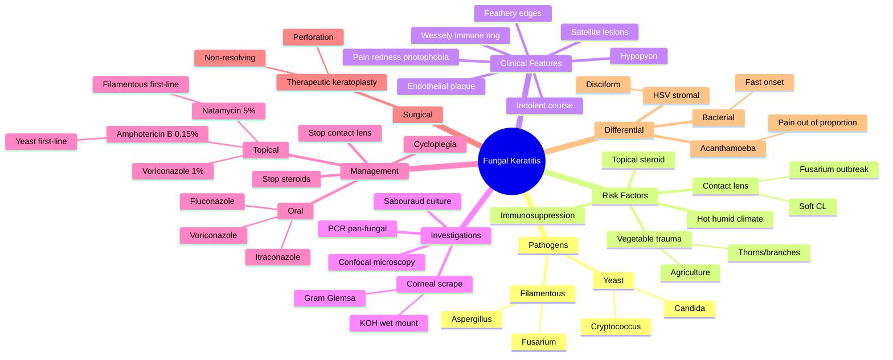

# Fungal Keratitis

Related: [[Bacterial Keratitis]], [[Acanthamoeba Keratitis]], [[Viral Keratitis (HSV)]]

> [!tip] **FCPS/MRCP Priority: HIGH**
> Trauma with vegetable matter (agriculture) is the classic risk. Slowly progressive, satellite lesions, hypopyon. Treat with topical natamycin or amphotericin.

---

## Learning Objectives
- [ ] Define fungal (mycotic) keratitis and identify common organisms
- [ ] Recognise trauma with vegetable matter as the most important risk factor
- [ ] Describe the classic clinical features (feathery edges, satellite lesions, hypopyon)
- [ ] Differentiate fungal from bacterial and Acanthamoeba keratitis
- [ ] List appropriate investigations (KOH mount, Sabouraud culture, confocal)
- [ ] Outline evidence-based management (natamycin, amphotericin B, voriconazole)
- [ ] Identify indications for therapeutic keratoplasty
- [ ] Justify why topical steroids must be stopped

---

## 1. Definition

- **Fungal keratitis (mycotic keratitis):** Corneal infection by filamentous fungi or yeast
- More common in warm, humid climates
- Often in agricultural workers (trauma with plant/soil material)

## 2. Pathogens

| Type | Organisms | Notes |
|------|-----------|-------|
| **Filamentous** | Fusarium, Aspergillus | Trauma with vegetable matter, contact lens |
| **Yeast** | Candida, Cryptococcus | Pre-existing ocular surface disease, immunosuppression |

## 3. Risk Factors

- **Trauma with vegetable matter** (thorns, branches, soil) — most important
- Contact lens wear (esp. soft)
- Topical steroid use
- Immunosuppression (systemic)
- Pre-existing ocular surface disease
- Hot, humid climate

## 4. Clinical Features

- **Indolent course** (slower than bacterial)
- Pain, redness, ↓VA, photophobia
- **White stromal infiltrate** with **feathery edges** (filamentous)
- **Satellite lesions** (smaller infiltrates around main)
- **Hypopyon** (common)
- **Immune ring** (Wessely ring) — sterile infiltrate at antigen-antibody interface
- **Endothelial plaque**
- AC reaction
- Dry-looking, textured surface

## 5. Investigations

- **Corneal scrape:** Gram, Giemsa, KOH wet mount (fungal hyphae), culture on Sabouraud agar
- **PCR** (pan-fungal)
- **Confocal microscopy** (in vivo, fungal hyphae)
- Anterior segment OCT

## 6. Differential

- **Bacterial keratitis:** Faster, more painful
- **Acanthamoeba:** Pain out of proportion, ring infiltrate late, radial keratoneuritis
- **HSV stromal:** Disciform, no feathery edges
- **Sterile infiltrate:** Steroid-related

## 7. Management

### Medical
- **Topical antifungal:**
  - **Natamycin 5%** (polyene) — first-line for filamentous
  - **Amphotericin B 0.15%** — for yeast (Candida)
  - **Voriconazole 1%** — newer, broad-spectrum
  - **Econazole, miconazole** — alternatives
- Hourly initially
- **Oral antifungal:** Voriconazole, itraconazole, fluconazole (deep stromal/endothelial)
- **Cycloplegia** for comfort
- **Stop steroids** (worsen)
- **Stop contact lens**

### Surgical
- **Therapeutic keratoplasty** for non-resolving, perforation, or severe

## 8. Complications

- Corneal perforation
- Endophthalmitis (rare but devastating)
- Dense stromal scarring → permanent visual loss
- Secondary glaucoma
- Recurrence in corneal graft
- Cataract (from chronic inflammation or steroid use)

## 9. Red Flags / Emergencies

- Hypopyon with rapid progression
- Endothelial plaque suggesting deep stromal extension
- Impending or actual corneal perforation (Descemetocele)
- Associated endophthalmitis (vitreous involvement, severe pain)
- Failure to respond to 48–72 h of intensive topical antifungal

## 10. FCPS/MRCP High-Yield Summary

| Topic | Key Points |
|-------|------------|
| Risk factor | Trauma with vegetable matter (agriculture) |
| Organism | Fusarium, Aspergillus (filamentous) |
| Sign | Feathery infiltrate, satellite lesions, hypopyon |
| Slow progression | vs bacterial (faster) |
| Treatment | Topical natamycin (filamentous), amphotericin B (yeast) |
| Steroids | Worsen — stop |

## 11. Viva Questions

1. **Q:** How do you differentiate fungal from bacterial keratitis?
   **A:** Fungal = slower, feathery infiltrate, satellite lesions, trauma with vegetable matter, hypopyon. Bacterial = faster, more painful, mucopurulent discharge, well-defined infiltrate.

2. **Q:** What is the drug of choice for filamentous fungal keratitis?
   **A:** Topical natamycin 5%.

3. **Q:** What is the Wessely (immune) ring?
   **A:** A sterile ring-shaped stromal infiltrate at the antigen–antibody complex interface; characteristic (but not pathognomonic) of fungal keratitis.

4. **Q:** When is therapeutic keratoplasty indicated?
   **A:** For non-resolving infection, impending or actual perforation, or dense central scar post-infection.

5. **Q:** Why must topical steroids be stopped?
   **A:** Steroids impair host defence, worsen fungal growth, and lead to deeper stromal invasion and perforation.

## 12. Common Confusions / Exam Traps

| Confusion | Clarification |
|-----------|---------------|
| "Fungal keratitis is acute" | Usually INDOLENT — develops over days to weeks (slower than bacterial) |
| "Fungal ulcers have round, well-defined edges" | Filamentous fungi cause FEATHERY, irregular edges; yeasts cause more discrete lesions |
| "Natamycin is first-line for all fungi" | Natamycin first-line for FILAMENTOUS fungi; Amphotericin B first-line for YEAST (Candida) |
| "Steroids help reduce inflammation in fungal keratitis" | Steroids WORSEN fungal keratitis — must be stopped |
| "Fungal keratitis is rare in contact lens wearers" | Fusarium in soft contact lens wearers (esp. ReNu with MoistureLoc outbreak) is a recognised cause |
| "Negative KOH rules out fungal keratitis" | KOH has limited sensitivity; culture on Sabouraud agar and PCR may be needed |
| "Fungal hypopyon is sterile" | Usually sterile (no anterior chamber invasion), but co-existing endophthalmitis must be excluded |

## 13. Mnemonics

1. **"Fungal = FARM"** — **F**eathery edges, **A**gricultural trauma, **R**ing infiltrate (Wessely), **M**ultiple satellite lesions
2. **"Natamycin = Nasty filamentous fungi"** — first-line for Fusarium, Aspergillus; Amphotericin B for yeast
3. **"SAT = Slow And Tedious"** — fungal keratitis is **S**low, has **A**djunct **T**endrils (feathery edges), and is **T**ime-consuming to treat

## 14. Mind Map

## 15. One-Page Revision Card

| **Topic** | **Fungal Keratitis** |
|-----------|----------------------|
| **Most important risk factor** | Trauma with vegetable matter (agriculture) |
| **Common organisms** | Fusarium, Aspergillus (filamentous); Candida (yeast) |
| **Hallmark features** | Feathery infiltrate edges, satellite lesions, hypopyon |
| **Course** | Indolent (slower than bacterial) |
| **First-line — filamentous** | Topical natamycin 5% |
| **First-line — yeast** | Topical amphotericin B 0.15% |
| **Steroids** | Stop — worsen infection |
| **Investigation** | KOH wet mount, Sabouraud culture, PCR |
| **Surgery** | Therapeutic keratoplasty for perforation / non-resolving |
| **Viva Pearl** | "FARM" mnemonic: Feathery, Agricultural, Ring, Multiple satellites |

---

## Spaced Repetition Trackers

### 24-Hour Recall Prompts
- [ ] Define fungal keratitis and name two filamentous organisms
- [ ] List the most important risk factor
- [ ] Describe 3 characteristic slit-lamp features
- [ ] Differentiate fungal from bacterial keratitis
- [ ] State the first-line antifungal for filamentous fungi and for yeast
- [ ] Explain why topical steroids must be stopped
- [ ] List the indications for therapeutic keratoplasty

### Revision Schedule
- [ ] **Day 1** completed (creation + 24h recall)
- [ ] **Day 3** revision completed
- [ ] **Day 7** revision completed
- [ ] **Day 15** revision completed
- [ ] **Day 30** revision completed
- [ ] **Day 90** revision completed

## Must Know / Should Know / Nice to Know

### Must Know (Core for passing)
- [x] Trauma with vegetable matter is the most important risk factor
- [x] Feathery infiltrate edges and satellite lesions are characteristic
- [x] Topical natamycin 5% is first-line for filamentous fungi
- [x] Topical amphotericin B is first-line for yeast (Candida)
- [x] Topical steroids must be stopped

### Should Know (High probability)
- [x] Indolent course (slower than bacterial)
- [x] Common organisms: Fusarium, Aspergillus, Candida
- [x] Investigations: KOH wet mount, Sabouraud culture, PCR
- [x] Indications for therapeutic keratoplasty

### Nice to Know (Differentiator)
- [ ] Wessely immune ring is a sterile antigen–antibody complex
- [ ] Confocal microscopy can visualise hyphae in vivo
- [ ] Fusarium outbreaks in contact lens wearers (ReNu MoistureLoc, 2005–06)
- [ ] Endothelial plaque suggests deep stromal extension

## My Weak Points
- [ ] Add personal weak areas here

## Self-Test Scorecard

| Section | Score /5 |
|---------|----------|
| Understanding: | /10 |
| Recall: | /10 |
| MCQ Performance: | /10 |
| SBA Performance: | /10 |
| Viva Confidence: | /10 |
| Total: | /50 |

> [!tip] **Interpretation:** <35 = weak topic, 35-44 = acceptable but insecure, 45+ = strong exam-ready topic.

## Exam Answer Modes

### Long Answer Skeleton
1. **Definition:** Corneal infection by filamentous fungi (Fusarium, Aspergillus) or yeast (Candida)
2. **Epidemiology:** Warm, humid climates; agricultural workers; contact lens wearers
3. **Risk factors:** Trauma with vegetable matter (most important), CL wear, topical steroids, immunosuppression
4. **Pathogens:** Filamentous (Fusarium, Aspergillus) vs yeast (Candida)
5. **Clinical features:** Indolent course, feathery infiltrate edges, satellite lesions, hypopyon, Wessely ring, endothelial plaque
6. **Investigations:** KOH wet mount, Gram/Giemsa, Sabouraud agar culture, PCR, confocal microscopy
7. **Differential:** Bacterial (faster), Acanthamoeba (pain out of proportion), HSV stromal
8. **Management:**
   - Medical: Natamycin 5% (filamentous) / Amphotericin B 0.15% (yeast); voriconazole as alternative; oral antifungal for deep disease
   - Stop steroids and contact lens; cycloplegia
   - Surgical: Therapeutic keratoplasty for perforation or non-resolving disease
9. **Complications:** Perforation, endophthalmitis, scarring, recurrence in graft

### Short Note Skeleton
- **Definition + risk factor** (agricultural trauma with vegetable matter)
- **Classic features:** feathery edges, satellite lesions, hypopyon
- **First-line:** natamycin (filamentous) / amphotericin B (yeast)
- **Avoid:** topical steroids

### Viva One-Liners
- **Q:** Most important risk factor? → **A:** Trauma with vegetable matter (agriculture)
- **Q:** First-line for filamentous fungi? → **A:** Topical natamycin 5%
- **Q:** First-line for yeast? → **A:** Topical amphotericin B 0.15%
- **Q:** Differentiate from bacterial? → **A:** Fungal is slower, feathery edges, satellite lesions, history of trauma
- **Q:** What is a Wessely ring? → **A:** Sterile immune ring from antigen–antibody precipitation in the cornea

### Ward-Case Discussion Points
- Always ask about agricultural/occupational exposure in a corneal ulcer
- Stop topical steroids immediately in suspected fungal keratitis
- Corneal scrape for KOH, Gram, Giemsa, and Sabouraud culture before starting antifungal
- Counsel on prolonged treatment (weeks to months)
- Discuss therapeutic keratoplasty in non-resolving or perforating cases

### Last-Night-Before-Exam Sheet
- Top 3 facts: vegetable trauma, feathery edges + satellites, natamycin first-line
- 1 mnemonic: "FARM" — Feathery, Agricultural, Ring, Multiple satellites
- Must-know differential: bacterial (faster), Acanthamoeba (pain out of proportion)
- Stop steroids; consider therapeutic keratoplasty if non-resolving

## Summary

Fungal keratitis (mycotic keratitis) is a sight-threatening corneal infection most often seen after trauma with vegetable matter in agricultural workers, or in soft contact lens wearers (Fusarium). Filamentous fungi (Fusarium, Aspergillus) cause feathery infiltrates with satellite lesions and hypopyon. Yeast (Candida) is more common in immunosuppressed patients with ocular surface disease. The course is indolent compared to bacterial keratitis. Diagnosis is by corneal scrape (KOH wet mount, Sabouraud culture, PCR) and confocal microscopy. First-line treatment is topical natamycin 5% for filamentous fungi and amphotericin B 0.15% for yeast. Topical steroids must be stopped. Therapeutic keratoplasty is indicated for non-resolving infection or perforation.

## MCQs (10)

1. **Question:** The most important risk factor for fungal keratitis is:
   **Options:** A. Diabetes mellitus B. Trauma with vegetable matter C. HIV infection D. Topical steroid use E. Allergy
   **Answer:** B
   **Explanation:** Trauma with vegetable/plant material is the classic risk factor (agricultural workers, gardeners, etc.).

2. **Question:** First-line treatment for filamentous fungal keratitis is:
   **Options:** A. Topical fluoroquinolone B. Topical natamycin 5% C. Topical aciclovir D. Topical vancomycin E. Topical trifluridine
   **Answer:** B
   **Explanation:** Topical natamycin 5% is the first-line antifungal for filamentous fungi (Fusarium, Aspergillus).

3. **Question:** A characteristic clinical feature of fungal keratitis is:
   **Options:** A. Dendritic ulcer B. Satellite lesions C. Pseudomembrane D. Follicles E. Papillae
   **Answer:** B
   **Explanation:** Satellite lesions — smaller infiltrates surrounding the main lesion — are characteristic of fungal keratitis.

4. **Question:** The Wessely (immune) ring in fungal keratitis is due to:
   **Options:** A. Active fungal invasion B. Antigen–antibody precipitation C. Bacterial co-infection D. Steroid use E. Endothelial decompensation
   **Answer:** B
   **Explanation:** A sterile ring-shaped infiltrate at the antigen–antibody complex interface.

5. **Question:** Topical steroids in fungal keratitis:
   **Options:** A. Are first-line B. Worsen infection C. Cure infection D. Have no effect E. Are useful adjuncts
   **Answer:** B
   **Explanation:** Steroids impair host defence, increase fungal growth, and lead to deeper invasion/perforation — must be stopped.

6. **Question:** A 45-year-old farmer has a corneal ulcer with feathery edges, satellite lesions, and hypopyon after trauma with a branch. The most likely organism is:
   **Options:** A. Staphylococcus aureus B. Pseudomonas aeruginosa C. Fusarium D. Acanthamoeba E. Herpes simplex
   **Answer:** C
   **Explanation:** Filamentous fungus Fusarium is classic in vegetable-matter trauma.

7. **Question:** First-line treatment for yeast (Candida) keratitis is:
   **Options:** A. Natamycin 5% B. Amphotericin B 0.15% C. Fluconazole drops D. Miconazole E. Oral itraconazole alone
   **Answer:** B
   **Explanation:** Topical amphotericin B 0.15% is first-line for yeast keratitis (Candida).

8. **Question:** Which investigation is most useful for rapid diagnosis of fungal keratitis from a corneal scrape?
   **Options:** A. Gram stain B. KOH wet mount C. Blood agar culture D. Chocolate agar culture E. PCR for chlamydia
   **Answer:** B
   **Explanation:** KOH wet mount (10–20%) dissolves epithelial cells and reveals fungal hyphae quickly.

9. **Question:** Fusarium keratitis has been associated with an outbreak related to:
   **Options:** A. Topical steroid use B. Soft contact lens solution (ReNu MoistureLoc) C. Hand hygiene D. Swimming pools E. Trauma
   **Answer:** B
   **Explanation:** The 2005–2006 Fusarium keratitis outbreak was linked to ReNu with MoistureLoc contact lens solution.

10. **Question:** Therapeutic keratoplasty in fungal keratitis is indicated for:
    **Options:** A. Any fungal ulcer B. Non-resolving infection or perforation C. Hypopyon alone D. Initial presentation E. Mild stromal infiltrate
    **Answer:** B
    **Explanation:** Indicated for non-resolving infection, impending or actual perforation, or dense central scar after infection control.

## SBA Questions (10)

1. **Scenario:** A farmer has a slow-onset painful red eye with feathery corneal infiltrate, satellite lesions, hypopyon, after being hit by a branch.
   **Question:** Most likely diagnosis?
   **Options:** A. Bacterial keratitis B. Fungal keratitis C. Viral keratitis D. Acanthamoeba keratitis E. Sterile infiltrate
   **Answer:** B
   **Explanation:** Vegetable trauma + feathery/satellite infiltrate = fungal.

2. **Scenario:** A 50-year-old farmer with a fungal ulcer is on topical natamycin. After 5 days, the infiltrate is enlarging and an endothelial plaque is visible. There is a small perforation at the edge of the ulcer.
   **Question:** Most appropriate next step?
   **Options:** A. Increase natamycin frequency B. Add topical steroid C. Therapeutic keratoplasty D. Add oral aciclovir E. Continue observation
   **Answer:** C
   **Explanation:** Non-resolving infection + perforation = therapeutic keratoplasty indicated.

3. **Scenario:** A 60-year-old immunosuppressed renal transplant recipient has a corneal ulcer with a discrete white infiltrate, no feathery edges, after a history of prolonged topical steroid use. KOH wet mount shows budding yeasts.
   **Question:** Most appropriate antifungal?
   **Options:** A. Natamycin 5% B. Amphotericin B 0.15% C. Topical aciclovir D. Topical moxifloxacin E. Oral valaciclovir
   **Answer:** B
   **Explanation:** Budding yeasts on KOH = Candida → amphotericin B 0.15% first-line.

4. **Scenario:** A 35-year-old farmer with a fungal ulcer on topical natamycin is also using topical prednisolone (prescribed elsewhere) for "inflammation".
   **Question:** Most appropriate action regarding the steroid?
   **Options:** A. Continue steroid B. Increase steroid C. Stop steroid immediately D. Switch to dexamethasone E. Taper slowly
   **Answer:** C
   **Explanation:** Steroids worsen fungal keratitis — must be stopped immediately.

5. **Scenario:** A 40-year-old gardener presents 10 days after a thorn injury with a corneal ulcer. Slit-lamp shows a feathery infiltrate, satellite lesions, and a 0.5 mm hypopyon. Visual acuity is 6/60.
   **Question:** What is the most appropriate first-line medical therapy?
   **Options:** A. Topical moxifloxacin B. Topical natamycin 5% C. Topical aciclovir D. Topical prednisolone E. Topical amphotericin B
   **Answer:** B
   **Explanation:** Filamentous fungal keratitis (thorn trauma, feathery edges) → natamycin 5% first-line.

6. **Scenario:** A patient with a fungal ulcer is on hourly natamycin 5% and oral voriconazole. After 3 weeks, infiltrate is smaller but the cornea is thinning centrally. There is a positive Seidel test.
   **Question:** What is the most appropriate management?
   **Options:** A. Continue current treatment B. Add topical steroid C. Therapeutic keratoplasty D. Add topical ciclosporin E. Add bandage contact lens alone
   **Answer:** C
   **Explanation:** Positive Seidel = perforation; therapeutic keratoplasty needed.

7. **Scenario:** A patient with culture-proven Fusarium keratitis on natamycin is improving. On day 21, there is a small persistent epithelial defect with no infiltrate. Visual acuity 6/24.
   **Question:** Most appropriate action?
   **Options:** A. Add topical steroid B. Add oral itraconazole C. Continue antifungal; consider tarsorrhaphy/BCL for epithelial healing D. Therapeutic keratoplasty E. Stop antifungal
   **Answer:** C
   **Explanation:** Stromal infiltrate resolved; persistent epithelial defect treated supportively with lubrication, bandage CL or tarsorrhaphy.

8. **Scenario:** A 22-year-old soft contact lens wearer has a slowly progressive corneal ulcer. KOH shows septate hyphae with 45° branching. Sabouraud culture grows a white fluffy colony.
   **Question:** Most likely organism?
   **Options:** A. Candida albicans B. Fusarium species C. Acanthamoeba D. Pseudomonas E. Herpes simplex
   **Answer:** B
   **Explanation:** Septate hyphae, 45° branching, fluffy colony = Fusarium.

9. **Scenario:** A patient with fungal keratitis is on topical natamycin. He develops a Wessely ring in the mid-periphery.
   **Question:** What does the Wessely ring represent?
   **Options:** A. Active fungal growth B. Sterile antigen–antibody complex C. Hypopyon D. Corneal oedema E. Endothelial plaque
   **Answer:** B
   **Explanation:** Wessely ring = sterile immune ring (antigen–antibody precipitation); not a sign of active infection.

10. **Scenario:** A 30-year-old agricultural worker with a fungal ulcer has been on intensive topical natamycin for 2 weeks. There is persistent hypopyon and an endothelial plaque but a slightly smaller stromal infiltrate. Vision is hand movements.
    **Question:** What is the next most appropriate step?
    **Options:** A. Switch to amphotericin B B. Add topical steroid C. Add oral voriconazole and consider surgical intervention if no response D. Add oral aciclovir E. Add topical cyclosporine
    **Answer:** C
    **Explanation:** Deep stromal/endothelial involvement → add oral antifungal (voriconazole) and consider therapeutic keratoplasty.

## Flashcards

- **Q:** What is the most important risk factor for fungal keratitis?
  **A:** Trauma with vegetable matter (agricultural workers, gardeners).
- **Q:** Name three characteristic clinical features of fungal keratitis.
  **A:** Feathery infiltrate edges, satellite lesions, hypopyon.
- **Q:** What is the first-line treatment for filamentous fungal keratitis?
  **A:** Topical natamycin 5%.
- **Q:** What is the first-line treatment for yeast (Candida) keratitis?
  **A:** Topical amphotericin B 0.15%.
- **Q:** Why must topical steroids be stopped in fungal keratitis?
  **A:** Steroids impair host defence, increase fungal growth, and can lead to perforation.

## Answer Key with Explanations

### MCQs
1. B — Vegetable trauma is the most important risk factor for fungal keratitis
2. B — Natamycin 5% is first-line for filamentous fungi
3. B — Satellite lesions are characteristic (smaller infiltrates around the main lesion)
4. B — Wessely ring = sterile antigen–antibody complex
5. B — Steroids worsen fungal keratitis — must be stopped
6. C — Filamentous fungus Fusarium is classic in vegetable-matter trauma
7. B — Amphotericin B 0.15% is first-line for yeast (Candida)
8. B — KOH wet mount is the quickest way to visualise fungal hyphae
9. B — The 2005–06 Fusarium keratitis outbreak was linked to ReNu MoistureLoc
10. B — Therapeutic keratoplasty is for non-resolving infection or perforation

### SBAs
1. B — Vegetable trauma + feathery/satellite = fungal keratitis
2. C — Non-resolving infection + perforation = therapeutic keratoplasty
3. B — Candida (yeast) → amphotericin B 0.15% first-line
4. C — Steroids worsen fungal keratitis — stop immediately
5. B — Filamentous fungal keratitis (thorn trauma, feathery) → natamycin 5%
6. C — Positive Seidel = perforation → therapeutic keratoplasty
7. C — Stromal infiltrate resolved; supportive care for persistent epithelial defect
8. B — Septate hyphae, 45° branching, fluffy colony = Fusarium
9. B — Wessely ring = sterile immune ring (antigen–antibody precipitation)
10. C — Deep stromal involvement → oral antifungal + consider surgery

## Tags
#medicine #davidson #ophthalmology #fungal #keratitis #fcps #mrcp
