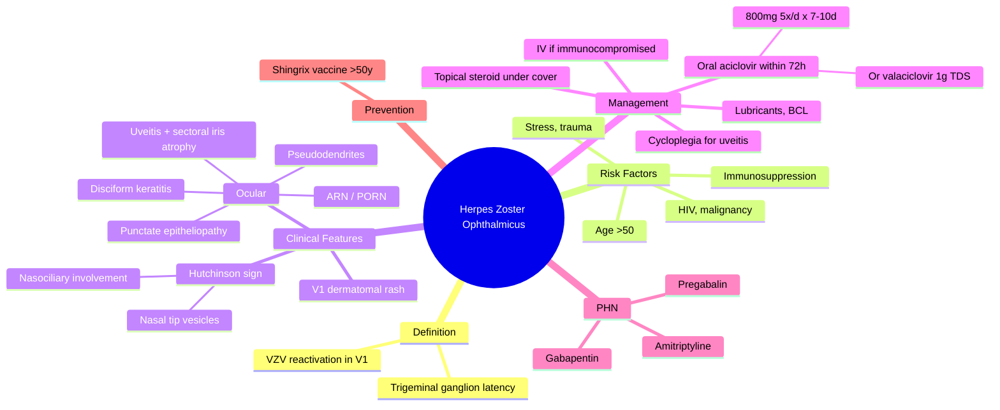

# Herpes Zoster Ophthalmicus

Related: [[Viral Keratitis (HSV)]], [[Anterior Uveitis (Iritis)]], [[Corneal Ulcer]]

> [!tip] **FCPS/MRCP Priority: CRITICAL**
> V1 dermatomal distribution. Hutchinson sign (nasociliary involvement) predicts eye involvement. Treat with oral aciclovir within 72h. Pseudodendrites, keratitis, uveitis, post-herpetic neuralgia.

---

## Learning Objectives
- [ ] Define HZO and describe its pathogenesis (VZV reactivation in V1)
- [ ] Identify Hutchinson sign and explain its significance
- [ ] Recognise ocular manifestations (keratitis types, uveitis with sectoral iris atrophy)
- [ ] Initiate acute management (antiviral within 72h)
- [ ] Diagnose and manage postherpetic neuralgia
- [ ] Counsel on prevention with zoster vaccination

---

## 1. Definition

- **Herpes Zoster Ophthalmicus (HZO):** Reactivation of VZV in the ophthalmic division (V1) of the trigeminal nerve
- Affects 10–20% of zoster cases
- Half have ocular involvement (higher with nasociliary nerve = Hutchinson sign positive)

## 2. Pathogenesis

- Primary: varicella (chickenpox)
- Latency: trigeminal ganglion
- Reactivation: immunosuppression, age, stress
- V1 → frontal nerve → supraorbital/supratrochlear; **nasociliary branch** → tip of nose, cornea, iris

## 3. Clinical Features

### Acute (within 1 week)
- **Prodromal:** Headache, fever, malaise, hyperaesthesia
- **Rash:** Unilateral, dermatomal, V1 distribution, doesn't cross midline
  - Maculopapular → vesicular → pustular → crusted
- **Hutchinson sign:** Vesicles on tip of nose, side of nose = nasociliary involvement → predicts eye involvement

### Ocular Manifestations
- **Blepharitis:** Vesicles, lid oedema
- **Conjunctivitis:** Follicular, sometimes pseudomembranous
- **Keratitis:**
  - **Punctate epithelial** (early)
  - **Pseudodendrites** (no terminal bulbs, "stuck-on" mucous — vs HSV true dendrites)
  - **Anterior stromal** (later)
  - **Disciform keratitis** (immune)
  - **Mucous plaque keratitis** (chronic, late)
  - **Exposure keratopathy** (lagophthalmos from lid involvement)
  - **Neurotrophic keratopathy** (post-herpetic, chronic)
- **Uveitis:** Often with sectoral iris atrophy (patchy iris depigmentation) — characteristic of VZV
- **Scleritis/episcleritis**
- **Retinitis** (acute retinal necrosis, progressive outer retinal necrosis — in immunocompromised)
- **Orbital inflammation**

### Chronic / Late
- **Postherpetic neuralgia (PHN):** Pain >90 days after rash — common, debilitating
- **Post-herpetic neuralgia** (50% over 60y)
- Scarring, lid malposition
- Secondary glaucoma, cataract
- Persistent epithelial defects

## 4. Investigations

- Clinical diagnosis (typical dermatomal rash)
- PCR of vesicular fluid, aqueous (uncertain cases)
- AC tap for uveitis (PCR for VZV/HSV)

## 5. Differential Diagnosis

| Condition | Distinguishing Features |
|-----------|------------------------|
| **HSV keratitis** | True dendrites with terminal bulbs, recurrent, no dermatomal rash |
| **Contact dermatitis** | No vesicles in dermatomal pattern, history of contact |
| **Bacterial keratitis** | Single corneal ulcer, no rash |
| **Orbital cellulitis** | Proptosis, painful eye movements, fever |
| **Impetigo** | Honey-coloured crust, not dermatomal |

## 6. Red Flags / Emergencies

- Hutchinson sign positive — high risk of sight-threatening eye involvement
- Acute retinal necrosis (immunocompromised) — emergency
- Progressive outer retinal necrosis (PORN) in HIV — high mortality
- Optic neuritis
- Contralateral hemiplegia (cerebral vasculitis — rare)
- Hypotension / dissemination in immunocompromised

## 7. Management

### Acute (within 72h of rash)
- **Oral aciclovir 800 mg 5×/day × 7–10 days** (or valaciclovir 1g TDS / famciclovir)
- **Reduce severity, PHN risk**
- IV aciclovir if immunocompromised, neurological, retinitis
- **Topical aciclovir** for keratitis
- **Topical steroid** for stromal keratitis, uveitis, scleritis (under antiviral cover)
- **Cycloplegia** for uveitis
- **Analgesia** (PHN prevention)
- **Lubricants, BCL, tarsorrhaphy** for exposure

### PHN
- **Gabapentin, pregabalin**
- Tricyclic antidepressants (amitriptyline)
- Topical lidocaine, capsaicin
- Capsaicin patch

### Prevention (Vaccination)
- **Recombinant zoster vaccine (Shingrix)** — recommended for >50 y, 2 doses
- Reduces zoster and PHN

## 8. FCPS/MRCP High-Yield Summary

| Topic | Key Points |
|-------|------------|
| Cause | VZV reactivation in V1 |
| Hutchinson sign | Vesicle on tip of nose = nasociliary involvement |
| Eye involvement | 50% with HZO, more with Hutchinson |
| Keratitis | Pseudodendrites (no terminal bulbs) |
| Uveitis | Sectoral iris atrophy (characteristic) |
| Treatment | Oral aciclovir within 72h |
| PHN | Gabapentin, pregabalin |

## 9. Viva Questions

1. **Q:** What is Hutchinson sign?
   **A:** Vesicles on the tip of the nose, indicating nasociliary nerve involvement, which predicts ocular involvement in HZO.

2. **Q:** How do you differentiate HZV pseudodendrite from HSV dendrite?
   **A:** HZV = pseudodendrite, no terminal bulbs, "stuck-on" mucous, no clear ulcer bed. HSV = true dendrite, terminal bulbs, central staining.

3. **Q:** What is the treatment of HZO within 72h?
   **A:** Oral aciclovir 800 mg 5×/d × 7–10 days, or valaciclovir 1g TDS. Reduces severity and PHN.

4. **Q:** What is postherpetic neuralgia?
   **A:** Pain persisting >90 days after rash onset. Common over 60. Treated with gabapentin/pregabalin/TCA.

5. **Q:** What ocular finding is highly characteristic of VZV uveitis?
   **A:** Sectoral iris atrophy (patchy depigmentation).

6. **Q:** What is the recombinant zoster vaccine and who should receive it?
   **A:** Shingrix — non-live recombinant vaccine with VZV glycoprotein E + AS01B adjuvant. Recommended for immunocompetent adults >50 years as 2 doses 2-6 months apart. Reduces zoster incidence by >90% and PHN.

## 10. Common Confusions / Exam Traps

| Confusion | Clarification |
|-----------|---------------|
| "Hutchinson sign = herpes simplex" | No — Hutchinson sign is the nasal-tip vesicle in HZO. Herpes labialis can also affect the nose but without V1 dermatomal rash. |
| "HZO only in elderly" | Can occur at any age; incidence and severity rise sharply after 50. |
| "Antiviral needed for 2 weeks" | Standard 7-10 days; longer if immunocompromised or active keratitis/retinitis. |
| "Topical steroid alone for HZO keratitis" | Steroids must be COVERED by antivirals — never steroid monotherapy in active VZV. |
| "PHN is rare" | PHN occurs in 10-20% overall, up to 50% in those >60y. |
| "Pseudodendrite = HSV dendrite" | Pseudodendrites are slightly raised, plaque-like, with no terminal bulbs and stain poorly with fluorescein. HSV dendrites have terminal bulbs and a true epithelial ulcer. |
| "Shingrix is a live vaccine" | Shingrix (recombinant VZV gE + AS01B adjuvant) is NON-live; safe in immunocompromised. Zostavax (older) was live attenuated. |

## 11. Mnemonics

1. **"Hutchinson = Hot tip = Higher eye risk"** — vesicles on nasal tip predict ocular involvement
2. **"HZO Pseudodendrites Plaque-like, no bulbs"** — vs HSV true dendrites with terminal bulbs
3. **"V1 = VZV, Visual, Vesicles on forehead"** — three V's of HZO
4. **"A-S-P-I-C-E" for HZO treatment** — Antiviral, Steroid (under cover), Pupil-dilate (cycloplegia), Ice (analgesia), Continue cover, Eye protection

## 12. Mind Map

## 13. One-Page Revision Card

| **Topic** | **Herpes Zoster Ophthalmicus** |
|-----------|--------------------------------|
| **Cause** | VZV reactivation in trigeminal V1 |
| **Key sign** | Hutchinson sign (nasal tip vesicles) |
| **Most characteristic eye finding** | Sectoral iris atrophy with uveitis |
| **Keratitis feature** | Pseudodendrites (no terminal bulbs) |
| **Treatment (acute)** | Oral aciclovir 800 mg 5×/d × 7-10 d, within 72h |
| **Steroid role** | Only under antiviral cover |
| **PHN treatment** | Gabapentin, pregabalin, amitriptyline |
| **Prevention** | Shingrix (recombinant) >50y |
| **ARN/PORN** | Emergency in immunocompromised |

## 14. Spaced Repetition Trackers

### 24-Hour Recall Prompts
- [ ] Define HZO and the role of the nasociliary nerve
- [ ] Describe Hutchinson sign and its predictive value
- [ ] Differentiate HZV pseudodendrite from HSV true dendrite
- [ ] List first-line treatment of HZO within 72h
- [ ] Name 3 drugs used for postherpetic neuralgia

### Revision Schedule
- [ ] **Day 1** completed (creation + 24h recall)
- [ ] **Day 3** revision completed
- [ ] **Day 7** revision completed
- [ ] **Day 15** revision completed
- [ ] **Day 30** revision completed
- [ ] **Day 90** revision completed

## Must Know / Should Know / Nice to Know

### Must Know (Core for passing)
- [x] Definition: VZV reactivation in V1
- [x] Hutchinson sign and its significance
- [x] Pseudodendrite vs HSV dendrite
- [x] Oral aciclovir within 72h
- [x] Sectoral iris atrophy

### Should Know (High probability)
- [x] PHN definition and treatment
- [x] Topical steroid under antiviral cover
- [x] Disciform keratitis (immune)
- [x] ARN/PORN in immunocompromised

### Nice to Know (Differentiator)
- [ ] Shingrix vaccine details
- [ ] PCR for diagnosis
- [ ] Cerebral vasculitis as rare complication

## My Weak Points
- [ ] Add personal weak areas here

## Self-Test Scorecard

| Section | Score /5 |
|---------|----------|
| Understanding: | /10 |
| Recall: | /10 |
| MCQ Performance: | /10 |
| SBA Performance: | /10 |
| Viva Confidence: | /10 |
| Total: | /50 |

> [!tip] **Interpretation:** <35 = weak topic, 35-44 = acceptable but insecure, 45+ = strong exam-ready topic.

## Exam Answer Modes

### Long Answer Skeleton
1. **Definition** — VZV reactivation in V1 trigeminal division
2. **Epidemiology & risk factors** — 10-20% of zoster, age, immunocompromise
3. **Pathogenesis** — latency in trigeminal ganglion, V1 dermatome, nasociliary branch
4. **Clinical features** — prodrome, V1 dermatomal rash, Hutchinson sign, ocular manifestations (keratitis, uveitis, retinitis)
5. **Investigations** — clinical, PCR
6. **Management** — aciclovir within 72h, topical steroid under cover, PHN treatment
7. **Complications** — PHN, secondary cataract/glaucoma, ARN, PORN
8. **Prevention** — Shingrix >50y

### Short Note Skeleton
- Definition + Hutchinson sign
- Keratitis types (pseudodendrites, disciform, mucous plaque)
- Acute treatment (aciclovir 800mg 5x/d within 72h)
- PHN management (gabapentin/pregabalin)

### Viva One-Liners
- **Q:** What is HZO? → **A:** VZV reactivation in V1 trigeminal division
- **Q:** Hutchinson sign? → **A:** Vesicles on nasal tip = nasociliary involvement = predicts eye disease
- **Q:** Pseudodendrite vs dendrite? → **A:** HZV = plaque-like, no bulbs; HSV = true dendrite with terminal bulbs
- **Q:** Treatment? → **A:** Oral aciclovir 800 mg 5×/d × 7-10d, within 72h of rash
- **Q:** PHN treatment? → **A:** Gabapentin, pregabalin, amitriptyline

### Ward-Case Discussion Points
- Recognise the dermatomal V1 distribution and asymmetry (does not cross midline)
- Identify Hutchinson sign on the nose
- Examine the cornea with fluorescein for pseudodendrites
- Check anterior chamber cells (uveitis) and IOP
- Dilate fundus exam to look for ARN/PORN in immunocompromised
- Initiate oral aciclovir within 72h window
- Counsel about PHN and vaccine prevention

### Last-Night-Before-Exam Sheet
- **Top 5 facts:** V1 dermatomal, Hutchinson sign, pseudodendrite, aciclovir within 72h, sectoral iris atrophy
- **Mnemonic:** "Hutchinson = Hot tip = Higher eye risk"
- **Must-know differential:** Pseudodendrite (HZV) vs true dendrite (HSV) — bulbs or no bulbs
- **PHN:** gabapentin, pregabalin, amitriptyline
- **Vaccine:** Shingrix (recombinant, non-live)

## Summary

HZO is VZV reactivation in V1, with ocular involvement in 50% (higher with nasociliary involvement). Hutchinson sign predicts eye disease. Treatment is oral aciclovir within 72h. Complications include PHN, keratitis (pseudodendrites), uveitis with sectoral iris atrophy, and post-herpetic neuralgia.

## MCQs (10)

1. **Question:** Hutchinson sign in HZO indicates involvement of the:
   **Options:** A. Trigeminal nerve B. Nasociliary branch of V1 C. Facial nerve D. Optic nerve E. Ciliary ganglion
   **Answer:** B
   **Explanation:** Vesicles on the tip of the nose indicate nasociliary nerve involvement, predicting ocular involvement.

2. **Question:** HZV pseudodendrites differ from HSV dendrites because they:
   **Options:** A. Have terminal bulbs B. Lack terminal bulbs and are raised plaque-like C. Are larger and central D. Are more painful E. Cause hypopyon
   **Answer:** B
   **Explanation:** Pseudodendrites are slightly raised, lack terminal bulbs, are "stuck-on" mucous plaques, and stain poorly with fluorescein.

3. **Question:** First-line systemic treatment of HZO within 72 hours of rash onset is:
   **Options:** A. Topical steroid B. Oral aciclovir 800 mg 5×/day C. Topical antibiotic D. IV methylprednisolone E. Observation
   **Answer:** B
   **Explanation:** Oral aciclovir 800 mg five times daily for 7-10 days, started within 72 hours, reduces severity and PHN risk.

4. **Question:** Sectoral iris atrophy in acute anterior uveitis is most characteristic of:
   **Options:** A. HSV B. VZV / HZV C. CMV D. Toxoplasmosis E. Behçet disease
   **Answer:** B
   **Explanation:** Sectoral iris atrophy is a classic finding in VZV uveitis due to segmental iris ischaemia.

5. **Question:** Postherpetic neuralgia is defined as pain persisting for:
   **Options:** A. >30 days after rash B. >60 days after rash C. >90 days after rash D. >6 months after rash E. >1 year
   **Answer:** C
   **Explanation:** Pain persisting >90 days after rash onset defines PHN.

6. **Question:** The most appropriate treatment of severe postherpetic neuralgia in an elderly patient is:
   **Options:** A. Oral aciclovir B. Topical antibiotic C. Gabapentin or pregabalin D. Topical steroid E. Sub-Tenon steroid
   **Answer:** C
   **Explanation:** Gabapentinoids (gabapentin, pregabalin) and tricyclic antidepressants are first-line for PHN.

7. **Question:** The recombinant zoster vaccine (Shingrix) is recommended for:
   **Options:** A. All adults >18 years B. Adults >50 years C. Children >2 years D. Pregnant women E. Patients with active zoster
   **Answer:** B
   **Explanation:** Shingrix is recommended for immunocompetent adults >50 years, given as 2 doses 2-6 months apart.

8. **Question:** Acute retinal necrosis (ARN) in HZO is most often seen in:
   **Options:** A. Immunocompetent young adults B. Immunocompromised patients C. Pregnant women D. Patients on antihistamines E. Patients on topical NSAIDs
   **Answer:** B
   **Explanation:** ARN and PORN (progressive outer retinal necrosis) occur predominantly in immunocompromised hosts (HIV, transplant, chemotherapy).

9. **Question:** Topical corticosteroids in HZO keratitis should be:
   **Options:** A. Started immediately, alone B. Avoided completely C. Used only with antiviral cover D. Used only in viral culture-positive cases E. Used only after PHN
   **Answer:** C
   **Explanation:** Topical steroids for stromal keratitis, disciform keratitis, or uveitis must always be covered by systemic and/or topical antivirals.

10. **Question:** Which clinical feature is most useful for differentiating HZO from HSV keratitis at presentation?
    **Options:** A. Corneal involvement B. V1 dermatomal vesicular rash with nasal tip vesicles C. Photophobia D. Reduced VA E. Pain
    **Answer:** B
    **Explanation:** The dermatomal V1 distribution and Hutchinson sign are unique to HZO. HSV is typically recurrent without dermatomal rash.

## SBA Questions (10)

1. **Scenario:** A 70-year-old man presents with a 3-day history of painful vesicular rash in the right V1 distribution, vesicles on the tip of the nose, red eye, photophobia, and reduced vision.
   **Question:** What is the most appropriate immediate systemic treatment?
   **Options:** A. Topical chloramphenicol B. Oral aciclovir 800 mg 5×/day C. Topical steroid D. IV methylprednisolone E. Oral doxycycline
   **Answer:** B
   **Explanation:** Oral aciclovir 800 mg 5×/day for 7-10 days started within 72h of rash reduces severity, ocular complications, and PHN.

2. **Scenario:** A 65-year-old presents 6 weeks after HZO with persistent severe pain in the V1 distribution. There is no rash. Pain is burning and lancinating.
   **Question:** What is the most likely diagnosis and first-line treatment?
   **Options:** A. Recurrent zoster — IV aciclovir B. Postherpetic neuralgia — gabapentin C. Trigeminal neuralgia — carbamazepine D. Cluster headache — sumatriptan E. Temporal arteritis — prednisolone
   **Answer:** B
   **Explanation:** Pain >90 days after rash defines PHN. First-line is gabapentin/pregabalin ± TCA.

3. **Scenario:** A 72-year-old on chemotherapy for lymphoma develops HZO. On day 5 he reports new floaters and a scotoma. Fundus shows peripheral retinal whitening with vasculitis.
   **Question:** Most likely diagnosis?
   **Options:** A. CMV retinitis B. Acute retinal necrosis (ARN) C. Central retinal vein occlusion D. Posterior uveitis (Toxoplasma) E. Retinal detachment
   **Answer:** B
   **Explanation:** ARN presents with peripheral necrotising retinitis, vasculitis, and vitritis, usually in immunocompromised.

4. **Scenario:** A 60-year-old with HZO is found to have a corneal lesion: a raised, linear, grey-white plaque with heaped-up edges and no true ulcer bed. Fluorescein staining is mild and irregular.
   **Question:** What is this finding?
   **Options:** A. HSV dendrite B. HZV pseudodendrite C. Fungal ulcer D. Marginal keratitis E. Corneal abrasion
   **Answer:** B
   **Explanation:** Raised, plaque-like, no terminal bulbs, minimal staining = HZV pseudodendrite.

5. **Scenario:** A 55-year-old develops HZO. The eye shows keratitis with anterior chamber cells, raised IOP, and a wedge-shaped area of iris depigmentation.
   **Question:** What does the sectoral iris depigmentation most likely indicate?
   **Options:** A. Old trauma B. VZV-induced ischaemic iris atrophy C. HSV D. Pigment dispersion E. Congenital variegation
   **Answer:** B
   **Explanation:** Sectoral iris atrophy is characteristic of VZV uveitis from segmental iris ischaemia.

6. **Scenario:** A patient with HZO keratitis is started on topical steroid alone by a colleague. Two weeks later the cornea is worse with a geographic epithelial defect.
   **Question:** Most appropriate next step?
   **Options:** A. Stop steroid B. Increase steroid C. Add oral aciclovir 800 mg 5×/day D. Add topical antibiotic only E. Patch the eye
   **Answer:** C
   **Explanation:** Steroid without antiviral cover can worsen viral keratitis. Initiate systemic (and possibly topical) aciclovir alongside the steroid.

7. **Scenario:** A 68-year-old has HZO with severe keratitis and persistent epithelial defect despite lubricants. There is reduced corneal sensation on testing.
   **Question:** What is the most likely cause of the persistent defect?
   **Options:** A. Bacterial superinfection B. Neurotrophic keratopathy C. Steroid response D. Fungal keratitis E. Glaucoma
   **Answer:** B
   **Explanation:** Post-herpetic loss of trigeminal sensation causes neurotrophic keratopathy — persistent epithelial defect, risk of melting.

8. **Scenario:** A 75-year-old with HZO on oral aciclovir develops worsening pain 3 months later. Examination shows only subtle post-inflammatory skin changes. The eye is quiet.
   **Question:** First-line systemic therapy?
   **Options:** A. Repeat aciclovir B. Gabapentin or pregabalin C. Topical steroid D. High-dose oral NSAID E. Amitriptyline is contraindicated in elderly
   **Answer:** B
   **Explanation:** PHN is treated with gabapentinoids first-line. Amitriptyline is also effective but may be limited by anticholinergic side effects in elderly; both are used.

9. **Scenario:** A 50-year-old is offered vaccination to prevent HZO. The vaccine described is a recombinant VZV glycoprotein E with AS01B adjuvant.
   **Question:** Identify the vaccine.
   **Options:** A. Zostavax B. Shingrix C. Varicella vaccine (Varivax) D. MMR E. BCG
   **Answer:** B
   **Explanation:** Shingrix is the recombinant subunit vaccine (gE + AS01B) — non-live, two-dose schedule.

10. **Scenario:** A 60-year-old HIV-positive patient on ART presents with rapidly progressive HZO and reports new "curtain" coming across vision. Fundus shows bilateral peripheral retinal necrosis without significant vitritis.
    **Question:** Most likely diagnosis?
    **Options:** A. CMV retinitis B. Progressive outer retinal necrosis (PORN) C. ARN D. Toxoplasma retinochoroiditis E. Endophthalmitis
    **Answer:** B
    **Explanation:** PORN occurs in severely immunocompromised (often AIDS) with rapid bilateral retinal necrosis and minimal vitritis — distinct from ARN.

## Flashcards

- **Q:** What is HZO?
  **A:** Reactivation of varicella zoster virus (VZV) in the ophthalmic division (V1) of the trigeminal nerve, with potential ocular involvement.
- **Q:** What is Hutchinson sign?
  **A:** Vesicles on the tip/side of the nose indicating nasociliary nerve involvement, predicting eye involvement in HZO.
- **Q:** How do HZV pseudodendrites differ from HSV dendrites?
  **A:** HZV pseudodendrites are raised, plaque-like, lack terminal bulbs, and stain poorly with fluorescein; HSV dendrites have terminal bulbs, a true ulcer, and stain brightly centrally.
- **Q:** First-line treatment of HZO within 72 hours?
  **A:** Oral aciclovir 800 mg five times daily for 7-10 days (or valaciclovir 1 g TDS / famciclovir).
- **Q:** What is postherpetic neuralgia (PHN)?
  **A:** Pain persisting >90 days after rash onset, common in elderly; treated with gabapentin, pregabalin, amitriptyline.

## Answer Key with Explanations

### MCQs
1. B — Hutchinson sign = nasociliary involvement, predicts eye disease
2. B — Pseudodendrites are raised plaques without terminal bulbs
3. B — Oral aciclovir 800 mg 5×/day within 72h is standard
4. B — Sectoral iris atrophy is characteristic of VZV uveitis
5. C — PHN = pain >90 days after rash onset
6. C — Gabapentin/pregabalin are first-line for PHN
7. B — Shingrix is recommended for adults >50y
8. B — ARN occurs predominantly in immunocompromised
9. C — Steroids must be covered by antivirals
10. B — V1 dermatomal rash with Hutchinson sign is pathognomonic for HZO

### SBAs
1. B — Aciclovir 800 mg 5×/day within 72h
2. B — PHN — gabapentin/pregabalin
3. B — ARN — peripheral necrotising retinitis in immunocompromised
4. B — HZV pseudodendrite
5. B — VZV ischaemic iris atrophy
6. C — Add systemic aciclovir; steroid monotherapy worsens HZV
7. B — Neurotrophic keratopathy from CN V involvement
8. B — Gabapentinoid first-line for PHN
9. B — Shingrix (recombinant gE + AS01B)
10. B — PORN in severe immunocompromise (AIDS), minimal vitritis

## Tags
#medicine #davidson #ophthalmology #HZO #VZV #fcps #mrcp
