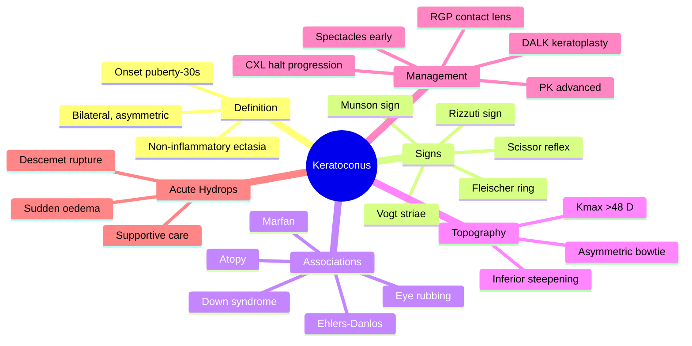

# Keratoconus

Related: [[Astigmatism]], [[Corneal Cross-linking (CXL)]], [[Keratoplasty]]

> [!tip] **FCPS/MRCP Priority: HIGH**
> Progressive ectasia, irregular astigmatism, scissor reflex on retinoscopy. Corneal cross-linking (CXL) halts progression. RGP / scleral lens for visual rehabilitation. Keratoplasty for advanced.

---

## Learning Objectives
- [ ] Define keratoconus and describe its epidemiology
- [ ] Recognise the slit-lamp and retinoscopy signs
- [ ] List systemic and behavioural associations
- [ ] Interpret corneal topography findings
- [ ] Apply management: spectacles, RGP, CXL, keratoplasty
- [ ] Manage acute hydrops

---

## 1. Definition

- **Keratoconus (KC):** Non-inflammatory, progressive thinning and protrusion of the cornea, resulting in irregular astigmatism
- Usually bilateral, asymmetric
- Onset: puberty to 30s, progresses until ~30–40 y

---

## 2. Pathophysiology

- Stromal thinning (central/paracentral)
- Breaks in Bowman's layer
- Iron deposition (Fleischer ring)
- Vogt's striae (deep stromal stress lines)
- Apical scarring (advanced)
- Possible association: eye rubbing, atopy, Down syndrome, Marfan, Ehlers-Danlos, mitral valve prolapse, sleep apnoea

---

## 3. Clinical Features

- **Progressive blurred vision** (frequent spectacle changes)
- **Irregular astigmatism** (cannot be corrected with spectacles)
- **Photophobia, glare, halos**
- **Monocular diplopia** (irregular astigmatism)
- **Scissor reflex** on retinoscopy
- **Munson's sign** (V-shaped lower lid on downgaze — advanced)
- **Rizzuti sign** (conical reflection of light from nasal side)
- **Acute hydrops** (Descemet's rupture, sudden corneal oedema, pain, ↓VA)

---

## 4. Examination

- **Visual acuity:** Variable, often uncorrectable to 6/6
- **Refraction:** Myopic + irregular astigmatism
- **Keratometry:** ↑ K readings, irregular mires
- **Corneal topography/tomography:** Inferior steepening, asymmetric bowtie, ↑ Kmax (>48 D)
- **Pachymetry:** Thinnest pachymetry at apex
- **Slit-lamp:** Fleischer ring (iron), Vogt striae, Munson sign, scarring

### Grading (Amsler-Krumeich)
- Stage 1: eccentric steeping, myopia/astigmatism <5 D
- Stage 2: myopia/astigmatism 5–8 D, no scarring
- Stage 3: myopia/astigmatism 8–10 D, no scarring
- Stage 4: refraction not measurable, central scarring, K>55 D

---

## 5. Management

### Optical (Vision Rehabilitation)
- **Spectacles** (early, low K)
- **RGP (rigid gas permeable) contact lenses** — standard
- **Piggyback, hybrid, scleral lenses** for advanced

### Surgical
- **Corneal cross-linking (CXL):** Halts progression
  - Riboflavin + UVA (Dresden protocol: 30 min, 3 mW/cm²)
  - Indicated: documented progression, Kmax >48 D, age <30, CCT >400 µm
  - Newer accelerated protocols
- **INTACS (intracorneal ring segments):** Flatten cornea, regularise
- **Topography-guided PRK** (combined with CXL)
- **Keratoplasty:**
  - **Deep anterior lamellar keratoplasty (DALK)** — preferred, preserves endothelium
  - **Penetrating keratoplasty (PK)** — for advanced with deep scars, hydrops

### Acute Hydrops
- Supportive: hypertonic saline, cycloplegia, topical steroid, BCL
- Resolves in weeks to months
- May benefit from **CXL** or **Descemet's puncture** (intracameral air/gas to push Descemet's back)

---

## 6. FCPS/MRCP High-Yield Summary

| Topic | Key Points |
|-------|------------|
| Onset | Puberty–30s |
| Sign | Scissor reflex, irregular astigmatism |
| Topography | Inferior steepening, asymmetric bowtie |
| Fleischer ring | Iron deposit at cone base |
| Acute hydrops | Descemet's rupture, sudden oedema |
| Treatment | RGP, CXL (halt), keratoplasty (advanced) |
| Associations | Eye rubbing, atopy, Down, Marfan |

---

## 7. Viva Questions

1. **Q:** What is the slit-lamp sign of keratoconus?
   **A:** Fleischer ring (iron deposit at cone base), Vogt's striae, Munson's sign (V-shaped lower lid in downgaze).

2. **Q:** How is keratoconus treated?
   **A:** RGP/scleral contact lens for vision; corneal cross-linking (CXL) to halt progression; keratoplasty (DALK preferred) for advanced.

3. **Q:** What is acute hydrops?
   **A:** Sudden onset of corneal oedema and ↓VA due to Descemet's membrane rupture in advanced keratoconus. Treat supportively.

---

## 8. Common Confusions / Exam Traps

| Confusion | Clarification |
|-----------|---------------|
| "Keratoconus is inflammatory" | It is **non-inflammatory** ectasia — different from keratitis |
| "CXL improves vision" | CXL **halts progression**; it does not reliably improve visual acuity |
| "Spectacles correct keratoconus" | Spectacles work only in early/mild disease; irregular astigmatism needs RGP |
| "Munson's sign is diagnostic" | It is a sign of **advanced** KC, not early disease |
| "PK is always needed" | DALK is **preferred** (preserves endothelium); PK reserved for deep scars/hydrops |

---

## 9. Mnemonics

1. **"KCN — KC Nibbles the Cone"** — Thinning, protrusion, irregular astigmatism
2. **"Stop the Cone with CXL, See with RGP, Replace with DALK"** — three-step management hierarchy
3. **"F-V-M-R" — Fleischer, Vogt, Munson, Rizzuti** — the four classic slit-lamp signs
4. **"Hand-Rub Damages KC"** — chronic eye rubbing accelerates progression

---

## 10. Mind Map

---

## 11. One-Page Revision Card

| **Topic** | **Keratoconus** |
|-----------|-----------------|
| **Definition** | Non-inflammatory progressive corneal thinning and ectasia |
| **Onset** | Puberty to 30s, progresses till 30–40 y |
| **Key Retinoscopy Sign** | Scissor reflex (irregular astigmatism) |
| **Slit-Lamp Signs** | Fleischer ring, Vogt striae, Munson sign, Rizzuti sign |
| **Topography** | Inferior steepening, asymmetric bowtie, Kmax >48 D |
| **Associations** | Eye rubbing, atopy, Down, Marfan, Ehlers-Danlos |
| **Optical Rx** | Spectacles (early) → RGP / scleral contact lens |
| **Halt Progression** | Corneal cross-linking (CXL): riboflavin + UVA |
| **Surgical** | INTACS, DALK (preferred), PK (advanced) |
| **Acute Hydrops** | Descemet's rupture → sudden corneal oedema, supportive care |
| **Viva Pearl** | CXL halts progression, RGP corrects vision, DALK replaces cornea |

---

## Spaced Repetition Trackers

### 24-Hour Recall Prompts
- [ ] Define keratoconus and state 3 slit-lamp signs
- [ ] List 3 systemic associations
- [ ] Describe the role of CXL
- [ ] Differentiate DALK from PK
- [ ] Explain what acute hydrops is and how to treat it

### Revision Schedule
- [ ] **Day 1** completed (creation + 24h recall)
- [ ] **Day 3** revision completed
- [ ] **Day 7** revision completed
- [ ] **Day 15** revision completed
- [ ] **Day 30** revision completed
- [ ] **Day 90** revision completed

---

## Must Know / Should Know / Nice to Know

### Must Know (Core for passing)
- [x] Definition and onset age
- [x] Scissor reflex and irregular astigmatism
- [x] Topography: inferior steepening, asymmetric bowtie
- [x] CXL halts progression
- [x] DALK vs PK choice

### Should Know (High probability)
- [x] Associations (eye rubbing, atopy, Down, Marfan)
- [x] Acute hydrops (Descemet's rupture)
- [x] Amsler-Krumeich staging
- [x] RGP / scleral contact lens for vision

### Nice to Know (Differentiator)
- [ ] Rizzuti sign
- [ ] Dresden protocol details (3 mW/cm² × 30 min)
- [ ] INTACS / topography-guided PRK
- [ ] INTACS mechanism (flattens cornea)

---

## My Weak Points
- [ ] Add personal weak areas here

---

## Self-Test Scorecard

| Section | Score /5 |
|---------|----------|
| Understanding: | /10 |
| Recall: | /10 |
| MCQ Performance: | /10 |
| SBA Performance: | /10 |
| Viva Confidence: | /10 |
| Total: | /50 |

> [!tip] **Interpretation:** <35 = weak topic, 35-44 = acceptable but insecure, 45+ = strong exam-ready topic.

---

## Exam Answer Modes

### Long Answer Skeleton
1. Definition (non-inflammatory ectasia, onset puberty–30s, bilateral asymmetric)
2. Pathophysiology (stromal thinning, Bowman's breaks, iron deposition)
3. Clinical features (blurred vision, scissor reflex, Munson sign, Fleischer ring, Vogt striae)
4. Associations (eye rubbing, atopy, Down, Marfan, Ehlers-Danlos)
5. Investigations (keratometry, topography — inferior steepening, pachymetry)
6. Management — optical (spectacles, RGP), halt progression (CXL), surgical (INTACS, DALK, PK)
7. Acute hydrops (Descemet's rupture, supportive care)

### Short Note Skeleton
- Definition + onset
- Slit-lamp signs (Fleischer, Vogt, Munson)
- Topography: inferior steepening
- Treatment: RGP, CXL, keratoplasty

### Viva One-Liners
- **Q:** What is keratoconus? → **A:** Non-inflammatory, progressive corneal thinning and protrusion causing irregular astigmatism
- **Q:** Classic retinoscopy sign? → **A:** Scissor reflex
- **Q:** What does CXL do? → **A:** Halts progression (does not improve vision)
- **Q:** Preferred keratoplasty? → **A:** DALK (preserves endothelium)
- **Q:** Acute hydrops cause? → **A:** Descemet's membrane rupture → sudden corneal oedema

### Ward-Case Discussion Points
- Young patient with frequent spectacle changes — think KC
- Demonstrate scissor reflex on retinoscopy
- Order corneal topography (gold standard for diagnosis)
- Counsel against eye rubbing
- Discuss CXL if documented progression
- Recognise acute hydrops (sudden pain, ↓VA, corneal oedema)

### Last-Night-Before-Exam Sheet
- **Top 5 facts:** Non-inflammatory ectasia; puberty onset; scissor reflex; inferior steepening on topography; CXL halts progression
- **Mnemonic:** "F-V-M-R" signs (Fleischer, Vogt, Munson, Rizzuti)
- **Surgical hierarchy:** RGP (vision) → CXL (halt) → DALK (replace)
- **Acute hydrops:** Descemet's rupture, treat supportively

---

## Summary

Keratoconus is a progressive corneal ectasia causing irregular astigmatism. Onset in adolescence. Topography confirms diagnosis. Management: RGP/scleral contact lens (vision); CXL (halt progression); keratoplasty (advanced). Avoid eye rubbing.

---

## MCQs (10)

1. **Question:** Sign of keratoconus on retinoscopy:
   **Options:** A. RAPD B. Scissor reflex C. Marcus Gunn D. Light-near dissociation E. None
   **Answer:** B
   **Explanation:** Scissors reflex = irregular astigmatism.

2. **Question:** Corneal cross-linking in keratoconus is used to:
   **Options:** A. Improve vision B. Halt progression C. Replace cornea D. Treat infection E. None
   **Answer:** B
   **Explanation:** CXL halts progression (UVA + riboflavin).

3. **Question:** Acute hydrops in keratoconus is due to:
   **Options:** A. Infection B. Descemet's rupture C. Cataract D. Glaucoma E. None
   **Answer:** B
   **Explanation:** Descemet's rupture → sudden corneal oedema.

4. **Question:** The classic slit-lamp sign of an iron deposit at the base of the cone in keratoconus is called:
   **Options:** A. Vogt's striae B. Munson sign C. Fleischer ring D. Kayser-Fleischer ring E. Hudson-Stähli line
   **Answer:** C
   **Explanation:** The Fleischer ring is iron (haemosiderin) deposited in the basal epithelial cells at the cone base. (Kayser-Fleischer ring is a copper deposit at the limbus seen in Wilson's disease — different entity.)

5. **Question:** On corneal topography, the earliest and most characteristic finding in keratoconus is:
   **Options:** A. Central flattening B. Superior steepening C. Inferior steepening (asymmetric bowtie pattern) D. Regular with-the-rule astigmatism E. Globular pattern
   **Answer:** C
   **Explanation:** Inferior steepening with an asymmetric bowtie is the hallmark topography pattern; regular with-the-rule astigmatism argues against KC.

6. **Question:** All of the following are recognised associations of keratoconus EXCEPT:
   **Options:** A. Down syndrome B. Marfan syndrome C. Atopic dermatitis D. Chronic eye rubbing E. Diabetes mellitus
   **Answer:** E
   **Explanation:** Down, Marfan, Ehlers-Danlos, mitral valve prolapse, atopy, and eye rubbing are all linked. Diabetes is not a recognised association.

7. **Question:** A 22-year-old with progressive keratoconus (Kmax 52 D, documented progression over 6 months, CCT 460 µm) is best managed with:
   **Options:** A. Spectacles only B. RGP contact lens C. Corneal cross-linking (CXL) D. Penetrating keratoplasty E. LASIK
   **Answer:** C
   **Explanation:** Documented progression + Kmax >48 D + age <30 + CCT >400 µm = classic CXL indication. CXL halts progression; RGP corrects vision but does not stop progression. LASIK is contraindicated.

8. **Question:** The preferred keratoplasty procedure in keratoconus without Descemet's involvement is:
   **Options:** A. Penetrating keratoplasty (PK) B. Deep anterior lamellar keratoplasty (DALK) C. Descemet's stripping endothelial keratoplasty (DSEK) D. Descemet's membrane endothelial keratoplasty (DMEK) E. Limbal stem cell transplant
   **Answer:** B
   **Explanation:** DALK replaces anterior stroma while preserving the patient's healthy endothelium — lower rejection risk than PK. DSEK/DMEK are endothelial procedures (used for Fuchs dystrophy, not KC).

9. **Question:** Munson's sign is best described as:
   **Options:** A. Iron ring at the cone base B. V-shaped deformation of the lower lid on downgaze C. Vertical striae at the deep stroma D. Conical reflection of light from the nasal side E. Reduced corneal sensation
   **Answer:** B
   **Explanation:** A V-shaped (or "knee") angulation of the lower eyelid on downgaze due to the protruding cone — advanced KC sign. C = Vogt's striae, D = Rizzuti sign.

10. **Question:** Acute corneal hydrops in keratoconus typically presents with all of the following EXCEPT:
    **Options:** A. Sudden decrease in visual acuity B. Severe pain C. Profuse mucopurulent discharge D. Corneal oedema E. A break in Descemet's membrane
    **Answer:** C
    **Explanation:** Hydrops is a non-infective rupture of Descemet's — there is pain, ↓VA, stromal/epithelial oedema, but **no discharge** (no infection). Discharge would suggest microbial keratitis.

## SBA Questions (10)

1. **Scenario:** A 20-year-old has progressive blurred vision, frequent spectacle changes, scissor reflex, inferior corneal steepening on topography.
   **Question:** Diagnosis?
   **Options:** A. Myopia B. Astigmatism C. Keratoconus D. Cataract E. Glaucoma
   **Answer:** C
   **Explanation:** Young + progressive + scissor reflex + topography = KC.

2. **Scenario:** A 19-year-old student is found to have Kmax 49 D in the right eye on screening topography. Vision is 6/6 corrected. There is documented 2 D increase in Kmax over 8 months.
   **Question:** Most appropriate next step in management?
   **Options:** A. Observation only B. Spectacles C. Topical steroid D. Corneal cross-linking E. Penetrating keratoplasty
   **Answer:** D
   **Explanation:** Documented progression, Kmax >48 D, age <30 — all criteria for CXL. CXL halts progression. Observation is wrong because progression is already established; PK is far too aggressive at this stage.

3. **Scenario:** A 35-year-old known keratoconus patient presents to A&E with sudden onset of pain, photophobia, and severely reduced vision in the right eye. Slit-lamp shows diffuse corneal oedema with a small break visible in Descemet's membrane.
   **Question:** What is the diagnosis?
   **Options:** A. Microbial keratitis B. Acute hydrops C. Corneal perforation D. Anterior uveitis E. Acute angle-closure glaucoma
   **Answer:** B
   **Explanation:** Sudden pain, ↓VA, corneal oedema, visible Descemet's break in a known KC patient = acute hydrops. There is no discharge (rules out keratitis), no iris details visible due to oedema, and no Seidel-positive leak.

4. **Scenario:** A 25-year-old with advanced keratoconus (Kmax 62 D, central scarring, contact lens intolerance) is being considered for surgery.
   **Question:** Which procedure is most appropriate?
   **Options:** A. LASIK B. Photorefractive keratectomy C. INTACS D. Deep anterior lamellar keratoplasty (DALK) E. DMEK
   **Answer:** D
   **Explanation:** Advanced KC with central scarring and contact-lens failure → keratoplasty indicated. DALK is preferred (preserves endothelium, lower rejection). PK reserved for deep scars / hydrops. INTACS inadequate for advanced disease. LASIK/PRK contraindicated. DMEK is for endothelial disease.

5. **Scenario:** A 22-year-old with keratoconus wears an RGP lens in the right eye and reports mild irritation. Slit-lamp shows a brownish ring at the cone base and vertical lines in the deep stroma.
   **Question:** Which signs are described?
   **Options:** A. Kayser-Fleischer ring + Descemet's folds B. Fleischer ring + Vogt's striae C. Hudson-Stähli line + Munson sign D. Arcus senilis + Rizzuti sign E. Bitot's spots + Haab striae
   **Answer:** B
   **Explanation:** Brown ring at cone base = Fleischer ring (iron). Vertical deep stromal lines = Vogt's striae. Kayser-Fleischer is in Wilson's disease, not KC.

6. **Scenario:** A 30-year-old with newly diagnosed keratoconus (Kmax 46 D, no progression) asks about the role of eye rubbing in his condition.
   **Question:** What is the most appropriate advice?
   **Options:** A. Eye rubbing is harmless B. Continue rubbing as needed C. Stop eye rubbing — it can accelerate progression D. Use a warm compress and rub firmly E. Rub only with a clean towel
   **Answer:** C
   **Explanation:** Chronic eye rubbing is a recognised modifiable risk factor for KC progression. Patients should be counselled to stop.

7. **Scenario:** A 24-year-old presents for refractive surgery. Topography shows bilateral inferior steepening with asymmetric bowtie. Pachymetry is normal.
   **Question:** What is the most appropriate next step?
   **Options:** A. Proceed with LASIK B. Proceed with PRK C. Cancel refractive surgery and refer for keratoconus workup D. Proceed with phakic IOL E. Prescribe spectacles only
   **Answer:** C
   **Explanation:** Inferior steepening + asymmetric bowtie on topography is suspicious for forme fruste / early KC. Refractive surgery (LASIK/PRK) is **contraindicated** — it can cause iatrogenic ectasia. Refer for KC workup (CXL may be indicated if progression).

8. **Scenario:** A 28-year-old with keratoconus develops acute hydrops. Conservative treatment is started.
   **Question:** Which of the following is part of the standard conservative management?
   **Options:** A. Topical fortified antibiotics hourly B. Patching only C. Hypertonic saline, cycloplegia, topical steroid, bandage contact lens D. Intravenous aciclovir E. Oral doxycycline
   **Answer:** C
   **Explanation:** Acute hydrops is non-infective — supportive care: hypertonic saline (dehydrates stroma), cycloplegia (relieves ciliary spasm, prevents posterior synechiae), topical steroid (limits inflammation/scarring), BCL (comfort). Antibiotics are for microbial keratitis, not hydrops.

9. **Scenario:** A 40-year-old with long-standing keratoconus has penetrating keratoplasty. Six months later, the graft is clear, vision is 6/9, and refraction shows significant astigmatism.
   **Question:** What is the most appropriate management?
   **Options:** A. The graft has failed B. Re-do penetrating keratoplasty immediately C. Treat with rigid gas-permeable contact lens / consider astigmatic keratotomy D. Topical steroid intensification E. Enucleation
   **Answer:** C
   **Explanation:** Astigmatism after a clear graft is common and managed conservatively with RGP/scleral lens; refractive surgery (e.g. astigmatic keratotomy, LASIK-on-graft) is a later option. PK is not repeated for refractive error alone.

10. **Scenario:** A 16-year-old with Down syndrome is referred for a routine eye check. Slit-lamp shows bilateral mild inferior corneal steepening on topography with Kmax 49 D and Fleischer rings.
   **Question:** What is the best initial management plan?
   **Options:** A. Penetrating keratoplasty B. Observation only C. Spectacle correction and corneal cross-linking if progression documented D. Topical steroids E. Laser refractive surgery
   **Answer:** C
   **Explanation:** Down syndrome has a strong association with KC. With Kmax approaching 49 D, vision should be corrected (often RGP) and serial topography arranged. CXL is offered if progression is documented. PK is far too aggressive in a 16-year-old with mild disease.

## Flashcards

- **Q:** What is keratoconus?
  **A:** A non-inflammatory, progressive thinning and protrusion of the cornea causing irregular astigmatism, typically presenting in adolescence.
- **Q:** Classic retinoscopy sign in keratoconus?
  **A:** Scissor reflex (due to irregular astigmatism).
- **Q:** Name 3 slit-lamp signs of keratoconus.
  **A:** Fleischer ring (iron at cone base), Vogt's striae (deep stromal stress lines), Munson sign (V-shaped lower lid on downgaze), Rizzuti sign (conical light reflection).
- **Q:** What is the role of corneal cross-linking (CXL)?
  **A:** To **halt progression** of keratoconus — riboflavin + UVA increases stromal collagen cross-links. It does not reliably improve vision.
- **Q:** What is acute hydrops?
  **A:** Sudden corneal oedema and ↓VA due to rupture of Descemet's membrane in advanced KC; managed supportively (hypertonic saline, cycloplegia, BCL, ± steroid).
- **Q:** DALK vs PK — when to choose which?
  **A:** DALK preferred for KC without endothelial involvement (preserves patient's endothelium, lower rejection). PK reserved for advanced disease with deep stromal scarring, perforation, or hydrops-related full-thickness scarring.

## Answer Key with Explanations

### MCQs
1. B — Scissor reflex = irregular astigmatism, classic retinoscopy sign
2. B — CXL halts progression, does not improve vision
3. B — Acute hydrops = Descemet's membrane rupture
4. C — Fleischer ring (iron); Kayser-Fleischer is a different entity (Wilson's)
5. C — Inferior steepening with asymmetric bowtie = KC topography
6. E — Diabetes is not a recognised association
7. C — Documented progression + Kmax >48 D = CXL indication
8. B — DALK preferred (preserves endothelium)
9. B — V-shaped lower lid deformation on downgaze
10. C — Hydrops is non-infective — no discharge

### SBAs
1. C — Young + progressive + scissor reflex + topography = KC
2. D — Documented progression → CXL
3. B — Acute hydrops (Descemet's rupture)
4. D — DALK for advanced KC with central scarring
5. B — Fleischer ring + Vogt's striae
6. C — Stop eye rubbing
7. C — Refractive surgery contraindicated in suspected KC
8. C — Hydrops treated supportively
9. C — Astigmatism after clear graft managed with RGP / refractive surgery
10. C — Down + KC: correct vision, monitor, CXL if progression

## Tags
#medicine #davidson #ophthalmology #keratoconus #CXL #fcps #mrcp
