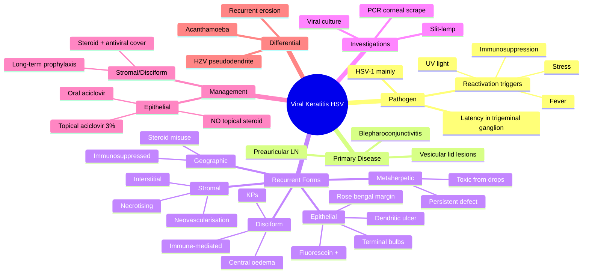

# Viral Keratitis (HSV)

Related: [[Herpes Zoster Ophthalmicus]], [[Bacterial Keratitis]], [[Fungal Keratitis]]

> [!tip] **FCPS/MRCP Priority: CRITICAL**
> Most common cause of corneal blindness in developed countries. Dendritic ulcer is pathognomonic. Treat with topical aciclovir, NOT steroids alone (cause worsening).

---

## Learning Objectives
- [ ] Define HSV keratitis and classify the recurrent forms
- [ ] Describe the pathogenesis (primary infection, latency, reactivation)
- [ ] Identify the pathognomonic slit-lamp finding of epithelial HSV
- [ ] Differentiate true dendrite (HSV) from pseudodendrite (HZV, Acanthamoeba)
- [ ] Recognise decreased corneal sensation as a key clinical sign
- [ ] Outline management of epithelial, stromal, disciform and metaherpetic disease
- [ ] Justify why topical steroids are contraindicated in active epithelial disease
- [ ] State the role of long-term oral aciclovir prophylaxis

---

## 1. Definition

- **Herpes simplex keratitis (HSK):** Corneal infection with HSV-1 (occasionally HSV-2)
- Leading cause of infectious corneal blindness in developed world
- Recurrent

## 2. Pathogenesis

- **Primary infection:** Usually asymptomatic, may have blepharoconjunctivitis
- **Latency:** Trigeminal ganglion
- **Reactivation:** Triggered by fever, UV, stress, immunosuppression, trauma
- Spreads along sensory nerves to cornea

## 3. Clinical Features

### Primary HSV
- Usually unilateral
- Blepharoconjunctivitis (vesicular lid lesions)
- Follicular conjunctivitis
- ± Punctate keratitis
- Preauricular lymphadenopathy

### Recurrent HSV — Multiple Forms
| Type | Description | Slit-lamp |
|------|-------------|-----------|
| **Epithelial (dendritic)** | Most common recurrent | Branching dendritic ulcer with terminal bulbs, fluorescein staining |
| **Geographic** | Larger, map-shaped | Seen in immunosuppressed, prolonged steroid use |
| **Stromal (interstitial/necrotising)** | Deeper, sight-threatening | Stromal infiltrate, oedema, neovascularisation |
| **Disciform (endotheliitis)** | Central disc-shaped oedema | Immune-mediated, ↓ corneal sensation |
| **Metaherpetic** (persistent epithelial defect) | After healing | Non-healing defect, often iatrogenic |

### Key Signs
- **Decreased corneal sensation** (key finding)
- **Dendritic ulcer:** Branching, linear, with **terminal bulbs**, central fluorescein staining, marginal rose bengal
- Stromal: haze, infiltrate, scarring
- Disciform: central disc oedema, KPs, no ulcer

## 4. Investigations

- Clinical (slit-lamp)
- PCR of corneal scrape/tear film (HSV DNA)
- Viral culture (less sensitive, slow)

## 5. Differential Diagnosis

- **HZV (Herpes Zoster):** Pseudodendrites (no terminal bulbs, "stuck-on" mucous), dermatomal V1, Hutchinson sign
- **Acanthamoeba:** Radial keratoneuritis, severe pain, ring infiltrate (late)
- **Bacterial/fungal:** Stromal infiltrate, no dendrite
- **Recurrent erosion syndrome:** No dendrite
- **Marginal keratitis:** Sterile, adjacent to blepharitis

## 6. Management

### Epithelial (Dendritic)
- **Topical aciclovir 3%** — 5×/day × 7–10 days (or ganciclovir 0.15% gel)
- **Oral aciclovir 400 mg 5×/day** × 7–10 days
- **Alternative:** Valaciclovir, famciclovir
- **Debridement** of dendrite (gentle, with cotton-tipped applicator)
- **NO topical steroids** in active epithelial disease (worsens)
- **Mydriatic** for comfort

### Stromal / Disciform
- **Topical steroid (prednisolone 1%)** — under antiviral cover
- **Oral aciclovir 400 mg 5×/d** (prophylactic cover)
- Long-term low-dose oral aciclovir for recurrent stromal disease

### Metaherpetic
- Stop all topical medications
- Lubrication, BCL (bandage contact lens), tarsorrhaphy
- Treat underlying (often toxic from drops)

### Recurrence Prophylaxis
- **Oral aciclovir 400 mg BD** (long-term, ≥1 year) for frequent recurrent disease

## 7. Complications

- Stromal scarring → permanent visual loss
- Secondary bacterial superinfection
- Glaucoma (secondary to inflammation or steroid use)
- Corneal perforation (severe necrotising stromal disease)
- Persistent epithelial defect (metaherpetic ulceration)

## 8. Red Flags / Emergencies

- Dendritic ulcer with hypopyon (consider co-infection)
- Rapidly progressive stromal necrosis (vision-threatening)
- Bilateral disease in children/immunocompromised
- Suspected perforation (Descemetocele)
- Hutchinson sign absent but dermatomal vesicular rash → think HZO/HZV, not HSV

## 9. FCPS/MRCP High-Yield Summary

| Topic | Key Points |
|-------|------------|
| Most common recurrent type | Epithelial (dendritic) |
| Dendrite features | Branching, terminal bulbs, fluorescein positive |
| Decreased sensation | Key sign |
| Treatment | Topical aciclovir + oral |
| Avoid | Steroids in epithelial disease |
| Disciform | Steroid + antiviral cover |
| HZV pseudodendrite | No terminal bulbs, dermatomal |

## 10. Viva Questions

1. **Q:** What is the pathognomonic slit-lamp finding of HSV epithelial keratitis?
   **A:** Dendritic ulcer with terminal bulbs, fluorescein staining, marginal rose bengal.

2. **Q:** Why are topical steroids contraindicated in active epithelial HSV keratitis?
   **A:** Cause geographic ulceration, increased viral replication, worse disease.

3. **Q:** How do you differentiate HSV dendrite from HZV pseudodendrite?
   **A:** HSV = true dendrite, terminal bulbs, central staining. HZV = pseudodendrite ("stuck-on" mucous, no terminal bulbs), dermatomal distribution, Hutchinson sign.

4. **Q:** What is disciform keratitis and how is it managed?
   **A:** Immune-mediated central disc-shaped corneal oedema with keratic precipitates. Treated with topical steroid under oral antiviral cover.

5. **Q:** What is the role of long-term oral aciclovir?
   **A:** Reduces recurrence of epithelial and stromal HSV keratitis, particularly in patients with frequent episodes or in those requiring chronic topical steroids.

## 11. Common Confusions / Exam Traps

| Confusion | Clarification |
|-----------|---------------|
| "HSV dendrite vs HZV pseudodendrite" | HSV = true branching dendrite with terminal bulbs. HZV = "stuck-on" mucous plaque, no terminal bulbs, dermatomal V1 |
| "Disciform keratitis is infectious" | It is immune-mediated (Type IV hypersensitivity to HSV antigen); treat with steroid under antiviral cover |
| "Topical steroid treats HSV" | Steroids alone worsen epithelial disease. Only used with antiviral cover in stromal/disciform disease |
| "Metaherpetic ulcer is recurrent HSV" | It is a non-healing epithelial defect due to toxicity or damage from prior therapy, not active viral replication |
| "Topical steroid is contraindicated in all HSV" | Not true — required in stromal/disciform disease under antiviral cover |
| "HSV always presents with red eye" | Primary infection often silent; recurrent disease may present with subtle foreign body sensation only |

## 12. Mnemonics

1. **"DENDRITE = HSV"** — **D**endritic, **E**nlarging, **N**erve-related (↓ sensation), **D**endritic, **R**ose bengal margin, **I**n fluorescein centre, **T**erminal bulbs, **E**xam essential
2. **"Terminal bulbs TRUE; pseudodendrites STUCK-ON"** — TRUE HSV dendrites have terminal bulbs; HZV/Acanthamoeba pseudodendrites are "stuck-on" mucous with no bulbs
3. **"STAR Therapy for Disciform = STeroid + Anti-viral cover, Reduce slowly"** — never steroid alone in disciform keratitis

## 13. Mind Map

## 14. One-Page Revision Card

| **Topic** | **Viral Keratitis (HSV)** |
|-----------|---------------------------|
| **Pathogen** | HSV-1 (latency in trigeminal ganglion) |
| **Most common recurrent form** | Epithelial (dendritic) |
| **Pathognomonic sign** | Dendritic ulcer with terminal bulbs |
| **Key clinical clue** | Decreased corneal sensation |
| **First-line treatment (epithelial)** | Topical aciclovir 3% + oral aciclovir |
| **Contraindication** | Topical steroid in epithelial disease |
| **Stromal/disciform** | Topical steroid + antiviral cover |
| **Differential** | HZV pseudodendrite, Acanthamoeba |
| **Prophylaxis** | Long-term oral aciclovir 400 mg BD |
| **Viva Pearl** | Dendrites have terminal bulbs; pseudodendrites do not |

---

## Spaced Repetition Trackers

### 24-Hour Recall Prompts
- [ ] Define HSV keratitis and name the most common recurrent form
- [ ] List 4 triggers for HSV reactivation
- [ ] Describe the slit-lamp appearance of a true HSV dendrite
- [ ] Explain why topical steroids are contraindicated in active epithelial disease
- [ ] Outline treatment of disciform keratitis
- [ ] State the dose of oral aciclovir for recurrence prophylaxis

### Revision Schedule
- [ ] **Day 1** completed (creation + 24h recall)
- [ ] **Day 3** revision completed
- [ ] **Day 7** revision completed
- [ ] **Day 15** revision completed
- [ ] **Day 30** revision completed
- [ ] **Day 90** revision completed

## Must Know / Should Know / Nice to Know

### Must Know (Core for passing)
- [x] Dendritic ulcer with terminal bulbs is pathognomonic
- [x] Decreased corneal sensation is a key sign
- [x] Topical aciclovir + oral aciclovir is first-line treatment
- [x] Topical steroids are contraindicated in active epithelial disease
- [x] Differentiation from HZV pseudodendrite (no terminal bulbs)

### Should Know (High probability)
- [x] HSV latency in trigeminal ganglion
- [x] Recurrent forms: epithelial, geographic, stromal, disciform, metaherpetic
- [x] Stromal/disciform disease treated with steroid + antiviral cover
- [x] Long-term oral aciclovir prophylaxis dose (400 mg BD)

### Nice to Know (Differentiator)
- [ ] PCR is the investigation of choice
- [ ] Disciform is immune-mediated (Type IV hypersensitivity)
- [ ] Hutchinson sign distinguishes HZV from HSV (although not always present)
- [ ] The HEDS study showed long-term aciclovir reduces recurrence by ~45%

## My Weak Points
- [ ] Add personal weak areas here

## Self-Test Scorecard

| Section | Score /5 |
|---------|----------|
| Understanding: | /10 |
| Recall: | /10 |
| MCQ Performance: | /10 |
| SBA Performance: | /10 |
| Viva Confidence: | /10 |
| Total: | /50 |

> [!tip] **Interpretation:** <35 = weak topic, 35-44 = acceptable but insecure, 45+ = strong exam-ready topic.

## Exam Answer Modes

### Long Answer Skeleton
1. **Definition:** HSV-1 corneal infection; most common cause of infectious corneal blindness in developed world
2. **Pathogenesis:** Primary infection → latency in trigeminal ganglion → reactivation (fever, UV, stress, immunosuppression)
3. **Classification of recurrent disease:**
   - Epithelial (dendritic) — most common
   - Geographic
   - Stromal (necrotising/interstitial)
   - Disciform (immune-mediated)
   - Metaherpetic
4. **Clinical features:** Unilateral red eye, ↓ corneal sensation, branching dendrite with terminal bulbs
5. **Investigations:** Slit-lamp, PCR of corneal scrape
6. **Differential:** HZV pseudodendrite, Acanthamoeba, bacterial/fungal keratitis
7. **Management:**
   - Epithelial: topical aciclovir 3% + oral aciclovir; NO topical steroid
   - Stromal/disciform: topical steroid + antiviral cover
   - Prophylaxis: oral aciclovir 400 mg BD for frequent recurrences
8. **Complications:** Scarring, perforation, secondary glaucoma, persistent epithelial defect

### Short Note Skeleton
- **Definition + aetiology** (HSV-1, trigeminal latency)
- **Pathognomonic sign** (dendritic ulcer with terminal bulbs, ↓ sensation)
- **First-line treatment** (topical aciclovir + oral)
- **Avoid:** topical steroid in epithelial disease

### Viva One-Liners
- **Q:** What is the pathognomonic finding? → **A:** Dendritic ulcer with terminal bulbs and decreased corneal sensation
- **Q:** Dendrite vs pseudodendrite? → **A:** True dendrite (HSV) has terminal bulbs; pseudodendrite (HZV) is "stuck-on" mucous
- **Q:** Why no topical steroid in epithelial disease? → **A:** Worsens viral replication, causes geographic ulceration
- **Q:** Disciform treatment? → **A:** Topical steroid under antiviral cover
- **Q:** Prophylaxis dose? → **A:** Oral aciclovir 400 mg BD for ≥1 year

### Ward-Case Discussion Points
- Distinguish true dendrite (terminal bulbs) from pseudodendrite (HZV, Acanthamoeba)
- Check corneal sensation (cotton wisp test)
- Always rule out HZV in older patients with dendritic lesions (Hutchinson sign)
- Stop topical steroid if patient is using it
- Counsel on chronicity, recurrence risk, and UV protection

### Last-Night-Before-Exam Sheet
- Top 3 facts: dendrite with terminal bulbs, ↓ sensation, NO topical steroid in epithelial disease
- 1 mnemonic: "Terminal bulbs TRUE; pseudodendrites STUCK-ON"
- Must-know differential: HZV pseudodendrite lacks terminal bulbs
- Treatment: topical aciclovir + oral aciclovir
- Disciform: topical steroid + antiviral cover

## Summary

HSV keratitis is the most common cause of infectious corneal blindness in the developed world. The virus establishes latency in the trigeminal ganglion and reactivates with triggers such as fever, UV light, and immunosuppression. The dendritic ulcer with terminal bulbs and decreased corneal sensation is pathognomonic of epithelial disease. Treat with topical + oral aciclovir; topical steroids are contraindicated in active epithelial disease as they worsen viral replication. Stromal and disciform (immune-mediated) disease requires topical steroid under antiviral cover. Long-term oral aciclovir reduces recurrence in frequently relapsing patients.

## MCQs (10)

1. **Question:** The pathognomonic slit-lamp finding of HSV epithelial keratitis is:
   **Options:** A. Geographic ulcer B. Dendritic ulcer with terminal bulbs C. Ring infiltrate D. Pseudodendrite E. Pannus
   **Answer:** B
   **Explanation:** True dendrite with terminal bulbs is pathognomonic. Geographic is a complication of steroid misuse; ring infiltrate suggests Acanthamoeba.

2. **Question:** Decreased corneal sensation is a feature of:
   **Options:** A. Bacterial keratitis B. HSV keratitis C. Fungal keratitis D. Allergic conjunctivitis E. Blepharitis
   **Answer:** B
   **Explanation:** HSV causes corneal hypoesthesia via trigeminal nerve involvement. A key clinical clue.

3. **Question:** Topical steroids in active epithelial HSV keratitis:
   **Options:** A. Are first-line B. Worsen disease C. Cure disease D. Have no effect E. Reduce pain only
   **Answer:** B
   **Explanation:** Steroids increase viral replication, cause geographic ulceration, and prolong disease — avoid in active epithelial disease.

4. **Question:** Disciform keratitis in HSV is treated with:
   **Options:** A. Steroid alone B. Antiviral alone C. Steroid + antiviral cover D. Observation E. Lubricants
   **Answer:** C
   **Explanation:** Disciform is immune-mediated. Topical steroid must be covered with oral aciclovir to prevent reactivation.

5. **Question:** HSV establishes latency in which ganglion?
   **Options:** A. Geniculate B. Trigeminal C. Superior cervical D. Ciliary E. Sphenopalatine
   **Answer:** B
   **Explanation:** Trigeminal (Gasserian) ganglion is the site of latency; reactivation spreads along ophthalmic division to cornea.

6. **Question:** The most appropriate first-line treatment for epithelial HSV keratitis is:
   **Options:** A. Topical steroid alone B. Topical aciclovir 3% C. Oral steroid D. Topical antibiotic E. Topical antifungal
   **Answer:** B
   **Explanation:** Topical aciclovir 3% five times daily, combined with oral aciclovir, is the standard first-line regimen.

7. **Question:** A pseudodendrite (no terminal bulbs, "stuck-on" mucous) in a dermatomal V1 distribution suggests:
   **Options:** A. HSV epithelial keratitis B. Herpes zoster ophthalmicus C. Acanthamoeba keratitis D. Bacterial keratitis E. Fungal keratitis
   **Answer:** B
   **Explanation:** HZV pseudodendrites are mucous plaques without terminal bulbs, in V1 dermatomal distribution, often with Hutchinson sign.

8. **Question:** The recommended long-term prophylaxis for frequent recurrent HSV keratitis is:
   **Options:** A. Topical steroid BD B. Topical antibiotic TDS C. Oral aciclovir 400 mg BD D. Oral antifungal OD E. No prophylaxis
   **Answer:** C
   **Explanation:** Oral aciclovir 400 mg BD for ≥1 year reduces recurrence by approximately 45% (HEDS study).

9. **Question:** Metaherpetic keratitis is best described as:
   **Options:** A. Recurrence of active HSV infection B. Geographic ulcer from steroid misuse C. Non-healing epithelial defect due to toxicity D. Stromal necrosis E. Disciform oedema
   **Answer:** C
   **Explanation:** Metaherpetic = persistent epithelial defect from toxic medicamentosa, NOT active viral replication. Treat by stopping all toxic drops.

10. **Question:** A 30-year-old patient with recurrent HSV keratitis is being started on long-term oral aciclovir. What is the minimum recommended duration?
    **Options:** A. 1 month B. 3 months C. 6 months D. 1 year E. Lifelong
    **Answer:** D
    **Explanation:** The HEDS study showed benefit with ≥1 year of oral aciclovir 400 mg BD; can be continued longer in severe cases.

## SBA Questions (10)

1. **Scenario:** A 30-year-old has recurrent red eye with a branching ulcer with terminal bulbs on fluorescein staining, decreased corneal sensation.
   **Question:** Most likely diagnosis?
   **Options:** A. Bacterial keratitis B. HSV epithelial keratitis C. HZV keratitis D. Acanthamoeba E. Fungal keratitis
   **Answer:** B
   **Explanation:** Dendrite with terminal bulbs + hypoesthesia = HSV.

2. **Scenario:** A 35-year-old contact lens wearer presents with a red eye. Slit-lamp shows a small branching lesion that lacks terminal bulbs and is "stuck-on" with rose bengal. Pain is severe and out of proportion to signs. Early radial keratoneuritis is visible.
   **Question:** Most likely diagnosis?
   **Options:** A. HSV epithelial keratitis B. Herpes zoster keratitis C. Acanthamoeba keratitis D. Fungal keratitis E. Bacterial keratitis
   **Answer:** C
   **Explanation:** CL wearer + pain out of proportion + radial keratoneuritis = Acanthamoeba.

3. **Scenario:** A 60-year-old man presents with painful red eye and vesicular rash on the forehead sparing the tip of the nose. Slit-lamp shows a "stuck-on" mucous plaque without terminal bulbs.
   **Question:** Most appropriate next step?
   **Options:** A. Topical aciclovir only B. Topical steroid only C. Oral aciclovir 800 mg 5×/day + urgent ophthalmology review D. Observation E. Topical antibiotic
   **Answer:** C
   **Explanation:** Hutchinson sign (nasal tip vesicles) and pseudodendrite = HZO. Requires high-dose oral aciclovir (800 mg 5×/day) to prevent ocular complications.

4. **Scenario:** A patient with known HSV keratitis presents with central disc-shaped corneal oedema, keratic precipitates, and no epithelial defect. Visual acuity is reduced.
   **Question:** Best management?
   **Options:** A. Topical aciclovir only B. Topical steroid only C. Topical steroid + oral aciclovir D. Stop all medication E. Therapeutic keratoplasty
   **Answer:** C
   **Explanation:** Disciform keratitis = immune-mediated. Topical steroid under antiviral cover is correct.

5. **Scenario:** A patient with epithelial HSV keratitis is inadvertently prescribed topical prednisolone by a primary care doctor. The dendritic ulcer has now enlarged into a geographic map-shaped ulcer.
   **Question:** Most appropriate action?
   **Options:** A. Continue steroid B. Increase steroid C. Stop steroid + start topical aciclovir D. Add topical antibiotic only E. Observation
   **Answer:** C
   **Explanation:** Steroid worsened epithelial disease → stop steroid and initiate topical + oral antiviral.

6. **Scenario:** A 28-year-old has had 4 episodes of HSV epithelial keratitis in the past 18 months. Each episode responds to aciclovir. He asks about prevention.
   **Question:** Best preventive strategy?
   **Options:** A. Topical steroid daily B. Long-term oral aciclovir 400 mg BD C. Topical antibiotic prophylaxis D. Topical cyclosporine E. No prophylaxis
   **Answer:** B
   **Explanation:** Long-term oral aciclovir 400 mg BD for ≥1 year reduces recurrence.

7. **Scenario:** A patient with healing HSV epithelial keratitis develops a persistent epithelial defect with smooth, non-staining margins, despite antiviral therapy. There is no dendrite.
   **Question:** Most likely diagnosis?
   **Options:** A. Recurrent HSV B. Geographic ulcer C. Metaherpetic ulcer D. Disciform keratitis E. Stromal necrosis
   **Answer:** C
   **Explanation:** Smooth-edged persistent defect after healing HSV = metaherpetic. Treat by stopping all toxic drops, lubrication.

8. **Scenario:** A 25-year-old man presents with 2 days of red eye, photophobia and a branching corneal ulcer with terminal bulbs. The rest of the eye is quiet.
   **Question:** First-line treatment?
   **Options:** A. Topical aciclovir 3% five times daily + oral aciclovir 400 mg five times daily B. Topical prednisolone C. Topical moxifloxacin D. Topical natamycin E. Topical PHMB
   **Answer:** A
   **Explanation:** Topical aciclovir 3% five times daily + oral aciclovir 400 mg five times daily for 7–10 days is first-line.

9. **Scenario:** A patient with HSV stromal keratitis is being treated with topical steroid and oral aciclovir. After 2 weeks, the infiltrate is improving. The dose of steroid is to be tapered.
   **Question:** What is the minimum duration of antiviral cover during steroid taper?
   **Options:** A. 1 week B. 2 weeks C. Throughout the steroid taper D. None E. Only during acute phase
   **Answer:** C
   **Explanation:** Antiviral cover must be continued throughout the steroid taper to prevent reactivation of epithelial disease.

10. **Scenario:** A patient has a chronic non-healing epithelial defect after multiple episodes of HSV keratitis. Slit-lamp shows a grey, slightly raised lesion with feathery edges and a surrounding immune ring.
    **Question:** Most appropriate next step?
    **Options:** A. Increase topical aciclovir B. Add oral steroid C. Therapeutic keratoplasty (consider) D. Observation E. Add topical antibiotic
    **Answer:** C
    **Explanation:** Features suggest stromal necrosis / impending perforation — therapeutic keratoplasty may be required.

## Flashcards

- **Q:** What is the pathognomonic slit-lamp finding of HSV epithelial keratitis?
  **A:** Dendritic (branching) ulcer with terminal bulbs, central fluorescein staining, marginal rose bengal staining.
- **Q:** Where does HSV establish latency?
  **A:** Trigeminal (Gasserian) ganglion.
- **Q:** Why are topical steroids contraindicated in active epithelial HSV keratitis?
  **A:** They increase viral replication, cause geographic ulceration, and worsen disease.
- **Q:** How is disciform keratitis treated?
  **A:** Topical steroid under oral antiviral cover; never steroid alone.
- **Q:** What is the dose of long-term oral aciclovir for recurrence prophylaxis?
  **A:** 400 mg twice daily for at least 1 year (HEDS study).

## Answer Key with Explanations

### MCQs
1. B — Dendritic ulcer with terminal bulbs is pathognomonic of HSV epithelial keratitis
2. B — HSV causes corneal hypoesthesia via trigeminal nerve involvement
3. B — Steroids increase viral replication and worsen epithelial disease
4. C — Disciform is immune-mediated; steroid requires antiviral cover
5. B — Latency in trigeminal ganglion; reactivates along V1 to cornea
6. B — Topical aciclovir 3% is first-line for epithelial disease
7. B — "Stuck-on" pseudodendrite in V1 distribution = HZV
8. C — HEDS study: oral aciclovir 400 mg BD reduces recurrence
9. C — Metaherpetic = persistent epithelial defect from toxicity, not active virus
10. D — Minimum 1 year of prophylaxis (HEDS protocol)

### SBAs
1. B — Dendrite + terminal bulbs + hypoesthesia = HSV epithelial keratitis
2. C — CL wearer + pain out of proportion + radial keratoneuritis = Acanthamoeba
3. C — Hutchinson sign + pseudodendrite = HZO; needs high-dose oral aciclovir
4. C — Disciform keratitis = immune-mediated; needs steroid + antiviral cover
5. C — Stop steroid (caused geographic ulcer), start antiviral
6. B — Frequent recurrences → long-term oral aciclovir 400 mg BD
7. C — Persistent smooth-edged defect after healing = metaherpetic, not active HSV
8. A — Topical aciclovir 3% 5×/d + oral aciclovir 400 mg 5×/d = first-line
9. C — Antiviral cover must continue throughout steroid taper
10. C — Stromal necrosis / impending perforation = consider therapeutic keratoplasty

## Tags
#medicine #davidson #ophthalmology #HSV #keratitis #fcps #mrcp
