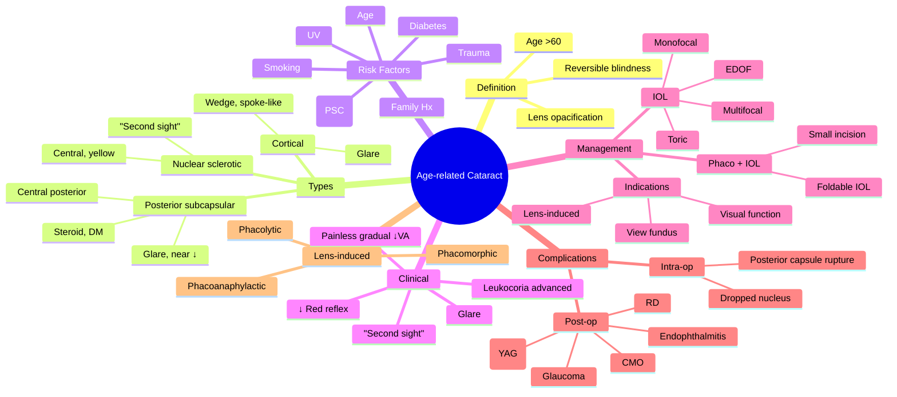

# Age-related Cataract

Related: [[Congenital Cataract]], [[Traumatic Cataract]], [[Secondary Cataract]]

> [!tip] **FCPS/MRCP Priority: CRITICAL**
> Most common cause of reversible blindness worldwide. Slit-lamp: nuclear sclerosis, cortical, posterior subcapsular. Phacoemulsification + IOL is standard surgery.

---

## Learning Objectives
- [ ] Define age-related cataract and identify it as the leading cause of reversible blindness
- [ ] Differentiate the three morphological types (NS, cortical, PSC) and their symptoms
- [ ] List risk factors (age, DM, steroids, UV, smoking)
- [ ] Elicit and interpret clinical features (gradual painless ↓VA, glare, "second sight")
- [ ] State indications for surgery (visual function, not just VA)
- [ ] Describe pre-op workup, phacoemulsification, IOL options, and post-op care
- [ ] Recognise and manage common post-op complications (PCO, endophthalmitis, CMO, RD)

---

## 1. Definition

- **Cataract:** Opacification of the crystalline lens
- **Age-related cataract:** Most common type, typically >60 y
- Leading cause of reversible blindness globally

## 2. Types

| Type | Features | Symptoms |
|------|----------|----------|
| **Nuclear sclerotic (NS)** | Central, yellow-brown, slow | Distance blur, "second sight" (myopic shift) |
| **Cortical (C)** | Peripheral, spoke-like, wedge-shaped | Glare, especially with bright light |
| **Posterior subcapsular (PSC)** | Central posterior, plaque | Rapid ↓VA, glare, near vision affected |

## 3. Risk Factors

- Age (most important)
- UV light exposure
- Diabetes mellitus (2–5× risk)
- Steroid use (posterior subcapsular)
- Smoking
- Alcohol
- Trauma
- Family history
- Uveitis, intraocular surgery
- High myopia
- Ionising radiation

## 4. Clinical Features

- **Gradual, painless, progressive blurred vision**
- Glare (especially with oncoming car lights, bright sun)
- Monocular diplopia (early)
- **"Second sight"** — myopic shift, reading without glasses (early nuclear)
- Reduced colour perception (yellow-brown tinge)
- Difficulty with night driving
- Frequent spectacle changes

### Signs
- **Reduced red reflex** (with ophthalmoscope from 1 m)
- **Leukocoria** (white pupil) in advanced cataract
- Slit-lamp: lens opacity

## 5. Examination

- **Visual acuity:** ↓
- **Refraction:** Myopic shift (NS)
- **Pupils:** Normal (RAPD is a red flag for other pathology)
- **Slit-lamp:** Type, density, location
- **Fundus:** May be obscured by dense cataract
- **B-scan ultrasound:** If fundus not visible (rule out RD, tumour)

## 6. Investigations

- **Slit-lamp examination** — gold standard for diagnosis and classification
- **Visual acuity** (Snellen, logMAR)
- **Refraction and pinhole** — to detect co-existing refractive error
- **IOP** — baseline, rule out lens-related glaucoma
- **Dilated fundus examination** — to look for macular/retinal disease (may be limited)
- **B-scan ultrasonography** — when fundus view is obscured (rule out retinal detachment, tumour)
- **Biometry (IOLMaster / A-scan)** — for pre-operative IOL power calculation
- **OCT macula** — pre-op to detect co-existing maculopathy (diabetic macular oedema, AMD)
- **Specular microscopy** — endothelial cell count in compromised corneas
- **Potential acuity meter (PAM) or retinal acuity metre** — to predict post-op visual potential when media is hazy

## 7. Differential Diagnosis

| Condition | Distinguishing Features |
|-----------|------------------------|
| **Glaucoma (chronic)** | Disc cupping, field loss, IOP rise |
| **Age-related macular degeneration** | Drusen, macular changes, central scotoma |
| **Diabetic retinopathy / maculopathy** | Microaneurysms, exudates, oedema |
| **Corneal opacity** | Surface, stain with fluorescein |
| **Ectopia lentis** | Lens displacement visible at pupil |
| **Posterior capsular opacification (PCO)** | Post-cataract surgery, YAG capsulotomy treats |
| **Retinoblastoma / ocular tumour** | Leukocoria, child, ± strabismus |

## 8. Red Flags / Emergencies

- RAPD (suggests optic nerve or retinal disease, not cataract alone)
- Sudden visual loss — not typical of cataract (consider retinal/vascular cause)
- Painful red eye with cataract — think lens-induced (phacolytic, phacomorphic)
- Acute secondary angle-closure in elderly — lens-related mechanism
- Dense cataract obscuring fundus + diabetic patient — risk of undiagnosed retinopathy
- Suspected intraocular tumour (melanoma, metastasis) on B-scan

## 9. Management

### Indications for Surgery
- Visual impairment affecting daily activities (driving, reading, work)
- VA usually <6/9 (driving standard) or <6/12 in many guidelines
- **Patient's symptoms** are the key (not just VA)
- Lens-induced (phacolytic, phacomorphic, phacoanaphylactic uveitis, glaucoma)
- To facilitate fundus view (diabetic, AMD, glaucoma management)

### Pre-op Workup
- **Biometry:** IOL power calculation (IOLMaster, A-scan)
- Specular microscopy (endothelial cell count)
- OCT macula (rule out co-existing maculopathy)
- Manage co-morbidities: dry eye, blepharitis, glaucoma

### Surgical Technique
- **Phacoemulsification** (ultrasound fragmentation) + IOL implant (gold standard)
  - Small incision (~2.4 mm), sutureless
  - Foldable IOL
- **Extracapsular cataract extraction (ECCE):** Larger incision, sutures
- **Intracapsular:** Rare, mostly historical

### IOL Types
- **Monofocal** (most common, single distance)
- **Toric** (for astigmatism)
- **Multifocal** (presbyopia correction)
- **EDOF** (extended depth of focus)
- **Aspheric**

### Anaesthesia
- Topical (most common), sub-Tenon's, peribulbar, retrobulbar, GA

### Post-op
- Topical antibiotic + steroid
- Avoid eye rubbing
- Monitor for: endophthalmitis (rare), raised IOP, CME, RD, PCO

## 10. Lens-Induced Cataract Complications

- **Phacolytic glaucoma** — leakage of lens protein through intact capsule, macrophages obstruct trabecular meshwork
- **Phacomorphic glaucoma** — intumescent (swollen) lens causing angle closure
- **Phacoanaphylactic uveitis** — immune reaction to retained lens material after capsule rupture/trauma

## 11. Complications of Surgery

| Complication | Notes |
|--------------|-------|
| Posterior capsule opacification (PCO) | 20–40% at 5y, YAG capsulotomy |
| Cystoid macular oedema (CMO) | Irvine-Gass, post-op |
| Endophthalmitis | Rare, emergency |
| Retinal detachment | ↑ in high myopia, complicated surgery |
| Glaucoma | Transient or persistent |
| Suprachoroidal haemorrhage | Rare, severe |
| Posterior capsular rupture** | Most important intra-op complication |
| Dropped nucleus | Vitrectomy needed |

## 12. FCPS/MRCP High-Yield Summary

| Topic | Key Points |
|-------|------------|
| Most common | Age-related |
| Three types | NS, cortical, PSC |
| Most common visual axis | PSC |
| "Second sight" | NS, myopic shift |
| Surgery | Phaco + IOL |
| IOL | Monofocal (single distance) standard |
| Common post-op | PCO (YAG capsulotomy) |

## 13. Viva Questions

1. **Q:** What are the three types of age-related cataract?
   **A:** Nuclear sclerotic, cortical, posterior subcapsular.

2. **Q:** What is "second sight"?
   **A:** Myopic shift due to nuclear sclerotic cataract, allowing presbyopic patients to read without glasses. Temporary.

3. **Q:** What is the most common post-operative complication of cataract surgery?
   **A:** Posterior capsule opacification (PCO), treated with Nd:YAG laser capsulotomy.

4. **Q:** When is surgery indicated?
   **A:** When cataract affects daily activities — visual symptoms, not just visual acuity. Patient's needs drive decision.

5. **Q:** What is the gold standard cataract operation?
   **A:** Phacoemulsification with foldable intraocular lens (IOL) implant via a small (~2.4 mm), sutureless incision.

6. **Q:** What are the lens-induced complications that may necessitate surgery in an otherwise unripe cataract?
   **A:** Phacolytic glaucoma (leakage of lens protein), phacomorphic glaucoma (intumescent lens causing angle closure), and phacoanaphylactic uveitis (immune reaction to lens protein).

7. **Q:** What is the most feared early post-operative complication?
   **A:** Endophthalmitis — typically 3-7 days post-op; presents with pain, redness, ↓VA, hypopyon; emergency vitreous tap and intravitreal antibiotics.

## 14. Common Confusions / Exam Traps

| Confusion | Clarification |
|-----------|---------------|
| "Cataract surgery is indicated when VA <6/60" | Indication is driven by visual FUNCTION and patient symptoms, not an arbitrary VA cut-off. |
| "Cataract is a film over the eye" | Cataract is opacification of the crystalline lens inside the eye, not a surface film. |
| "Second sight is permanent" | Myopic shift is temporary — vision worsens as the cataract progresses. |
| "PCO requires repeat surgery" | PCO is treated with a quick outpatient Nd:YAG laser capsulotomy. |
| "Cortical cataract is most common" | Nuclear sclerotic is the most common morphological type; PSC has the greatest impact on vision per opacity. |
| "All IOLs correct presbyopia" | Monofocal IOLs do NOT — patients still need reading glasses. Multifocal/EDOF IOLs aim to. |
| "Cataract is reversible with drops" | No medical treatment reverses age-related cataract; surgery is definitive. |
| "RAPD can occur in cataract" | RAPD is a sign of optic nerve/retinal disease, NOT cataract — investigate the posterior segment. |
| "Steroid-induced cataract is nuclear" | Steroid-induced cataract is classically posterior subcapsular (PSC). |

## 15. Mnemonics

1. **"NCC" for the three types** — **N**uclear sclerotic, **C**ortical, **C**ortical-posterior (PSC); or **N**uclear, **C**ortical, **P**osterior subcapsular
2. **"PSC = Poor Sight Centrally"** — PSC affects central vision early, hence glare and rapid ↓VA
3. **"2nd Sight = Nuclear"** — Myopic shift = nuclear sclerotic
4. **"PCO is NoT surgery, it's a YAG tap"** — Nd:YAG laser capsulotomy treats PCO

## 16. Mind Map

## 17. One-Page Revision Card

| **Topic** | **Age-related Cataract** |
|-----------|--------------------------|
| **Definition** | Opacification of crystalline lens, age-related, most common cause of reversible blindness |
| **Three types** | Nuclear sclerotic (most common), Cortical, Posterior subcapsular |
| **"Second sight"** | Myopic shift in nuclear sclerotic — temporary |
| **Key risk factors** | Age, DM, UV, smoking, steroids (PSC) |
| **Surgery** | Phacoemulsification + IOL (gold standard) |
| **IOL default** | Monofocal |
| **Common post-op** | PCO → YAG capsulotomy |
| **Emergency post-op** | Endophthalmitis |
| **Lens-induced** | Phacolytic, phacomorphic, phacoanaphylactic uveitis |

## 18. Spaced Repetition Trackers

### 24-Hour Recall Prompts
- [ ] List the three types of age-related cataract and their distinguishing features
- [ ] Define "second sight" and which type it is associated with
- [ ] State 5 risk factors for age-related cataract
- [ ] List indications for cataract surgery
- [ ] Name the most common post-op complication and its treatment
- [ ] Name the three lens-induced cataract complications

### Revision Schedule
- [ ] **Day 1** completed (creation + 24h recall)
- [ ] **Day 3** revision completed
- [ ] **Day 7** revision completed
- [ ] **Day 15** revision completed
- [ ] **Day 30** revision completed
- [ ] **Day 90** revision completed

## Must Know / Should Know / Nice to Know

### Must Know (Core for passing)
- [x] Definition and epidemiology
- [x] Three types (NS, cortical, PSC) and clinical features
- [x] "Second sight" = myopic shift of nuclear cataract
- [x] Phaco + IOL is the gold standard
- [x] PCO is most common post-op complication (YAG)

### Should Know (High probability)
- [x] Risk factors (DM, steroids, UV, smoking)
- [x] Pre-op biometry and IOL power
- [x] Posterior capsular rupture — main intra-op complication
- [x] Endophthalmitis — emergency
- [x] Lens-induced complications (phacolytic, phacomorphic, phacoanaphylactic)

### Nice to Know (Differentiator)
- [ ] IOL types (toric, multifocal, EDOF, aspheric)
- [ ] B-scan when fundus not visible
- [ ] Specular microscopy for endothelial assessment

## My Weak Points
- [ ] Add personal weak areas here

## Self-Test Scorecard

| Section | Score /5 |
|---------|----------|
| Understanding: | /10 |
| Recall: | /10 |
| MCQ Performance: | /10 |
| SBA Performance: | /10 |
| Viva Confidence: | /10 |
| Total: | /50 |

> [!tip] **Interpretation:** <35 = weak topic, 35-44 = acceptable but insecure, 45+ = strong exam-ready topic.

## Exam Answer Modes

### Long Answer Skeleton
1. **Definition** — lens opacification, age-related, leading cause of reversible blindness
2. **Types** — nuclear sclerotic, cortical, posterior subcapsular
3. **Risk factors** — age, DM, UV, steroids (PSC), smoking, trauma
4. **Clinical features** — painless gradual ↓VA, glare, "second sight", ↓red reflex
5. **Investigations** — slit-lamp, refraction, biometry, OCT macula, B-scan if fundus obscured
6. **Indications for surgery** — visual function, not just VA; lens-induced; fundus view
7. **Surgical technique** — phacoemulsification + IOL (gold standard)
8. **IOL options** — monofocal, toric, multifocal, EDOF
9. **Post-op care and complications** — PCO (YAG), endophthalmitis, CMO, RD
10. **Lens-induced complications** — phacolytic, phacomorphic, phacoanaphylactic

### Short Note Skeleton
- Three types and clinical features
- Risk factors
- Phaco + IOL gold standard
- PCO (YAG capsulotomy)

### Viva One-Liners
- **Q:** What is the most common cause of reversible blindness? → **A:** Age-related cataract
- **Q:** Three types of age-related cataract? → **A:** Nuclear sclerotic, cortical, posterior subcapsular
- **Q:** "Second sight"? → **A:** Myopic shift in nuclear cataract allowing reading without glasses — temporary
- **Q:** Most common post-op complication? → **A:** PCO, treated with Nd:YAG laser capsulotomy
- **Q:** Gold standard surgery? → **A:** Phacoemulsification + IOL
- **Q:** Most important intra-op complication? → **A:** Posterior capsule rupture

### Ward-Case Discussion Points
- Take a focused history: gradual, painless ↓VA; glare; night driving; reading; spectacle changes; "second sight"
- Identify risk factors (DM, steroid use, FHx, trauma)
- Examine: VA, refraction, pupils (RAPD), slit-lamp (lens opacity type/density), IOP, fundus (or B-scan)
- Discuss indications: visual function impairment; not just VA threshold
- Counsel on surgical options (phaco + IOL), IOL types, anaesthesia, post-op care
- Recognise lens-induced emergencies (phacolytic/phacomorphic glaucoma)
- Monitor post-op for PCO, endophthalmitis, CMO, RD

### Last-Night-Before-Exam Sheet
- **Top 5 facts:** NS most common; "second sight" = myopic shift; phaco + IOL; PCO → YAG; lens-induced = phacolytic/phacomorphic/phacoanaphylactic
- **Mnemonic:** "NCC" — Nuclear, Cortical, (posterior subcapsular) Cortical-central; or "2nd sight = Nuclear"
- **Risk factors:** Age, DM, UV, smoking, steroids (PSC)
- **Surgery:** Phaco + monofocal IOL (default)
- **Complications:** PCO (most common), endophthalmitis (emergency), CMO, RD

## Summary

Age-related cataract is the leading cause of reversible blindness. Three types: nuclear sclerotic, cortical, posterior subcapsular. Treatment is phacoemulsification + IOL. Most common post-op complication is PCO, treated with YAG capsulotomy. Indication for surgery is visual impairment affecting daily function.

## MCQs (10)

1. **Question:** The most common type of age-related cataract is:
   **Options:** A. Cortical B. Nuclear sclerotic C. Posterior subcapsular D. Traumatic E. Congenital
   **Answer:** B
   **Explanation:** Nuclear sclerotic is the most common morphological type of age-related cataract.

2. **Question:** "Second sight" in age-related cataract is due to:
   **Options:** A. Lens swelling B. Nuclear sclerotic myopic shift C. Lens dislocation D. Iris atrophy E. Posterior synechiae
   **Answer:** B
   **Explanation:** Nuclear sclerotic cataract increases the refractive index of the lens, causing a myopic shift — presbyopic patients can read without glasses (temporary).

3. **Question:** The gold standard surgical technique for age-related cataract is:
   **Options:** A. Intracapsular cataract extraction B. Extracapsular cataract extraction C. Phacoemulsification with IOL implant D. LASIK E. Refractive lens exchange only
   **Answer:** C
   **Explanation:** Phacoemulsification with foldable IOL implant via a small (~2.4 mm) sutureless incision is the current gold standard.

4. **Question:** The most common post-operative complication of cataract surgery is:
   **Options:** A. Endophthalmitis B. Retinal detachment C. Posterior capsule opacification D. Glaucoma E. Cystoid macular oedema
   **Answer:** C
   **Explanation:** PCO occurs in 20-40% of eyes at 5 years; treated with Nd:YAG laser capsulotomy.

5. **Question:** Posterior subcapsular cataract is most strongly associated with:
   **Options:** A. Age alone B. Long-term corticosteroid use C. Hyperopia D. Open-angle glaucoma E. Vitamin A deficiency
   **Answer:** B
   **Explanation:** Steroid-induced cataract is classically posterior subcapsular. Diabetes also increases PSC risk.

6. **Question:** Posterior capsule rupture is best described as:
   **Options:** A. The most common post-op complication B. The most important intra-operative complication C. Treated with YAG laser D. A cause of phacomorphic glaucoma E. A type of age-related cataract
   **Answer:** B
   **Explanation:** PCR is the most important intra-op complication, increasing risk of dropped nucleus, endophthalmitis, and CMO.

7. **Question:** Treatment of posterior capsule opacification (PCO) is:
   **Options:** A. Repeat cataract surgery B. Nd:YAG laser capsulotomy C. Topical steroid D. Penetrating keratoplasty E. Observation only
   **Answer:** B
   **Explanation:** PCO is treated by a quick outpatient Nd:YAG laser capsulotomy; no repeat intraocular surgery required.

8. **Question:** A diabetic patient on long-term oral steroids presents with rapid visual loss and glare, especially with bright light. Lens shows a central posterior plaque. The most likely cataract type is:
   **Options:** A. Cortical B. Nuclear sclerotic C. Posterior subcapsular D. Anterior subcapsular E. Mature
   **Answer:** C
   **Explanation:** Steroids and diabetes predispose to posterior subcapsular cataract, which causes glare and rapid visual loss due to its central posterior location.

9. **Question:** Phacomorphic glaucoma occurs due to:
   **Options:** A. Lens protein leakage B. Intumescent lens causing angle closure C. Immune reaction to lens material D. Capsular rupture E. Posterior synechiae
   **Answer:** B
   **Explanation:** Phacomorphic = swollen (intumescent) lens mechanically causing secondary angle closure.

10. **Question:** Pre-operative biometry for IOL power calculation is most accurately performed with:
    **Options:** A. Snellen chart B. Tonometer C. Optical biometry (IOLMaster) D. Ultrasound B-scan only E. Visual fields
    **Answer:** C
    **Explanation:** Optical biometry (e.g., IOLMaster) using partial coherence interferometry is the gold standard for axial length and IOL power calculation.

## SBA Questions (10)

1. **Scenario:** A 70-year-old presents with gradual, painless blurred distance vision over 2 years, and reports that he can now read without his reading glasses for the first time in 10 years. Slit-lamp shows a yellow-brown central lens opacity.
   **Question:** What is the most likely type of cataract?
   **Options:** A. Cortical B. Nuclear sclerotic C. Posterior subcapsular D. Traumatic E. Mature
   **Answer:** B
   **Explanation:** Gradual distance blur + "second sight" (myopic shift) + central yellow-brown lens = nuclear sclerotic.

2. **Scenario:** A 60-year-old diabetic on long-term oral prednisolone for polymyalgia rheumatica reports rapid visual loss, glare from oncoming car headlights, and difficulty reading. Slit-lamp shows a central posterior subcapsular plaque.
   **Question:** Most likely diagnosis?
   **Options:** A. Cortical cataract B. Nuclear sclerotic C. Posterior subcapsular cataract D. Diabetic retinopathy alone E. Glaucoma
   **Answer:** C
   **Explanation:** Steroid use + DM + glare + central posterior plaque = PSC.

3. **Scenario:** A 75-year-old undergoes routine phacoemulsification + IOL. On day 1 post-op, vision is 6/9, mild corneal oedema. On day 5, she reports severe pain, redness, ↓VA to hand movements, and hypopyon.
   **Question:** Most likely diagnosis and management?
   **Options:** A. PCO — YAG capsulotomy B. Acute endophthalmitis — vitreous tap and intravitreal antibiotics C. Corneal oedema — observe D. CMO — oral NSAID E. RD — laser
   **Answer:** B
   **Explanation:** Acute post-op endophthalmitis (typically 3-7 days) presents with pain, ↓VA, hypopyon; emergency treatment is vitreous tap and intravitreal antibiotics (Endophthalmitis Vitrectomy Study protocol).

4. **Scenario:** A 70-year-old had uneventful phaco 2 years ago. VA is now reduced from 6/6 to 6/18. Slit-lamp shows a hazy posterior capsule but a clear view of the IOL.
   **Question:** Most appropriate management?
   **Options:** A. Repeat phaco B. Nd:YAG laser posterior capsulotomy C. Topical steroid only D. IOL exchange E. Penetrating keratoplasty
   **Answer:** B
   **Explanation:** PCO is treated by Nd:YAG laser capsulotomy — quick, outpatient, no incision.

5. **Scenario:** A 78-year-old diabetic presents with a red, painful eye and a very swollen (intumescent) cataractous lens, shallow anterior chamber, and IOP of 50 mmHg.
   **Question:** What is the most likely mechanism of the glaucoma?
   **Options:** A. Phacolytic B. Phacomorphic C. Neovascular D. Primary open-angle E. Steroid-induced
   **Answer:** B
   **Explanation:** Phacomorphic glaucoma = intumescent lens pushing the iris forward, causing secondary angle closure with high IOP.

6. **Scenario:** A 65-year-old on long-term hydroxychloroquine for SLE has gradual ↓VA. Slit-lamp shows a cortical, wedge-shaped, peripheral spoke-like opacity with glare. Fundus is normal.
   **Question:** Most likely cataract type and management plan?
   **Options:** A. Nuclear — observation B. Posterior subcapsular — YAG C. Cortical — phacoemulsification if visually disabling D. Traumatic — observation E. Mature — couching
   **Answer:** C
   **Explanation:** Cortical cataract — wedge/spoke-like peripheral opacity with glare; treat with phaco if visually disabling.

7. **Scenario:** A 72-year-old presents 6 months after phaco with decreased VA (6/18) and cystoid macular oedema confirmed on OCT. There is no pain or inflammation.
   **Question:** Most appropriate first-line treatment?
   **Options:** A. Repeat phaco B. Intravitreal anti-VEGF C. Topical steroid and NSAID ± periocular/intravitreal steroid D. YAG capsulotomy E. Penetrating keratoplasty
   **Answer:** C
   **Explanation:** Irvine-Gass syndrome (post-op CMO) is treated with topical steroid + NSAID, with escalation to periocular or intravitreal steroid if persistent.

8. **Scenario:** A 67-year-old high-myope (-10 D) had phaco 3 weeks ago and now reports a "curtain" over part of his vision. Retinal examination shows a superotemporal retinal detachment.
   **Question:** Most likely cause and management?
   **Options:** A. PCO — YAG B. Endophthalmitis — vitreous tap C. Retinal detachment — urgent pars plana vitrectomy / scleral buckle D. CMO — observe E. Lens-induced uveitis — steroids
   **Answer:** C
   **Explanation:** High myopia increases risk of RD after phaco; curtain-like visual loss needs urgent retinal detachment repair.

9. **Scenario:** A 74-year-old had phaco 1 year ago with monofocal IOL targeted for distance. He now complains of poor near vision and wants to read without glasses. His distance vision is 6/6.
   **Question:** Best management?
   **Options:** A. YAG capsulotomy B. IOL exchange for multifocal C. Prescribe reading glasses D. Penetrating keratoplasty E. Repeat biometry
   **Answer:** C
   **Explanation:** Monofocal IOL does not correct presbyopia; prescribe appropriate reading glasses (or consider multifocal/EDOF IOL only at original surgery).

10. **Scenario:** A 68-year-old with a mature white cataract has no fundus view on indirect ophthalmoscopy. Pre-operative assessment is best completed with:
    **Options:** A. Slit-lamp alone B. B-scan ultrasonography + OCT macula if possible C. Visual fields only D. ERG E. Corneal topography only
    **Answer:** B
    **Explanation:** B-scan rules out retinal detachment or tumour behind a mature cataract; OCT macula (if view obtainable) helps detect co-existing maculopathy.

## Flashcards

- **Q:** What are the three types of age-related cataract?
  **A:** Nuclear sclerotic (most common, central, yellow-brown, "second sight"), cortical (wedge/spoke-like, peripheral, glare), posterior subcapsular (central posterior, rapid ↓VA, glare, associated with steroids and diabetes).
- **Q:** What is "second sight"?
  **A:** Myopic shift from nuclear sclerotic cataract allowing presbyopic patients to read without glasses — temporary.
- **Q:** Gold standard surgical technique?
  **A:** Phacoemulsification with foldable IOL implant via a small (~2.4 mm), sutureless incision.
- **Q:** Most common post-op complication of cataract surgery?
  **A:** Posterior capsule opacification (PCO) — treated with Nd:YAG laser capsulotomy.
- **Q:** What are the three lens-induced complications?
  **A:** Phacolytic (lens protein leakage, open angle), phacomorphic (intumescent lens, angle closure), phacoanaphylactic uveitis (immune reaction to retained lens protein).

## Answer Key with Explanations

### MCQs
1. B — Nuclear sclerotic is the most common
2. B — Myopic shift from nuclear sclerosis causes "second sight"
3. C — Phaco + IOL is the gold standard
4. C — PCO is the most common post-op complication
5. B — Steroid use causes PSC
6. B — Posterior capsule rupture is the most important intra-op complication
7. B — Nd:YAG laser capsulotomy treats PCO
8. C — Steroid + DM predispose to PSC
9. B — Phacomorphic = intumescent lens causing angle closure
10. C — Optical biometry (IOLMaster) is the gold standard for IOL power

### SBAs
1. B — Nuclear sclerotic cataract (yellow-brown central, "second sight")
2. C — Posterior subcapsular cataract (steroid + DM)
3. B — Acute endophthalmitis: vitreous tap + intravitreal antibiotics
4. B — PCO treated by Nd:YAG laser capsulotomy
5. B — Phacomorphic glaucoma: intumescent lens, angle closure
6. C — Cortical cataract — phaco if disabling
7. C — Irvine-Gass CMO: topical steroid + NSAID ± periocular/intravitreal steroid
8. C — RD post-phaco in high myopia: urgent repair
9. C — Monofocal IOL: prescribe reading glasses
10. B — B-scan for fundus-obscuring mature cataract

## Tags
#medicine #davidson #ophthalmology #cataract #age-related #fcps #mrcp
